# 应届生商业专题：任何时候，面子工程真的很重要 - P1 - 赏味不足 - BV1d14y1C7zr

啊大家好啊是吧，我这个旅游回来了啊，嗯但我跟大家说个很搞笑的事情，就是其实我今天就理论上，你们今天早上九点钟应该会看到个视频，那为什么没有看到呢，是因为我设置的时候其实已经是凌晨了。

然后我没有注意到这个问题啊，我设计我就把它设置成了第二天的早上九点，所以他妈的变成明天早上九点。

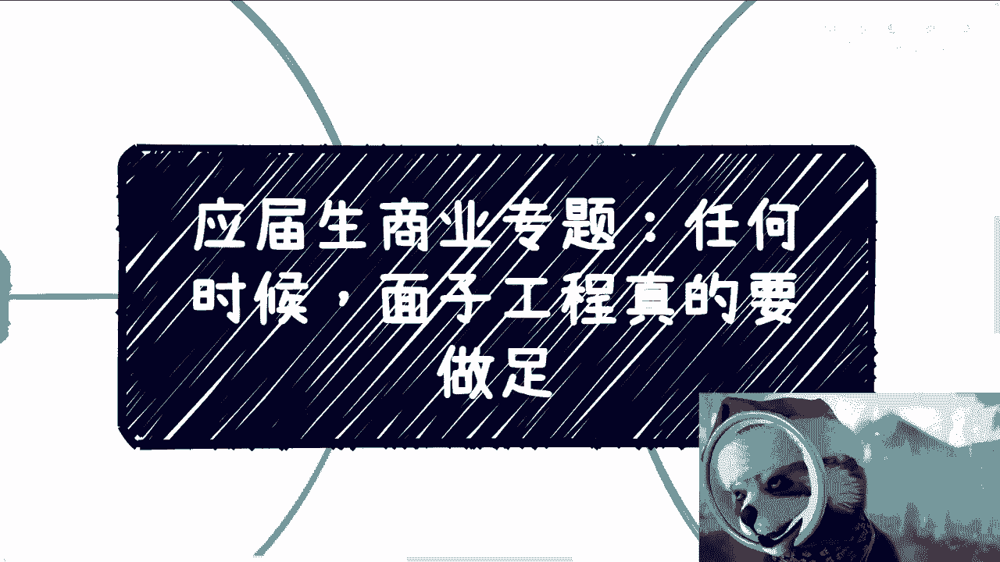

我也懒得改了好吧，反正就这么招吧，啊就这么招吧，啊所以呢你们现在看到这个视频呢，其实应该是第二个啊，明天看到那个视频呢，其实应该是第一个啊，但这个不重要啊，那么本次来讲的呢就是我发现啊。

就是最近这个有很多小伙伴因为咨询完了，也都实践过了嘛对吧，我发现实践下来了，问题呢反正多多少少也都有啊，那么呃我在这个地方再说一下。

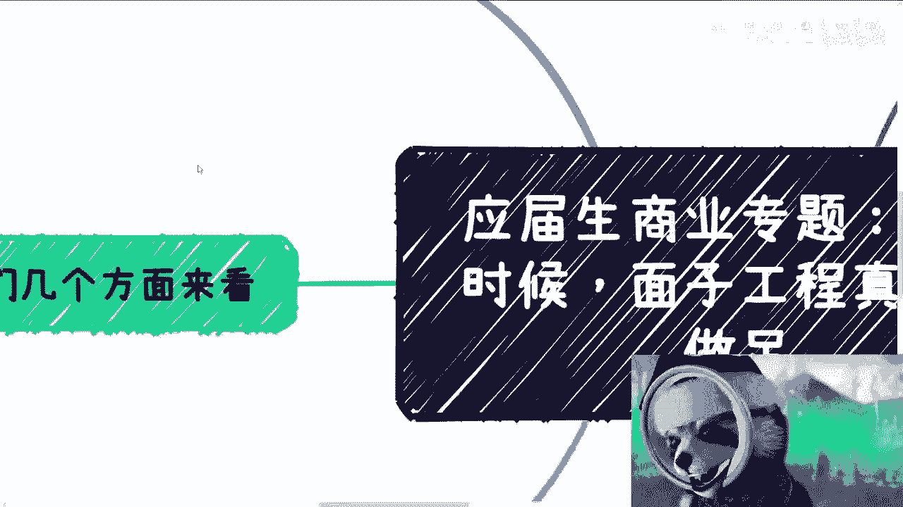

我们从几个方面来讲，首先比如说你做活动啊，比如说你比如说你这样半场活动啊，比如说你去谈个商务啊，比如说你今天去认识一些人啊，再比如说你要做任何的这种。

叫什么赚钱的行为啊，呃那当然了，说到这里呢，我也相信啊，很多人他其实不屑啊，我不屑用这种什么垃圾手段对吧，那不好意思啊，我只能告诉你，那他妈的现在这些商业环境，那只也就吃这些垃圾手段，那没有办法。

我觉得可以没毛病啊，但是呢我觉得大部分人包括我自己对吧，也就是说我们所提供的价值，我们所提供的很多东西，我们没法去凌驾于这个东西啊，这个我最后再来总结一下好吧，首先呢第一点。

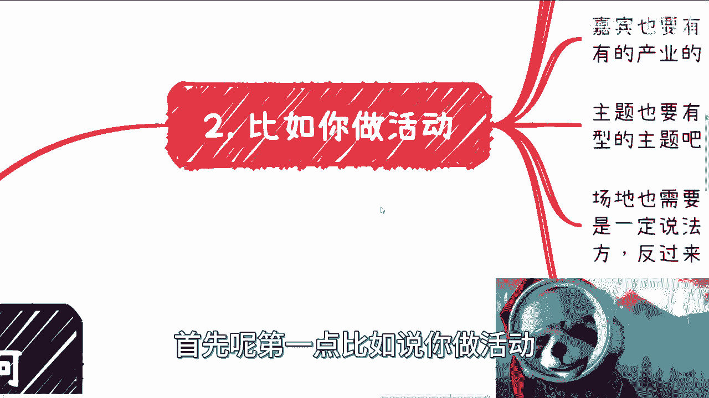

比如说你做活动，比如说海报你得有吧对吧。

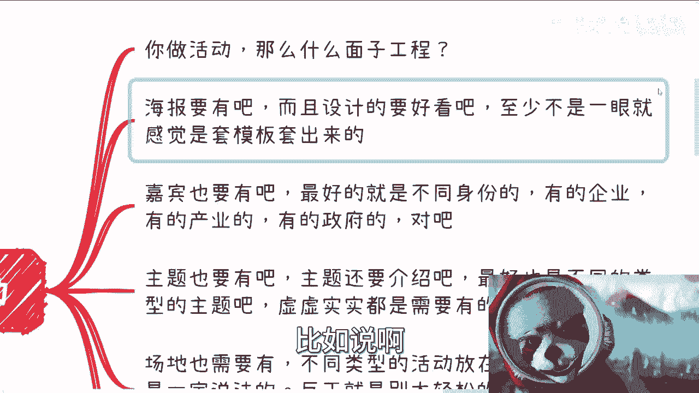

而且呢这个设计好看啊，你的短这个横向的海报，纵向的海报，长海报短海报邀请函对吧啊，各种各样的你该有都得有，而且这海报至少不是一眼就感觉是套模板，套出来了对吧，因为我发现很多人给我看海报有事。

他这个第一眼就感觉是套海报套出来，你就像我现在这个头上套了个东西一样的啊。

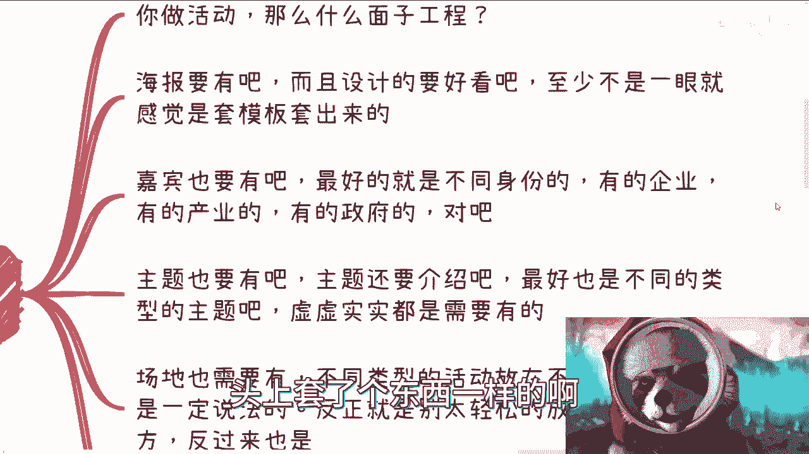

这第一个第二个呢你就说你加冰得有吧对吧，你最好就是不同的身份啊，什么要什么意思呢，就比如说啊有的是民企啊，有的是国企啊，有的是外企啊对吧，有的是这个产业的对吧，有的是政府的，有的是协会的对吧。

你要不同的身份啊。

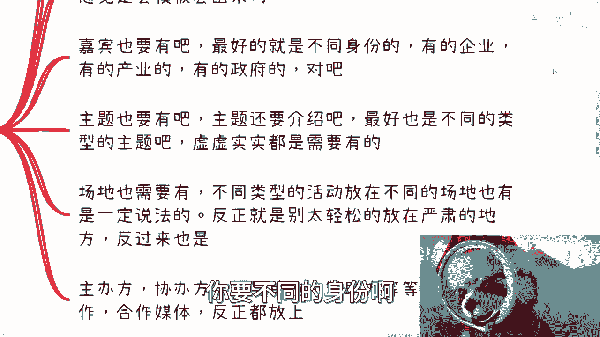

多元化啊，那这个才是一个好的活动啊，那主题也得有吧对吧，那主题还得介绍对吧，最好就是不同类型的主题对吧，你我们打个比方，比如说你这个做元宇宙对吧，那元宇宙你你得有两个产业赋能吧，你得有两个标准吧对吧。

你得有两个全球的案例吧对吧，你得有两个产品吧对吧，你都得有啊，你不得你不能都是什么很虚的东西，在那边那不行，你也不能是很实的东西在里面也不行对吧，虚虚实实都得有啊，那么同样的场地也得有吧对吧。

那不同的类型的活动对吧，放在不同的场地，你也得有一定的说法对吧，你别把一些很严肃的放在很轻松的，你反过来说，把很轻松的放在很严肃的都不行对吧，因为来的人会在想的嘛对吧。

我这个大你要看你面向的什么受众对吧，你要是面向的是一些这个叫什么七老80的，呸啊，四五十的这种对吧，那么你可能总会弄一些，看上去不要太花里胡哨的对吧，然后这个规规规规矩矩的对吧，这这个叫什么。

就是比较传统的模式，那你要面向都是一些年轻人对吧，你搞那些非常严肃的人，人家怕都怕了，来都不来对吧，那你接下来主办方协办方指导单位对吧，赞助方战略合作和合作媒体对吧，就说白了别人有的我们得有。

别人没有的，我们也得有对吧，你不能说啊，别人有的我们没有啊，别人没有的，那我们也没有，那这个还玩啥呢，对不对啊，对吧。

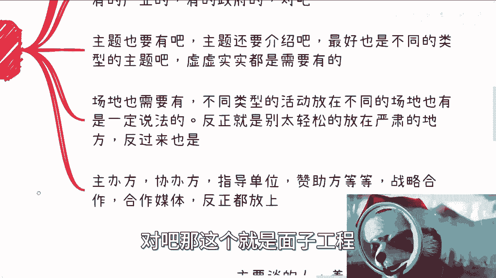

那么我们从活动角度来讲呢，就像我们刚刚说的，除了呃除了海报以外对吧，我们其实还得有活动方案，那比如说一个word啊，一个PPDF啊对吧，包括赞助方案对吧，就是说你配套的文件该有都得有啊。

该该就是该是图片的，不能是文字对吧，该是文字的，不能嘴说对吧，你就是该省的一个都不能省啊。

没有办法的。

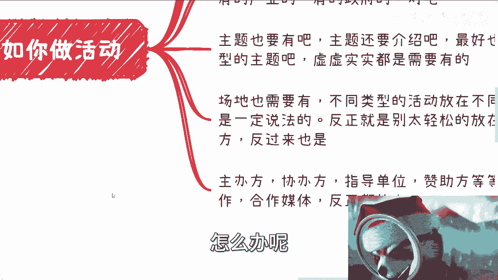

对吧好对吧，那第二点啊，比如说你去谈商务啊。

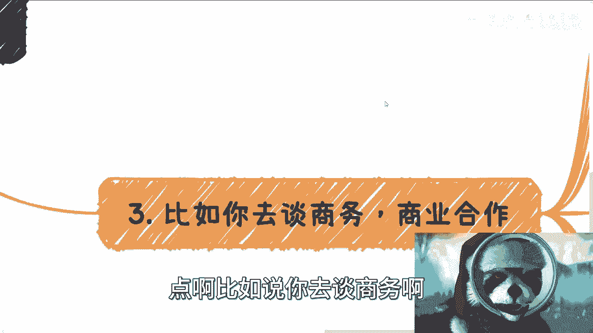

商业商业合作，主要谈的这个人啊，你着装你总要正正规一点吧，我不说你多贵的西装吧，你总得套西装吧，对吧啊，你不能太休闲吧，穿了个T恤衫跑过去了，那还谈什么东西对吧，这个不是我跟你们这么讲吧。

这个并不是说一定要这样子，而是说你这样子是出于对对方的尊重，也是对这个场合的尊重对吧，你自己都不尊重，那对方怎么会来尊重这么一个场合，或者这么一个生意呢对吧，尤其是第一次啊，那这是第一方面。

第二方面就是说你介绍自己的业务，和介绍这次合作的业务，所有的介绍的PPT和PDF你都得有啊，对吧你就是很简单，你跑过去一般谈商业对吧，20分钟对吧，前10分钟啊，我比如说前5分钟。

我介绍一下自己业务就过来对吧，那么接下来15分钟，主要就是来谈这个合作对吧，而且就是说谈东晓是这样子的，不是讨价，还不是一开始说讨价还价，就好像哎那个谁对吧，我跟你这么合作啊，啊你看行不行啊，不是的哦。

你我跟你讲他商业合作更像一种强买强卖，就是什么呢，就是我就告诉你，我就这么个合作啊，然后呢我已经把我我方跟乙方对吧，双方的这个利益，包括大家所要的很多条件对吧，怎么样都已经说清楚了，你看行不行对吧。

你要觉得不行，那你说这里面有什么问题对吧，什么意思呢，也就是说你得把主动权掌握下来，你不要把貔貅踢过去，你知道吧，你就说我已经把这个条条框框把你定好了啊，就这个样子，你要么就不合作，你要愿意合作。

你就告诉我这里面怎么改，这就结束了，你但凡把自己都想不清楚的，你把这个东西什么扔给别人对吧。

那还怎么弄对吧，那么PPTPDF里面，说白了就是尽可能的把对方的疑问都解决清楚，我跟你讲，最牛逼的这个商业合作是什么，就是你讲完一套一顿操作猛如虎之后，你问对方啊，对方有什么问题，对方表示毫无。

毫无疑问直接开始干，那就是最牛逼的对吧，那你你这个pd啊，而且我跟你讲，你时间不能长对吧，你比如说就十到15分钟，那么你这十到15分钟你要说清楚啊，我们能做什么，我们赚的什么钱，赚谁的钱，周期是多少。

投入多少，回款，什么时候对方能做什么，对方能获得什么，而这件事情除了对我们双方以外，对剩下的周边有什么影响，对国家对产业都有什么帮助，你要说清楚的对吧，也就是说你不能只说实的。

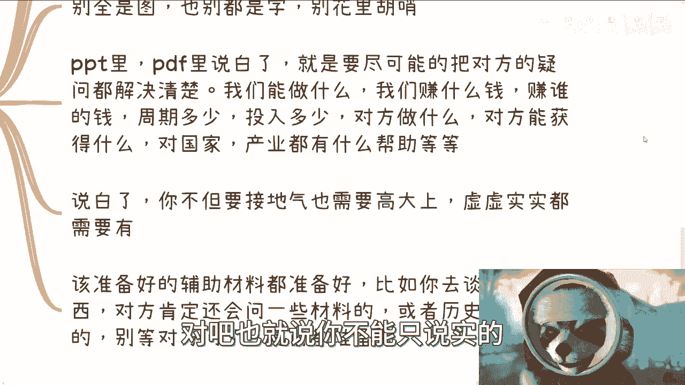

你说虚的也得说说嘛对吧，你说白了你不但要接地气，你还得高大上，你不对，高大上你还得天马行空，什么都得有对吧，你虚实实时都要有对吧，那么说白了就是说剩下还有一点是什么呢，该准备好的辅助材料都得准备好。

你比如说啊，你说我今天自我介绍完了对吧，然后介绍这个大家合作，那你介绍完了，我跟你讲啊，你可能心里面也会觉得啊，对方可能还会问你要点东西对吧，比如说什么哎，你有没有那个那个那个切入点的方案啊对吧。

你们以前有没有什么合作案例啊对吧，有没有什么东西啊对吧，就怎么样的，你就都准备好对吧，你比如说对方肯定还会问一些材料，或者历史案例，就准备好，你别等别等对方问你知道吗啊，你等对方问这个东西就被动了。

那当然了，你说呀就像我们刚刚讲的，你说这个PPT对吧，这个辅助材料有没有多大作用，说难听点，现场你发给他，可能也就发给他，你说他会不会看，他可能都不会看，你说他以后会不会看，他以后说不定也不会看。

说不定这个文件就在微信里面过期了，但是你得有啊。

那怎么办呢，对不对啊，当然也有人要说了，他说我我就不想这么做对吧，就像以前这个之前有谁哪个人说的，这个大家都说啊，我作为一个年轻人对吧，我不想被这种腐朽的这种东西所困住，可以啊。

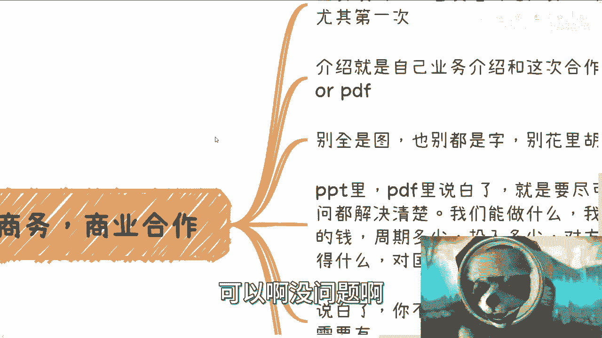

没问题啊，你有资本不来，对不对啊。

也不是富二代，我们啥都没有，那我们刚什么东西呢，没什么好刚的，刚不动的呀，对不对，那再比如说你去认识人对吧，你说你自我介绍的Pdf p word总该有吧对吧，你商业简历简单一点就是你的title。

你的背景，你核心的业务，你业务的呃，呃你核心的业务成就，你打你以前做过哪些事情对吧，说白了就是别人通过可能那么呃两二分之一，13的A4纸这么一个这么一个篇幅对吧，你你别人看完之后就得明白哦，你能做什么。

你的核心价值是什么啊，你别洋洋洒洒写人家堆，别人根本就不知道重点是啥，对吧哦，你跟别人说我很牛逼对吧，我既能做A也能做B也能做C也能做D，那结果就是我知道了，就别人的印象当中。

就是你什么都不能做就结束了，毫无重点，对不对，没有意义的呀啊然后还有是什么呢，就剩下，其实呃，除了那个三分之一二分之一的篇幅以外对吧，剩下的你就可以写一些你做过的项目啊，啊你的一些历史案例啊对吧。

主要就是秀肌肉啊，就告诉别人你多牛逼啊。

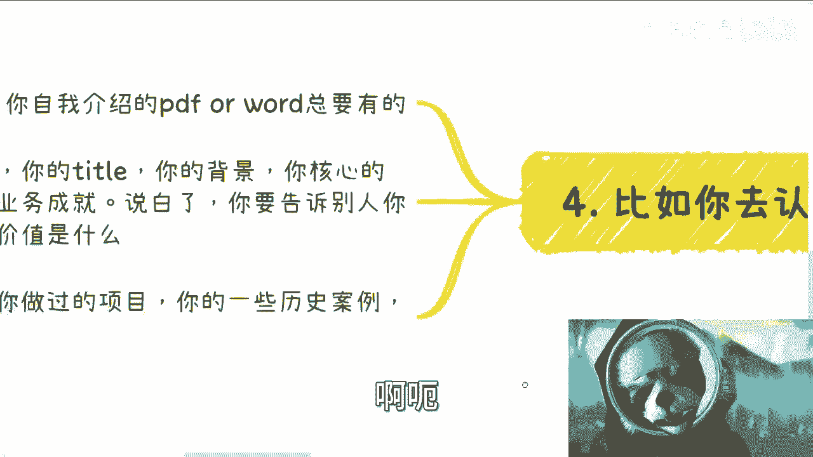

好那么我们回过头来啊。

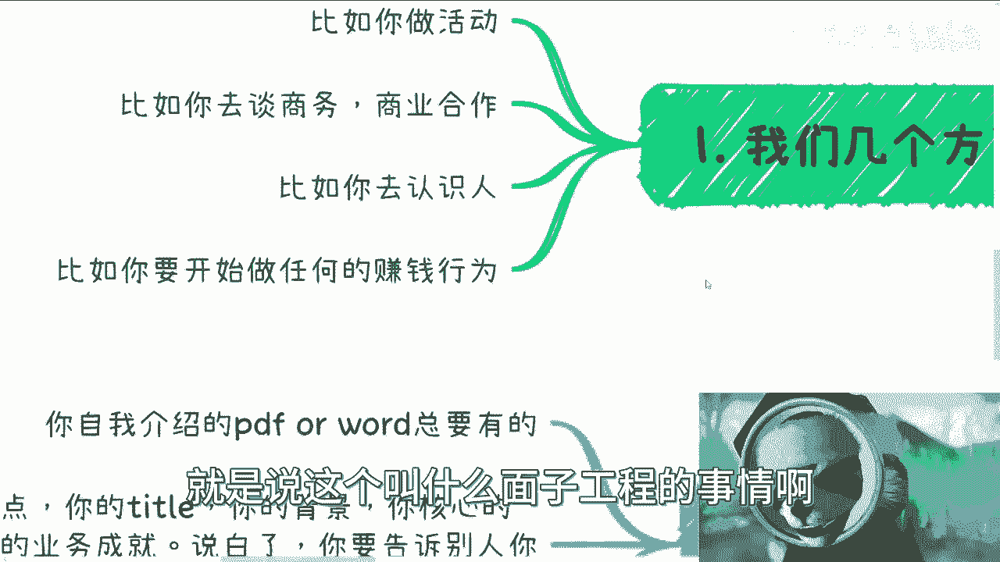

这个东西呢还是那句话啊，就是说我们哎呀我对我还没讲完呢，真的是啊。

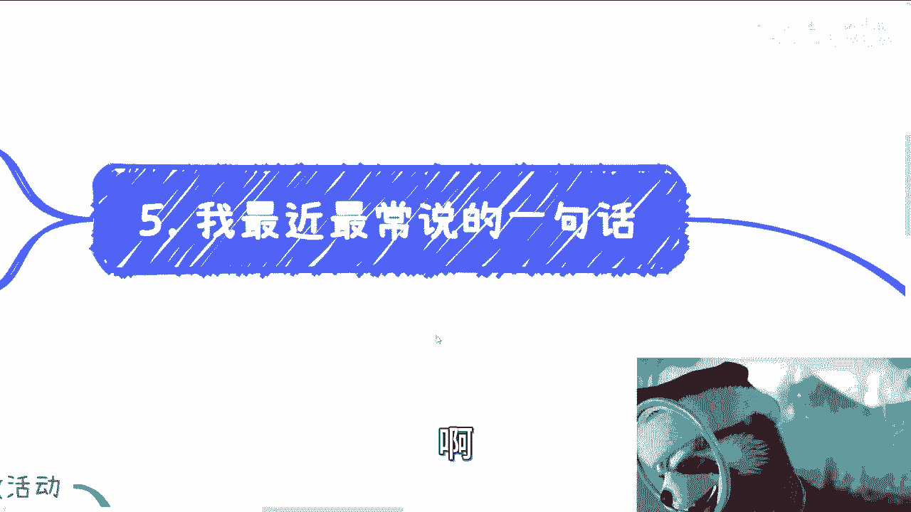

我最近最常说的一句话是什么呢，就是什么是老百姓，老百姓就是啊我最怕啊大家出来啊，比如说要赚钱最怕的是什么呢，就卷正规的去卷也卷不过人家啊，走野路子一也不过别人，这就是我最怕的就是上限嘛很低，下限嘛很高。

你知道吗啊这个就是最神奇的啊，那么其实很多时候我跟你们讲啊，就是大家真的应该去学习学习别人啊，我不管是正规的，比如说什么什么国企央企啊，做事情啊，这政府协会做事情对吧，或者人家野路子，什么什么传销。

会销直销对吧，这个电销人家做事情你自己去看看，人家那些海报做得多么好，人家的介绍做的多么好，人家这个写的东西，包括知识星球，写的就有那种哎呀我马上就得付款，不付款就哎我跟你们讲啊，我跟你们讲故事。

就以前以前我们去长沙去那个一些小地方啊，就是参加活动，真的我跟你们讲，人家这种会做的多好，你知道吗，就是就是我们在下面听啊，他们在上面讲，就是他们讲完你都有种什么感觉，就是我他妈不付钱，我都感觉的。

我不我枉为人啊，我真的不配做人，就这么呀，怎么办呢，哦然后他还会告他还会很就是友好的告诉你啊，就是你们有带现金吗，没有现金没现金没关系的啊，你看啊，支付宝微信二维码啊，这边可以那个信用卡刷卡啊。

啊这边可以贷款对吧，都可以，卧槽感就痛哭流泪啊，你知道吗，内牛满面，你知道吗，就发自内心的感受到我得付款，我不付款，我都感觉真的我白活这一次，也是啊，但是你想想人家做得多么深入人心啊。

对吧啊当然这个我为了避免大家误解对吧，这个不是说让大家要去学啊，而是说你要取其精华，去其糟粕嘛对吧，就是我发现很多人做事情，就大家现在怎么说呢，就作为一个穿着长衫的人对吧。

好像看不起很多东西的这么一个人，你们做东西真的没有他们好，你知道吗，就真的不如别人好，你你大家真的应该去学习一下哦，呃不仅仅是呃这个PPPT，也不仅仅是这个叫什么，就是穿着打扮也不仅仅是这个海报。

更多的还有什么，还有就是这种话术氛围。

你知道吗啊真的做的真的好啊，真的好，所以啊我们就说啊。

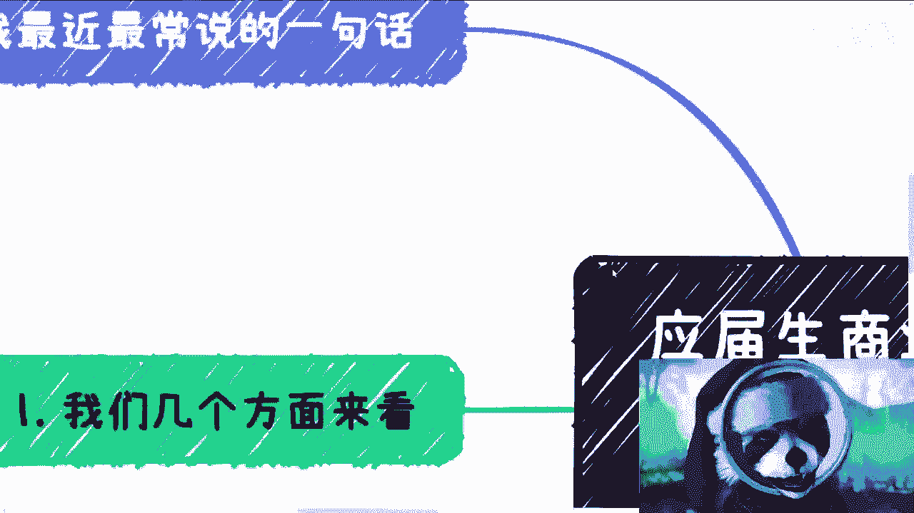

我也说直白一点，需要啊，当我们弱势一方需要迎合对方，需要抱对方大腿的时候，需要没办法的哦，你要你要但凡说别人抱你大腿啊，你要但凡说呃你的东西很硬核，OK啊，没问题啊，要毛面子啊，我跟你讲。

你直接什么什么什么什么短短呃，T恤短裤拖鞋无所谓的啊，对不对，你有没有这个资本吗，好吧好，那么这个当中就是说我给大家列一下啊，这个事呢哎呀要重视啊，虽然很多人看不起，但是要重视行吧啊那就这么着吧，那个。

好吧，然后大家有什么要了解的，也可以私信我哦，也可以评论告诉我啊，然后呢就是说这牌怎么打的啊，包括未来商业怎么做的啊，包括，啊各方面啊，包括各方面，就是想要来了解一下未来怎么个发展好吧。

也可以整理好个人的问题，整理好个人的背景好吧，然后我们走咨询好啦，都随缘好。