# 应届生商业专题 P1：任何时候，面子工程真的很重要 👔

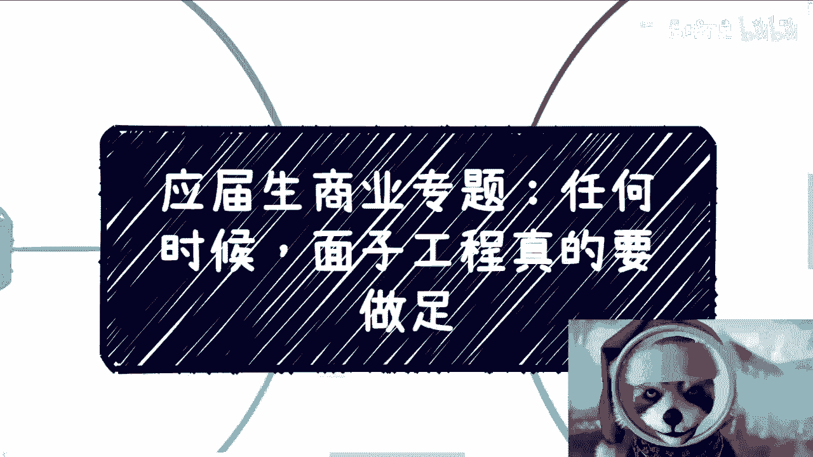

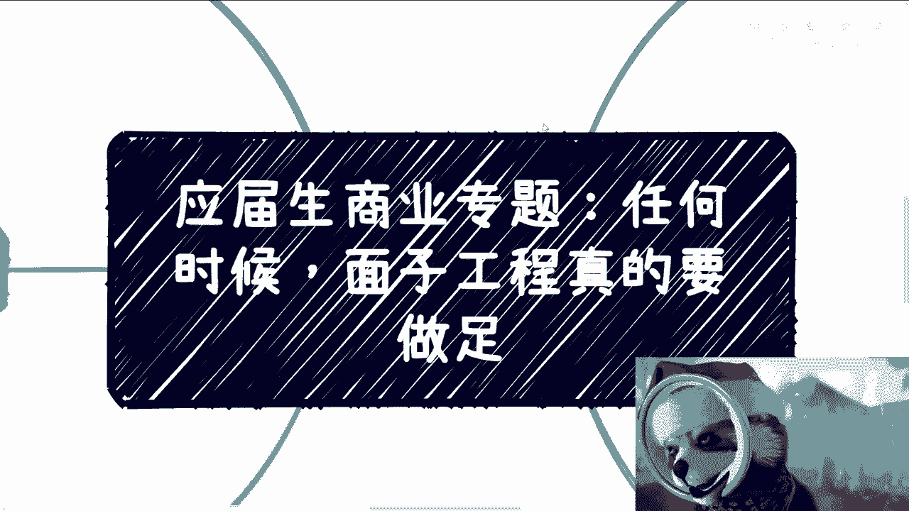

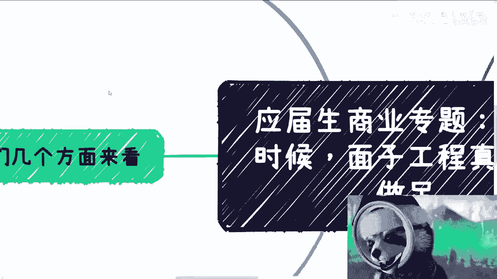

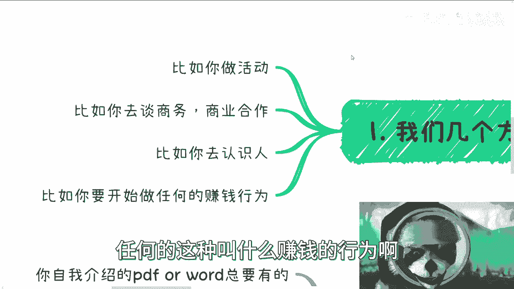

在本节课中，我们将要学习商业活动中“面子工程”的重要性。无论你是组织活动、洽谈商务还是拓展人脉，专业的外在呈现都是建立信任、促成合作的基础。我们将从几个具体场景出发，拆解需要准备哪些材料，以及如何准备。

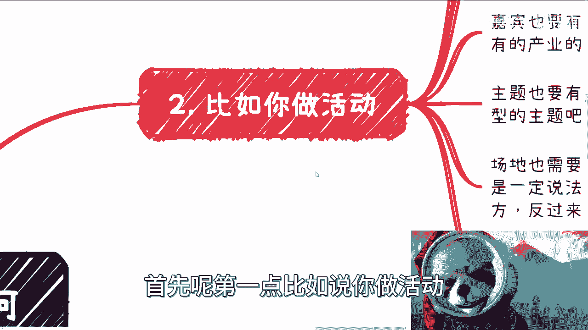

## 1. 组织活动时的必备材料 🎪

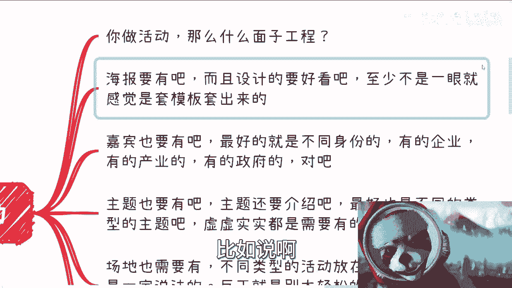

上一节我们概述了面子工程的重要性，本节中我们来看看在组织活动时，具体需要准备哪些“面子”。

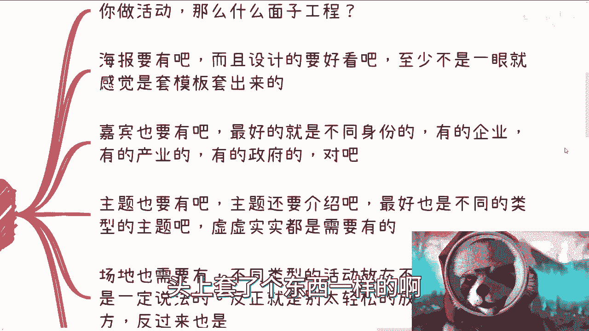

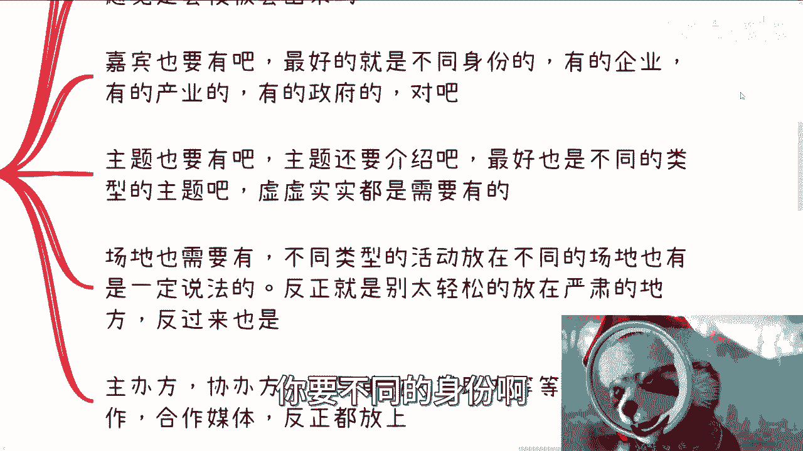

无论是半场活动还是大型会议，专业的视觉和文字材料是基础。这些材料不仅传递信息，更塑造了活动的专业形象和第一印象。

以下是组织一场活动时，必须准备的核心材料清单：

*   **专业的设计物料**：你需要准备横向、纵向、长版、短版等多种规格的海报，以及正式的邀请函。设计不能让人一眼看出是套用简陋的模板，需要具备一定的原创性和美观度。
*   **多元化的嘉宾阵容**：嘉宾身份应尽可能多元化，例如同时涵盖民企、国企、外企、产业专家、政府人员、协会代表等。这能体现活动的层次和影响力。
*   **虚实结合的活动主题**：主题介绍需要既有“实”的落地内容，也有“虚”的愿景展望。例如，一个元宇宙主题的活动，既要有具体的产业赋能案例和产品展示，也要有行业标准探讨和全球视野。
*   **匹配的场地选择**：场地风格需与活动调性及目标受众匹配。面向年长或传统行业受众的活动，应选择规整、严肃的场地；面向年轻人的活动，则可选择更轻松、有活力的空间。
*   **完整的合作方列表**：主办方、协办方、指导单位、赞助方、战略合作伙伴、合作媒体等标识应齐全。别人有的你需要有，别人没有的，你创造条件也要有，这是活动实力的体现。
*   **配套的书面方案**：除了视觉材料，还需准备完整的活动方案（Word/PDF）、赞助方案等配套文件。该用图片展示的不用文字，该书面确认的不能仅靠口头说明。

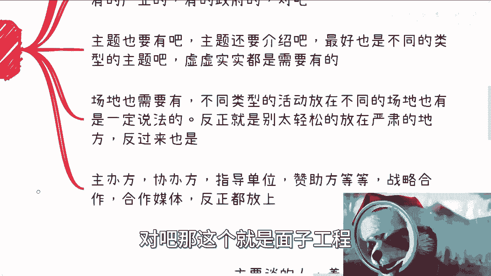

## 2. 商务洽谈时的专业呈现 🤝

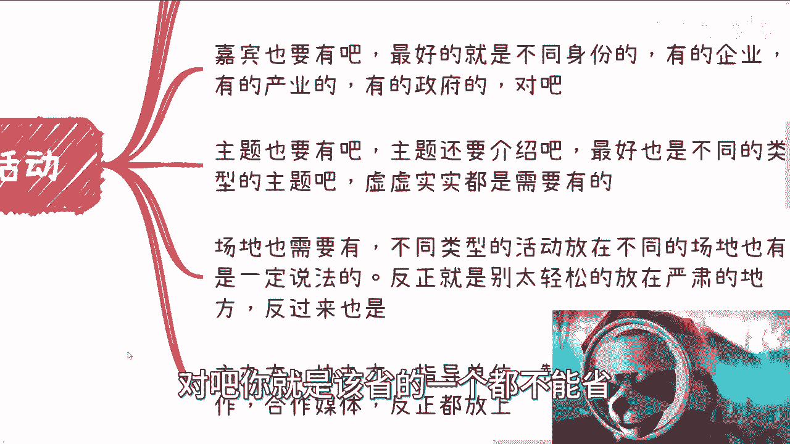

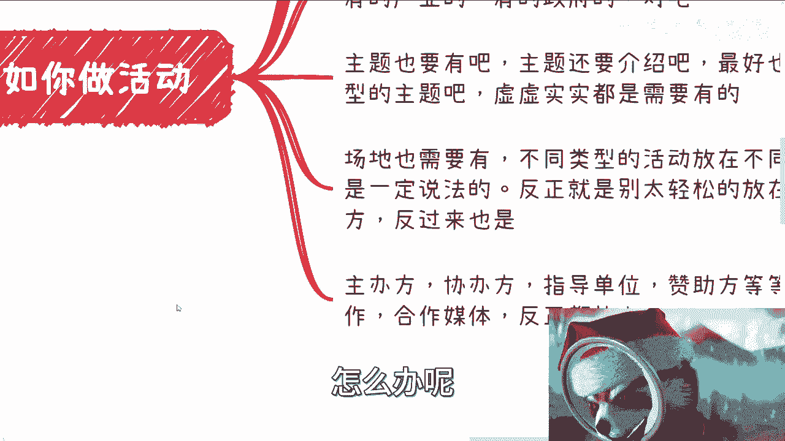

组织活动需要全面的材料支撑，而在面对面的商务洽谈中，专业的个人呈现则更为关键。本节我们来看看如何通过细节赢得对方的尊重与信任。

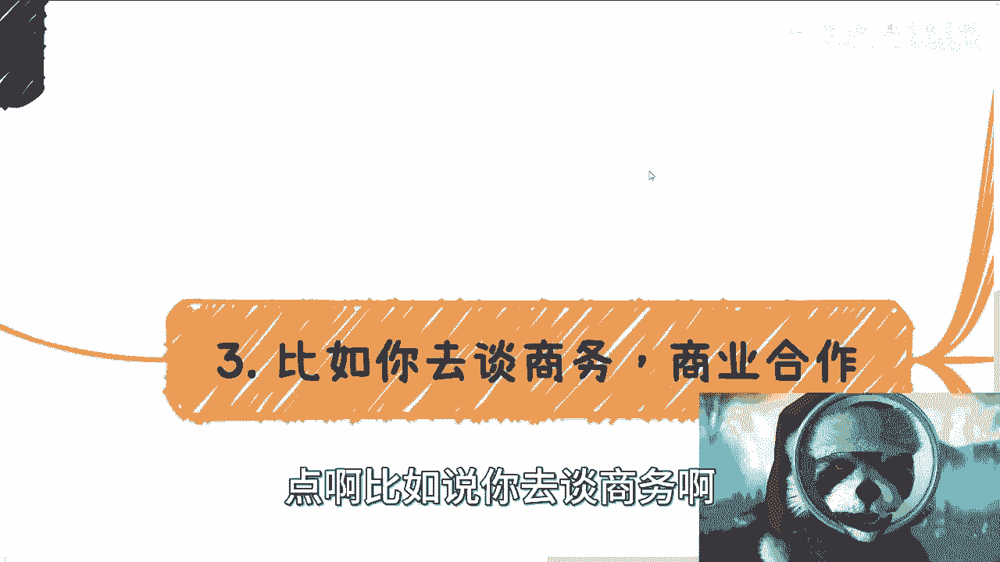

商务合作本质上是价值的交换与信任的建立。得体的着装、清晰的表达和充分的准备，是向对方展示诚意和专业度的最低成本方式。

以下是商务洽谈时必须注意的几个核心要点：

*   **得体的着装**：首次商务会面，着装需正式以示尊重。一套合身的西装是最基本的要求，避免穿着T恤、短裤等过于休闲的服装。
*   **精炼的合作提案**：必须准备一份介绍本次合作的PPT或PDF。提案内容应能在10-15分钟内讲清楚，并遵循“强买强卖”原则——即由你方主导，提出完整的合作框架，让对方在此基础上提出修改意见，而非将问题抛给对方。
*   **提案的核心内容**：一份合格的提案需清晰阐述：我们能做什么、赚谁的钱、周期多长、投入多少、何时回款、对方需做什么、对方能获得什么，以及该项目对行业或社会的潜在价值。要做到**虚实结合**，既接地气，又具备一定高度。
*   **预先准备辅助材料**：提前预判对方可能索要的材料，如详细方案、历史合作案例、资质证明等，并当场备好。不要等对方询问时才去准备，掌握主动权。

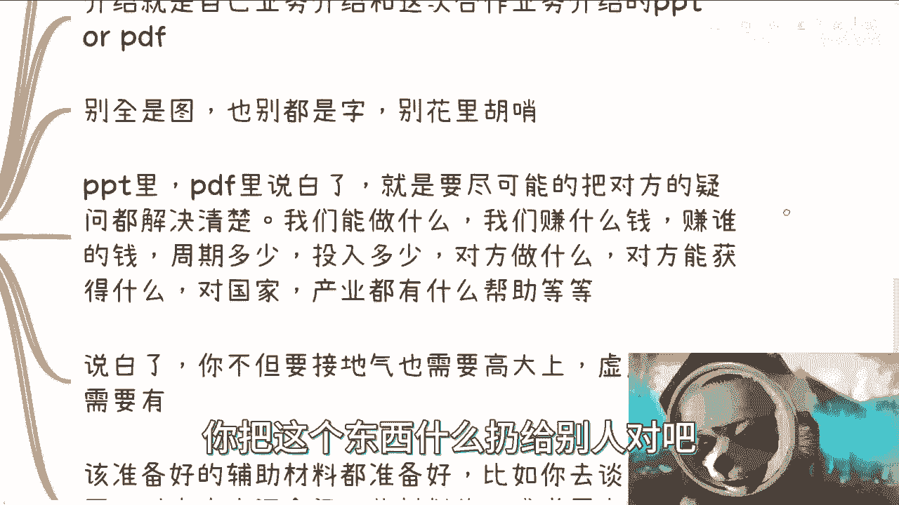

即使对方可能不会立即或永远不会细看这些文件，但“有”和“没有”在专业印象上天差地别。其核心价值公式可以概括为：

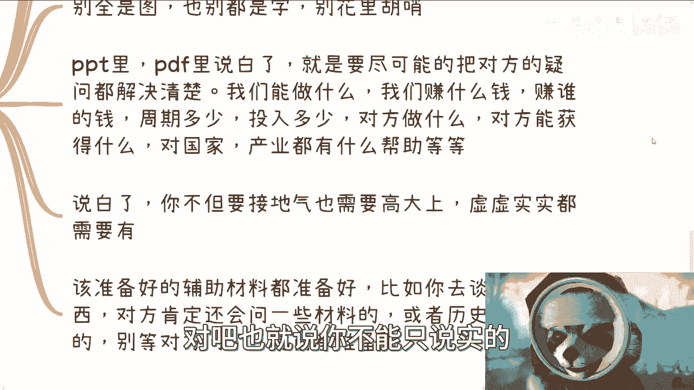

**专业印象 = (得体的着装 + 清晰的提案 + 充分的准备) × 主动性**

## 3. 个人社交与形象展示 📇

在商务洽谈中，我们推销的是项目和合作；而在日常社交中，我们推销的则是自己。本节我们来探讨如何高效地进行个人形象展示。

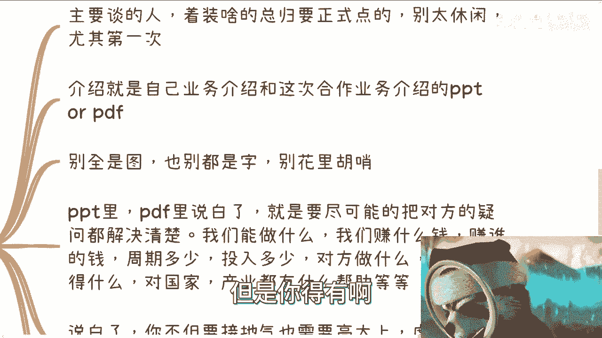

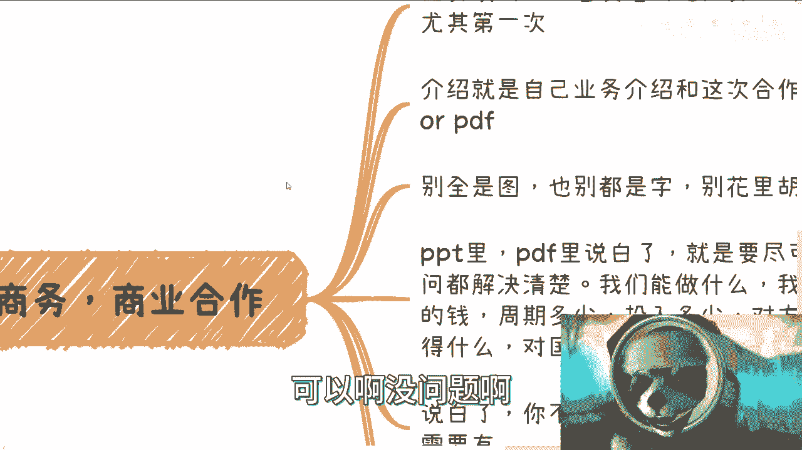

无论是线下结识新朋友，还是线上进行业务交流，一份精炼的个人介绍材料至关重要。它相当于你的商业名片，需要在极短时间内让对方抓住你的核心价值。

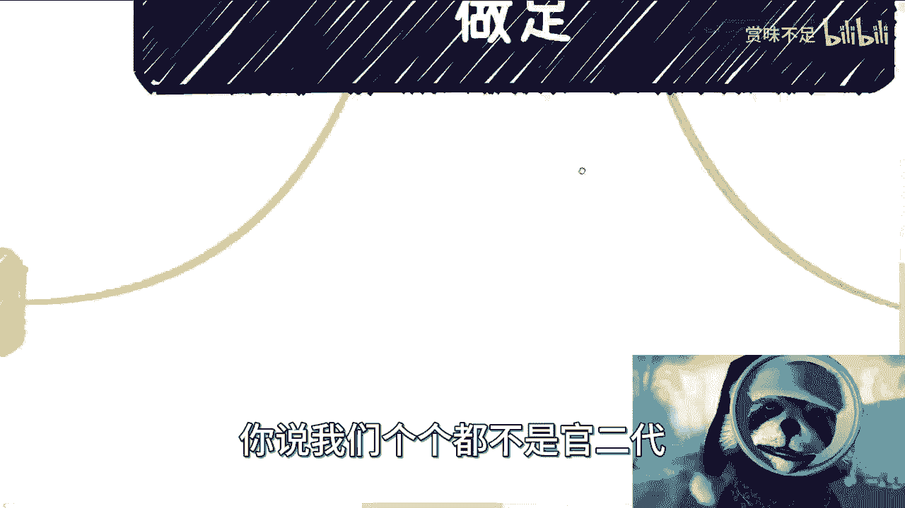

以下是准备个人介绍材料时的关键原则：

*   **精炼的核心简历**：准备一份篇幅约半页A4纸的个人简介。内容需聚焦于：你的核心Title（职位/头衔）、背景、核心业务及关键成就。目标是让人快速了解“你能做什么”和“你的独特价值”。
*   **避免面面俱到**：切忌罗列所有技能和经历。内容过于分散会导致重点模糊，给人留下“什么都会一点，但都不精通”的印象。核心法则是：**少即是多，聚焦胜于泛泛**。
*   **完整的案例展示**：在核心简历之外，可另行准备一份更详细的文档或作品集，用于展示你做过的重点项目和历史案例。这部分用于“秀肌肉”，深度证明你的能力。

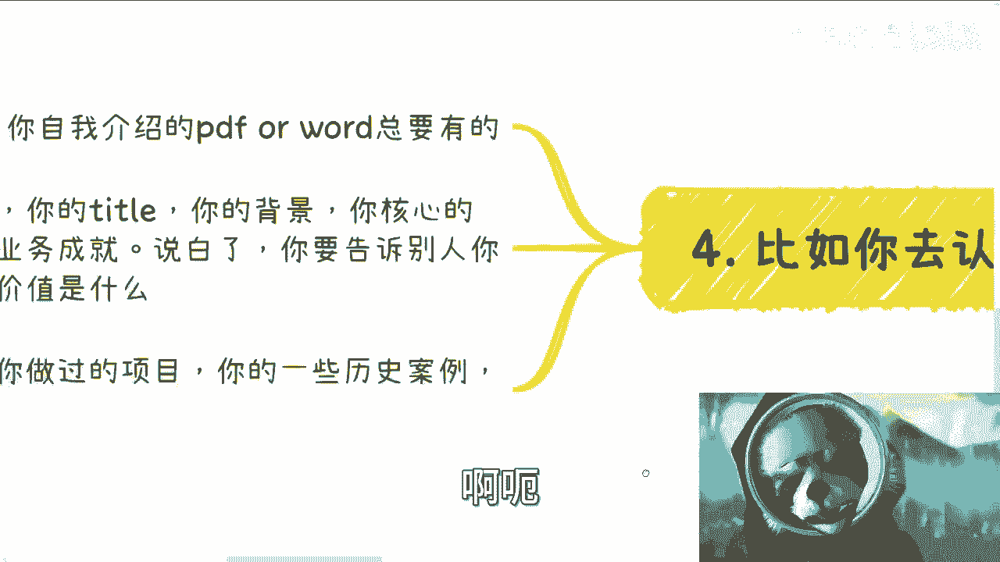

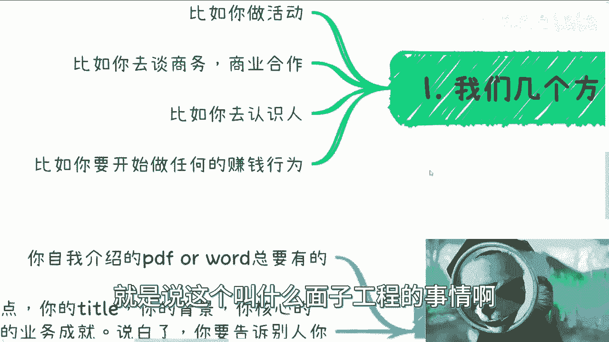

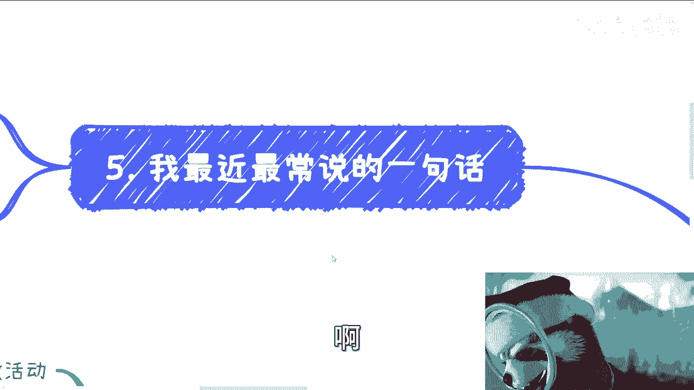

## 4. 心态调整：取其精华，为我所用 💡

我们介绍了在不同场景下需要准备的具体“面子”，但比方法更重要的是心态。许多人对形式主义不屑一顾，但现实商业环境往往吃这一套。

一个残酷的现实是：很多人在“正规军”的赛道上卷不过顶尖选手，在“野路子”的灵活度上又不如草根玩家，导致“上限不高，下限不低”，处境尴尬。

因此，我们应该以开放的心态向所有做得好的人学习，无论是严谨的国企、政府，还是那些在营销、会销上做得极其深入的个人或组织。观察他们如何设计海报、如何撰写打动人的文案、如何营造现场氛围、如何设计话术。

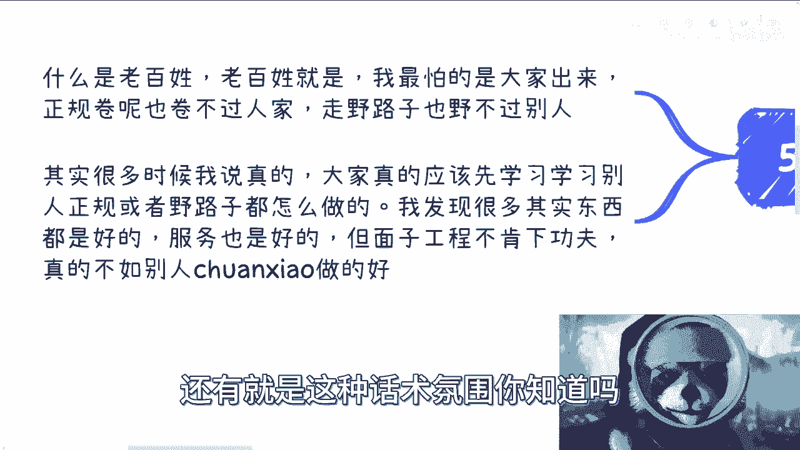

**学习的核心是“取其精华，去其糟粕”**。我们无需认同其所有价值观或手段，但可以借鉴其打动人心、呈现价值的方法论。当你处于需要争取资源、寻求合作的弱势一方时，主动完善“面子工程”是表达尊重、赢得机会的必要成本。

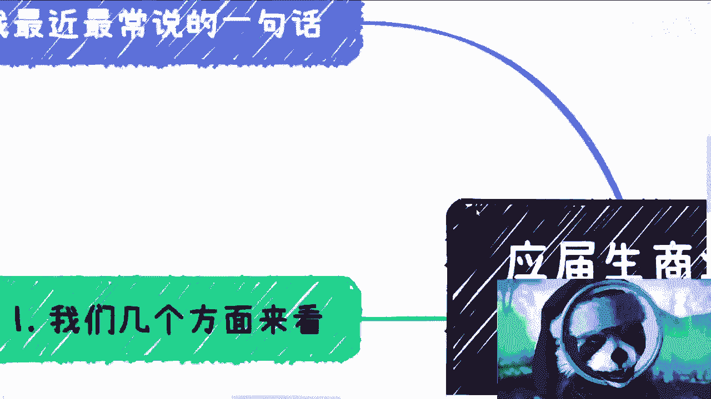

当然，如果你的产品或实力足够硬核，达到了“别人求着你合作”的境界，那么你确实可以拥有更大的随意性。但在此之前，请务必重视这些看似繁琐的细节。

本节课中我们一起学习了商业活动中“面子工程”的全面应用。我们从**活动筹备**、**商务洽谈**、**个人展示**三个具体场景出发，拆解了需要准备的材料和注意事项，并最终强调了**调整心态、博采众长**的重要性。请记住，专业的呈现不是虚伪，而是降低他人的认知成本，高效传递价值的手段。在实力相当的情况下，细节往往决定成败。