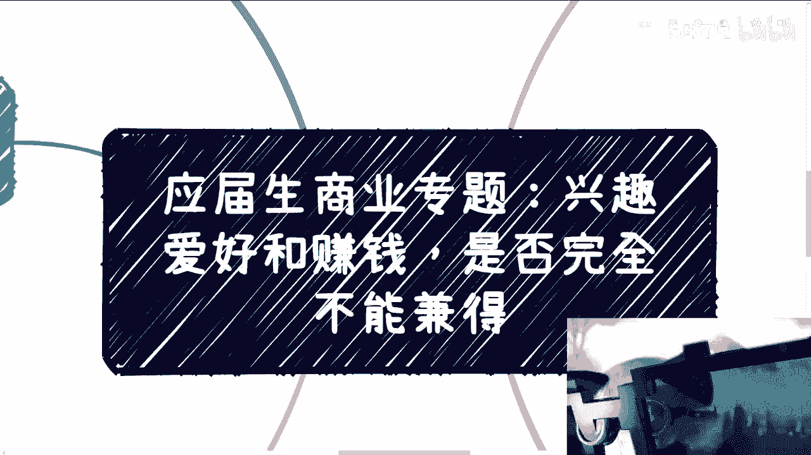
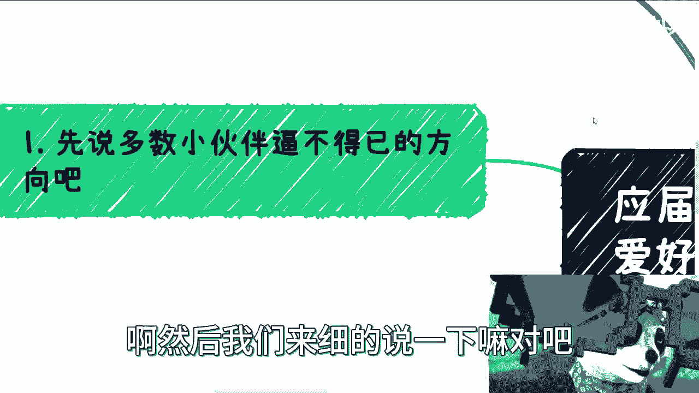
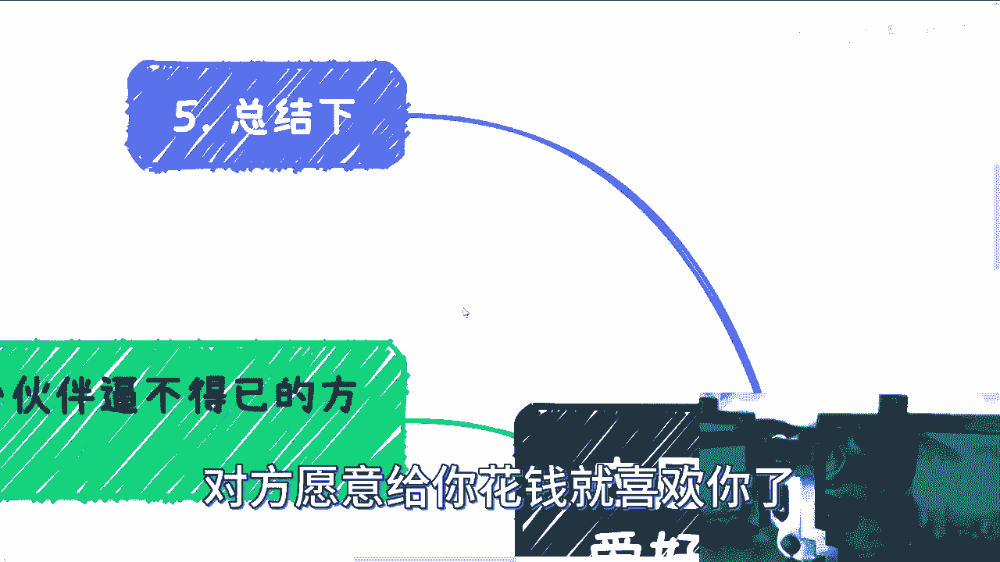

# 应届生商业专题：兴趣爱好和赚钱，是否完全不能兼得 - P1 - 赏味不足 - BV1g841167aP

啊大家好啊，这个前两天有小伙伴问啊，他说这个兴趣爱好和赚钱是否可以兼得对吧，然后呃这个也有在评论区有提到啊，就是说我现在做这个专业啊，或者我现在做的什么自媒体啊对吧。

开的什么店啊对吧，可能是自己的这个兴趣爱好，基本上可能游戏啊，二次元周边啊可能会比较多啊，这个呢啊我觉得我们可以来谈一下啊，首先第一个啊，先说多数小伙伴逼不得已的方向啊。

逼不得已方向对吧，呃一个是家庭产业，是因为现在咨询下来呢，我说实话啊，这家庭有家庭产业的人不少啊，啊至少反正我这边不少啊，这个我不但肯定也不是基本盘啊，这其实算好的对吧。

因为我觉得基本上呢你算有条后路呃，家庭产业这个事儿呢，我说实话我补充一点啊，就是说呃因为以前的就是你爸妈打下的江山呃，所处的这个时代跟天时地利人和的环境，跟现在以及你未来所碰到的这个环境。

肯定是不一样的，那也就是说呢，就是说呃，在未来的这种这种就是刺刀见红的对吧，这种环境当中呢，就是如果你要去接手啊，难度很高啊，就跟你爸妈当时的那个环境我估计很不一样，那这是第一点，第二点是什么呢。

就是呃你还是需要对行业，就是你如果去接手一个家庭产业，你会发现你不但要对商业很了解，你还得对这个产业所在的领域，所在的行业很了解，那这个东西其实对于大部分来大部分人来讲，它难度很高，因为呃就是家庭产业。

家族产业对吧，或者说一些生意呃，你爸妈跟你走的路线毕竟不一样，就你爸妈可能是从小就打拼啊，从小就是说接触社会就接地气，但是现在的这个很多年轻人呢，他就是从小不接地气啊，然后这个不接地气呢。

一方面是家庭可能保护的太好，第二方面就是9年制义务教育到高等教育，反正就是不接就不接地气啊，也不是说不接商业地区是什么地气都不接啊，所以这个东西其实我觉得是蛮有难度的啊，呃这是第一个。

当然啊我我有一说一，我觉得又有家族产业，家庭产业的人来找我咨询呢，呃他们的想法往往都比较的成熟，也就是说，对也就是说，对吧，也就是说基本上啊用我的话来讲，就是对自己蛮有逼数的啊，就是就是我们很简单嘛。

我们得要知道自己哪哪方面写哪方面不行吗，对吧，那你不能盲目自信了啊，那这是第一点，第二点呢就兴趣爱好，兴趣爱好呢，我觉得这个就是要看要看什么兴趣爱好啊，那么第三个方向，第三个呢就专业方向的。

不过大部分专业方向呢也不是自己选的啊，第三个就是专业方向，专业方向呢，不过大部分专业方向呢，其实也不是自己选的对吧，都是家长选的，那你说选下来你是不是自己喜欢或者怎么样呢。

说实话这个东西就是呃你说我们喜欢什么，可能很多人不知道，但是我不喜欢什么，我们还是知道的对吧。

那么最后一点呢，就这个关于兴趣爱好跟钱能不能兼得啊，然后我们来细的说一下嘛对吧。

第二首先第一个呢就是这个兴趣爱好跟赚钱，对不对，你看啊，这事儿呢其实分成好几部分啊，哪方面呢，就首先最合理的状态就是你的兴趣爱好，本身就是个比较宏观的，就是个比较宏观的一个爱好对吧。

你比如说你说心理学对吧，玄学对吧，或者说什么赚钱对吧，或者说什么什么什么什么这个叉叉咨询对吧，心理咨询对吧，也可以啊，那么然后呢，同时呢就是说你又具备了一定的营销能力。

那么我就跟你说congratulation对吧，就基本上你你就可以赚钱，或者说你有这个赚钱的基础啊，你能不能赚钱再说啊，那这是第一种，那如果你跟我讲，你是有种特别就是直观的兴趣爱好对吧。

那你比如说你说就比较比较直接的啊，就比如说什么什么什么什么我就对嗯，首饰对吧，金银金银珠宝对吧，然后我对画画啊，我对什么就比较感兴趣对吧好，那这个东西呢你要真的跟赚钱挂钩就很难啊，就很难。

因为因为也很简单，就像我们说的，就是说你从技能点角度来讲，你喜欢这个东西是喜欢，但是你要把它变现啊，这个东西先不说你有没有能力把它变现啊，你真的把它变现了，那这个东西跟你喜欢的东西，也不是一个东西对吧。

你就像你就像有小伙伴说，他说我喜欢玩游戏对吧，我能不能做个游戏的up主对吧，或者说这个做个游戏的什么相关的啊，带带货对吧，但是你想啊谁不想做呢对吧，我也想啊，我也想每天他妈的打打星际。

打打这个这个叫什么啊，帝国对吧，打打各种各样有的没的，我带点货不香吗对吧，但问题是你想啊，你做这件事情本身能不能做成，咱不去说他啊，你做这件事情本身他的备货该带货要带货，该去验货，要验货对吧。

该去沟通要沟通，该谈分论怎么谈，该谈了就要去谈，该签合同怎么签就怎么签，对不对，这些其实对你来讲还是烦的事情对吧，就真正你的爱好本身，只不过是能够让你可能有更好的自驱力，去做这件事情。

但是你会发现大部分的这个时间，可能你的时间并不是花在你感兴趣这个东西，上面对吧，你要说完全不管不顾，那前两天那个翻车的对吧，我也给你们分析过了，反正就这么个事儿啊，那么商业运作呢，其实就是说啊。

永远是不可能像你原本的那个兴趣爱好，这么快乐对吧，或者是这么单纯是没办法的事，对吧，那么赚钱本身呢我曾经总结过啊，无非是切中重点啊，切中痛点，冲动消费啊，心理安慰，薅羊毛对吧，你无非就这么些东西了。

没烂啊，但是我就跟你讲，无论切什么点啊，这个东西都跟我们个人的兴趣爱好没啥关系，你自己想想看对吧，可能当下能切的兴趣爱好是什么，赚钱啊，没了啊，最好切啊，你怎么切大家都开心对吧。

但是你说你你你无论什么切入点，难道说啊跟我们这个画画有关啊，跟我们这个这个写字有关，跟我们视频有关没有关系啊，啊大部分人的技能点他是很散的，甚至没有技能点对吧，那你的爱好，你的专业。

你赚钱的方向就是你现在工作方向，你能够给你带来温饱的方向，这往往是三个方向毫无交集啊对吧，这这是这这这才是老百姓，这才是现状对吧，所以说啊比较合理的是什么呢，就是工作，我觉得就心态上面来讲。

或者我们的安排上面来讲，工作他就是份工作，你别让他去影响我们的心情啊，什么叫别响我们心情，就是我不对你抱太大希望，我也你也别来什么太来challenge，我就他来他来搞，我对吧，就很简单。

我就这么个人啊，就是也不要说一定要像零零后什么，整顿职场无所谓，就是我你不来惹我，我也不来惹你就结束了，你给我多少钱，我干多少活，就这么简单对吧，那我以前就说的很清楚，就是什么。

就是如果我们今天要去卷一个很牛逼的工作，的确那很难找，那我卷一个不牛逼的工作怎么办呢，我还找不到吗，啊我也不信了对吧，我没什么高的要求，我能找份工作，我还找不到吗，我他妈这就要就直接往下降嘛，对不对。

那大部分人不愿意往下降的原因是什么，因为它的成本，它的沉没成本太高了对吧，他觉得我9年制义务教育加高等教育读出来，卧槽就他妈这点工资吗，那不好意思，没办法，那社会就这个样子怎么办呢，对吧啊。

那么兴趣爱好本身能给我们带来的是正能量啊，或者是中和负面情绪的一些行为，那这个东西我们该有的还是要有对吧，而第三个行为就是赚钱，赚钱本身你得去明白他的乐趣，其实有很多人我跟你讲啊，有些咨询的。

有些咨询的小伙伴啊，其实他会这么跟我讲，他说我其实没有那么大的欲望，你知道吧，就是我不是说他钱够用啊，就是他也没这么大的消费力，他也没有什么物质上或者什么很大的这种欲望，你知道吧，他就会说啊。

他说他说哎，我感觉我没有太大动力，你知道吧，怎么样怎么样，啊那么关于这一点啊，我其实在这个地方得要强调一下是什么，其实我这么跟你们讲赚钱这件事情，你可以对钱和物质没有太大欲望，我觉得没问题。

但是并不代表你不要去赚钱，什么意思啊，就是说你身边所碰到的人，你的圈子，你所要结识到那些，比如说更有趣的人或者怎么样子，你可能目的性是那些有趣的人，你的目的性可能是更高的圈子。

但是你要接触到这些人或更高的圈子，跟你能赚钱的能力一定是成正比的对吧，我不管你有没有欲望，但是如果你不去，不去参与那些高利润高高净值的这些项目，你怎么去认识那些人，你怎么去认识这种有趣的有有趣的灵魂。

有钱的灵魂，哼哼对吧，有钱的家庭不可能的呀，对不了，那这是第一点，赚钱只不过是一个方式，而且是一个避无可避的方式对吧，而且另外一点是什么呢，就是你会发现赚钱这个过程啊非常的interesting。

对吧啊，这个过程interesting啊，我们来看啊，就是其实对大部分人来讲啊，我跟你们这么说，大部分人来讲对吧，你本科出来，硕士出来，博士出来，你很多时候，对于大家来讲，不管你几岁啊。

你出来其实都是一个完完全全探索，就去探索一个新世界的这么一个过程，为什么呢，因为你一无所知啊对吧，你你对你对学校以外，对你家庭以外对了，对于打工以外的所有事物一无所知对吧。

那么如果你对那些未知的事物和人性感兴趣，那么我跟你讲啊，你的兴趣点很适合赚钱，哎就很好玩，你知道吧，就为什么我乐此不疲呢，就是因为你说谁都会说自己喜欢赚钱，但是我觉得相比赚钱，他更刺激的。

更好玩的是这个过程，因为这个过程你会看到各种人，各种事你知道吗，就像我现在身边有很多小伙伴对吧，就是咨询完了之后，他们会时不时打语音给我，就跟我说什么，他说哎我今天给你讲个好玩的事情啊。

然后就就各种就是感叹哦，原来还能这样对吧，原来然后感叹，原原本原来自己以前他妈就是个对吧，就他妈太工程思维，工程师思维等等等等等，你知道吧，就我们其实多问问自己赚钱这个事对吧，就是说对象可能是政府。

可能是企业，可能是个人，对不对，好你多问问自己啊，第一点，他们的钱哪里来的啊，我们经常说钱不是天上刮下来的，那不好意思，事实上你真的去做，你会发现他拉的很多时候，甲方的钱的确是天上刮下来的哦。

所以好赚哦，所以好赚，所以他的溢价溢价空间很高，因为为什么，因为对方不care啊对吧，那么你会发现interesting在哪里，interesting就是我们要去找啊，这个世界当中。

这个社会当中有哪些地方钱是刮出来的，对不对啊，那么这是第一个，第二个，你比如说赚钱这个事儿对吧，是你自己赚的，还是大家一起赚呢，也很interesting对吧，你以为大家一起赚钱。

是大家各司其职的去做项目交付啊，做一些什么东西，那实际上是大家一起讨论，通过各种你没有见过的方式对吧，去套钱或者去薅羊毛，你不觉得很好玩吗对吧，就是诶对吧，就又能规避这个诶。

又能规避那个哎又能怎么样怎么样，哎就很interesting，对不对啊，那么关于很多人所谓的风险呢，其实都是自己被割之后才会发现发现啊，其实所谓的风险都是自己YY出来的，我不是说没有风险。

有都是有的对吧，但是问题是，这些风险发生在你身上的概率有多少对吧，或者说真正被就是执行的概率又有多少对吧，就是你真的做了很多，你就会发现其实各个地方他都有擦边球，那这个擦边球。

不是说那个那个那个那个叫什么黄赌毒啊对吧，你各种都有擦边球啊，你这种擦边球就说白了大家不打这个擦边球，那么你可能就没有办法占得先机，你就没办法没办法去赚到钱对吧，而这种擦边球其实你但凡操作过一两次之后。

你也就知道了，其实都这样，没什么很大差别啊，有问题到时候就是对吧，就有问题不问题吗，有问题解决问题吗，对不对，又不是什么大事啊，那么对吧，就很就就这个过程就很interesting，对吧。

那么我觉得呢大家其实应该在成年之后啊，去看更多的东西，去海纳百川，更多的东西呃，这样才能找到自己的天赋点跟兴趣爱好，这事儿啊，我以前说过，就是很多小伙伴觉得自己学的不好，做的不好，他真不是因为自己不行。

是因为每个人属性不一样啊，那有的人的确适合应试教育，有的人的确适合野路子，有的人的确适合去去去做商业对吧，那你不能强行把自己放到一个，不适合的赛道上面，然后再不去PV自己，说自己不行啊，你说对不对。

那包括你的专业是一样的，那不能因为说哦我我因为已经选了这个专业，我沉没成本有个4年七年我就必须走这条路，那我觉得是这样子的，大部分的人读完本科，读完硕士，你你你作为一个拥有本科跟跟研。

究生学历的这么一个人，基础的逻辑总归要有吧，对吧哦，你说我为了这个7年，为了这个4年的时间，我把我剩下一辈子的这个这个风险都搭上，你觉得合理不拉不合理呀，对不了，那我们总不能说家庭培养啥，这就是爱好。

总不能说学校说啥专业，自己就必须走这条路吧对吧，那当然这个地方小伙伴要说了，他说那不是我们不想了，我们没得选啊，我跟你讲，不是我们不想没得选，这句话也是你们被PUA出来的，为什么，因为你没有没得选啊。

守在你身上，脑子在你身上有什么没得选的啦，对不对，日子如果有钱就过得好一点，没钱就过的苦一点，没什么不能过的对吧，我们可以放弃的是很多很多，没有什么不能放弃的啊，就我觉得所有的人作为一个个体。

你就活一次，你探索你，我觉得大家活着就是最大的一个点，是你要去，就是就是找到自己到底是这个适合什么，到底兴趣是什么，到底怎么样子，你哪怕探索1%对吧，探索2%也是好的，为什么。

因为你重要的是开始这一步啊，不是永远在那边PV自己说，哎呀我没办法啊，我没得选我，我怎么样怎么样，有我俩没有的，怎么会没得选呢，总有的选的呀，对不了，就选多选少的问题嘛，你也得走出第一步啊。

你这就像很多人就是就是做商业也是一样的，就是老是问啊，这个东西我不懂啊，我也没接触过啊，这东西怎么做，先去做啊，倒是对不啦。

对吧，我跟你讲啊，这就像哎呀总结一下对吧，第五点总结一下啊，这就像很多人谈恋爱也是一样的，就是你问他，你知道对方怎么怎么算喜欢你吗，不知道你知道你喜欢什么样的人吗，也不知道，那你谈了我不谈。

我找不到合适的人，那你怎么滴啊，你这辈子就纠结永远先有鸡先有蛋的问题，然后开始怨天尤人，没有意义的呀，对不啦，就是我跟你讲，做商业跟谈朋友是一个道理，就是你得先干你才能有经验，你不干，你没有经验。

你怎么知道呢，你不知道啊，对不对啊，对方跟你说，我喜欢你就喜欢你了啊，对方愿意给你花钱就喜欢你了。

对不啦，然后前两天我跟你讲，前两天还有人问我了，他说他说驴老师，你你觉得他说两个人的这个结婚啊，有很多说法说，两个人结婚是不是家庭的资产的重组，或者说匹配对吧，或者说是一种这个叫什么就投资。

我说我我我说是这样子的，我们先有家庭资产再说好吗，啊我我我我们操这个心去干嘛呢，对吧啊，你家里要不是A9A10，你去操这个心干啥对吧，他甚至很多小伙伴小伙伴连AA8，A9A10是啥都不知道。

那你操这个心干啥对吧，我跟你讲，这就像很多人问我投资是一样的，我说你一年投资多少啊，回报多少，百分之百，那你就算200%好了，你本金多少啊，对不对，我说所有的人老百姓你要关注的什么，你关注的是赚钱。

你关注的不是投资，把你那些一丢丢小米，小小小芝麻一样的钱去投资对吧，你要吃，你要磨练的是你赚钱的能力，不是你投资的能力啊，不是不是投机取巧的能力对吧，唉真的，我跟你讲，我我我以前有一个发小也是在问我。

他说你觉得买哪个基金，说买一个头啊啊，我说你一年收益还没有我一单多，你那脑子有毛病吗，真的是，啊好吧行吧，先这么说吧，啊，啊反正就这么着吧，然后大家反正有什么有什么职业规划啊。

有什么手上牌不知道怎么打的啊，然后想了解未来各方面情况的啊，然后看看就是啊，希望我给大家一些建议的啊，那么你们可以整理好自己的一些背景，再加那个问题，question list啊，然后给我给我。

