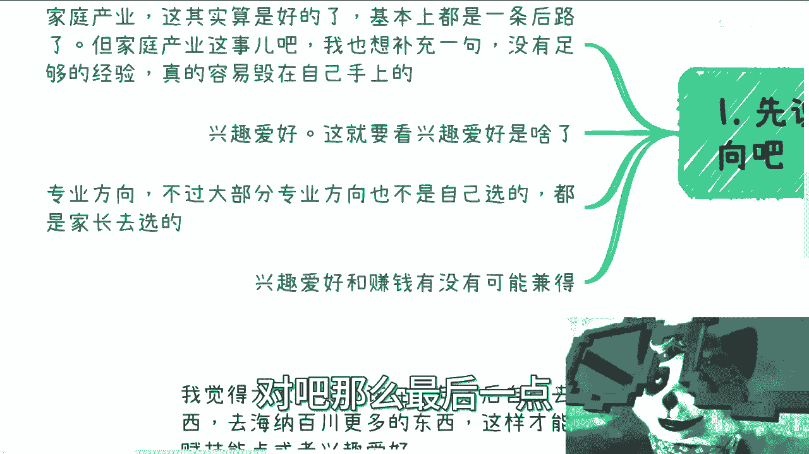
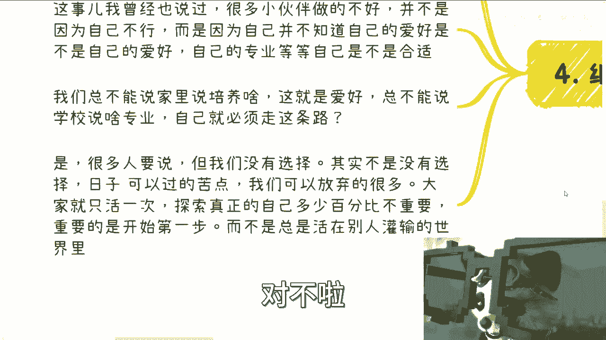

# 应届生商业专题 P1：兴趣爱好与赚钱，能否兼得？ 💼

在本节课中，我们将探讨一个应届生普遍关心的问题：兴趣爱好与赚钱是否能够兼得。我们将分析几种常见的职业方向，并深入探讨将兴趣转化为收入的现实路径与挑战。

***

## 一、 常见的职业方向

上一节我们提出了核心问题，本节中我们来看看应届生通常面临的几种职业选择方向。

以下是三种主要的职业方向：

1.  **家庭产业方向**：部分学生毕业后需要接手家族生意。这看似是一条“后路”，但挑战在于，父辈创业时的市场环境与现在截然不同，竞争更为激烈。此外，接手者不仅需要商业头脑，还需深入理解该特定产业，这对缺乏社会经验的年轻人而言难度很高。
2.  **兴趣爱好方向**：希望将个人爱好（如游戏、二次元、手工艺）发展为事业。这个方向能否成功，高度依赖于兴趣爱好的属性以及个人将其商业化的能力。
3.  **专业对口方向**：从事与大学所学专业相关的工作。然而，许多人的专业并非自主选择，可能并非其真正兴趣所在。一个常见的状态是：**人们或许不清楚自己喜欢什么，但通常清楚自己不喜欢什么**。

***

## 二、 兴趣与赚钱的兼容性分析

在了解了常见方向后，我们来重点分析兴趣爱好与赚钱的关系。这两者能否结合，取决于兴趣的属性和所需的商业技能。

以下是两种不同的情况：

*   **情况一：宏观兴趣与商业技能结合**。如果你的兴趣本身是较为宏观的领域（如心理学、商业咨询），并且你同时具备了营销能力，那么你便具备了将兴趣变现的基础。公式可以表示为：**宏观兴趣 + 营销能力 = 变现可能性**。
*   **情况二：具体技能型兴趣**。如果你的兴趣是具体的技能或事物（如绘画、珠宝设计、玩游戏），将其直接与赚钱挂钩则非常困难。原因在于，将技能商业化所需的工作（如供应链管理、客户沟通、合同谈判）与享受兴趣本身的快乐是两回事。商业运作永远不可能像纯粹的爱好那样单纯和快乐。

对于大多数人而言，**工作（专业）、兴趣爱好和赚钱**往往是三个没有交集的独立方向。这才是普遍的现实。

***

## 三、 关于工作、兴趣与赚钱的合理心态

认识到现实后，我们需要建立合理的心态来平衡这三者。

以下是关于这三点的建议：

1.  **对工作：降低预期，完成职责**。工作就是一份工作，不必赋予其过多的情感期待。核心是：**公司支付报酬，我完成对应职责**。不互相过分挑战，保持职业距离。如果找不到“理想”工作，适当降低标准找到一份能保障生活的工作是更务实的选择。
2.  **对兴趣：保持其为正能量来源**。兴趣爱好是用来中和工作负面情绪、带来快乐和正能量的行为，应该被保留和享受。
3.  **对赚钱：发现其过程乐趣**。即使你对物质没有强烈欲望，也需要培养赚钱能力。因为**赚钱能力 ≈ 接触更优质圈子和资源的能力**。更重要的是，赚钱的过程本身可以非常有趣。它是一个探索未知世界、洞察人性和社会规则的过程。你会发现：
    *   钱从哪里来？（有些甲方的预算可能比你想象中“好拿”）
    *   钱如何一起赚？（合作模式可能充满创意和“擦边球”的智慧）
    *   风险到底有多大？（很多恐惧是想象出来的，真正操作后会发现“问题出现再解决”是常态）

***

## 四、 行动起来，探索自我

理论分析之后，关键在于行动。成年后，我们应该主动探索，才能找到自己的天赋所在。

很多人觉得自己不行，往往是因为身处不合适的赛道。**不能因为已经在某个专业投入了4年或7年（沉没成本），就强迫自己搭上一辈子的时间去走一条不适合的路**。基础的逻辑思维能力是你在任何领域重新开始的资本。

“没得选”常常是一种自我设限。选择权始终在自己手中，区别只是选项的多寡。**人生重要的是迈出探索的第一步**，而不是永远在“先有鸡还是先有蛋”的问题上纠结。这就像谈恋爱或做生意，你必须先开始实践，才能积累经验，知道什么适合自己。

***

## 五、 核心总结与误区提醒

本节课中我们一起学习了兴趣与职业的关系。最后，我们总结核心观点并澄清一个常见误区。

**核心总结**：
1.  兴趣与赚钱能否兼得，取决于兴趣属性与个人商业能力的匹配度。
2.  对大多数人，工作、兴趣、赚钱三者分离是常态，需以不同心态对待。
3.  赚钱的意义不仅是获得物质，更是获取进入更高圈子的能力和探索世界的乐趣。
4.  **行动优于空想**，探索自我和商业世界的第一步至关重要。

**常见误区提醒**：
对于绝大多数普通人而言，早期应该聚焦于 **锻炼赚钱能力**，而不是沉迷于 **投资理财**。当你的本金（基数）很小时，即使有很高的投资回报率，其绝对收益也有限。例如，用 `本金 * 回报率` 的公式计算，1万元本金即使获得100%回报，也仅赚1万元。因此，磨练主业或开拓副业的赚钱能力，才是扩大本金、实现财富增长的根本。

***

> 如需进一步的职业规划建议或背景分析，请整理好个人背景与具体问题清单进行咨询。