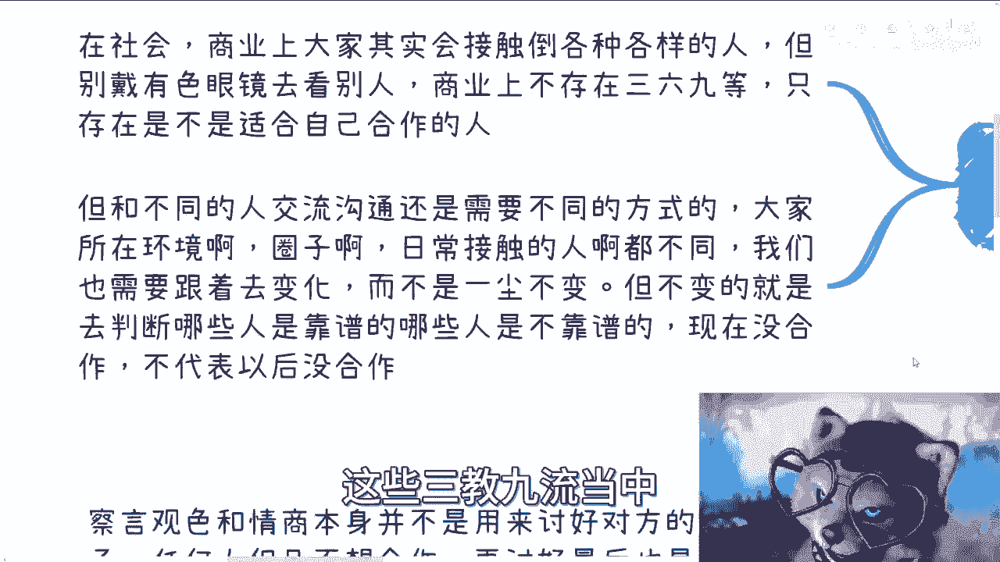

# 应届生商业专题-商业中的情商和察言观色的用途---P1---赏味不足---BV1Wu4y1e7UP_

在本节课中，我们将探讨情商与察言观色在商业环境中的核心用途。我们将明确其目的并非讨好他人，而是作为一种实用工具，用于保护自身利益、提升效率并建立有效合作。

## 概述：情商与察言观色的本质

上一节我们介绍了课程主题，本节中我们来看看其核心定义。商业中的情商与察言观色，其根本目的并非用于讨好对方或进行尔虞我诈。商业合作的基础是平等与价值交换，任何单方面的讨好若无法建立在真正的合作意愿上，最终都难以维系。短暂的利益也无法支撑长期的发展。

因此，掌握这些技能是为了更聪明地工作，而非更费力地迎合。

## 核心用途一：及时止损 🛑

察言观色的首要价值在于帮助我们在商业互动中识别风险、避免不必要的损耗。这主要体现在沟通和社交场合中。

以下是几个关键的应用场景：

1.  **明确沟通目标**：在与任何组织（高校、政府、企业）沟通前，必须清楚对方的核心诉求与痛点。你需要知道他们的KPI（关键绩效指标）是什么。提出的解决方案（Solution）必须精准匹配对方需求，而非强行推销。一个完整的方案应包含：**项目周期、项目费用、投入成本、各方职责**等清晰条款。模糊的提议很难获得正式合作的机会。
2.  **识别无效沟通**：商业沟通中常会遇到高谈阔论者。这通常有两种可能：一是对方并非核心决策者；二是对方本身抓不住重点。如果对方脱离具体细节的宏观论述超过10-15分钟，我们应有意识地引导话题回归核心，或果断终止沟通。避免因“礼貌”而浪费大量时间在无法落地的讨论上。
3.  **判断社交意图**：在商务饭局或社交中，需准确判断对方是真心邀约还是客套话。商业中应尽量避免欠下不必要的“人情债”。同时，如果对方在沟通中表现出心不在焉、只谈宏观不问细节、或借故离开，我们应“识相”地主动结束会谈，避免浪费彼此时间。

## 核心用途二：高效推动项目 ⚡

在明确止损之后，我们需要运用情商来积极推动事务。这关乎我们如何定位自己以及如何管理合作。

商业合作中，个人风格可以多样，你可以选择成为八面玲珑的人，也可以选择成为棱角分明、雷厉风行的人。关键在于，风格需服务于项目目标。

以下是高效推动项目的几个要点：

1.  **姿态因对象而异**：若想获得外力支持或与级别高于自己的人合作，适当放低姿态是必要且现实的，这不等于跪舔。这源于基本的商业层级与供需关系。反之，与平级伙伴合作时，则务必在项目进展、方向上果断明确。
2.  **聚焦项目而非人情**：商业合作的核心是**项目**的顺利推进和交付，而非维护某段固定的人际关系。人和团队都可以为了项目目标而调整或更换。过度纠结人情可能损害项目本身。
3.  **快速判断与决策**：在谈判或非正式交流（如咖啡、饭局）中，需快速判断合作可行性。心里要有杆秤，明确什么能做，什么不能做。尤其要警惕那些看似有利可图，但实际执行成本（时间、金钱、资源）可能远超预期利润的“陷阱”项目。

## 核心用途三：海纳百川，建立连接 🌊

商业世界由形形色色的人构成，情商帮助我们更开放、更有效地与不同背景的人建立连接，为未来创造可能。

我们需要避免先入为主地为他人贴上标签。在商业层面，只存在“能否合作”、“能否共赢”的区分，而不应固守社会意义上的三六九等。

以下是建立有效连接的思路：

1.  **沟通方式因人而变**：与不同行业、背景、圈子的人交流，需要调整沟通方式，以适应对方的语境和习惯。这需要观察和学习。
2.  **在交流中识别靠谱伙伴**：与各色人等交流的核心目的之一，是从中辨别出那些靠谱、可信任的潜在合作者。很多人可能当下没有合作契机，但不代表未来没有。
3.  **为未来布局**：商业网络是一个长期投资。今天结识的每一个人，都可能成为未来某个关键节点的合作伙伴。正如乔布斯所说，你无法预知现在做的事如何在未来串联起来，但你需要先去“连接这些点”。保持开放、真诚的记录与联系，是为未来创造机会的一种方式。

## 总结与误区澄清

本节课中我们一起学习了情商与察言观色在商业中的三大核心用途：**及时止损、高效推动项目、海纳百川建立连接**。

最后，需要澄清一个常见误区：市面上许多关于“察言观色”、“厚黑学”的课程或书籍，往往过度强调技巧与心计。但在真实的商业合作中，这些只是“周边逻辑”。真正的基础永远是**清晰的商业逻辑、可靠的项目执行力和果断的决策能力**。没有这些作为根基，再高的情商技巧也如同空中楼阁。

商业不是谍战片，本质仍是价值创造与交换。我们可以选择适合自己的合作风格，但不必强迫自己适应所有所谓的“潜规则”。保持专业，创造价值，才是立足之本。