# 应届生商业专题-大学生创业竞赛与找工作和赚钱的关系---P1---赏味不足---BV1234y1N7

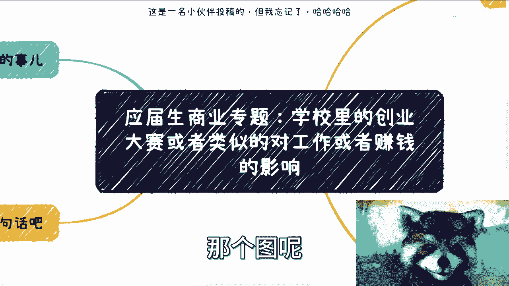

在本节课中，我们将探讨大学生创业竞赛的本质，并分析其对未来求职和实际赚钱能力的影响。我们将从多个角度剖析这一现象，帮助你建立更清晰的认知。

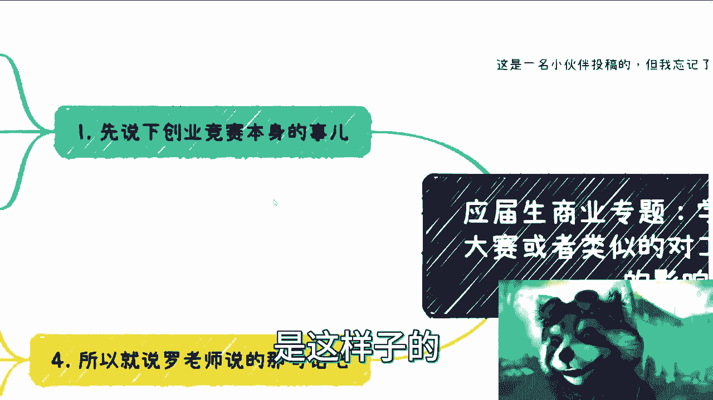

## 概述：创业竞赛的双重面孔

创业竞赛的名头很多，具体玩法取决于举办方，可能是校企合作、金星伟或科委等。在我国，各地玩法可能不同，但大框架不变。

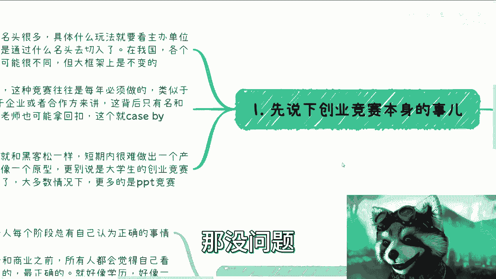

从学校角度讲，这类竞赛是每年的固定节目，类似于一项KPI指标，学校每年都会举办。

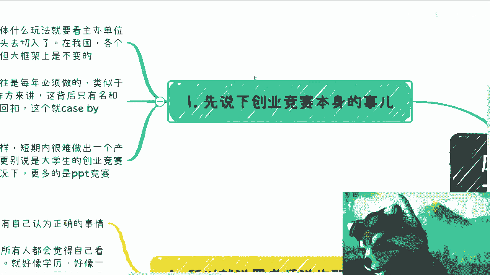

对于企业或合作方而言，其动机则值得深思。与学校合作举办竞赛并非纯粹出于慈善目的，为了培养学生的创业意识。其背后通常存在商业考量。

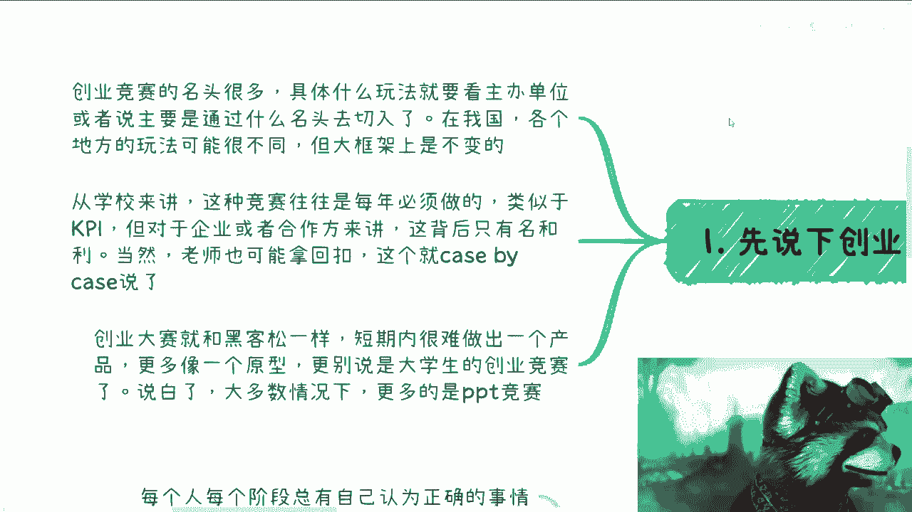

关于学校老师是否从中获取回扣，情况则因个案而异。有的地方不拿，有的地方拿得少，有的地方甚至拿得比企业还多。

## 创业竞赛的实质：形式大于内容

上一节我们介绍了竞赛的举办动机，本节中我们来看看参赛体验的实质。

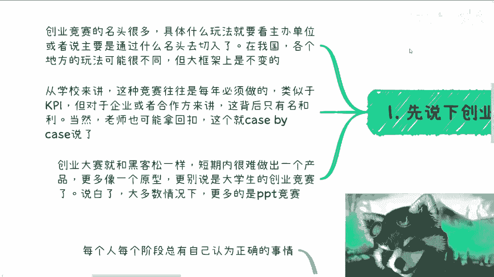

创业竞赛与黑客松类似，本质上是短期团队协作。一个团队需要开发、产品、项目经理、设计等角色，短期内很难做出成熟产品，最多只是一个原型或演示。

大学生创业竞赛中，许多学生甚至没有明确的团队角色意识。对学生而言，没有固定岗位，更多是基于个人感觉分工，这更像一种过家家的行为。

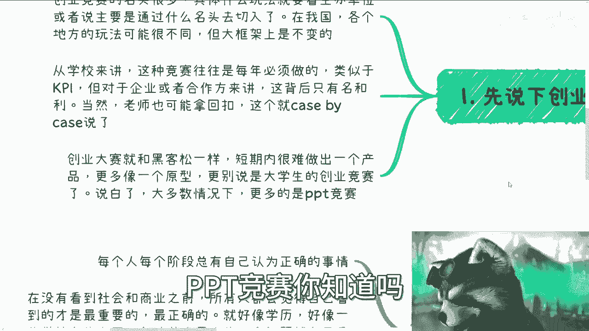

大多数情况下，这类竞赛更像是PPT竞赛。

以下是创业竞赛现状的核心概括：
*   **初衷良好但已脱节**：大学生竞赛的切入点本是好的，但经过多年发展，不进则退。它越来越与真实商业脱节，同时也越来越商业化。
*   **核心是利益交换**：商业化意味着相关方是来赚钱的。从资本角度看，大学生创业竞赛更像一个为各方赚钱而设置的“幼儿园过家家”行为。

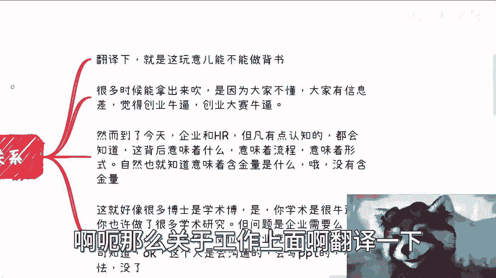

## 对求职的影响：含金量有限

了解了竞赛的实质后，我们来看看它对你找工作究竟有多大帮助。

在工作方面，创业竞赛奖项不能作为有效的职业背书。例如，获得省赛、市赛的名次等。

很多人吹嘘这些奖项，是因为存在信息差，大家误以为这类竞赛很厉害。然而，判断一个人是否真的厉害，标准很简单。

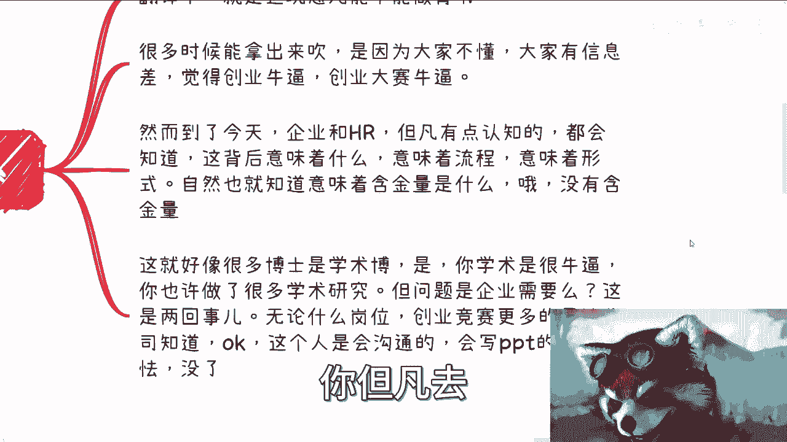

真正的“厉害”意味着无需走常规面试流程，可能被企业直接录用，或获得户口、奖金、国家研究院名额等实质资源。

如果你仍需在招聘平台投递简历并参加面试，那么对于有认知的企业和HR而言，他们明白这类大赛背后意味着固定的流程和形式。

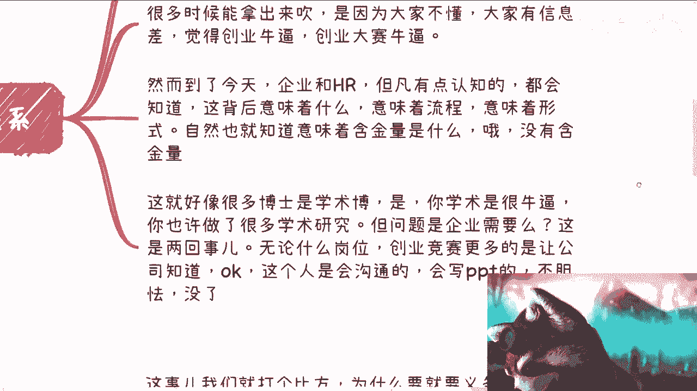

这意味着它是流水线化的产物，自然也就缺乏含金量。HR可能不会当面揭穿，但内心清楚其价值。

这就好比许多学术型博士，学术研究很出色，但企业需要的是能创造价值的人才。企业雇佣员工是为了解决问题和创造利润，而非做慈善。

当你月薪三五万时，你可能还是个工具人。但当你要拿更高薪酬时，你必须能为企业创造价值。企业本质是**利润 = 收入 - 成本**，不赚钱就无法生存。

你向老板展示竞赛奖项，老板只会关心：你能为公司赚钱吗？不能就请离开。无论什么岗位，创业竞赛最多只能向公司证明你具备沟通能力、会写PPT、有团队合作意识、不胆怯，仅此而已。

## 对赚钱的影响：缺乏商业根基

讨论完求职，我们再来看看创业竞赛与赚钱的关系。

我们可以打个比方：为什么需要九年义务教育和高等教育？因为学习是一个杂而广、打基础的过程。就像做开发，需要先学原理、语法和框架，不能一无所知就声称可以工作或参赛。

创业竞赛也是同理。我们可以从两个角度分析：创业与竞赛。

首先，从创业本身讲，无论是产品还是服务，都需要先尽可能多地了解和积累。没有公司不做市场调研和前期积累就能成功。你需要经历并体验团队合作、产品打磨、服务设计等全过程，才可能明白如何创业。

大学生普遍缺乏这些经验。

其次，从赚钱角度讲，在大部分场景下，赚钱与产品服务本身没有直接关系。产品服务只是一个产物或过程。无论谁，无论年龄学历，都可能做出一个产物。

但能否赚钱，不取决于创意本身。你的创意再牛，与赚钱无关。老板只关心：给你月薪10万，你能每月为公司赚回至少10万的利润吗？不能就请离开。这与你是谁无关。

真正赚钱取决于背后的资本运作和商业运作。商业成功在于利益分配的细节之处。

例如知识星球，它并非简单地“割韭菜”。其模式包含引流、过滤等复杂流程。许多人使用知识星球，是因为它帮助规避了交税和个人从事商业的痛点。

创业竞赛成败的细节在于：与合作方、上下游、用户之间的利益如何分配？如何收钱？如何交税？如何设计经济模型？这些才是关键，而非天马行空的想法。

然而，大学生必然不知道这些东西。因此，从赚钱上讲，结论是：参与创业竞赛不会教你赚钱，没有实际用处。

许多创业大赛的导师，就像许多教人赚钱的“大师”，自己并未真正成功创业或参与过重要项目，却在指导别人，这很荒谬。

## 核心认知：什么才是重要的？

最后，我们来总结什么才是对职业发展和赚钱真正重要的。

老罗曾说过，人生每个阶段总认为自己当下追求的事情是正确的。在未接触真实社会和商业之前，所有人都会觉得自己看到的（如学历、学校活动、竞赛奖项）最重要。

但问题在于，一件事是否有价值，不由我们决定。决定价值的是那些出钱的人、决定你生死的人。

因此，我们需要了解什么是重要的。首先要明白钱从哪里来。就像面试时要明白企业为什么给你钱：不是因为你是竞赛第一名，而是因为你能创造价值。

竞赛奖项或许能提供一个门槛或好印象，但三五年后企业留用你的原因，要么是你能赚钱，要么是其他深层原因，与奖项无关。

你需要了解社会商业面：钱到底从哪里审批下来？以什么名义？当前政策鼓励什么？钱是企业固定支出、国家基金扶持还是人才培养经费？每个渠道都有钱，但你需要知道渠道在哪里，并对症下药。

无论渠道在何处，没有一个渠道会单纯因为竞赛奖项而给大钱。最多给一两万，像打发叫花子，这是辛苦钱，不是真正的“赚钱”。

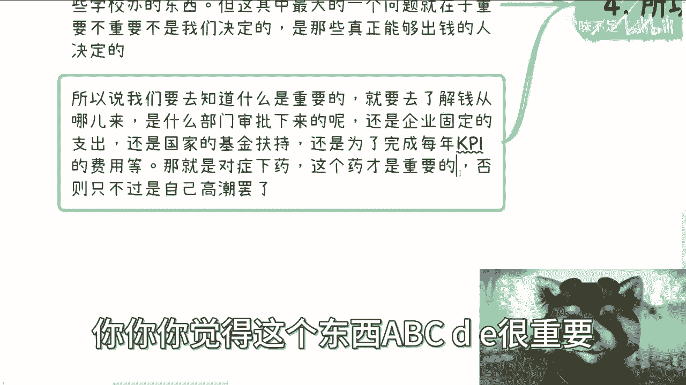

你要明白，学校看重的东西也许重要，但没那么重要。如果你的目标是赚钱，回过头看，这些都可能是不知所谓的自嗨。

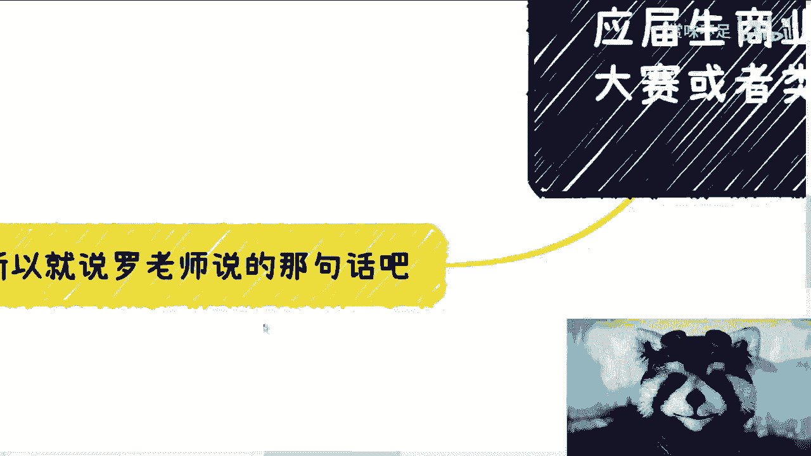

正如一位学生所说，进入大学后，在保证能毕业的前提下，应该尽早出去了解社会水面下80%甚至90%的规则，才能明白什么对自己真正重要，而不是整天被PUA，觉得学校推崇的东西都很牛。

用一句话概括：能来钱吗？能赚钱吗？不能就请靠边站。或者，你手上的“牌”（如奖项）能换来钱吗？如果能符合国家某项计划，持续获得几百上千万资助，那很牛。如果只是一次性给个五万十万，那没用。中国这么大，能赚钱的赛道和人很多，这不算什么。

## 总结与建议

本节课中，我们一起学习了大学生创业竞赛的本质及其对求职和赚钱的实际影响。

核心结论是：作为普通参赛者，创业竞赛对找工作和赚钱的帮助非常有限。它更像一个形式化的活动，其商业价值被主办方和合作方获取。

对于个人发展，比沉迷竞赛更重要的是：
1.  **理解商业本质**：明白价值创造和利润来源。
2.  **接触真实社会**：了解水面下的商业规则和资源渠道。
3.  **培养核心能力**：聚焦于那些能直接为企业创造价值或解决实际问题的技能。

我不会给出具体的职业建议，因为工作选择因人而异。但我可以揭示在中国社会水面下持续存在的多种赚钱模式和逻辑。至于如何利用你手中的牌，如何规划发展，取决于你自己。如果你想知道，可以整理好你的具体情况。