# 应届生商业专题：如果要跳出打工的束缚，最先改变的是自己的思想和屁股 - P1 - 赏味不足 - BV1244y1c7rr

啊大家好啊，这个今天忙成狗了，真的忙成狗了啊，但是我还是想了一下这个跟大家聊一下对吧，反正还没过零点，也就没过，今天啊，那个前两天有个评论区里面，小伙伴说了一个问题啊，我已经在做了，这个说实话啊。

我其实不太想做，比较难，但是我想了一下，我不得不做啊，因为哎呀这个话题蛮好的，也不是蛮好的，就是我我觉得应该做，他说这个有很多，有些全职爸爸或者全职妈妈，在家应该怎么做生意，我说实话我觉得蛮难的。

但是我努力啊，努力做一下，那么首先这一期呢还是继续说，前两天这个百万up主解释了这个事啊，这个延续啊，我发现很多小伙伴呢没有搞清楚一件事情，就在我们在我们啊，所有人去做一件非打工的事情下面。

我们要改变的首先是我的，我们的思维和我们的屁股啊，否则你还不如打工，你懂吗啊，嗯首先先说核心的啊，无论你做什么，无论你负责什么细节啊，哦就是无论你是哪怕是端茶送水的啊，扫地我跟你讲。

只有你自己对你自己负责啊，呃也许商业上面啊合作是有分工的，或者说呃这个有各种各样的这种叫什么，就是啊这个分工啊，在我们这个工作里面啊，但是你本身做这件事情，你只有自己对自己负责。

所以说你必须对全职都要有个了解，你不了解肯定是没有用的啊，我的小浣熊怎么哎呀，我就知道哎呀，这样这样这样这样好，然后呢第二点呢就是必须要有自驱力啊，必须要自己push自己啊，这个后面我会展开啊。

第三点呢，就是说你自己要想清楚到底怎么赚钱啊，然后想清楚赚钱跟你打工发工资，这个当中的区别啊。

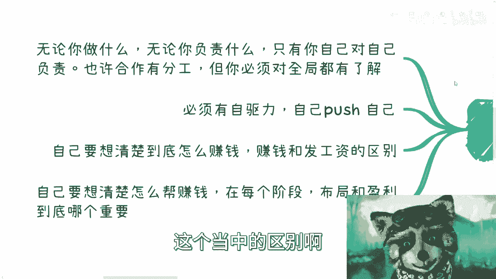

第四点就是你自己不但要想清楚自己怎么赚钱，你还要想清楚怎么帮别人赚钱哦，少打两个字对吧，怎么帮别人赚钱，而且你要想明白，在你每个成长阶段。

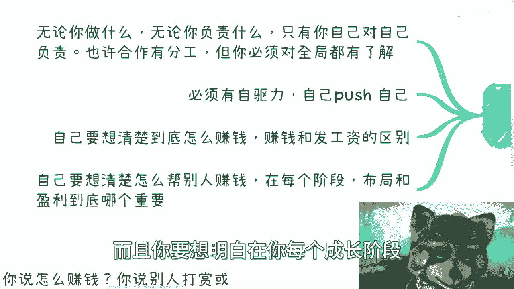

你到底是为了布局还是为了盈利，你哪个对你更重要啊，好我们先一个个来说啊。

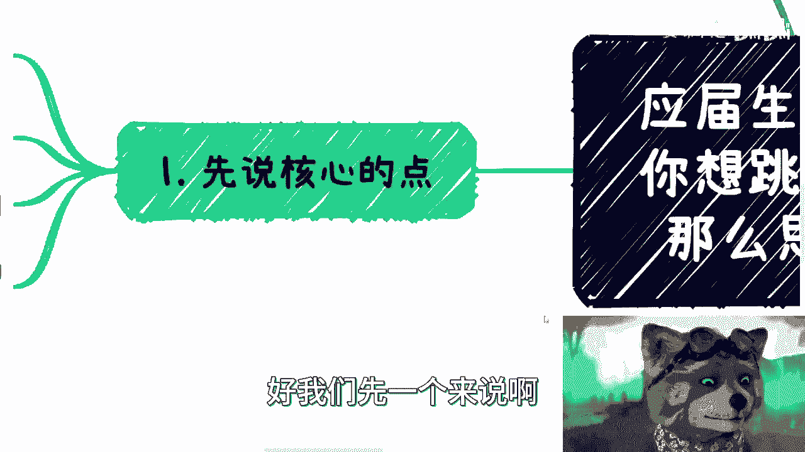

首先无论你做什么，你无论负责什么，只有你自己对你自己负责对吧，也许合作有分工，但你必须对全球有了解，什么意思呢，比如说啊，你今天在打工以外要开一个新的业务线行啊，无论你是做零散的工作啊。

还是说做自媒体啊，还是跟别人这个商业合作啊，比如说你负责运营，别人负责交付对吧，还是说你负责啊，你是撮合双方资源，比如说甲方跟外包公司对吧，还是说你组织一个活动等等等等等等啊，anyway啊。

就是说无论在一件事情里面，你到底做什么，你都要需要了解全局，因为只有你自己为你自己负责啊，待会我们会回来反过来解释这件事情，我们待会再回来说啊，那么就回到百万up主这件事情上面，就是说我看到一些小伙伴。

而且不止一个啊，说团队负责干活啊，投资人负责赚钱，分工很明确，那我就问啊，团队负责干活，最终没有钱了，我就问你们，你干活为了什么啊，你告诉我你干活为了什么，你如果来说你告诉我，你为了发工资好。

那我就现在问你工资谁来发哦，你告诉我好，投资人来发是吧，好啊没问题啊，好那么我就问团队干活，干到最后投资人没有钱了，你说这件事情怪投资人，如果这个逻辑成立的话啊，好那么我就这样说，在商业上。

我可以有千千万万种方式，让这种只管干活的团队什么都不管，团队去背锅，甚至进去，甚至可以有莫须有的各种东西，我可以这么跟你讲，不管是民事还是刑事，我都有办法把它背到身，让让这些团队背到身上哇。

那我就请问这个团队到时候跟警察说说什么哦，怪投资人有谁，我就问你会听你的吗，啊我就问你是听法律的，来听你的对吧，就是只是今天是一个最好的一个结果啊，然后大家就开始开上帝视角了，没有意义的，你知道吗啊。

没有意义的，我希望所有人明白一个道理，就是很多时候是非黑白不是那么清楚的哦，不是那么清楚的，手段多的很，只不过我不可能在这个地方说啊，手段多得很啊，说白了你没碰见事儿，你随便怎么开上帝视角。

你怎便怎么圣母都可以，那我告诉你，你但凡真的碰见事儿了哦，你作为一个老百姓，你大概率就已经回天乏术了，你明白吧，哦你到时候再刚再硬没有用哦，所以最好的方式就是，你每走一步都要去了解全貌。

尽可能的为自己负责，别老是怪别人，怪别人没有用的，而且这事情本来就不应该怪别人啊，哪里有他妈的自己做团队，自己干活哦，不负责赚钱的啊，这事就搞笑了啊，你我跟你讲，你们到外面去问，整个中国一线到五线城市。

你们出去问，但凡只要是做自己项目创业的，你们就去问有哪个团队是对财务，对钱没有认知的，有吗，我跟你讲，这他妈就是天大的笑话啊。

好我们回过头来看一下这一条，就比如说你今天做自媒体对吧，那你做自媒体，我就问了你做自媒体你怎么赚钱啊，你有没有想过你做自媒体，你到底是占整个这个整个比如说信息流，整个平台里面流呃，这个视频流到底占多少。

你凭什么觉得别人会赚钱啊，别人会付你钱，你凭什么觉得别人会打赏，你到底切中了别人什么痛点对吧，然后你要去明白你，你就是平台的这个计算逻辑是怎么样的，平台权重是怎么去区分的，对吧哦，那么这个还好。

你知道吗，好那么比如说你跟别人是商业合作，比如说你负责运营，别人负责交付对吧好，那么你至少知道别人交付个什么东西吧，啊那照这么个说法，我不管啊，我只负责运营啊，那他妈那个人负责交付的，那我就这么跟你讲。

你负责运营对吧好，那我交付个黄赌毒，那那那我我想问你觉得什么，你跟警察说啊，这个事情跟我没有关系，你觉得呢你以为过家家呢啊，对不啦啊，然后你比如说撮合双方资源对吧，比如说甲方和外包好，没问题啊。

你撮合对吧，好那我就问今天甲方，甲甲方可能是一个你很看重的一个国企，央企对吧，或者很有名的一个企业，这个外包对吧，用上海话来讲来讲，就是策略物对吧，什么意思呢，就是给你乱来啊。

这个摆烂外包做出来的东西他妈跟屎一样，那我就问你们甲方，到时候就说我，你是个啊，你给我介绍的这个外包呀，对不对，那我就问嘛，你难道说什么哦，哦怪人家呀，我只管撮合的呀，能做不了你自己用你的。

用你的本科的脑子想想看能做吧对吧，还有就是你组织活动对吧，一样的，你组织活动，你不得对这个场地了解吗，你不得对来的人了解吗，你不得对这个场地方，那那个那个那个场地所提供的各种各样的设施，了解嘛。

你总不可能跟你来组织，比如说你组织一场粉丝见面会对吧，你你你你你跑过去把现场一堆垃圾，然后设备也不能用的，你总不能跟你的粉丝说啊，这我不管你，我只管搞活动的，妈的这个这个东西场地负责的呀，搞笑吧。

你觉得对不对，就我觉得大家说出来的话，你要有脑子，你知道吗。

就是我们是一个就是你你你你们去评论，你们可以喜欢看视频，你们是一个up主的粉丝，这没问题，这他妈他妈的不是不是饭圈，你知道吗啊，这不是没有脑子啊，然后第三个你比如说必须要有自驱力。

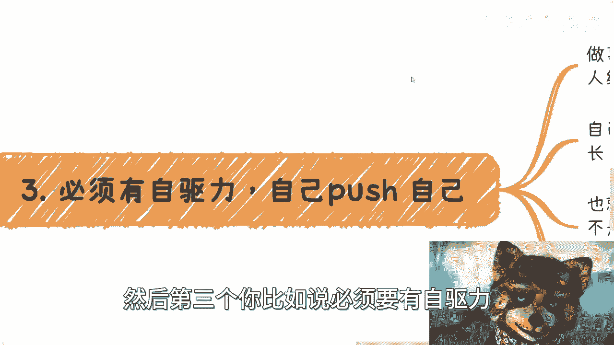

自己迫使自己对吧，也就是说什么意思呢，也就是说你做一件事情，如果在非打工的状态下面，你就开一条优先，对不对，做事情你一定要自主性强，你不是在打工，也就意味着没有人再来催你，也没有人再来给你定制。

KPI不存在的，你就是你的mental，你就是你的leader，你就是你的boss，就这么简单哦。

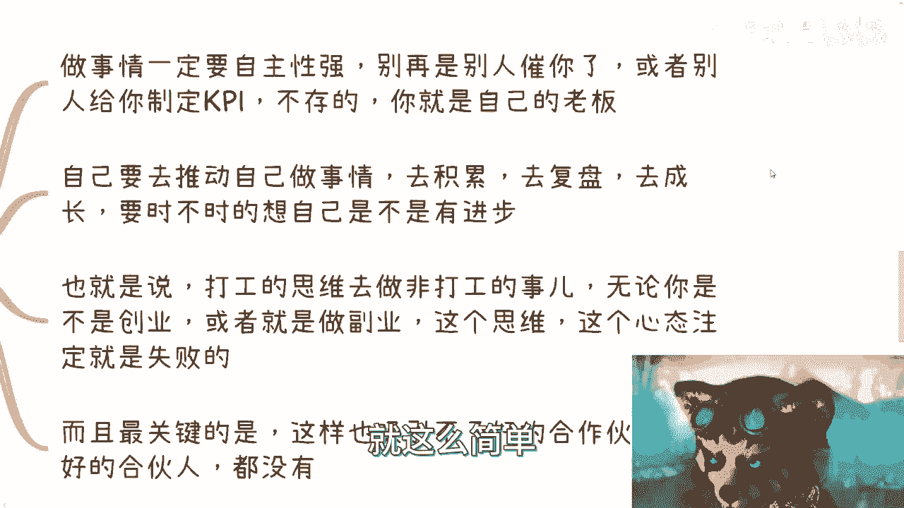

你你你今天跟我说啊，驴老师，我想出去赚钱好没问题，你跟我说，你做个自媒体好也没问题好，那么你总不能到第二天跟我这么说吧，你说哎呀，驴老师啊，我只负责做自媒体，那为什么不赚钱呢，啊，那那这我觉得这个赚钱。

难道不应该是B站这个平台做的吗，他凭什么不给我赚钱，这对吧，我我我感觉你可能适合去网平台路600号啊。

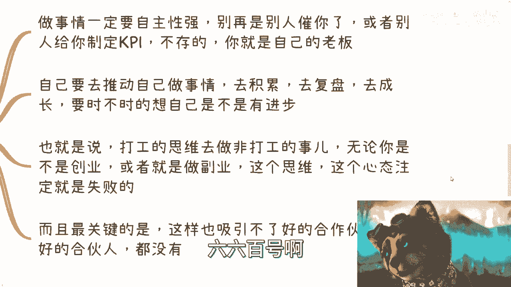

那么这这第一点啊，第二点就是说你自己要去推动自己做事情，去积累，去复盘，去成长，你要时不时的想自己有没有进步，对吧好。

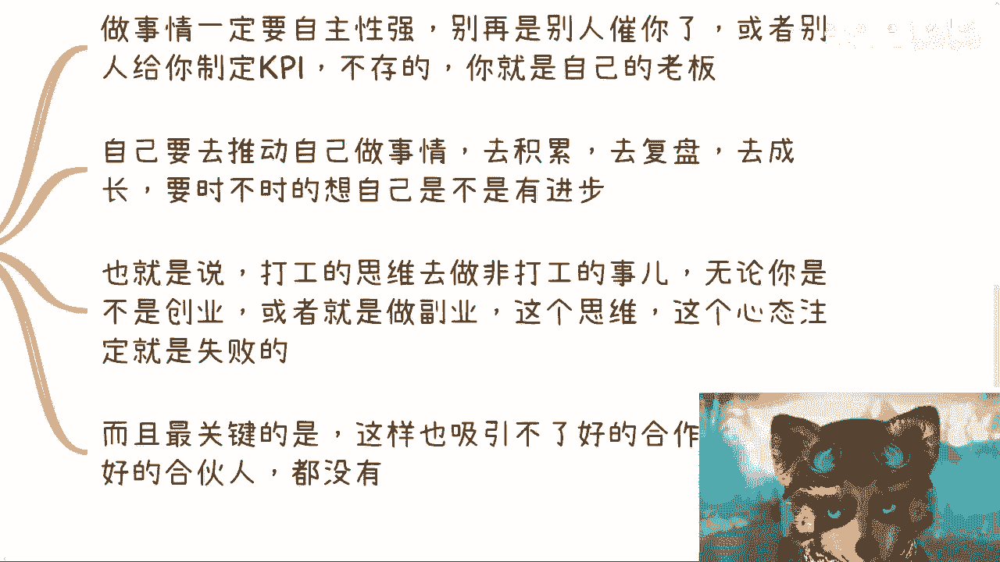

那第三也就是说打工思维，你去做非打工的事儿啊，你要明白一点啊，无论你是不是创业还是你做副业，我跟你讲，不要咬文嚼字啊，不没有什么事情，什么一定叫创业教父也无所谓的，只要你在非打工的这种状态。

非拿工作的状态想要去赚别的钱，我不管你是商业还是外快啊，那么这个思维你这个心态注定就是失败的，你知道吧，你一定要自己住，就叫做什么ownership对吧，就自驱要强好。

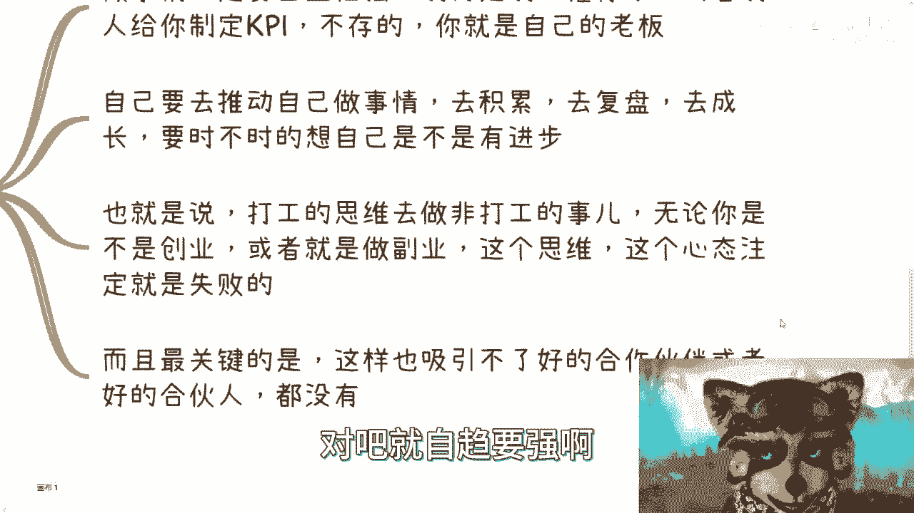

那么还有一个就是说最关键的是什么，就是你这样就你单纯是打工思维。

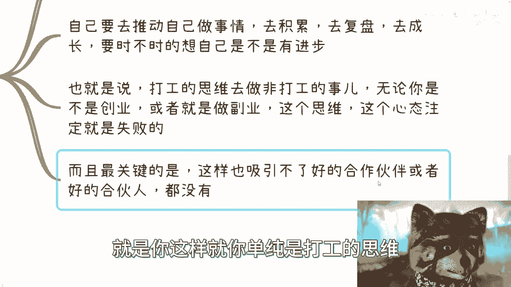

打工人心态，你这样也是吸引不了好的合作伙伴，或者好的合伙人呢，都没有到，最后就是一场空。

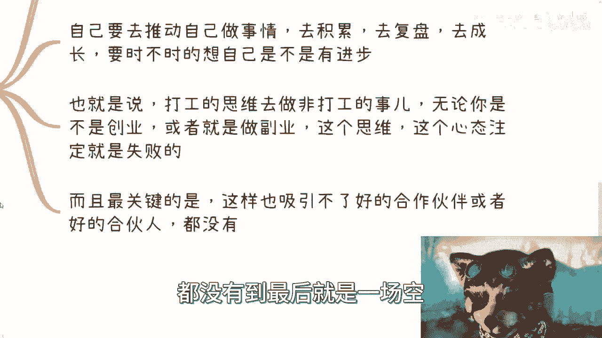

你知道吧，那么第四点是什么。

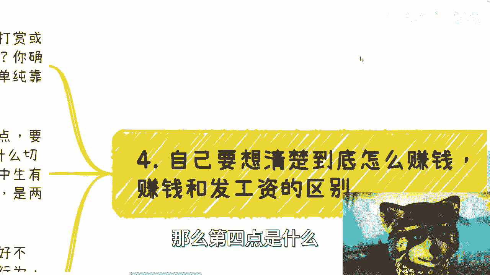

就是你自己要想清楚到底怎么赚钱啊，赚钱跟发工资的区别是什么，你比如说啊我们做个视频啊，你说怎么赚钱啊，你说别人打赏或者上单，那那么问题来了对吧，那别人打赏的原因是什么，凭什么别人要打赏。

你确定每个月别人有多少人打赏对吧，数据有没有能不能稳定，对不对，那你说接商单好，那么我就问你接商单的逻辑是什么，稳定吗，别人为什么让你接商单，不让别人接商单呢，对不对，有吗，没有对吧。

所以说你单纯靠这两个，说白了你的赚钱逻辑是不清晰的，你明白吧，好那么我们举个例子，比如说别人给钱，你一定要有明确的理由，要么就是痛点，要么就是帮助别人混KPI对吧，那么无论切入什么点。

你总要找到一个合理的对吧，理由千万也别自己无中生，有一个痛点，这很难，我给你举个例子啊，比如说你做一个视频对吧，什么叫痛点，就比如说很多广告公司，媒体公司对吧，或者说一些一些国企，央企营销公司。

他每一年都要做视频，做营销，可能有几百万的营销经费，那么这个就是他的痛点，但问题是你要解决什么，你要解决的是怎么让他找你解决这个痛点，而不是找别人解决这个痛点，对不对，好，那这是第一个，第二个。

党媒对吧，党课各种各样宣传都要的呀，他也要做短视频啊，那你你要想这个事情就是痛点，对不对，你要么就帮别人混KPI，什么叫混KPI，就是很多地方他交付一个东西，其实不单单是PPT，也不单单是一个产品。

它可能还需要一个宣传视频，比如说两到3分钟的短视频对吧，那么你能不能找到这些客户啊，然后帮他们满足这个KPI，那这些是痛点对吧，那么你可以无中生有一个需求，但是你不能无中生有一个痛点。

你们仔细想想看对吧，就是说什么叫痛点，就是对他来讲他不完成，他可能这份工作就没了，或者他不完成，他年底年终奖就没了，而需求是什么，需求是你他就是你今天帮他解决这个痛点，可能有五种方式啊。

那么但是这些方式里面你可以帮他去无中生，有一个需求，就让他感觉哦我可能有这个需求，但是这个需求本身可能对他来讲，不是那么重要啊，但是这个需求可以解决它一步，就是这个可以解决他的痛点啊。

只不过就是说他可能以前没有，就是说不是通过，比如就像我们换个方式来讲吧，就是说他可能以前解决痛点，并没有用这个短视频对吧，但是他这个痛点是，他一定需要有通过一个东西来交付啊。

这个东西一定是看上去高大上的对吧，那么他以前可能只只懂输出，哎我用PPT啊，用什么PDF对吧，然后呢你现在跟他说，哎，我能够通过既用PPT又用视频的方式，帮你解决这个痛点，让你的领导看上去更高大上诶。

那这个需求就是无中生有的，但是这个痛点不是无中生有的，你知道吧，好那么最后一点就是我曾经说过啊，再强调一遍，就是说你打工无论做得好不好，你工资一样发，发你工资本身是一个法律行为啊。

或者说是一个受法律保护的行为，没有任何一丝的商业行为在这里面，为什么，因为你同样的不用去考虑哪里来，你无论做的好不好，你这个月工资都有对吧，也就是说你你你这里面没有任何商业逻辑，没有任何商业闭环。

没有任何商业的，这个这个这个你需要考虑的问题，但是你但凡自己在非打工的情况下面，去做一件事情去赚钱就不一样，为啥说打工呃，为什么说打工人切到商业就一切从零开始，是因为打工人无论打10年，打20年。

打100年，你也不会考虑钱从哪里来，因为你的屁股决定了你的脑袋，你知道吗，你也不会考虑为什么甲方会付钱，你也不会考虑为什么甲方付给你公司，付给不付给别人公司，因为你没有这个需求，你不会去考虑啊对吧。

所以就是这这两个完全就是平行世界啊。

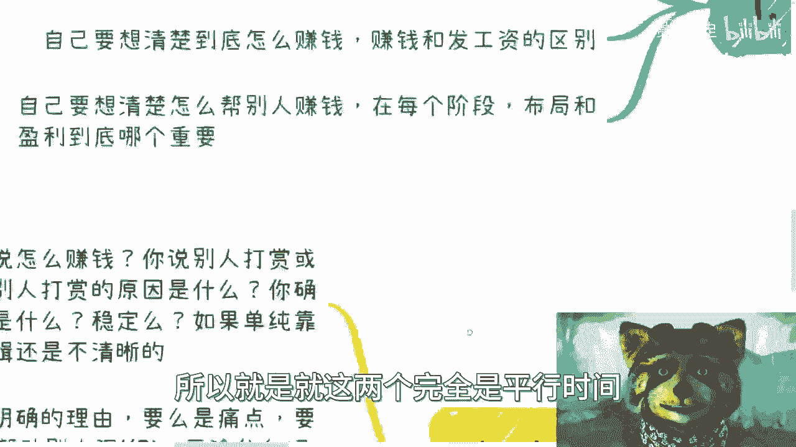

那么第五点自己要想清楚别人怎么赚钱，或者说哦我这里写错了，就是想清楚帮别人怎么赚钱对吧，在每个阶段你到底是为了布局还是为了盈利啊，什么意思呢，也就是说嗯我卡住了卡住了啊，就比如说就是做商业。

你最核心的点就是要清楚自己怎么赚钱，同时要清楚怎么帮别人赚钱啊，你两者都要清楚才是最佳的，否则啊你要么就是，否则你要你要么就是就是说，这里面肯定是有坑的对吧，要么就是说啊你这个合作可能不长久的啊。

就是今天这个这样合作，你可能合作个一两个月合作就合作不了了，我靠又傻掉了算了，无所谓嘛，啊，那么第二个就是你该让利润的时候，就让利润对吧，也就是说很多时候我们让利，不是因为我们不要赚钱。

也不是因为我们不会赚钱，而是因为我们可能需要去试探对方啊，我们也可能是为了以为了以后更大的利润，你知道吗，因为让利这件事情很简单嘛，就是如果来说你今天让利对吧，对方是一个这个位高权重的，你是让利。

我觉得很正常对吧，那对方如果是一个平起平坐的，甚至是低于你的，你是让利，而对方又接受了，我跟你讲，这种人就别合作了，那说明他没有逼数啊，对不对，那你其实可以做市场，你也可以是为了以后更大的利润啊。

无所谓啊，好所以说核心是什么，一切都是朝着钱看起的，你跟我说，我他妈就是为了干活赚钱是别人的事，那我跟你讲算了，拉倒吧啊，你这个该更好干活啊，算了是我出处，我处处说说说说文明，你我他这是核心啊。

这就是说但需要共赢啊，就是说你哥你割不割别人不重要啊，至少你不能割自己人，或者话又说回来就不叫哥，就说你赚不就是你赚不赚钱很重要。

别人赚不赚钱也很重要，你千万不要做一件事情，是你今天大家辛辛千辛万苦对吧，做这件事情，然后呃这个叫什么，就是冠冕堂皇说我们做了商业，到最后你也没赚钱，对方也没赚钱，那我跟你讲。

那这个事情说实话你就在变相坑人家啊，好吧，行吧就这么着吧啊，所以呢我觉得就是说核心点啊，就是说如果啊你想跳出打工的束缚啊，也就是说你今天想要去做任何的商业行为，副业行为啊，这个都可以。

但是呢你首先要把你的想法，你的很多的我们称之为在打工思维上面，幼稚的想法都摆脱掉，否则我跟你讲，你后面你要这么想的，你要么就坑别人，然后别人就知道了，你就是一个叉叉，就不会跟你合作了，你要么就别人坑你。

然后你就不停的被割，你说何必呢，对不对啊，好吧行吧，就这么着吧啊这个大家有啥啊，对大家有啥好吧，然后整理整理啊，然后要什么职业规划的，或者想什么呃，这个这个这个让我给你们整理手上牌，怎么打的啊。

这个都可以啊，然后或者说知道想想要让我再讲一些对吧，这个我在公开场合不太好讲的也行啊，啊反正你们整理好这个私信我好吧行了。

