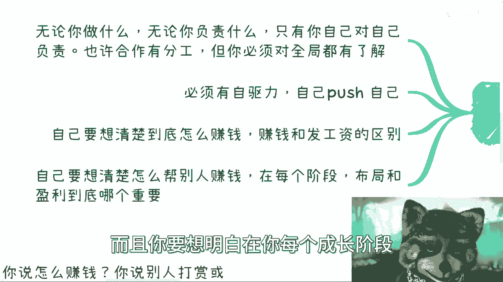
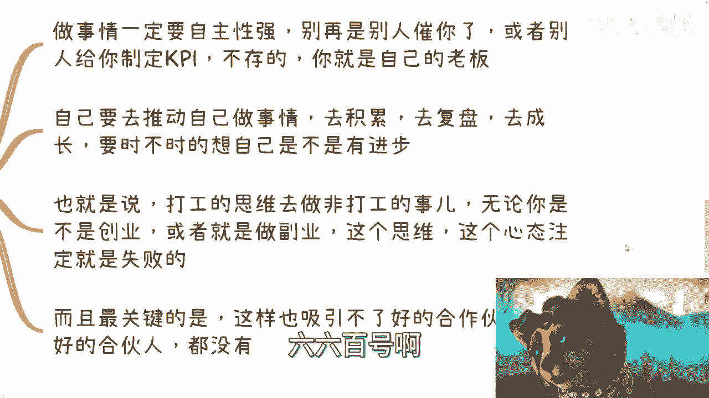
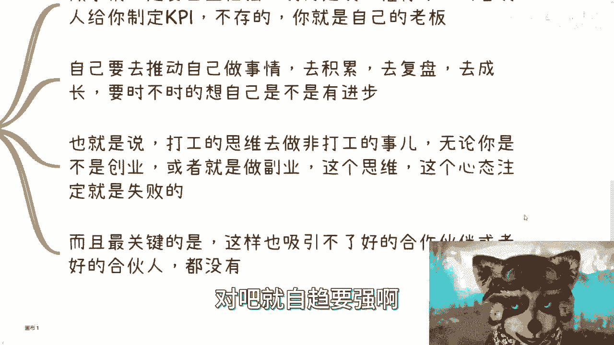
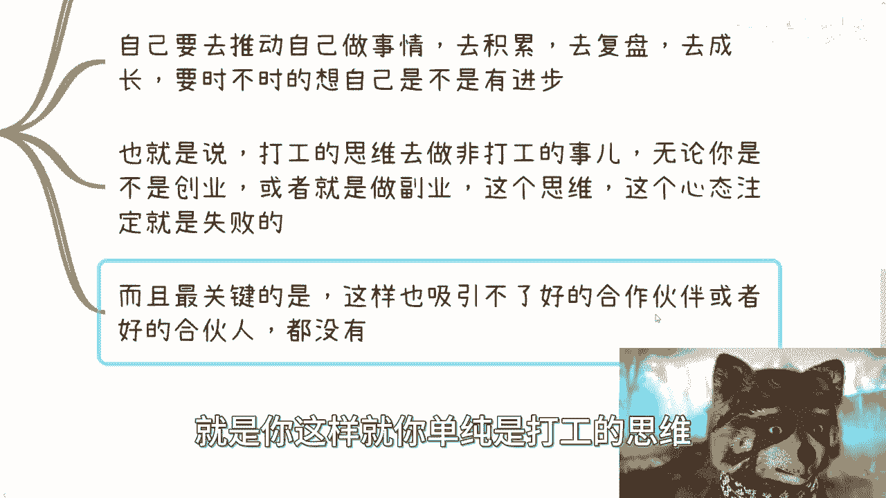
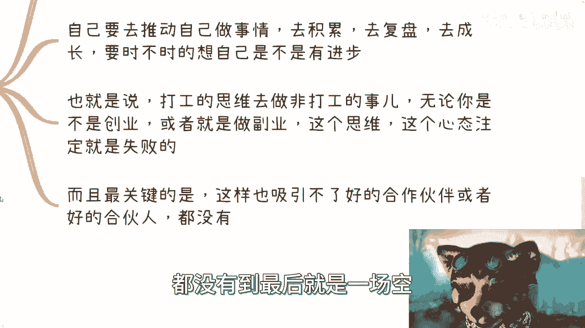
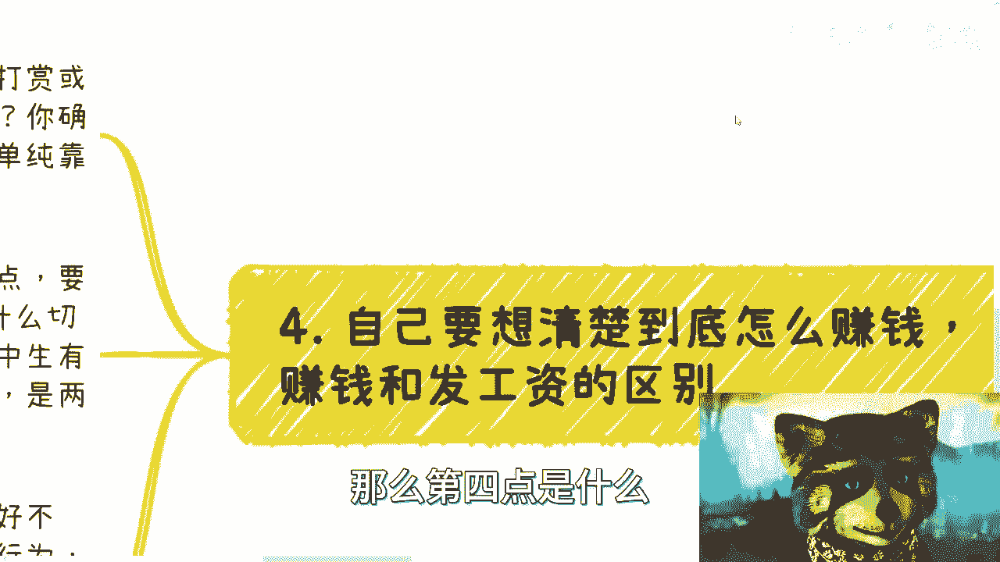
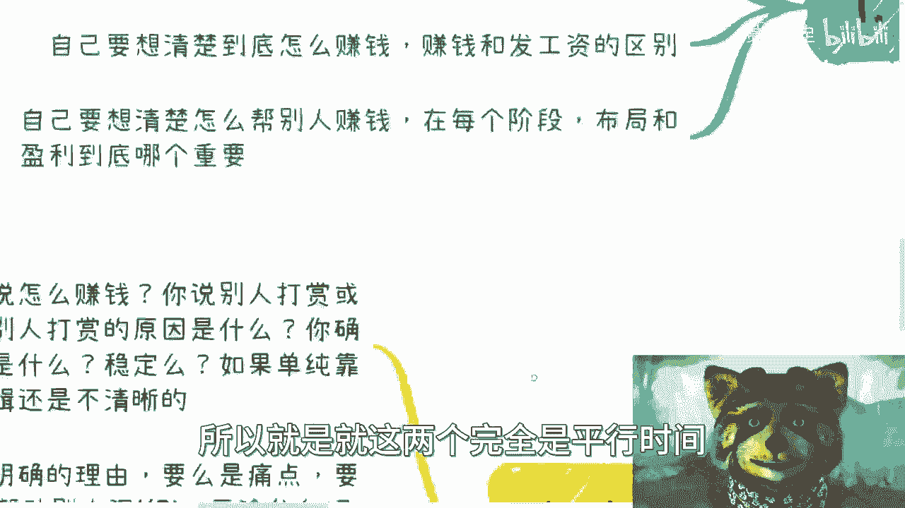

# 应届生商业专题 P1：跳出打工束缚，先改变思想与立场 🧠💺

在本节课中，我们将探讨一个核心问题：如果你希望摆脱纯粹的打工状态，无论是创业、做副业还是开展任何商业活动，首先需要改变的是什么。我们将深入分析几个关键的心态转变，这些转变是开启非打工赚钱之路的基础。

## 概述：为何思维与立场是第一步

上一节我们提到了从打工者转向商业参与者需要根本性的改变。本节中，我们来看看具体需要改变哪些思维定式和行为模式。核心在于，打工与从事商业活动是两种完全不同的“游戏”，使用打工的思维去玩商业的游戏，注定会失败。

## 核心原则一：为自己负全责

无论你做什么，无论你负责什么具体细节，**只有你自己对你自己负责**。在商业合作中或许存在分工，但在你个人层面，你必须对自己参与的事情有全局性的了解。

以下是几个例子，说明为何需要全局观：

*   **案例：自媒体运营**
    *   你需要思考：你的内容如何赚钱？平台算法逻辑是什么？你切中了受众的什么痛点？凭什么别人会为你付费或打赏？如果你只负责“做内容”，而不思考“为何能赚钱”，那么失败是大概率事件。
*   **案例：商业合作（如运营+交付）**
    *   假设你负责运营，合作伙伴负责交付。你必须了解交付的是什么。如果你说“我只管运营，交付什么与我无关”，那么如果对方交付的是非法内容（如黄赌毒），法律责任很可能也会追溯到你。商业中不存在“与我无关”的真空地带。
*   **案例：资源撮合（如甲方与外包）**
    *   作为撮合方，你需要对双方负责。如果介绍的外包公司能力极差，搞砸了项目，甲方不会接受“我只负责介绍”的说法。你的信誉和后续合作机会将严重受损。
*   **案例：活动组织**
    *   组织一场活动，你需要了解场地、设备、参与者等所有环节。如果现场设备故障或一片混乱，你不能对参与者说“场地问题不归我管”。作为组织者，你需要为整个活动体验负责。

**核心公式：个人责任 = 了解全局 ≠ 只关注分工**

打工时，你的责任被岗位职责限定；而在商业活动中，你的责任边界由你参与的事情的全局决定。缺乏全局观，就无法真正为自己负责，容易陷入被动甚至危险的境地。

## 核心原则二：必须具备强大的自驱力

在非打工状态下，**你必须自己推动自己**。没有上级给你设定KPI，没有制度催促你 deadlines。你就是自己的管理者、领导者和老板。

关于自驱力，需要明确以下几点：

1.  **自主行动**：你需要主动规划、执行和推进项目，不能等待指令。
2.  **持续积累与复盘**：你必须定期反思进展，总结经验教训，推动自己成长。
3.  **摒弃打工心态**：如果抱着“我只管做完我这部分，赚钱是别人的事”的心态，在任何商业或副业中都难以成功。这种心态也无法吸引到优质的合作伙伴。

**核心代码：你的角色 = YourOwnBoss()**

## 核心原则三：想清楚你的赚钱逻辑

你必须彻底想明白**钱从哪里来**，并理解这与领工资的本质区别。

*   **打工发工资**：这是一个受法律保护的、相对固定的收入行为。无论你这个月工作成果好坏（在合理范围内），工资通常照发。你不需要思考公司的钱从哪里来，为何客户选择你的公司。**公式：打工收入 ≈ 履行合同义务的固定回报**。
*   **商业赚钱**：这是一个市场行为。每一分钱都需要明确的理由。例如，做自媒体赚钱，不能模糊地指望“打赏”或“商单”，而要清晰回答：
    *   **痛点切入**：你解决了客户什么非解决不可的问题？（例如，企业每年的营销视频预算、党媒的宣传任务）。
    *   **价值提供**：你凭什么能解决，而不是别人？
    *   **需求创造**：你可以在解决其痛点的过程中，创造新的、增值的需求（例如，在传统的PPT汇报外，增加一个宣传视频，让成果展示更出色）。

**关键区别**：打工十年，你可能依然不懂钱从何来；但商业活动第一天，就必须思考这个问题。这是两个平行的世界。

## 核心原则四：想清楚如何帮别人赚钱

优秀的商业思维不仅关注自己如何盈利，还要思考**如何让你的合作伙伴、客户也赚钱或获得价值**。同时，要明确不同阶段的战略重点。

以下是需要考虑的要点：

*   **共赢思维**：可持续的合作建立在互利基础上。只想着自己赚钱而忽视伙伴利益，合作难以长久。
*   **让利的艺术**：主动让利有时是策略。可能是为了测试对方，可能是为了维系关键关系，也可能是为了未来更大的市场份额和利润。**核心在于：让利是主动的战略选择，而非被动的损失。**
*   **布局 vs. 盈利**：在商业的不同阶段，你要清楚当前目标是追求短期盈利，还是为了长期布局（如建立关系、占领市场、打磨产品）。两者需根据情况权衡。

**核心逻辑：成功商业 ≈ 自身盈利逻辑 × 合作伙伴价值提升**

只顾自己赚钱，可能失去伙伴；自己和不赚钱，则是浪费资源。健康的商业应追求价值的共同增长。

## 总结与行动建议

本节课我们一起学习了从打工思维转向商业思维必须完成的四个核心转变：

1.  **负全责**：为自己参与的事情承担全局责任，深入了解每一个环节。
2.  **强自驱**：成为自己的发动机，主动规划、执行和成长。
3.  **明逻辑**：彻底想清楚你的钱从何而来，这与领工资有本质不同。
4.  **谋共赢**：思考如何让合作方也获益，并明确不同阶段的战略重点（布局或盈利）。

如果你想跳出打工的束缚，开展任何商业或副业活动，首先必须将上述这些在打工环境中形成的、可能过于单纯的想法摆脱掉。否则，你可能会在不自知的情况下损害他人利益，失去合作机会；或者更容易被他人利用，遭受损失。改变思想和立场，是走向商业世界坚实的第一步。