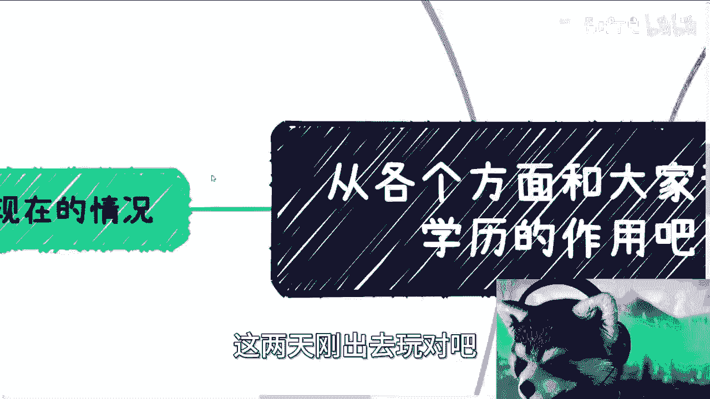
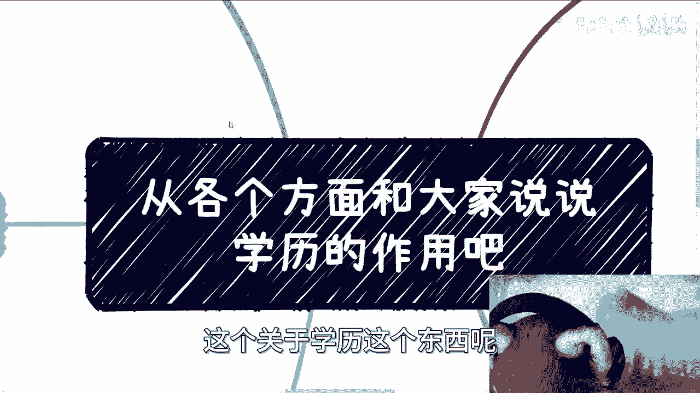
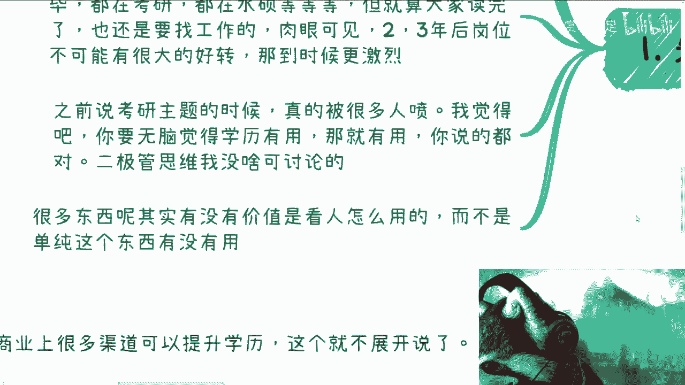
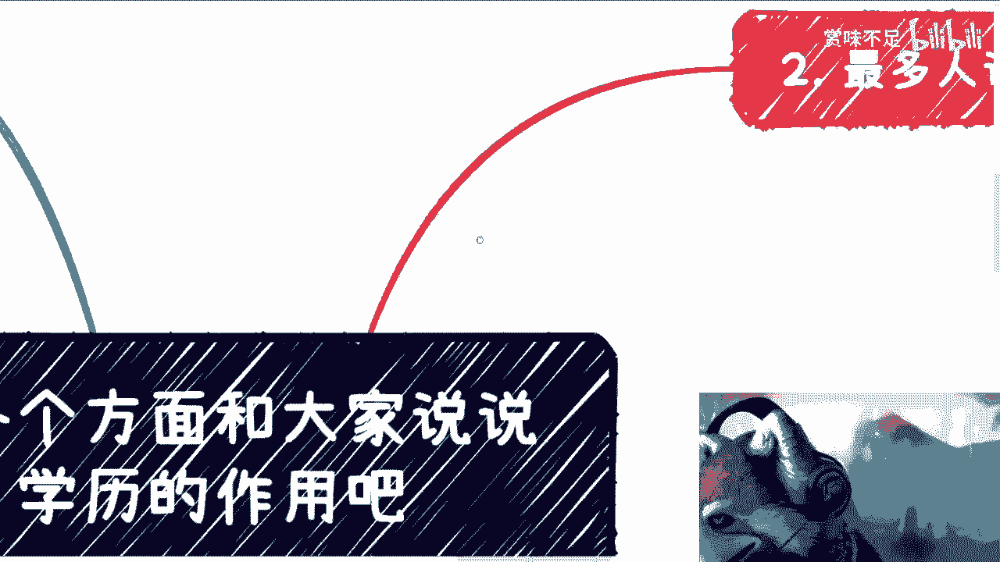
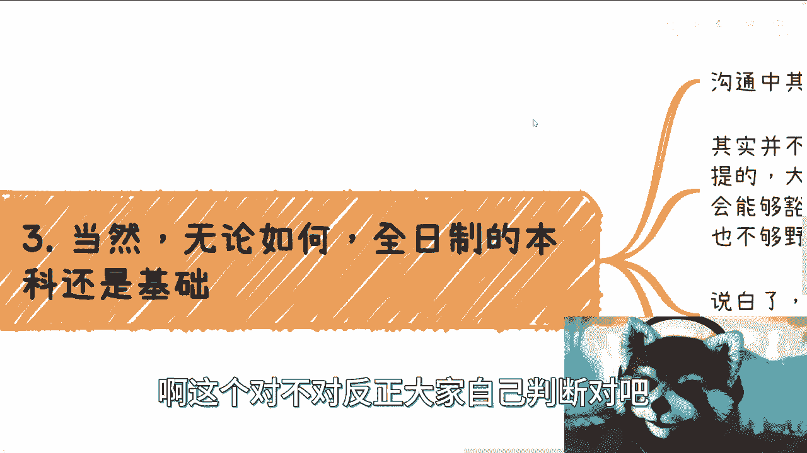

# 应届生商业专题 P1：重新审视学历价值 🎓

## 概述

在本节课中，我们将要学习如何在当前的社会与就业环境下，理性地看待“学历”的价值。我们将分析学历在不同路径中的作用，并探讨除了单纯追求更高学历之外，还有哪些并行策略可以帮助应届生更好地规划未来。

---

## 一、 时代背景已变：观念需要更新

上一节我们提到了课程的主题，本节中我们来看看讨论学历问题的大前提。社会环境与二十年前已截然不同。

过去（约2000-2020年），社会处于高速发展期，机会众多。高学历人才稀缺，大厂、公务员、创业等路径都呈现出巨大的红利。父母和老师基于那个时代的成功经验给出的建议，在当时是合理的。

然而，当下的土壤和环境已经改变。我们不能把过去的经验直接照搬到今天。例如：
*   **学历稀缺性下降**：硕士毕业人数已超过本科。
*   **大厂岗位饱和**：核心团队之外大量裁员，新人难以经历从0到1的成长。
*   **体制内竞争激烈**：公务员、国企岗位的竞争程度今非昔比。

**核心公式**：`过去的成功经验 ≠ 当下的必然路径`

---

## 二、 学历内卷的现状与未来

了解了背景变化后，我们来看看当前学历竞争的现状。市场上有多种提升学历的途径，如专升硕、本升硕、非全日制等。

以下是当前学历竞争的几个关键观察：

1.  **路径高度集中**：许多人仍认为“读书（追求高学历）是唯一出路”，导致大量人群涌入考研、读硕的赛道。
2.  **延迟的竞争**：读研需要2-3年时间，但这并非就业的“免死金牌”。毕业后仍需面对就业市场。
3.  **未来的白热化**：可以预见，未来几年全球经济增长放缓，市场难以提供足够的增量岗位来吸纳这批集中毕业的高学历人才。2-3年后的就业竞争将更加激烈。

这就像将压力不断后延，最终可能导致更集中的爆发。

---

## 三、 破除关于学历的单一思维

面对复杂的现状，我们需要打破非此即彼的“二极管”思维。学历的价值并非绝对，它取决于使用者本身。

同一个硕士文凭，有人能借此获得优质机会并创造价值，有人则仅将其视为一纸证书。因此，讨论“学历有没有用”没有意义，真正的问题是“**这个学历对‘你’实现‘你的’目标是否有用？**”

对于会折腾、有明确商业或实践目标的人，直接进入社会积累经验，其时间收益可能高于花费2-3年读一个泛泛的硕士。而对于实践能力较弱、需要平台背书的人来说，追求学历或许是更稳妥的选择。

**核心概念**：`学历价值 = f(个人目标， 运用能力， 环境时机)`

---

## 四、 深入分析“学历是门槛”这一观点

“学历是敲门砖”是支持追求高学历的核心论点之一。这个观点本身没有错，但我们需要更深入地审视。

以下是关于“门槛论”的两个关键思考：

1.  **门槛的性价比**：在极度内卷的环境下，花费巨大精力提升学历，最终可能只是换来一个**面试机会**，而非确保一个职位。当岗位数量固定而竞争者众多时，多数人依然会面临淘汰。我们需要思考，付出巨大代价只为换取一个概率不高的面试机会，是否值得。
2.  **门槛的可逾越性**：在许多情况下，特别是中小企业，所谓的学历门槛并非不可逾越。通过**关系网络、内推、线下活动结识负责人或创始人**等方式，完全可以绕过传统的简历筛选环节。这种方式与考研一样，都需要投入时间和精力去经营，但其成功概率和积累的资源可能更具长期价值。

---

## 五、 学历在不同路径中的作用差异

明确了学历作为“门槛”的复杂性后，本节我们来看看学历在不同职业发展路径中的具体作用。其价值并非一成不变，而是因“赛道”而异。

以下是学历在不同场景下的作用分析：

*   **全日制本科是基础底线**：对于绝大多数打算进入传统职场（打工）的年轻人，一个全日制本科学历是必要的起点。如果没有极强的创业或商业能力，这是参与竞争的基础条件。
*   **体制内与学术道路**：如果你目标进入**国企、央企、研究院或任何与国家制度紧密挂钩的体系**，那么“根正苗红”的高学历（如985/211、QS排名靠前的海归）是硬性要求。此外，各类国家职称、高级证书的评定也高度依赖学历背书。
    *   **公式**：`体制内竞争力 = 硬性学历门槛 + (关系/软实力 + 实际能力)`
*   **纯商业与创业合作**：在纯粹的商业合作和创业领域，**没人关心你的学历和专业**。对方看重的是你的**认知水平、商业思维、关系链和赚钱能力**。在这里，能创造价值远比文凭上的校徽重要。

---

## 六、 给应届生的行动建议

基于以上分析，我们可以得出更清晰的行动指南。未来的竞争只会更加激烈，因为大多数人仍在“打同一套牌”——只在学历上无限内卷。

我的核心建议是：**多条路并行，不要将所有筹码押在学历提升这一条路上。**

在确保拥有本科学历这一基础的前提下，你应该同步探索其他可能性：
*   发展一项能赚钱的技能或爱好。
*   尝试经营一个小生意或自媒体。
*   积极拓展社交圈，结识不同领域的人。
*   关注市场需求，寻找低成本的实践机会。

单纯在学历上内卷，未来很可能会产生“投入产出比过低”的失落感。尽早开始多线程探索，能让你在变化的环境中拥有更多选择权和抗风险能力。

---

## 总结

本节课中我们一起学习了如何在新环境下重新审视学历。

我们认识到，社会环境已变，过去的经验不能简单套用。学历的价值是相对的，它既是某些赛道的硬性门票，在另一些赛道却又无关紧要。对于应届生而言，**全日制本科是重要的基础**，但在此之上，应避免陷入单一的内卷思维。

最关键的策略是**多条路并行**：在完成学业的同时，积极发展实践能力、拓展社会网络、探索商业机会。只有这样，才能在未来不确定的环境中，为自己构建更稳固的立足点。

如果你对自己的职业规划、技能发展或创业想法有具体问题，需要更个性化的梳理，可以准备好你的背景介绍和问题清单，通过私信进一步交流。

---
**课程名称**：应届生商业专题 P1  
**核心主题**：学历价值的重新评估与多元化发展路径