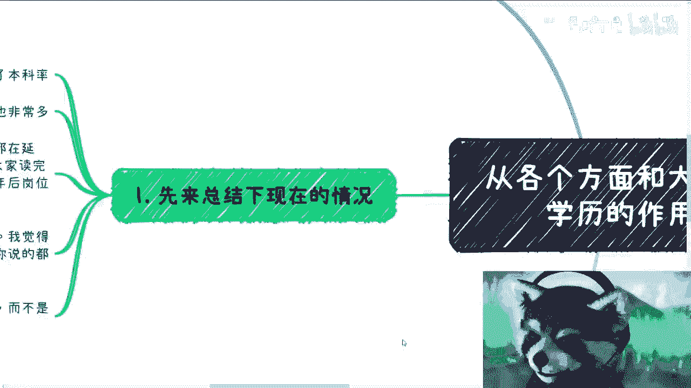
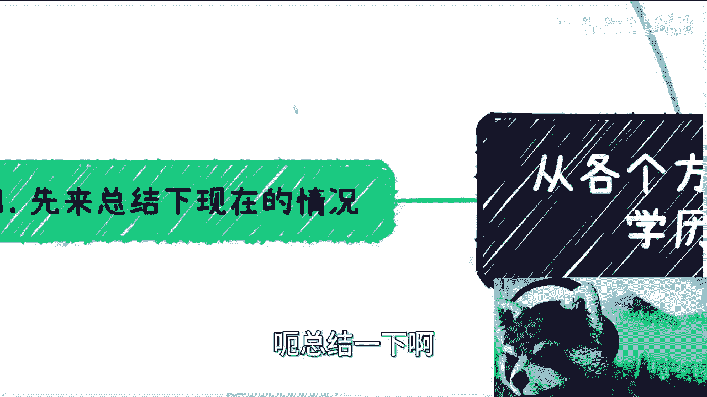
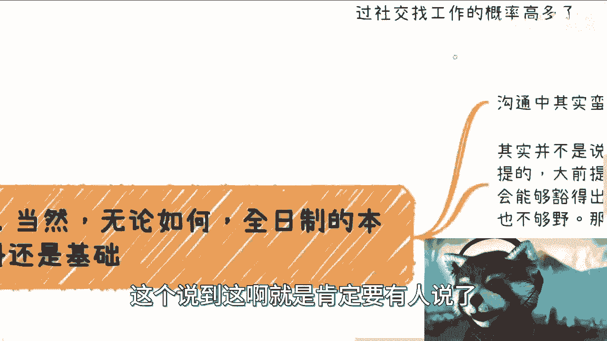
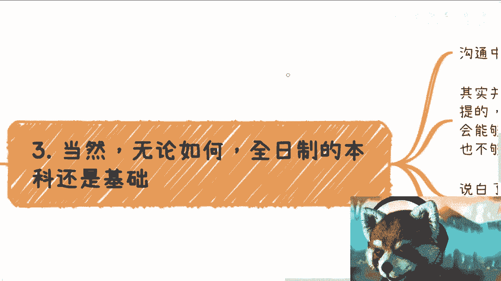
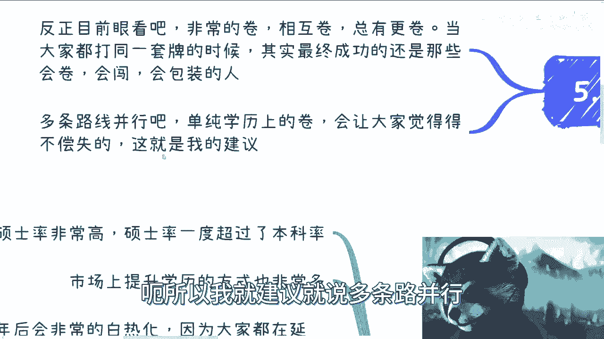

# 应届生商业专题：当下的环境，我们需要重新审视学历，不同的路作用很不同 - P1 - 赏味不足 - BV1Zr4y1R7i7

嗯好啊，大家好啊，这个这两天刚出去玩对吧。

这个来回开了600多公里，开的我人都傻了对，然后本来呢，我今天早上是给大家补了这个视频的，但是我后来发现我因为那个麦克风没带嘛，然后这个电脑的麦克风不太行，就露出来那种声音没法听啊。

就听听了晚上做噩梦的那种，所以我后来想想算了，就删掉再重新再回来给大家补一个啊。

这个关于学历这个东西呢。

因为这两天评论区讲的比较多啊，我顺便再来给大家总结一下啊。

总结一下这个情况啊，第一呢现在就是说啊收视率比较高对吧，因为前两年北京已经已经说了嘛，就硕士率的这个，这个硕士率也已经超过了本科率了对吧，那么我们还是说一下那个大前提。

大前提就是说啊我们不管是家长还是说孩孩子，还是说是这个学校里面的老师对吧，就是说我们的这个呃观念啊，不能老是拿2000年到22020年的这个观点，你说啊公务员怎么样，说大厂怎么样对吧。

呃说这个这个考研怎么样对吧，因为当时是很好啊，因为你稀缺嘛对吧，然后大城市也很好，因为大城市就是这个飞黄腾达嘛，正在正在上升期嘛对吧，然后你说创业也很好，因为整个国家各个地方都鼓励创业，也有钱嘛对吧。

然后包括就是说这个叫什么，就是就各方面其实都很好对啊，当当然还有公务员对吧，你说公务员这个铁饭碗对吧，怎么样子是没毛病，包括就是父母这一代所经历的也很对啊对吧，我们不能说他们说的不对呀。

但是我觉得最大的问题你知道在哪里吗，是在于当下的这个土壤跟环境跟当时不一样啊，我们不能把当时的东西直接照搬过来，你就像很多人跟我说，这个这个啊学历怎么样怎么样，那你现在都超过本科率了。

你跟我讲学历怎么样怎么样，对不对，那大厂同时也已经到达饱和，然后很多的那个那个核心的东西都裁员了对吧，核心团队核心团队除了核心团队保留着对吧，剩下的该裁都裁掉了，那你说你去除了螺丝钉。

你还有什么很大成长吗，你也经历不了大厂的从0~1，也经历不了1~60对吧，那你的成长肯定不如当年的，二零两千年到2020年代没断人吗对吧，那你说公务员，公务员现在也是一样的对吧，就像我说的。

就但凡大家去了解一下中国各地方对吧，这个当下公务员啊，国企央企什么情况就知道了对吧，你别怎么说呢，你就你真的要去了解，你就去找那些地方的人对吧，你别去听那些有的没的对吧啊，那我先说继续往下说啊。

就是说这个第二方面呢，市场上提升学历的方法有很多啊，呃这个专升硕啦，本身硕啦对吧，然后什么呃非全日制的全日制造很多很多，对不对，呃，然后另外一方面呢，其实两三年后会非常的白热化啊，因为你想嘛对吧。

所有的人啊，这个都感觉对吧，人生只有一条路，那么就是读书啊，这个怎么样子啊，然后大家都在岩壁啊，都在水硕，都在考研对吧，那所谓岩壁水硕考研呢，其实无非也就是那么两三年的事情啊，那么但是你想想看啊。

就是大家读完了，读完也不是说保送工作啊对吧，也不是说呃这个完完全分配工作啊，你读完了你还是得找啊对吧，那么也就意味着什么，意味着在这个两三年后的时间里面，肉眼可见的哦，就是说啊无论是中国还是全球。

其实都不可能，在两三年内找到一个很大的增量市场，你说这个增量市场能带来非常多的岗位，我不相信呢，哦你你们要是相信你们相信我，反正是不相信的对吧，然后你说热热眼，可见两三年后岗位既然不可能有很大的好转。

那么你想看两三年后，这些人要出来不是更加激烈吗，这不是明摆着的事情吗，对不对，这就有种让我什么感觉，你知道吗，就有种就是说这炸弹明明早就可以炸了对吧，那早点炸早点好对吧，非要往后拖对吧，拖着大家一起炸。

我也不知道有有有什么意义对吧啊，那么之前其实说考研的主题时候呢，已经被很多人喷了对吧，我觉得呢就是说还是那句话，你要觉得你要无脑，觉得学历有用，那就有用啊，你说的都对，会计没什么好说的，有啥好说的呢。

对不对啊，就是所有的二极管思维，我觉得都没啥好讨论的，这就好像什么，这就好像就是之后其实也有很多人找我聊过，你知道吗，然后他们也跟我讲，他说哎吕老师，你当时不是说啊考研没有用嘛对吧。

然后你为什么要跟我说考研有用，我说有没有用，是看人的对吧，我说你不能所有东西一刀切，就说他有用，说他没有用对吧，那不行的呀，包括我视频里面，我跟大家说有用或没用，我也是都说前提的对吧啊。

我也都分人分情况的，我也会跟大家说，你要是会折腾会怎么样，那你去考研可能我也是支持的对吧，你要是不会就是同样的，你不会折腾不会怎么样，那你就更应该去考研了，对不对，但是话又说回来。

你要是会折腾会怎么样子，那么你当下出来，可能这个时间点，你工作会比你考研选择更优一点对吧，我只是这么一个说法，没有说一定考研不好或考研考研好，这种观念没有意思的呀，对不了。

那很多东西其实我跟你讲有没有价值，看人怎么用的，而不是说单纯这个东西有没有用，因为很多东西都是死的对吧，你就同样是一个硕士文凭，有的人可以用这个硕士文凭混得风生水起。

有的人可以用这个硕士文凭去去赚到很多钱，但有的人可能对他就是个文凭，那你想想看这个学历。

就此学历跟比比学历是一个东西吧，对虽然是一个东西。

但是它价值就不一样，对不对，这得看人呐啊好吧。

然后这个那个我们来说啊，第一点就最多人说的这个学历就是门槛，对吧啊对啊，我跟你讲这句话没有错啊，但是你要想啊，就当下这个这个社会的情况，岗位的数量，大家卷的程度，你拼命往上卷，卷出来之后。

你卷出来的不是一个岗位，你卷出来的是一个面试的机会，但是依然哦你会发现岗位就这么多对吧，但是在外面卷的人很多，那么也就意味着依然会有非常多的人，没有这个岗位，最终没有这个工作，那么我就问嘛对吧。

难道我们9年制义务教育，高等教育，大家往上去卷，拼了死命去卷，卷到最后只是一个面试机会吗，我我我表示很难理解，对不对，这是第一点，第二点是如果我们说学了这么多年，就是为了这个门槛，那么这个门槛机会。

我其实是不知道到底图什么对吧，那么还是那句话，很多时候呢，我觉得我们被关灌输的是曾经的一些经验，就像我一我一开始说的啊，就是2000年到2020年的那段经验，包括甚至一九就是九几年对吧。

这个时候的经验你比如公务员很稳定，大涨很好，全民创业，但是问题是现在跟当时天壤之别了对吧，我觉得但凡有一点点感同身受的人就能明白，就是这这这一塌糊涂啊，简直就是啊，而且很多时候这个门槛并不是不可破的哦。

比如你就想想看，你通过一些关系联系到hr，或者是一些公司内推对吧，或者来说是线下活动去认识这些这个hr对吧，或者认识叫什么，就是我们说的诶，我的那个呢哎呀，对吧。

就是或者说你通过一些活动去认识一些创始人，或者怎么样子对吧，那么这种啊其实所谓的门槛也只不过是个过滤，而不是说完全不能改的东西，其实很多时候我们通过内推，通过别的方式是可以达到我们去一家公司的。

只要不是特别大的公司对吧，你说你今天遇到马云，遇到刘强东，那的确不可能，那你要是一些小公司的中小型企业，你遇到个什么管理管理层对吧，或者说COFOUNDER对吧，或者说H啊。

我觉得这个概率还是蛮大的对吧，那有的小伙伴要说了，他说哎我觉得这概率也很小，而且很累很麻烦，那你要我说啊，你自己想看对吧，你说你你读书你去读研读很多东西，你也很费钱啊对吧，你也很烦啊。

什么东西不麻烦都麻烦的对吧，那你最后跟我说还是博个概率，那我个人是觉得可能还是通过社交找高，找工作的概率高一点啊。

真的我是这么觉得的啊，对吧啊，这个对不对，反正大家自己判断对吧好。

那么然后呢这个说到这啊，就是肯定要有人说了。

有小伙伴要说了，他说这个呃读书是老百姓唯一的出路对吧，或者怎么样子啊，我无数次强调过一个事情，就是我从来都承认对吧，就是呃读书是老百姓唯一的出路，同时我也承认知识是改变命运的唯一的出路，没有错啊。

这没有错，但是从来没有人说过，学历是改变命运的唯一出路，你们知道什么意思吧，就是说所谓读书跟知识是让你能够读读出，读进去，需要能够融会贯通，需要能够真正的把你这个人提升任职，这叫读书。

不是说我们拼了死命去卷一个学历出来就对吧，就就我真的觉得就是说那没必要，就为什么一定要去认这个死理呢，对吧，没有必要，非要我说到这，肯定有还有很多人说的啊，读书就是学历，那那那我也没什么好讲的对吧。

那第二点。

当然无论如何呢，我觉得全日制的本科还是基础呃，沟通当中呢，其实我发现B站上还是有一些小伙伴，是高中或专科学历的，呃其实并不是说一定啊，就是我们说什么什么学历啊，或者怎么样子，但是就当下这个社会情况。

如果你们你还年轻对吧，就是就是呃比如说正在读高中，或者说读大学的这么一些人啊，我觉得不管怎么样，呃，就算你会折腾，你会来事，你会赚钱，你能够豁得出去，你路子很野，但我依然觉得你要有一个本科学历啊。

不管怎么样啊，就是很多人其实没有那么强的行动力，也不够严，那么你就更必须得要有个技术学历了对吧，那么说白了就是你要是想打工，你就必须去必须去卷，你没有别的选择，就是无解的对吧，你要么就跟我一样。

你你就不打工对吧，你找些别的方式，对不对，那没练，你就这两种选择，你还能怎么办呢，对不对啊，那前两天有评论说呢，就说什么未来呃，希望能有一个稳定的78K的收入对吧，呃我当时是这么回的。

我说第一呢就是你肯定得有一个嗯，本科的那个学历啊，呃同时呢就是说那个78K输入，其实在当下这个情况来讲已经不低了，说实话已经不低了啊，呃我当时还回了一句，我说可能你真的对中国的基本盘。

就是目的这个环境不了解，很不接地气，我说真正你要有稳定78K，你没一个你你还不想考一个本科出来，你你怎么个稳定七八开发，然后他还跟我说，他要求不高，我只能说说实话要求已经很高了，真的很高了啊。

甚至未来你78K一个稳定收入已经是奢望了，好吧我我就这句话只能放在这了啊。

那么那么第三点啊，我来说一下我们这个学历的作用啊，呃商业上很多渠道呢可以提升学历，这我就不展开说了对吧，就是很多种方式，你哪怕花钱对吧，这个提升也有很多种方式啊，那么这第一个。

那么第二个呢就是说商业上面啊，全日制不全日制，其实根本没人在乎很多场景，要的呢就是你有就可以了，什么QS多少啊，什么东西，这个都不重要啊，你有就可以了，但是呢话又说回来啊，就是你只要跟国企央企研究院。

就是跟这个国家跟这个国家的一些制度，只要有关系的啊，而且是就是就是必须走这种正规制度的对吧，那么我跟你讲，你没有办法的，你就必须要有那些跟正苗红的高学历，或者QS靠前的海龟对吧，就是这是个基础。

当然这也只是一个充分非必要条件，那剩下的可能还得看你是不是会跪舔啊对吧，你硬实力强不强啊对吧，你不能是个花瓶吧，对吧啊，那么剩下的你的一些国家的职称对吧，一些就是说呃对应的。

比如像像像一些呃高级的教师啊，或者说其他的一些证书，反正你只要往这个国家大框架上面去靠的，一切的名头，你都是需要学历来做背书的，这也是没办法的啊，但是商业上如果纯粹的合作啊，就是说学历专业你以前做什么。

这个没人关心的嗯，没真的没有人关心的啊，重要的是你的认知，你的关系链啊，以及你商业思路是否清晰，这是非常这个是很简单的一件事情啊，那么你包括之前还有评论区很搞笑的跟我说，他说啊，你没有学历。

人家谁跟你合作这种，我跟你讲这种话说出来就是根本没有做过商业，也没赚过钱啊，就最多打过工啊，你真的去赚钱，我真的也是搞笑的，你真的去赚钱，我就问啊，你今天碰到一个人对吧，他我跟你讲，他很能赚钱。

然后呢你去问他嘛，哎哥们儿，你你学历都有什么专业什么，你想做什么，你关心这个吗，你关心是赚不赚钱呀，哎呦我跟你讲，中国很多人就是虚伪，真的是虚伪，就是，就是他话呢在评论区这么讲啊。

但凡他碰到一个赚钱的人，我跟你讲，他也不会问他学历，问个屁，要么真的是对吧，舔还来不及，那目前啊那个第五第四点啊，就往后的这个情况啊，目前来，反正目前来看呢就是看得见的时间里面啊，呃非常的卷啊。

而且相互卷啊，底层相互卷啊，你你你你更卷，总有比你更卷了啊，那么目前为什么会变成这个情况呢，也是因为大家都打着同一套牌啊，就是这个只能选学历嘛对吧，本科生卷硕士，硕士卷，博士啊，博士卷博士后对吧。

就这个样子啊，最终呢呃你会发现成功的呢，其实还是那些在同等学历的情况下，会卷会闯，会包装，会归田的人，对吧嗯对吧，那那这个没有办法啊，那么同样的呢，我觉得我反正建议一直是这样子的，就是多条路并行啊。

单纯学历上卷呢，我跟你们讲啊，你们未来多多少少都会觉得得不偿失，就是有种什么呢，有种就说卧槽他妈的我读了这么长时间，我图啥的这种感觉啊，我跟你们讲，早晚都会有的啊，呃所以我就建议就是多条路并行。

那就我建议啊，这个大家听之呃，就就想想就可以了。

好吧哎我真的觉得就是所有的免费视频对吧，就就也没什么好争的，有啥好争的呢，就是你要同意对吧，那我就比较庆幸你要不同意，那你就当没听没看过我这个视频不就好了嘛，对吧，我就觉得唉就我就觉得很奇怪的。

就是说啊我我我做啥，我说啥可能也是基于我个人经验对吧，我也不敢说我说的一定是对的啊，但是呢就是说呃我也愿意去给大家告诉大家，就是说很多啊可能我看不惯的对吧，或者说我觉得哎呀非常腐朽对吧。

腐烂的一些东西对吧，人，但是还有人非要就是就是有种什么感觉，你知道吗，就是我明明是为了大家同等的这个底层同学，他把这个为了大家的这个出发啊，来做这些视频，而且这个视频也是免费的。

我我也没有我我我发这个视频，从B站角度或者从别的平台角度，也没有任何平台能够强制大家付费吧对吧，就我不知道为什么就是还有这种就底底层，大家明明都是对吧，同一个level的，然后哎还要我我还还要来跟我说。

哎呀这个你说的不对对吧，怎么办怎么办，那不对就不对呗，哈哈行吧，就这么着吧好吧，就我希望大家对学历能有个正确的看法吧，别别太一刀切就好了好吧行吧，这个时间不早了啊，然后那个反正大家看吧啊。

有什么呃首胜什么牌对吧，然后这个未来职业规划的啊，包括可能也是想做点什么，就自己如果有些什么兴趣爱好，有些什么特长的，想做点什么的好吧，你们呃要是觉得啊需要我帮你们整理的，或者怎么样的，你们就写好啊。

完善的这个question list啊，然后包括这个背景介绍啊，然后私信我，我们可以再走咨询好吧，都随缘啊。

