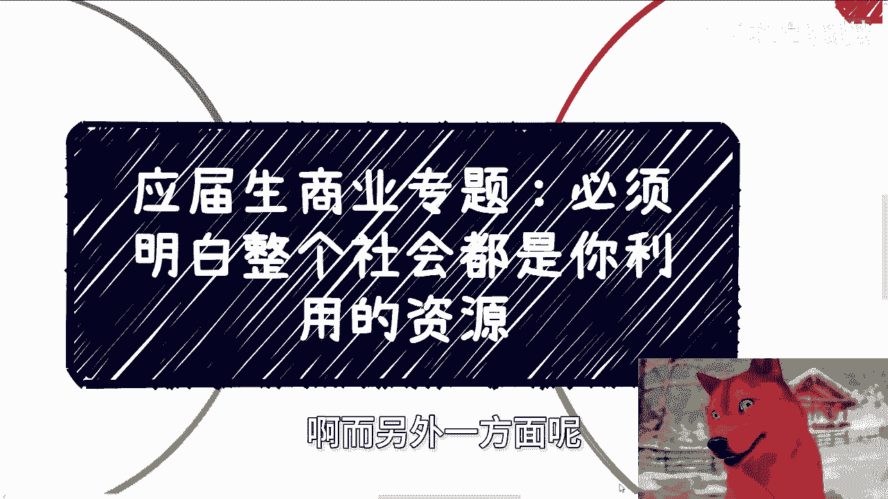
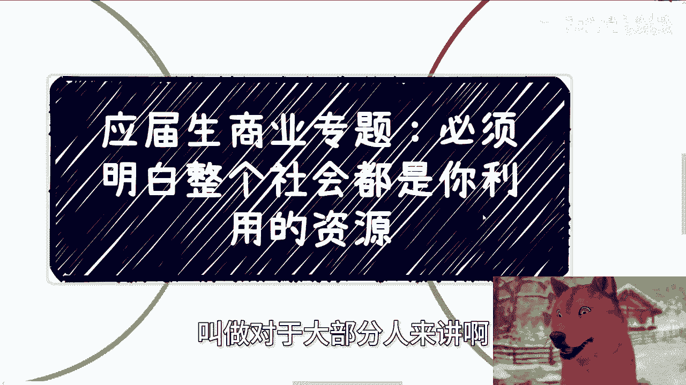
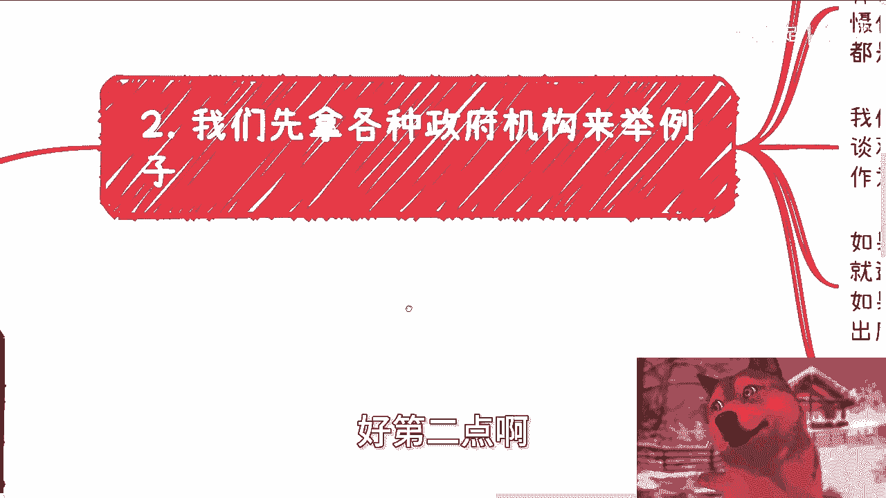
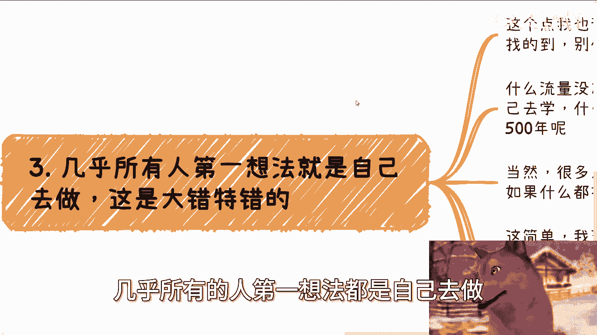
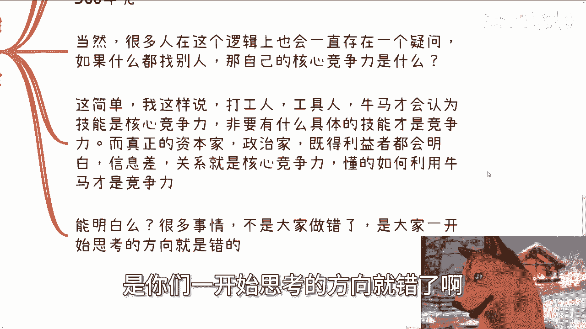
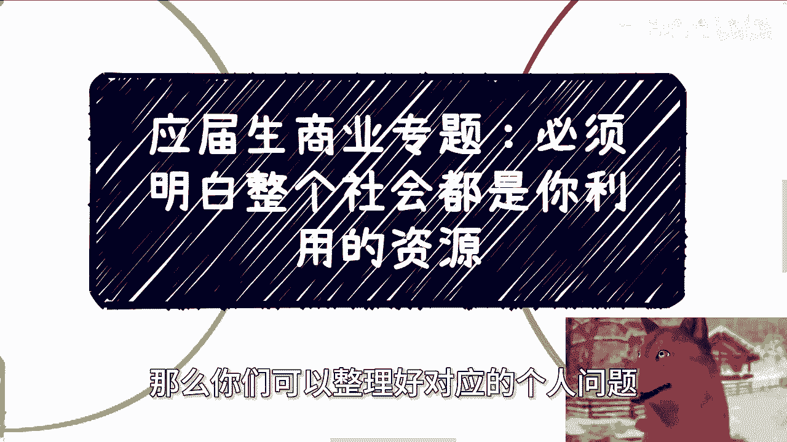

# 应届生商业专题 P1：必须明白整个社会都是你可以利用的资源 🧠

在本节课中，我们将学习一个核心的商业思维：如何将整个社会视为可调用的资源库。许多人的困境并非源于“一无所有”，而是源于“不知何为所有”。我们将通过几个关键点，帮助你转变思维，学会发现并利用身边的资源。

---

上一段我们提到了思维转变的重要性，本节中我们来看看具体的实例和操作逻辑。

## 1. 资源认知的误区

很多人会审视自己的家庭和社交圈，然后得出结论：自己没有任何可用资源。但问题根源通常不在于“没有”，而在于“不知道社会有什么”。

**因果关系公式**：
> 困境 ≠ 你没有资源
> 困境 = 你不知道社会有哪些资源可用

如果你只是暂时没有，可以努力将其变为“有”。但如果你因为“不知道”而断定“用不了”，那就陷入了思维误区。在我观察范围内，所有业务做得好、能赚钱的人，无一例外都懂得利用外部资源。单打独斗、完全依靠自己是不可能的。

---

理解了误区所在后，我们来看看如何与一类重要的社会资源——政府机构打交道。

## 2. 以政府机构为例：合作与变现的逻辑

我们与政府机构合作的逻辑主要有两种：
1.  直接签署合同，获得金钱收益。
2.  无法获得金钱时，争取获得名誉、背书等无形资产，再利用其进行变现。

很多人初入社会容易被各种头衔震慑，但慢慢会发现，其中绝大多数人无法将头衔转化为实际价值。因此，与政府机构打交道时，应遵循以下优先级：

以下是合作推进的具体步骤：
1.  **第一优先级是达成合作**：无论对方是否有预算，先以达成某种形式的合作为目标。
2.  **争取官方文件背书**：如果无法获得针对项目的具体文件，争取获得上级单位的笼统性支持文件亦可。
3.  **策划小型活动**：如果连文件也无法获得，可以策划小活动邀请对方领导出席，通过合影、新闻报道等方式获取宣传材料用于后续变现。

核心在于灵活。不要只盯着一条路或一个合作方“薅羊毛”。如果A机构不合作，就尝试通过B方式或C渠道达到目的。

---

学会了与机构合作的思路，我们再来解决一个更普遍的思维定式：凡事都想亲力亲为。

## 3. 摒弃“凡事自己干”的思维

这是最常见的错误。社会上几乎任何事情都能找到对应的服务或人才，无需事事亲为。没有流量不必自己从零做起，技能不足不必花多年时间去学，学历不够也不必只想着自己去考。

很多人会问：如果什么都能找别人做，那我的核心竞争力是什么？

**核心概念辨析**：
> **打工者思维**认为：**具体技能 = 核心竞争力**
> **资本家/资源整合者思维**认为：**信息差与关系链 = 核心竞争力**

懂得如何发现需求、整合资源、利用专业人才（即“利用牛马”）才是真正的竞争力。许多人的问题并非做错了事，而是一开始的思考方向就错了。

---

解决了“自己干”的困惑，另一个常见疑问是：别人凭什么与我合作？

## 4. 破解“合作资格”疑虑

很多人会想：我一穷二白，社会资源凭什么与我合作？

首先，社会本身就是一个由众多“草台班子”组成的大系统，合作本就是常态。其次，我们需要用概率思维思考这个问题：

**概率选择公式**：
> 让14亿人都与你合作的概率 **VS** 在14亿人中找到一两个愿意合作的人的概率

显然，后者的概率远大于前者。我们的目标是找到“能合作”的人，而不是纠结于“为什么大多数人不合作”。基数如此之大，总能找到合作者。

在社会上做事需要随机应变，非常灵活。它不像数学题有唯一解。合作规模也可以很灵活：赚不到几百万，可以从几十万、几万甚至几千的合作开始。关键在于行动起来，去寻找和建立连接。

---

## 总结

本节课我们一起学习了如何将社会视为资源库的核心思维。我们剖析了“资源匮乏”的认知误区，学习了与政府机构等资源方打合作的逻辑，摒弃了“凡事亲力亲为”的错误观念，并破解了“缺乏合作资格”的心理疑虑。大部分人的迷茫点在于觉得自己“什么都没有”或“什么都不会”，但更关键的问题是“你需要拥有什么？”以及“你需要亲自会什么？”。资源在于寻找、熟悉和利用。