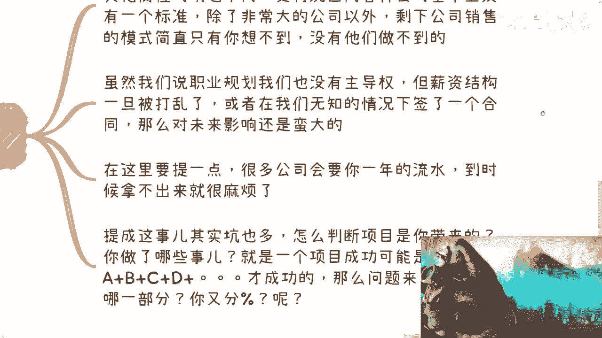
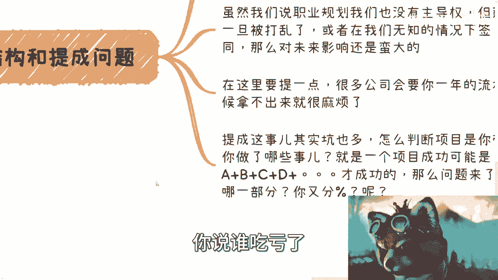
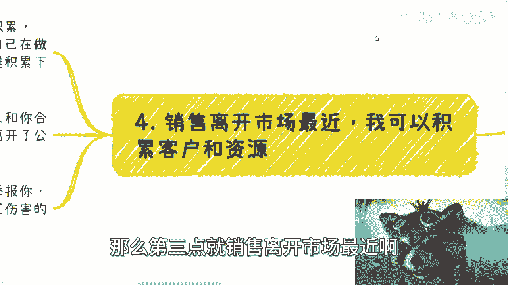
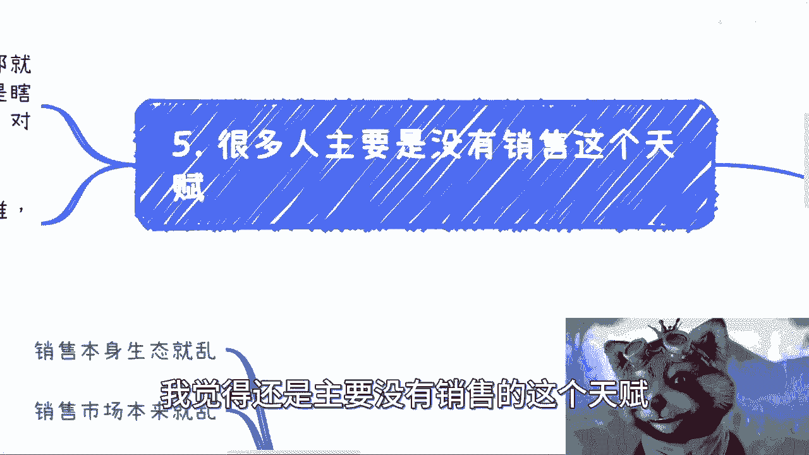
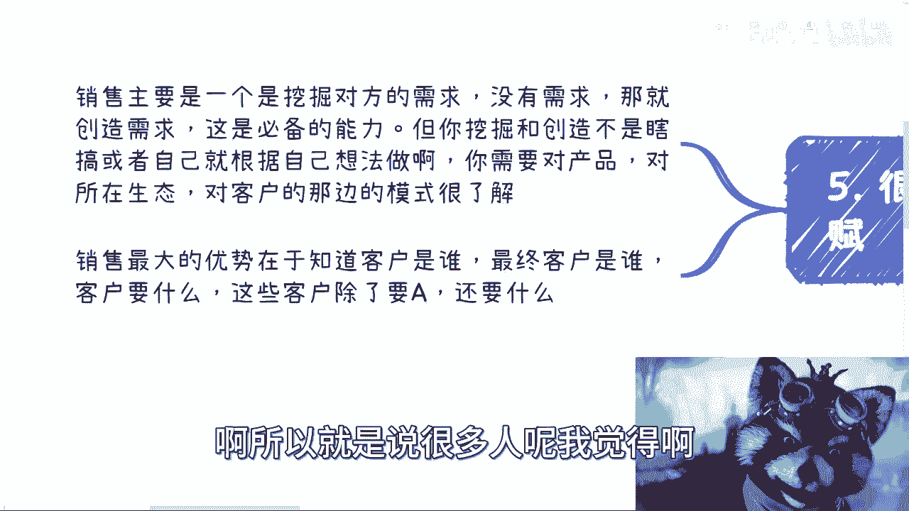

# 应届生商业专题：我为什么不建议大家去做销售 - P1 - 赏味不足 - BV1bN411z7r7

好大家好啊，这个今天下午在那边打帝国时代四是吧，这个我发现帝国时代四比我更懂中国人啊，那么中国人有一个专属的兵种叫叫朝廷命官，妈的朝廷命官还能够这个从各种建筑里面，这个搞多搞点钱出来啊。

不愧是中国风格啊，牛逼啊哈好，然后这个啊这个再给大家补个主题啊，可以给大家补个专题，就是啊日常沟通呢我也一直在说啊，我不建议呢就是说大家去做销售，那我这边正好跟大家展开展开说一下啊。

这个为什么我不建议做销售，当然不是因为我戴着皇冠，所以不建议对吧啊，呃首先第一点啊。

说一下综合原因呃，主要点呢是在于说销售本身它的生态啊，还有这个市场呃，他就乱他跟别的这种岗位啊，或者其他的这个这个这个，这个这个工作情况不太一样啊，那这是第一个，第二个呢就是说销售。

我觉得对很多人不了解的人啊，他比如说病急乱投医对吧，他说我找不到工作，或者我这个性格比较好对吧，他说我就会去做销售，那呃这个东西呢，它它会打乱一个人的薪资结构啊，我就跟你说，就是这这是第二点啊。

第三点呢就销售这里面的坑也很多啊，就是我待会跟你们讲呃，还有一点呢就是个误区，误区就是说很多人也觉得呢我做一个sales对吧，就销售或者BD啊，他说呃或者商务啊，他说我能够去积累呢。

我的这个呃这个客户和资源，那当然啊就是商务跟销售，就是我们说的sales跟BD，那它还是有点区别的，但是这个耐不住中国这个中小企业多啊对吧，耐不住这个二线到五线城市，就一线到五线城市里面。

这个这个叫什么企业多啊对吧，有很多我这就这么跟你们讲吧，很多企业它其实是不分的啊，那你别管他是这个节省资源对吧，还是说是怎么样的，反正他就不分啊，这就好像你这个这个打帝国时代对吧，在第一个文明的时候。

他家里面兵种就少是吧，你谁还给你分什么bd sales啊是吧，你一个农民什么都能干啊，呃然后我觉得当然你从我角度来讲啊。

我不建议大家做的综合原因啊，这就是核心的是我认为很多人他没有天赋啊，就是我见过做销售很有天赋的人，所以我很清楚他他有天赋是怎么样这种人，但很多人你你单纯看他问出来的问题。

跟他跟你沟通，你就知道他没有什么没有天赋，你知道吗，哦所以就没必要去卷嘛对吧。

那我觉得这是第一点啊，第二点啊啊这个是这个综合。

第一点呢就是这个销售生态啊，跟这个市场的混乱啊，我觉得有一说一啊，真的要做啊，我建议还是去外企呃，就是你既能学到一些流程上的东西，你也能学到一些啊，就是宏观类的东西啊，包括就是说这个PDF啊。

产品介绍啊对吧，包括你这个这个整个的一套流程啊对吧，那包括你也能积累到合适的小伙伴啊，还有资源，而这个有的我觉得外企是好的啊，啊当然这个不是说国企，也不是说国内企业不好，但是你客观的说嘛对吧。

你不能说啊，驴老师就一直说外企好是吧啊，那说回来啊，销售其实呢是适合有天赋的选手啊，选手啊，我最近的普通话不太行啊，啊一般的人呢别就感觉啊，就貌似自己的这个性格比较开朗啊，他觉得我很能讲啊，或者怎么样。

我跟你讲啊，这个东西呢你只能说是充分非必要条件啊，你有这个东西我觉得是有一个优势，但并不代表你能够或者你适合做销售啊，这两码事儿啊，那么我们以前呢其实招聘过市场上的销售啊，就我以前在跟别人创业的时候吧。

啊那很多销售呢感觉我跟你讲啊，这就跟很多人读书读傻了是一样的，就是你问他啊，你优势是啥，你知道吧，都说哎我以前是销冠啊，我多牛逼啊，我成交了多少项目对吧，我多少流水啊，这个我跟你讲啊。

现在他们这种卖to b产品了，那跑出来不说几个亿的流水都不好意思啊，说他以前是销冠对吧，但是问题是什么，问题是你就会发现很奇怪，就是你说吧是几个亿的流水啊，但是你从他的这个你跟他沟通下来。

你会从他的这个格局啊，从他对于产品的了解，从他的各个方面的要求，你根本就感觉不出来他是一个几个亿啊，拿到几个亿的这个叫什么提成，里面的这个这个这个销售的这个格局，你知道吗，就完全感受不出来啊。

那么另外一方面呢，就是说关键是一个销售好和不好啊，你单纯从面试沟通，其实你就能看得出来，你知道吗，就是说你跟他比如说沟通20分钟啊，你从他的格局啊，从他的谈吐啊，从他的各个方面你完全能看得出来啊。

就是我跟你们这么说，我后面写的很清楚，就是销售这个东西啊，我跟你讲啊，销售这个东西啊，它其实是一个两者的一个综合体，是什么呢，就是它会要有一定的技术含量啊，他会要对很多东西他要有理解。

但是我不是说他一定要会写代码，你知道吗，他会懂技术哦，同时他还要懂得怎么去卖东西，那什么叫怎么去卖东西，那这个里面就包含比如说他知道对方要什么，他知道要用什么样的话术。

他知道这个话术应该通过怎么样的表达风格，表达出来对吧，这就好像我以我这两天跟我们那个小伙伴，线下沟通的时候，我就说我说我们怎么能做成一个很好的一个，沟通者对吧，或者社交者。

就是你要明白你跟C端的用户讲什么话，你要明白你跟政府领导用什么话术，是怎么口气对吧，你要明白跟产业园跟协会怎么打交道，你要明白跟那些企业高管怎么打交道，你要明白怎么跟互联网企业，怎么跟金融企业。

怎么跟实业里面的人打交道，你要明白怎么跟三教九流打交道对吧，就是说你要明白的是，你面对不同的人，你其实会有不同的话术，也有不同的这种这个这个沟通的方式对吧，包括就是说啊。

这个就说白了你该你该正规的时候正规，你该野的时候也你知道吧，你就是个八面玲珑的这么一个角色，没办法的这件事情啊，因为你但凡这当中我们就像我们刚刚说的，他其实就是个就是点对点连线嘛对吧。

你但凡左边跟右边线连错了对吧，你用一个什么面向政府领导的这种话啊，这种这种这种呃话术或者语气，去面对那些三教九流，你看人家不，你对不对啊，那我跟你讲啊，但国内呢现在这个情况呢一切都不重要，为什么呢。

因为国内就是扭曲嘛对吧，就是我们说卷嘛其实都是在恶性竞争嘛，那国内恶性竞争到现在，其实你会发现一切都已经不重要了，就什么技术啊，什么那些那些我刚刚说的话说哎这扯淡，你知道吧，最重要的是什么，就是关系。

就是说白了就是你不择手段，你就要把这个关系搞好，我不管你用什么方式对吧，你别管啊，那国内现在就是这么个情况，那怎么办呢，对不对啊，那这是第二第一点，第二点呢就是薪资结构，就我刚说的这个package。

还有这个这个集成问题啊，就虽然销售也是有这个package的这个概念啊，哎呀我不喜欢这个蓝色，我想换，我靠他不让我换啊，这有点垃圾了哦，可以可以可以诶，可以吗，哎可以可以可以换换换换对吧。

就是就是你虽然有package这个概念，但是薪资结构跟其他岗位的确不同，因为你有底薪啊，你有提成啊，包括你提成计算方式也不一样对吧，你跑多家公司，人家问你，哎你薪资多，你拍给出去多少啊。

你跟他说我100万哦，那100万怎么定的啊，你底薪多少，哎，我底薪只有1万对吧，哦那那你这100万怎么来的哦，我还有股票，我还有提成，我还有年终分红，我还有什么东西，人家企业就炸了好吗啊对吧。

那所以说呢就是另外一方面是什么呢，就是更何况就像我跟你说的，国内呢一线到五线城市，这企业不规范的不合规的哎呀多了去了，你知道吗，他妈遍地都是啊，就是说国内公司它基本上就没一个标准哦，就我跟你讲。

除了非常大的流程比较规范的那些公司，或者是专门就是做这种sales的这种企业，剩下公司的销售模式我跟你讲啊，简直只有你想不到，没有他们做不到的啊，就说白了如果要做sales啊或者BD啊。

那么你们的这个合同得擦亮眼睛看看仔细哦，我跟你讲，这合同里面坑多如牛毛啊，这还是那句话，只有你们想不到，没有他们写不到的啊，那么虽然呢我们以前也说过啊，就这个职业规划呢我们没什么主导权对吧。

这也没毛病啊对吧，大家作为老百姓哪有主导权啊对吧，都是随波逐流啊，但是啊薪资结构这个东西一旦被打乱，我跟你讲，或者在我们无知的情况下，就像我刚刚一开始说的，很多人对吧，进病急乱投医对吧。

这个他说我找不到工作，那怎么办呢，他说我就是这个包括可能和身边人也很无知啊，身边的人包括他父母啊，这个这个处呃，就就就就就就在那边忽悠他对吧，你要做销售啊，怎么样怎么样啊，那签一个合同，我跟你讲。

这种合同签下来对未来影响是很大的啊，因为这个东西你的薪资结构package1旦变了之后。

这东西后面你怎么改，你告诉我你怎么改啊，你刚跟我说哎我现在是一个销售啊，然后你说我我接下来我不想做销售的对吧，我想做点别的东西，那你这个薪资结构，你回头怎么搞啊，你自圆其说去啊啊，有的有的有的有的搞了。

我跟你讲啊啊，然后这个是一方面，然后还有一点呢，就是说企业呢，它其实有时候呢他为了这个验证你的薪资，他会要你一年的流水，你到时候这个流水吧，我跟你讲，拉出来我估计也会很难看。

因为很多时候啊就是我跟你讲什么，就是很多时候就是你做销售，他这个提成啊，他很多时候他会给你克扣啊啊delay啊，延迟啊对吧，各种各样的那这种东西你怎么弄啊，对吧好，那么提升这个东西呢，其实坑也很多。

因为有很多人会感觉啊，他说哎我们这个一个单子对吧，几百万几千万啊，然后这个公司跟你说，你你你做销售对吧，你这个提成有20%，那么你算算哦，1000万20%，卧槽牛逼啊对吧，但是啊但是我还是那句话。

你要明白，你就天上不会掉馅饼，你去买彩票，你也不会中奖哦，同时你作为一个打工人，你资本你面对你的老板，你就是个工具，工具是什么工具，就是给你一份底薪往死里用啊，没有什么可能性，给你多赚钱的。

没有这个可能性的啊，那么也就是说什么意思呢，就是说一个项目成功啊，可能是会有售前，可能会有美，就很多次的这个沟通，也会有很多次出差，很多次的差旅呃，很多次的这个这个吃饭应酬很多次，什么东西对吧。

才会成功，那么我就跟你讲问题来了，我就问你啊，你算哪一部分唉，你算那20%里面的百分之多少呢对吧，那很多人不管的，很多人一开始就就被忽悠了，就觉得卧槽牛逼啊，20%哎，我能赚10%跟你有蛋关系对吧啊。

到最后你跟老板去扯皮呗，你扯你说哎呀，我我我这个都是我做的，我难道不应该20%吗，那老板跟你说了，这销售根本不是你做的呀，这客户我们以前就有的呀，跟你有什么关系呢，对吧，你只是说对接一下。

对接项目给你100%分之2%，5%差不多了，那你怎么弄，老子不干了，跳槽，那你跳呗，你跳呗，对不对，然后到最后公司单子成了对吧。

哦你跳了，你的这个这个履历很难看，你说谁吃亏了。

对不对，你没有用的呀，啊那么第三点就销售离开市场最近啊。

我可以积累客户资源，这个东西就是个误区啊，其实这个事儿吧，我跟你们讲，你就这么想，你说能不能积累能啊，但是这个人呢你得懂方法，你得有天赋，你得懂得察言观色，你得懂得怎么用话术对吧。

你得知道自己在干什么啊，而且我跟你们讲，每个不同的行业，包括互联网，包括实业，包括互联网里面的各个不同行业，它都很不一样对吧，就是销售模式啊，包括整个上下游模式，上下游的这种关联度啊，它都不一样。

你得先摸清楚啊，啊你别感觉就是说啊我今天是个sales的，我就牛逼了，我能够去直面客户了，是你用你的小99sales这个岗位发展这么多年，我们就说从这有这个岗位开始，谁不懂啊，啊对吧，呃就就就你聪明。

天下都不聪明是吧，那我跟你讲这个很多岗位，小九九老板都知道，老板会不知道吧对吧，说白了啊，你跟别人合作，别人跟你合作不是看你是谁，他是干看你所在公司啊，你知道吗，真正看你是谁的。

这个就已经是叫做什么high level对吧，就高级操作了，但是一般性你不操作不来的呀，对了，你离开公司一般就什么都不是对吧，你别人还怎么合作哦，你说你今天对吧，代表公司你去谈个业务啊，可能这边总监啊。

VP啊对吧，或者来说扣分的啊对吧，这个大家过来过来合作对吧，那你离职了，你我跟你讲，你再去约约看，你看这VP，你看这VP总结，不，你对不了啊，而且退1万步来讲，就算大家表面上和和气气，你好我好，大家好。

你去看看，真正去谈kiss，要大家往下合作，要要一起合作赚钱的，你看行不行不行的呀，对不啦，你缺的东西很多了，不是说你今天是个销售，你就能合作啊，你回头出来之后，你可能背书也没有对吧，产品也没有服务。

也没有怎么合作啊，我跟你这个人合作，那你算老几啊，对不了，而且你要明白，当下这个生态是什么，就是你有小动作对吧，客户可以举报你，你同时也可以举报你，你同行也可以举报你啊对吧，你你你你就这么一个生态。

你能怎么办呢，啊你你你还要想着积累自己的东西，那你咋不啊。

你咋不把你老板直接炒鱿鱼炒掉了，是吧啊对吧。

那第五点就是什么呢，就是我跟你讲，很多人呢，我觉得还是主要没有销售的这个天赋呃。

我之前看到过很多有销售有天赋的销售，他怎么样呢，是这样子的，他销售呢讲究的一个是挖掘对方需求啊，也就是说对方可能不跟你说实话，或者对方可能都是啊，这个关系很复杂，但是你得有自己的情商跟智商。

去挖掘出对方的一个需求，也就是说你得在一个比如说啊，防御拉满的一个地方找到一个缺口打进去，对不对，好，那么没有需求，那你想办法创造需求，我跟你讲这个就是必备能力，但是我跟你讲啊，你挖掘跟创造他不是瞎搞。

你知道吧，就是很多人是这样子的，他说他说驴老师我我我性格很开朗啊，我也技术很牛逼啊，我觉得我在这块是可以做的，你能不能做，不是你说了算的，你要对行业有了解，你要对整个产业链你要有了解。

你要对上下游有了解，你要对商业有了解，你知道吗，你大部分人20多岁，30多岁读个研，读个博出来之后，你们对市场是毫无认知的啊，你就凭你自己的想法去做，那我跟你讲，那那那那那就这么说吧，你能不能做。

我不知道啊，但是你你你不给公司亏钱就不错了，你知道吧，你不给别人坑就不错了哦，我只能说啊，你就说你瞎搞，你根据自己的方法去想你，我跟你讲，你你什么都做不出来的啊，因为嗯因为因为这世界运作规律。

就不是你想的这样子啊，所以说本质上啊你一个真正的一个sales，有天赋的sales啊，它需要对产品，对它所在生态，对客户那边的模式他都有了解了，这就好像你今天比如说找协会去合作。

那你得知道协会是怎么跟运作模式啊对吧，找找大数据局，那你得知道对方怎么个合作模式啊，对吧哦你说我什么都不知道，我估计就就销售了，我只能说他他不把你轰出来就对吧，你已经是蛮好的啊。

那么销售最大的优势呢是在于是什么，就是最大的优势在于你要知道客户是谁啊，就是有我是我指的是有天赋的这种销售啊，它最大的优势在于他知道客户是谁，最终的客户是谁，以及最终客户要什么。

以及这些最终客户除了要A还要什么，我给你们打个比方，比如说啊你们说我要跟政府合作对吧，我要跟这个企业合作，我要跟协会合作对吧，还没问题呢，你对接的这个人，他是不是最终客户，往往不是，因为他没有主导权啊。

他是拍板的人吗，往往也不是啊，但是你可能现在只能跟他聊，那怎么办呢，你得明白你他最后他背后那个拍板的人，他要要什么对吧，你不知道，那你不知道怎么办，你想办法啊，旁敲侧击啊，去了解啊，对不对。

那你这个销售，否则怎么做了对吧，这是第一点，第二点是你比如说你说哎我今天知道啊，这个这个企业啊，要打个比方，这个企业要一个软件对吧，然后这个协会呢可能是有有有需求，要有人给他办会对吧好，那么我就问啊。

你今天除了知道他要软件，除了知道他要办会，你还得知道他还要什么，你知道吧，就是一个有天赋的销售，一定是那说的好听点，是你能够给这个客户不停的带来价值，说的直白一点，就是你能够在同一个客户上面。

不停的割到他的韭菜，这才叫天赋啊，你知道吧，所以就是说很多人呢。

我觉得啊这个一开始从他问出这个问题啊，以及这个跟我沟通啊，简单聊两句，那我就知道，其实这个这个销售呢他没这个天赋啊，没这个天赋呢，我跟你讲啊，就是我们如果自己做做，那也就算了啊，你要什么什么。

我要当个职业做的，我跟你讲啊，这这就别了啊，别了啊，这坑跳进去跳进去容易跳出来难，你知道吗啊，所以啊你们自己评估一下，好吧啊行，那就这么着吧，我就给你们补一个档啊，补个档，这个这个反正其他一样啊。

有什么职业规划啊，要了解一些这个商业水下的模式的啊，要这个有些什么商业合作，或者说商业合作，看看手上牌怎么打的是吧。

