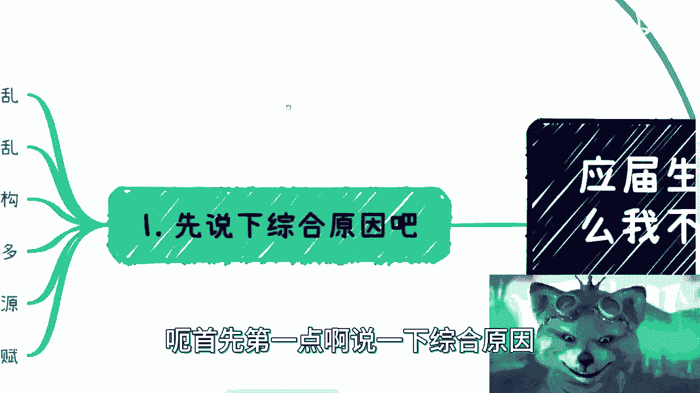
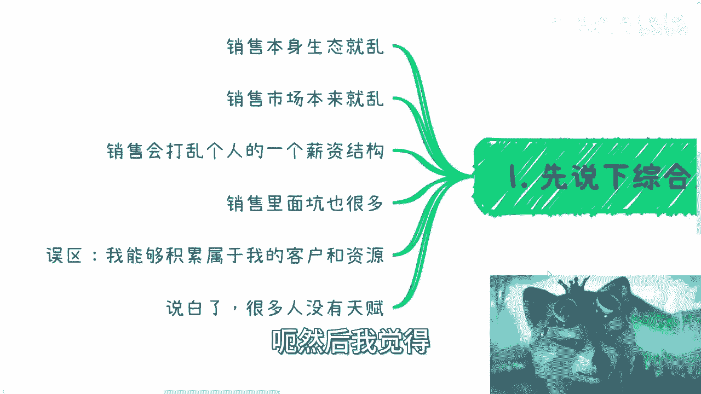
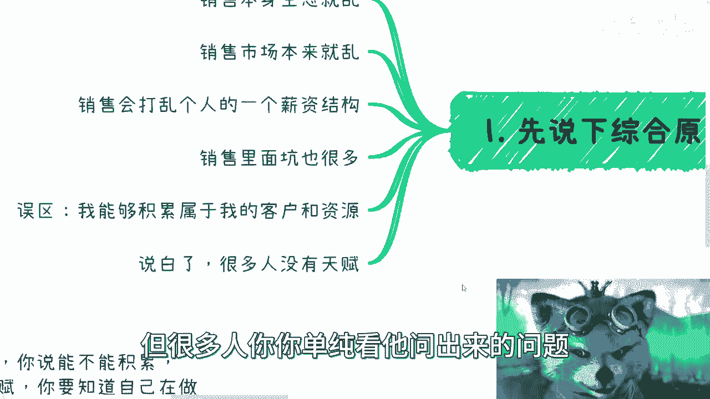
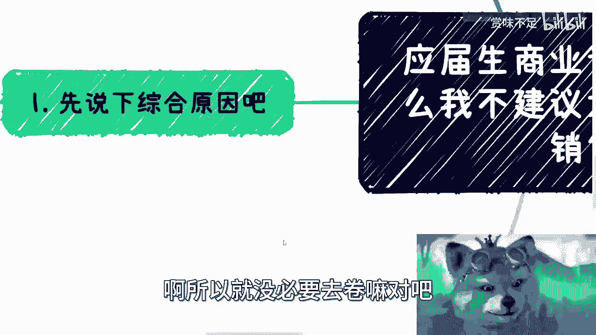
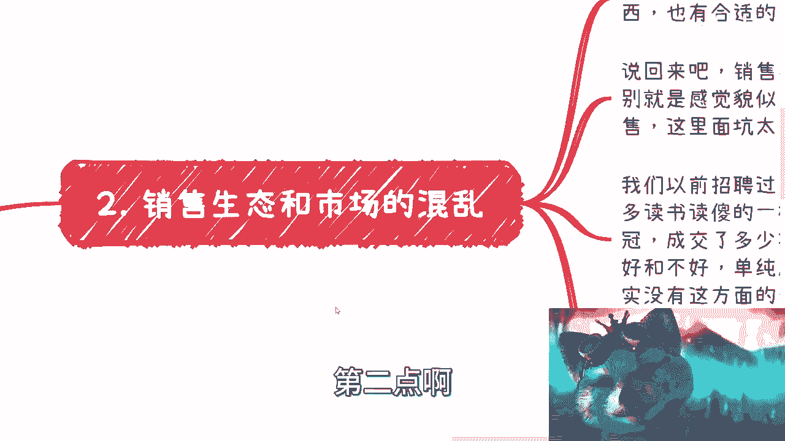
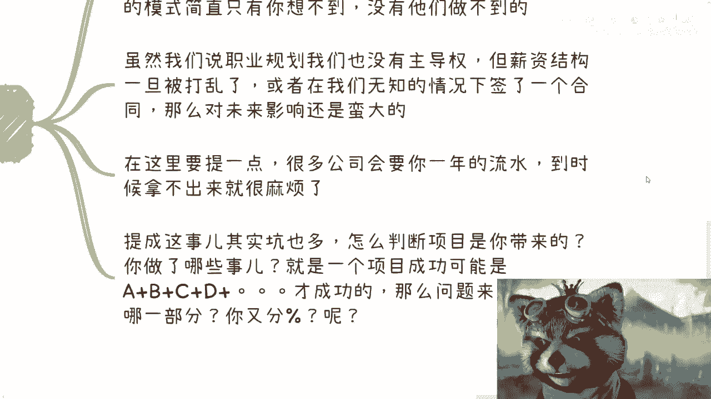
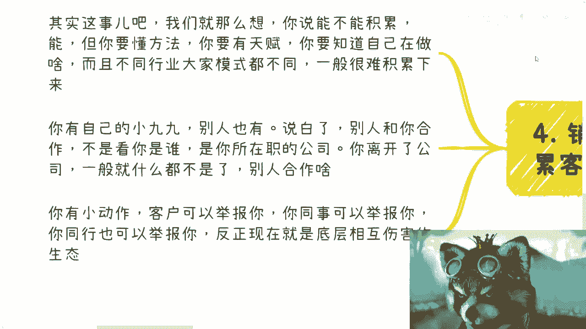
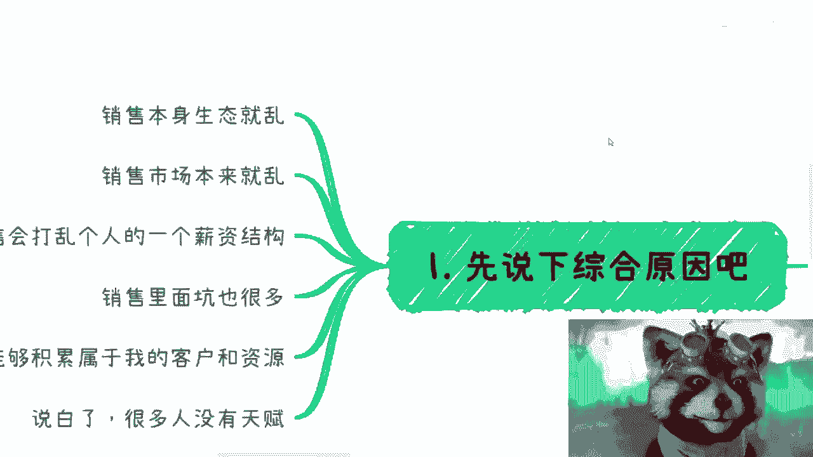

# 应届生商业专题：为什么不建议做销售 - P1 🚫



在本节课中，我们将探讨一个针对应届生的职业选择问题：为什么不建议轻易选择销售岗位。我们将从市场生态、薪资结构、潜在误区和个人天赋等多个维度进行分析，帮助你更清晰地理解销售职业的复杂性与挑战。

---

## 综合原因概述



不建议应届生选择销售岗位，主要基于以下几点综合考量：销售市场生态混乱、薪资结构特殊且易被打乱、岗位本身存在诸多陷阱、以及常见的资源积累误区。此外，销售工作高度依赖个人天赋，并非适合所有人。





上一节我们概述了不建议做销售的核心原因，本节中我们来详细看看第一点：混乱的市场生态。



## 销售生态与市场的混乱 🌀

销售岗位的生态和市场环境与其他岗位存在显著差异，其混乱程度较高。

以下是销售生态混乱的具体表现：

*   **缺乏统一标准**：与许多职能岗位不同，销售领域缺乏行业统一的流程与规范。
*   **企业实践差异大**：尤其在大量中小企业中，销售（Sales）与商务拓展（BD）的职责常常混淆不清，岗位定义模糊。
*   **推荐选择**：如果确实有意从事销售，建议优先考虑流程规范的外企。在外企，你能学到系统的流程、专业的材料（如产品介绍PDF）并积累更优质的资源与人脉。

当然，这并非指国内企业不好，而是客观陈述在规范化培养方面的常见差异。接下来，我们将探讨销售岗位对个人特质的要求。

## 销售是天赋型赛道 🎯

销售工作非常适合有天赋的人。许多人误以为性格开朗、善于言辞就等于适合做销售，但这只是一个**充分非必要条件**。拥有这些特质是优势，但远不能等同于能胜任或适合销售工作。

我们曾招聘过市场销售，发现一个普遍现象：许多自称“销冠”、手握“数亿流水”的候选人，在实际沟通中，其格局、对产品的理解、综合素养却与宣称的业绩严重不匹配。

一个优秀的销售，是**技术理解力**与**销售技巧**的综合体。这并非要求他会写代码，而是需要他理解产品与技术逻辑，同时懂得如何销售。

**销售技巧** 可以概括为：针对不同对象，灵活运用不同的话术与沟通风格。
```text
沟通对象 -> 对应的话术与风格
C端用户 -> 通俗、直接
政府领导 -> 正式、尊重
企业高管 -> 专业、聚焦价值
三教九流 -> 灵活、接地气
```
这要求销售成为一个“八面玲珑”的角色，精准连接产品与不同特性的客户。连接错误，例如用对待政府领导的方式对待江湖人士，沟通必然失败。

然而，国内市场的现状常常扭曲了这种专业要求，陷入了以“关系”为核心的恶性竞争，有时甚至到了“不择手段”维护关系的地步，这使得销售的专业性大打折扣。了解了对天赋和市场环境的要求后，我们来看看销售岗位一个非常实际的挑战：独特的薪资结构。


## 薪资结构的陷阱 💸

销售岗位的薪资结构（Package）与其他岗位截然不同，这会给职业发展带来潜在风险。



销售薪资通常由 **底薪 + 提成 + 可能的奖金/股票** 构成，其计算方式复杂且不透明。

当你想跳槽时，新公司HR可能会质疑：“你说年薪百万，但底薪只有一万，其余部分如何保证？” 这种薪资结构很难被其他行业或职能岗位认可。

更重要的是，国内大量企业（尤其是一线至五线城市的中小企业）的销售薪酬制度极不规范。

**关于合同与提成的警示**：
*   **合同陷阱**：销售岗位的合同中可能布满各种意想不到的条款，必须仔细审阅。
*   **提成幻象**：不要轻信“高额提成比例”（如20%）。一个项目的成功涉及售前、支持、差旅、应酬等多方努力，你最终能分到多少是模糊的。老板可能会说：“客户本来就是公司的，你只是对接，给你2%就不错了。”
*   **离职困境**：若因提成不公而离职，你的履历会受损；若离职后项目成功，你也无法获益。同时，公司可能延迟或克扣提成，导致你的银行流水难看，影响下份工作的背调。


一旦接受了这种薪资结构，未来想转向其他岗位时，你将很难向新雇主解释和证明自己的稳定收入能力。除了薪资，另一个常见的诱惑是“积累资源”，但这同样存在误区。


## “积累资源”的误区 📉

许多人选择销售是认为可以积累客户资源，但这往往是一个误区。

理论上可以积累，但这要求销售人员有方法、有天赋、懂行业，并能精准洞察不同对象的需求。实际上，合作的基础通常是你所代表的**公司**，而非你个人。

当你离开公司后，所谓的“资源”很可能瞬间蒸发。之前与你称兄道弟的客户总监、VP，在你离职后可能连见面都难。即使表面客气，真正谈到需要投入资源的合作时，对方往往会拒绝，因为你失去了公司的产品、服务和背书。

在当前的商业环境下，任何试图将公司资源“私有化”的小动作，都可能面临来自客户、公司或同行的举报风险。因此，指望通过销售岗位轻松积累个人资源的想法是不现实的。最后，我们如何判断自己是否适合做销售呢？





## 如何判断自己有无销售天赋？ 🔍


销售的核心天赋在于：**挖掘或创造需求**。这需要高情商、高智商，以及对行业、产业链、商业逻辑的深刻理解，而不仅仅是性格外向。

一个有天赋的销售，必须具备两种关键能力：
1.  **识别最终决策者与真实需求**：你需要穿透对接人，找到背后真正的拍板者，并弄清他的核心诉求。公式可简化为：**表面需求 -> 洞察分析 -> 真实需求**。
2.  **提供延伸价值**：在满足客户初始需求（A）后，能发现他的衍生需求（B、C、D…），持续为客户创造价值，也即建立长期共赢（或可持续）的合作关系。

许多应届生或初入职场者，缺乏对市场的认知，仅凭一腔热情和想象去做销售，结果很可能不仅无法开单，甚至会给公司造成损失。

**自我评估**：如果你在沟通中只能看到表面问题，无法洞察言外之意和深层需求，那么你可能缺乏销售的关键天赋。在没有天赋的情况下，将销售作为职业起点，容易陷入“进去容易出来难”的困境。

---

## 总结 📝


本节课我们一起学习了为什么不建议应届生盲目选择销售岗位。我们分析了五个主要方面：
1.  **市场生态混乱**，缺乏标准，中小企尤其不规范。
2.  **薪资结构特殊且易埋坑**，影响职业连续性与未来谈判。
3.  **“积累资源”是常见误区**，个人难以带走公司平台赋予的资源。
4.  **销售极度依赖天赋**，需要挖掘需求、洞察人性及深谙行业规则。
5.  **自我评估至关重要**，不要仅凭性格开朗就误入赛道。

职业选择需谨慎，尤其是像销售这样高挑战、高不确定性的岗位。建议同学们充分评估自身特质、行业情况与长期规划，再做出决定。