# 应届生商业专题：什么是商业操守 - P1 📚

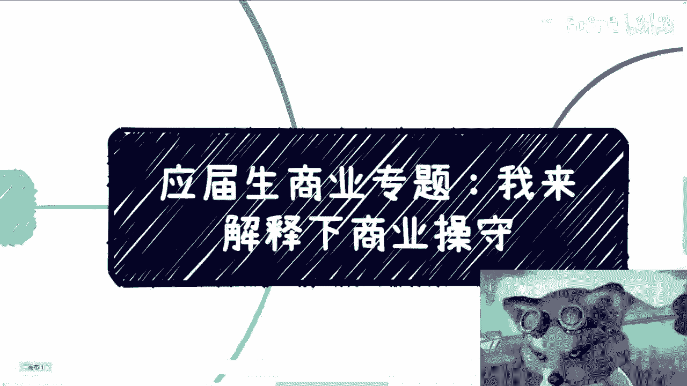

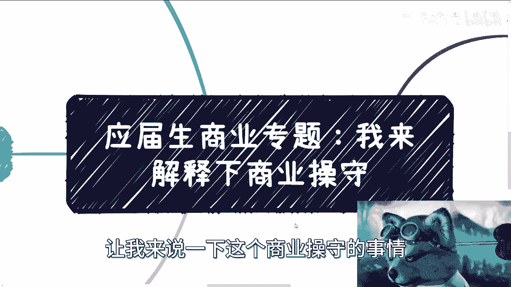

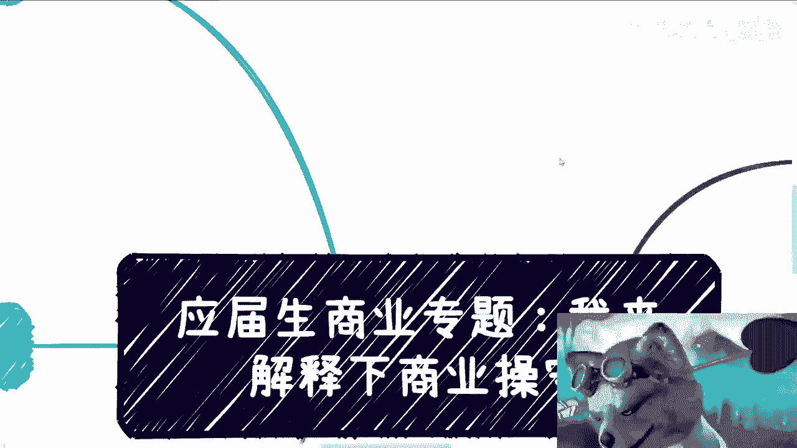

在本节课中，我们将探讨商业操守的核心概念。商业操守并非简单的规则列表，而是在商业活动中指导我们行为的内在准则。理解并遵守这些准则，对于建立可持续的职业发展和商业合作至关重要。

---

## 课程概述与背景 🌍

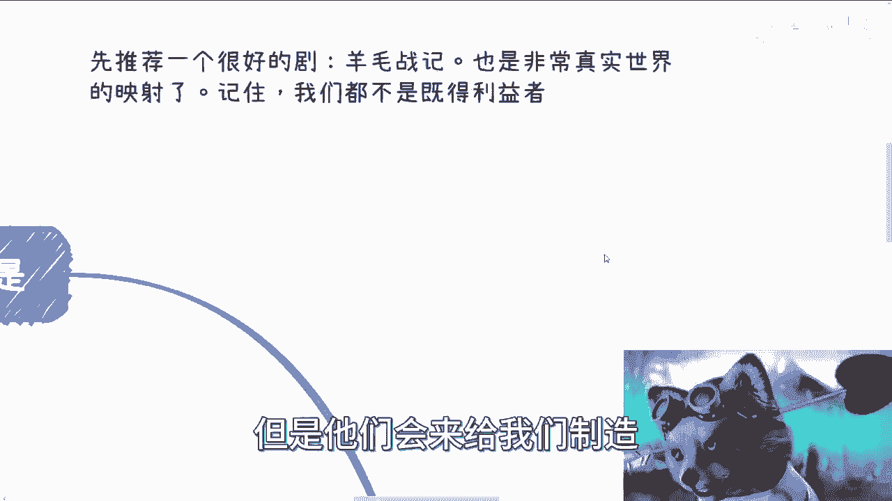

有小伙伴建议我讲解商业操守。我之前提到过这个概念，现在来详细补充说明。

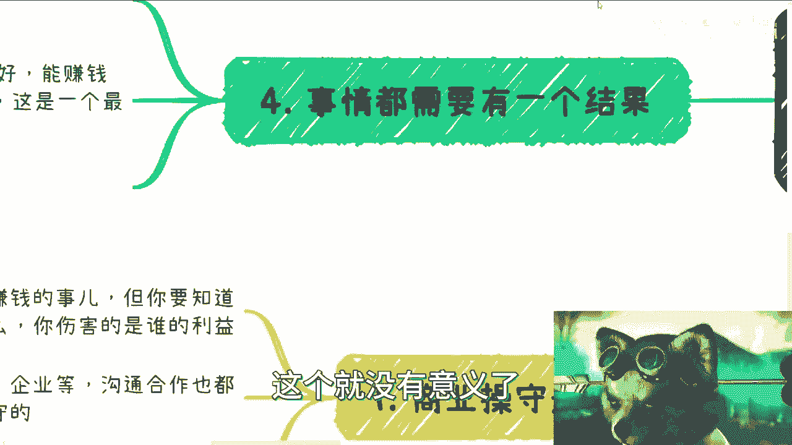

首先推荐一部剧集《羊毛战记》。这部剧清晰地描绘了社会的分层结构，包括资本家与无产阶级、底层劳动人民等。它揭示了社会的某些现实状态，这也是它在全球引起巨大反响的原因。观看后会有更深的体会。

需要明确的是，观看这个视频的大部分观众和我本人，都不是既得利益者。真正的既得利益者通常不会制作或观看这类视频，但他们可能会制造许多假象。

关于商业话题，我需要声明：我制作的所有视频内容，仅代表我观察到的部分真相，并不保证完全正确。我希望大家在看到一些真相后，能有勇气去面对和斗争，而不是去比拼谁的下限更低。

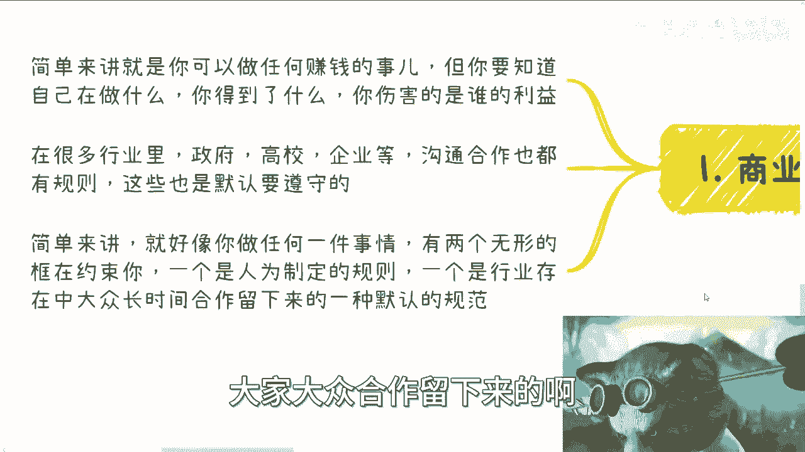

---

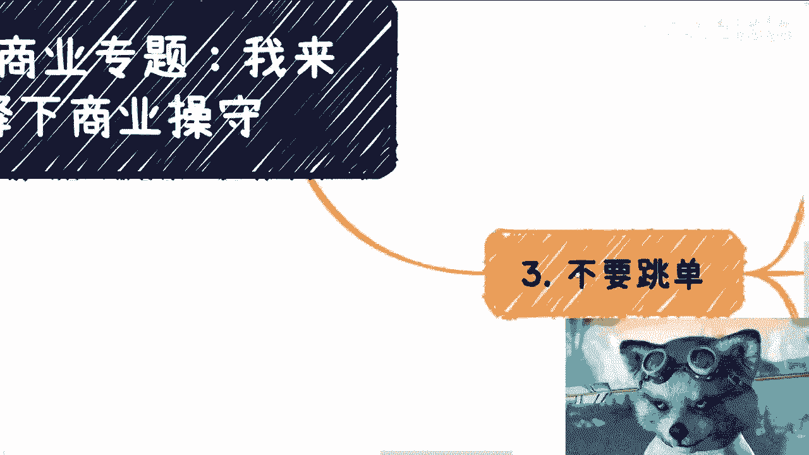

## 什么是商业操守？🎯

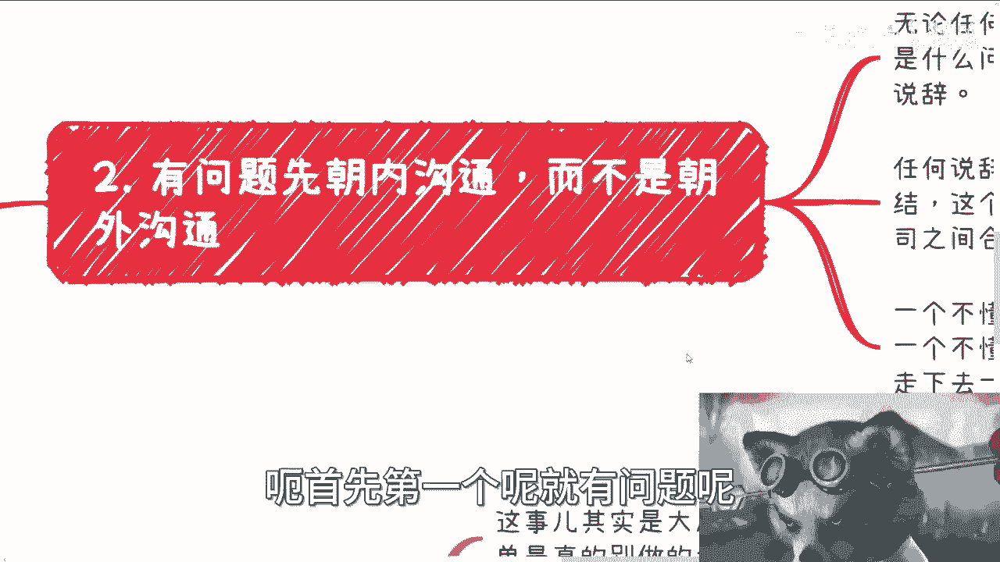

简单来说，商业操守意味着：**你可以做任何事去赚钱，但你必须清楚自己在做什么，得到了什么，以及伤害了谁的利益**。因为在任何商业过程中，总有得失。

在政府、高校、企业等诸多行业的沟通与合作中，存在许多规则。这些规则中，有很多是默认需要遵守的。可以这样理解：做任何商业行为时，有两个无形的框架在约束你。

1.  **人为制定的规则**：这些规则通常不会明文写出具体条款。
2.  **行业默认规范**：这是在行业长期发展过程中，大众合作所留存下来的一种默认规范。

这两个框架共同构成了商业操守的基础。

---

## 核心商业操守原则 📝

以下列举部分重要的商业操守原则，大家可以举一反三。

### 1. 内部沟通优先

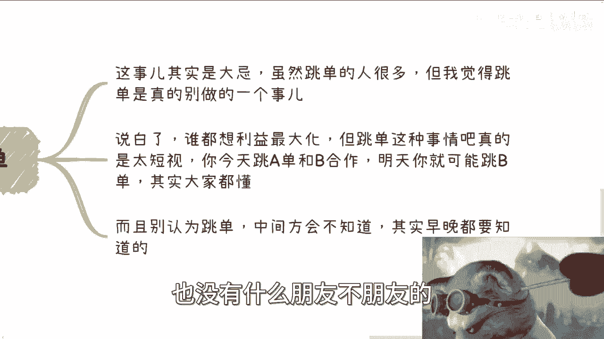

无论遇到产品问题、服务问题还是其他任何问题，都必须**先在内部沟通**。无论你多么气愤，都应如此，而不是直接对外沟通，例如向合作方、客户等抱怨。

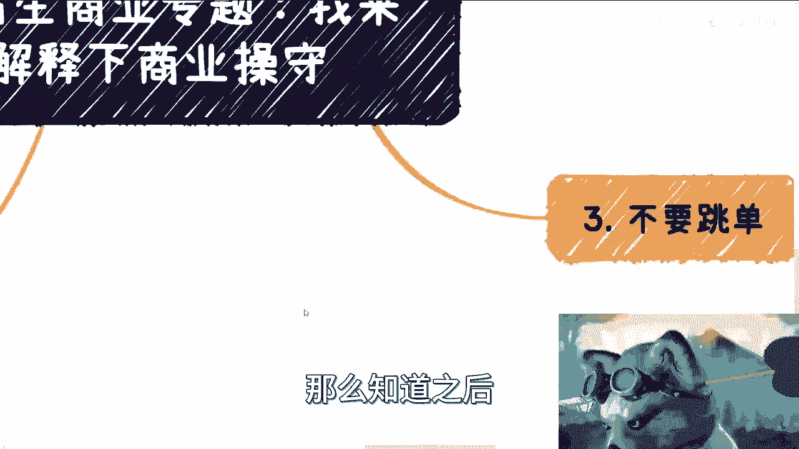

**原因在于**：在商业中，每个参与者（公司或项目团队）都被视为一个整体。任何对外的说辞，无论多么有理，本质上都是在逃避责任，并会让外界觉得你的团队不团结或不专业。这不仅指单一公司团队，也适用于一个产品或服务所涉及的多家公司或团队。缺乏内部沟通能力的人，其实不适合从事商业活动，这就像一个不懂得主动沟通的人难以维持长久的恋爱关系一样。

### 2. 切忌“跳单”

“跳单”是商业合作中的大忌。很多人会问，商业合作中遇到对方跳单怎么办？合同固然可以有所约束，但单纯的合同无法完全防止跳单行为，因为这种现象太常见了。

**核心观点是**：我们可以知晓商业中存在这些人和事，但不代表我们必须效仿。人人都想利益最大化，但跳单行为非常短视。今天你为了利益跳过A与B合作，明天就可能跳过B与C合作。这个道理大家都懂。别以为跳单别人不会知道，在商业合作中，所谓的“朋友”关系很脆弱，中间方迟早会知晓，这对你没有任何好处。

### 3. 凡事需有交代

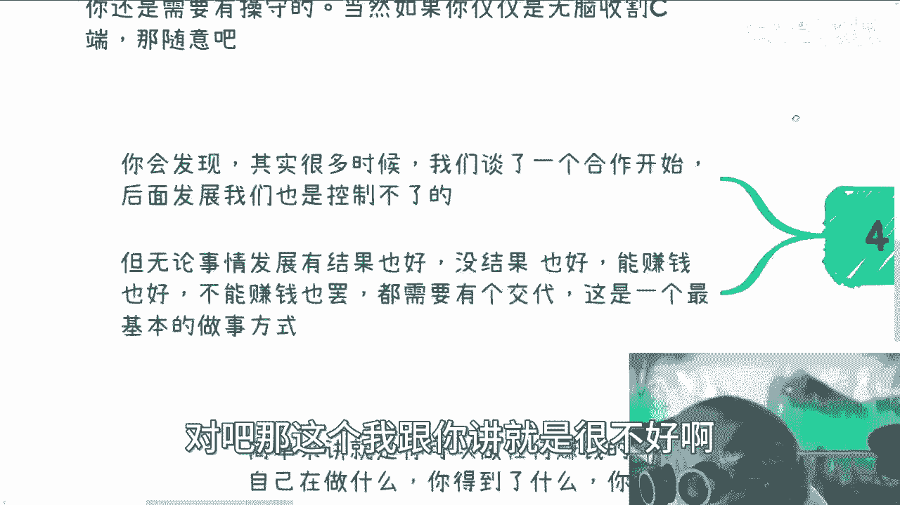

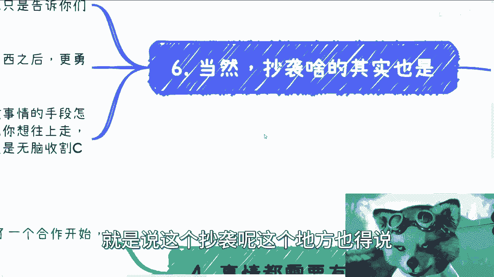

商业合作需要有始有终。很多时候，合作初期很愉快，但后续发展无法控制。关键在于，无论项目合作成功与否、愉快与否、能否赚钱、甚至方案是否被白嫖，**都需要给对方一个明确的交代**。

**例如**：我提出一个合作方案，如果一个月后没有进展，我却不再发声，这种合作方式非常糟糕。无论结果如何，都应该说明原因：项目为何无法推进？问题出在哪里？如何改进？未来是否有新的合作机会？而不是给出方案后就石沉大海。

### 4. 关于抄袭与底线

商业环境有时确实不择手段，这是事实。但我仍然希望我们在行事时，能有所坚守。

**核心逻辑是**：别人怎么做是别人的事，我们无需模仿。俗话说，好的可以学，坏的不必学。希望大家明白真相后，能更勇敢地去面对和斗争。同时要理解：**你的行事方式只会吸引到同级别的人**。若想向上发展，必须遵守一定的商业规则和操守。

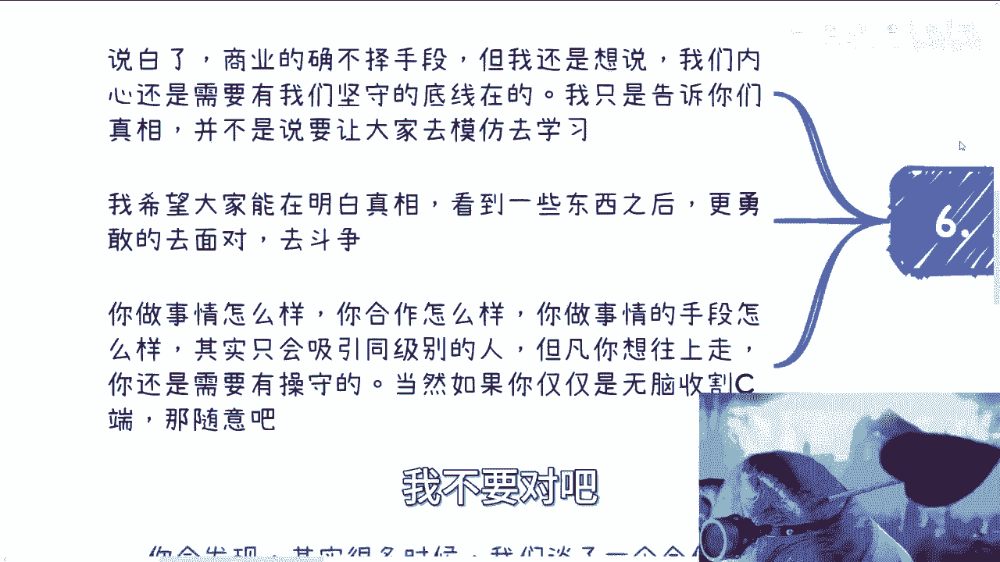

反之，如果只想无脑收割消费者（C端），像某些知识星球那样，那就随意。人各有志，追求不同，不一定都要走相对正规或可持续发展的道路。有人就是不想做需要长期铺垫和积累的事，只想赚快钱，这也无可厚非。

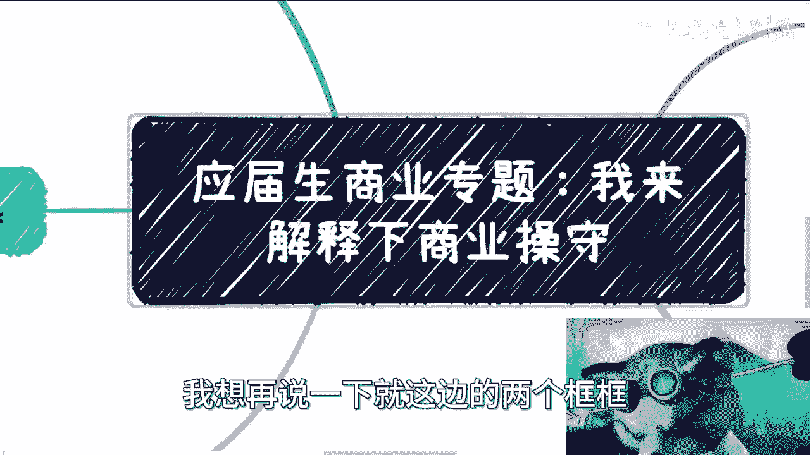

---

## 对“两个框架”的再思考 💡

现在，让我们再深入思考一下之前提到的两个约束框架。

*   **人为制定的规则**：很多时候不一定正确。这些规则常是资本家或既得利益者为保障自身利益而制定的，不代表它们必然正确。当然，也并非所有规则都是错的。这需要你自己去摸索和判断，不能默认它们全部正确。
*   **行业默认规范**：这些在长期合作中留存下来的规范，我认为是需要遵守的。它们是真正的、在实践中形成的合作准则。例如，商业合作中不应越级沟通，这是基本规范。但像一些“酒桌文化”等糟粕，虽然是潜移默化的规则，我们则没有必要去遵守。

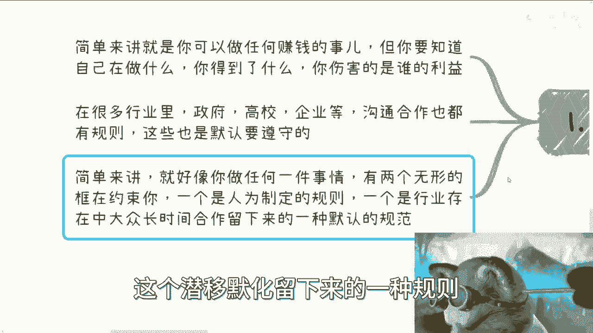

---

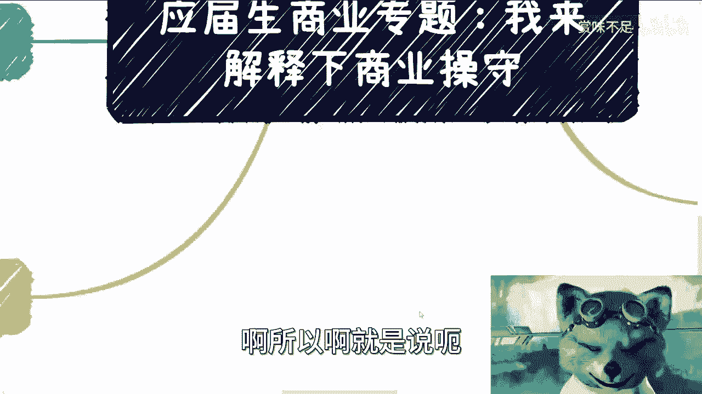

## 总结与行动建议 🚀

本节课我们一起学习了商业操守的基本概念。

总结来说，**商业操守不是没有底线，也不是指通过跳单、抄袭等手段获得短期利益就叫懂得商业**。这些行为或许存在，但将它们等同于商业或商业操守，是幼稚的。

好与不好，需要大家自行判断。如今抄袭现象确实很多，但如果把单纯的抄袭当作商业，那格局就太小了。

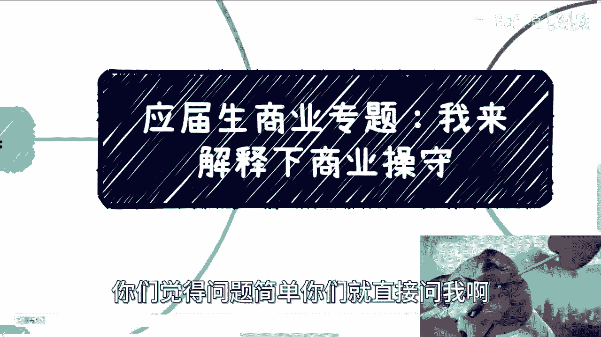

最后，如果你在职业规划、个人发展或如何利用现有资源方面有具体问题，可以将**详细的问题描述和个人背景**整理好，然后私信我。如果问题简单，也可以直接提问。