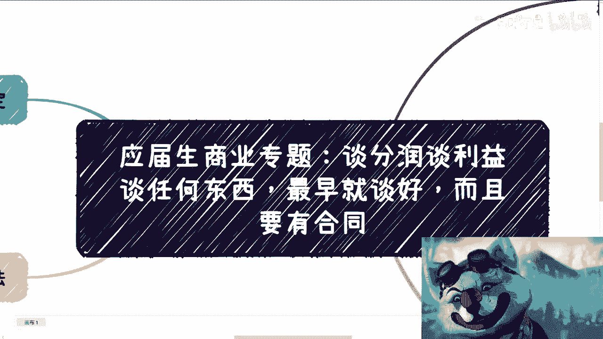
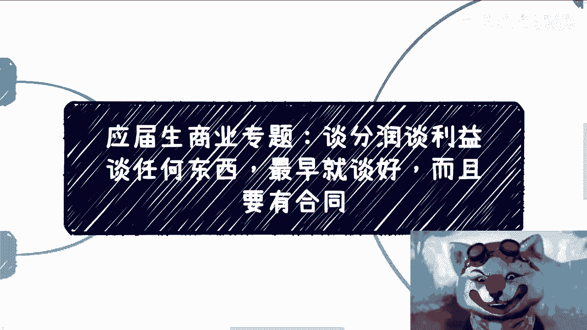
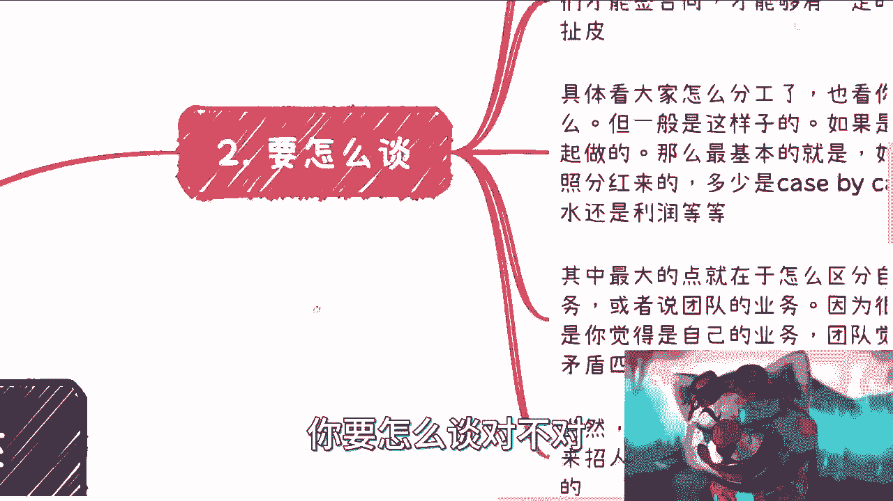
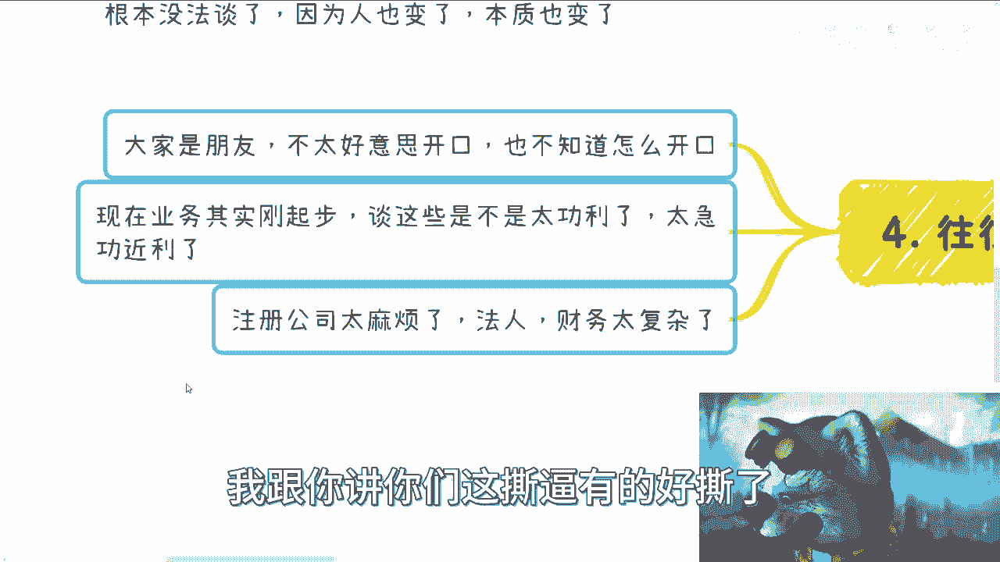
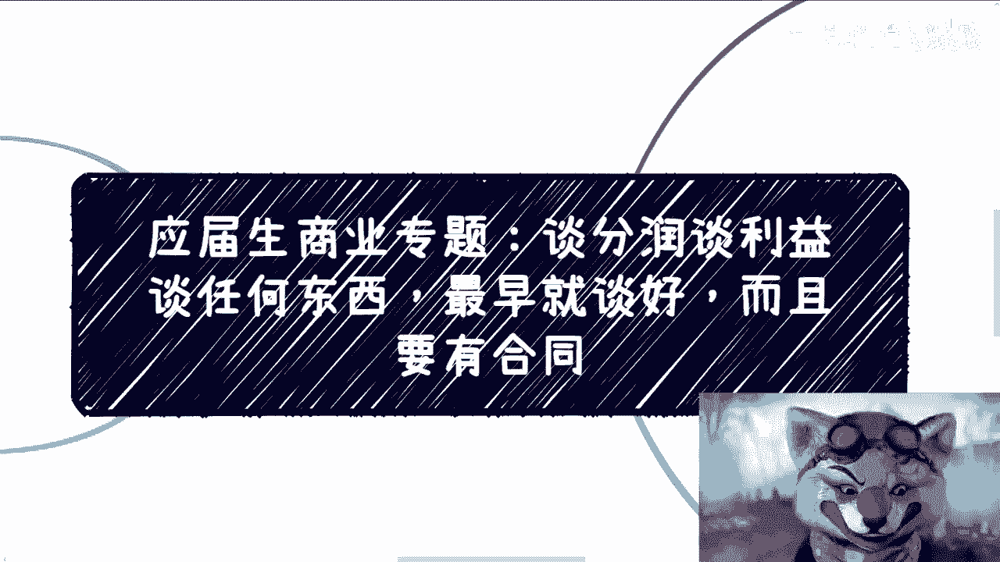
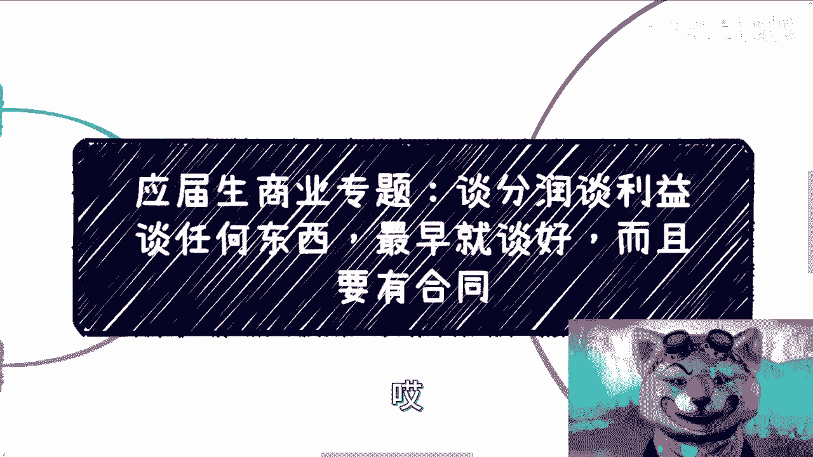

# 应届生商业专题-谈分润谈利益-一早就要谈好-合同签好---P1---赏味不足---BV1Zz4y1L

在本节课中，我们将要学习一个对初创团队至关重要的议题：如何在一开始就清晰、有效地谈好利润分配与合作规则。无论你是想赚快钱还是做长期事业，明确的利益约定都是避免未来纠纷、保障合作顺利的基石。

---

## 为什么必须一开始就谈好？🤔

上一节我们介绍了本课程的核心主题，本节中我们来看看为什么必须在合作初期就明确利益分配。

所有合作，无论目标是快速盈利还是长期发展，无论是否注册公司，最重要的一点是：**必须在开始时就将利润分成等事宜谈妥并签订合同**。

你最初可能只想赚快钱，但业务可能逐渐发展成可持续的事业。如果初期没有约定，后期调整会非常困难。

以下是必须在合作初期明确的三个核心原因：

1.  **关系不能替代协议**：无论合作方是朋友、家人还是同学，所有情况都应在开始时明确规则。退一步说，即使不注册公司，也必须定好分工。
2.  **明确目标与权益**：需要谈清楚项目最终是否要盈利。例如，可能先通过公益积累流量再盈利。必须约定好盈利归谁、如何分配。
3.  **合同提供约束力**：初期业务简单，没有利益冲突，问题不大。但当业务复杂、流量变大后，人心和情况都可能变化，届时再谈会很困难。初期合同提供了一个框架和约束力，未来想修改也有据可依，而非自作主张。

---

## 应该如何具体去谈？🗣️

上一节我们了解了提前约定的必要性，本节中我们来看看具体应该如何操作。

谈利益分配应单刀直入、开诚布公。既然决定合伙做事，就不应绕圈子。

以下是具体操作的三个要点：

1.  **坚定注册公司**：即使是最简单的“皮包公司”，也要注册。公式可以表示为：**有效合作 ≈ 公司实体 + 书面合同**。只有具备法律效力的合同，才能避免未来扯皮。
2.  **直接沟通分配模式**：根据具体业务确定分配方式。核心是区分不同性质的贡献和回报。例如：
    *   **按项目（Case by Case）分红**：单个项目盈利后，按约定比例分配。例如，一个项目赚100万，约定A、B、C三人按 `40% : 40% : 20%` 分配。
    *   **创始人红利与员工提成分离**：需要界定哪些收益属于创始人红利，哪些属于具体执行者的项目提成，哪些属于固定工资。例如，创始人拉来的独家大客户（哈密瓜）带来的利润，不应简单与日常业务（西瓜）利润合并后按初始比例均分。
    *   **设立期权池**：为未来加入的核心员工或合作伙伴预留一部分权益（期权池），公式化表示为：**总股权 = 创始人股权 + 期权池**。
3.  **区分个人与团队业务**：最大的纠纷常源于个人业务与团队业务的界限不清。必须在合同中界定清楚，何种资源、何种情况下带来的业务收益属于个人或团队。

这些事情可能复杂，建议咨询律师。初期可以请认识的律师朋友帮忙，成本并不高。

---

## 不谈清楚的后果有哪些？⚠️

上一节我们探讨了如何谈，本节中我们来看看如果不谈清楚，可能导致哪些严重后果。

如果初期回避这些问题，随着业务发展，将面临诸多困境。

以下是可能出现的几个主要后果：

1.  **利益受损**：当业务真正盈利时，你可能无法获得应得的份额。
2.  **内部冲突与污名化**：团队可能指责你利用团队资源为个人牟利，甚至在公开场合诋毁你，让你陷入自证清白的被动局面。这对所有人都是多输。
3.  **陷入两难境地**：你既舍不得放弃付出过努力的团队和未来可期的利润，又因内部矛盾而无法顺利开展业务或影响决策，进退维谷。
4.  **业务瓦解**：内部分裂和持续撕逼会消耗大量精力，最终可能导致原本有潜力的业务直接夭折。`原本可观的利润 → 因内耗 → 归零`。

人性经不起考验。初期因“不好意思”、“业务小没必要”、“注册公司太麻烦”等想法而回避问题，未来在利润面前，极易引发剧烈冲突。

---

## 总结与行动建议 📝

本节课中我们一起学习了初创团队利益分配的核心要点。

**核心总结如下**：
*   **核心原则**：利益分配必须始于合作之初，并落实为书面合同。
*   **操作方法**：直接沟通，区分贡献类型，最好注册公司以提供法律保障。
*   **关键区分**：明确个人业务与团队业务的边界，并设立期权池为未来预留空间。
*   **潜在风险**：回避问题将导致未来利益纠纷、内部冲突，甚至使业务瓦解。

**行动建议**：如果你对合作有疑虑，或不知如何开始，请整理好你的具体问题（例如：股权如何分配？分红模式怎么设？）。清晰的提问是获得有效帮助的第一步。

---
> 格局是明白做什么能让所有人赚更多钱，而非纠结于一己私利。清晰的规则不是不信任，而是对所有人长期利益的最大保障。