# 应届生商业专题：不做奸商，能不能活得下去 - P1 - 赏味不足 - BV1m841197tQ

好大家好啊，这个今天呢这个话题哦是这样子的，首先先声明啊，我跟大家就是总结总结其中的商业模式啊，没有任何别的意思啊，不要有任何的人觉得我这个针对这个up主啊，或者怎么样子。

那么今天早上呢啊先说这个主题哇。

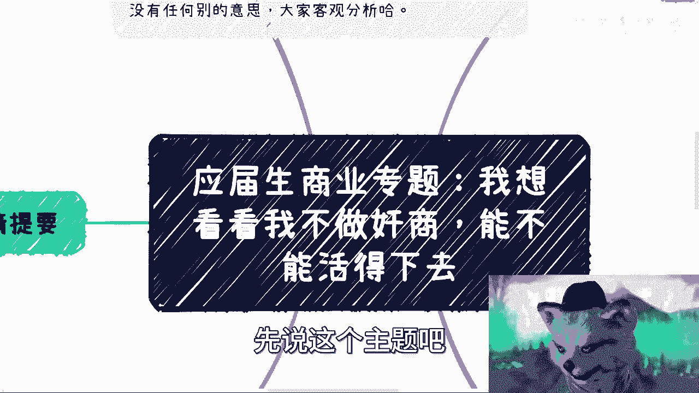

哦主题呢就是说啊我想看看我不做奸商啊，能不能活得下去对吧，呃首先先说前前情提要啊，就昨天呢我都在忙，所以呢我没仔细看啊，不过呢这个群里面呢，也的确都在讨论这个机器配置的事情，然后呢今天早上起来了也好。

巧不巧对吧，我就看了一下B站首页，给我推了这个道歉的视频，哥们，你说我看到道歉的，我就很八卦对吧，我就想去看，那看到道歉我就想要知道什么事，对不对，然后我就看那些这大概吧，看了一下这个别的视频啊。

反正就是了解了个大概，然后正好也呢也有那个小伙伴私信我。

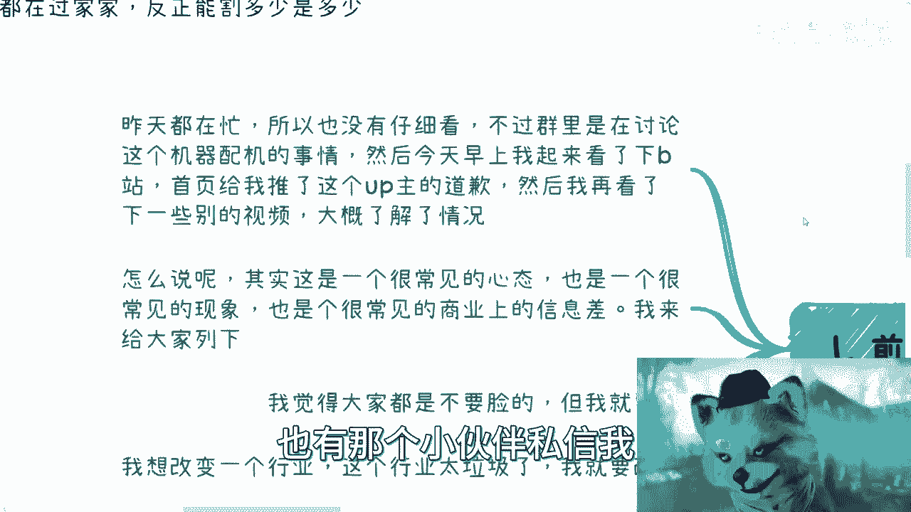

跟我说了这个事儿啊，我觉得也有道理啊，怎么说呢，就是说呃其实呢我觉得这是一个很常见的心态，这个心态指的就是说我能不能不做奸商啊，或者我们换句话翻译一下，就是说我能不能啊。

不像现在这么很多的这种人做事情啊，做的比如说不好啊，或者说怎么样子啊，我能不能活得下去，对吧好啊。

那我觉得啊这个这是个很常见的现象，但是呢这也是个很常见的商业上的一个信息差，或者一个商业上的误解啊。

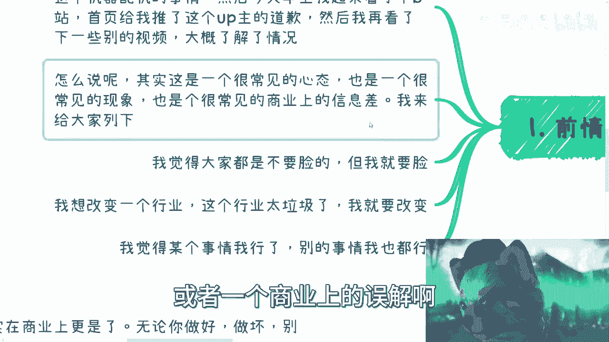

我来给大家列一下，第一呢就是说这个我觉得大家都不要脸啊，但我就要脸对吧，这是第一种啊，第二种呢就是说我想改变一下这个行业啊，这行业太垃圾了啊，我就想改变对吧，第三个呢就是我觉得某个事情呢我可以了啊。

别的事情我也可以啊，这个就是很大的误区啊。

嗯我们来这个一个个分析，首先呢是人呢我觉得很多时候是会膨胀的，呃，谁呢都有可能会膨胀，因为很正常，都是普通人，对不对，呃但是呢我就这么说，既然是普通人，而且你还是个有脑子的人，那么没必要再去。

就是没必要，我们说我们每个人非要去踩这个坑才去改变，你明白吧，就是说很多东西呢不是说我们非要经历过一次。

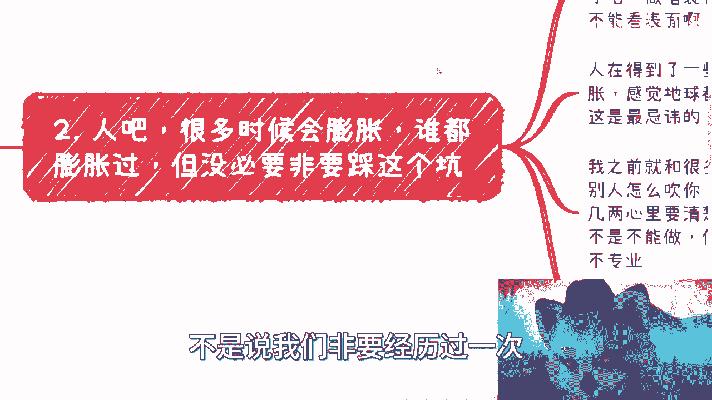

什么发个道歉对吧，然后才要去改变，没必要对吧，呃我之前其实没有看过这个up主，那后来我今天才知道啊，原来是个游戏博主，那么我觉得你从我的认知来讲很简单，就是你是什么人，你擅长什么，你就做好你的领域对吧。

你搞些有的没的没有意思的啊，而且呢就是我还是那句话，我不管你是谁，你搞就是无论啊你是谁啊，你搞有的没的东西大概率是搞不了的，因为隔行如隔山，没办法的，你知道吧，就每一行都是水深的，不要不要的。

你不能看表面对吧，你就好像你就好像什么，你就好像就说啊，你们很多人比如比如说咨询我对吧，各各行各业都有对吧，就是我会跟你们讲对吧，我觉得就是在比如说政府啊，在企业啊，在这种商业层面通用的方式是什么。

但是我从来不会跟你们说，哎你们那个行业啊什么什么东西，我很了解的对吧，怎么样怎么样，不可能的，因为我的确不了解对吧，所以我不会去给出任何非常细节的这种建议，我说啊你你怎么样怎么样。

但是我会告诉你在商业上啊，第一步怎么样，第二步怎么样，因为本质上商业层面不管你什么行业，大差不差的，你知道吧，那么第二点我跟你讲啊。

人在得到了一些荣誉或者粉丝数之后，他就容易膨胀，你就感觉地球都是地球都是围着自己转的。

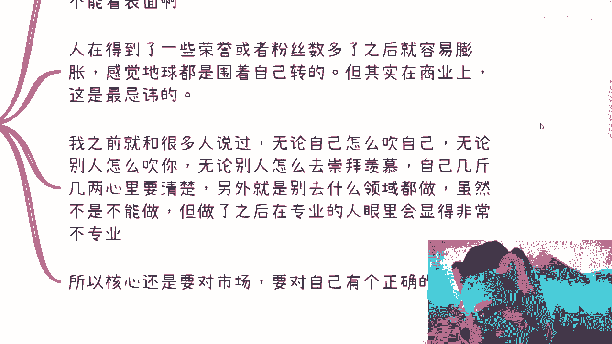

你知道吧，但是在商业上这点是很忌讳的对吧，因为你比如像昨天我给大家讲的那个商业案例，对吧，就很清楚嘛，就是说就是就是你可能会很膨胀，但是你很膨胀，你还得客观的评价，你不客观的评价你怎么去赚钱。

你怎么去啊，忽悠投资人对吧，你怎么去忽悠你的客户，你忽悠不了的，你对自己都没有正确评价，你怎么忽悠对吧，那而且你真的如果对方被你忽悠了，你最后还是要砸你的牌子，因为你对自己没有一个正确的评估对吧。

所以我之前就跟很多人说过，你无论自己怎么吹自己，无论别人怎么吹你对吧，包括无论怎么别人怎么去崇拜羡慕，因为中国这个基本盘很多人他是没有脑子的，你知道吗，你就像那些追星的是一样的，他是没有脑子的对吧。

你自己几斤几两，你自己要清楚啊，另外就是别什么领域都去做对吧，虽然不是说咱也不是说不能做啊，但你做了之后，在专业的人里面会显得非常不专业对吧，好那么我跟你讲核心是什么呢。

就是还是要对市场，要对你自己有个正确的认知啊，那么这个我们来往下讲。

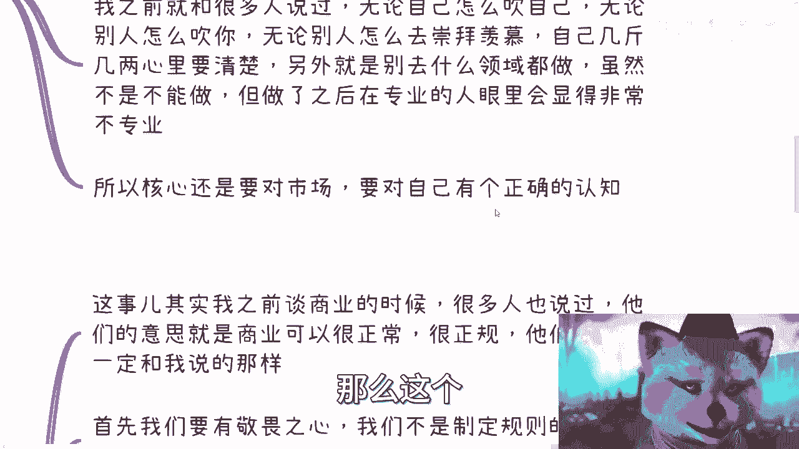

第二点是什么呢，就是说啊就是他原话嘛，啊他原话就是我我不自己一个奸商对吧，我看看能不能活下去。

这是他原话啊，那么我们来看这件事情，这件事情呢其实我在谈商业的时候呢，其实有一部分小伙伴在评论区也跟我提到过，他们的意思是什么呢，他们的意思就是说啊，这个我好像把商业描述的过于黑暗啊。

呃这个他们就想做很正规的啊，很正常的啊，他说他们没有必要一定要像我说的那样子对吧，首先啊我跟你们这么讲，我们做任何一件事情要有敬畏之心，什么叫敬畏之心，敬畏之心就是你得先要了解，你得先知道现状是什么。

你再去做一个选择对吧，而不是说我今天啊吕老师，你说的这个东西哎呀很很黑暗对吧，或者说反正什么喝酒啊，什么乱七八糟的对吧，非常的复杂对吧，他说呃就是我们觉得不要啊，我们作为一个年轻人。

我们要开创自己的这个天地，没问题啊，但是你要明白一点，你们也好，我也好，我们不是制定规则的人，那么既然我们不是制定规则的人，也就是说我们也没有能力去破坏这个规则对吧，那什么意思呢。

就是说每个人都会觉得你自己是天选之子啊，那么其实这里就有个悖论，就当你了解一个行业的时候，足够深入了解一个行业的时候，你会明白它的边界，你会明白什么事情可以做，什么事情不可以做。

什么事情是你能做什么事情不能做对吧，什么事情是你有这个能力做，但是你可能不会那么做对吧，那也就是说你想改变的人，你一天到晚在那边放大放阙词的人，往往是根本不了解的人，对吧，这就好像你们仔细想想看对吧。

这个这个私信过我的对吧，有一部分小伙伴对吧，上来就跟我说，哎我要改变世界啊，我要有这个梦想，我跟你这么说啊，最早跟我说想改变梦想啊，改变世界梦想的人就被我拉黑了对吧，为什么，因为你不切实际啊，你跟我聊。

我但凡回你一句话，我就在浪费时间，我吃饱了撑的嘛对吧，我都犹犹如我作为一个商人，对不对啊，那我早就说过了，商人赚钱天经地义，我就给你们打个比方啊，比如说我最近开了这个充电视频，对吧好，我跟你们这么讲。

一个月30块钱，我认为我的内容对吧，如果我能够坚持更新，我觉得差不多可能会在600块钱左右啊，甚至可能还不止600对吧，那我也可以向大家保证一个月的这个量，但是根据大众的消费水平对吧。

我不可能去定个很高的价格，而且更何况这是一个B站的内测的东西，那我觉得我就定时30，那么问题就来了，什么叫奸商对吧，就是这位up主，他当时在视频里说的很清楚，他说现在都是奸商，奸商太多了好。

那么我们就问什么叫奸商，一个行业里面你们就这么说，不管政府学校企业啊，还是说我们所在的，比如说每个家庭对吧，那个里面的亲戚就是你任何一个一个小的群体，它其实都是个小的社会对吧。

那么你一个行业里面总有好总有不好的，我就跟你讲啊，你不可能一个行业里面都是奸商，对不对，也不可能都用爱发电不去赚钱，对不对，好，那么你就这么想，我们打个比方，你就拿我来说。

我每天花点顺便的时间做做视频对吧，我也有，这就是我从从来比如说我做咨询的，我就有这种表达的欲望对吧，那大家认可我三观的，认可我的观点了，你们充充电这事就结束了对吧啊，因为30块钱我觉得也不也不贵对吧。

那大家也可以接受，但是如果你们想想看，我什么事都没做，我上来就跟你们讲，来一个人1万块钱一节课啊，你们不把我喷死啊，对不对啊，或者这么说，我每天花很多时间做一些什么特效啊，音效啊对吧。

花里胡哨的视频却一分钱不问，大家说，那么问题也来了，我相信你们当中一定有人会评论区，或者来说私下里肯定会说，那吕老师一天到晚说商业啊，自己好像从来不商业化对吧，那到底懂不懂商业呢，对不对。

你你明显就违背了你做一个商业的本质啊，对不对啊，我要哪天跟你们说了，哎我用爱发电哇，哦那么我是，对不对，所以说本质上我跟你们讲啊，就是什么叫敬畏之心，就是任何一个行业群体，任何一个小范围的群体。

你都把它想象成一个巨大的机械，这个里面有的齿轮是健康的，也就是健全的，有的齿轮是生锈的，有的就是一些蛀虫，但是你要明白，无论是健全的齿轮还是生锈的齿轮还是蛀虫，它都是这个行业主体的一个巨大的一个能动。

或者是能往下走的核心，你明白吧，你明白这个道理吧，就是说没有什么所谓的好坏啊，它只不过都是社会的，都是这个生态的一部分，你知道吧，这就像这就像你从宏观来讲，整个这个社会总有好人，总有坏人，总有犯罪的。

总有就是说这个做慈善的大善人，对不对，但是你能说什么叫好，什么叫不好，那我就问如果这些善人都没有了，世界是否会变得非常的邪恶，是否会变得全部人都在犯罪，你也不能断言啊对吧。

那我今天如果说世界上没有犯罪了啊，没有罪犯啊，大家都是大善人，那是不是你会变成一个叫什么，你知道吗，就是他是整个社会的往下走的，一个存在的一个东西啊，你你你不能说啊，完全怎么样完全怎么样。

就是你但凡觉得你要把某些东西踢踢掉。

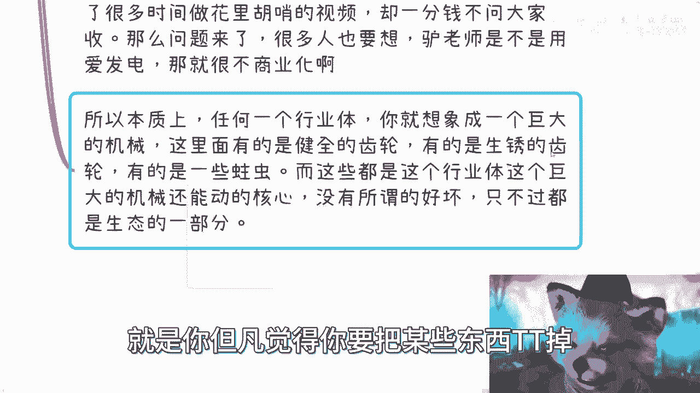

其实我觉得这个是什么呢，这个就是对整个社会，对整个的一个运作机制没有一个正确的理解啊。

那么我觉得第四点是什么啊。

第三点是什么，就是你得做好自己，什么意思呢，我跟你讲这个事儿，不管是商业上，还是说你今天去读研对吧，靠读书对吧，这个这个读博啊去工作很简单，别把目光放在别人身上，别人怎么样。

那别人的事他妈跟你有什么关系呢，这钱钱也赚不到你身上，对不对，所以啊我就跟你们这么讲，我去回私信的时候，很多时候是这样子的，你们只要发我肯定回，但是并不代表我一直会回，为什么。

因为很多时候我改变不了你们，我也知道没别人，我也改变不了别人，而且我也不想改变别人对吧，就说白了我会提出我的建议，我就点到为止，你爱不爱听，那是你的事，我没有必要去说服你，你也别没必要来说服我。

你说对不对啊，所以就是这个事儿就是点到为止就结束了对吧，所以说呢我觉得没有一方面是别去看别人，另外一方面呢就是不要去评价别人，对吧，你比如说那个人做的好不好，那是他的事对吧，然后我可以有我的判断。

但是我没必要公开的就跟大家说，哎这行业都是奸商吧，这行业他妈的都是个个人的对吧，只有我是好的，那肯定不可能啊，对不对啊，你你没必要去说，就是损人不利己的事，这是一方面，第二方面呢你从心理角度来讲啊。

就是其实你太关心别人，你还是心虚或者不自信的表现，你知道吗，就可以吧，我一直说我们自己是核心，你需要有这个能力去掉那些噪音，同时你还能听见听进去真正建议，哎我跟你讲，很多人就二极管，你知道吗。

你每次跟他们说啊，他就说啊，我一刀切，我不听了啊，我要一言堂对吧，这个我说了算。

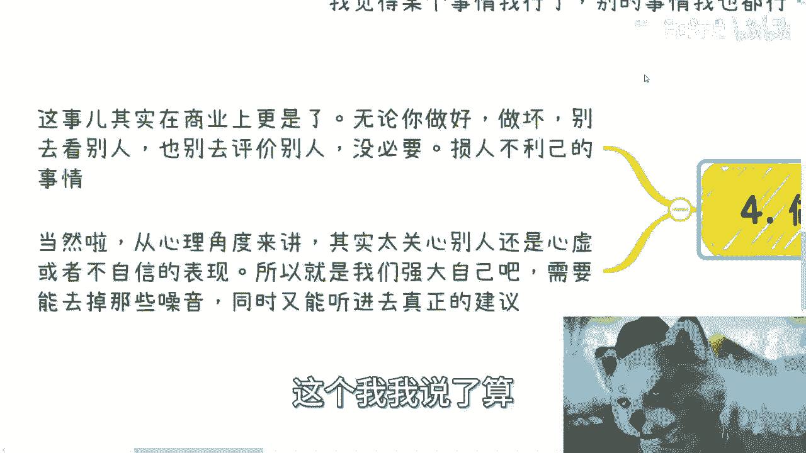

再看这个没有用的没有用的，你知道吗，就是就是有很多人他就喜欢那种，就是哎我就牛逼，你知道吧，我非要向乔布斯学习啊，乔布斯就是这种啊听不进去别人的啊，然后这个这个一言堂了对吧，你看他成功了。

哎大哥你乔布斯是谁。

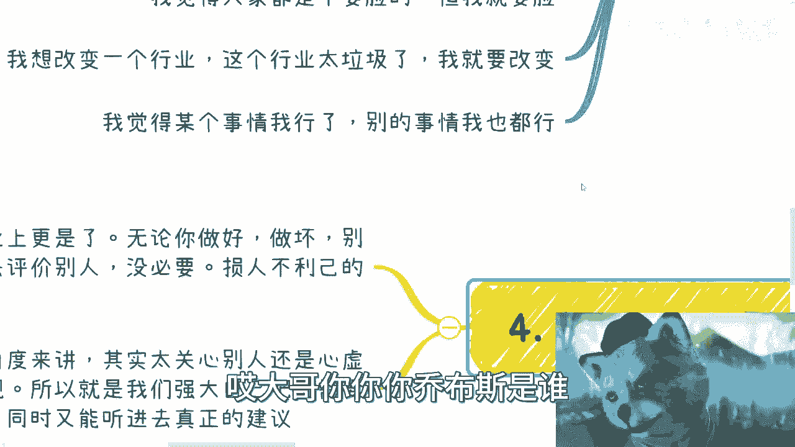

你是谁，对不对啊，那个呃最后啊我觉得我还是来说一下这个事。

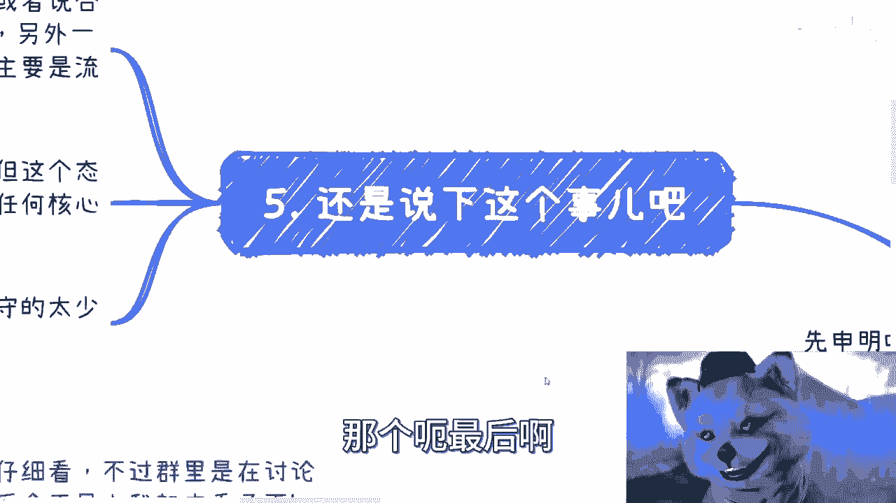

这个事儿，你说你以这个事开头不说是不可能的啊，我大概看了一下，其实本质上呢这个模式呢很简单，它的模式呢就是说它其实是没有品控的，你知道吧，就是从电商来讲啊，他是没有品控的，他也没有。

就是说自己也不是那个货源，就说白了他就是个代理代理商，或者就是一个合伙的kl这种模式，但是呢你会发现这种模式是有很大问题，什么问题呢，就是说你一方面自己呢是不专业的，另外一方面呢。

这个产品呢别的东西呢其实都是别人负责的，他主要是流量输出对吧，那么这个出问题肯定是妥妥的，但是我跟你们这么讲啊，这个模式其实没问题，你知道吧，就是你今天如果是个kl，你帮别人带货，这没问题啊。

一点问题都没有的，我跟你讲，你知道问题出在什么地方吗，问题出在就是说你帮别人带货，你就打别人的品牌，你别打自己品牌，你要打自己品牌，你就要去做品控，你就要去为自己的品牌负责，你知道吗，这是第一点。

第二点是你要是不专业对吧，你就也别打自己品牌对吧，你打自己品牌，你干嘛呢，你又不专业，你做这东西，你说是吧，那就翻车，早早早晚的事情对吧。

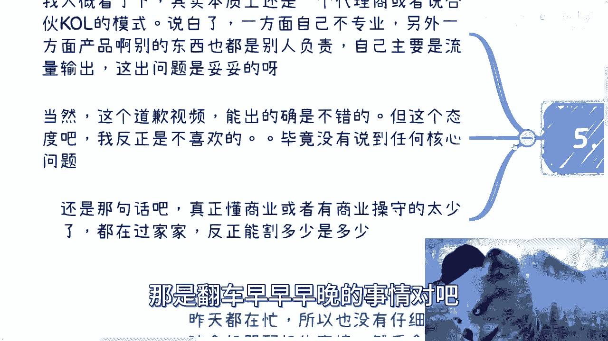

那当然啊，我个人觉得啊，这个道歉视频呢能出的确是不错的啊，但是你以我的商业判断，跟我见过这么多人的判断，我说实话这个态度我是不喜欢的啊，你们自己去看啊，这个这个仁者见仁智者见智，我只说我的想法啊。

呃而且而且他说了半天，没有受到任何核心的问题，你懂吗，就是他既没有说到，就是这件事情核心的问题出在哪。

也没有说到自己做这件事情核心问题出在哪啊，所以我跟你讲还是这句话啊，就真正的啊这个人啊就是真正懂商业的，真正有商业操守的太少了啊，嗯我跟你讲啊，不是说这个懂商业和商业操守。

就跟他能做出来的规模有多大有关系，没有关系的，很多人都是运气，都是天时地利人和，能做成这样子，但并不代表他就懂商业或者有商业操守，所以这也是我说的，大家都在过家家，你知道吗。

所以说本质上都是能割多少是多少啊。

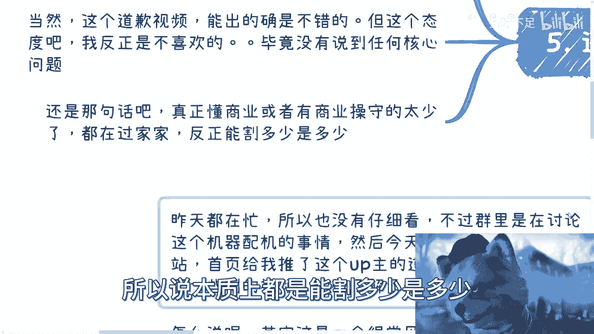

所以呢我觉得是什么呢，就是嗯我给你们讲个故事啊，就是以前香港新加坡这边有一些小姑娘，当时咨询我说做web3，你知道吧，然后我其实跟他们给的建议，我很简单，是什么呢，就是你要做你就做，不要遮遮掩掩。

什么意思呢，就是我跟他们这么说的，我说你要去割，你就认真的割，你就告诉大家，我是来割的就好了，简单明了一点，你知道吧，就是大家也不是说不能被割呀，对不对，就是你很简单，你就跟大家说，我就是来割的。

但是呢同样的就是说我这个东西会拉盘，是二级市场就会拉，就会提价，你们到时候自己跑，看谁跑得快，这有什么了，我觉得大家公开一点，对不对，你不说，其实大家也是来看谁跑得快呢，有什么区别了对吧，怕就怕什么。

你知道吗，怕就怕就是你自己不想割啊，或者说你自己想割，但是呢你又不懂怎么割，然后呢你畏首畏尾，模棱两可好了，到最后是什么呢，就是你自己没赚到钱，那些人呢也感觉你被割了，也被你割了，然后那些人也没赚到钱。

两败俱伤没有意义的呀，对不了，所以我就一直跟大家说说，做商业上面这个事情呢，就是直接一点啊，不要去做那些模棱两可的啊，也不要就是那种说我对行业毫无认知，我就说我要改变它，我想创业，我想做什么对吧。

就是我就这么说，小道这个最多道个歉啊，最多亏点钱，大到哎你你总归早还说不定要进去行吧，就这么着吧啊，呃对好吧，然后大家反正有什么的这个这个职业规划对吧，或者说呃其他的各方面问题，反正只要有问题的好吧。

或者说在商业上有问题的啊，或者来说我跟你们讲，最近有好多这种对吧，家长很多的人对吧，就是A9A10的来了，来咨询我家产，不知道怎么用的对吧，哈哈你也可以来问我啊，都可以好。

