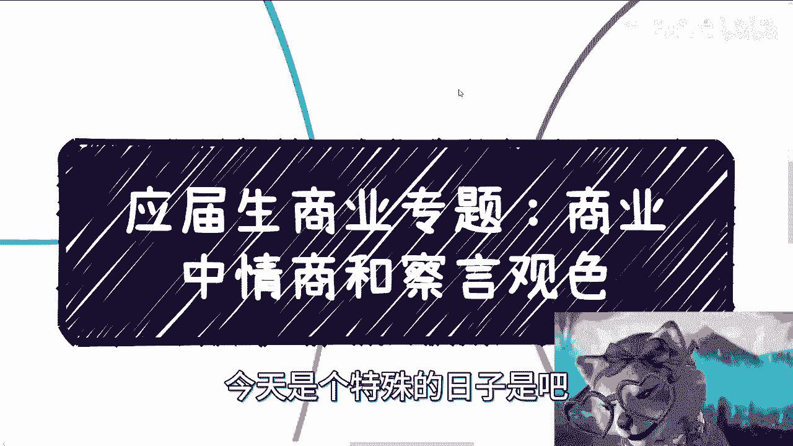
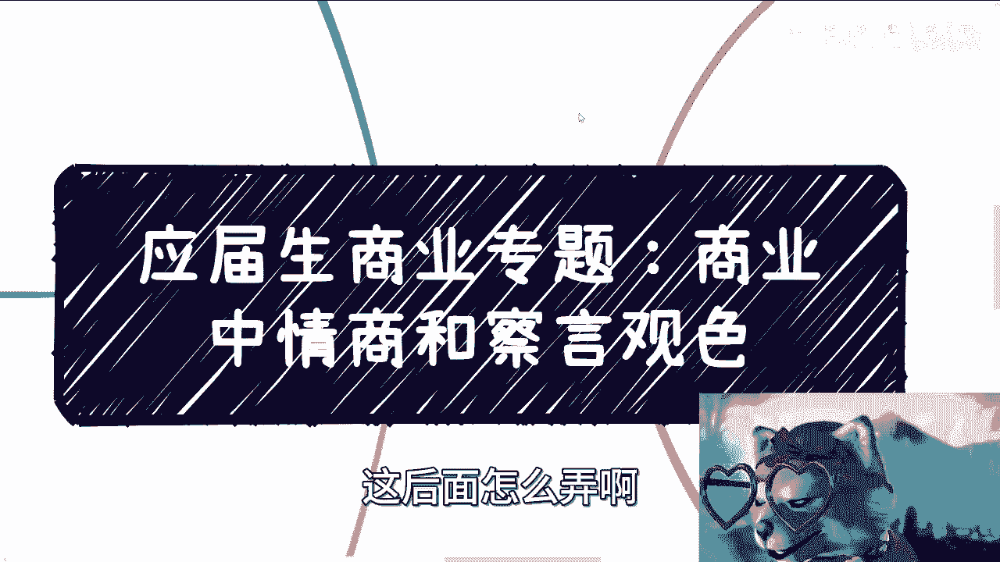
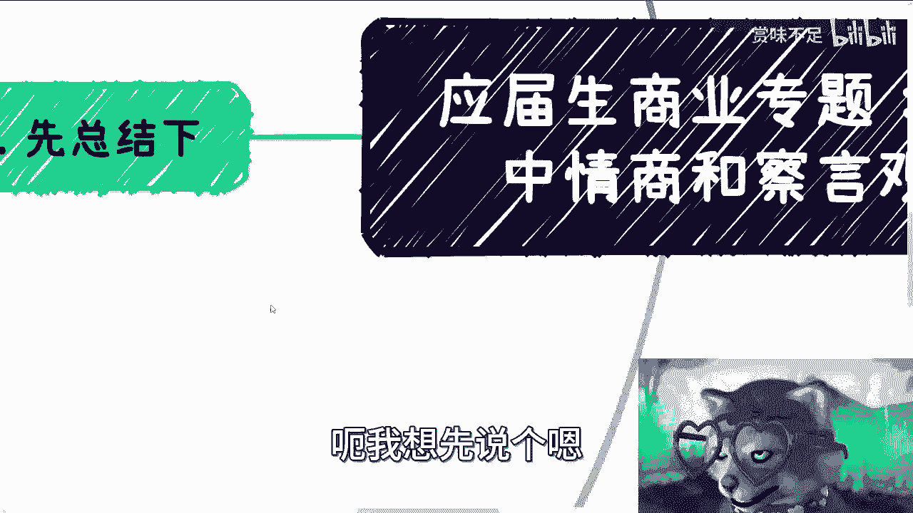
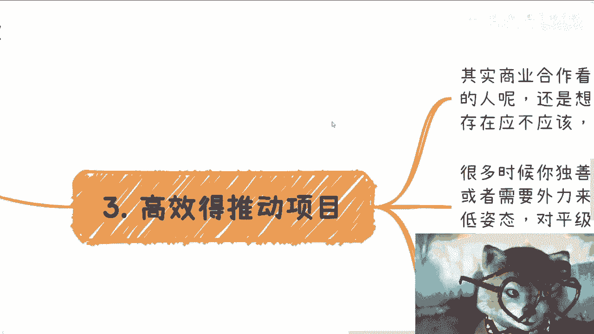
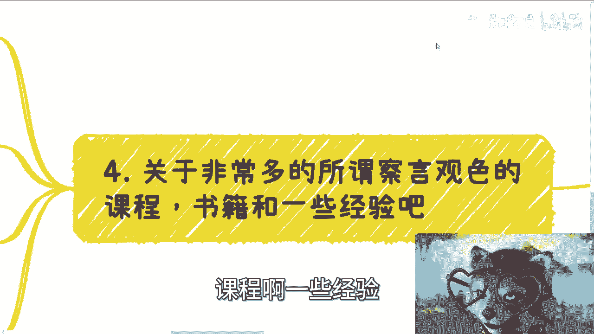
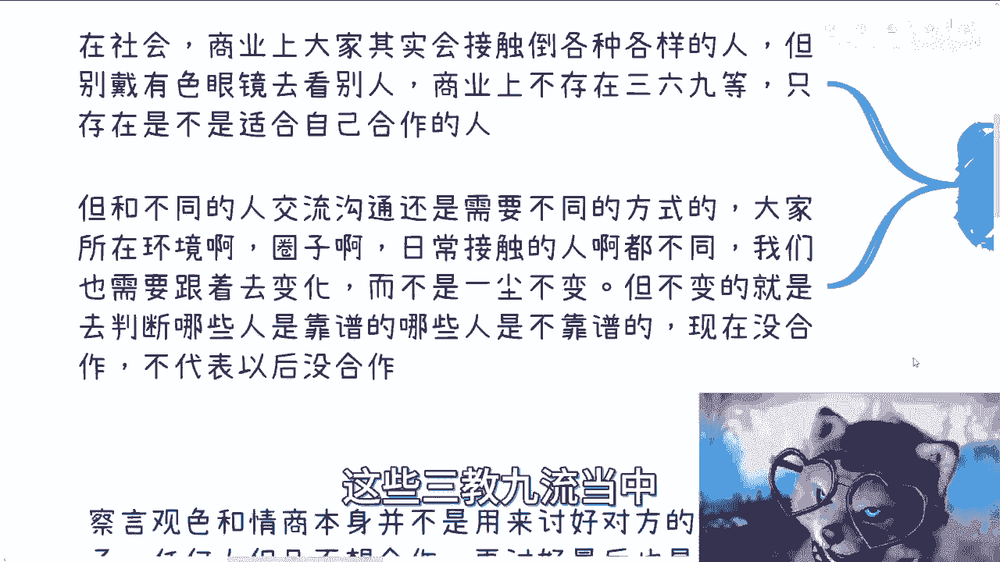
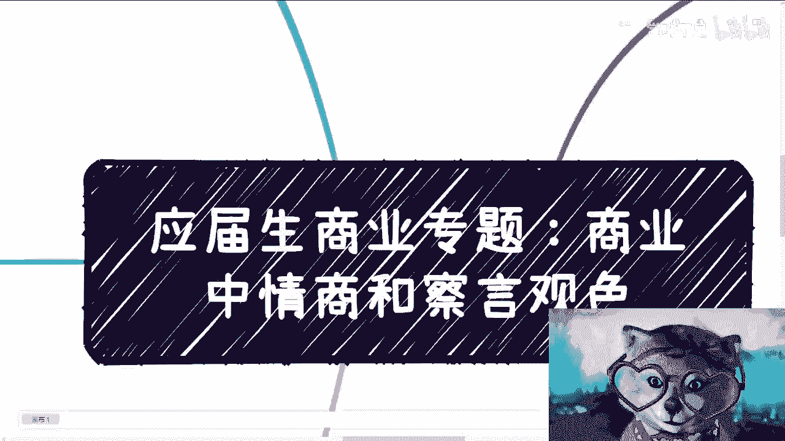

# 应届生商业专题：商业中的情商和察言观色的用途 - P1 - 赏味不足 - BV1Wu4y1e7UP

好啊大家好啊，这个今天是个特殊的日子是吧。

这个排放废水唉，这后面怎么弄啊。

晚上再说吧啊呃首先是这样子的啊，就之前有人也小伙伴跟我提过，就商业当中的这个情商跟茶叶观色呃，我想先说个嗯。

先说个结论啊，就先总结一下啊，就是察言观色跟情商这件事情，在商业上面本身不是用来讨好对方的，就说嗯就是说我我希望啊，就是大家因为我在后面其实提过，就是嗯哎等会再说吧，就是我希望就是说大家要明白。

就是并不是说商业一定是那样子的啊，就是说如果你不想做一个讨好对方，那你就别做，你知道吧，就不要做一个讨好对方的，你就做你自己的风格，不是说做商业一定要讨好对方，或者说一定要就是那是尔虞我诈或者怎么样。

没有必要，你知道吗，就是也许他生态是这样子的，但是并不代表我们一定要这样子对吧，那么任何人但凡不想合作，我跟你讲，你再讨好，最后也是最后也是一场空，你知道吗，没什么必要，而且哪怕有短暂的利益。

其实也无法维持下去，这第一点啊，然后察言观色和情商呢，我主要觉得用在以下几个地方啊，一些呃及时止损，比如说酒局啊，不必要的消耗啊，不必要的矛盾啊对吧，这第一个，第二个呢就是更快的更高效的能够去推动项呃。

项目的进展，第三呢就喊纳百川哦，那个其实止损这边啊，我们先来看啊，一个个来说，就是说与任何组织，比如说高校啊，政府啊，企业沟通之前，你们想想看啊，就是说我们去跟他们沟通之前。

我们心理清楚核心的关键点在什么地方对吧，就比如说我们今天说去高校合作，去政府部门对吧，或者去企业或者去协会，我就这么问，你们就是呃我们要做到什么样子啊，就是在去之前你得知道他们的痛点是什么。

你得知道他们要什么对吧，你得知道他们的KPI是什么对吧，就是说我们做的东西我们可以抛出几个solution，就抛出几个解决方案，但是问题是你抛出来的东西一定是对方要的吧，对吧。

你你不能说强硬塞给我一个东西吧对吧，你硬塞给我一个东西，你还好塞，你塞给高校政府企业，你塞不动了啊，那么同时呢就是说我们给予的这个，就我们心理得有数的这个核心点是什么呢。

就是说呃我们如果要给一个解决方案，那么这个解决方案里面一定要有什么呢，项目周期啊，项目费用啊啊项目投入成本啊，投入时间啊对吧，然后比如说我们做什么，对方做什么对吧，这个你看我这个写错了。

不是项目试讲时间对吧，等等等对吧，就这些东西你都得有啊是吧，你就想嘛，你你跟一个这个正规的商业合作对吧，你说我可能很多细节都没有对吧，我还模棱两可的，你就指望对方答应你不可能的呀，你说是不啦啊。

当然这个东西我觉得这个问题嗯怎么说呢，可能嗯每个人一开始都这样对吧，你就像我以前我以前合作，人家跟我说过什么东西啊，我很开心的啊，冲冲冲对吧，坐对吧，那我现在就不是了，我现在也没什么好冲的，为什么。

因为我已经知道了，大概率这种东西都不靠谱的，我也没必要叫什么，就自己上头，你说是吧啊，那么这第一方面，第二方面呢很多时候呢我们沟通时候，对方容易高谈阔论，你知道吗，但这个大概率呢有两种可能性。

而且我跟你们讲吧，就按照中国当下的这个发展情况，你们出去碰到大谈阔论的人，概率是极高极高的啊，那么呃两种可能性，一种呢就是说对方并不是核心的人啊，就只不过只不过就说对方是一个对吧，就推出来的工具人对吧。

那他只能对你高谈阔论了，你指望他能做什么呢，对不对，那第二呢就是对方是一个抓不住重点的人，那当然因为我们这个在外合作嘛，什么样的人都有嘛对吧，我们不能保证对方很靠谱。

也不能保证对方就一定跟我们说的是真的，但是呢就是说从他的言行举止上面来讲啊，那么如果他高谈阔论啊，而且同时我觉得他高团阔论，超过十到15分钟的话啊，那么我觉得我们自己得要有这个这个逼数对吧。

就说我们都要拉回来，你拉不回来，那就终止沟通啊对吧，你千万别觉得就说哎呀，好像我那个插嘴对吧，或者打断对方说话是不礼貌对吧，或者我要不要跪舔对方，不没有必要的，就是你就想你反过来想。

就是OK我不打断对方对吧，我跪舔他吧，我就听一下，我的，我今天下午听他妈，你说三四个小时，然后呢这case还是落不了地，你知道吧，没有用的，同时饭局也是一样的，就很多时候商业上是一种刻晴，你知道吧。

就是就是比如说你们今天啊去这个企业，去哪些地方，就说呃我跟你讲啊，但凡我觉得有点判断你的，在可以在工作当中他就能明白，就是在大家沟通的过程当中，他就能明白对方，是不是一个脑子清楚或者定位清楚的人对吧。

那么人家跟你客气客气哎呀，这个比如说呃吕老师啊，等会儿谁谁谁啊对吧，你们远道而来对吧，那个我请你吃个饭对吧，或者怎么样子，那你不能真的叫什么客气，当福气的对吧，那句话说啊，就是你自己得要有逼数啊。

那人家到底是跟你客气，还是说就真的怎么样子，因为商业上面啊，其实我们说实话啊，商业上面就是能不欠人情，就不欠人情，你知道吗，而且欠的就是，比如说你你非要莫名其妙吃人家一顿饭对吧，这个饭吃的就是就是你啊。

而且你要这么想啊，如果你的level比对方高很多，那你就吃也吃了，关键是可能你还是个人，对方可能是个不错的企业或者协会啊，或者说政府单位，你去吃这个饭，这个饭有什么好吃的呢对吧，你这个犯人情肯定是欠的。

而且你不知道怎么还呢对吧，而且我跟你讲，你可能不这么觉得，那对方可以可以会这么觉得，那谁知道呢对吧，那当然也有另外一种可能性了，就是对方觉得呢我们不行啊，就是说反向的，就对方觉得我们不行。

那么开始可以心不在焉啊，或者说呃就是说聊了半天，可能他就不问细节对吧，问各种宏观的东西，或者说他坐立不安对吧，或者说哎我给你倒个水，让同事来接手，他人就不见了对吧，就这种呢我觉得我们就是也得心理有逼数。

就识相一点对吧，你就快点结束沟通或会议，因为人家把你们赶走了，也不可能，对不对，但是我们也没必要浪费人家时间，你知道吧，那我觉得察言观色是用在这种东西上面的，不是说啊我们要跪舔人家对吧。

第二点呢就是高效的去推动项目，就是，其实商业合作上看大家风格就是呃，就只有我一开始说的呃，你可以做一个油油腻的油滑的人对吧，就是像人家说哎呀好像八面玲珑对吧，或者怎么样子啊，你也可以做一个棱角分明对吧。

果断的雷厉风行的人对吧，其实并不存在商业上面一定怎么样怎么样啊，或者怎么样，因为我们都可以选择我们想成为的人对吧，我觉得这个没有问题的啊，那么第二方面呢就是说很多时候你独善其身，那其实没问题。

包括我今天早上出去出去谈业务也是的，我也跟他说，我说你可以独善其身对吧，但是呢就是说但凡想合作呢，或者需要外力来支撑自己，那么对上啊，什么叫对上，就是对对你的上游，或者对你的这个level比你高的人。

你肯定是要放放低姿态的，没有办法的，这不叫跪舔，你知道吧，这个这不是就是世界本来就这个样子对吧，那你没有办法的，你跟一个level比你高对吧，或者说你要有求于他的，你还跟他很强硬，那人家找谁不能找啊。

对不对，你就好像现在很多企业，一天能收到四五百封简历，那找谁不能找啊对吧，谁不想找一个好合作的，谁谁谁想找一个刺头啊，你说对不对啊，那么对评级合作放量，我觉得就一定要果断啊，包括项目啊。

包括项目的进展啊，方向啊对吧，怎么样你都要果断，也就是说项目我得保证进展，我得保证就是按照时间啊，按照交付日期啊，按照什么样子啊，但是人和团队其实都可以换哦，就是你不要太去在意所谓的人哦。

你不要太去在意所谓的人情，或者说大家的关系，这不重要，重要的是项目，你知道吧，人是谁都可以啊，那么谈合作的时候呢，需要快速的去判断当下的情况，就虽然说我们最终目标目标都是项目落地，都是赚钱嘛。

但是并不是什么无脑的都要答应下来，也就是说你在跟对方快速沟通，比如说喝酒啊或者吃饭啊，喝咖啡啊，聊的时候，你自己心里面一定要有杆秤，就是你得去清楚什么东西能做，什么东西不能做好，什么叫不能做。

就是说有的东西你答应下来，你可以简单的找找外包啊，找找关系就能都能做对吧，但是有的东西呢可以，比如说你答应下来，你后面啊你就这么想，你答应下来，可能比如说你你的那个利润是10万块钱。

但可能你真正去做这个东西，你的成本还不止10万块钱对吧，那你到时候去找了去去去做了，那先不说你贴不贴不贴钱吧，你可能掌控不了，也交付不了，那这个事情就很烦。

你知道吧，然后第第三点呢就是关于非常多的呃，那个小伙伴因为在评论区也跟我讲嘛，就是有很多的这种察言观色的书籍啊，课程啊。

一些经验，我跟你们这么讲啊，其实我觉得没啥用，为什么呢，因为在我的当然我可能跌我比较低啊对吧，在我的商业认知里面，别人可以优化，可以R15诈我诈，可以跪舔，但这些跟我没有关系啊对吧。

就是就像我以前说的一个社会的构成，它总有好和不好的，甚至没有好跟不好的区分对吧，他就是各种各样的群体对吧，那么商业也是一样的，就是你不可能所有人都油滑对吧，也不可能所有人都尔虞我诈。

那还做什么东西别做了对吧，大家就骗来骗去嘛算了，对不对，就是总有一些一定稍微好一点的对吧，而而不是说特别实在的对吧，那特别实在的可能就是工具人，对不对，那你多察言观，你多察言观色，你多情商多高对吧。

你不如什么，就是比如说你今天是个很柔滑的牛逼的人对吧，你讲出来话，领导也很喜欢，但是你再怎么喜欢，你还是要一个逻辑清晰，项目逻辑清晰，商业逻辑清晰，懂得断舍离果断的这么一个人对吧，有问题。

OK咱们这个团就换团队就换人对吧，就换合作方式或者换合作方对吧，但是也就是说什么意思，就是说你的大前提你还是要商业逻辑清晰，然后你再油画，你知道吧，你单纯油画没有用的啊，其实关于很多人说的那种。

我跟你讲啊，就很多人就是啊，就是说的那个叫什么知识变现对吧，或者别的东西，我跟你讲，这些其实都是周边逻辑，你没有太大用的，你知道吗，就我们还是回过头来，我们是商业合作，咱不是谍战片，你懂吗。

就是很多东西不能以讹传讹的，不能听到是什么就什么啊，你得你就像我一直说的，我们大家都要进去做的，要进去滚一圈，你才知道对吧，无非还是那些我跟你讲，为了知识变现所营造出来的各种方法论啊。

但是本身来讲我们是可以选择的，并不是什么事情，我们都必须强迫你自己去适应，因为这个东西没有个定论啊，谁和谁说了，商业一定是优化的对吧，谁说这个一定是拍马屁的，谁说就一定是怎么样的，没有啊对吧。

所以说就是哎就就这么个情况吧，我觉得很多人可能在一些事情上面呢，他有定有有误解，你知道吧，哦那么第四点呢就喊纳百川，就是在社会商业上面，大家其实会接触到各种各样的人啊。

但是但是呢别一开始就去戴有色眼镜去看别人，因为商业层面不存在369等，只存在能不能跟自己合作，能不能赚钱的人没有了，真的你要在商业上再分369等，我跟你讲啊，你就别做商业了，你也别赚钱了啊。

那么但凡跟和不同的人交流沟通呢，还是需要不同的方式的，就大家所在环境啊，圈子啊成长成长的这个路径啊对吧，日常接触人啊都不一样，我们也是需要跟着去变化的，而不是一成不变对吧，但是不变的是什么呢。

不变的就是我们需要在这些三教九流当中。

这个去找到哪些人是靠谱的，或者去分辨哪些人是靠谱的对吧，你你要明白，有很多人现在也许不合作，但不代表以后不合作啊，真的我跟你们讲有很多东西啊，是那我就这么跟你们讲，比如说你们现在我也好。

其他人你们认识了，对不对，好真的没有人想的出来的，就是也有可能，比如说我现在跟你们没有合作，你们跟我也没合作，说不准大可以3年后5年后诶，正好有个什么契机对吧，然后比如说你们也知道我做什么的对吧。

然后你们说哎可能这个东西啊，正好有笔钱在这里能赚，但是你们没有交付方对吧，找不到合适的人，那你可以找我啊对吧，那同样的我也知道大家做什么的对吧，就咨询我的人，我基本上都标签标注不好了对吧，有的做英文的。

做数学的，有的在中呃，在中科院的，有人在哪里我都知道了对吧，那我我以后也有可能要仰仰仗，大家的地方其实都一样的对吧，就是商业上其实乔布斯以前说的很清楚，就是我们所有的事情做，都是为了在未来把点串起来。

你知道吗，就是啊，当然这个东西，我觉得我我我我其实一直想单独出一期，跟大家讲，好行吧，那先这么着吧啊，好吧，然后大家反正手上有什么牌的，或者对于未来这个有什么规划的啊，或者说有什么商业合作的。

反正你们就找我，因为最近吧其实咨询过我的人呢，嗯大家行动力蛮强的，有些也开始自己搞折腾些项目，但是这些项目当中呢可能有些合作啊，或者别的东西可能看不清楚的，也会时不时的找我帮他们看哦。

所以我觉得这样也蛮好的对吧，我就我不收钱，就是我咨询师收钱，但后续的很多东西我就不会再收钱了啊，你说你让我看合作，我给你收钱，那这个哎算了，何必呢，对吧好吧行吧。

