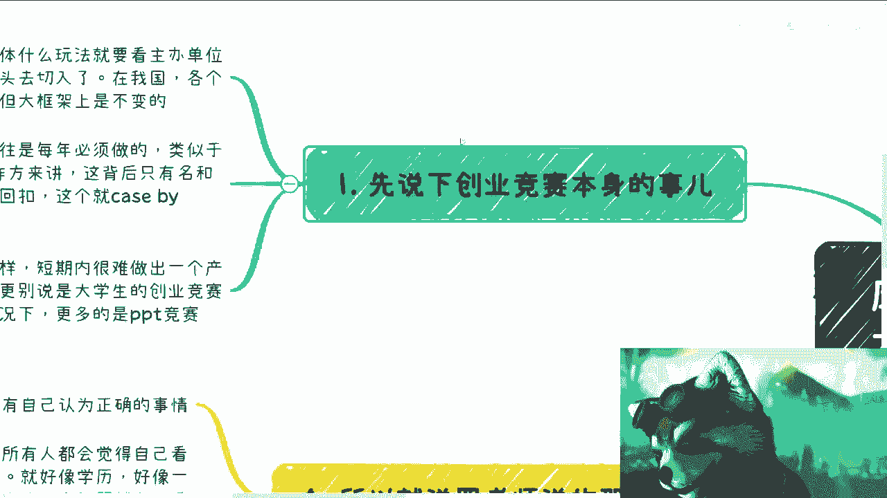
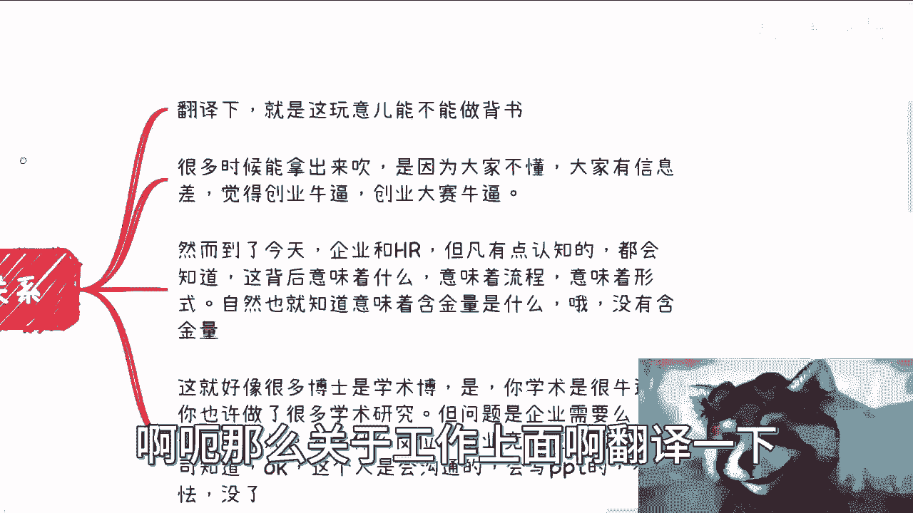
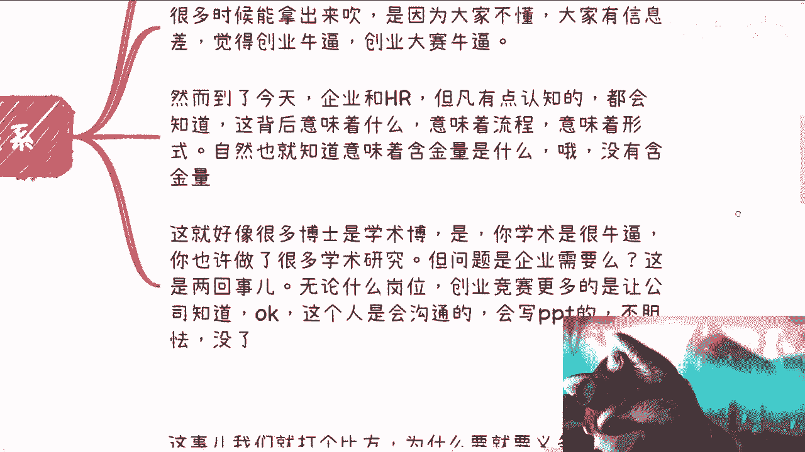
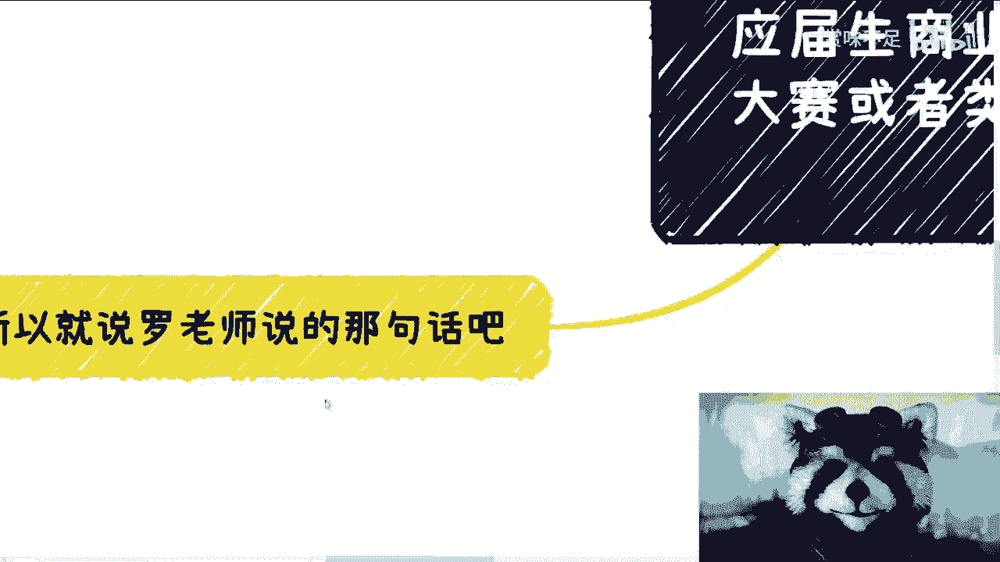

# 应届生商业专题：大学生创业竞赛与找工作和赚钱的关系 - P1 - 赏味不足 - BV1234y1N7XL

啊大家好啊，还没到10万，还没到10万，这个是B站的计计算一直是四舍五入的，所以这个快了快了啊，呃今天这个主题呢是之前有个小伙伴啊，这个投稿的说学校里的这个创业大赛，那个图呢对比较糊。

说说维密怎么看清楚啊，但无所谓啊，呃学校里创业大赛对吧，或者对于这个未来工作跟赚钱的影响啊，是这样子的。

呃先说一个大的前提啊，你就像我之前跟大家说，那个国家职业技能等级一样，就是你知道吗，就是有一半的人啊听完就会跟我说，哎我多去考点证书，有一半的人呢他说听完他说哦，我懂了，我要去办这个东西对吧。

所以说呢其实创业竞赛这个东西也是一样的，就是你作为一个参与者，就是你是去参加竞赛的，那对你没卵用，你知道吗，就是你就是个韭菜啊，你要是说我跟学校合办对吧，你要有办法去作为主导方去参加对吧。

你说我是举办举办方之一对吧，或者我在里面可能做了些活对吧，大家分点论，那没问题对吧。

所以说就是这个事本身都是好的，都是赚钱的，但是你说你要把它当成一个东西去参加，把他当成一个背书，那我说实话有点low啊。

有点low啊，首先我们先来看啊，这个创业竞赛的名头呢很多具体什么玩法对吧，到底是校企合作呢，还是金星伟呢，还是科委呢对吧。

他到底通过什么名头去切，这个具体就是看他的举办方是谁啊，那么在我们这这个我国现在这个情况呢，就是说各个地方的玩法可能都不一样，但是大框大框架呢是不变的，呃从学校角度来讲呢，这种竞赛每一年肯定都会做啊。

就他作为一种叫什么每一年的固定节目啊，肯定都会去做类似于KPI啊，但是对于企业或者合作方来讲呢，这个背后你们自己去想嘛对吧，就我今天如果跟校跟学校去合作对吧，你说我做慈善啊。

我就为了学生这个这个要有创业的sense对吧，或者怎么样的，你觉得可能吗，怎么说出来都他妈不信啊，对不对，那当然就是说学校里面老师是不是拿回扣，这个咱就不知道了对吧，kiss by kiss啊。

有的地方不拿啊，有地方拿的少，有的地方拿的比企业都要多，那谁晓得呢。

对不对啊，那么这是第二点，第三点呢，创业大赛就跟我们现在有很多hon对吧，就黑客松是一样的，就是短期内很难他去，就本质上啊你组一个团队，比如说你有开发有产品对吧，有有有有项目经理对吧，你要有设计对吧。

你短期内你很难做出个产品，你最多是一个prototype对吧，you demo对吧，你更别说这个这个这个大学生创业竞赛了对吧，因为大学生很多创业竞赛，就是他甚至都没有这种团队的这个组成意识。

因为对于学生来讲，大家又没有岗位对吧，那那你说最多就是啊我觉得我适合做开发哦，你是你觉得你适合做产品对吧，那大家就更像一种过家家的行为对吧，那说白了大多数情况下，更多的是PPPPT竞赛。

你知道吗，那么我先概括一下啊，就是大学生竞赛这个东西啊，他的切入点也是好的，但是经过了这么多年，所谓不进则退，什么意思，就是经过这么多年，他越来越与商业脱节，他也越来越商业化。

那么也就越来越商业化意味着什么呢，意味着就是该赚钱的是来赚钱的，而创业大学生的创业竞赛更你从我的角度，或者你从一个资本家角度，他更像一个就是为了大家赚钱的一个一个，幼儿园的过家家行为，你知道吗啊。

呃那么关于工作上面啊。

翻译一下，我先来翻译一下啊，就是工作上没这玩意，他就不能呃，这个就是这个玩意儿能不能拿来做背书对吧，比如说你说我得了第一名，我得第二名对吧，或者说是你说你说省赛也好，怎么样也好，对吧啊等等等对吧。

那很多时候是这样子的，你要这么想啊，很多时候拿出来吹他是因为大家不懂啊，大家有信息差啊，觉得就是说这种竞赛牛逼，或者说创业大赛牛逼对吧，但是还是那句话啊，就是然而到了今天你牛逼不牛逼，很简单。

就是说如果你真的牛逼对吧，那你就不会，就是你就不可能来走一个这种面试的流程，你就应该保送了对吧，就直接就说了，比如说阿里要你说百度要你字节要了，你还面试什么呢，不要面试了呀，这叫牛逼啊，对不了。

那包括就是说该送户口送户口，该送奖金送奖金，对不对，该该送十几线送送送东西对吧，那这叫牛逼呀对吧，该比如说呃国家研究院要对吧，给给该该给一些这个名头，就该给这叫牛逼啊对吧，你要是但凡去呵呵。

你但凡去去boss上去找对吧。

然后你去面试你，你放到以前的确没毛病啊，你放到今天企业跟hr，但凡有点认知的，我就说不是那种野鸡的企业会去啊对吧，他都会明白这种大赛背后意味着什么，意味着流程，意味着形式，你知道吗。

就意味着是流水化的东西，那自然也就意味着这里面有什么含金量，大家都懂啊，他直播不会揭穿你啊，但他不会像我这么直白嘛，对不对哦，那结果就是没有含金量。

对不对，这就好像什么呢，这就好像就是说很多博士他是学术博，对你学术是很牛逼，而且你也许你没币做了非常多的学术研究，但问题是企业需要的了，你不能吃，你要这么想，企业超人为了什么啊，没事情做。

每每个月给你35万做做慈善费，是不是不是的呀，对不对，当你工作拿一两万的时候，你是个工具人，当你拿35万的时候，可能你还是个工具人，但是当你要再拿更多的钱的时候，你一定要给企业创造价值的。

因为企业说到底它是个例题啊，对对啦，哦企业不赚钱，你让企业怎么活啊，企业下个月薪资哪里来啊，这没有办法的事情啊，你你你跑到老板这边，老板我老牛逼了，卧槽我不要太牛逼了，我我我我什么神，我什么是一等奖。

然后呢，你能给我赚钱吗，不能滚这么简单的事儿，真的是啊，无论什么岗位，创业竞赛更多的你要让公司知道，OK对吧，就是说你这个人会沟通，会写PPT，有团队合作的sense，不胆怯over，对不对。

就这么简单的一件事啊，那关于赚钱的方面呢，这事我们打个比方啊，比如说大家都懂啊，你说为什么要义务要那个9年制义务教育，为什么要高等教育，为什么大家不能直接，比如说什么18岁成年了就直接做科学家。

直接当电池，为什么要读书了，不要读书店，读什么书了，对不对，那为什么你想看，为什么，因为你学习就是个杂而广，就是一个打基础的过程，你比如说你经常去做开发，你得先学习原理吧，你在学习开发语法吧。

你在学习所谓的语言框架吧对吧，你总不能什么都不知道，你就跟我说，哎我来工作了，我来参加比赛呢对吧，那创业竞赛也是一个道理啊，你先我们分成两个角度来讲啊，创业跟竞赛对吧，好，第一你创业本身来讲。

创业无论是产品还是服务，你得先了解尽可能多的产品跟服务吧对吧，你去看看哪个公司的哪个做公司的产品或服务，他是没有做过调研的，他是没有没有之前的积累的，他说好，我18岁成年了，我就来做了，有。

不然没有的呀，对不对，你所有东西都得经历，就是尽可能多的去体验过，你知道吗，包括团队啊，包括合作，包括产品，包括服务啊，你才有可能去明白创业一个产品或者服务，他是怎么打磨出来的。

它不是一一天晚上拍脑袋拍出来的对吧，那我就问吧，大学生有没有这个经验吗，没有呀，对不了，那其次第二点来说，赚钱赚钱这个事大部分情况只要你们赚钱啊，大部分的场景跟大部分的场景和产品和服务。

本身它没有半毛钱关系，你知道吧，就真的是没有半毛钱关系啊，产品跟服务它是一个产物，它是一个过程当中，就是说今天无论谁来做，你知道吗，就是一个读过书跟一个没读过书的对吧，一个18岁跟一个48岁的。

他都有可能做出来一个产物，但是你说他能不能赚钱呢，不好意思，它不取决于这些idea，你idea再牛逼跟赚钱赚钱没有关系，这就好像你刚跟我说，还有那个某某老板对吧，我老牛逼了，我不是学历对吧。

我这个是一等奖对吧，省一等奖对吧，怎么样，然后呢，So what who care，我这样说好吧，我给你一个月10万没问题的，我就问你，你能不能给公司赚，每个月赚回来，待遇十分能留下，不能滚。

就这么简单，我管你是谁啊，对不对，所以说产你要真的赚钱，它取决于的是背后的资本运作和他的商业运作，什么叫商业运作，再说细节一点，比如说商业的成功与否，它在于利益的一个细节之处，你就比如说知识星球对吧。

你说歌词一段没问题啊，那你去割呗，你以为哥C端这么容易吗对吧，他知识星球里面也分很多种产品，分很多种模式，他如果只是大家所说的哦，他就搁歌词一段，我就弄个东西，九百九十九一年他没有这么简单的。

你你仔细去了解一下，他一定会有个引流的过程，他一定会有个过滤的过程对吧，这个就是我们说的这个利益的细节之处，而为什么这么多人会利用知识星球，是因为知识星球帮他们规避了交税。

规避了个人没办法去做商业的这么一个痛点，你知道吧，那么我们说你细节之处在于哪里，比如说你现在要做创业创业竞赛啊，创业竞赛对吧好，其实你真正成败的细节在哪里，在于你合作方，你上下游。

你的你的跟散户时间跟你的用户之间，大家利益怎么分配，你应该怎么收钱，你应该怎么交税，你应该怎么去设计整个的经济模型，这个是你要去考虑的，这个才是你最终成功与否的，不是说我今天有个天马行空的想法。

哎呀我今天卧槽牛逼了，我这个新能源的想法哦，既能够这个改善这个农业的，农业的什么什么效率对吧，又能够改善怎么样怎么样，卧槽一顿PPT猛如虎，然后呢有卵用，对不了，他就懂得都懂嘛，对不了啊。

然而这些大学生必然是不知道这些东西的对吧，那你告诉我这些竞赛有什么意义了。

对不对，所以说白了你要从赚钱上来讲，结论就是不会赚钱，就这么简单，结束了没有用的呀。

啊我跟你讲啊，你们别我就这么跟你们讲吧，创业大赛很多导师，这就跟很多教你们赚钱的人是一样的，他自己没有都没赚钱，他就教你们他妈他他他自己，他自己做过什么创业项目，他做过什么，他参与过哪些项目。

就他妈教你们创业大赛了，就他妈扯淡啊，所以说我们回到老罗说的那句话啊，老罗曾曾经说过对吧，每个人每个阶段总有自己认为正确的事情对吧，那你就这么想吧，你在没有看到过社会跟商业之前。

没有参与过社会面跟商业面之前，所有人都会觉得自己看到才是最重要的，最正确的，而而且也也是自己要去追求的，比如说学历，比如说学校办的一些东西，比如说省省赛市赛，比如说很多别的东西。

这就好像有很多家长觉得啊，这个小学生要去卷那个奥数对吧，卷卷很多这种竞赛就是，但是问题在哪里啊，但问题在于你要明白啊，最大的问题在于重要和不重要，这个东西最终有没有价值，不是我们决定的。

我们有能力决定吗，没有啊，决定这个价值是真正那些出钱的人，是真正决定你生死的人对吧，那么所以我们说我们要去知道什么是重要的，就是说你要先从了解钱从哪来，就好像你去面试，你得明白企业为什么给你钱。

是因为你是省赛第一名，是在第一名吗，不是啊，对不啦，那当然了，你也可以理解为，就是说省赛第一名是赛第一名对吧，或者其他各种各样的东西对吧，他能够给你个门槛，给你个别人对你的好印象没有错。

但是这是他们未来3年内，我3年后5年后能留下你的，留下来你的原因吧，不好意思，留下来的一定是要么给企业能赚钱的，要么跪舔老板，跪舔舔的很舒服的，跟你没有关系啊，你你滚，你知道吗啊。

你要了解社会上商业面是这个钱到底哪里来的，什么部门审批下来，什么名义审批下来的，呃今年是什么民意民意，什么名义对吧，有什么政策是国家愿意这个喜欢看到的对吧，然后啊。

还有就是说企是这个钱是不是企业固定的支出，还说是国家的基金扶持，还说是人才培养，你可能每个口都有钱，但你得知道这个口在什么地方啊对吧，那么你就得对症下药，这个药是最重要的，但是我可以明确告诉你们。

无论这个口在什么地方，没有一个口会是那些说我来认说哎，你这个竞赛什么东西哎，那个什么东西没有的哦，他最多给你个一两万，就像打发叫花子叫花子一样的，这叫赚钱吗，这叫辛苦钱对吧。

就是就是你要明白这个东西重要吗，也许重要，但他根本没有那么重要，他如果来说你们现在的目标就是我要赚钱，或者说我想怎么样，你回过头来看的时候，这些都是什么，都是，啊就是你不知道这个镇在什么地方。

你不知道这个这个省，比如说什么部门审批这个钱到底什么名目对吧，我们我们在申报项目的时候，我们很关键就是他的名目对吧，包括到底是什么部门对吧，这些是最重要的，你这些什么都不知道。

你你你觉得这个东西ABCDE很重要。

你就是自己就自嗨啊。

对吧，所以说呢就是就说我为什么说，就说你像之前那个俄罗斯，那个不是回上海的时候跟我聊的时候，我觉得他就已经很明白这其中的利益关系了，他就说他说的很清楚，他说陈老师，我现在就觉得对，大一进大学开始。

你就应该要做的是保住你的学历，保住你的学历，保住保住你能够毕业的前提之下就出去浪，出去了，出去了，给出去了解，这，这这这这社会面的百分就是水下的80%，甚至水下90%，你才能明白什么对你有是重要的。

而不是一天到晚被PUA，就觉得哎呀这个学校这个东西牛逼，哎呀那个东西牛逼，没用没用的呀，对不对，你要我来讲，我就一句话能来钱吗，请问能赚钱吗，不能滚，我管你是谁啊，对不对，或者说或者说你不能赚钱对吧。

没关系的呀，你手上这个牌能能换来钱吗，对啊，比如说比如说你跟我说，可以啊，牛逼对吧，你说爱我，我可能这个东西符合国家什么某某某计划，他能给钱，你还牛逼可以啊，而且他们持续给钱牛逼。

而且一次性给个几百万几千万牛逼，你要但凡跟我说什么，就就就什么给个给个10万，给个5万吧，一次性感啊，滚没用的呀，我有这种东西，这种东西你要知道中国，别说世界怎么到了中国这么大。

各行各业各个赛道能拿赚钱人多啦对吧，你这个算是排队排队好吧啊，就这么招吧啊这个东西我觉得就就这么回事啊，哎呀行吧，然后那个大家同样的好吧，就是有什么这个这个职业规划啊，或者说也不叫职业规划吧。

就想怎么赚钱的啊，想了解就我我这么跟你们讲吧，我不会给你们任何工作上的建议，工作上没什么好建议的，我能够给你们的就是这个世界，或者这个中国这个社会下面，80%的可能可以也不叫可能可以吧。

就是一直存在着赚钱的很多模式啊，这个我可以告诉你们啊，但是剩下你们到底怎么做，就看你们自己了好吧，如果你们想知道，你们想让我帮你们看看你们手上对吧，这个牌怎么打的啊，或者说这个职业发展怎么发展呢好吧。

那么你们可以整理好，整理好。