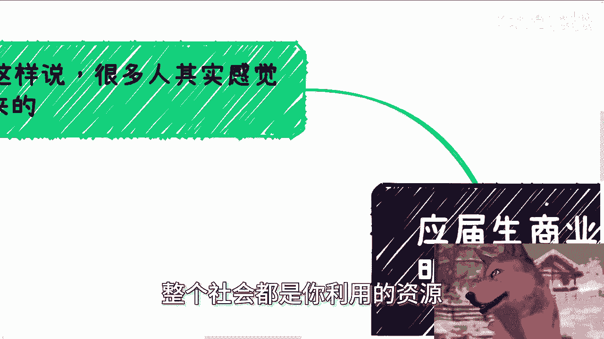
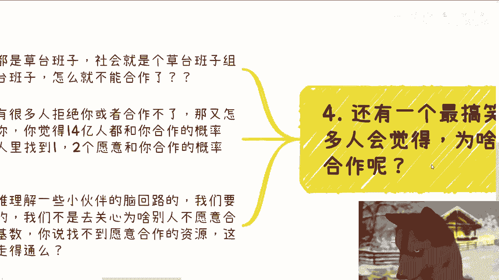

# 应届生商业专题：必须明白整个社会其实都是你可以利用的资源 - P1：应届生商业专题：必须明天整个社会其实都是你可以利用的资源 - 赏味不足 - BV1Bt4Ge4EvF

啊大家好，这个昨天有小伙伴跟我说，国庆好喜庆一点是吧，你看我今天这个样子喜不喜庆啊，啊不但喜庆，而且红啊。

而另外一方面呢，昨天有小伙伴跟我说，这个商业专题很久没更新了对吧，我今天给你们更新一下啊，今天我们讲的主题呢叫做对于大部分人来讲啊。

他必须明白整个社会都是你利用的资源啊。

就咱就这么这么说啊，就很多人其实感觉是反过来的，就是比如说他审视了一下自己自己的家庭，自己的社交圈啊，好了nothing对吧，然后就感觉自己什么都用不了，但你仔细想想看，是你什么都没有吗，这并不是啊。

你知道吗，就是你是因为你没有，你利用不了吗，他没不是这个因果关系，你之所以利用不了，是因为那是因为你不知道这个社会有什么，不是因为你没有，对不对，就说如果你单纯只是没有，你可以把它变成有嘛。

但是你通过你没有就得出来，你什么都利用不了，其实本质上不是因为你没有，是因为你不知道有什么，所以你一刀切把他觉得你用不了，你想想看啊，那么在我可视范围里面啊，只要业务做得好的，能赚钱的。

无一例外都是懂得利用资源的，靠自己就是你靠自己，这是不可能的，这我已经强调了无数遍了，我不管是谁，对吧，嗯当然在这里啊，我也只能给你们举些例子，你不可能说我给你们讲的多全面，而且我也不可能多全面。

我也就知道我所知道的那些东西，对不对，那么同时呢也希望很多小伙伴小伙伴啊，不要再问出那种非常符合应试教育的，的问题，比如说对吧，陈老师啊，有没有什么网站啊，书籍啊，能看到你说的这些东西啊。

或者能不能全面的看到你这些说的东西啊，问出这种问题的，按照我的逻辑是什么，就是我告诉你，你不是与这个社会脱轨多久，是与这个社会从来没有接过轨。

好第二点啊。

我们先拿各种政府机构啊来举例子，从我们合作这么这么多年的这个逻辑来讲啊，政府机构对我们而言就两种逻辑，就是要么我们是直接能和对方签署合同，能赚到钱的，对不对，那么第二种就是说没有钱的吧也行。

那就是给我们名，我们来拿名呢来去变现啊，那么很多人呢一开始社交的时候呢，觉得满地都是牛逼的人，为什么，因为他很容易被那种所谓的牛逼的头衔，或者说其他的一些有的没的东西吸引住，或者震慑住啊。

但是慢慢的他就会认识到，其实这些牛逼的人里面99%都是，都是怎么说呢，都是骗喷子，也不是喷子嘛，吹牛逼的啊，你说他骗子嘛也不算也不算啊，就装逼啊，那为什么呢，因为无论他说嘛说了多么牛逼的头衔。

他最终没法变现，那他妈有卵用，对不对啊，我们无法和政府，就是如果我们无法跟什么，比如说政府之间打交道啊，对吧或者怎么样子，那么第一优先级就是先去谈双方的合作，就先先不管有没有哎，我这边写错了。

怪不得我想怎么不通啊，就我们无论和什么政府机构打交道啊，第一优先级就是去谈双方的合作，你先别管有没有钱，你先谈，你知道吗，你别管钱，以达到合作为第一优先级，为什么啊，很简单，就像我们刚刚说的。

如果政府机构有钱，那是最好的，对不对，但是大概率他可能没有钱，或者他有钱，他不愿意花在你身上，那么很简单，就是我们就退而求其次，就是要求他出示对应的这个项目的，比如说文件如果没法给我们做特定的文件。

那么你只要给出上级的文件对吧，就是说都说，如果你没有办法给出我们细节的文件，那你给个笼统一点的也行啊，对不对，那是什么宝剑，不是就是你只要是尚方宝剑，反反正什么剑不是剑的，对不对啊，如果没有的话呢。

那就做点小活动啊，让他们的领导来出席一下，我们拍拍照，对不对，那我们可以利用领导出席等相关的内容，再去变现，就是说白了变现的逻辑有很多，但是你要的不是说今天你跟一个政府合作，你就盯着他薅。

然后第二他号的时候呢，你还跟我说，哎陈老师这个政府单位不愿意跟我们合作，机构不愿意和跟我们合作对吧，合不合作没有关系，我们可以通过各种方式来想办法。

达到我们的目的，对吧，这也就是我们说的你得灵活的利用资源，你不要就说怎么说呢，就就就就就就钻牛角尖啊对吧，111条路走到死啊，那不行啊啊第三啊，几乎所有的人第一想法都是自己去做。

我给你们讲，这就大错特错的，这个点呢我以前说了很多遍啊，任何事情你去社会上其实都是能找到的，没有什么事情是找不到的，你不要任何事情，一开始就想着自己做什么流量没有啦，自己取个号，什么东西不会了。

自己去学什么学历，没有了，自己去考，真当你能活500年了啊，对不对，当然啊，那鼠标不能动，当然啊，很多人在这个逻辑上呢也一直存在一个疑问啊，就是说他说如果什么都能找别人，那自己的核心竞争力是什么呢。

我跟你们讲啊，很简单，打工人，牛马工具人他才会认为技能是核心竞争力，就是说他非要有什么具象化的技能才是竞争力，但是我告诉你们，真正的资本家，政治家，既得利益者，他都会明白信息差关系链才是核心竞争力。

谁他妈跟你说，具体的技能是核心竞争力了，对不对，懂得如何利用牛马才是竞争力，别的他妈的有些搞别的都是虚的呀，明白吗啊，所以说很多东西啊不是你们做错了，是你们一开始思考的方向就错了啊。

那么第四还有个最搞笑的一点。

就是很多人会觉得啊，他说为啥社会上资源会跟我合作，哎我跟你们讲啊，你们所有人都会想这个问题，就说爱陈阳神，你说你他他就跟我说，他说陈老师，你看我一穷二白，我什么都没有，那为什么社会上的人呃。

这些资源会跟我合作呢，唉我就这么问你嘛，首先你和我都是草台班子，社会就是个草台班子，组成了一个巨大的草台班子，怎么就不能合作呢，另外啊我就问你们这么一个问题，的确会有很多人拒绝或者跟你合作不了，对不对。

好那我就这么问你啊，你觉得今天14亿人都跟你合作的概率大，你说百分之百跟你合作可能吗，你觉得概率有多大，还是十四十四亿里面找到那么一两个人，愿意跟你合作的概率大，你自己想想看啊。

你只要是一个智商正常的人，你不可能跟我说哦，我跟14亿人都合作的概率大，对不对，但是你为什么又觉得整个社会上人不能合作呢，我他妈也搞不懂了呀，啊很多人不愿意承认自己是二极管，那你这种行。

这种想法不就是二极管吗，哦要么全不能，要么就全部不能，因为我怎么我都搞不懂啊对吧，唉我跟你们讲啊，我有时候我很难理解一些小伙伴的脑回路，我们要找的是能合作的，我们不是去关心别人，为什么不愿意跟我们合作。

那他妈不愿意的人多了，你管他什么原因啊，这么大的基数，你说找不到合作的资源，这逻辑你自己想想看，我信不信是另外一回事，你自己觉得讲不讲得通啊，对不对哦。

嗯你要明白啊，在社会上做事情，他就是他说白了都是随机应变，都是灵活的事情，他不像你今天做一个数学题，你做你不会就是不会，但是你到社会上不一样啊，总有人可以合作，14亿人里面什么人没有啊，啊对咱就两句话。

第一什么人不能合作，第二我几百万赚不到，几10万，赚不到几万，赚不到，我找些人合作，几千块不是钱吗，啊怎么了呢啊，非要就是找一个人好好上来，就他妈合作，必须是几10万的单子，不值几10万的单子，我不做。

这他妈怪谁啊，对不对，啊所以啊我觉得其实还是那句话，就是所有人大部分人迷茫的点，往往是在于我什么都没有，往往在于我什么都不会，但是你有没有反过来想过需要你会什么呢对吧，或者说需要你有什么呢。

啊或者再退1万步1万步来讲，你你跟我这样的普通人，我们能有什么呢，对不对，干呗资源要去找啊，熟悉啊利用啊，好吧啊行好吧，那我们今天就先讲这么多啊，然后另外一个那个视频我会给你们讲一下，那个叫什么。

就关于呃行业时代，产业时代的那个红利期啊，不然到另外时间视频再说吧，好那么剩下的话就是说职业规划啊，工作上面，那么商业规划包括一些呃这个股权啊，分红啊，丰润啊对吧，商业计划书啊。

包括你们跟别人合作应该怎么合作啊，你们觉得整个这个路线定的对不对对吧，或者怎么样，你们觉得希望通过跟我的沟通，能够给你们一些更接地气的，或者说让你们少走点弯路的这种建议的话。

那么你们可以整理好对应的个人问题。

跟个人背景好吧。