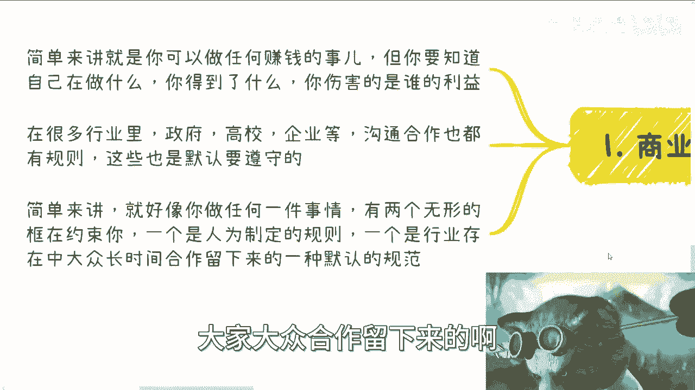
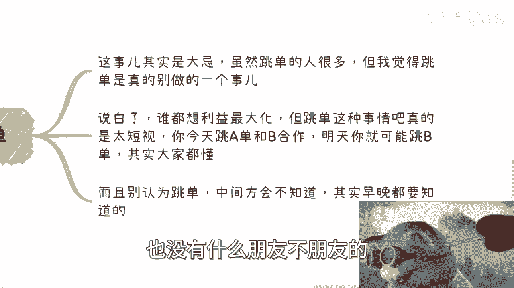
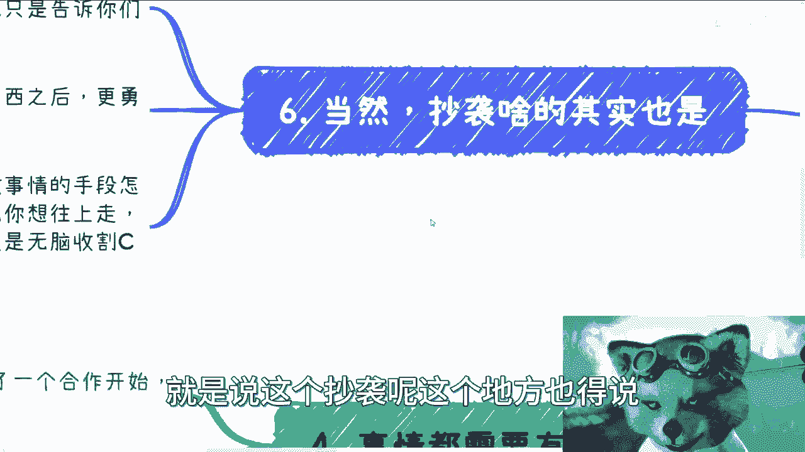
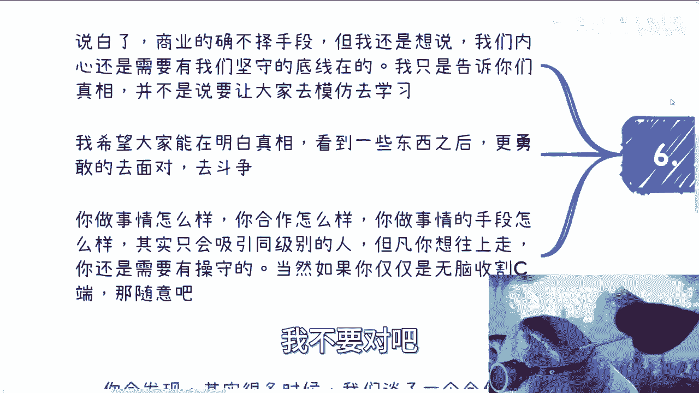
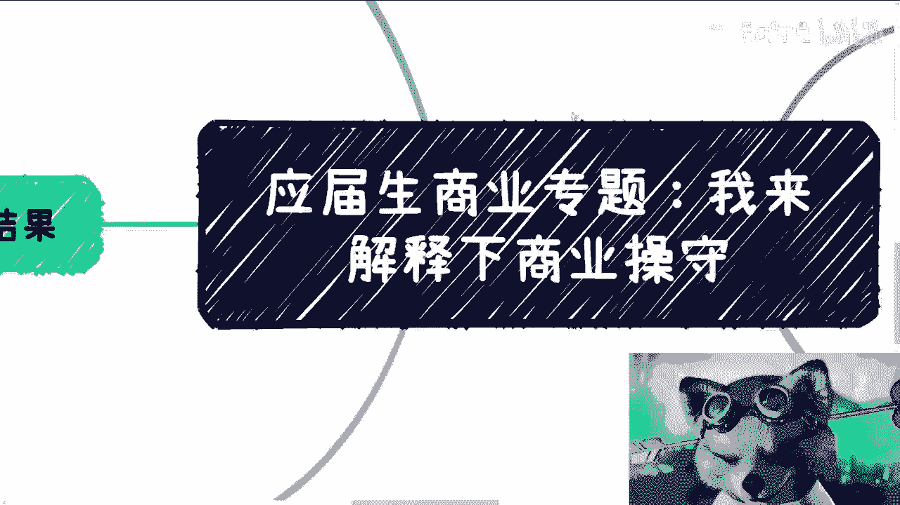
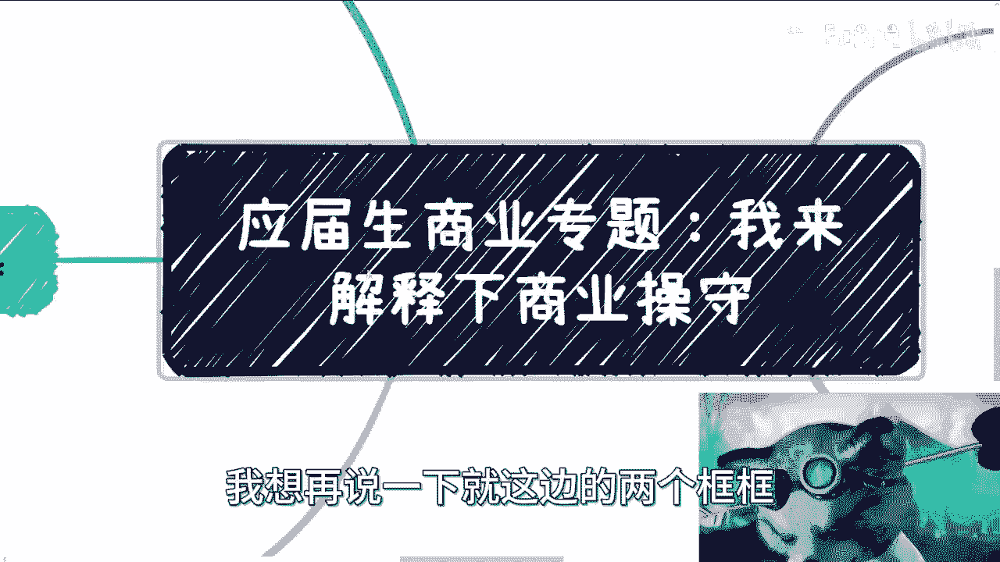
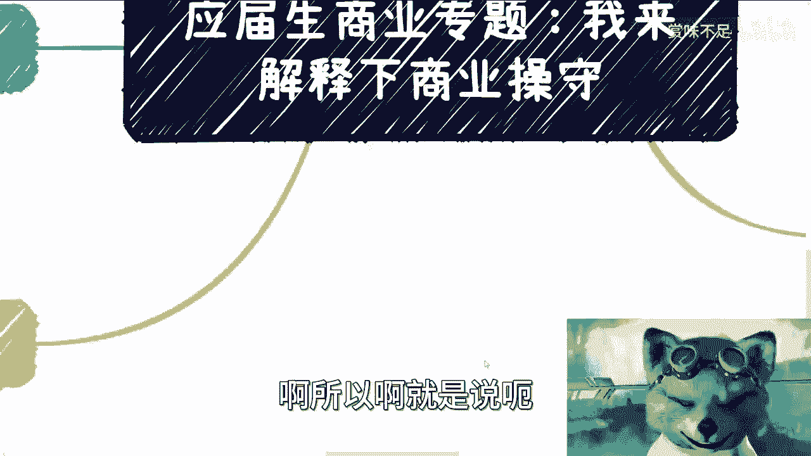

# 应届生商业专题：补档下什么是商业操守 - P1 - 赏味不足 - BV1M94y1z7zK

啊前两天小伙伴跟我说，让我来说一下这个商业操守的事情。

因为前两天我提到这个东西，我来给大家补一下啊。

首先啊就是我在这个地方先推荐个剧，叫羊毛战记啊，羊毛战记大家可以去看一下啊，我就不剧透了啊，反正不管怎么样吧，我觉得社会是分层的对吧，羊毛战记里面已经分得非常清楚了，包括资本家对无产阶级对吧。

这个等等等啊，包括底层底层劳动人民啊，那么同样的，到底大家现在是在什么样一个状态啊，然后为什么羊毛战绩会在全球对吧，引起了这么大的反响啊，反正这个看了就知道了，好吧嗯，反正记住啊。

我觉得看这个视频的大部分人和我啊，我们都不是什么既得利益者啊，真正的既得利益者是不会来去做视频，我估计也是不会来看视频，但是他们会来给我们制造很多的假象啊。

那么关于商业这一点呢，我也想告诉大家，就是我写我做的所有视频啊，就是说只是我看到的部分真相，但并不代表这些是正确的，我希望大家能够看到一些真相之后，还能够有勇气去面对，去斗争。

而不是说去比比谁谁底线低啊，这个就没有意义好吧。

那么首先商业操守是什么呢，简单来讲就是说你可以做任何事情，去赚任何钱啊，但是呢你要明白你在做什么，或者说你得到了什么，你又伤害的是谁的利益对吧，因为在整个商业过程当中，总有得总有失对吧。

那么在很多行业里面，比如说政府啊，高校啊，企业啊对吧，那么沟通沟通合作里面也是有很多规则的，那么这些呢也有很多，默认要去遵守的一些东西啊，这么简单来讲，就好像你做任何一件事情，有两个无形的框在约束你啊。

一个呢是人为制定的规则，但是这个规则也不会铭文去写啊，怎么样怎么样怎么样，一个是行业存在于呃，就一个是行业存在的过程当中啊，在漫长的过程当中，大家大众合作留下来的啊。

一种默认的规范，那么这是两个框。

那么我觉得我这边只能列一部分啊，但是不可能全部列好啊，那么大家可以举一反三啊，呃首先第一个呢就有问题呢。

先要朝内沟通，而不是朝外沟通，什么意思啊，就是说无论任何的问题啊，可能今天产品有问题，可能服务有问题啊，也有可能是各种各样别的问题，但有问题呢都需要内部先沟通啊，就是不管你多么气愤，不管你多么怎么样。

你要内部先沟通，而不是直接朝外，比如说跟你的合作方啊啊跟你的客户啊对吧，跟你的谁啊去沟通对吧，因为你所有的说辞，无论多么的就是有道理或者怎么样，因为在商业上面，大家是一个一个个体嘛对吧。

不管是你是一家公司还是一个，都是以项目为主的啊，任何的说辞其实都是在逃避，以及让外界会觉得你的团队不团结，或者你的团队不专业，你知道吗，那这个当然也不仅仅指一个项目的团队，比如说今天你合作了一个服务。

或者你合作了一个产品，那么这个产品里面可能有五六个公司，或者五六个团队对吧，不管怎么样，以这个公，以这个产品或者以这个服务为主体的里面，你都会显得不专业啊，那么另外呢就是说一个不懂得内部沟通而言。

他其实是不适合做商业的，也就好像一个不懂得沟通的人，或者一个不懂得主动沟通或者相互沟通，人其实无法去谈恋爱啊，无法很好的一起走下去，就是你可能可以谈啊，但是呢它绝对不是一个就是说能够啊漫长。

慢慢陪你去走过人生的这么一个人啊，那么这个是一个第二个呢，就是我一直提一直提一直提到的就是脱单啊，就脱单这个事儿呢其实是个大忌啊，这就怎么说呢，就是因为有很多人会问嘛，就是说我们商业合作当中。

如果碰到跳单的这么办对吧，当然我当时一直回是这么回的，我说呃合同上面我们可以有约束啊，但是单纯的合同约束，你也不能保证别人不脱单对吧，因为脱单这件事情嗯怎么说呢，太常见了啊，呃但是我觉得脱单这个事呢。

还是刚刚那句话，我们可以明白商业里面有这么一些人啊，有这么一些事，但是并不代表我们一定要也要这么做啊，这么说白了谁都想利益最大化，但是脱单这个事呢，我跟你讲就太短视，因为你今天跳A单和B去合作。

那你势必明天就有可能跳B单，去跟C去合作对吧，其实这个道理大家都懂啊，而且呢就是说你也别觉得就是说跳单，那别人会不知道对吧，其实唉其实说白了，商业合作里面也没有什么朋友不朋友的。

你知道吗，就是早晚这个中间方都会知道，那么知道之后其实对你来讲也没什么好处对吧。

那么哎我这么改掉啊，那么还有就是什么呢，就是说事情都是需要有个结果的，就是说呃你会发现啊，很多时候我们谈一个合作，就是这个合作呢可能刚谈的时候都很愉快啊，然后往下走，后面的发展呢我们其实是控制不了的。

那么但是问题在哪呢，问题就在于说啊，无论这个事情发展好坏，就比如说这个项目啊，我们合作好了，我们也没合作，或者说我们合作不愉快啊，或者能赚钱或者不能赚钱，或者说我是被你白嫖了这个解决方案啊。

或者什么东西，那当然就是说不管结果是什么，都是需要有个交代，你知道吗，这就好像比如说今天我跟你们合作对吧，我可能跟你们说，哎我这边有一个什么单子啊，大家怎么做怎么做啊，但是呢你比如说过了一个月对吧。

就是你们估计也不见得会这个呃，这个来问我对吧，那然后呢我就没声音了，你知道吧，那么这种合作是非常不好的，就是你和你有结果也好，没结果以后你需要给对方一个说法哦，就是为什么比如说这个项目没法推进下去了。

那么推进不下去的原因是什么，那么我们到底怎么去改进改进对吧，或者说我们接下来还有什么，就是还有什么新的啊这种项目可以去合作对吧，这些都是大家可以考虑的，而不是说不是说就是说今天啊，比如说你跟我说啊。

我给你个大纲对吧，我给你个什么解决方案，然后就没声音了对吧，那这个我跟你讲就是很不好啊。

非常不好，那当然啊就是说这个抄袭呢这个地方也得说。

因为说白了呢呃商业环境的确是不择手段的啊，这个就有一说一啊，但是呢我还是想说的，就说我们我们去做啊，就是从我角度来讲，我还是希望我们去做呢，就需要有坚守的这个底线，在你别说就说啊这个商业当中。

别人怎么样怎么样，那别人怎么样是别人的事情对吧，并不是说我们需要去模仿这些，这就是俗话说的好嘛对吧，你好的可以学，你坏的不用去学对吧，那么我希望大家能明白一个，明白一些真相，就是看到一些事情之后呢。

能够更勇敢的去面对，去斗争啊，而且呢大家要明白，就是说你做事情怎么样子，你合作怎么样子，你做事情的手段怎么样子，只会吸引到同级别的人，这个事情我之前说过对吧，但凡你要想往上走的。

你还是需要有商业的一些规则和操守的，啊那么也就是说如果那当然反过来说，如果你仅仅想无脑的去收割C端对吧，就像很多知识星球啊或者怎么样子，那你就随意啊，随便无所谓，反正大家这么人各有命对吧。

各大家都各自想要去追求自己的东西，也不一定一定是我说的这种，就是说啊这个相对比较正的路子啊，或者说比较啊这个可持续发展的对吧，有很多人说我就不想做可持续发展的对吧，可持续发展又要去铺垫，又要去积累。

又要怎么样，我不要我就要赚快钱也行啊。

无所谓，那关系不大啊。

好吧所以说呢我觉得就是说回到啊。

我想再说一下，就这边的两个框框啊，就是人为制定的规则呢，很多时候不一定是对的啊，大家一定要明白，人为制定规则，很多时候不一定是对的，是资本家是很多的既得利益，既得利益者为了保障自己的利益所得。

所制定下来的规则，并不代表它一定是正确的，但是并不也不是说所有的规则都是不对的啊，但是这个里面你就得自己去摸索，自己去探索对吧，但是你不能默认它都是对的，然后这是一方面，但是行业当中由于时间对吧。

大众所留下来的这些默认的规范呢，我觉得是需要去遵守的啊，因为这些其实是真正的，就是在合作当中所留下来的一些规章制度对吧，就像我们说的，就是说啊我们真的去商业合作，我们也不应该越级啊对吧。

你说我今天这么这么下面人不找对吧，那这个我觉得也不合适，但是同样的，你说像之前我们提到的一些酒桌文化对吧，或者怎么样子啊，那我觉得这种可能就是一些非常糟粕的东西，我们就没有必要去遵守它对吧。

虽然你说也没有一个书面的规定，说怎么样，也也可能是这个潜移默化留下来的一种规则。

但是没有必要，所以啊就是说呃所以说我希望大家能明白呢。

就是说啊不是说今天啊我没有底线了，我就是在做商业，或者我就是就是融资对吧，融了天使轮ABCD轮，我就呃做商业了，亦或者说我今天就是啊那个比如说呃，比如说脱单了对吧。

或者我今天就是说做了一些做了一些啊对吧，就是各种各样的事吧，啊就是并不是说这些就是商业，或者说也并不是说这些就是商业的，这么这个这个底线啊或者操守啊，反正总体来讲呢我觉得就是好和不好，大家自己去判断啊。

我只能说就是说现在呢也的确有很多人抄啊，相互抄来抄去也有很多啊，但是你说如果来说，大家把这种单纯的抄就变成一种商业的话，那我觉得就还是过于幼稚好吧行，我今天就是给大家补一下哦。

可能也就是没有准备太多的这个内容好吧，那么同样的希望大家就是好吧，有什么问题啊，就是职业规划啊，或者说这个发展啊啊或者说就是手上有什么牌，不知道怎么打的好吧，就是把这个问题还有个人的背景啊。

详细的都跟呃整理一下，然后私信我好吧，如果你们觉得有必要，你们觉得问题简单，你们就直接问我啊。

如果你们觉得有必要。