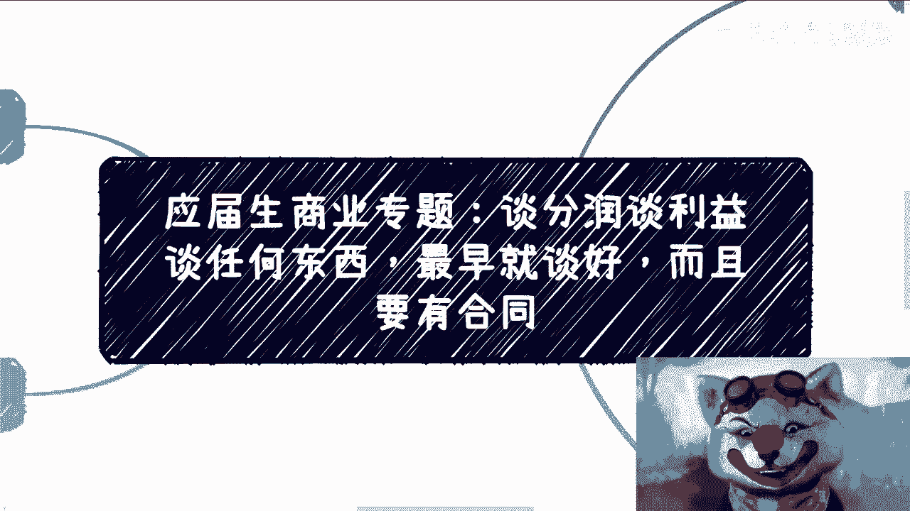
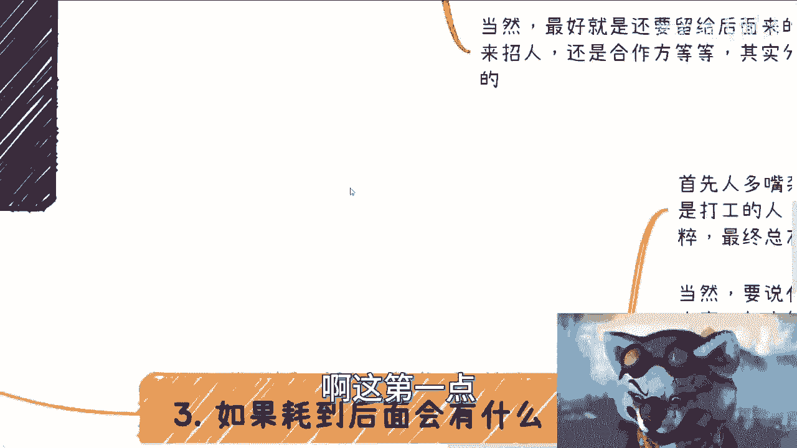
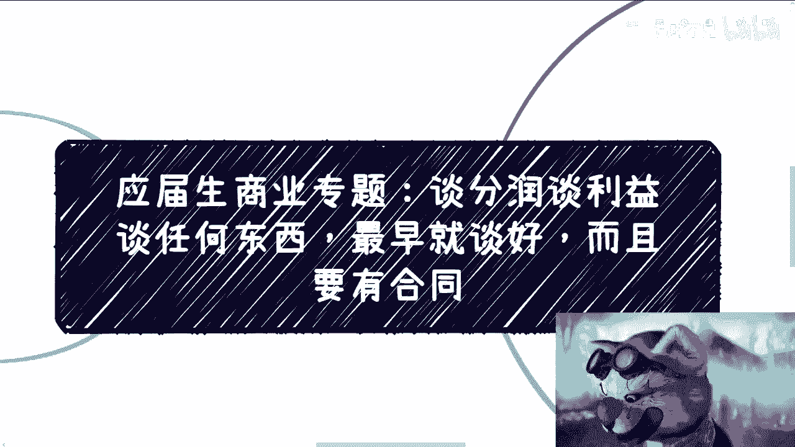
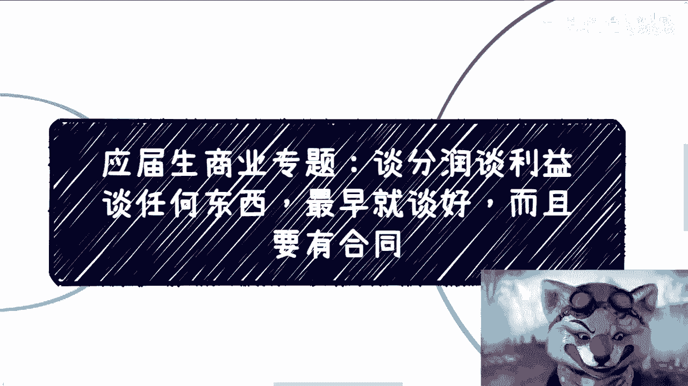
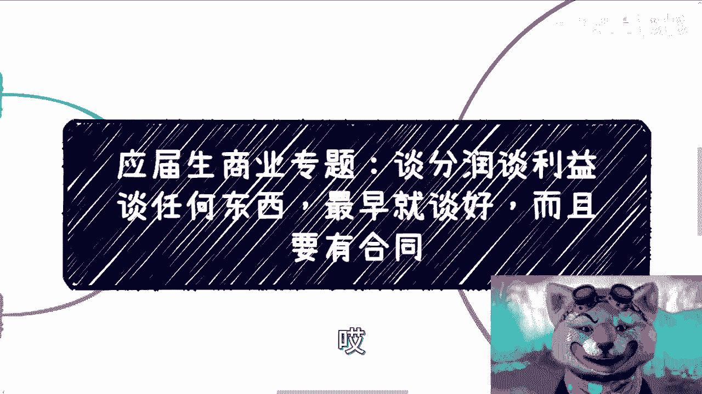

# 应届生商业专题：谈分润谈利益，一早就要谈好，合同签好 - P1 - 赏味不足 - BV1Zz4y1L7zX

好大家好，这个。

今天呢因为前两天有个小伙伴啊，在私信里面提到了这个问题，我觉得很重要啊，的确我之前漏掉了，我之前漏掉了，然后为什么这把出装出小丑呢，就是因为这东西这个怎么说呢，你要是不注重的，就是小丑是吧。

所有的东西啊，你要是真的想做的，我不管你到底是想赚快钱还是做别的东西啊，是想注册公司还是不注册公司，这个都不重要，重要的是你谈利润分润，谈任何东西，你一开始就谈好啊，一开始就要谈好。

你也这个一定要有合同啊，就这么简单，那么我们为什么说有很多人要问啊，他说那为什么你赚快钱，你也要做这个东西啊，很简单，因为你今天当下你们所面临的问题，所要做的事情是你们当下的未来怎么发展，不知道啊。

但是就是说你一开始觉得你是要赚快钱的，但后来你可能发现诶，这种东西做着做着也蛮好的对吧，也这个可持续发展。

那么你一开始就得把这些东西谈好啊，首先第一点这个事啊一定是要坚定的，就是说无论他跟你什么关系啊，你说是朋友啊，家人啊，还是说是什么什么什么叫什么同学啊对吧，这些都不重要，你所有的时候所有的这个情况。

一开始就要去定呃，退1万步来讲啊，你们可以没有公司，但是你们一定要定好，大家怎么分工的，比如说你们有三个人，四个人合伙对吧，做事情啊怎么分工的，到底要不要盈利啊，因为很多时候呢这个事儿啊。

他可能分正反面，就是有时候你们做的事情可能是公益的，但是呢你们希望通过公益的方式来积累流量，但是未来再来盈利，对不对，好，那么你们要去谈好，最终要不要盈利，盈利了算谁的，怎么分啊。

这个后面我会展开跟你们说的，那么第三点最好能签合同，因为很多时候一开始你会发现问题都不大啊，随便什么情况问题都不大，为什么，因为你们没有利益的冲突，你们的摊子不大，所以大家考虑问题都会比较单纯。

比较简单啊，等你真的有业务复杂了，流量变大了就很烦了，你知道吧，你到时候还怎么谈，你到时候大家的这个人心就变了对吧，本质也变了，你到时候怎么谈，没法谈对吧，为什么我们说一开始谈好，就是因为你要最后后悔。

那你也没法后对吧，这是第一点，第二点就是说你至少一开始得有个框架，在这个地方，你要有约束力对吧，你要说未来，比如说有人说我不同意对吧，我要改的，我想变的没问题，那你有一个约束力，你想改，你有你想变对吧。

那么，你就可以就是至少有一个框架上面说哎，大家要去便去改，而不是说啊我们都没谈过好了，我就说不定就自己自作主张，我就改了，我就变了对吧，那这样的话你至少有一个约束力在那个地方。

那么我们往第二个方面来看啊，你要怎么谈。

对不对，好，我跟你讲啊，你就单刀直入，开诚布公，怎么来怎么呃，怎么直接怎么来，为什么你们不管我，我不管你们做什么业务啊，你们都已经要合伙去做了，你们要一起做事情了，你们但凡都已经是这个状态。

你还要绕圈子，你别做了，我跟你讲，你早晚都要报，有什么好做的呢，对不对啊，这第一第二你一定要注册公司，我跟你讲，就是皮包公司，别管这么多，你知道吧，就是什么公司，叫什么这个这个什么样的这种营业范围对吧。

你的注册成本最低，你就去注册呃，呃因为你只有有了公司，你们才能签合同，才能有一定的效益对吧，否则大家都在扯皮，你扯过来扯过去，你说今天谈成达成共识了，明天他也不认了，你怎么弄呢对吧。

因为毕竟你不知道你这个合作的人，是怎么样子的对吧，人心隔肚皮，你怎么知道呢，对吧好那么第三啊就是说具体看怎么分啊，也看你们具体业务呃，这个做什么，但是呢一般是这个样子，比如说啊你说你们有几个合伙人。

大家一起做对吧，最基本的对吧，就是说如果有利益多少，是就是这个钱里面有多少是按照分红来的对吧，分红什么意思，就是这个case赚100万，我们可以约定，比如说是按季度分还是按年度分，还是按半年份。

但是这个钱你当下这个case拿到钱，你是分不到的，你明白吧，哦那么还是说大家没有分红，就是都是kiss by kiss来啊，还是说分的都是流水还是利润对吧，但是呢我跟你们讲，虽然我们说啊。

就这些事儿是你们三四个人，或者五六个人合伙一起来定的，但是啊你最好要把它分析一点，你别到时候觉得就说哎呀这个东西哎，大家拿达成共识就可以了，没有用的，你知道吗，我跟你们随便打个比方。

比如说今天你们三个人卖西瓜对吧好，你觉得你觉得就是说我们那个那个三个人，卖完西瓜就按三点33。33%嘛，就33333开嘛对吧好，这样评分对没问题啊，好没问题啊，好没问题好，然后我们打个比方。

你今天开始卖西瓜，卖着卖着，你觉得流量不错啊，你想卖哈密瓜了对吧，好卖哈密瓜卖哈密瓜，这个时候来了一单啊，这一单呢是你拉来的啊，是你的关系啊，或者是你拿到的货源，然后本来卖西瓜呢。

比如说一天只能赚100块对吧，你们现在卖开始卖花蜜瓜了啊，这哈密瓜一天能赚1万，那这个时候再按照33。33，你愿意吗，你也许第一天你愿意，但是你到了第二天，第三天往后呢，你愿意吗，你怎么愿意呀对吧。

但是那请问你你不愿意又怎么定呢，你怎么改呢对吧，所以说啊你一开始就得去想好，就是哪些事情是作为创始人他应该吃的红利，哪些事情应该是case里面的人，就像销售一样，他是按提成来的。

按这个case里面参与的多少来的，而哪些人呢又是按照就是说是，比如说呃这个打工形式就不按case的分润来，是按照固定的流程，固定的这个这个报酬来的，你得把它分清楚，那当然这个地方又得说了，要要刘老师。

我们不懂对吧，这个这个很多人都讲不清楚，是所以这些事情你们要去咨询，你们知道吗，你们可以去咨询你们的律师对吧，或者咨询，就是给你们制定给你们去订合同的这些律师，那当然就是说就不不是说你一定要去走什么。

多正规的资源，你随便找个找个律师，其实比如说活动上认识一个，或者说怎么样，你让他帮个忙，哎呀这个你请他吃顿饭的事情，你知道吗，哦那么我跟你讲，这当中最大的点在哪里啊，最大的点是在于怎么区分自己的业务。

跟公司的业务，或者来说团队的业务，因为很多事情很多时候最大的扯皮，就是你觉得啊你卖哈密瓜是自己的业务，但团队觉得不是团队，就是说这个哈密瓜TMD是我们的业务，那凭什么你说你的业务啊，我们就得分33。

33%，对不对，好，那最终你矛盾四起对吧，一一切对，你要一开始说清楚是最干净的哦，当然你最好分的时候还得分给留给后面的人，这也是为什么我们在股权分配的时候会有期权，对吧，你还要所谓的还有股权池。

期权池对吧，你要留给后面来的人，不管未来你们是真的那种叫做啊劳动，就是全职，就叫什么劳动合同制的，招人也好，还是说是合作方式的也好，就是你这个股权池，期权池你是可以留给你招的人。

你也是可以留给未来跟你背靠背，虽然不在一家公司，但是是上下游合作关系的公司都可以，你知道吗，就这个东西怎么做，是看大家合同怎么签的，他没有一个固定的模板啊，但是分钱的模式是很复杂的，你得想好。

你知道吧，而不是说大家拍脑袋啊，这是第一点呃。

我们来说第二点啊，如果号到后面会有什么，你看啊，首先人多嘴杂，什么意思呢，业务在发展过程当中，可能会有很多的人加入对吧，不管是打工人还是合作方，你要这么想，无论你们几个人最初多纯粹，多咳咳咳。

多达成一致，你最终总有人会改变初心，最终总有人可能会脑子不清楚，我不是说他一定变啊，但是他总有人会脑子不清楚对吧，那当然你要说后果是什么，很简单，比如说几个方面啊，一明明大家一起来做事情的。

大家应该一开始就拿到最大的利润，对不对，但是你想想看啊，如果你开始不说清楚，在未来真的赚钱了，你又拿不到属于你的那一份，那你不是亏成马了吗，对不对，你愿意吗，你不愿意啊，对吧，这是一方面。

第二方面当然亏还是好的了，你知道吧，啊万一啊你想想看啊，你到最后这个你个人做个业务啊，团队呢他说我不让你做对吧，或者说你做吧，我就黑你，我就想办法搞你啊，也不让你利盈利啊，然后公开去搞你。

然后呢说你明明你没有用团队资源吗，非要你说你用团队资源为自己牟利，我就问你怎么办，你不是叫什么，吃了坨屎里面还夹了个苍蝇，对不对，你记住证明几碗粉永远都是最的方式，所以说白了什么意思呢。

说白了你到那个时候就是被动的，你能怎么办呢，因为对外界来讲，你们这个叫什么叫窝里斗对吧，什么叫窝里斗，就是你随便怎么说，在外界都是来看笑话的，你懂吗啊，但而且去你随便怎么说，对你对对。

他们就对你们整个这种整体对谁都是没有好处，这个是多输的一个状态啊，那么最后你容易也会面临两难的境地，什么意思呢，就是说你明明是一个这个初创团队，你又不想脱离，因为你想着自己也付出了很多的努力。

你需要自己的利润，对不对，你如果来说大家没有赚钱就算了，如果未来这个业务赚钱了，你明明发现你有钱要分，你能不要吗对吧，但是你这个时候又面临着，比如说你跟内部，就像我们刚刚上面提到的。

你跟内部这边有很大的矛盾对吧，你你你你已经开始撕逼了对吧，你可能看的怎么样了啊，啊或者别人来黑你了对吧好，那么你想想看啊，我们不管到底是由于内部的矛盾，真的有矛盾也好，还是说是有人挑拨离间也好。

你很难开展自己的业务，或者你很难左右整个大的方向，你这个时候就会进退两难，因为你要记住一点，就是当业务发展了之后，你们三个人或你们四个人，或者你们五个人，或者你们一个，一开始这个团队。

你们之间的沟通就已经不再像最早的时候了，你们的人啊，你们的这些人，很有可能自己私下也会跟很多人沟通。

而这些人里面就有些人会煽动，有些人会蛊惑，没有办法的，因为人就是这么一个生物。

你知道吗，呃而大家一开始正就是就是尤其是应届生。

或者说没有做过商业的，大家一开始往往会出现的想法是什么呢，就是大家都是朋友啊，我呢不好意思开口啊，也不知道怎么开口，我跟你讲，这是第一种，第二种就是现在的业务呢其实刚起步对吧，也没赚什么钱啊。

这个谈这些呢有可能太那个功力了，或者太急功近利了对吧，就是说等以后赚钱了再谈啊，第三呢就是说也会觉得呢要注册公司，太烦了对吧，又要法人，又要报税对吧，又要有财务对吧，太复杂，我跟你这么讲啊。

这个事很简单，就是你要么就想开一点，什么叫想开一点呢，就是说我就是来做慈善的，我不赚钱啊，也就是说你今天可能是一个初始团队，创始团队，如果这个团队未来被收购了，或者未来真的赚钱了。

一年有个2000万3000万一个亿的利润，你别后悔，你别搞得，到时候吃相太难看对吧，我觉得这是第一点，第二点是什么呢，就是要么你也就想清楚就是什么呢，就是就是，我就不赚钱哦，随便怎么样，我都不赚钱。

我不要啊，我这个这个想明白了，我就不要来点也行啊，但凡我跟你讲啊，你一开始不聊，到后面我不说这么高的利润，你哪怕一年能赚个三五十万，我跟你讲，你们这撕逼有的好撕了。

而且撕到最后是什么呢，撕到最后大概率的结果就是明明你们在未来，我们打个比方，你们就像刚刚我们说卖卖瓜对吧，你们明明是可能在两三年内，把利润做到几千万的啊，而且还是通过买瓜，可能模式是不变的啊。

也可能是做的，但是呢就由于你们这些小毛小利，就因为大家的这些没有约束，没有一开始聊清楚，可能大家就开始撕逼了，可能大家就开始做内部分裂了，而到最后可能你不要说，一年几千万或者一年几百万。

你最终可能这个业务就没有了对吧。

由于你们几个人的四分五裂，就导致这个业务没有了，何必呢对吧，明明哦这是一个很好的开始，明明大家是可以一起把这个蛋糕做大的，飞不了啊非彼，所以说呢就是嗯嗯我们有句老话，说的很清楚对吧。

就是人性是不值得被挑战的，什么意思呢，就是说不要去挑战他哦，就是你该谈就谈，你一开始该了解好就了解好，你该在做所有的东西之间该去谈就去谈，就像我以前跟你们讲的，你们要跟我跟我合作对吧。

或者怎么样子就谈好啊，你说你说陈老师我们合作啊，这个数字经济对吧，好你说这个我们合作什么东西啊，我提供什么，你提供什么啊，你你我要多少钱，怎么样怎么样怎么样，你就说啊，你谈对吧。

你不要这个一开始嘛不说啊，到最后呢打个比方，我觉得应该给你三成啊，你可能拿到三成啊，心里面不开心啊，我明明应该我觉得我付出很多的，我应该拿五成对吧，然后到时候好了就久而久之对吧，你可能跟我合作两三单啊。

这个有不开心吗，也不说啊，久而久之可能星辰星辰怨念啊，到最后面又开始攻击了，会怎么样呢，何必呢，你会发现你会发现这个事就很搞笑，为什么，因为你攻击我没有意义，为什么，因为你攻击我并不会让你多赚钱啊。

我就像我在充电视频里面说的很，什么叫格局，格局，就是你要明白做什么事情能让大家赚更多的钱，而不是为了自己的一己私欲，更何况你都赚不到钱，对吧好吧行吧。

就这么着吧，我希望这个可能是就之前我遗漏的一点，因为最近有一个小伙伴问嘛，我觉得也对啊，这个东西是要说清楚行吧好吧，那就这么着吧，反正有什么有什么，就说你们就你们不知道这个到底要不要出国啊。

到底要不要读书啊，到底要不要这个这个打工啊，到底要不知道应该怎么赚钱啊，你们可以整理好对吧，私信我好吧，我咨询就是为这个东西存在啊。

