# 应届生求职包装指南 - P1：核心思维转变 🎯

在本节课中，我们将探讨应届生在求职和商业环境中如何进行有效“包装”。核心观点是：你实际有多优秀并不重要，重要的是如何让目标对象（如面试官、客户）认为你优秀。这是一种关键的思维转变。

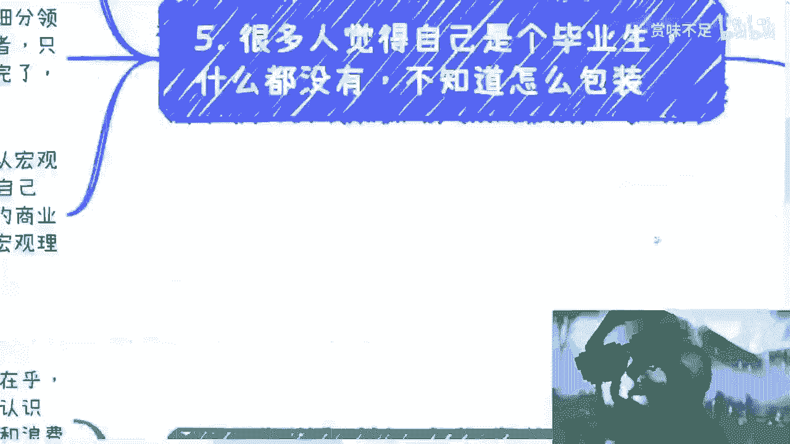

## 概述：为何需要包装？

最近出现一种观点，认为大学毕业生应坚守道德观和理想。这种观点本身没有错。但在当前环境下，普通人的第一要务是赚钱谋生。谈论理想和底线固然重要，但我们往往缺乏相应的资源和资格去纯粹追求这些。

因此，对于应届生而言，学会“包装”自己，以适应现实需求，变得至关重要。

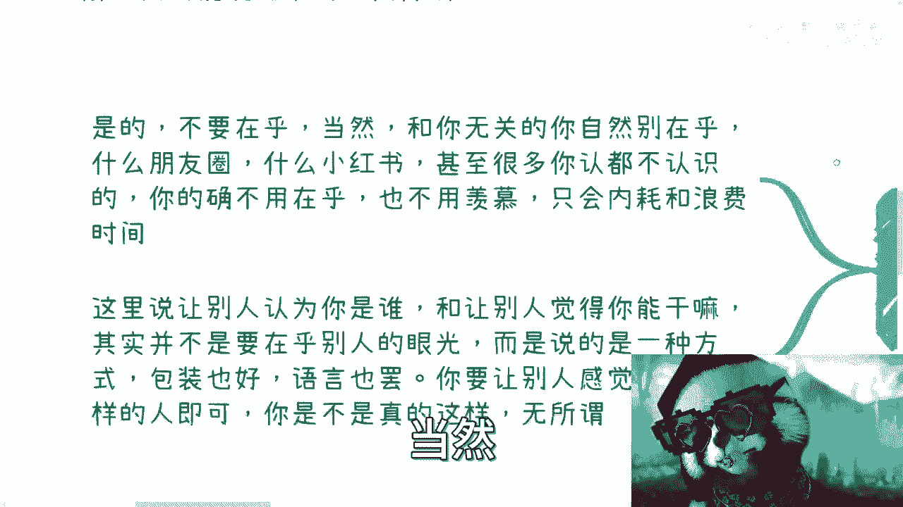

## 核心理念：感知大于事实

首先要记住一个核心公式：

**有效价值 = 他人对你的感知**

你是谁、你能做什么、你自己觉得多厉害，这些都不重要。重要的是**别人认为你是谁、别人觉得你能做什么、别人认为你牛不牛逼**。这才是决定你能否获得机会的关键。

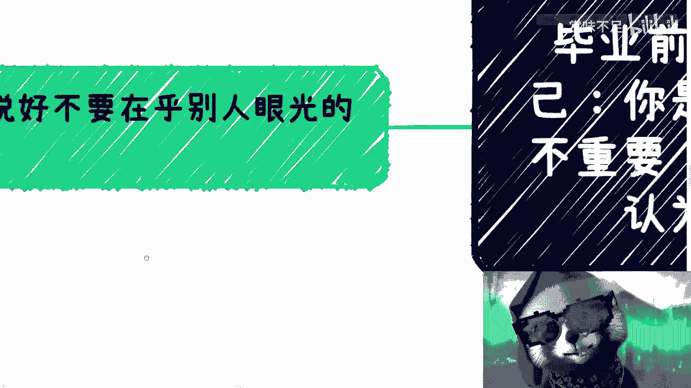

许多人觉得自己作为应届生一无所有，不知如何包装。但现实是，即使工作多年后，很多人本质上依然“什么都没有”。因此，包装技能并非应届生独需，而是一项长期受益的商业能力。

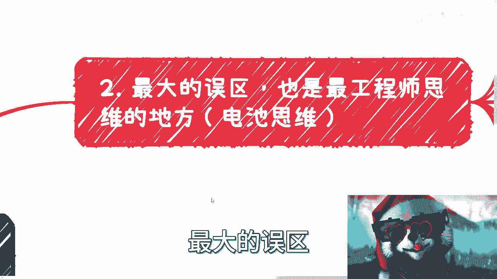

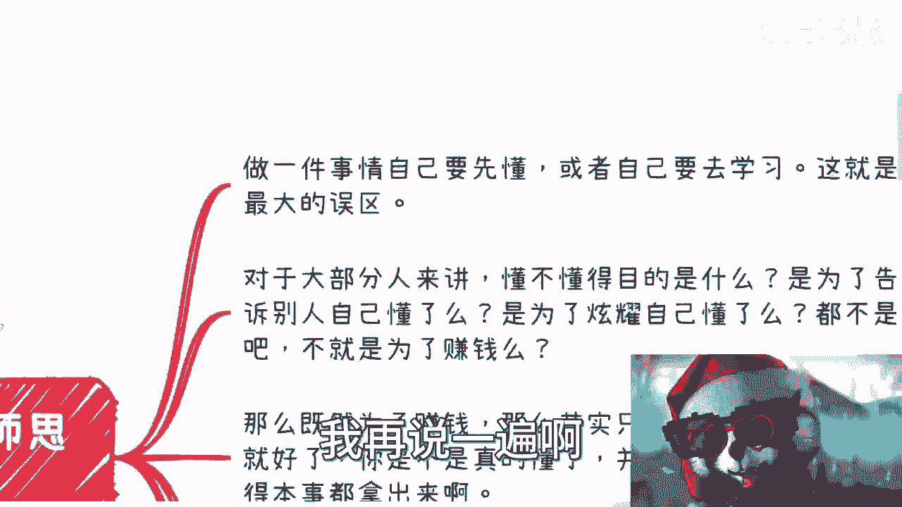

## 误区一：过度在乎无关眼光

上一节我们确立了“他人感知很重要”的核心。但这里需要澄清一个常见误区：我们并非要在乎所有人的眼光。

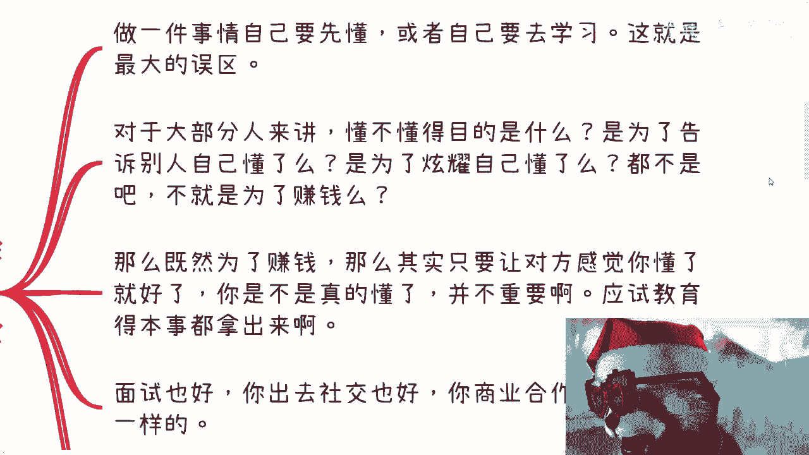

以下是无需在乎的方面：
*   **社交媒体展示**：如朋友圈、小红书、抖音上他人的生活，与你无关。
*   **陌生人的成就**：你不认识的人的成功，无需羡慕，否则只会内耗。
*   **无关领域的波动**：例如股市涨跌，除非你参与其中，否则不必关心。

我们所说的“让别人认为你厉害”，并非这种泛泛的在乎，而是一种**主动的、有策略的展示方法**。你可以将其理解为一种对外的“演示”或“包装”。

这种包装可以体现在：
*   **语言**：如何描述自己的经历和能力。
*   **气场**：言谈举止中展现的自信。
*   **材料**：简历、作品集等视觉化呈现。

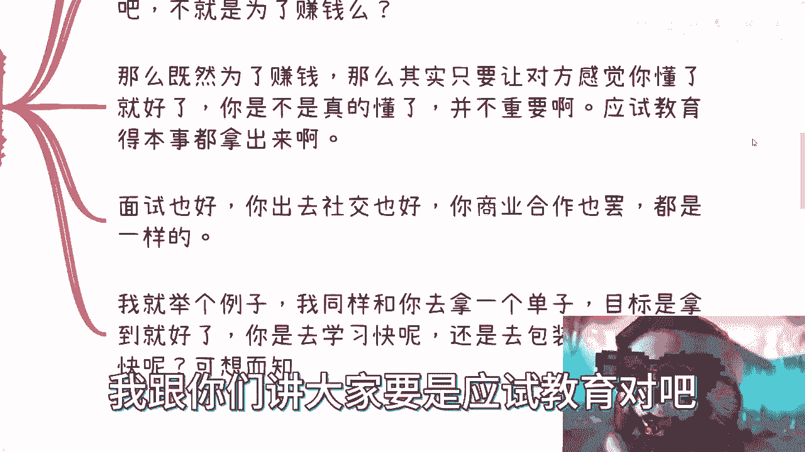

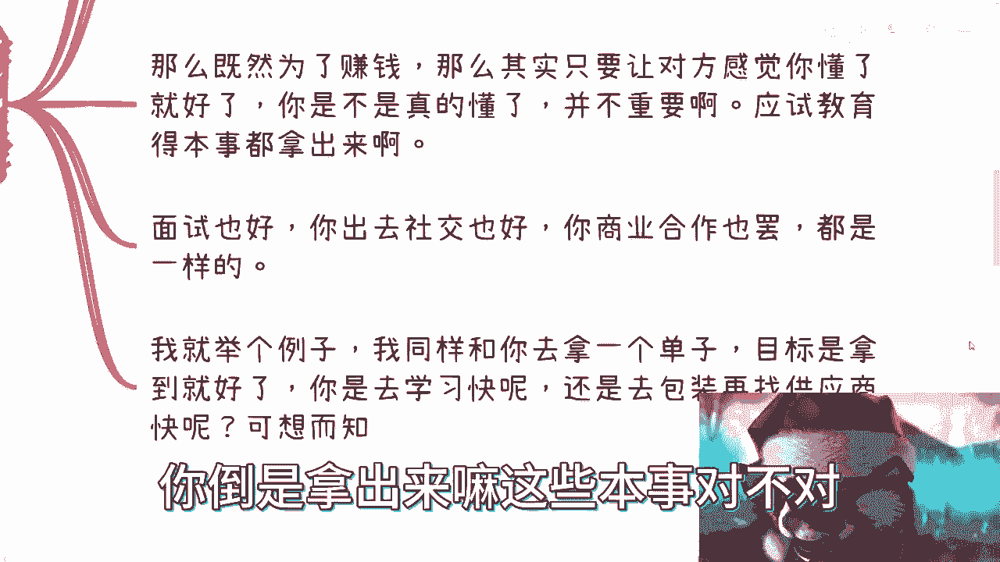

目的是**让别人感觉到你是某种人**，至于你是否真的是那样，反而不重要。例如，你无需真的拥有MIT学位，只需要在关键时刻能让人相信你有相应的能力或层次即可。为了一句“我是MIT毕业的”去耗费三年攻读学位，从效率角度看，可能并非最优解。

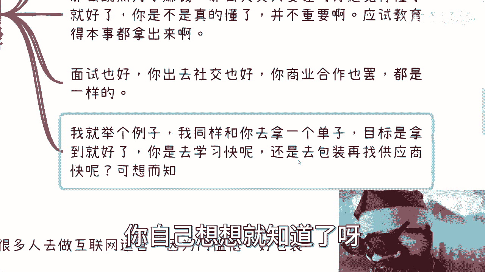

## 误区二：执着于“先懂再做”

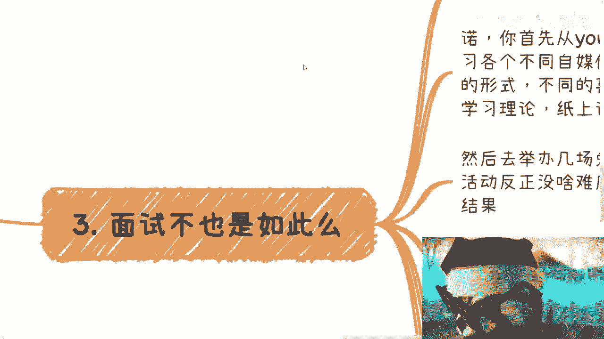

这是最大的误区，也是最典型的“工程师思维”或“电池思维”。

做一件事最大的误区在于，你认为必须自己先完全搞懂或学会才能开始。对于绝大多数不涉及造火箭卫星的领域，**“懂”本身不是目的**。

“懂”的目的是什么？是为了炫耀吗？不是。最终目的往往是为了**创造价值、获取回报（例如赚钱）**。

既然目的是赚钱或获得机会，那么本质就变成了：**只要能让对方感觉你懂、感觉你有资源、感觉你牛逼即可**。你是否真的百分百精通，反而不那么重要。

在商业竞争中，甲方爸爸选择合作方，是基于综合感知和判断，极少会现场查验毕业证书或技术细节。除了部分国企、政府项目，大多数商业场合更看重你呈现出的整体价值和可靠性。

你被应试教育训练出的“应试能力”——快速学习、总结归纳、应对考核——完全可以应用到面试、社交和商业谈判中。这些都是另一种形式的“应试”。

举个例子：目标是拿下某个项目订单。
*   **路径A**：自己从头学习所有相关知识，直到精通。
*   **路径B**：快速包装自己，找到靠谱的供应商合作，整合资源去竞标。

显然，路径B更快、更直接地指向目标。

## 实战演练：以“互联网运营”岗位为例

理论讲完，我们来看一个具体例子。假设你想应聘“互联网运营”岗位，但缺乏经验。以下是包装步骤：

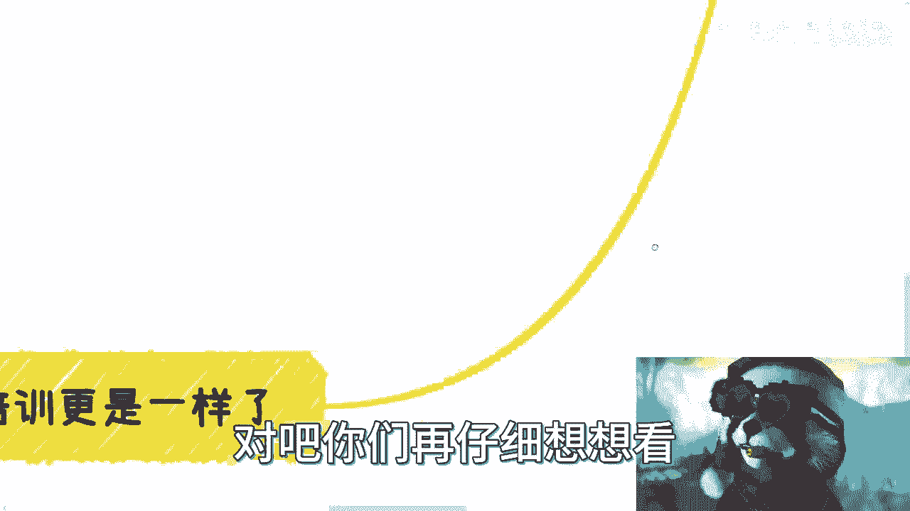

**第一步：宏观学习与理论武装**
花一两个晚上，快速研究主流平台（如视频号、抖音、B站、小红书）。
*   **研究内容**：平台特点、受众画像、内容形式（短视频/图文）、运营逻辑、变现模式。
*   **产出物**：将研究结果整理成清晰的思维导图或表格。即使你没运营过账号，也能成为“纸上谈兵”的理论家。

**第二步：创造“实践”经验**
1.  **组织活动**：尝试举办几场免费的线上或线下分享/交流活动。活动主题、参与人数、效果好坏都不重要，关键是你有“策划并执行活动”的这个经历和结果。
2.  **创建账号**：选择任一平台，创建账号并发布一两个视频或笔记。内容质量、互动数据（转评赞）同样不重要，重要的是你“有作品”。

**第三步：面试中的降维打击**
面试时，你的策略如下：
1.  **宏观输出**：基于第一步的研究，从行业高度分析各平台，阐述你的见解。这能瞬间建立专业形象。
2.  **展示过程**：提及你组织过的活动和运营的账号，展示你的“动手能力”。当被问及数据时，可以解释为“新号起步期”或“之前账号已注销，这是新开始的”。
3.  **掌控节奏**：主动引导话题，沉浸在宏观阐述和你的“实践”故事中。面试官通常没有时间深究细节，更重要的是你呈现出的格局、主动性和潜力。

通过以上包装，你从一个毫无经验的新人，变成了一个**有宏观视野、有动手意识、有项目经验的潜力股**。你是否真的精通运营？可能并不。但这重要吗？对于拿到入门级岗位的面试机会而言，**不重要**。因为你的包装已经超越了大多数只会罗列课程名的竞争者。

## 商业思维延伸：信息差与时机

以上逻辑同样适用于更广泛的商业活动（如咨询、培训）。很多人做不好商业，是因为陷入两种思维：

1.  **过度认真型**：认为必须自己完全精通才能对外提供服务。结果在学习期错过了大量转瞬即逝的商机。
2.  **过度自负型**：认为自己或自己的学历很牛，却忽略了商业中“谁认可你”才是关键。认可你的是甲方、是金主、是最终用户，而非你的自我感觉或粉丝量。

在商业中，**技术实力**重要，但这里的技术往往指的是：
*   **沟通技术**
*   **控场技术**
*   **营造信任感的技术**
*   **让别人觉得你懂的技术**

**红利期本质是时间差**。机会出现时，不是等你学懂了再上，而是谁先抓住、先包装、先切入，谁就获利。那些赚钱的人，起初往往也“懂个屁”，但他们敢于行动和包装。

## 包装的具体行动指南

那么，具体如何包装？以下是行动步骤：

1.  **选定方向**：确定你想进入的行业或细分领域。
2.  **宏观了解**：快速调研该领域的产业链、头部公司、核心术语、发展趋势。
3.  **塑造身份**：在沟通中，可以将自己定位为“创业者”、“独立研究者”或“领域观察者”。
4.  **掌握话语权**：在任何交流中，争取先发制人，用你准备好的宏观分析和个人故事（哪怕是小规模的“实践”）占据主导。
5.  **洞察需求**：这是包装的终极目标。通过短暂交流，快速判断对方（面试官、客户）究竟要什么：是技术执行者（工具人）？是资源整合者？是战略建议？还是背书？然后，将你的包装有针对性地倾斜过去。

一个能滔滔不绝讲行业宏观的应届生，比一个只会细数技术细节的20年经验工程师，在大多数商业场合中更稀缺、更受欢迎。因为后者是可替代的工具人，而前者展现了潜力和商业嗅觉。

## 重要提醒：尽早开始，持续积累

最后必须强调：商业能力的培养不是节点性的，而是线性的。

不要认为“等我需要时再学包装”。**ASAP（As Soon As Possible）**，越早开始越好。最好从大学甚至高中就开始有意识地积累人脉、尝试小项目、锻炼沟通和包装能力。

这些积累需要时间发酵。等到二十七八岁或三十多岁才想起要发展商业能力，往往为时已晚，积累的深度和广度都远远不够。

## 总结

本节课我们一起学习了应届生求职包装的核心思维：
1.  **核心转变**：从“我有多牛”转向“如何让人认为我牛”。价值取决于他人的感知。
2.  **避开误区**：不要在乎无关眼光；不要执着于“先精通再行动”，效率至上。
3.  **掌握方法**：通过快速宏观学习、创造微小实践案例、在沟通中主动输出和引导，来包装自己。
4.  **理解商业**：商业成功的关键往往不是绝对的技术深度，而是沟通、包装和抓住信息差的能力。
5.  **立即行动**：商业思维的锻炼宜早不宜迟，需要长期的实践和积累。

包装不是欺骗，而是一种基于策略的自我展示和资源整合。它帮助你更有效地连接机会，在现实世界中站稳脚跟。