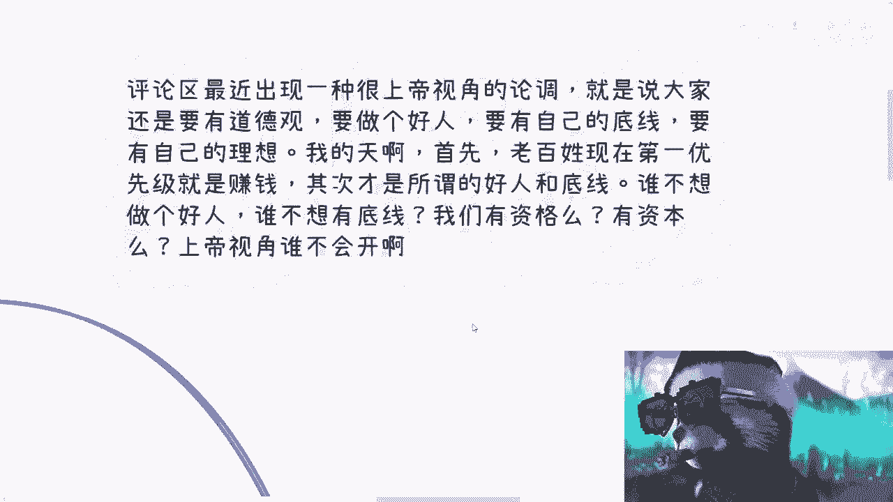
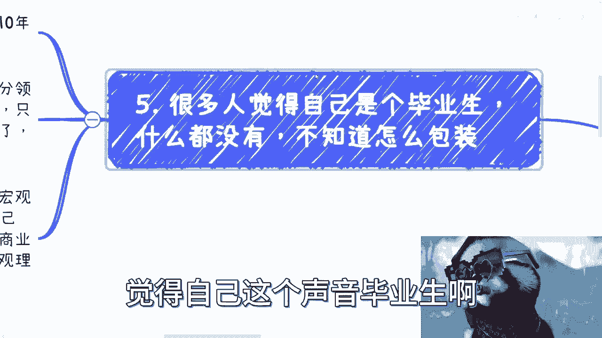
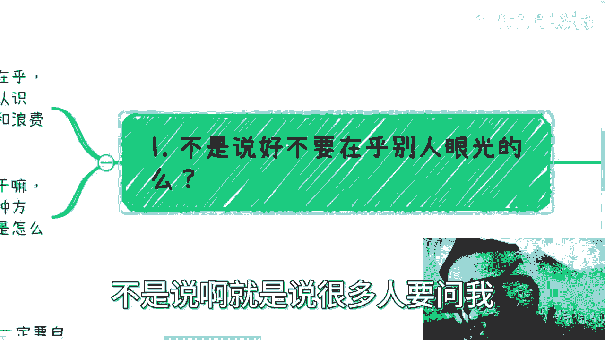
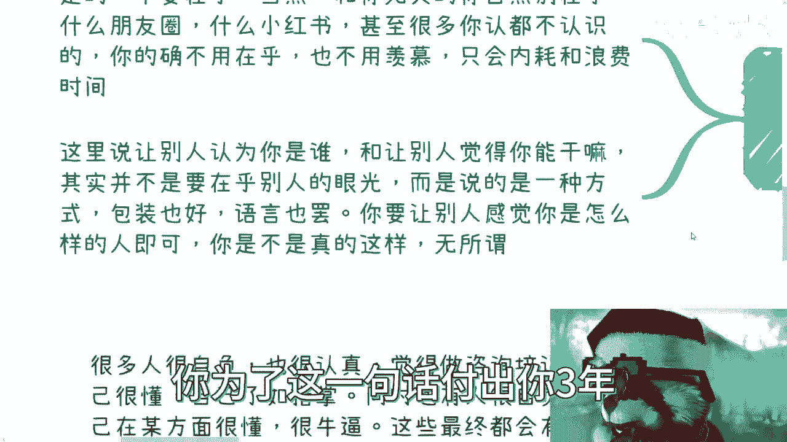
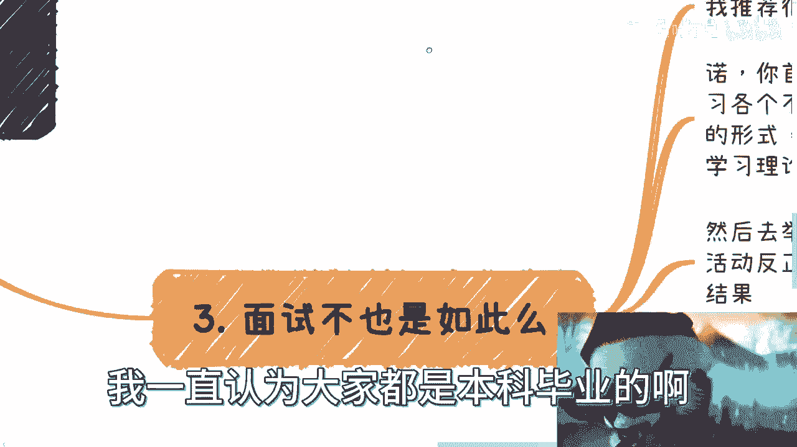
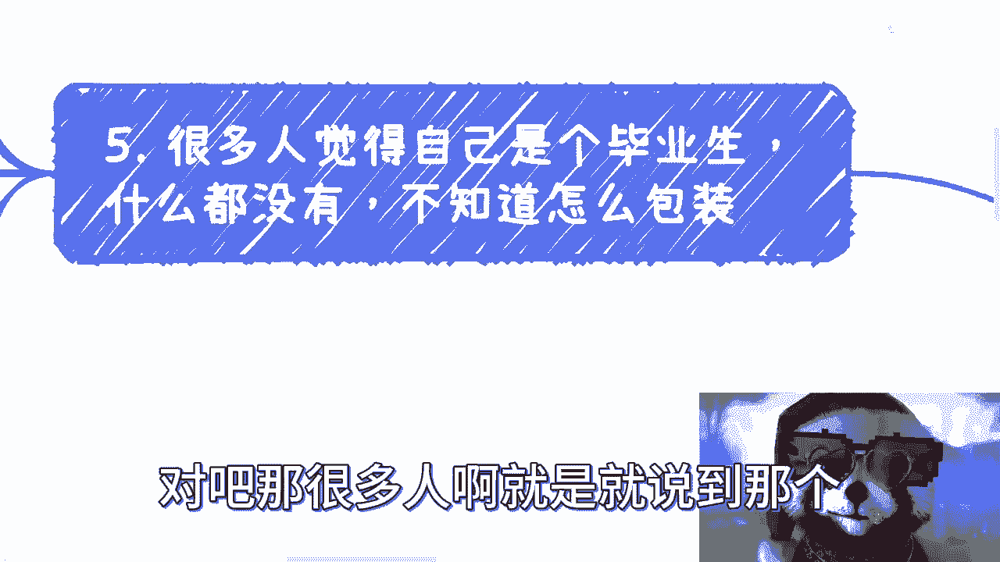

# 应届生如何包装：你多牛逼完全不重要，重要的是金主爸爸觉得你牛逼 - P1 - 赏味不足 - BV1bj411z7e2

好大家好啊，这个首先啊最近有一个很神奇的论调，我来跟你们说一下啊，评论区呢最近出现了一种很上帝视角的论调啊，就是说大学呢还是要有道德观啊，要做好人，要有自己的底线啊，要有自己的理想，没毛病啊。

谁不想有呢，是不是我的天呐啊，当下这种情况，我为什么讲这么多视频对吧，因为什么，因为老百姓现在第一优先级就是赚钱，你跟我谈好人，你跟我谈底线。

我不想有吗，还是你不想有，谁不想有，我就问我们有资格吗，我们有资源吗，对不对，真的就我就觉得好笑，你知道吗，就就有些人我跟你讲，现在我就直接拉黑了，我懒得说啊，就懒得说啊，然后呢就关于很多人在问啊。

这个毕业生啊，我怎么包装，我跟你讲啊，首先要记住啊，你是谁，你能干嘛，不重要啊，你自己觉得你多么牛逼也不重要啊，重要的是别人觉得你能干嘛，你是谁，别人觉得你牛不牛逼就重要，结束了好吧。

首先呢我在这个地方先说一点啊。

我说很多人呢觉得自己这个声音毕业生啊。

什么都没有啊，不知道怎么包装，我跟你讲啊，我很抱歉的告诉你们呃，中国的基本盘啊，因为大家很多人被教育出来，他是只知道读书啊，只知道打工，那也就是说我跟你讲，很多人工作就算几年后。

10年后你也是什么都没有，你以为有了吗，你也没有啊，啊你别老是说你应届生没有，你搞得好像你以后会有一样的，不好意思，你也没有啊，首先啊第一点我们先回过头来讲啊，不是说啊就是说很多人要问我。

他说不是说好啊，不要在乎别人眼光的，对吧啊，对没毛病啊，这个这个challenge我接了啊，首先第一啊是不要在乎。

当然你不要在乎的是跟你无关的那些东西啊，比如说什么朋友圈啊，什么小红书啊，什么有的没的啊对吧，都乱七八糟的东西啊，快手啊，抖音啊，没什么好在乎的，人家一天赚1000万跟你都没关系对吧。

甚至我跟你讲很多你认识认都不认识的对吧，你的确不用在乎对吧，包括我今天告诉你妈的，有人打新股，有人炒股对吧，这他妈跟你有什么关系呢，对不对啊，我跟你讲啊哈，我昨天看了那个我跟你们讲。

我昨天看了那个生化危机四的，那个叫什么主角的这个中文配音啊，含妈量特别高，哎呀这搞得我现在含妈量也很高啊，呃也不用羡慕对吧，你只要你你你羡慕了，你在乎了你只会内内耗跟浪费时间，对不对，好。

那我们这里说的让别人认为你是谁，让别人觉得你能干嘛的意思是什么呢，其实呢也并不是说要在乎别人的眼光，而是说呢是一种方法，一种包装，你可以认为是一种，你可以认为是一种对别人的PV啊。

随便你怎么理解无所谓啊，呃你这种PA呢，从语言上，从包装上，从你的气场上啊，从各个方面其实都可以啊，你要让别人感觉到你是怎么样的人即可，但是你是不是真的这样子，这件事情不重要，你知道吗，一点都不重要。

就是要我跟你们讲啊，这就好像很多人咨询我，他说吕老师，我去考个硕，你知道我怎么回的吗，我说你考它干嘛呢，现在出来就可以跟跟别人说，我他妈AMIT毕业了，怎么了呢，怎么了呢啊。

别人是现场让你拿出MIT的毕业证书吗，还是怎么了呢，你不就一句话吗。

你为了这一句话付出你3年，你们脑子有病吗，对不对。

唉呀好吧，这是第一点啊，我们来说第二最大的误区。

也是最工程师思维的地方啊，也就是我之前说的电池思维，我再说一遍啊。

做一件事情就是最大的误区啊，就做一件事情，你觉得你要先懂或者自己要去学习，这就是最大的误区，你明白吧，哦这也是最大的这个工程师思维的地方，对于大部分人来讲，懂不懂，你们想想看啊，我就说啊，去头去尾。

你不去造火箭，你不去造卫星对吧，懂不懂的目的是什么，你是为了告诉别人自己懂了，还是为了炫耀自己懂啊，都不是啊，你不就是为了赚钱吗，对不对，就好像很多人跟我说，哎吕老师，我要考个研，那你为了什么哦。

我要赚钱，那你赚钱为什么要考研了，你就说你要mt毕业的，怎么了呢，哦到时候签他妈商业合作的时候，难道还还让你把毕业证书附上啊，你去看看哪个商业合同有他妈这么写的，哎哟他妈服了。

真的服了气，你知道吗，嗯那么既然为了赚钱，那么其实那么你的本质是不是，只要让对方感觉你懂，或者让别人感觉你有这个资源，或者让别人感觉你牛逼不就好了吗，对不对啊，你告诉我你是不是真的懂得怎么样了。

你觉得重要吗啊我就这么跟你们讲好了，今天对吧，我跟别人去一起去竞标，打个比方对吧好，然后他他妈的在那边吹，说他妈的老子MPMMIT毕业的啊，我在这边说哎我不行对吧，我我我这边都是垃圾对吧。

我这边就哎反正就唯唯诺诺对吧，就就就就老实点说啊，这个说话说不离气的，说不清楚的，对不对，好最后甲方爸爸把这个case给出了，签合同了，怎么滴了呢，重要吗，重要啥啊，那那金主爸爸难道和木炭来。

给我MT7毕业证书拍在这有吗，那没有的呀，你除了给国企，央企，除了给政府，剩下中国土地上面这么多生意，谁他妈关心这个东西啊，奇了怪了啊，我跟你们讲啊，大家要是应试教育对吧。

被PV的很很成功，那他妈的就把应试教育的本事都拿出来啊，对不对，你面试也好，出去社交也好，你商业也好，他妈都是应试啊，你倒是拿出来吗，这些本事对不对对吧。

我就举个例子，比如说我同样给你去拿个单子对吧，目标目标是什么，目标是把这个单子拿下来，对不对，那我就问嘛，你是去学习来得快还是去包装，再去找供应商来的快，你自己想想就知道了呀。

对不对，那我以前一直说，我一直认为大家都是本科毕业的啊。

或者说至少9年制义务教育出来的啊，这点逻辑性难道没有吗对吧。

那三对吧，面试也是这样子的，你比如说我给很多人做咨询，我推荐很多人都去，就实在没办法，没有排啊，我说你就去做互联网运营，为什么，因为门槛低啊，好包装啊，怎么包装啊。

比如说你首先先存YOUTUBE或者B站或者别的网站啊，先学习一下，比如说视频号，抖音号，快手对吧，B站啊，这整个媒体平台的方式对吧，包括这些平台他的受众年龄分布啊，他的这个产品的逻辑对吧。

就是视频为主呢，长视频为主呢，短视频为主呢，图文为主，文字为主呢对吧，文案怎么样子的对吧，小红书里面各种各样的这种小气球啊，小图案啊对吧，你怎么用不同喜好，你你可以都没有做过，你可以这些平台都没有账号。

哎但是你可以学习理论，谁跟你讲，你不能学习理论了，对不对，你只上谈兵组可以吧，对吧啊，我我就跟你讲，你花两个晚上大概看一下视频，你做成表格出来，你不就都会了吗，对不对，然后我再跟你说。

你再去基本几举办几场免费的活动对吧，你比如说该该活动形式，该发发互动吧，上该发发对吧，发完之后有没有人来，不重要啊，who care啊，对不对啊，举办活动没什么难度的呀，你就往那一杵对吧。

然后两边啊大家来交流交流有什么难对了，我跟你讲，重要的不是过程，就很多人要再面试了，哎呀我这个主题是什么，哎呀别人来了不好，印象不好怎么办，哎呀我不知道讲什么东西，哎呀我社恐重要不是不重要的。

你要有这个结果，你知道吗，好这是第二步，第三步，你再选个平台，随便做个账号，做一两个视频，不要关注互动量，无所谓对吧好，那么接下来我就跟你讲，你去面试，你要从宏观角度，因为你已经了解了每个平台的特点。

对不对，了解了每个平台的广告投放模式跟电商模式，那么你就从宏观角度一顿输出猛如虎，你做不做过，对方care吗，不重要，为什么，因为你只要带着节奏，对方根本就没有没有心思，也没有这个能力，我跟你讲。

面试官他妈的也不就是个人吗，有什么区别呢，对不对，我跟你讲，从商业角度来讲，他们都是垃圾，为什么，因为你在降维打击就这么简单，你要觉得你没有降维打击，那你就是垃圾，对不对啊，然后你又做你又做过活动。

你还做过自己的账号，还做过一两个视频，对不啦，你已经超越很多人了，你甚至超越对方，并没这个这个面试官了，因为他只有这家公司或者几家公司的，这个这个工作经验，而你对宏观有了解，你多牛逼啊，就足够了呀。

怎么滴了呢对吧，好人有很多人又要说了很多，吕老师，他说哎吕老师啊，那这个不行啊，他说你这个视频对吧，都没互动量呢，都没转评赞呢，都没怎么样的啊，这个面试时问起来怎么说，我就这么跟你讲吧。

你面试本来时间就紧张啊，你给他看一下啊，这个你本来宏观上面一顿输出猛如虎了对吧，然后你给他看一下，哎我也做过了对吧，就是刚做的啊，最近啊就是这个这个之前的话，这个你就随便吹吧。

你就说我之前做了个账号注销了对吧，我最近重新种了，做了一个，我就这么问，你有几个人能在面试的时候，仔细的再来看你这个东西，你有几秒钟的时间给他去看，对不对对吧，而且你要这么想，在他面试的，比如说几百人。

几千人当中，能有几个人像你这样拿得出产品的，就就像你去一个设计师面试一样对吧，就是说你拿得出来，你哪怕拿出来拿出来，这个这个这个是这个产品是坨屎，你也比别人拿不出来的人来的好，就这么简单，怎么滴呢啊。

那么我们说看以上这些东西都是纸上谈兵的，你要会吗对吧，那我就问你，你但凡这些东西做完了，你可能一两个礼拜不用一两个礼拜，一个礼拜你就能做完了，那我就问你，你说你懂吗，你肯定不懂啊对吧，你可能啥都不懂。

你可能还是盲人摸象，你对自媒体，对整个的运营逻辑一窍不通，但我就问你，这重要吗，不重要，为什么，因为你是来验证你通，你懂不懂吗，不是啊，是来面试的，对不对，不就这个逻辑嘛对吧，你们再仔细想想看对吧。

包括啊我跟你讲，很多人做咨询培训更是一样的对吧，就我跟你讲，人有两类，第一类是很多人很自负啊，第二类是他也很认真好，那么我跟你讲，觉呃就是他很自负，就觉得我自己很牛逼啊。

包括我身边的朋友也觉得我很牛逼啊，那么他很认真的，就是说，他觉得我今天如果要去给别人讲一个东西，我一定要自己很懂，我要了如指掌对吧，那我跟你讲，无论是哪类人，商业上都是做不好的，而且不是做不好。

就根本就他妈一塌糊涂，为什么，因为你很认真，你要很懂，那么我就可以告诉你，你在你学习的时候学习不要时间吗对吧，吹毛求疵不要时间吗对吧，那么在你认真学习的时候，我告诉你，你就会错过大量的商机，为什么。

因为商机是什么，就是信息差，信息差是什么，就他妈是时间差，就这么简单呀，哦老师我们在抱怨，唉呀哎呀我们怎么没有这个机会，哎呀人家怎么有这个红利期啊，什么都会说的呀对吧，吕老师，我们怎么掌握红利期。

红利期是什么，红利期就是他妈你要去干嘛啊，红利期不是今天我把一个机会放在你面前，你说哎吕老师，我不懂谁他妈让你懂吗，你以为他妈的赚钱那些人懂吗，懂个屁哎呦，我真他妈服了服了天了，真的是你知道吗啊。

那么同时别人就算有K4来找你，我跟你们讲这种人我碰到很多的啊，他会因为感觉到自己不是很懂啊，然后推辞说哎呀这个东西不行，哎就是我就这么跟你讲啊，我觉得他已经很懂了，然后他就会觉得哎呀。

这个东西我好像还不是很理解，我真的想他妈大耳光大耳光，他妈扇他脸上，你知道吧，他妈的把他那拖鞋直接拍在脸上，对吧啊，就是他会进一步的去浪费机会，你谈何赚钱，谈何赚钱啊对吧，哎我跟你讲，最烦的就是这种。

就是每次有很多人就跑过来，你知道吗，我以前到现在一直很多人这样的，就跟我说啊，陈老师，我想赚钱呢，我说好啊，有机会的，然后啪一个单子过来了，我就去找他，哎，我说这个东西跟你的技术站不是蛮蛮符合的嘛。

对吧，你可以讲讲哦，这个我可能不行啊，这个东西我不太懂，我说哥这你都不懂啊，你要说不懂他妈的，我说我身边能有几个人懂啊对吧，然后他就在那边乌里马里乌里马里，说半天有意味了，对不啦，我跟你讲。

我以前他妈的也就是人好啊，也就是说都是给大家这种机会的，我跟你讲，我现在不会了，你你要这样子滚，那爱他妈谁合作谁合作，反正我不合作，对不对啊，然后还有一类人呢，就是你很自负什么呢，就我跟你讲。

那就更有问题了，因为你要记住你牛逼不牛逼，不是你说了算的，也不是你学历说了算的，你这个学历没卵用的啊，商业上没什么谈学历的地方啊，也不是大众说了算的，也不是你的粉丝说了算的，没有用的。

你今天就算是个500万的那个up主，或者是是个是个博主，没卵用的，你知道吗，谁说了算是你的甲方爸爸说了算，是你的金主，爸爸说了算是你的最终受众说了算啊，但凡你甲方爸爸不认可你，最终受众说讲了摄像坨屎。

你再是人才也没用，就这句话懂吗啊，很多人认为咨询顾问培训到最后靠的是技术，对啊这句话是对的，没有错，是技术，但不好意思，不是你们说的那类技术是什么，是沟通，是气场，是控场，是风格，是你的沟通交流的能力。

以及你要让别人觉得你很懂，你明白吗，你懂不懂不重要，你要让别人觉得你懂啊，也就是说你是不是真的牛逼也不重要，别人觉得你牛逼就可以了，对吧OK吗，就这么简单哦，也就是说你只要你的金主爸爸认可你。

只要你的客户认可你不就好了吗，但是问题是你反过来想想，金主爸爸认可你跟客户认可你，你再反观你所在的领域啊，我不说哪个领域啊，比如说有很多人觉得我在互联网是，但是别的领域我也都做过啊。

金融医疗哪个东西我没做过对吧，你们反观别的领域，真的做的好的，做的我不说，Top one，Top two，前30，前50，前100的以及那些就是比如说你们可能看到唉，这些人流量做的不错的。

或者KOL或者说很知名的，是真的，因为技术好吗，你们自己去看看，对未来有用，木兰没有用的呀，对吧，我跟你讲，做得好的无非是两类人，第一类人是他很会搞事情，他很会来事情，他很会营销，他的关系到位对吧。

这第一类第二类是什么，就是他的他个人能够让别人感觉他很懂，就结束了，这不就是商业吗，对吧。

那很多人啊就这就说到那个回到点题啊，嗯我很抱歉告诉大家对吧，很多人呢工作多年之后也是没有的，这很正常啊，都工作了，你能有什么东西啊，所以包装怎么包装呢，就是你选择好大方向，选择好细分领域。

然后从宏观角度去了解，你就说自己是个创业者对了，只要你能在沟通当中啊，掌握沟通的主要话语权，你抢先啊，然后把自己的这个介绍一顿，操作猛如虎，你介绍完了其实就差不多了呀，我跟你讲，这就像什么，你知道吗。

这就像你打星际争霸二对吧，很多人可能没打call啊啊我给你们解释一下啊，这个就像你跟别人打游戏啊，你说我满地图都是分基地对吧，但问题是有没有分基地，别人知道吗，不知道为什么。

因为别人在真正把这个地图完全探开来的时候，他不在坦克来之前，他不知道你到底有几个分基地啊，但是你怎么让别人去感觉你很有分，你有很多分基地呢，你在每个矿旁边去造感应塔啊，让别人感觉卧槽这地方牛逼啊。

然后每每个地方都有个感应塔，就让对方感觉卧槽，每分每个矿上面都有你的基地一样的道理呀，对不对，那你要首先先威慑住对方啊啊那我早就说过了，我跟你讲，一个应届生，如果他可以滔滔不绝的去从宏观角度介绍自己。

有另外一个人是20年工作经验，在那边这个介绍自己技术多么牛逼对吧，你说我甲板写了很多年对吧，我spring对吧，我Python我我啊写了很多时间对吧，我能解决很多的牛逼的问题，我跟你讲，所有的商业。

不管是这个有经验的，没有经验的，他都只会倾向于前者，为什么，因为一个技术牛逼的人都是工具人，这种工具人市场上很多，整个中国14亿人工具人还不好找吗，对不对，但是你一个年轻人要对宏观东西有了解。

同时他还能滔滔不绝地讲出来，这种人很稀缺，你懂吗，啊所以啊所以啊就是说我们再回到这个地方，就是做任何的事情，我为什么，因为你会发现，就是这个包装也是商业和商业思维当中，很重要的一环。

就是你得清楚对方要什么，你知道吗，你要为什么我跟大家说要那个多认识人啊，就是因为你最重要锻炼出来的结果是什么，就是一你很会包装，二你的沟通滔滔不绝，一顿操作猛如虎，三你坐在那儿，我给你5分钟沟通。

你能够摸清楚对方到底要什么就结束了对吧，你比如说对方到底是要钱还是要背书，还是要还是要所谓的专家对吧，还还是还是要所谓的供应商，还需要所谓的工具人啊，还需要所谓的这个渠道方，分销方，他要什么。

你不要老是指望对方来讲，不可能的啊，不现实的，就说白了你要是这点我们这个令，你要是这点拎不清，或者你要是这点察言观色没有，那我跟你讲商业，你也别做了，你知道吧，好那么在这个地方呢，我顺便再提一嘴啊。

就是说很多人呢他觉得做一件事情，他是一个典型，就是他是个节点事情，节节点状的事情，并不是就很多人会觉得他说哎我现在不着急啊，你等我以后想要做商业再做吗，我跟你讲来不及的，你明白吧，就上你要真的想做商业。

真的想要自己为自己赚钱，你就是越早越好，我们称之为叫什么ASAP对吧，As soon as possible，就你最好他妈高中就开始，大一就开始你出去积累呀，出去认识，为什么，因为商业这件事情。

你积累的东西越多，时间越长，你未来才有可能起步，才有可能真正的去做出来一些东西，而不是属于那种说哦，我我25了，26了，二十七二十八了，30几了啊，我突然某一天想起来我要做的好，我出来干了啊，出来浪了。

没用的哦，来不及了，我跟你讲，真的来不及了哦，唉好吧，希望这个能明白的啊，这个自然能明白啊，这个不我希望大家不明白的也别来杠，你来杠一下，我拉黑大家就都浪费时间，何必呢，对没必要啊，啊好吧。

那就这么着吧啊这个大家啊，这个有什么职业规划或者手上有什么牌的啊，不知道未来怎么打的，也不知道商业怎么走的啊，你们也可以整理好人或咨询我好吧，我3月份到现在好像唉反正好几百人。

基本上基本上资源下来都还不错好吧。