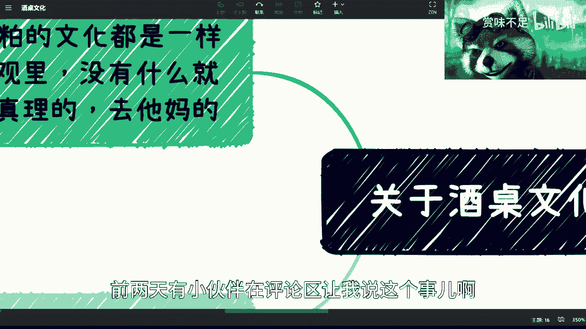
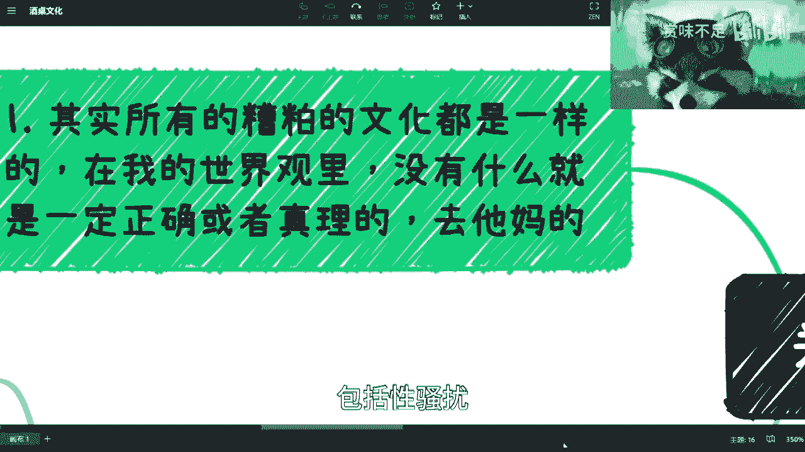
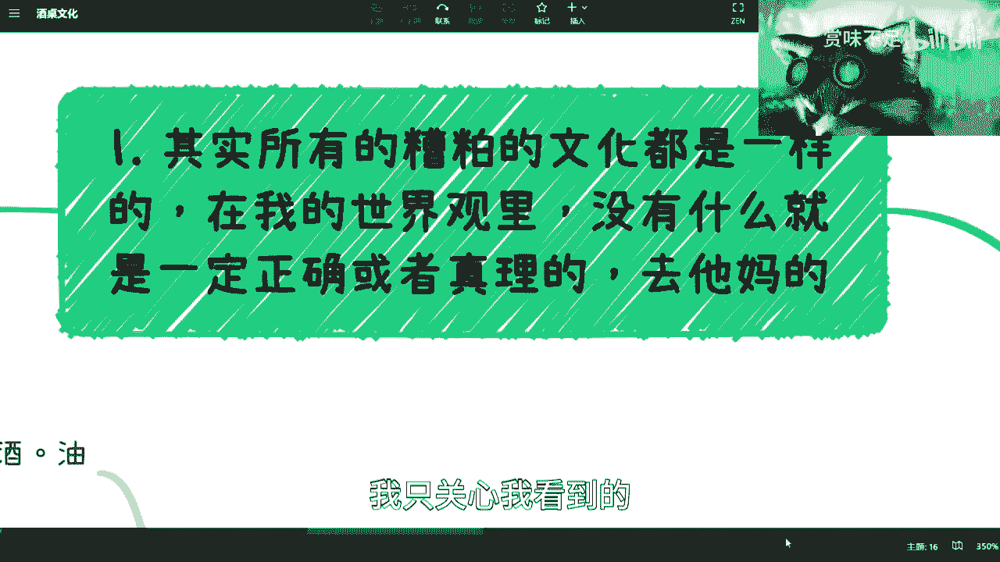
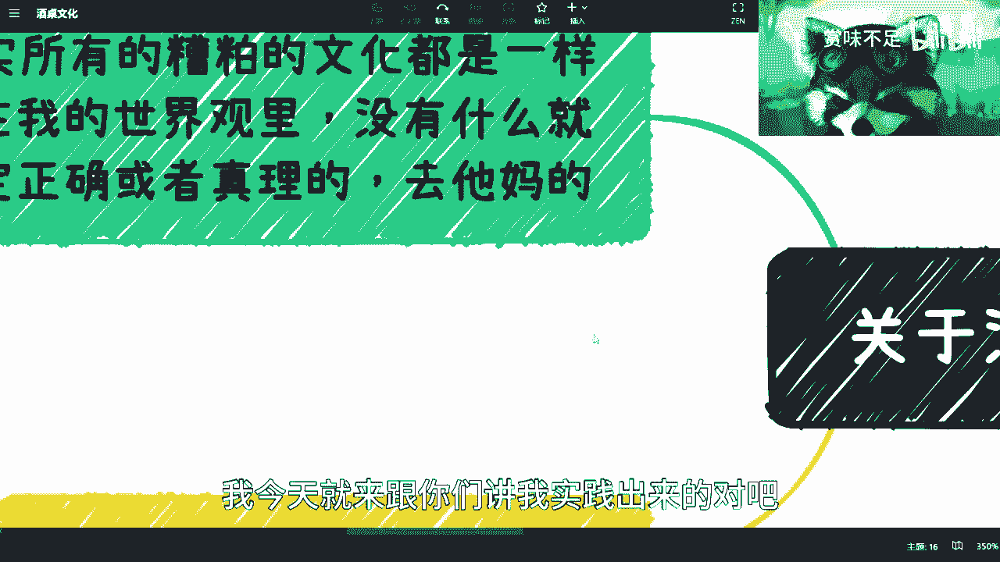
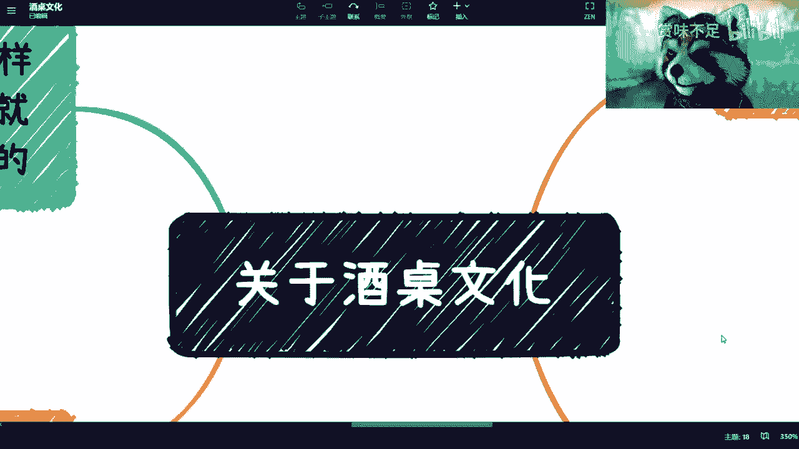

# 课程名称：酒桌文化批判与个人价值观建立 - P1 🍷🚫

## 概述

在本节课中，我们将探讨一个常见的职场与社会现象——酒桌文化。我们将分析其本质，并讨论如何建立独立的个人价值观来应对此类压力。课程的核心观点是：许多传统陋习与个人发展无关，关键在于培养自己的判断力。

---

## 酒桌文化无需过度在意

有观众提出希望探讨酒桌文化。我认为这件事很简单，结论是：不必过度在意。

作为一个生活在2023年的年轻人，去在乎一种过去的糟粕文化，这并非进步，而是退步。无需为此纠结。

当然，许多人会说身不由己，因为工作、领导或合作方的关系不得不参与。这种说法非常荒谬。

---

## 所有糟粕文化的本质相通

首先，所有的糟粕文化本质是相通的，酒桌文化只是其中一个例子。其他例子还包括职场性骚扰等。

其次，在我的世界观里，没有什么是一定正确的绝对真理。那些所谓的“俗话常说”、“古人云”或各种“真理”，大多与我无关。我只关心亲眼所见和实践验证的情况。

---

## 个人价值观的建立与“被PUA”现象

一个人成长过程中，很难不被“PUA”（精神操控）。大多数人都是在被灌输的环境中长大的。

父母、老师、朋友甚至年长者，常常会告诉你“事情应该这样做”，却不解释“为什么”。他们给出的往往是脱离复杂背景和上下文的孤立结论，听起来有道理却毫无用处。

因此，觉醒并建立自己独立的价值观至关重要。不要盲目接受听到的所谓“真理”，它们大多不适用或是虚假的。

---

## 亲身经历：酒桌文化的荒谬实例

关于酒桌文化，我经历过不少荒谬的事情。以下是几个例子：

*   **实例一：强行劝酒**
    在青岛，一位创业的女性朋友与领导吃饭。她明确表示不会喝酒，领导却用高脚杯将红酒倒满，甚至溢出来，一晚上强行让她喝了三大杯。

*   **实例二：复杂的“规矩”**
    在潍坊，当地领导接待时介绍“主人坐主位，左一、右二按顺序敬酒”的文化。当天恰逢“敬酒七”，即便以茶代酒，喝下的茶量也让人难以承受。

*   **实例三：无处不在的场景**
    公司团建、婚礼酒席、销售入职“破冰”、团队聚餐……类似场景数不胜数。许多人选择忍气吞声，因为顾虑工作和领导关系。

---

## 核心观点：拉长生命线，勇敢拒绝

我的核心结论是：把你的生命线拉长来看。

你这辈子只在这家公司工作吗？这位领导会是你一辈子的领导吗？拉长时间维度，你会发现这些事都不值一提，都是荒谬的。

该拒绝时就拒绝，该举报就举报。不要惯着他们。在大公司，这种现象可能更甚。

生物有一种倾向：**只要你不明确拒绝，对方就默认你同意**。不要纠结对方“为什么这么觉得”，没有为什么。该拒绝时就要清晰表达。

---

## 思想根源：被灌输的“三观”与独立判断

问题的本质在于，我们的“三观”（世界观、人生观、价值观）常常是被外界灌输的。

*   **家庭**：父母用过去的经验（如“铁饭碗”）指导今天的职业选择。
*   **学校**：某些老师脱离行业一线，却指导专业和就业。
*   **职场**：领导通过贬低（“你不行”）或画饼（“年底升职加薪”）进行PUA。
*   **情感**：恋爱中的各种精神操控。
*   **商业**：割韭菜的机构用煽动性故事（如“我曾破产，现又身价上亿”）兜售课程。

我接触到很多人，感觉像是在和“复制人”对话。他们没有自己的三观和判断力，所有认知都来源于“别人说”，缺乏任何依据和调研。

---

## 总结

本节课我们一起探讨了酒桌文化这一现象。

我们从其具体表现入手，分析了其作为糟粕文化的本质。进而讨论了个人在成长中“被PUA”、被灌输观念的普遍性。

最后，我们强调了建立独立价值观和判断力的重要性。**真正的合作关系基于利益共赢，而非酒桌情谊**。其公式可以简化为：
**有效合作 = 共同利益 × 专业能力**，而**不等于 饮酒量**。

说到底，这不仅仅是文化问题，更反映了独立思想教育的缺失。希望你能勇敢地对陋习说“不”，并持续构建属于自己的坚实价值观。