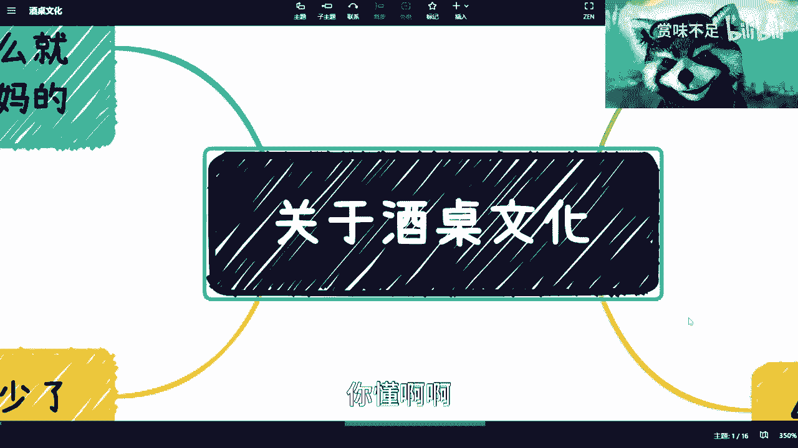
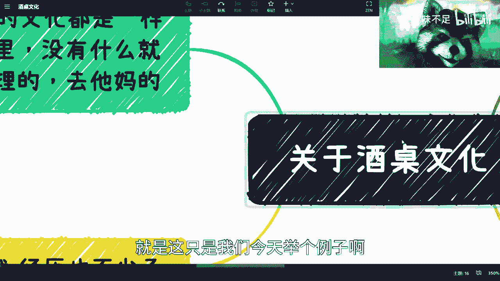
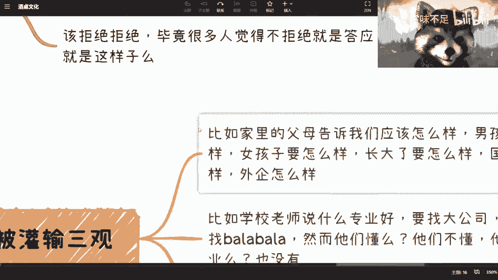
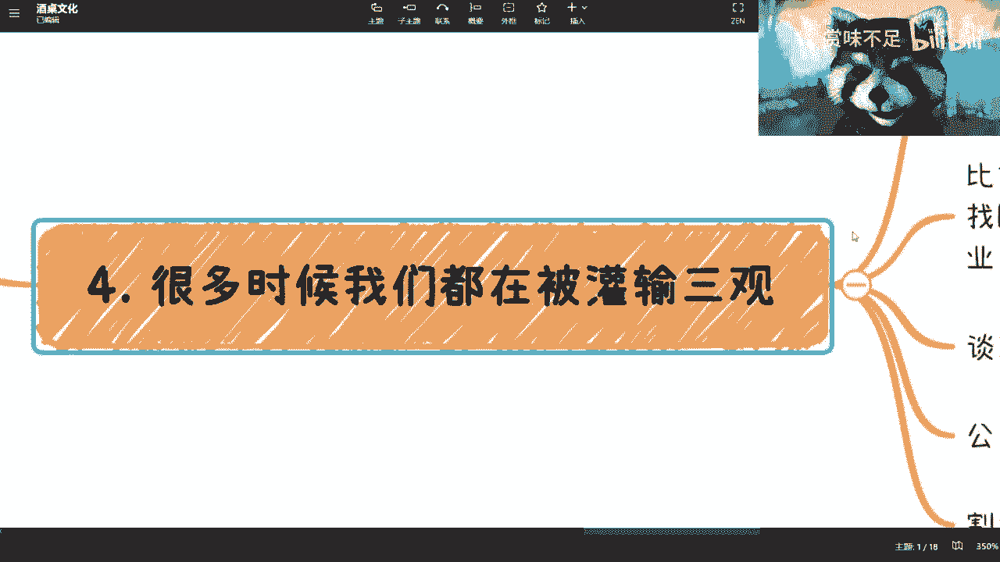

# 应我们小伙伴要求，我来谈下酒桌文化 - P1 - 赏味不足 - BV1Ka4y1u7bh

好啊大家好，那个前两天有小伙伴在评论区。

让我说这个事儿啊，我其实当时还没想啊，他一说呢我觉得嗯也行啊，也不是不能讲啊，呃首先是这样子的，这个事儿呢我觉得也很简单，我先说结论啊，结论就是啊不用太去关心，有什么好关心的呢，就是就很简单。

你比如说你现在对吧，一个活在2023年的人对吧，还是个年轻人，你一个活在2023年的年轻人去care，去在乎一个以前的一个糟粕的一个文化对吧，那我觉得对吧，这不是进步，这就是退步，没什么好纠结的对吧。

你要说当然了，也有很多人说啊，他说那我没办法对吧，我出公司无奈对吧，我领导对吧，什么我合作方，我跟你们讲多他妈bullshit，你懂啊啊。

我跟你们讲，你不懂啊，你不懂，我来给你讲一下啊，是这样子的，第一呢我跟你们讲，所有的这种糟粕文化都是一样的，不单单是这一点啊，就是这只是我们今天举个例子哈。

我我不可能把所有东西都列在这对吧，包括性骚扰。

是不是，那这是第一个，第二个呢，你说没什么，我跟你讲，在我的世界观里，我的啊，你们可以参考啊，在我的世界观里面，就没有什么是一定正确或者真理的，就是BULSHIT，你懂吗，就是就是不要来跟我讲以前对吧。

俗什么俗话说着说得好，什么什么古人云对吧，或者说什么什么还还有什么的，反正就是各种各样的真理，还有滚跟我有什么关系啊，对不对，我只关心什么。

我只关心我看到的，我只关心我实践出来的情况对吧，我今天就来跟你们讲我实践出来的对吧。

情况是什么，那这是第一个。

第二个呢啊我觉得呢就是你一个人啊，在这个过的过程当中，包括我一直在这个合集里面，想给大家传达的一个事情是什么呢，就是一个人从小到大对吧，你你说谁没有被PUA过，很正常，对不对，我跟你们讲。

我觉得我们大部分人都是被PUA长大的，为什么呢，因为很多时候你都是被灌输的，就是被你父母啊，老师啊，身边的朋友啊，不对吧，包括一些年长的人就很神奇，你知道吗，就是他会告诉你这个东西应该这样子。

但是他不告诉你为什么这样子，你知道吗，然后讲的东西吧都是那种就是就是怎么说呢，就是那种啊听上去很有道理对吧，但是呢他他就就好像什么，就好像比如说一张地图对吧，是一个10×10的地图，他跟你讲。

他只跟你讲这个1×1这个小方块对吧，还有还有这个十三十，还有99个小方块，他不跟你讲对吧，就是明明有一个更更很很好的，或者很复杂的一个上下文对吧，或者有有一个很复杂的历史背景在那边，他不讲的对吧。

他只跟你说一个结论，那这个结论很多人听的IG觉得哎呦，好像是个真理，但其实没卵用，你知道吗，我跟你们说，所以这个时候我今天早上微博都写了对吧，他们就跟我说，他说你号是不是不要了，我说唉就到再说吧是吧。

他说我我跟你讲，就是需要觉醒，你需要有自己的独立的价值观再去判断，你知道吧，别老是别老是就觉得好像哎呀，这个这个听了很多话对吧，就是好像很多真理没没卵用啊，我跟你们讲，而且大部分其实要么是不适用于你们。

要么就是假的啊，嗯第二个呢我跟你们说啊，就酒桌文化这个事呢，我经历也不少对吧，我给你们举很多例子，比如说第一我以前在青岛的时候啊，晚上对吧，我有个朋友有个小姑娘啊，她创业的是吧，然后跟一个领导吃饭。

当时是个书啊，这个我也不方便讲，反正跟领导吃饭啊，然后呢哎我跟你讲油腻的不要不要的，然后我跟你们讲多么油腻啊，就是人家我我那个朋友都已经说了，我不会就他不会喝酒，你知道吗，那个领导呢还给他就是喝红酒吗。

那领导呢还给他那个高脚杯，高脚杯呢，就你刀喝酒，那你意思一下也行啊，对不对，那大家喝吗，你就喝喝，就是说虽然我朋友不会喝，但是他还是愿意硬着头皮喝嘛对吧，那你意思想嘛可以了，他不要啊。

那个领导人就给他强行对吧，就是那种高脚杯倒满啊，就就就扑出来的那种对吧，然后倒满，然后你想啊，就是一晚上起码喝了三大杯有意义，本来没有意义的呀，你知道吗，这是第一这第一个啊，第二个是什么呢。

还有一次我去潍坊吧，潍坊哎我跟你讲更牛逼了，我跑过去，然后领导领导接待我吗，领导跟我说，你知道吗，我说我不知道，他说我跟你讲啊，我们这边是有这个文化的，文化呢就是什么这个主人对吧，住在坐在这个地方的。

然后什么左边左一对右二对吧，左三干嘛的对吧，要按照这个顺序喝的对吧啊，我说嗯啊，然后呢他那天跟我讲，他说正好是在潍坊的这个敬酒七，哎我跟你们讲这个敬酒七呢，我还真第一次听说啊，敬酒七。

但是呢那天不是敬酒七吗，那不是以茶代酒嘛对吧，我就这么跟你们讲吧，以茶代酒对吧，就那茶喝的我都顶不住啊，你不要喝酒了，那更不得了，哈哈哈哈啊，甚猛，我跟你们讲是猛，然后第三个呢我跟你讲啊，还有什么呢。

就是什么公司团建啊对吧，这个这个婚礼酒席啊对吧，很多很多了，哎这就公司团建更多，你知道吗，还有什么什么公司销售第一次入职对吧，什么破冰，我喝酒的，然后呢什么啊，那个那个那个同一个团队聚餐的对吧。

那也会很多很多数不胜数，我跟你们讲这种事情呢，还是那句话，就是我觉得多么肯定多的对吧，很多人也就是忍气吞声，觉得哎呀我还要在公司做下去对吧，还要这个他是我领导对吧，或者怎么样怎么样，我跟你们讲。

我我先在这个地方把这个结论说了啊，这事是什么呢，这事儿就是你你把你的生命线放长，的这辈子不跳槽了吗对吧，你你领导这辈子在这地方是你一辈子领导吗，我跟你讲，你就把你的生命线放长，放长之后。

你会发现这些事都他妈不叫事儿，都他妈是BULSHIT，你知道吧，你该举报，该只举报该怎么样就怎么样，你知道吗，的惯着他们，你懂吗啊，我跟你们说，大公司越是这样，越是大的公司越是这样子啊。

你就就就你们不知道，我跟你们说，唉，然后还有呢，就是我当时在北京工作了有11个月吧，小一年对吧，然后在北京那段时间呢，我跟你们讲多，就是就是每次对吧，就是吃饭啊，就是就好像不喝酱香型对吧，哎53度。

63度的，我都忘了，你不喝酱香型吧，就好像他们活不下去了，你知道吧，就是那种就那种不管吃什么啊，反正就是得喝啊，不管你啊，我真的也是服了啊，然后呢我觉得这件事情本质是什么呢，我这么跟你们讲吧。

经过了我个人的实践啊，我以这个结论告诉你们，不管是看感情业务合作任何东西，你酒桌上的这些事情啊，anyway啊，就我这边写的任何的事情，这些事情本质上跟你觉得的，就就你觉得的那些就是那个那个因果关系。

就就那个事情当中没有任何因果关系，什么意思呢，就是说有很多人会觉得啊，就是说啊我这个喝了喝了，我这个单子还能成，你知道吗，最大的我跟你们讲，我最疑惑我就是就是叫什么电电地铁，老人看手机，你知道吗。

就最让我困惑的是什么，就是什么时候得出这个结论的啊，我跟你们讲，喝和不喝要合作，终究还是会合作不合作，喝到死，你也不会合作，你明白这个道理吗，啊我觉得很多人真不明白，你知道吗。

就好像觉得哎呀这个喝了是兄弟兄弟妈个蛋啊，兄弟谁他妈跟你兄弟啊，我跟你们讲，兄弟只有一个是赚过钱的啊，不是喝过酒的，不好意思啊，这第一个第二个呢还有什么呢，就是那种就是说什么。

哎呀我我我我不能举报他对吧，我不能好像怎么样对吧，万一这个被开了对吧，或者怎么样呢，你搞得好像喝了以后不会开一样啊，你好像你搞得你喝了以后，就是好像就是这个这个公司上面很多东西，他能一手遮天一样的。

有完了没有的呀，哎呀我跟你们讲这种事情都是一样的，你知道吗，就是他只是一个个人行为，跟你们所想的那些事情没有任何的关系，你知道吗，这是第一点，第二点呢我跟你讲，该拒绝拒绝，你知道吧。

别人那种就是说叫什么哎，就是那种半推半就对吧，就是我跟你们讲，因为是这样子的人，这个生物啊，我可以说99%啊，99过分了，95%吧对吧，那我跟你们讲，就是觉得你只要不拒绝，就是答应就这么简单啊。

你你不用我跟你们讲，你们不要去想，你们千万不要去想一件事情是什么，就是为什么他这么觉得没有，为什么对吧，你就跟你就像问我这个人为什么这么变态，我怎么知道他为什么这么变态，没有为什么就这样子，对不对。

所以说呢我想跟你们说的，这个本质核心是什么呢，就是很多时候呢我们都是被公司三观的，你知道吗，你比如说你家里的父母啊对吧，告诉你从小告诉你该怎么样，男孩子要怎么样，女孩子要怎么样长大，应该怎么样。

国企怎么样，外企怎么样，他们懂个屁呀，啊我请问他们懂个屁呀，啊我跟你们说，这不是说我不是说你们不尊重他们啊，就是你尊重归尊重养老归养老，但是你不能拿你不懂的东西来来PUA我嘛，对不对哦。

你拿一个八九十年代的东西，然后跟我们说，嗯你看啊这个是铁饭碗，铁铁个屁饭碗啊，是不是啊，这就不合理，你知道吗，就很多东西都很不合理对吧，这是一个你比如说第二个学校里面也是一样的，诶，我这地方还没写完。

原来啊是我的错，是我的错啊，哎呀我来补一下，补一下那个谈恋爱是吧，谈恋爱，然后还有还有是什么，还有我跟你说啊，多了公司领导，公司同事啊，也不是不是公司公公公司同事对吧啊，还有呢还有呢还有呢。

你比如说这个这个所有割韭菜的，割割韭菜的那些机构啊，个人对吧，我跟你讲啊，是什么，你比如说学校老师对吧，跟你说什么专业好，要是大公司找国旗，找各种各样的，我跟你们说，他们懂吗，懂个屁对吧，他们懂个屁。

整个社会互联网发展到今天对吧，整个这个全球技术发展到今天这么多年，他们除了在学校里面，你好我好，大家好，除了在学校里面，你逗我逗，大家逗，除了在学校里面对吧，就是每天对着学生PUA，他们他们还会懂。

他们还会干嘛，我就问还会干嘛对吧，你我见过是有少数的一些做做学术做的不错的，在顶会上发过论文的，但是剩下的呢不就是一群鸡吗对吧，他们懂啥，就除了懂他妈的PUA学生，他们还懂什么啊，他们接触行业吗。

有一线经验吗，什么都没有，就在那边扯，你知道吗，所以我才会为什么说就是我你要是一个老师，你说你没空，你就一直在教学生，你没有空去一线，没有问题啊，那你就实话实说嘛，对不对，你不要去PUA他们，对不对。

我跟你们讲谈恋爱也是一样的对吧，哎呦这谈恋爱里面PUA多了对吧，就是说哦好像觉得是你对不起他了对吧，好像是你觉得就是所有错都是你的对吧，好像觉得怎么样，反正就是各种各样各样PUA嘛，对不对。

但其实唉有啥对不对的，他妈的上辈子欠他的，好像你说是不是我又不欠你钱，我跟你讲公司领导同事更是了，你知道吗，哎呦这PUA的厉害了，就是那种就是那种不停的对吧，表就是这样子的，他不停的跟你跟你描述。

哎反正你不行，你知道吧，这事反正做的不对，就你不行啊，你说有可能是公司的问题，可能是领导问题，他不管他，反正就觉得你不行，就往把你往死里打压，本来就不PUA你啊，然后还有一种是什么呢。

就是那种就是这个明明事实不是这样子的，或者明明前前景不好的，他就跟你说啊，年底就升职了对吧，怎么年底double对吧，怎么样怎么样，反正就平A你不管了，到年底吧，我帮你开了对吧。

或者直接给你一个绩效打3。25C对不对，你说这很正常嘛，唉都这样，你比如说割韭菜，那些机构个人，那更是更是了，我跟你讲道理，真理一套一套的，这就好像什么呢，就好像让你感觉就是那种啊。

就是哎我给你们举个例子，你就像以前那个CX大会啊，别问我C叉师们，你们自己去百度啊，CR大会C加大会，你说我过去啊，我过去我跟你讲套路都一样的，就上来是什么哎呀，我跟你们讲啊，啊我以前年轻的时候。

什么两个身价两三千万对吧，然后什么什么鬼，那可能十八九岁的时候对吧，被骗了啊，然后什么啊，破产了，道歉几百万对吧，然后我又发发愤图强对吧，经过了我的一系列的牛逼的操作对吧。

然后我现在又已经身价几个亿了对吧，我不就这样子的吗对吧，然后他就来告诉你啊，你看啊，你要来你要来听我的这个讲课啊，你要听我讲座，今天要买过这个课哦，你也能跟我一样身价百亿对吧，唉我跟你们讲都一样。

就是就真的我跟你说啊，我沟通到现在我发现B站上跟我私信的蛮多的，人不少，真的不少，包括现实当中我碰到的人，就是就是我就发现我根本就不在跟他们沟通，我就感觉我在跟很多复制人在沟通，就他们是没有自己三观的。

他们也是没有自己判断力的，就是就是所有东西都是哎别人是怎么讲的，我听到别人是这么说的，哎我我就觉得是这样子的，但是他没有任何依据，你知道吗，就好像我前两天前两期说创业是一样的，就是就是你去做一个产品。

你得由市场调研吧，没有的，他什么调研都没有，什么数据也没有任何支撑都没有，就在跟我说，我就觉得这样子的唉蛮难的。

真的蛮难的，我跟你们说，这个就说到底啊，咱们以酒桌文化为开头啊，以个人三观为结尾，说到底这跟文化没有关系，这个就是思想教育的倒退啊。

