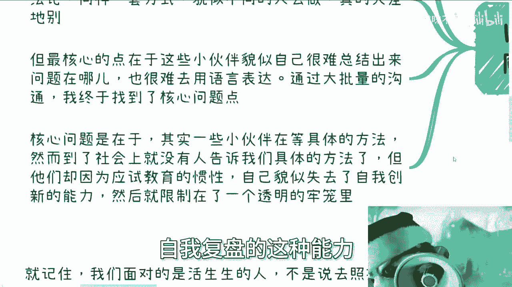
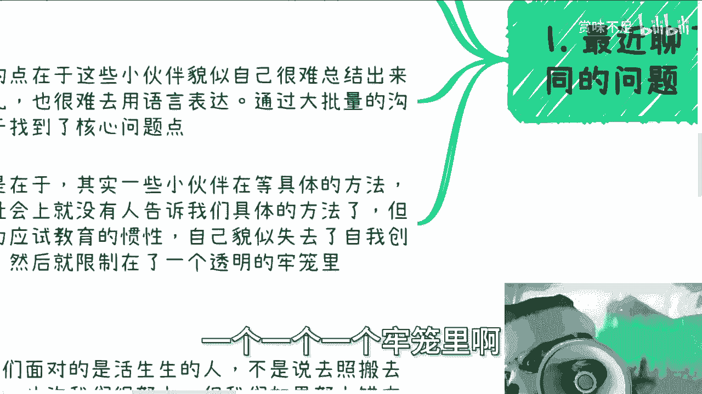
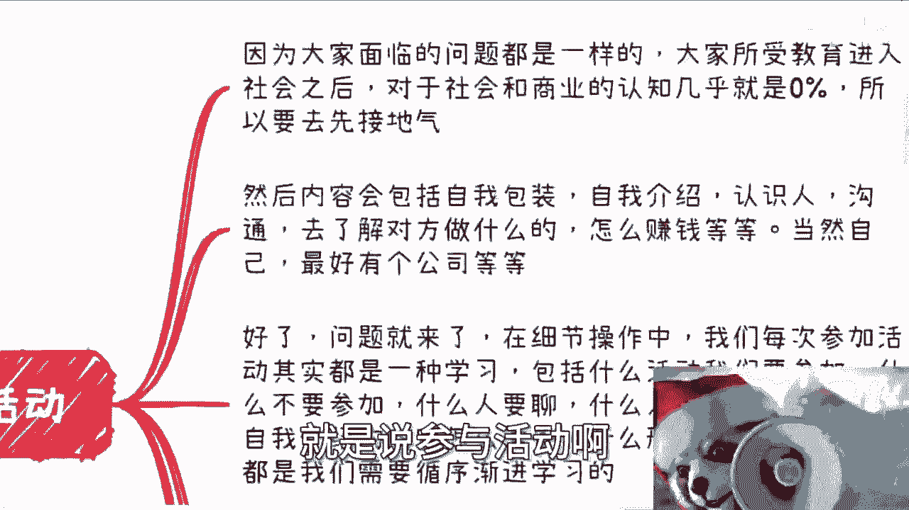
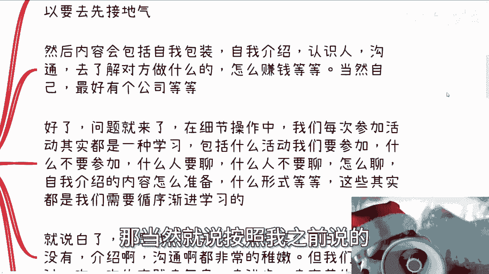
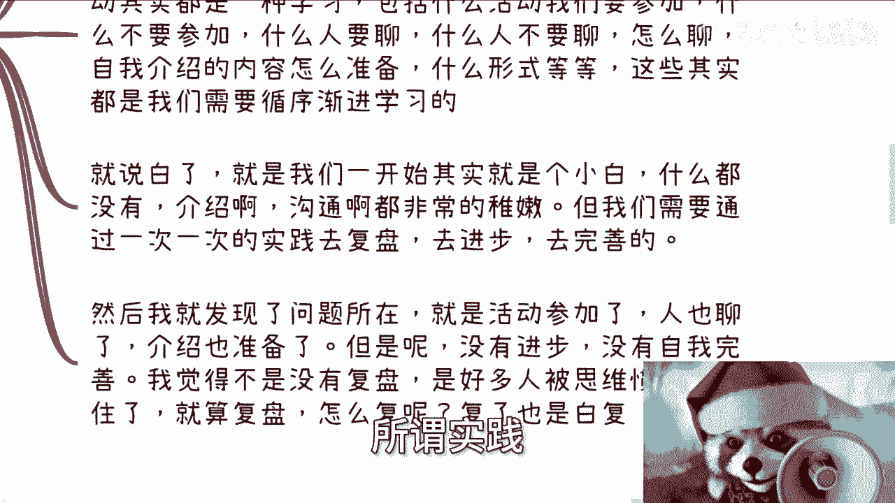
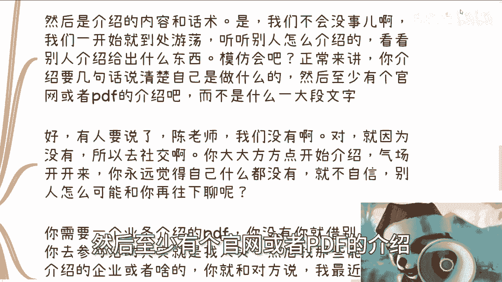
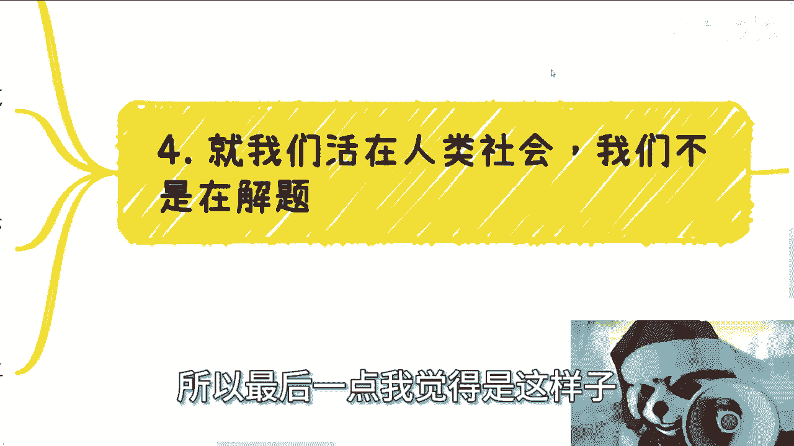

# 应试教育留下的后遗症实在太凶猛了 - P1 - 赏味不足 - BV1ne411E7P5

大家好啊，我这个最近聊了很多人，我发现我以前真的肤浅了，就有些东西啊，我觉得不是问题，但是我后来聊下来就发现妈的不行，都他妈是问题啊，我总结下来，我觉得这是一个应试教育留下的后遗症啊。

你们可以听听看，我不知道对不对啊，呃首先呢他最近有一个共同的话题。

共同的问题就是我一开始没有感觉到，我认为是一些简单的问题。

到了很多人身上呢，他就变得不简单了，我后来发现啊，其实问题出在细节上，就是说呃每个人所受到的方法论啊，所理解的东西呢其实没问题啊，但是同一套方式他貌似不一样的人去做呢，他就天差地别啊，天差地别。

但是核心在于什么呢，我觉得核心核心点是在于这些小伙伴，貌似自己呢他很难总结出来，就是就是你跟他聊啊，他不会来跟你说，爱车的时候，我觉得这里有个问题，就是他们会把那些问题呢零散的给你，就跟你说。

哎今天这个地方有个问题，明天那个地方有有些问题，但是这些问题其实都是面上面的，他不是说是一些核心的问题啊，所以说你说核心问题到底在什么地方呢，他就很难用语言去表达啊，那么通过大批量的沟通呢。

我终于找到了这个核心问题点啊，我觉得这个核心问题点是在于，其实有一些小伙伴呢他是在等具体的方法，或者说他有种我，我总结下来就是叫做应试教育的这个惯性，就是他到了社会上面呢，他就会等。

就说到底是哎这个接下来我应该怎么做，或者说我怎么做才是对的啊，但是问题是到了社会上，没有人会告诉我们具体的方法，也没有人会去跟他讲，你说哎对或者不对，所以说嗯我觉得大部分的小伙伴呢，他因为这个惯性呢。

他自己失去了一种就是叫做自我迭代，自我创新，自我复盘的这种能力。

就好像限制在了一个透明的，一个一个一个牢笼里面哦。

我是这么感觉的，那么拿一个具体的案例来讲，就是说参与活动啊。

因为大家面临的问题其实都一样，就是所有人比如说竟在这之前所受的教育，在进入社会之后，对于社会和商业的认知几乎就是0%嘛，对吧，就按我说法，就是说对这张地图的探索率就是0%啊。

那么所以呢我说我们先要去去接地气嘛。

但是你看啊，你看啊，怎么接地接地气呢，这个当中会包括比如说自我包装啊，自我介绍啊，认识人啊，沟通啊，去了解对方做什么啊等等，怎么赚钱啊，对吧好，那当然就是说按照我之前说的，就是说最好也不要是个人。

有个公司主体对吧好，这些都没问题啊。

好问题来了，在细节当中呢，我们每次参加活动其实都是一种学习，就说你为什么要去参加，你得想明白啊，你参加活动是说你得在这个过程当中去思考，就是什么活动，我们到底要不要参加什么活动。

不要参加什么人是适合聊的，什么人不适合聊对吧，包括我们怎么聊这个话术，怎么样子的，然后自我介绍的内容又是怎么准备的，而这个内容又是怎么一个形式对吧，就是说这些东西都是我们从0~1。

要去循序渐进去学习去积累的。

就说白了就是大部分人一开始他就是个小白，什么都没有，对不对，好那么介绍啊，沟通啊，他其实也比较稚嫩啊，但是我们就是需要通过一次次实践，然后去复盘去进步去完善，因为你想嘛。

所谓实践就是说你在这个当中得要去就是学习。

去去进化嘛对吧。

然后我就发现好问题所在这个地方了，就是说活动参加了吗，参加了人聊了吗，也聊了介绍准备了吧，也准备了，但是呢他整个这件事情，无论他参加多少次活动，这些东西没有完善，他没有进步，你知道吗。

就是说我觉得这不是有没有复盘的问题，他是很多人思维怕被这个应试教育的惯性，他所限制住了哦，就是他就算是复盘，你让他怎么付呢，对不对，就是我觉得很多人的脑子里面是这样子的啊，陈老师说要复盘好。

然后晚上我在那边一个人在那边想怎么复盘，付个屁啊，怎么付啊，你让他付，他还是白富啊，因为他根本就不知道。

你知道吗，我他妈后面才发现了，这是一个巨大的问题啊。

然后我拆开了一个跟你们讲啊，比如说你说活动筛选对不对，好你可以去过一些展展会，你也可以去过一些讨论会，你也可以去过一些闭门会议，OK我不我不关心你去过哪些会议，对不对，但是你差不多在两三次之后。

你要去思考啊，就是说哎哪些会是我需要去的，这些会上面的人，哪些人大概是我要去沟通的，你得去判断嘛啊你说我不知道怎么判断，OK没问题，那所以你要去试啊，你你在这个过程当中试了之后。

你才去判断这个人讲的东西对我有没有用对吧，或者怎么样子好，那么以后这种比如说作者听topic的，你就不要去了，因为现下面很多人，就是很多人可能会觉得哎下面都在听topic，大家就没有沟通。

那你就不要去了，对你沟通认识的没有帮助对吧，或者说你去也可以，你就脸皮厚一点。

坦克皮对吧，你就在下面偷偷认识人，相互介绍也可以啊，对吧好，那么我们退1万步来讲，你说你不知道这些人靠不靠谱，对不对，你说你不知道这些话术到底合不合适的吧，没关系啊，我随便打个比方啊。

做事情我们不要死板，要灵活对吧，你在社会上是什么意思，就是没有人再会告诉你，你应该怎么做，不应该怎么做，而且本质上也没有什么叫应该怎么做，不应该怎么做对吧，你只要不犯法，我觉得所有的方式你都可以去尝试。

你明白吧，就是说就是说很多人不是不知道吗，对吧好没问题，我们就举个例子啊，你今天这个会议上面大部分人跟你一样，其实都是散户对吧，那什么叫散户，散户就是说你跟他聊，你也不要有什么压力，也不要有什么包袱。

你跟他就就就当做大家陌生人交个朋友嘛，对不对，然后你不经意之间你可以跟他说嘛，你说哎你看啊，我可能是做互联网的，然后呢我现在没什么太大经验，那你跟他讲也无所谓的了，你也是个散户，他也是个散户，怎么了。

他他还能看不起你嘛，对不对，那你就跟他说嘛，你说哎比如说你说哎，我可能现在也是做互联网的，我最近呢就是说一直在，就是说嗯这个这个筹办啊，或者说在在准备我们公司的一些业务啊，然后再再做一些自我。

就是在跟别人想想，更多的认识一些人啊，那么你就跟他聊嘛，就说哎就是说哎兄弟你可能做什么呢对吧，或者哥们儿你可能做什么的对吧，那么你从他那边看看他是怎么介绍的对吧，然后你也可以问他。

你说哎我最近认识了一些这个公司，唉我因为我刚到这个行业啊，或者说我可能年纪还轻，唉，我想问一下，你知不知道对这些公司了不了解对吧，怎么样子，你掏你倒是去套啊，我不管你到底是真的想跟他交朋友还是说套话。

你倒是去做啊，对不对，就是说你要明白，就是说假设我们把你放到一个游戏里面，除了你就是对于你来讲，说难听点，所有人都是NPC，就所有人的人人都是里面的你的工具人，你想尽办法要去用啊对吧。

而不是说就是说啊我今天就是一套话术啊，然后我就去去去听啊，我就是去认识人的，我就是手上有这么一个东西，我就看到人就发，看了就发，你不是发传单啊，啊大哥哥们姐姐们啊，我真的叫了妈妈们，爸爸们是吧。

我真的我有时候跪了，我真的说啊，然后就说介绍的内容跟话术，是我们一开始会不会不会吧，没事，我们一开始到处游荡，你听听别人怎么介绍的嘛，对不对哦，你难道这个会当中这么多人介绍，你在旁边听着怎么了呢。

他他妈还能赶你走不成，对不对，你只要不尴尬，尴尬的就是别人怕毛啊啊，你看看别人怎么介绍的，你你你你看一两个，我觉得差不多了吧，模仿你总会吧，对不对，你正常来讲，你介绍就是那么12分钟。

几句话介绍清楚自己是做什么的，然后至少有个官网或者PDF的介绍。

而不是说每次整理好一大段文字，一大段文字没有用的，你懂吗啊，然后好有人要说了，他陈老师我们没有对吧，好就因为没有，所以我们不要纠结在先有鸡先有蛋，所以你要去社交对吧，我觉得大部分人的问题出在什么地方。

出在你们自己就没自信，不大大方方，然后在那边说一句说一句话，哎哎那个那个打结巴吧或者怎么样，你怎么让别人觉得你是靠谱的呢，对吧哎真的我觉得我觉得是这样子的，就是我觉得这个应试教育给予大家的。

这个怎么说呢，这已经不叫惯性了，就是给予大家很多东西，就是他就是束缚，就是牢笼，我不知道为什么，就是好像人的天性已经没有了，就是你不要就永远一开始就是自卑，或者觉得什么都没有，就不自信。

那你你这样都这么觉得，别人怎么跟你往下聊呢，对吧，那你从我角度也是一样的呀，我见我聊过这么多人，对方但凡是那种就是不自信，或者说好像声音比较轻的，或者说就是说呃讲起来没有逻辑性的，我我搬我半分钟。

我一分钟我就能听得出来了呀，那这种人就算你有东西，我也不想聊啊对吧，那么我们再往下说，你需要一个业务的介绍PDF，对不对，好你没有，你就去借别人的，你去参加活动，不就是为了找所谓的合作方吗，对不对。

然后你多多少少50个里面能找到一个吧，100个里面能找到一个吧对吧，你让他给你一个介绍的企业的介绍，或者企业的官网吗对吧，然后，这样的我跟你们讲做事情灵活一点啊，然后你就跟对方说。

你说哎我最近认识了一些客户啊，然后这些客户呢就是我跟他们还没有太详细聊，但是呢我觉得跟您的这个业务比较匹配对吧，那么你有没有介绍啊或者官网啊对吧，我看能不能就说到时候匹配的上啊，那么你就通过这种方式。

你去搜集一些企业的介绍，不难啊，而且企业介绍跟官网本来就不是什么商业机密，本来就应该是销售之间给对方的，对不对好，然后那个这两天还有小伙伴跟我提到一个东西，他说那我问了别人不给怎么办。

不给你就下一个嘛对吧，然后还有人要说了，那对方可能觉得我们在套他信息或者怎么样，大哥大姐们啊，我就告诉你们啊，官网也好，公众号也好，企业介绍也好，这是一个企业对外的基本信息哦，我就告诉你们。

如果他们这些企业觉得你问他要这个东西，都是所谓套信息的话，那我告诉你那家企业也不要做了啊，固步自封，闭门锁国做什么东西啊，你连介绍都不给出去做个屁啊，对不对，你要到PDF之后呢，我觉得你要是直接一点。

你就可以直接把PDF扔出去，也没问题对吧，你就说这是我合作方啊，我来跟跟你们碰一下业务有什么问题呢对吧，你要是你要是在这个做的叫什么稍微好一点，那是什么呢，你就是稍微修饰一些。

去掉一些logo和敏感信息，你自己做个PDF对吧，就是说让对方不知道这个PDF真正的业务的，这个主主体是谁也可以呀，你说你不会做抄，总会抄吧对吧，但是还是那句话，你不管抄还是说直接扔。

你总要跟对方打过招呼啊，你明白吧，因为你要直接扔了，我倒觉得这无所谓的，但是如果你是稍微做了一些修饰，把对方的logo和敏感信息去掉的话，那么你至少需要跟对方打个招呼，就说哎你看啊。

我是为了帮你这个拓展业务对吧，怎么样子，你不能说你跟对方认都不认识啊，对方他妈的都不知道你是干嘛的，然后你就直接问人家要要的拿过来抄，这样不行的，好吧哦，就是就是我觉得是这样子，大家是一个成年人啊。

大家做事情得要有边界，边界感啊，不能说就是好像他妈的呃，已经已经是一个大学生了，或者已经是个应届生了啊对吧，然后就是就是连一个嗯，就是人与人之间做事情边界感都没有，那我就觉得我我我真的不知道。

就是我我我我们这个义务9年制，义务教育和高等教育到底在教些什么东西啊，包括就是说什么样的人要接触什么样的人，就直接过滤对吧，下一个你一开始的确不知道，但是你聊那么一两个人，三四个人。

你得自己有要有总结能力呀对吧，我们要在聊的过程当中去学习，去判断，去对比呀，我们不是单纯的死板的去聊，去沟通，去了解，没有用的对吧，我发现很多人是为了做，就是不是说追求数量吧。

但是在他脑子里面只有数量啊，所以最后一点我觉得是这样子。

就是我们是活在人类社会里面，我们不是面对的都是就是都是目，不是我们面对的不是木乃伊啊，啊不是僵尸啊对吧，我们面对的是活生生的人，不是说照搬去做一些事情，就是我觉得我工作下来有很多人让我觉得。

如果他是死板做事情的话，我就会告诉你们，就是你们是很努力的。

我也觉得你们很努力，但是如果你们努力方向错了，一切都是没有意义的，你明白吧，就如刚刚三里面说的，我觉得其实不用多啊，有很多人甚至跟我说，我他妈参加了几十个活动有什么意义啊，我不明白。

我真的不明白有什么意义对吧，你去参加活动跟认识人，你要去用量去筛选，你去博概率的对吧，但是方式方法要对，不是单纯的去看数量啊，就是我说的没有意义，是说你你参加了，比如说三四十场活动，四五十场活动。

但是你的所有手段话术还是在你最最早level1的，就是很稚嫩的阶段，那你参加这种活动有什么意义呢，对吧，你要是跟我说哦，我已经参加三四十场了，对吧，然后我现在已经是就各种东西都已经很完善了。

然后我已经跟几个人合作，合作下来或者正在合作，那我觉得牛逼啊，那你继续啊，这水球越滚越大，对不对啊，我因为已经碰到不是一个两个，三个四个这样子了哦，如果我们自身不去提提升，不去完善我们的内容。

我们参加一百一千场又如何呢，你明白吧，哦我我我真的我也反思过了，我我以前真的没觉得这是一个问题，我觉得好像这是一个人正常应该有的技能，但是我觉得是我肤浅啊，是我肤浅了。

而且可能很多其他方面就是不单单参加活动，可能其他方面也有类似的问题存在。

我觉得我觉得大家真的可以可以，可以仔细想想看哦。

仔细想想看，就是就是很多问题吧，可能不是像我们想，是不是像我们想的表面当中这么的片面哦，真的好像不是这么片面，就像嗯就像就是说我们就这么说吧，就像很多人也也去聊了一些客户，聊了一些协会，聊了一些研究院。

然后他们会跟我说对吧，对方给他吃闭门羹，或者对方怎么样怎么样，我说实话啊，我觉得我听下来，我最终总结出来就一个问题，他们没有问题，是你有问题对吧，因为因为我最后真的看下来，就是说你该做的准备都没做。

该做的这个完善的，该完善的地方也都没完善，这就好像就是说你今天呃打一个游戏呃，呃刚进新手村，你说我就要去挑战终极boss，就是挑战那个比如说50级的boss，一百一百级的boss，这不可能啊对吧。

而且你要这么想啊，这个世界运作了这么长时间，这个国家已作了这么长时间，如果来说我们出去都是会就是闭门羹，或者别人怎么样子的啊，就别人不待见的话，那大家也别合作了，也没有现在不可能的，你知道吗。

所以说就是就是我觉得核心点还是在于说，我们要的是练习，我们要的是进步，但是到了社会上之后，你们就没有，就是关键是你们已经没有老师了，你们也没有所谓的这个导师或教授不存在了，就只能靠你们自己啊。

但是我觉得我我我我我，我觉得这个应试教育，好像已经让大家失去了自我生存的能力，就是这种感觉，而不是说是表面上的问题，好吧行，那就这么着吧啊，然后就是大家反正嗯有职业规划啊，或者说有商业上的一些东西。

商业上的创业啊，idea啊，合同啊对吧，或者其他各种各样的东西，或者说你们觉得有详细的啊，就是具体的这种案例的东西要分析，或者要去判断靠不靠谱的，那么我们整理好。

整理好。