# 课程01：识别并突破应试教育后遗症 🧠

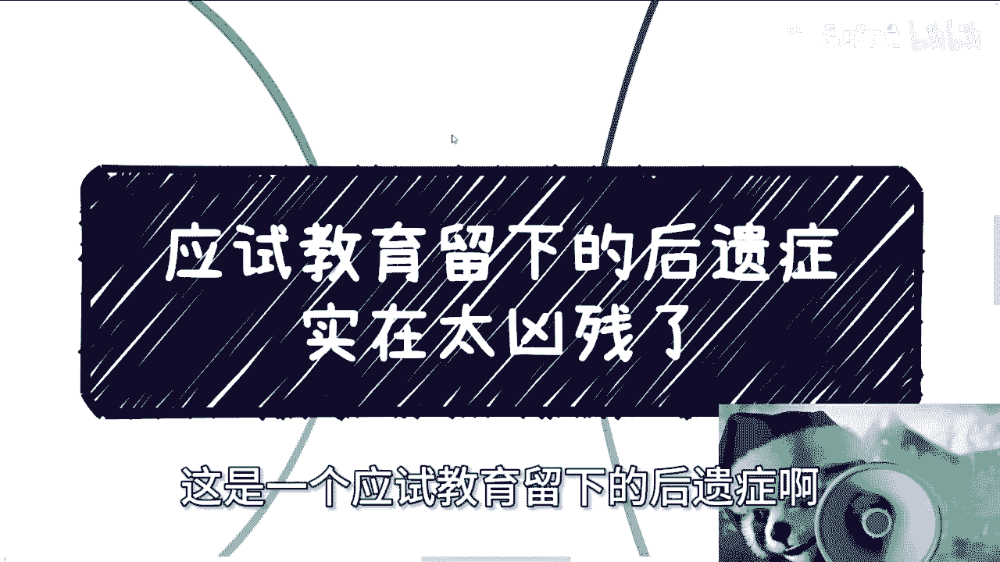

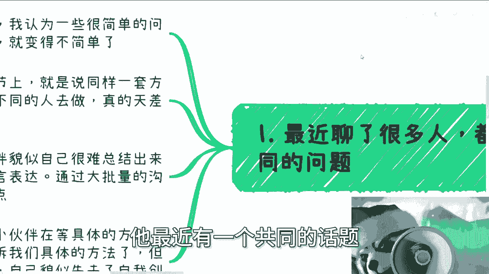

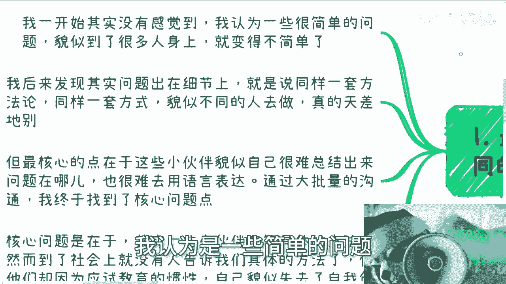

在本节课中，我们将要学习如何识别一种普遍存在但不易察觉的思维障碍——“应试教育后遗症”。这种思维惯性会严重影响我们进入社会后的学习、社交与职业发展能力。我们将通过一个具体的案例（参与商业活动）来剖析其表现，并学习如何建立自我迭代与灵活应变的能力。

---

## 核心问题：被束缚的思维惯性

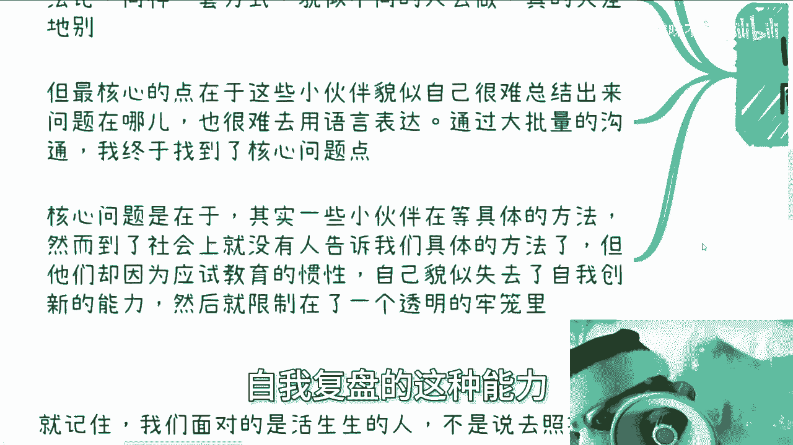

通过大量的沟通，我发现许多人面临一个共同的核心问题。这个问题最初并不明显，看似简单，但体现在不同人身上时，却产生了天差地别的结果。

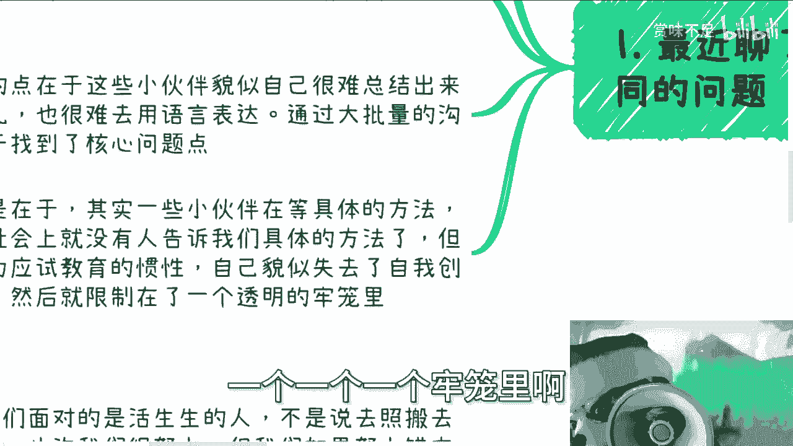

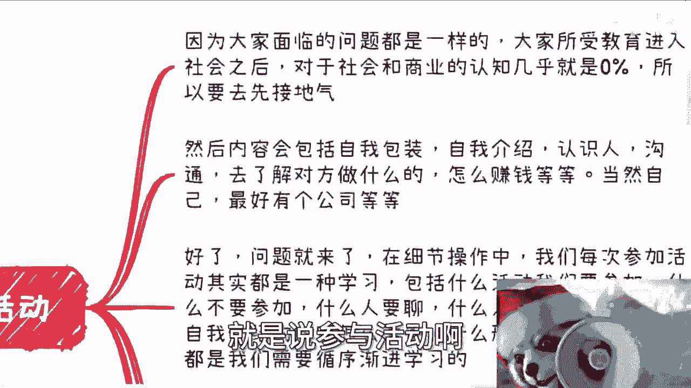

问题的关键在于细节。每个人掌握的方法论和理解本身可能没有大问题，但执行效果却因人而异。核心难点在于，当事人很难自行总结出根本症结。他们倾向于零散地描述表面问题，而无法用语言精准表达深层的核心障碍。

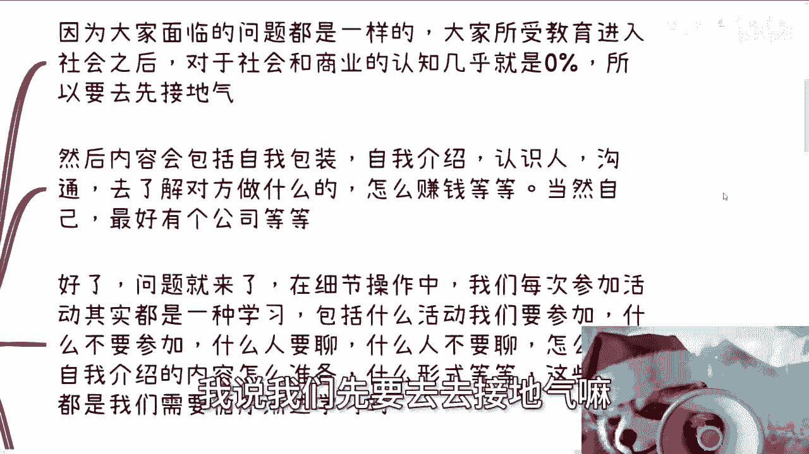

这个核心障碍就是：**等待具体指令的惯性**，或称“应试教育后遗症”。进入社会后，许多人仍在等待别人告诉他们“具体怎么做”或“怎样做才是对的”。然而，社会上不再有标准答案和权威判官。这种惯性导致个体**失去了自我迭代、自我创新和自我复盘的能力**。

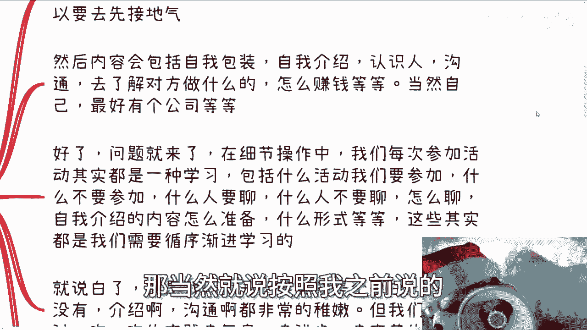

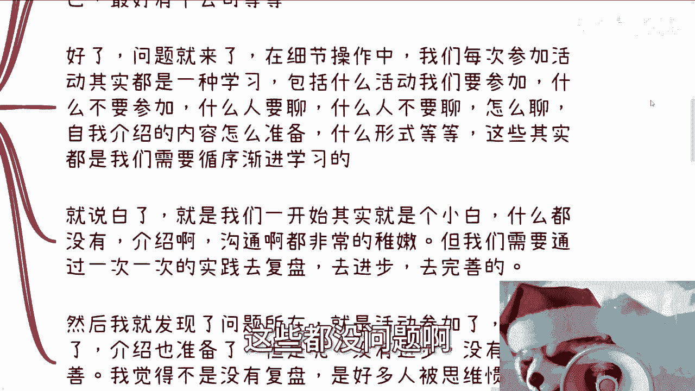

这种感觉就像被限制在一个透明的牢笼里。

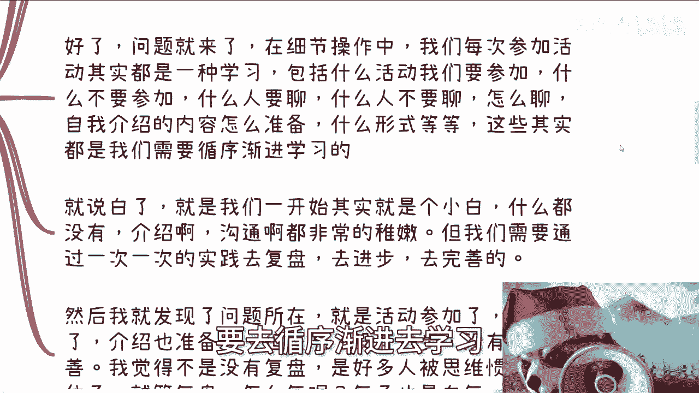

---

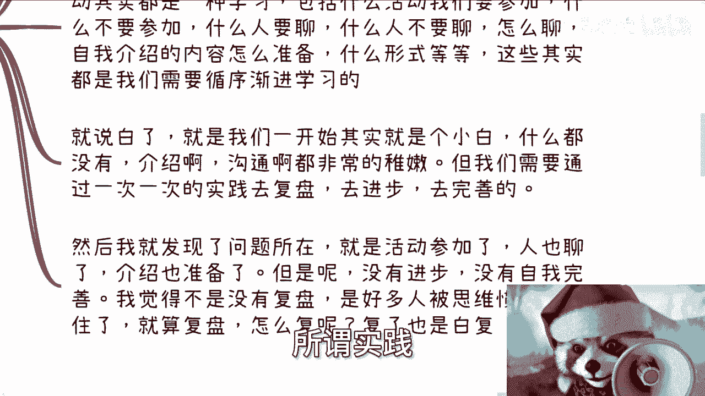

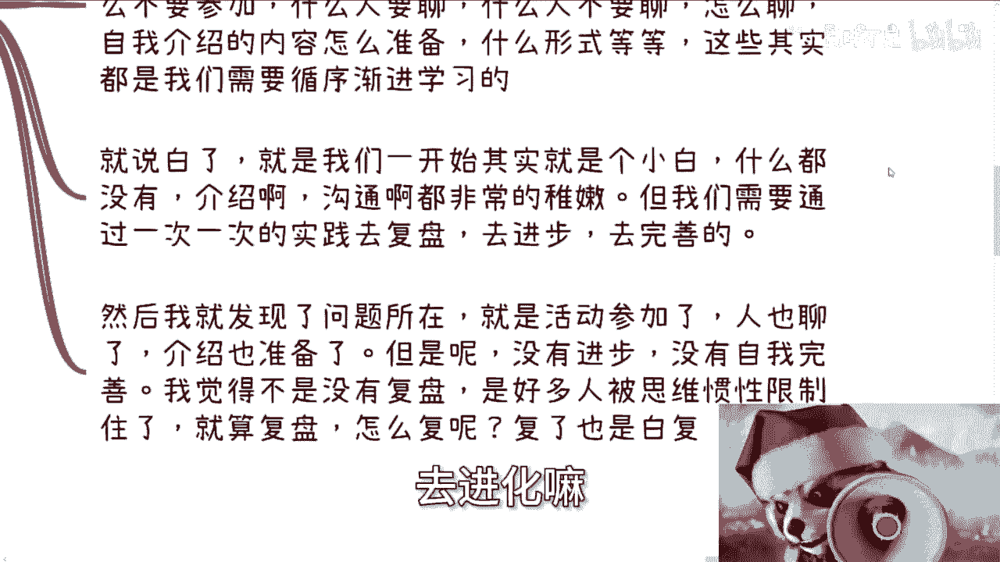

## 案例分析：从“参加活动”看思维差异

上一节我们介绍了问题的核心，本节中我们来看看一个具体案例：如何有效地参与商业社交活动。

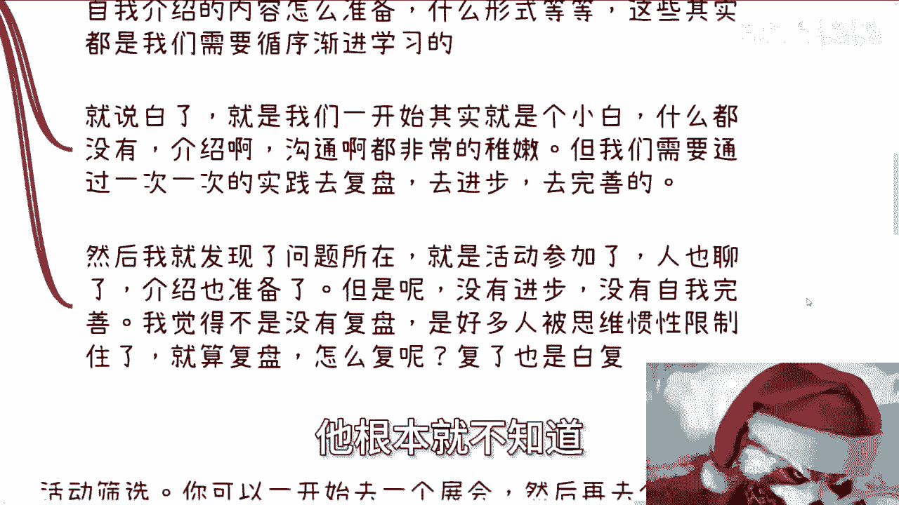

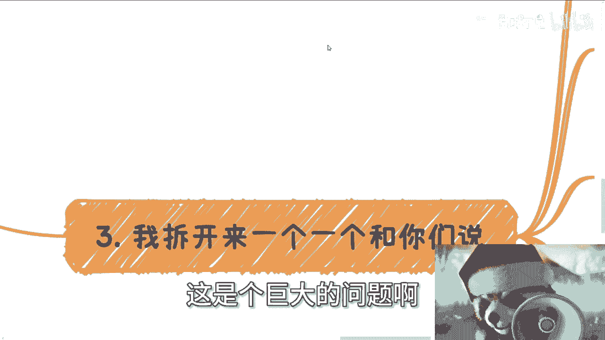

对于刚进入社会的人来说，对商业社会的认知几乎为零，就像对一张新地图的探索率为0%。因此，我们需要先“接地气”。

接地气的过程包括自我包装、自我介绍、认识人、沟通、了解对方业务及盈利模式等。最好能有一个公司主体作为依托。这些方向本身没有问题。

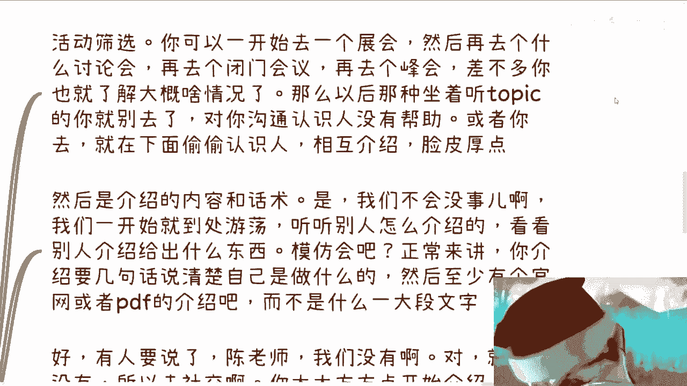

问题出现在执行的细节中。每次参加活动都应是一次学习。你需要思考：为什么要参加？在过程中需要主动思考活动筛选、沟通对象选择、话术设计以及自我介绍内容的准备与形式。这些都是需要从零开始，循序渐进学习和积累的。

大部分人起步时都是“小白”，介绍和沟通技巧比较稚嫩。这需要通过一次次实践、复盘、进步和完善来提升。所谓实践，就是要在过程中学习和进化。

然而，问题恰恰出现在这里：活动参加了，人也聊了，介绍也准备了，但无论参加多少次，相关能力却没有完善和进步。这不仅仅是“有没有复盘”的问题，而是很多人的思维被应试教育惯性限制住了。即使被要求复盘，他们也不知道具体该如何操作，因为缺乏方法和视角。

---

## 实践指南：如何突破惯性，有效行动

认识到问题后，关键在于改变行动模式。以下是针对“参与活动”这个场景的具体行动建议，其核心是变被动为主动，变机械为灵活。

### 1. 活动筛选与目标判断

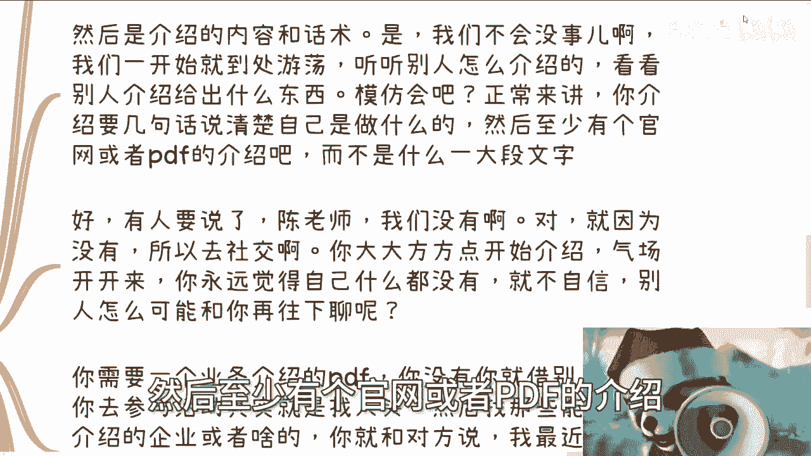

你需要主动思考并判断活动的价值。参加两三次活动后，就应该形成初步判断：哪些类型的会议值得参加？会议上哪些人值得沟通？

如果你不知道如何判断，那就去尝试。在尝试的过程中，感受这个人讲的内容对你是否有用。例如，如果某个会议主要是单向听演讲，不利于现场沟通认识人，那么以后类似的会议就可以少去，或者改变策略（如厚着脸皮在台下主动结识周围的人）。

### 2. 沟通策略：灵活应变，大胆尝试

在社会上，没有绝对“应该”的做法，只要不违法，各种方式都可以尝试。关键在于放下包袱，灵活应对。

*   **心态调整**：将社交对象视为“NPC”或潜在的合作者，你的目标是获取信息、学习经验、建立联系。
*   **话术示例**：你可以大方地说：“我是做互联网的，刚开始创业/探索业务，正在多认识些朋友。您是做什么的？” 或者向对方请教：“我接触了几家公司，但对行业还不太熟，您了解这些公司吗？” 无论是真心交友还是信息收集，关键是要行动起来。
*   **学习模仿**：如果不会自我介绍，就在活动中倾听别人如何介绍。模仿是学习的起点。一个合格的自我介绍通常在1-2分钟内，用几句话讲清自己是做什么的，并附上官网或业务介绍PDF。

### 3. 材料准备：从无到有的创造

很多人卡在“没有公司介绍材料”这一步。解决方案是：**不要纠结先有鸡还是先有蛋，先去社交，在社交中获取和创造**。

*   **自信是前提**：不自信、不大方，很难让人感到靠谱。先调整心态。
*   **获取参考资料**：在活动中结识潜在合作方，直接向其索要企业介绍或官网。这不是商业机密，而是企业对外的基本信息。你可以这样说：“我接触的一些客户可能和您业务匹配，方便发我一份介绍看看吗？”
*   **加工与创造**：拿到资料后，可以直接使用，也可以稍作修饰（如去掉Logo和敏感信息），制作成自己的版本。**关键点**：如果你对资料进行了修改，务必告知原提供方，这是基本的边界感和尊重。
*   **边界感**：作为成年人，做事要有边界感。未经允许直接抄袭他人材料是不可取的。

### 4. 持续迭代：从量变到质变

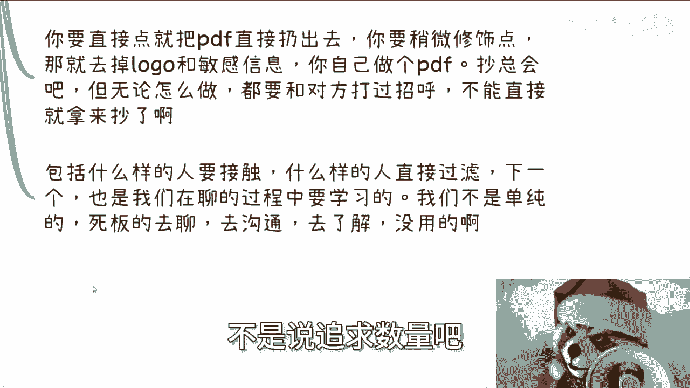

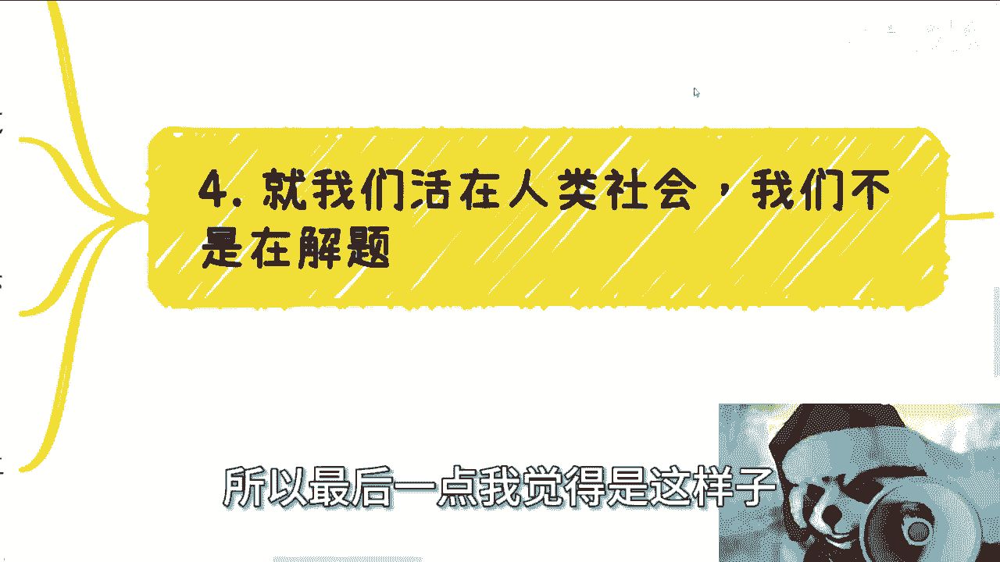

行动不是机械重复，而是持续迭代的过程。

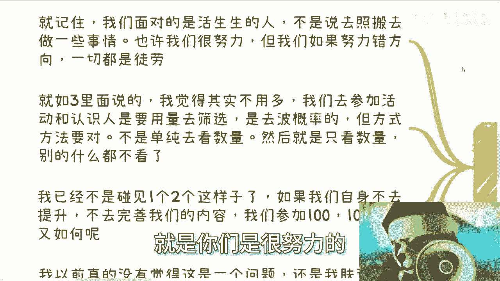

*   **在沟通中学习判断**：每聊完一两个人，就要有意识地去总结、判断和对比。学会过滤无效社交，找到值得深入接触的人。
*   **追求质变，而非单纯量变**：参加活动的意义不在于数量，而在于通过每一次经历提升自己的“等级”。如果参加了数十场活动，你的话术、材料、判断力还停留在最初级的水平，那么这些活动就失去了意义。有效的成长路径是：**实践 -> 复盘 -> 完善 -> 再实践**。
*   **核心公式**：有效的进步遵循这个循环：
    `成长 = 实践(行动) + 复盘(反思) + 完善(优化)`

---

## 总结与反思

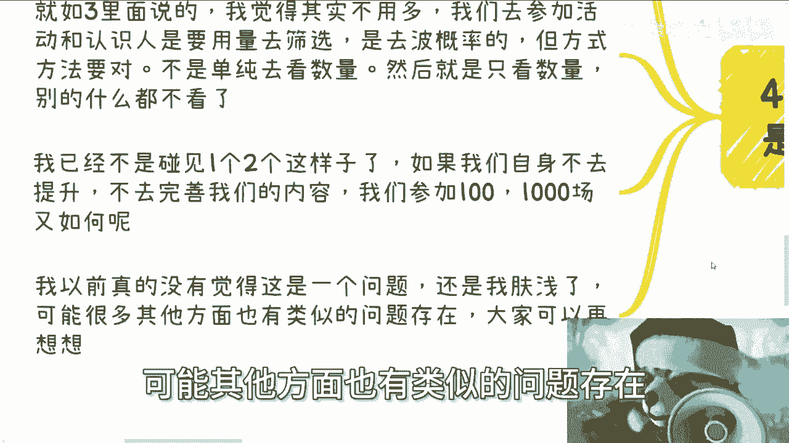

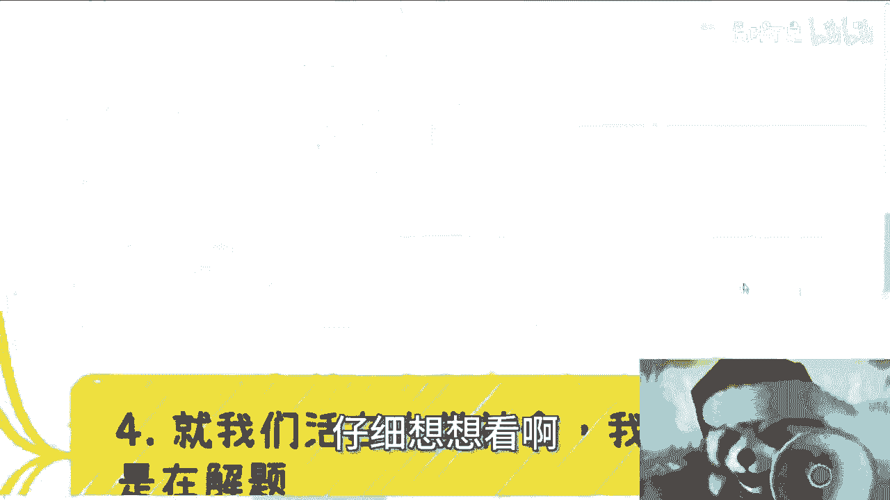

本节课中我们一起学习了“应试教育后遗症”的表现及其突破方法。

我们认识到，核心问题在于进入社会后，许多人依然在等待“标准答案”和“具体指令”，从而丧失了自我驱动成长的能力。通过“参与商业活动”这一案例，我们拆解了从被动接受到主动创造的转变过程：

1.  **主动判断与筛选**，而非盲目参与。
2.  **灵活调整沟通策略**，大胆尝试，在实践中学习。
3.  **创造性准备材料**，利用社交获取资源并尊重边界。
4.  **坚持持续迭代**，追求每一次行动后的质变，而非简单量变。

最终，社会是一所没有固定教材和老师的大学。真正的进步来自于**自我驱动的练习、反思和完善**。摆脱等待指令的惯性，建立自主学习和进化的能力，是每个人在社会这所大学里必须掌握的生存技能。

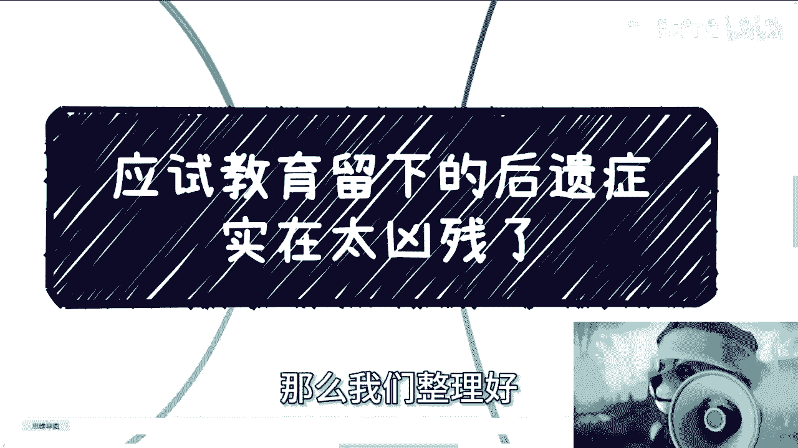

如果大家在职业规划、商业创业或具体案例分析与判断方面有进一步的问题，可以整理好具体材料进行深入探讨。