# 应试教育的-应-和-试-的问题-欢迎讨论啊---P1---赏味不足---BV1UK4y1i7WH_n

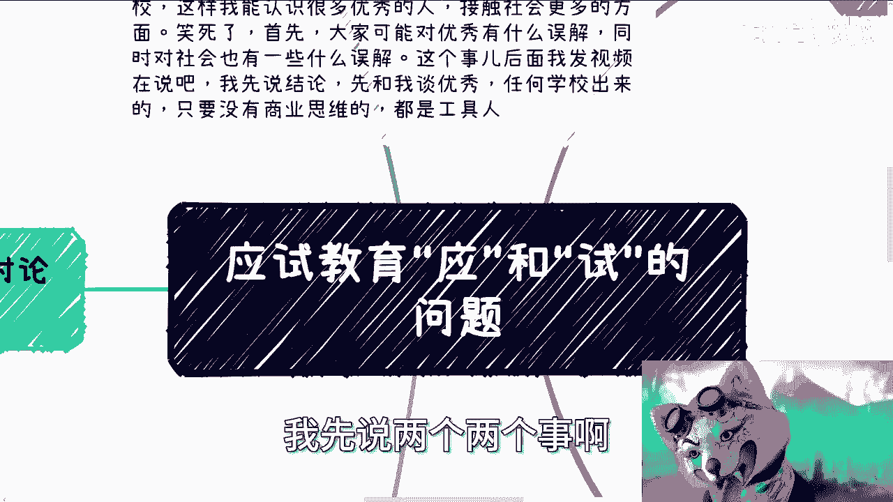

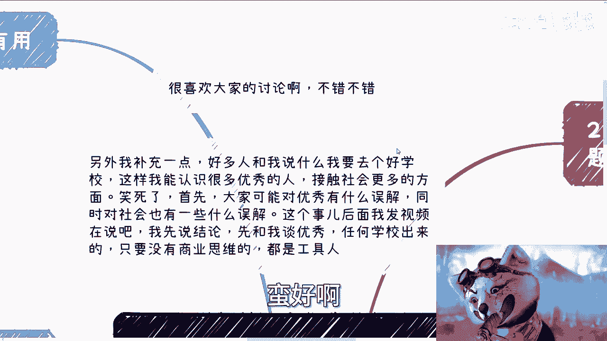

在本节课中，我们将深入探讨应试教育的核心问题，即“应”与“试”的本质。我们将分析当前教育体系与社会需求脱节的现状，并探讨可能的改进方向。课程内容将围绕几个核心观点展开，旨在帮助初学者理解教育、个人发展与社会现实之间的复杂关系。

---

## 概述

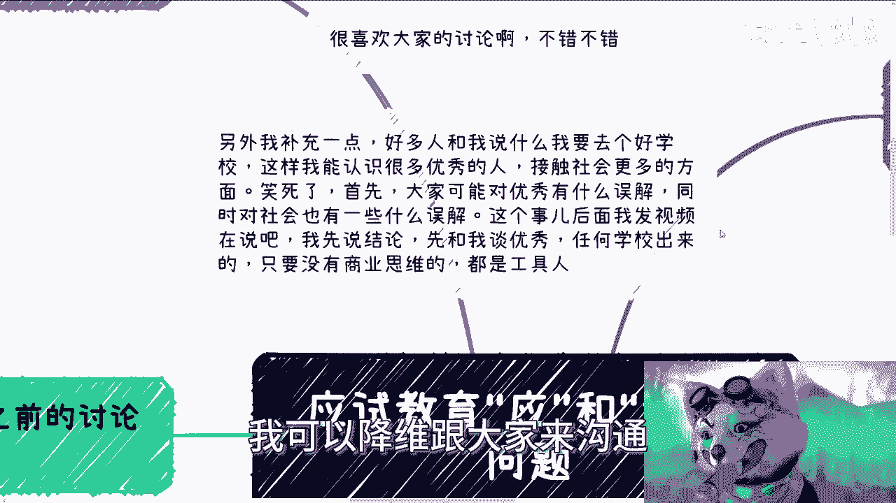

首先，我们讨论两个基本观点。第一，我乐于见到大家在评论区进行讨论。第二，针对“进入好学校以接触优秀人群和社会”的观点，我认为这存在误解。

所谓的“优秀”如果仅指擅长读书、考试和做卷子，那么这种定义没有意义。在社会中谋生并不依靠考试。无论毕业于哪所学校，在纯粹的应试教育体系下培养出来的人，在资本家和既得利益者眼中，都可能被视为“工具人”。

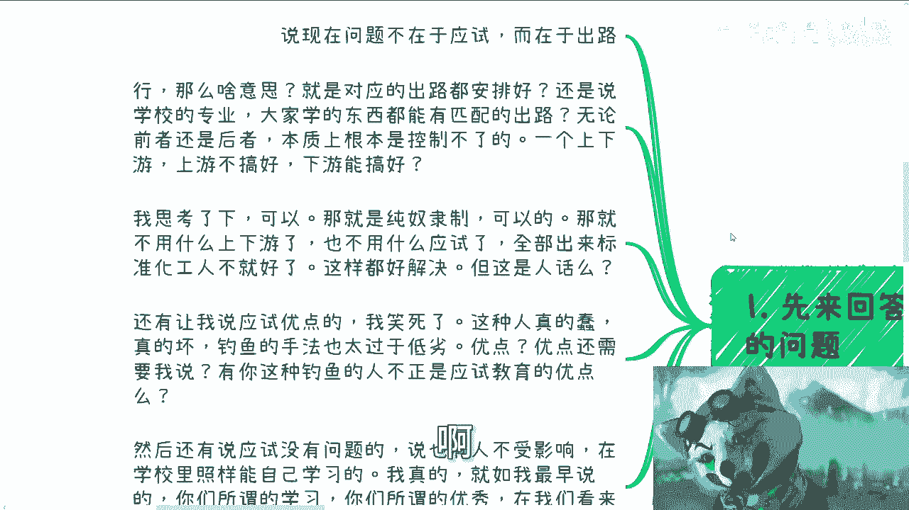

---

## 对评论区观点的回应

上一节我们介绍了对“优秀”的常见误解，本节中我们来看看评论区的一些具体讨论。

有人提出，问题不在于“应试”，而在于“出路”。这种说法令人费解。“出路”并非人为可以完全控制的事物。教育体系的上游问题尚未解决，却讨论控制下游的出路，这逻辑上存在问题。

经过思考，我认为这种观点可能隐含了一种“纯奴隶制度”的期望，即培养完全标准化的“奴隶”。但这显然不是合理的解决方案。整个教育是一个链路，上游的核心问题不解决，下游的困境就无法根治。

---

## 应试教育的所谓“优点”

接下来，我们回应关于列举应试教育“优点”的要求。这本身就是一个荒谬的问题。

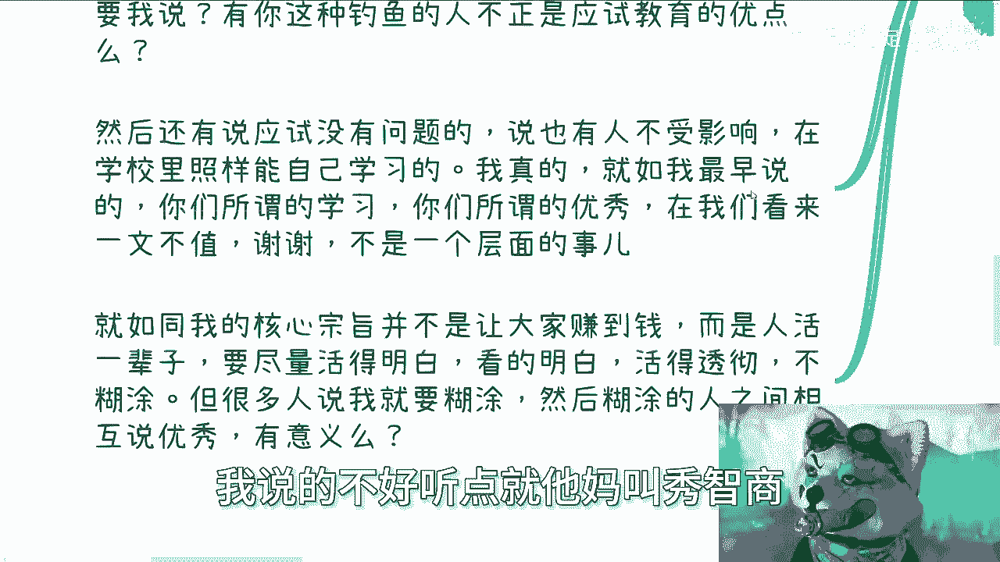

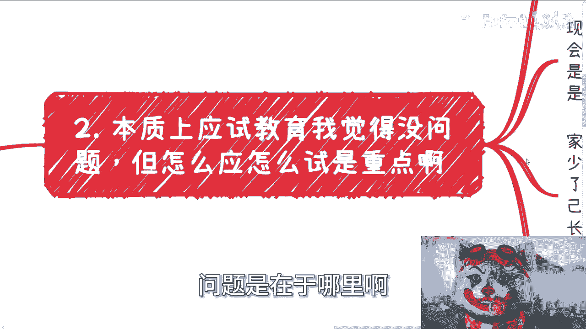

应试教育的“优点”无需多言。会提出这种问题的人，其存在本身或许就是应试教育某种“优点”的体现——即培养出缺乏批判性思维、习惯于接受既定框架的个体。

---

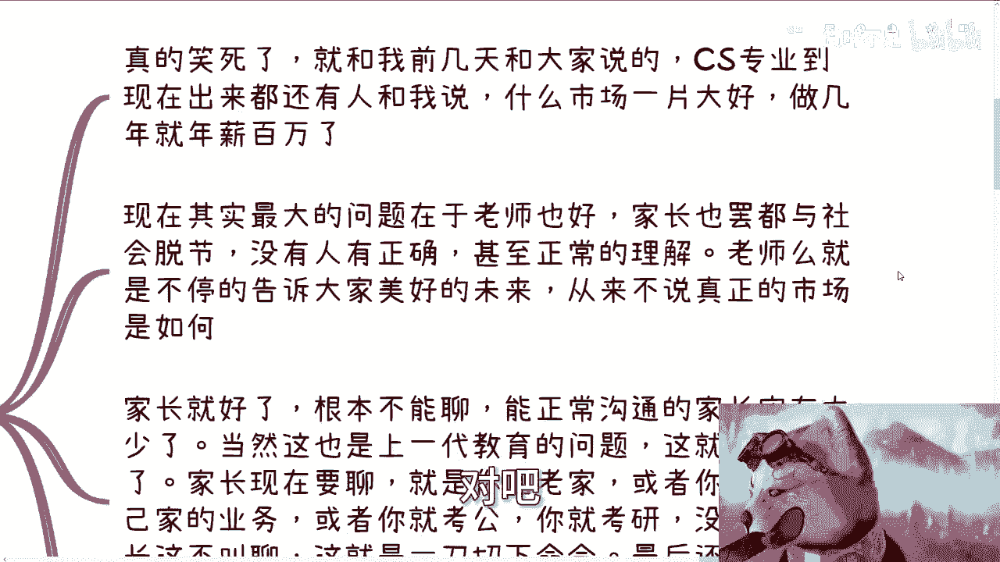

## 对“学习”与“优秀”的再定义

现在，我们来重新审视“学习”与“优秀”。许多在校学生自认为优秀，但这种“优秀”往往局限于校园环境。

一个未曾踏入社会、没有商业和企业经验、不了解真实商业逻辑的人，没有资格定义全面的“优秀”。我们活着的目的是活得通透、明白。人生只有一次，不应被莫名其妙的制度、扭曲的三观或他人的片面影响所束缚。

那些认为“学习好等于优秀”、“清北毕业等于优秀”的人，在我看来是糊涂的。这好比40分的人嘲笑50分的人不优秀，毫无意义。说得客气些这叫“无知”，说得不客气些这叫“秀智商下限”。

---

## 应试教育的流程与核心问题

本质上，应试教育的流程本身或许没有问题。问题在于“应”和“试”这两个字到底代表了什么。

当前最大的问题在于，老师、家长都与真实社会严重脱节。他们（以及媒体）热衷于无限放大个例，制造“幸存者偏差”。例如，吹嘘某个专业市场一片大好，或宣扬个别毕业生年薪百万的神话。这种以偏概全的叙述没有意义。

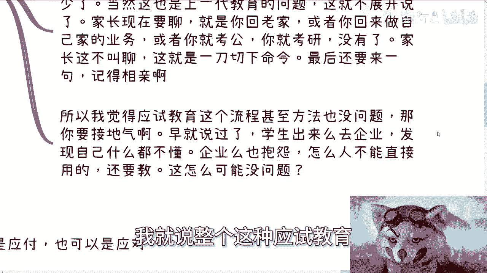

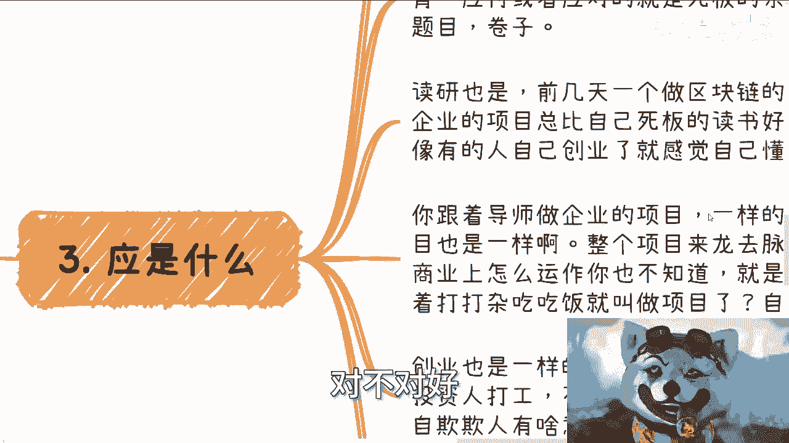

老师不断向学生描绘美好的未来，告诫他们要“努力学习”。甚至有学生主动想了解社会、积累商业知识，却被导师强行制止，要求他们“好好读书”。这非常荒谬。当你未来找不到工作或被裁员时，老师或一张满分卷子能养活你吗？

家长的沟通往往是“单向命令”：回老家、考公、考研、相亲……他们很少关心子女毕业后的长远发展和真实生存状态。这给人一种错觉：仿佛毕业或结婚后，人生就结束了。

因此，应试教育的方法或许没问题，但整个体系必须“接地气”。它传授的内容必须符合当下社会的发展。否则，学生毕业后发现自己什么都不懂，企业抱怨毕业生能力不足，就成了必然结果。

---

## “应”的本质：应对人与事

那么，“应”究竟应该是什么？它可以理解为“应付”，也可以是“应对”。但核心在于，它不能脱离“人”。

目前的教育中，学生应对的都是死板的题目和卷子。但在未来的人生道路上，我们面对的主要是“人”和“事”。例如，疫情期间应对网课，最终面对的仍是冰冷的题目，这意义有限。

真正的“应”，应该是让学生去面对真实的人，参与真实的项目。学生需要独立或组队面对接近真实商业市场的挑战，并向真正的创业者、行业人士进行答辩和讨论。这个过程应该是开放的、可辩论的，就像我们现在的讨论一样，而不是走过场。

---

## “试”的本质：在真实世界中检验

以下是关于“试”应有的形态。

“试”目前基本等同于“考试”。但考试本身对工作和赚钱没有直接意义。如果赚钱靠考试，那现行教育体系就没问题，但现实并非如此。

真正的“试”，应该是将学生投入到真实的商业“游泳池”中去尝试、理解、答辩和考试。这样才是接地气的。即使有人立志科研，也需要明白自己为何选择这条路，而不是被灌输思想。真正的“试”是在接地气的过程中，一边摸索试错，一边理解自己和社会轮廓的过程。

然而，现在“试”被默认成了毕业后、面临生存压力时才要做的事。这等于叠加了双重负面状态：既失去了学校的庇护，又要挣扎求存。更何况，很少有人会像这样直接地告诉大家真相。结果就是，许多人的四年或七年时间被浪费了。在该锻炼的时候没有锻炼，等毕业后再补课，自然无比艰难。

---

## 总结与核心建议

本节课中我们一起学习了应试教育在“应”与“试”两个核心环节上的脱节问题。

学科知识当然有用，现行学科安排也并非一无是处。世界不是非黑即白的。在现有体系下，如果老师和家长能更“接地气”，让学生在学习期间就能接触人情世故、商业社会规则，那么学生毕业后会从容很多，企业也会更满意。

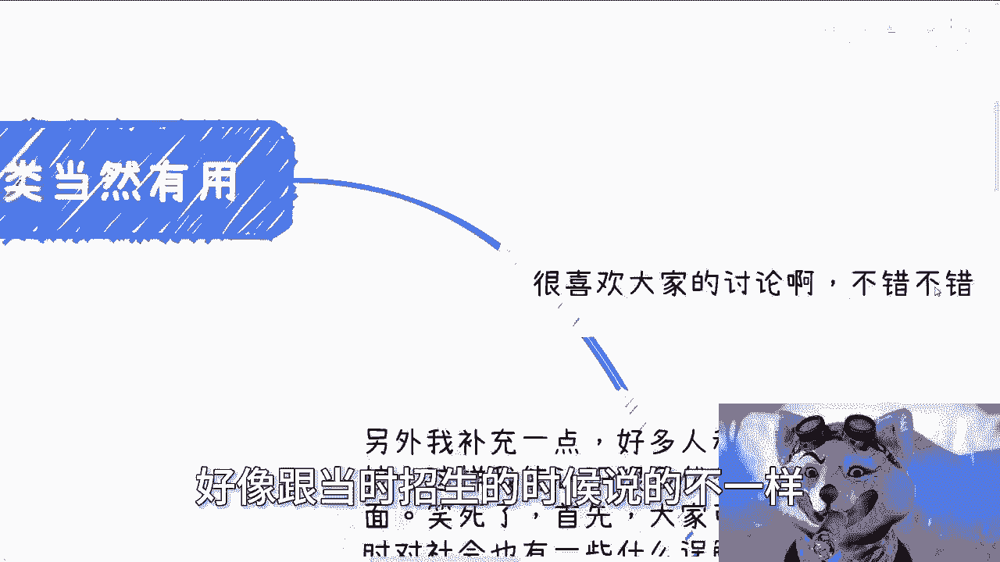

我接触过许多本科生、研究生，他们尽管年龄不小，但对社会认知却如同婴儿。这不能全怪他们。如果教育环境能接点地气，很多人不至于一毕业就三观炸裂，感叹“现实和老师说的不一样”。

问题根源有几方面：
1.  老师和家长与社会脱节。
2.  应试教育过于僵化。
3.  行业变化迅速，从大一到大四，一个行业可能已天翻地覆。除了自己主动了解、接触并把握行业走向，没有人能帮你。如果四年后还抱着入学时被灌输的过时观念，那必然毫无用处。

我的观点讲得比较直接，因为忠言逆耳。既然要讨论，就不应藏着掖着。

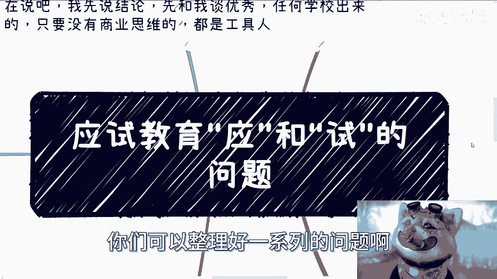

对于职业规划、公司注册、合同处理等具体商业问题，如果有不清楚的地方，可以整理好一系列问题。