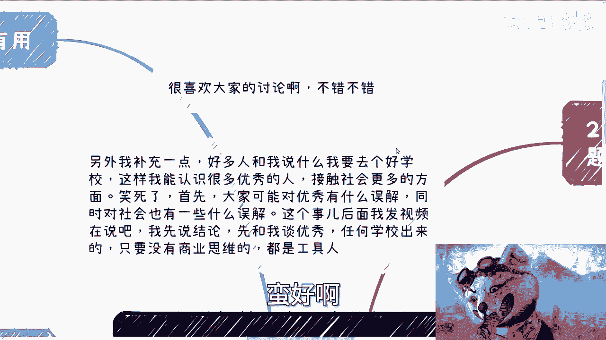
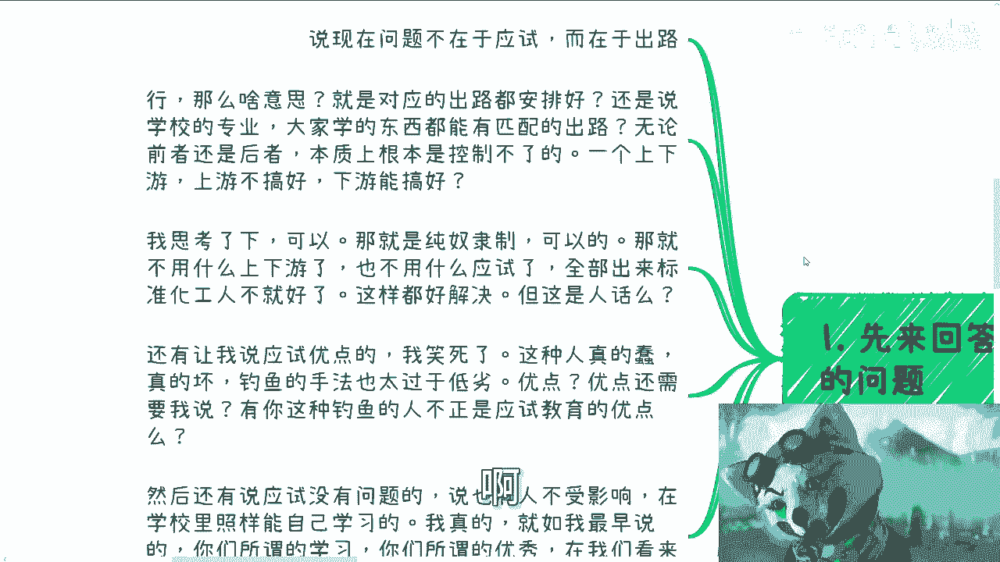
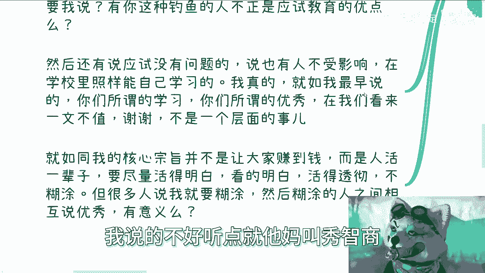
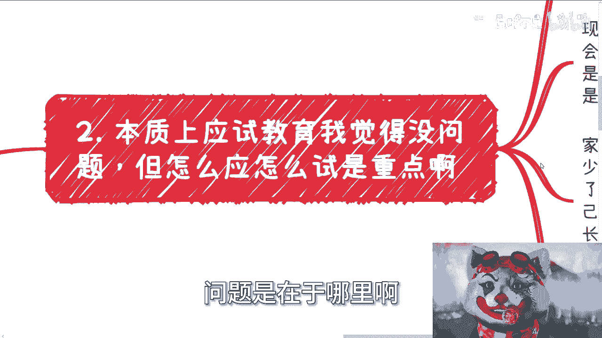

# 应试教育的“应”和“试”的问题，欢迎讨论啊 - P1 - 赏味不足 - BV1UK4y1i7WH

啊大家好啊，这个我已经在杭州了对吧，首先啊我先说两个两个事儿啊。

第一个事儿呢，就是我觉得我还是蛮喜欢大家讨论的啊，蛮好啊。

非常的开心啊，大家在这个评论区，真的我这个发自内心的说啊，哎呀呀呀傻了，是不是再放大一次，就是嗯这是第一个事儿啊。

然后第二个事呢就是另外我补充一点啊，就好多人跟我说什么，他说啊我要去好的学校啊，这样我就能认识更多优秀的人，接触社会，更多的方面，我跟你讲啊，嗯笑死，首先啊，呃我觉得你大家可能对优秀有什么误解啊。

其次呢对社会可能有些什么误解啊，简单来讲是什么意思呢，就是说如果大家觉得所谓的读书，所谓的应试，所谓的考试啊，所谓的做卷子上有一些东西叫做优秀的话，那我觉得我们没什么好讲的对吧。

你有本事你出来赚钱也考试啊对吧，你又不是突然做那个找工作，你也考试啊对吧，你有本事以后失业了，你也跟人家说啊，来给我张卷子考试啊，有用了没有用的呀对吧，我先说结论对吧，我就这么跟你讲，你别跟我谈优秀。

任何学校出来的，你别跟我说什么清华北大没卵用的，你只要任何学校是应试教育出来的，对我来讲都是攻击人，对所有资本家跟所有的既得利益者来讲，都是工具人，有什么区别鬼他妈管你们是什么学校毕业的，搞笑来。

真的是我还是那句话啊，不要一天到晚来挑战我的底线啊，我可以降维跟大家来沟通。

但是并不代表说我他妈想跟沟通啊，好首先第一点啊，我先来回答一下评论区之前的讨论的问题啊，首先他说现在问题不在于应试啊，而在于出路行哈，中国话我也看笑了，什么意思啊。

啊你跟我意思就是说在于出路出路没安排好啊，出路很多这个东西嗯，怎么路铺的不好啊，包括怎么样子，那就是说意思就是说对应的出路要要安排好，还是说学校的专业，大家学的东西要有能匹配的出路还是怎么样子。

我不是太明白啊，但是我想了一下，初入这个东西好像不是人为能控制的对吧，你怎么控制呢，我我没想明白哦，你说上游对吧，整个的一个一个一个教育体系，上游都没控制好，你跟我说控制出路，啊我想过来啊。

我我经过了深思熟虑啊，我得出了这么个结论啊，我觉得可以啊，我觉得我觉得可以啊，得出这么结论就是可能啊，我觉得这个人可能想表达的是，这种叫做纯奴隶制度啊，就是你要是纯奴隶制的人，也不用上下游了呀，对不啦。

要什么应试了就就出来的，全部是不都是标准化奴隶不就好了吗，这不就解决了吗，但是他妈的这是人话吗，对不对，我真不明白了啊，你整个一个就是一个链路的事情啊，你上游问题不解决，跟我跟我来说啊。

这个可能是下游的问题啊，首先这首先这第一点，第二点还有让我说应试优点呢，我他妈也是要死的对吧，我希望这种这种蠢的人，这种坏的人，大家以后真的要注意一点，就是我不管你是不是钓鱼对吧。

但是你这种钓鱼手法过于低劣，那应试教育的优点，这还需要我说吗对吧，就是有这种他妈的钓这种钓鱼的人，这不正是应试教育的优点吗，对吧啊，然后再来说啊，应试啊，还有说应试没有问题啊。

说啊这个从初中到高中到大学，还有人不受影响的啊，然后说什么啊说什么，就是这个到了大学依然也有嗯，人那个那个主动学习的啊，怎么样子，我真的啊，我就这么跟你们讲，你们所谓的学习，你们在学校里面。

我不管你们多优秀，我不管你们自己自认为多优秀，我就告诉你们，在社会上你们就是，为什么没有，为什么，因为你们没有经验，你怎么你有什么，你有什么资格说所有学我不明白了，对不对哦，你一个还没有出过社会。

那也没有做过企业，也没有做过商业，也没有看到过我们所谓的真正的商业逻辑，你跟我谈优秀，我真搞不懂啊，对不对，我一早就说过了，我们活着的目的是什么对吧，我一直跟你们讲，我的宗旨不是说大家要去赚钱。

因为能不能赚到钱是看天时地利人和的，对吧，哦你说难道今天看一个人视频，跟某个某个人做事情就一定能赚到钱吗，怎么可能有这种因果关系呢，有这种因果关系就是割韭菜啊对吧，我的核心宗旨从一开始到现在。

就是说我希望大家每一个人只活一本，来就只活一辈子，对不对，那我们既然只活一辈子，我们要活得通透，活得明白，你要看得明白，活得透彻对吧，我们既然只活一辈子，为什么要活在所谓的莫名其妙的一些，一些制度下。

或者莫名其妙的一些三观下，或者莫名其妙的就父母的影响下，为什么呢，我不明白呀，为什么呢，你明明只会一次，为什么要被这种莫名其妙的人，莫名其妙的东西所所所所影响呢，对吧，你就像上面那些人跟我说。

哎我们觉得这个学习好的人就是优秀，那OK啊对吧，跟我说到清北的就是优秀，那OK啊，那我觉得是什么，我觉得就是这些人就是糊涂的对吧，就是在我看来，就是60分以下及格线不到的对吧，那你既然60分以下。

你40分跟50分，五五十步笑百步对吧，你50你100步的人跟我说50步是优秀的，有什么意义了，有什么意义呢，对不对，我说的好听一点叫什么叫做你们无知，我说的不好听一点，就他妈叫秀智商。

对不对，哎呀我真的是我妈无语了啊，这个是第一个对吧，第二个本质上我觉得应试教育，说实话啊，我觉得这个流程其实没问题啊，本身流程就没问题，问题是在于哪里啊。

问题在于是这个印跟这个事，到底是个什么东西啊，好就像前两天说的啊，那我哪天就真的得笑死是吧，妈妈都是笑死啊，就是我前两天跟大家讲的cs专业对吧，到现在出来还有人跟我说什么。

哎呀我们老师跟我们讲的市场一片大好，包括那些那个外包对吧，培训公司也是的，卧槽你们学java对吧，学学Python对吧，你们学什么东西啊，市场一片大好，好个蛋啊啊对吧。

还有人跟我说，哎我们老师跟我讲他对吧，快毕业经验对吧，我们作为一个什么98521的学生啊，毕业几年年薪百万了，是你可以做梦啊，梦里都有啊，想屁吃，要么啊，现在其实最大的问题在于老师也好，家长也罢。

他都与社会脱节啊，然后呢老师家长媒体啊都喜欢无限放大个例啊，也就是我们所谓的生存幸存者偏差对吧，无限放大个例有什么意义呢，就好像有人非要评论跟我说，哎有人年薪百万点，然后呢，然后呢你想说明什么呢。

那照你这么说，14亿人他妈的有一个人吃饱饭，剩下的人都都他妈没饿死了，有义务了对吧，你问我，应试教育的优点是，我告诉你，优点就是他妈的会出来这么多所谓的啊，这个坏的蠢的，这他妈就是优点对啊。

就是整个你看家长到老师，他没有一人，一个人才有这种正确甚至正常的理解，而且就算有他们也不敢讲对吧，老师们就是不停的告诉大家啊，未来多么美好啊，现在你们你们要努力学习对吧，我跟你们讲啊。

嗯你想近两年也有的，就是我们有些学生，他们甚至是主动的想要去了解这个社会，想要去积累商业的东西，被他们老师强行打回来，你知道吗，就那些研究生的导师以及那个本科，那么老师就跟他们说。

你们现在不要搞这种东西，你们好好读书有毛病吗，唉我真的觉得有毛病了，对不了，就像我刚刚说的，那怎么滴呢，啊我以后找不到工作养老，你养我吗，对吧哦，我我以后我以后，比如说这个这个这个这个被裁了。

怎么你让我要么给我一张卷子，我能考出100分，能让我继续继续上班吗，就那么可笑，真的是可笑啊，家长就更好了，我跟你讲根本就不能聊啊，能正常沟通，家长实在太少了，当然这个也跟家长。

我们所谓的上一代教育那有问题，这里我就不展开说了，这个问题又是很长一段问题，对不对，好家长现在要聊的就是什么，无论就是家长的聊，叫单向聊，就是不管你跟他讲什么，他妈永远跟你说，你要么回老家，唉。

你要么回来做我们自己家的业务啊，要么继承家产啊，或者你去考公啊，或者你考研没了没了呀，这他妈叫聊吗啊，这叫单项命令，对不对啊，最后呢他还不忘来一句啊，记得相亲啊对吧，记得带对象啊，没了对吧。

就这我跟你讲，就这两天评论区讨论，让我觉得有有有有句话说的蛮对的，是什么，就是就是学校也好，家长也好，对吧，父母也好，给我们一种感觉是什么，就是我毕了业好像后面我就不活了。

就是我毕了业好像我就进棺材了啊，或者说我好像结了婚生了孩子，好像你后面就不活了，就没有人来关心你后面怎么活，在路上讨饭也没人管你，就是这种感觉啊，所以我觉得应试教育这个流程啊。

甚至呢就是说他方法呢我觉得也没问题，但是整体你要接地气，也就是说你给学生给自己的孩子，给要讲的东西呢，你得明白它是符合当下发展的对吧，你说学生突然去企业，发现自己还是他妈什么都不懂。

那让我觉得是一个正常人都会反思的，让我4年在学什么对吧，甚至我7年在学什么，我在干嘛对吧，那企业也会抱怨啊，我的怎么怎么他妈的，现在现在那个研究生这么水对吧，本科这么水对吧，98521这么水还要交。

但问题是你现在面临这种就不是现在吧，我就说整个这种应试教育如此的这么脱节。

怎么可能没问题呢，对不对啊。

那么第三个就让我们来一个来说应是什么，对吧啊，我个人理解呢in啊，我可以把它理解为应付，也可以理解为应对啊，但是无所谓啊，我觉得核心是什么，就是你不能脱离人对吧，因为一直以来你所有的教育，所有应付也好。

应对也好，都是所谓死板的东西对吧，你比如说有了疫情，现在就是应对IPAD，应对网络啊，但是最终他面对的都是冰冷冷的题目，卷子有意义吗，我觉得有意义吗，啊对吧，就我我们我们未来你们在人生道路当中。

是都要面对题目跟考试吗，是吗，对你们自己问问自己啊，不应试，你看前两天有一个做区块链的那会说什么啊，说跟导师到企业的项目当中，总比自己读书死板的读书好，或者说他觉得这样有优势啊，奇了怪了，有什么区别啊。

啊就好像有人自己创业了，就感觉自己懂商业一样的对吧，我跟你们说啊，你跟着导师做企业项目一样的呀，你哪怕今天他妈做到火星，做的银河系也是一样的，因为整个项目来龙去脉，你就是不知道呀，对不对。

然后项目的商业市场企业怎么运作，股份应该怎么分对吧，包括未来并购也好，才并购也好，那个融资也好，包括怎么样也好，你都不知道细节，你知道吗对吧，你商业计划书怎么写啊，估值怎么估啊，你知道吗。

还不如导师说啥是啥吗对吧，导师最后一句话，你想不想你想不想毕业啊，对不对，我早就说过了，就是你一开始的时候，你们的这个这个地位就不对等啊，啊你跟我说不好听的，你跟着打打杂吃吃饭就叫做项目了。

自欺欺人有意思啦，对不未来创业是一样的，你创业你创业有的大部分我们说不算有的了，大部分啊他就是为本质上它就是为政府打工，因为本身就是为投资人打工，那你无非就是换种形式打工，换种方式打工，人。

换个地点打工，有意思不啦，那我就觉得很奇怪，有一有有什么意思呢，就就就有种有种就是什么有种就是哎呀，我好像脱离了这种题目，哎呀我好像脱离了那种什么什么本硕博，怎么读出来打工对吧，我就觉得我好像你很牛逼。

你不接触到本质都一样啊，对不对，所以我觉得应这件事情，更多的应该是让人要去面对人，也就是说他的这个硬，他对方应该是个人才，不应该是一个死板的东西啊，他应该面对的是真正的项目，而且是应该是独立面对。

甚至说几个学生组队去面对，啊那么无论解决方案还是说答辩，也都是要贴近现在商业市场地区的，要是真正的那种创业者，对他不能是怎么说呢，他不能是那种吃干饭的老师，他不能是那种走形式的老师，你要面对的是人。

而不同的人，然后不同领域的人，然后大家要答辩，大家都要讨论，就像你们现在跟我一样对吧，大家也许观点不一样，但是大家可以讨论啊对吧，而不是说就是说哎呀我今天就给你们走个过场。

就是比如说你们在评论区随便说什么，我就哎对对对对对，好好好，你们说的对，你们都对啊，用用用不来，没有用的呀，就很奇怪呀，对不对啊，第四是啊，又是什么，是现在基本上呢就是所谓的考试，对不对。

好那么但问题是考试本身没有意义，因为我们去工作去赚钱，你靠你是靠考试吗，如果你去赚钱去工作，靠考试让我觉得就没有问题，但问题现实不是啊对吧，我我知道我有时候想想蛮好笑的，那那我我我你知道吗，你们知道吗。

我有时候跟他们咨询吗，我就问他，我说你跟我说你读个研，然后呢我说人家以后到旁边讨饭是挂二维码，你挂什么，你挂你研究生学历吗，对未来有用的啦，你不要自欺欺人啊，对不了，你这个。

你这个研究人生学历跟赚钱当中有因果关系吗，就是他也许有关系，但是他有直接因果关系吗，没有，然后呢，so对吧，就如之前说的所谓事啊，他真应该是真正扔到商业当中去，扔到这个我们称之为游泳池里面去啊。

然后去试去理解，去答辩，去考试，我觉得这样才是接地气的，哪怕啊你是觉得你有很多人也说，他说，那那也不是都是这样的，有的人就是要做科学，做科研，做学术的，我觉得没有错，但是做科学做科研，做学术的。

他也要自己明白，他为什么要做科研，要做学术吧，而不是说别人把思想去洗脑灌输给他吧对吧，那你怎么能自己明白呢，那么我觉得所谓的事就是说，更多的是一边接地气的过程当中，一边去摸索，一边摸索的时候，一边试错。

一边试错的时候，一边去理解自己，然后一边去摸清楚自己到底适合什么，以及摸清楚商业也好，企业也好对吧，包括整个社会也好，他的一个大概的轮廓框架是什么，但是现在这个事情就默认变成，大家毕业之后对吧。

到了社会上有了生存压力之后，要开始去做的事情，那么这基本上基本上就是双重DEBUFF，为什么，因为你们既没有了学校的庇庇护对吧，也还要想着要生存，那么这就很艰难，而且更何况还有个最大的问题是。

就像很多人说的，除了我谁跟你们讲呢对吧，就是你们既没有你们的mental，然后又又没有用，身上还挂着两个DEBUFF，这怎么搞啊对吧，所以呢所以我觉得就是很多人说难，它是必然的结果。

因为那因为我说的不太好听啊，就大家也别在意我说的不太好听是什么，就是你们的4年跟你们的7年其实是浪费掉的，你们仔细想看对吧，就是应该在该做的事情，该有这个时间里面，你应该要去做应该要做的事情。

而不是说就像现在等毕业之后再去做，当然有很多人就要说了，那你按照你这么说法，学科没有用了对吧，学科当然有用，我从来没有说学科没有用啊，而且现在的这种学科安排对吧，也没什么太大毛病。

但诸如我们说的世界不是非黑即白，也不是除了零，只有一的，我们不能一刀切开世界对吧，别的不说，就是我觉得在当下的体系基础之下啊，就是整个学科该怎么做怎么做，当下应试教育该怎么做怎么做，我觉得无所谓。

没关系啊，但是在当下的应试教育体系下面啊，但凡老实跟家长能接点社会的地气，能接点这个这个这个这个这个真正的底气啊，而且同时你会发现我们要去赚钱，我们要去做业务，甚至我们要去工作，我们面对的是活生生的人。

那么面对活生生人的时候，我们就必须对这个社会，对这个商业，对对对对，怎么说呢，对这个人情世故得要有一定的认知对吧，那么这些东西，其实本质上应该在我们的这个4年，本科3年硕士里面。

应该去给我们一定的锻炼的这个时间哦，能接触点人情世故，商业社会规则，在等这些地形化，我觉得大家出来就会舒服很多，而且不但你们舒服，企业也舒服，对吧，就我真的我不客气地说，我聊到现在。

包括我我到什么华东师范或者其他地方，我线下碰到学生，就是你别看他们什么现在本科了，现在研究生了，你别看他们那个年纪也不小了，卧槽真的就就跟婴儿城出来一样的对吧，但是我一样的嘛。

就是我也不可能当着他们老师面去，去去揭穿他们或者是怎么样子嘛对吧，但是问题就是这个样子怎么办呢对吧，所以说我觉得很多人呢就是但凡能接点地气呢，他不至于就是一毕业出来，怕一下子三观就不炸裂对吧。

然后就在那边说哎呀，怎么好像跟我老师说的不一样，哎呀好像跟当时招生的时候说的不一样。

哎呀好像怎么样怎么样，那很正常嘛，对不对，几方面原因啊，我总结一下几方面原因，一现在的老师跟家长也的确不接地气，二现在的应试教育呢也的确太应试教育，三就是你要明白一点，4年三年时间不短了，什么意思啊。

就是当你大一进去的时候，你看到一个行业是这个样子，当你大四出来的时候，这个行业可能已经变天了对吧，那再往前讲一步是什么意思，就是你除了你自己要去，能够这个真正的了解这个行业，接触这个行业所。

从而把控这行业的走向以外，没有别人会帮你呀，然后你如果4年后还拿着，当时大一一开始的时候，别人给你的这种怎么说呢，洗脑的东西，那怎么可能会有用呢，对不对，好吧我觉得我讲的也很明白了啊，那我也不藏着掖着。

因为我觉得如果我再藏着掖着呢，那我是我，我觉得我可能跟别人也没什么太大差别，就是我经常跟你们讲了，我觉得就讲的很一点对吧，就讲的可能叫什么忠言逆耳一点对吧，否则就讲都讲了，还藏着掖着干嘛呢，没意思嘛。

对吧啊行啊，就这么着啊，呃你们反正职业规划对吧，或者说你们这个商业上面啊，比如说要注册公司啦，要要弄合同啦对吧，要弄别的东西啦，你们但凡有些东西吃不准的啊，或者不太清楚的，你们可以整理好一系列的问题啊。

最好是一系列的问题。