# 课程01：核心问题探讨 - 底线、价值观与道德观 🎯

在本节课中，我们将探讨一个常被忽视但至关重要的核心问题：在职业发展与赚钱逻辑中，个人的底线、价值观和道德观所扮演的角色。我们将分析技术、核心竞争力与赚钱逻辑之间的本质区别，并理解为何调整某些观念可能是必要的。

---

很多人询问核心问题是什么。核心问题并非不愿谈论，而是谈论后容易引发不必要的麻烦。这一点很清楚，因为长期以来都是如此，所以对边界有明确认知。

以下是需要理解的第一点：许多人并未真正与“制度”打过交道，因此不必争论何为真正的核心问题。不深入谈论只是为了避免麻烦。

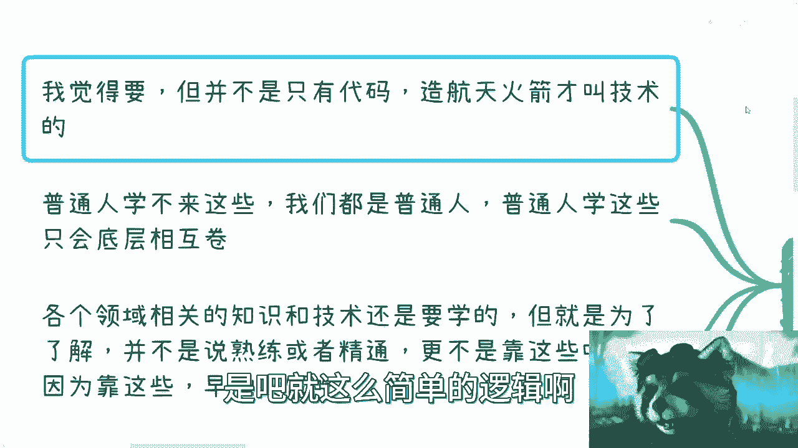

---

第二点涉及一个普遍问题。无论是B站私信还是其他平台的私信，许多问题都可以用一个标准来审视：**这件事能搞钱吗？**

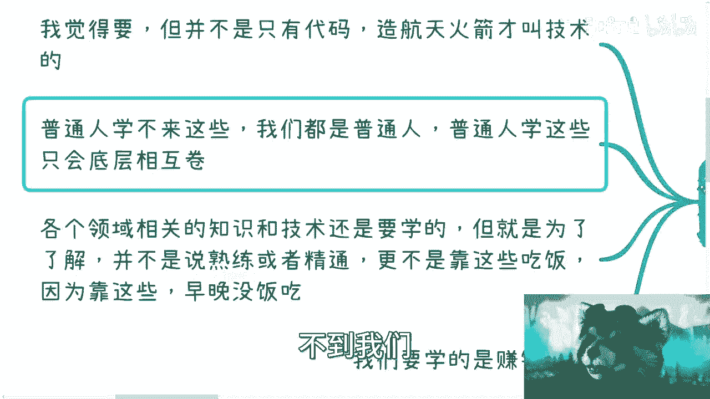

**公式：能否搞钱 = 是 / 否**

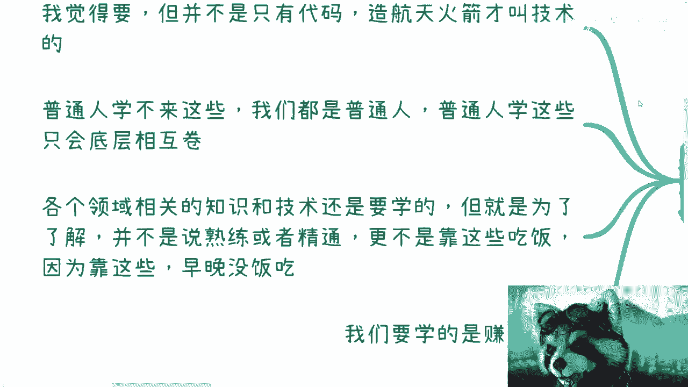

如果答案是否定的，那么就不必过多思考、焦虑或讨论。这个标准能解决绝大多数困惑。

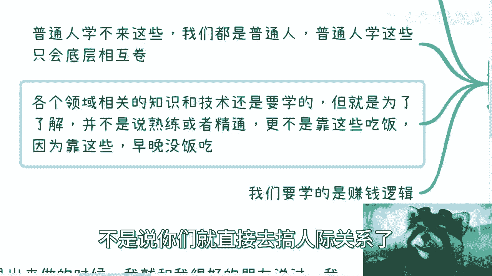

你会发现，很多问题并非源于技术不足、学历不高、缺乏工作经验或不会包装自己。

---

那么，真正的问题是什么？关键在于先问自己一个问题。这才是核心，其他都不重要。你的底线、价值观、道德观能有多低？我们来逐一分析。

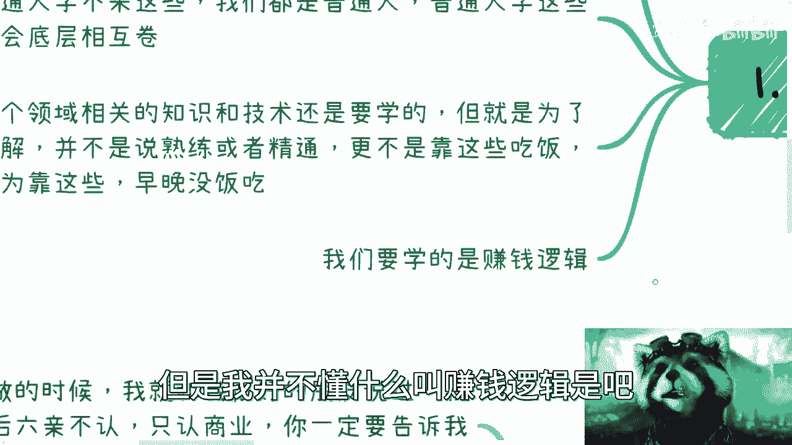

以下是关于“技术傍身”的三个关键思考：

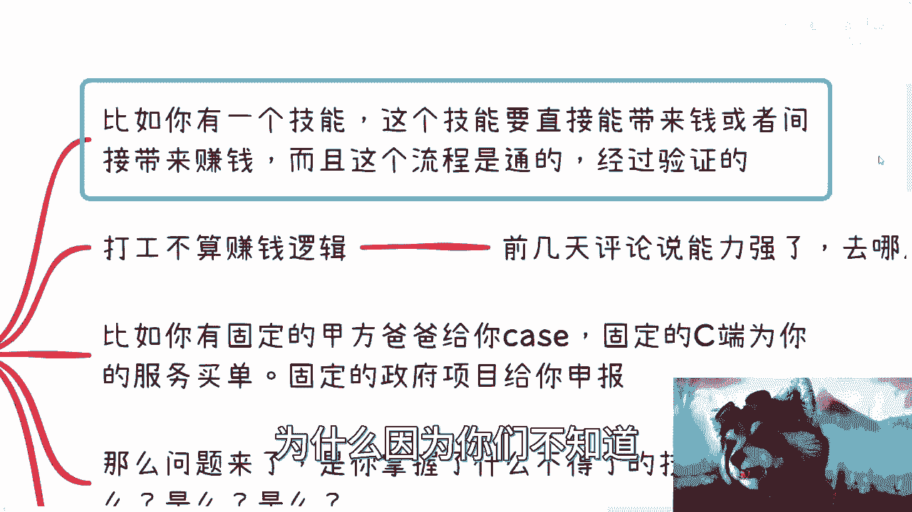

1.  **技术的可替代性**：你认为难的技术，如写代码、造火箭、研发新材料，如果别人也能掌握，那它对你、对我、对他人而言，还是高门槛吗？岗位有限，人人都会，竞争必然激烈。
2.  **普通人的内卷困境**：大多数人都自认是普通人。普通人学习通用技术，结果往往是底层互卷。我们很难学到独一无二的“屠龙之技”。这种内部竞争意义有限，因为我们的对手不应该是彼此。
3.  **知识学习的本质目的**：领域知识和技术当然要学，但目的不是为了搞人际关系，也不是为了单纯靠它吃饭。学习的目的是为了了解行业、防止被骗，而不是非要达到精通程度。靠单一技术吃饭，长远看可能行不通。

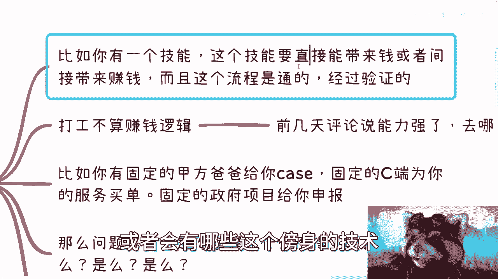

上一节我们分析了“技术傍身”的局限性，本节中我们来看看什么是更重要的“赚钱逻辑”。

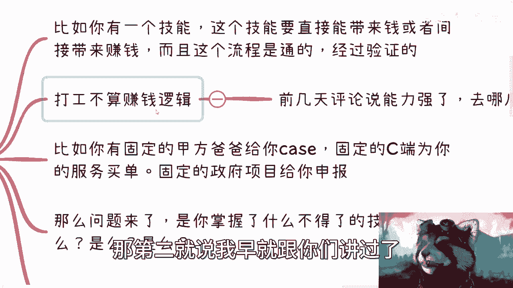

很多人虽然明白道理，但不懂什么是“赚钱逻辑”。

**赚钱逻辑**是指：你拥有的**技能**或**资源**，能否经过一个**已验证的流程**，直接或间接地为你带来金钱收入。

**公式：赚钱逻辑 = 技能/资源 -> (已验证的流程) -> 金钱收入**

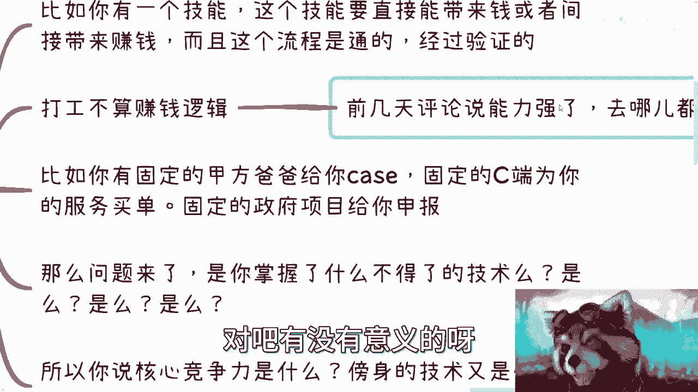

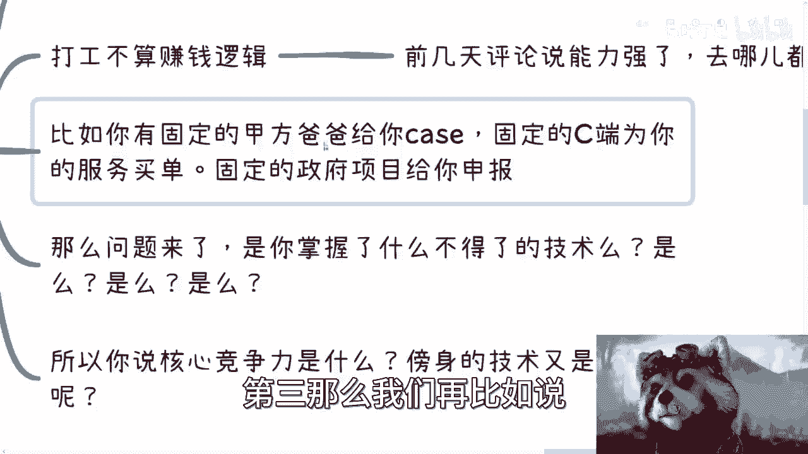

请思考：你的技能能直接带来钱吗？大部分人的答案是没有。因为能直接带来钱的是**项目**，而项目的背后是**关系**。如果你不是这个关系链条中的一环，那么你只是一个可替换的“电池”。

所以，技能不单指编程或某项专业技术。**打工本身不算完整的赚钱逻辑**。能力强的人到处都能找到工作吗？这是一种PUA话术。能力强与找到工作没有必然联系，真正能力强的人往往不愿为别人打工。

---

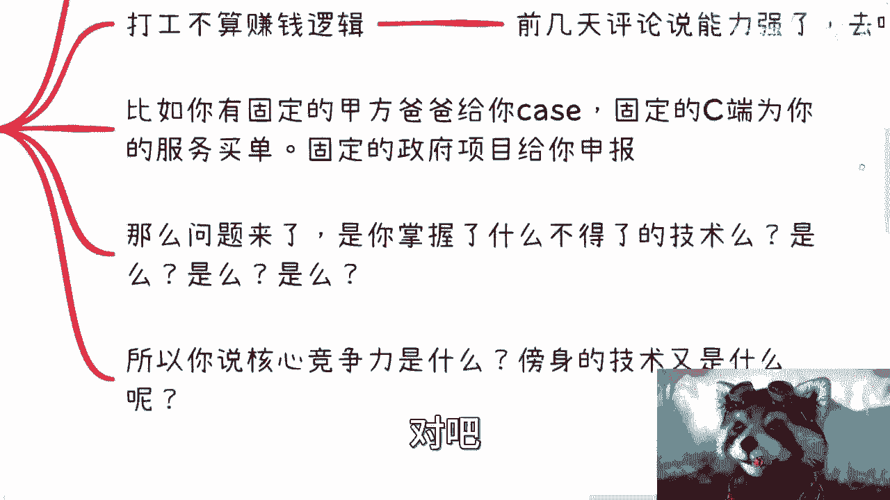

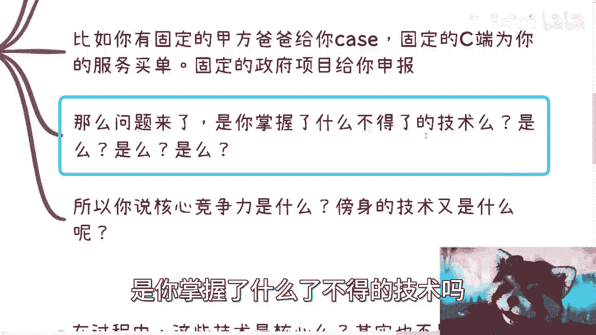

那么，具体的赚钱逻辑是什么样的呢？它通常表现为：

*   拥有固定的甲方客户，每年提供稳定的项目。
*   拥有固定的C端用户为你的服务买单。
*   拥有稳定的政府项目申报渠道。

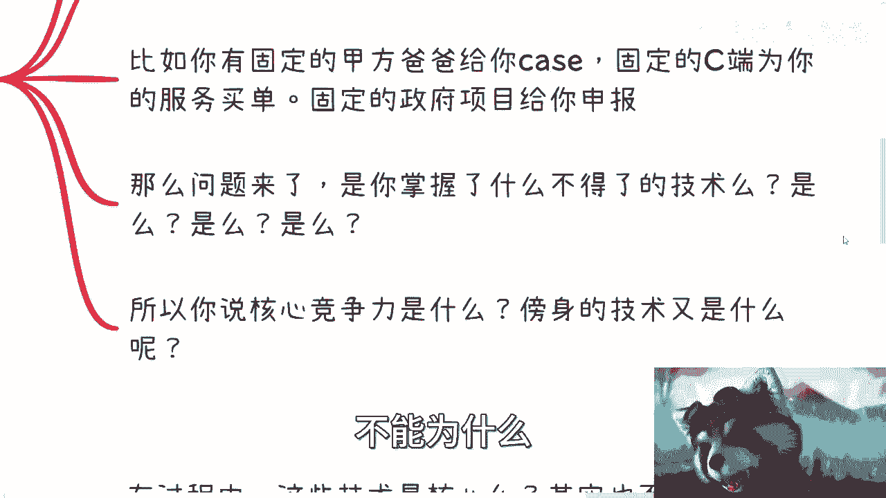

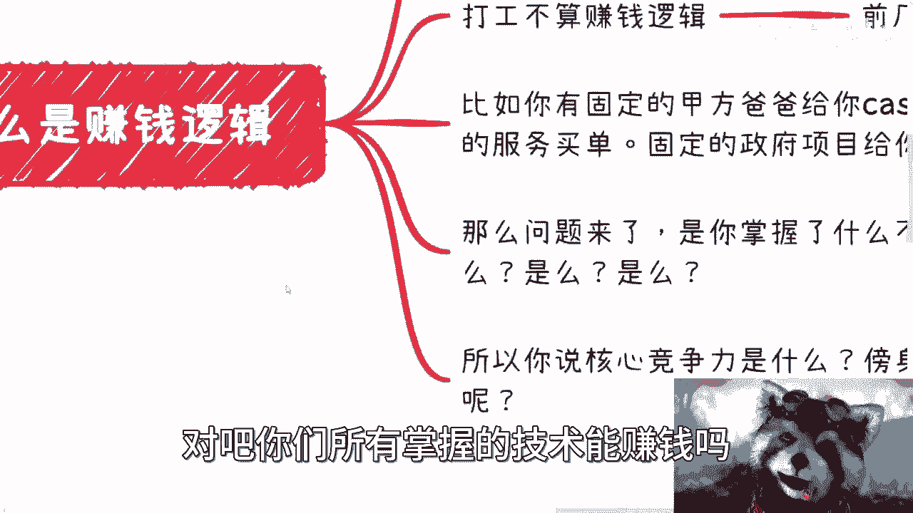

这才是属于你个人的赚钱逻辑。它的关键在于**稀缺性和掌控力**。即使客户被撬走，因为你懂得从0到1、从1到100的全过程，你依然能在别处建立新的逻辑。你的积累是为自己，而不是为别人。

---

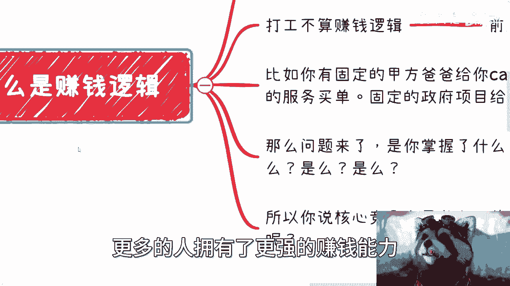

现在问题来了：你赚钱，是因为掌握了什么了不得的技术吗？可能有，但那通常不属于普通人范畴。在资本市场中，打工人如同“电池”，其价值取决于资本家的需求，可替代性强。

因此，当大家思考如何提升“核心竞争力”或寻找“傍身技术”时，需要重新审视。你精通一项技术、拥有大厂经历、做过牛项目，这让你从普通电池变成了“金霸王”电池，增强了**资本家**的赚钱能力，但这未必是你自己的赚钱逻辑。

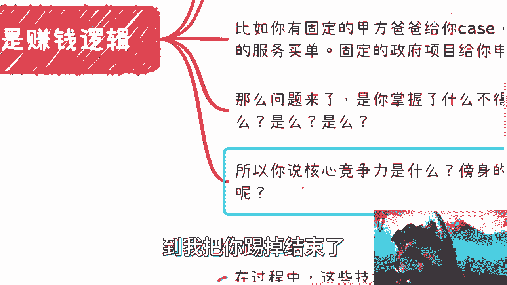

举例来说，一个项目有你的技术加持，报价能从50万提升到500万。但资本家可以只分你1万或10万，因为项目没有你也能成立。资本家会不断寻找更便宜的替代者。

---

点题了。在上述过程中，技术的核心是什么？或者说，技术是核心吗？不是。核心是那些“关系”吗？也不完全是，关系是结果。

**核心在于：你如何实现从0到1、从1到100的过程。而这个过程的底层驱动力，往往取决于你的底线、价值观和道德观有多低。**

以下是几个例子：

1.  **操作GPT知识星球**：难吗？不难。收集资料、整理工具即可。为什么很多人不做？因为他们觉得“low”，不想“割韭菜”。这是道德观在起作用。
2.  **项目申报包装**：难吗？核心难在包装，即如何将普通内容包装得高大上。为什么很多人不敢或不会？因为他们觉得不真实、是在吹牛撒谎。这是价值观在作祟。

很多人走不出第一步，总在审视自己“有什么”，发现自己什么都没有就不敢行动。但这不重要，重要的是去建立关系、去赚钱。为什么你不会包装、不会画饼？归根结底，还是道德观太高。

在商业和赚钱的语境下，过强的共情心、过高的道德感，可能是一种“DEBUFF”（负面状态）。想赚钱，可能需要适当磨掉这些DEBUFF。

当然，有人会说“好好做也能赚钱”。是的，但那是概率问题（可能是2%的成功率）。为什么要让大家去搏这个小概率事件？更重要的是，你需要为自己开辟除“做电池”之外的另一条路。

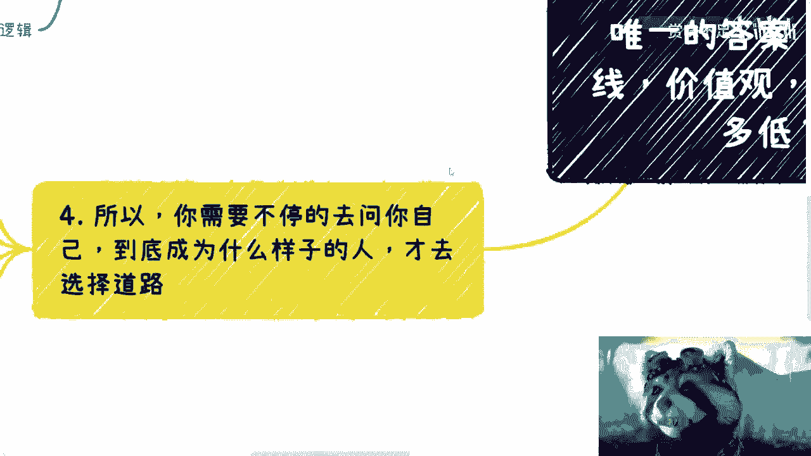

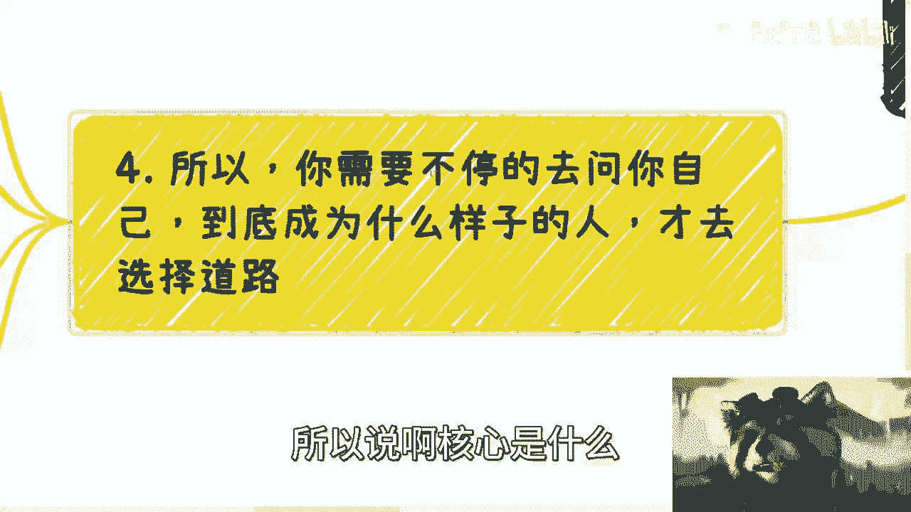

---

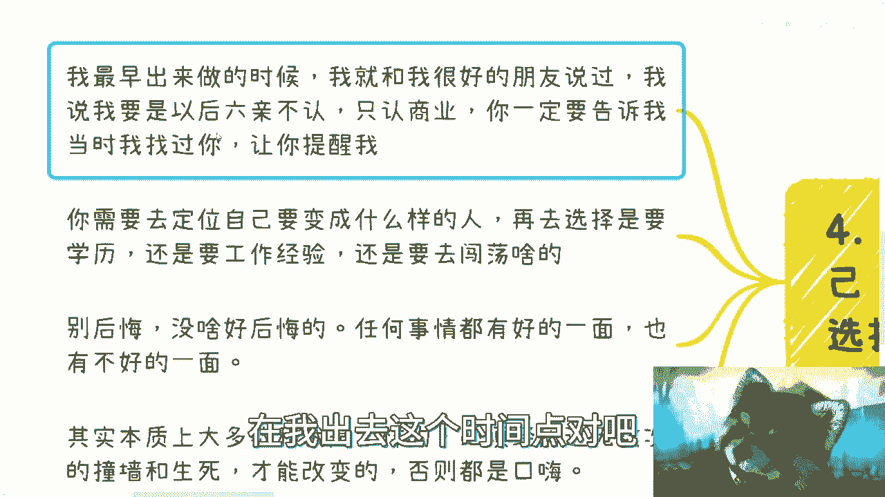

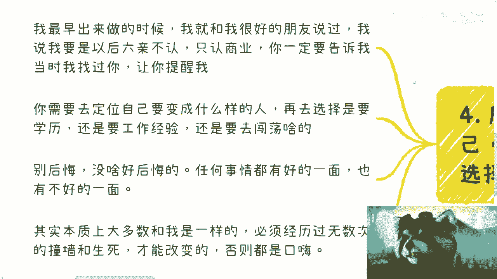

核心总结：你需要不断问自己，**你到底想成为什么样的人**，然后再选择道路。

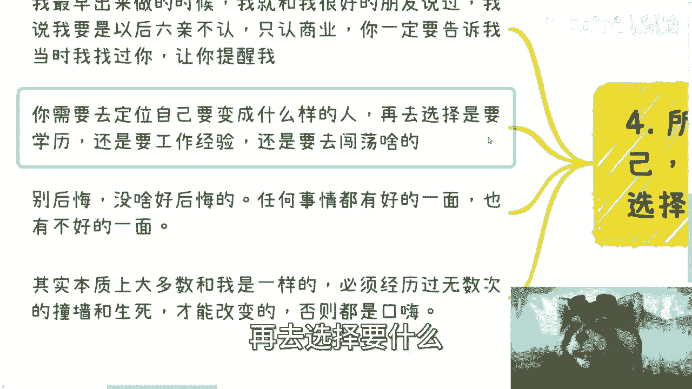

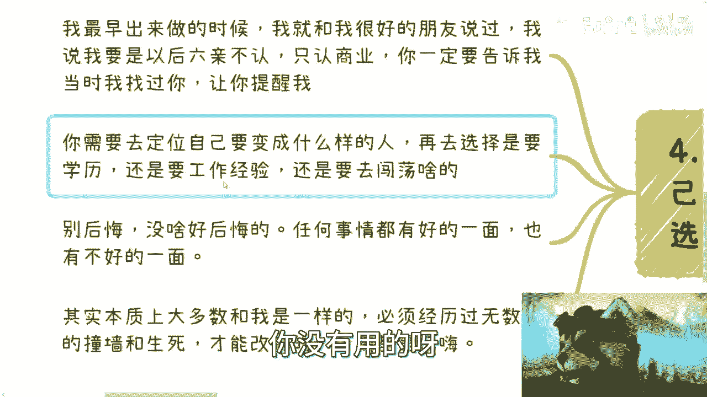

以下是三点行动建议：

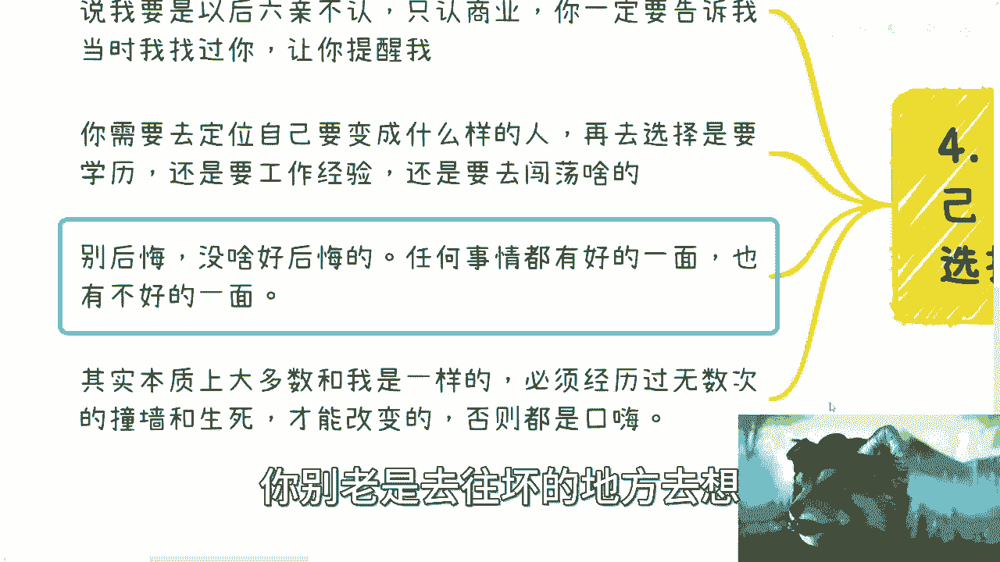

1.  **自我觉察与定位**：明确自己想变成什么样的人。例如，是更商业导向，还是保持原有风格？人的选择会变，需要自我提醒。
2.  **依据定位做选择**：根据你想成为的人，来决定是否需要高学历、丰富工作经验。如果你的价值观无法与世界的某些规则兼容，那么这些附加物可能用处不大。即使看到赚钱逻辑，你也可能因为底线高而不愿做。
3.  **无悔选择，积极实践**：任何选择都有利弊，过程中总有成长。不要只往坏处想。大部分改变源于实践和无数次“撞墙”，直到无路可退才会真正改变。仅看视频或被骗钱，都无法带来根本改变。

最后需要强调，这不是非黑即白的“二极管”思维。**放低底线、价值观、道德观，并非要将其彻底击穿**。你可以保留心底最后的善良和底线，但在一定范围内，必须勇于尝试和实践。

想要做慈善、成为理想中的人、为社会做贡献，这都没有问题。但前提是，你需要先理解现实世界的运行规则，研究真实成功的案例，而非仅仅相信鸡汤。观察那些存活多年的企业，其发展历程往往伴随着复杂的商业抉择。

所有外在的东西可能都不如想明白这一点重要。结合当前的经济环境（如裁员、房价波动），更需要厘清个人发展的核心。

---

**本节课总结**：我们一起探讨了职业与赚钱中的核心问题。我们分析了“技术傍身”的局限，定义了“赚钱逻辑”的本质，并最终指出，个人**底线、价值观和道德观**的弹性，往往是实现从0到1、建立自身赚钱逻辑的关键内在因素。真正的改变源于清晰的自我定位和持续的实践。