# 底线、价值观、道德观才是核心问题 - P1 - 赏味不足 - BV1Vg4y1c7Fp

好啊，今天礼拜三是吧，首先啊我们来看啊，今天我们来换个说法啊，这个我讲这个，在这个内容上面跟你们讲透一点是吧啊，首先是这样子的啊，确实很多人也评论区在跟我讲对吧，这个核心的问题在哪在哪。

我就这么跟你们说啊，核心问题不是我不说，核心问题是我说了，很容易被人找是吧啊就是我也知道，而且你们也不用担心说啊，我这个账号或者什么情况会没有对吧，这个也不太可能边界我摸得很清楚，为什么。

因为从以前到现在，本来就是常客啊，所以我很清楚底线在什么地方对吧，学生这第一点，第二点是这个很多人呢，这个你们也没有真正的跟对吧，所谓的制度打过交道，所以你们也别来这个跟我讲，什么核心不核心的问题啊。

不是我不说啊，只是我不想给自己带来不必要的麻烦是吧，第二点是什么呢。

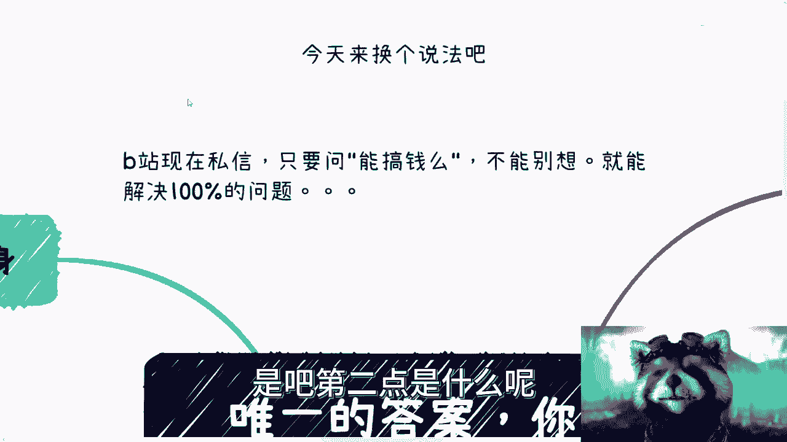

就是B站现在私信呢，我跟你们讲啊，不要说B站现在私信，所有的私信都只要都都能用这个问题来解决，是什么，我就问你能搞钱吗，不能你就别去多想，别去焦虑，别去逼逼，是不是我跟你说这件事。

这个这句话你能解决百分之百的问题就结束了，所以你会发现啊，就是很多问题是你们不懂技术吗，很多问题是你们说我要读个研或者怎么样，很多问题是说你们现在年轻没有工作经验吗，还是说很多问题是你们不会包装。

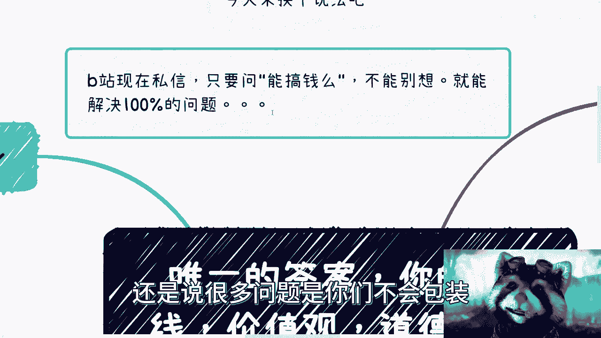

这个是问题吗，不是你知道吗啊问题在哪儿呢，先问自己这个问题，我觉得这个才是核心，别的都不重要，底线价值观，道德观你能有多低是吧啊，我们来说一个个说。

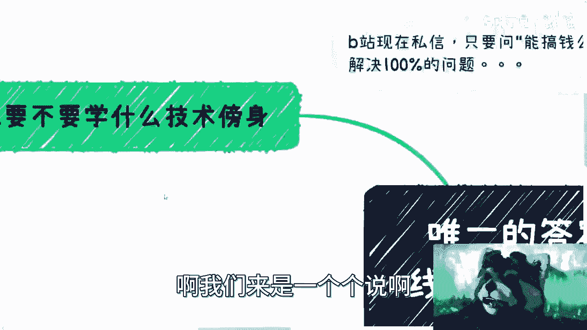

首先这个有人问啊，他说我要不要学什么技术傍身对吧。

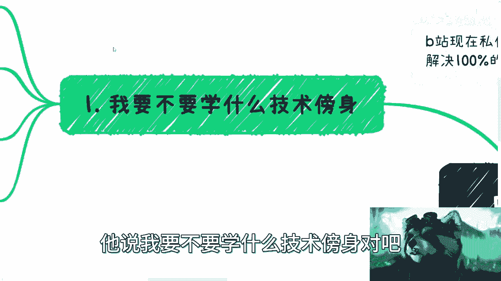

这个是很多人问的问题啊，是这样子的，你要我觉得难，并不是说你只有写代码啊，造航天火箭，造新能源电动车材质技术对吧，或者我们换句话来说，你今天能造，我也能造，那我请问嘛这个东西对你来讲是门槛。

对我来讲是门槛，对别人来讲是门槛吗，不是吧，对不对，那好那么有一个最简单的逻辑，就是说你会的东西我也会，我会的东西别人也会，那最终岗位就那么一些，那请问到底是我们去还是就我去，还是你去爱别人去。

那就算是你去，那终究还有一些人是找不到这些岗位的，那我就请问你怎么办是吧，就这么简单的逻辑哦。

你就告诉我那是不是说你就自己问你自己。

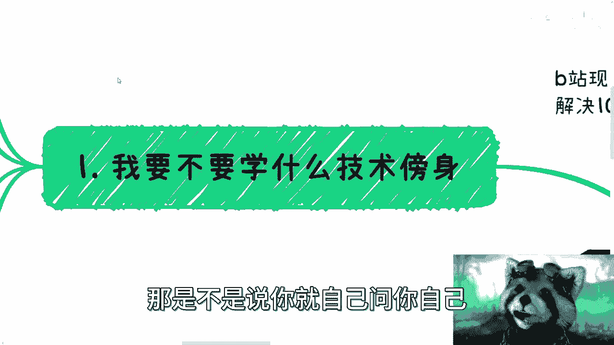

是不是说你今天有技术傍身，你就一定能找到工作，一定能赚到钱是吗，不是吧对吧，就我觉得很多逻辑大家是想的明白的，之所以想不明白，就是因为自欺欺人，自己想用一个理由来说服自己，仅此而已，但仔细想想。

其实也知道这个理由站不住脚，是不是。

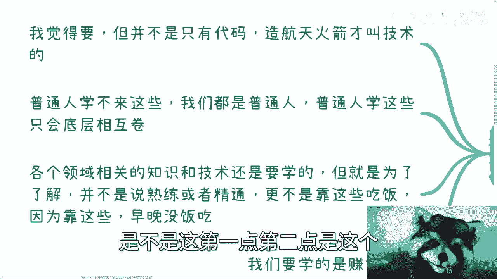

这是第一点，第二点是这个你们所有人都标榜了普通人，那么我们就来说普通人学不来这些对吧，我们都是普通人，普通人学这些只会底层相互卷，你明白吧，就一方面是我们也学不到，我们也本身也做不了什么很高大上的技术。

我相信B站现在能看到这个视频的对吧，包括平时会来找我的，我不我相信大家，这个我对大家是有信心的，但是我相信大家本身，这个客观的来讲，也不是说就一定能学到一些什么屠龙之技对吧，或者说就是只有你学得会。

别人学不会的，本来就很少是吧，那么我们说普通人学这些，你你最终是什么，就是你跟我打，我跟你打，那我就请问意义在什么地方呢，对吧，我就想问我们的敌人是我们吗。

是吧对吧，这个是第二点，第三点是各个领域相关的知识跟技术，你说要不要学，我认为是要学的，不是说你们就直接去搞人际关系了。

没有用的对吧，而且人际关系，最终说到底是要跟这个东西有关系，那那那这个东西对吧啊，那就是说本身呢这个领域跟相关知识呢，是为了了解啊，是为了说你们在一些硬性东西上面，不不被骗是吧。

你该了解还是要了解的对吧，并不是说你一定要熟练或者精通，更不是说你要靠这个东西去吃饭，因为靠这些东西早晚会没饭吃，哎呀你说昨天还有个评论区，搞笑来了，跟我讲什么，说哎呀，这个我们我们这个也要看行业的。

有的行业硕士很牛逼的，有的行业不是很牛逼的，是是很牛逼的，你往后坐呗对吧，你牛逼牛逼又不是又不是你毕业生或牛逼牛逼，你又不是往后坐看看，你做到三四十岁是不是牛逼是吧，哪个行业不卷啊啊，没有区别了。

没区别的呀，对吧就是我早就跟你们讲过了，我看问题永远是从长远的时间轴来看的对吧，你们但凡拿节点来看。

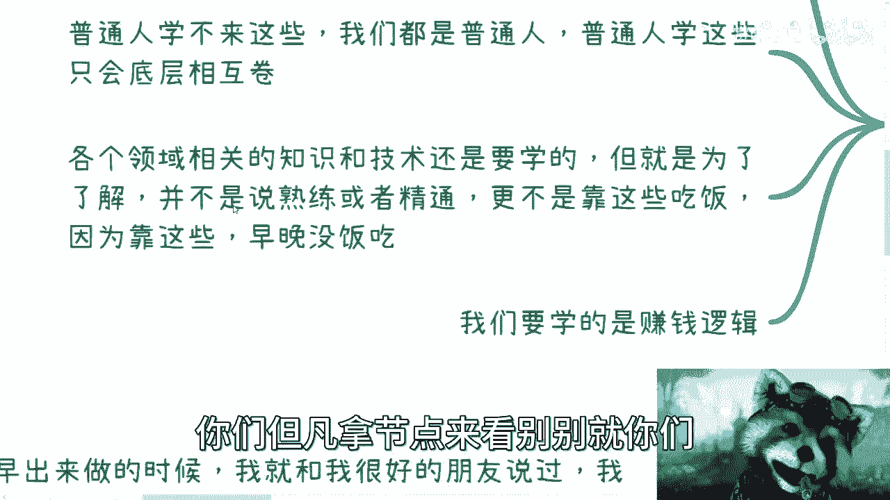

别别就你们你们该去PV别人，PV别人对吧，你别到我这里来修这个优越感没有意义的，对不对，所以说呢我一直跟你们讲。

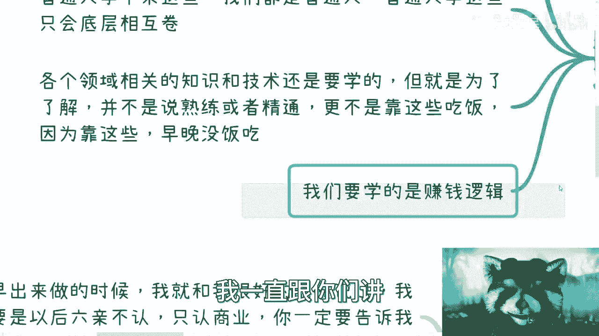

我们要学的是赚钱逻辑对吧，那小伙伴也有很多人说，那我虽然懂也懂对吧。

但是我并不懂什么叫赚钱逻辑，是哈哈，没问题，我们就往下讲啊，什么是赚钱逻辑，比如说你有一个技能。

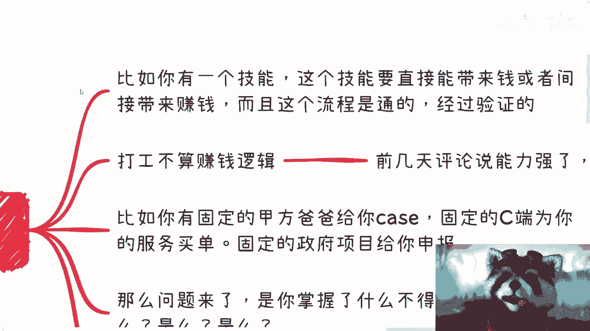

这个技能能不能直接给你带来钱，就问你，你知道这个技能能不能直接带来钱，或者剑姬带来钱，而且这个流程是通的，经过验证的，那么这个就叫赚钱逻辑，你们自己想想看有吗，没有大部分都没有，为什么。

因为你们不知道对吧。

你说你今天你今天怎么做航天航空对吧，做化工材料做开发对吧，做那个土木对不对，你自己想想看嘛，你的技能能直接带来钱吗，不能吧，能直接带来钱的是什么，是项目，项目的背后是什么，是关系对吧，那你能直接带来吗。

不能你能间接带来吗，也不能，因为你不是这个里面环节的一部分，你只是一个电池对吧，所以你说什么才叫技能，是一定说会编写现实写代码，或者会会有哪些这个东西，或者会有哪些这个傍身的技术才叫技能吗。

不是对不对，那第二就是说我早就跟你们讲过了。

打工打工不算赚钱，逻辑对吧，包括前两天还有人跟我说，他说能力强的去哪都能找到工作，是这句话叫什么，这句话就叫做PUA，就叫做没有接受过社会的毒打，能力强，什么叫强啊，世界上能力强的人多了去了啊。

能力强到哪都能找到工作是吗啊，我我说不好听点，我身边能力强的多了去了对吧，这35岁，40岁找不到工作的就比比皆是啊，当然了，我还是那句话，你能力强，你的确能够在很多地方赚钱，但是并不代表你真的找到工作。

而且你真的能力强，我相信你不会想去找工作对吧，就这么回事，谁愿意给别人去打工啊啊，谁愿意自己做一些事情，不是为自己做，不为别人做，还要看别人眼色，你但凡能力强，你会吗，我不相信是不是这莫名其妙嘛。

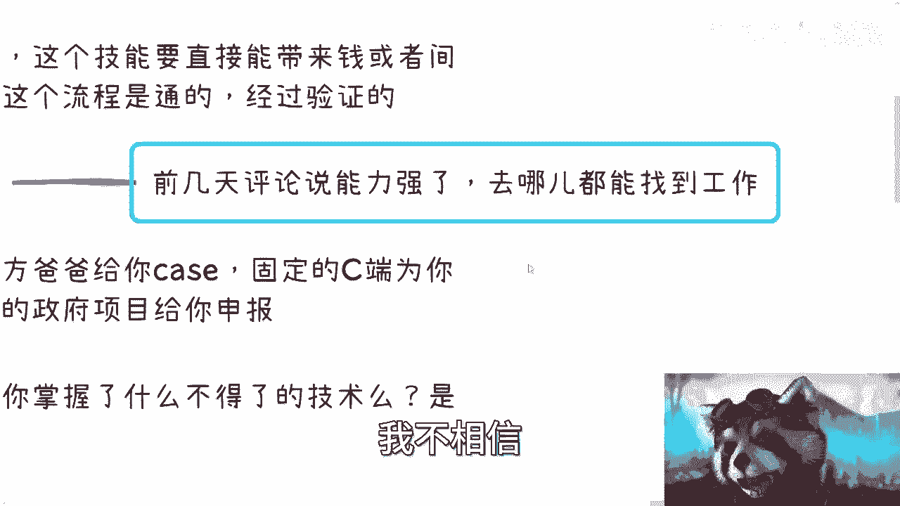

这不是对吧，而且我跟你讲，你的岗位多高，你今天就算是个100万的总监，200万的总监，你别觉得你岗位高，你薪资高，你就好像有有很强的这个叫什么话语权，没有的，我告诉你们，你知道吗，就是你所谓强的话语权。

只不过你只你只能去PV你的下属，你对上你还是一个电池，你还是只能被别人压，就往死里压对吧，然后24小时on call，你还能干什么对吧。

有没有意义的呀，第三。

那么我们再比如说你有哪些哪些赚钱逻辑呢，比如说你有固定的甲方爸爸给你kiss，比如说每年有两个kiss给你对吧，固定的C端为你的服务买单对吧，固定了政府项目给你申报，这个叫赚钱逻辑，这个叫你的赚钱逻辑。

不是别人赚钱逻辑，这就好像今天你能做这件事情，我能做吗，我可能能做，但是我做不了你所做的东西，也就是说比如说你今天在成都，你今天在海南能做，我能做吗，我做不了，因为这是你的关系对吧。

很多东西都是讲究先来后到的，那当然就算那个整个商业当中，会出现非常多的对吧，尔虞我诈会出现非常多的跳单，我今天就算把你的kiss撬了，把你的甲方爸爸撬了，你依然不会受到什么影响，为什么呢。

因为你懂得0~1，你懂得1~100，你就算在这个地方有问题，你依然会在别的地方能够找到，属于你的赚钱逻辑，这其实都是通的，没有区别的，对吧。

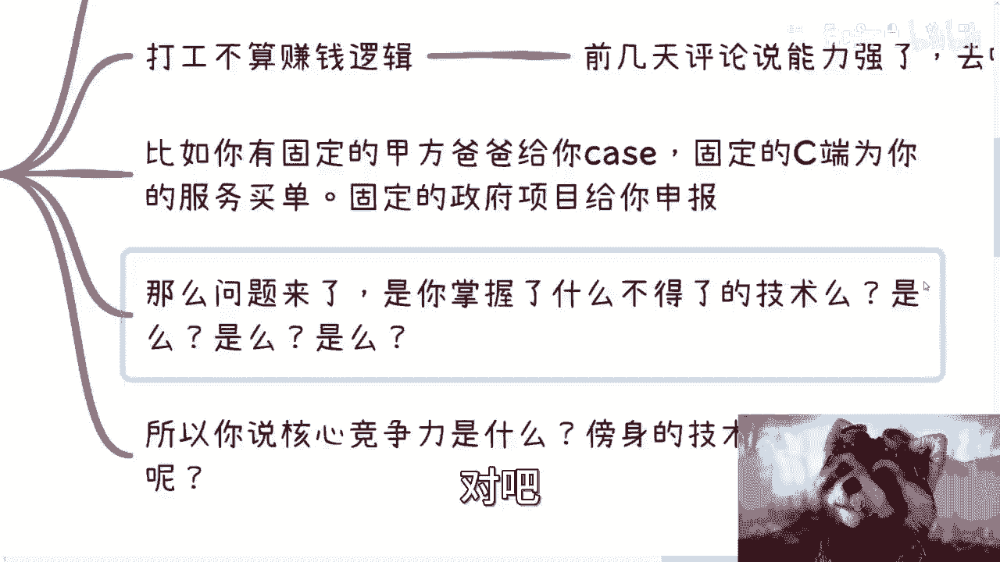

那最多就是说赚多赚多赚少的问题，但是你的积累你的时间，你的付出的精力都是为你自己啊，不是为别人对吧。

那么问题来了，你想想看，你掌握的是是你掌握了什么了不得的技术吗。

我就问你是不是对吧，就是就什么意思，就是说赚钱的逻辑里面。

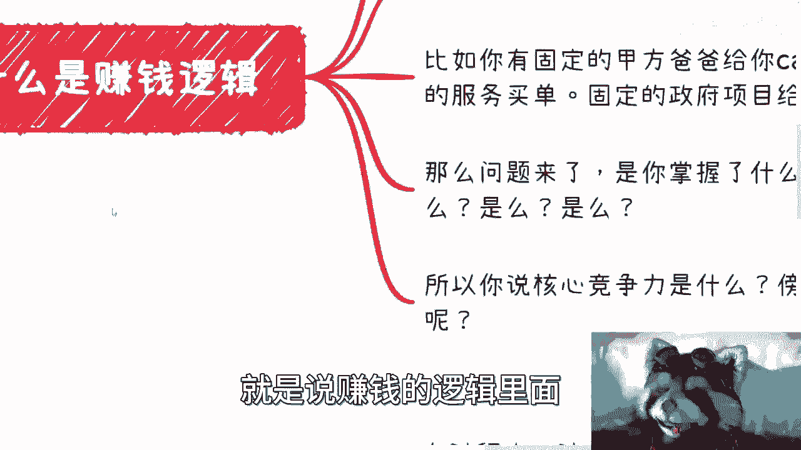

是不是因为你掌握了什么了不得的技术，所以你赚钱了有吗，有但是是普通人吗，不是我们去看，我们不用去关心这个东西，没有意义的，你知道吗，就是因为整个这个事情从资本市场，从商业市场已经很明了的事情了。

所谓技能，所谓的打工人就是电池对吧，就是我今天心就咱们就说的不好听点，今天资本家心情好一点，给你多赚点，今天资本家心情不好，就他妈往把你往死里压，你能反抗吗，你能说个不字吗，不能为什么。

因为后面排队人多的是，对吧。

你们所有掌握的技术能赚钱吗，不能，所以说你会发现我们说你就是大家都关系哎呀，我这种怎么提升自己的核心竞争力对吧，所有人咨询我说都有问这个问题啊，他说我们怎么提升核心竞争力，傍身的技术是什么。

你们自己想想看，你们的核心竞争力跟傍身的技术，真的是你们原本想的那些东西吗，因为我知道很多人想的核心竞争力跟傍，傍身技术是什么，就是我要把一个技术学精学透啊，我要这个很牛逼对吧，核心竞争力是什么呢。

就是我们去过很多大厂对吧，我来了这个这个做过很牛逼的项目对吧，怎么样子，但你们想想看。

这是嘛，这个是你们赚钱的逻辑吗，对吧，就我只能说，你今天从一个普通电池变成了金霸王对吧，你呢是让更多的资本家，更多的人拥有了更强的赚钱能力。

赚钱逻辑，但这个赚钱逻辑不是你啊，那我退1万步来讲，我再给你举个例子，今天对吧，我要去包装个项目，可能没有你对吧，这个项目只能包装50万，有了你卧槽，牛逼了啊，这项目能报500万啊，但是我今天心情好。

我就给你10万，我心情不好，我就给你1万，怎么了呢。

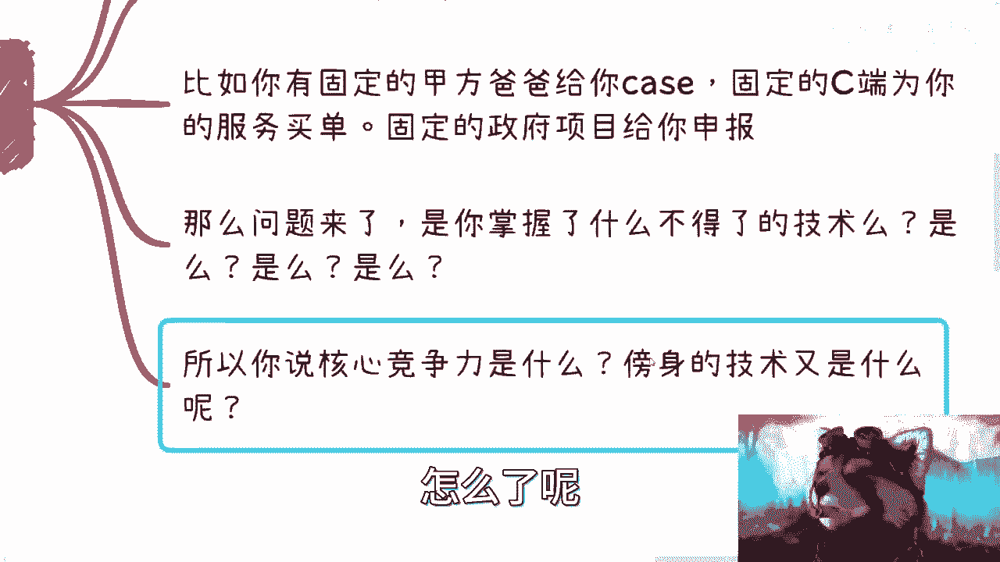

怎么了呢对吧，因为对我来讲是什么，对我来讲就是这个项目原本就能报50万啊。

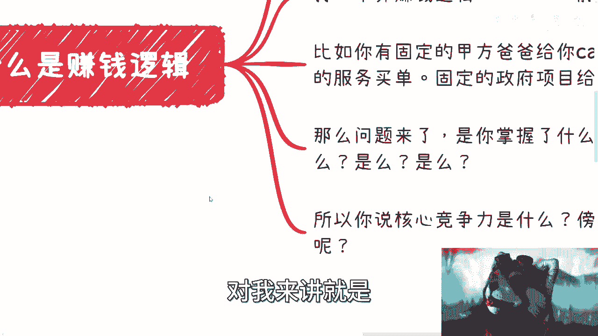

有没有你我也能赚点钱，有了你我能赚更多的钱对吧，而且我很清楚，有了你之后，我会全是全世界去找替代你的人，知道找不到就找你，找得到，我把你踢掉就结束了。

就这么简单，怎么来了，有什么问题呢，是不是。

好那么第三讲啊，你点题了。

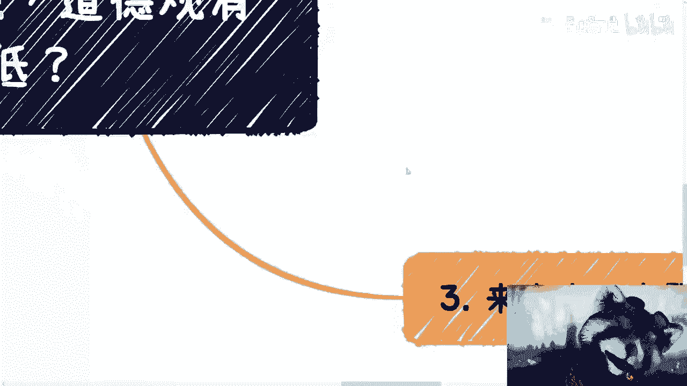

点题了啊，在这个过程中，你们想想看啊，技术的核心是什么啊，或者说技术是核心吗，不是对吧，核心是什么，核心是那些关系嘛，也不是因为那些关系是结论，核心是你如何从0~11到100达到那个结论。

那么核心是什么，就是你的底线有多低，道德观有多低，价值观有多低，对我们举个例子，比如说GBT的知识星球，我就问你们做一下难吗，不难吧啊，就就到处是这个把那些有的没的这个论文，有的没的工具往里面扔。

难不难不难，为什么很多人不足对吧，因为他底线够高，他道德观够高，价值观够高，他的道德观跟价值观跟他说，哎呀我不想做这么low的东西，我不想去割韭菜，对不对啊，难吗啊，第二个，很多项目申报很难吗。

为什么那么多人不敢申报，不知道怎么申报，我跟你讲很多项目申报难吗，不难难在哪里，难在包装对吧，难在你怎么把一个就是我们说的可能不好听点，把一坨屎包装成一个精子对吧，这个就是你要去做的。

但很多人为什么不要啊，就是因为觉得哎呀这个好像很不真实，对吧，哎呀我怎么能吹牛奶对吧，我怎么能撒谎呢对吧，我这做不出来就做不出来，你怎我怎么申报法，是的，所以这不是还是你的道德观作祟吗。

还是你的价值观作祟吗，所以你赚不到钱，对不对啊，那么很多人也要说了啊，我就说，为什么很多人走不出这个最艰难的第一步对吧，主要我跟你们说，主要你们还是在看自己，在那边审视，说我到底有什么对吧。

发现我什么都没有，所以不敢走出第一步，但这个重要吗，不重要，因为什么，因为重要的是要去达成关系，重要的是去赚钱，重要的是你有什么吗，不是对吧，那为什么你不会包装，你不会去所谓的画饼呢。

那还是你的道德观太高，对不对，所以啊我在这个地方跟你们说的很清楚，很多人呢觉得自己很善良啊，自己是一个共情很强的一个人啊，自己是个是个好人，哎呦我的写错了啊，少个字是吧啊，这是个好人啊，这是个报复。

但本质上从赚钱上来讲，从商业上来讲，这就是DEBUFF，而且DEBUFF的就非常到底的DEBUFF，你知道吗啊我跟你们说，你们只要想赚钱，早点磨掉这些DEBUFF，早点才能赚钱啊，那很多人我相信啊。

说到这儿呢，这个有些有些人对吧，我的竞争对手对吧，或者那些这个叫什么，看似很不要脸，但是没什么level的人对吧，肯定又要说了，他驴老师啊，你这价值观就不对对吧，你怎么能跟大家说这些东西呢，对吧。

他说我好好做就不能赚钱吗，能没毛病可以，你当然可以能赚多少呢，你能赚多久呢对吧，你你有多少事情是你自己能把控的，命运在你手上吗，都没有，那为什么要做对吧是吧，我觉得这是第一点。

第二点是你要说能不能赚到钱也可以，但这个是概率问题，如果按照现在的说法的话，98比二对吧，98比二，那我觉得你好好做能不能赚到钱，能可能就那么2%的概率，那为什么要让大家去搏这个概率呢，没必要的。

对不了，那有很多人也要说了，他说那我我这98的概率就一定能赚钱吗，当然也不是，但是你至少得要去尝试啊，你都要至少得要去做，你去试试看呢对吧，你你可以为自己除了电池的这条路，另外再去开辟一条路啊。

能不能做，看你自己的命啊对吧，看你自己是不是能能把你的这些点部分拉掉啊，否则你我就说嘛，你们非要标榜普通人，大部分人从这个这个切入点去切对吧，那没有办法了，这是我告诉你们唯一的方法，没有别的方法了。

对不对，你们但凡在那些市场上看到什么几万块钱对吧，什么每个月干嘛能赚多少钱呢，这不都是割韭菜吗，有区别的没有区别的呀对吧。

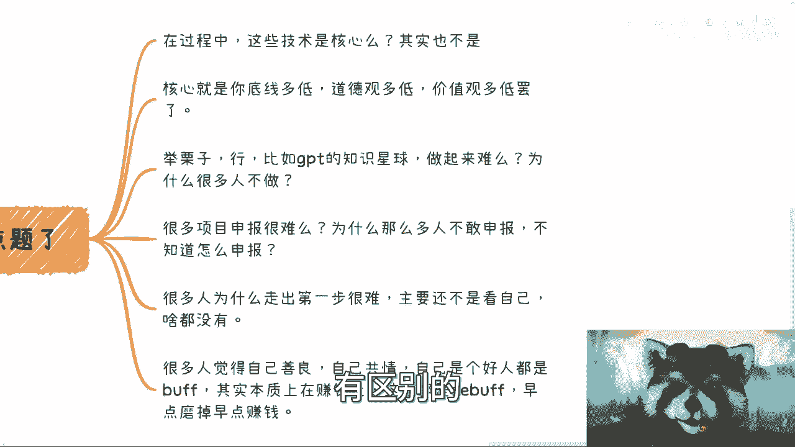

只不过换个地方做电池呀。

所以说啊核心是什么。

你需要不停的去问你自己，你到底要变成什么样的人，再去选择怎么样的道路，你知道吧，就是你比如说我最早出来做的时候啊，我就跟我的小伙伴说过，我说我要是以后认六亲不认对吧，只认商业的，我说你一定要告诉我。

在我出去这个时间点对吧。

我找过你，让你提醒我对吧，因为人是会变的很正常嘛。

是不是啊，这是第一点，第二点是你需要去定位自己变成什么样的人，再去选择要什么。

就是是不是要学历，是不是要工作经验，是不是要去闯荡，因为你自己如果没有办法把你的底线，把你的价值观就很好地融入到这个世界的规则，那么你要这么高的学历，要这么多的工作经验有什么用呢，你没有用的啊。

我今天就算让你发现了非常多的赚钱逻辑，你也不愿意赚，你也不想去做，为什么，因为你的底线不够低，你知道吗啊，然后第三点就是说你做任何选择，你别后悔，没啥好后悔的，任何一件事情他总有好的一面，不好的一面。

你做的过程当中总有成长的，你别老是去往坏的地方去想。

你知道吧啊，所以呢我觉得大部分人啊本质上跟我是一样的，想要去改没有用的，你必须自己去实践，必须经历过无数次的撞墙对吧，然后你觉得你自己活不下去了，你才会改变，你知道吗，否则都是口嗨没有用的。

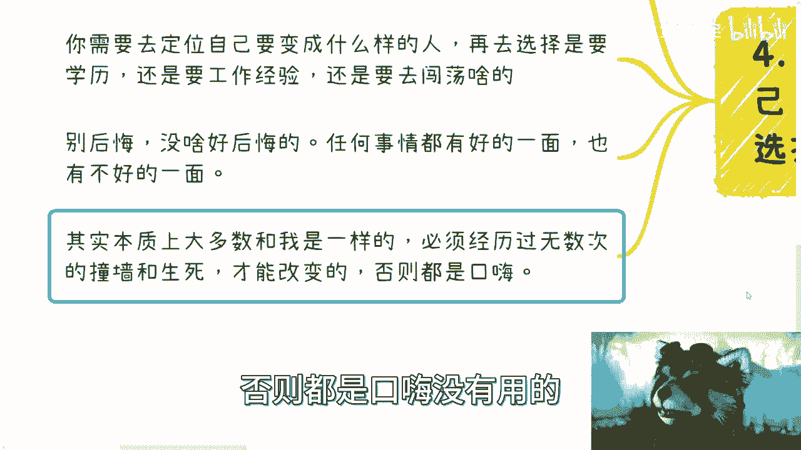

你去看我这个视频，你去花个几万块钱都没用的，你今天就算被骗了，骗得倾家荡产，你也不会改变，为什么，因为你只是被骗，你没有真正的去实践自己，去明白到底是就是，比如说你每一次离这个终点可能又又近了一步。

但是你会发现诶，我为什么没有触达到这个终点，就是因为我可能还是心态软件，我可能价值观还是太高，我的道德底线还是太高，对不对，那当然啦就是我觉得任何事情啊，还是那句话，不是二极管的，就是不是只有好和坏。

不是只有对和错的对吧，我跟你们说，你们要放低你的底线，放低你的价值观，放进你的道德观，不是说你们要把你们的底线，价值观，道德观击穿对吧，而是说你可以保留你最后的那一点善良，你保留那一点底线。

剩下的在一定范围里面，你要去做对吧，你要去你要去尝试啊对吧，哎呀就我觉得啊，大家一定要明白一个道理是什么呢，就是你们想要做慈善，你们想要做自己想要变成的人，你们想要去干一件什么事情。

你们想要为这个社会做出贡献，没有问题，但是前提是你们得要先明白，就是你们先要去看到已有的很多成功的案例，一起经历过很多过程，而不是从那些新闻联播，或者在各个东西上面去看到那些鸡汤。

而从而觉得哦原来别人是这么成功的是吗，不是对吧啊，我说你们自己想看任何一家企业，任何一个这个这个叫什么大的企业也好，中小型企业好人做很多年的，哪个一开始到今天为止，你看到哪个有底线高的。

哪个价值观的道德道德观高的有吗，没有啊，都他妈是毫无底线，毫无价值观，毫无道德观的，对吧啊，什么都没有，是不是本来就这样子啊，好吧，那么这个呢我觉得大家就想明白好吧。

真的想明白就是所有东西其实都不重要啊，我觉得这些才是最重要的好吧，最近裁员也比较多对吧，大家也看到了，杭州房价肯定是绷不住了对吧，想都不用想的，后面就还没到底对吧，反正后面还会陆续还会有这个早晚的事情。

就这么着吧好吧，然后你们反正就有什么细节问题，如果跟你们的个人啊发展经历啊，性格啊对吧，高包括已有东西啊，如果有有一些细节问题的，反正你们到时候再私信我吧，好吧。

