# 课程一：数字经济合集开篇与核心思维 🚀

在本节课中，我们将开启“数字经济”系列合集的第一讲。课程将首先介绍创建这个合集的目的，并重点阐述在理解数字经济乃至更广泛的社会议题时，需要建立的三个核心思维原则。这些原则是后续所有讨论的基础。

## 合集介绍与内容声明

我创建了一个名为“数字经济”的合集。后续我会将个人对数字经济的理解，以及观察到的一些相关现象和内容放入这个合集中。

需要明确的是，合集内的观点仅代表个人见解，并不保证完全正确。请大家自行判断和思考。

## 三个核心思维原则

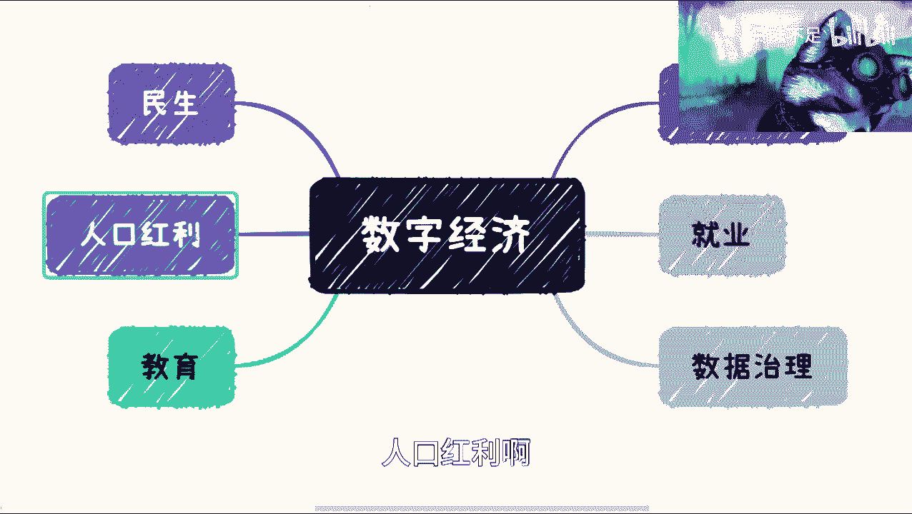

在深入探讨具体内容之前，我认为有必要先建立三个基础的思维框架。以下是这三个原则的详细说明。

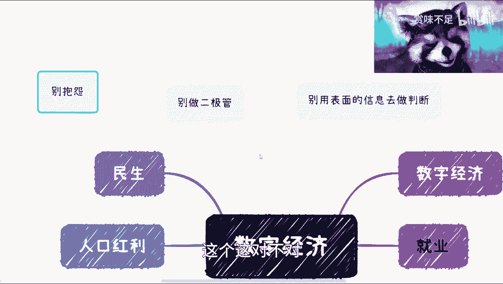

### 原则一：避免二元对立思维

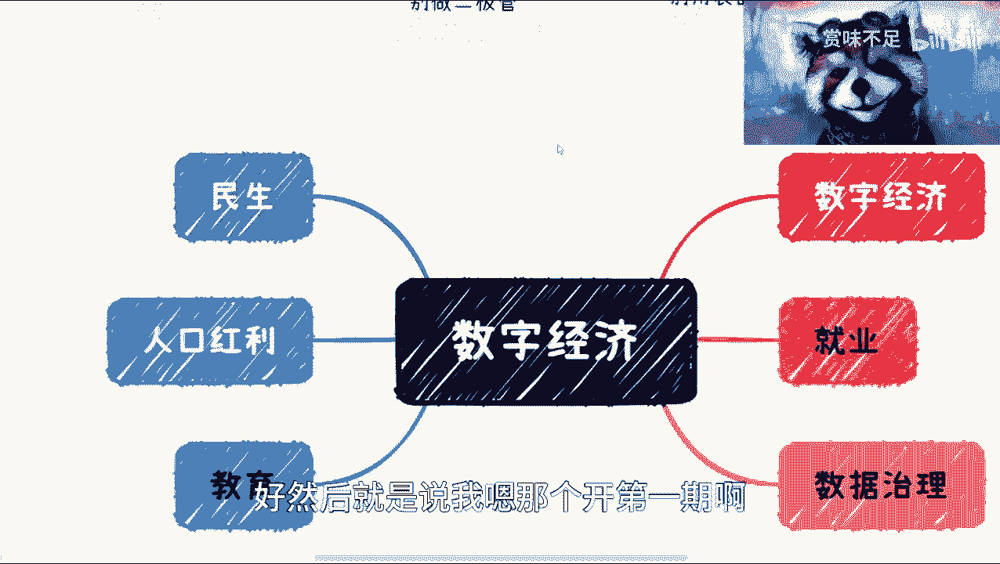

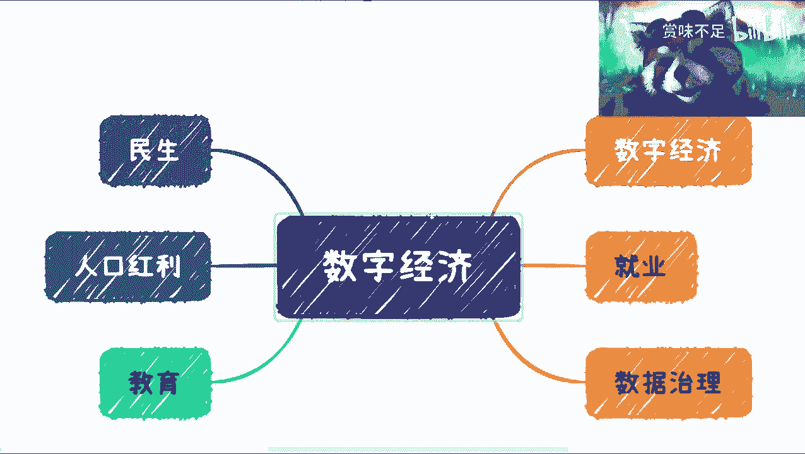

世界并非只有黑与白，也不是简单的0和1。在做任何选择时，如果只给自己“要么选A，要么选B”的非此即彼选项，最终很可能会后悔。

正确的做法是，综合判断多方面因素后再做出选择。

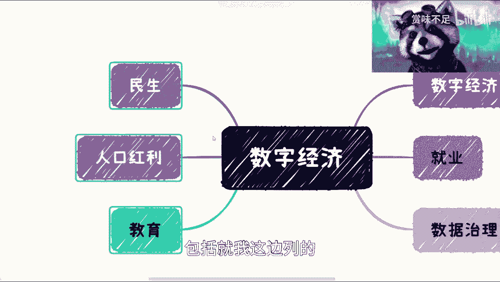

### 原则二：拒绝依据表面信息做判断

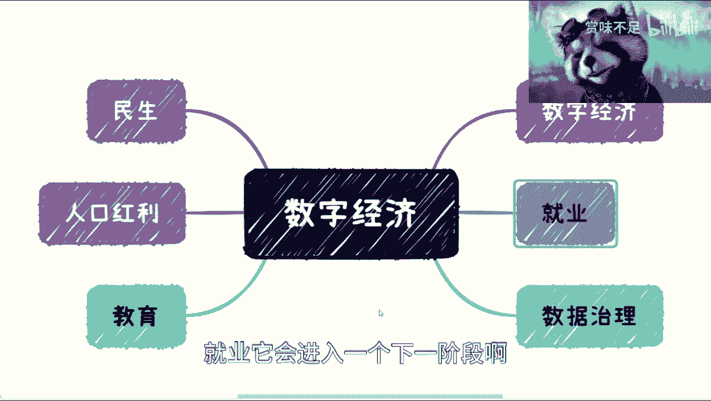

我注意到很多人在评论或私信中提到觉得某个事物不行，但当我追问原因时，他们往往只能给出基于表面信息的看法。

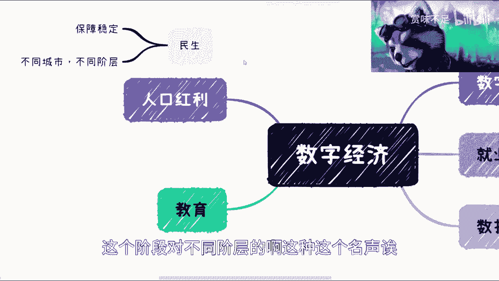

所有事物都不应仅凭表面信息来判断。如果无法接触到深层信息，就更不应该用浅层信息做判断，否则得出的结论很可能是错误的。

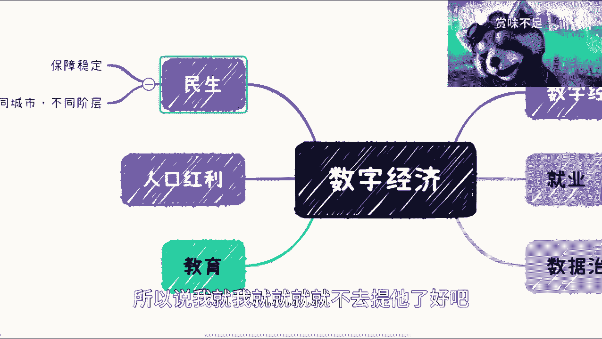

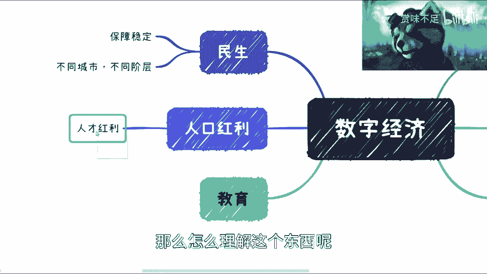

### 原则三：停止无意义的抱怨

不要总是抱怨这个不好、那个没用。在采取任何重大行动（例如移民）之前，你需要思考一个关键问题：如何顺势而为？

很多人会问红利期、机会或势能在哪里。答案是，必须观察政策、看清趋势才能发现它们。势能不是个人能凭空创造的。

认清自己的身份和位置，顺应大势而行。

---

上一节我们确立了理解问题的基本思维原则。接下来，我们将基于这些原则，初步探讨数字经济及相关领域在未来可能进入的“下一阶段”发展。

## 数字经济与相关领域的“下一阶段”

根据对近期政策方向的观察，未来数字经济及相关领域的发展可能会聚焦于以下几个板块。未列出的领域并非不存在，而是指那些从过去到现在具有延续性的发展；而本次提到的领域，则预示着更明确的阶段性转变。

未来，数字经济、民生、教育、数据治理、就业等领域将共同进入一个新的发展阶段。

### 1. 教育领域的转变

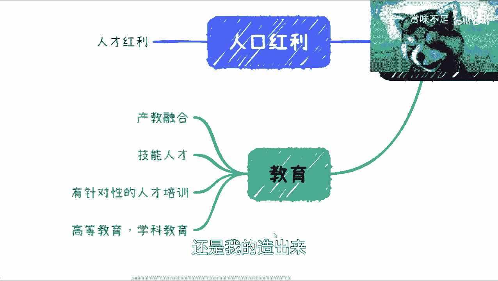

教育领域将进入下一阶段。其核心是从**普适性的平均教育水平提升**，转向**针对性的行业就业培训与技能人才培养**。

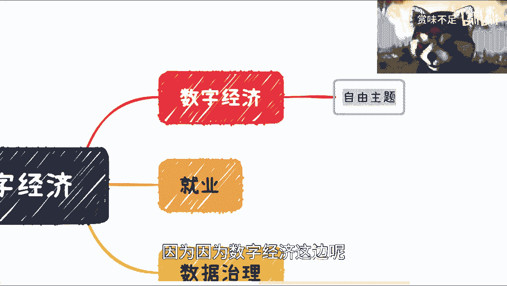

这包括职业教育、产教融合、技能人才培养以及有针对性的高等教育学科设置。

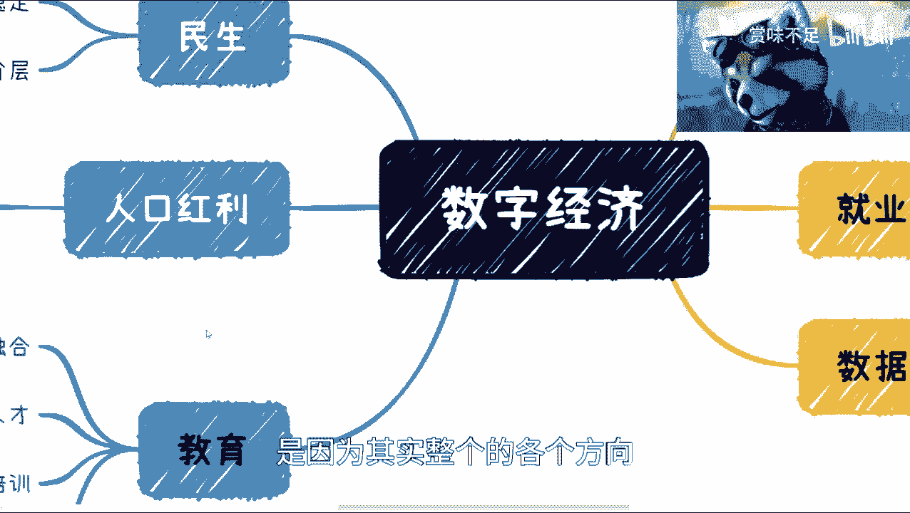

**核心转变公式可以概括为：**
`教育目标 = 从 “提高全民平均教育水平” 转向 “培养对口行业技能人才”`

过去的目标是让人人都能接受教育，提高整体水平。现在，每年有海量应届毕业生（例如今年1200万），全球市场更需要的是具备明确技能、能解决实际问题的“技能人才”，而非仅仅拥有一纸文凭。

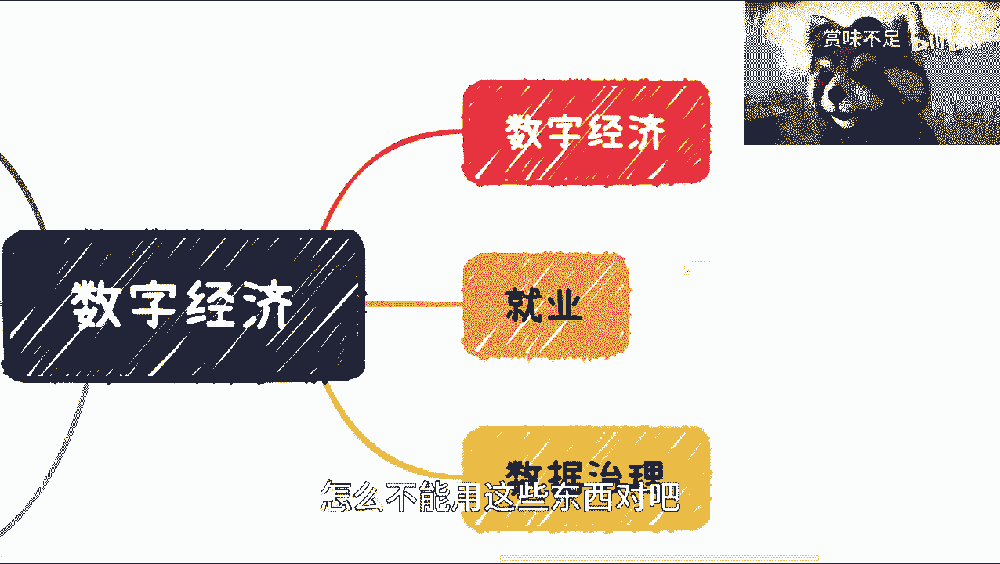

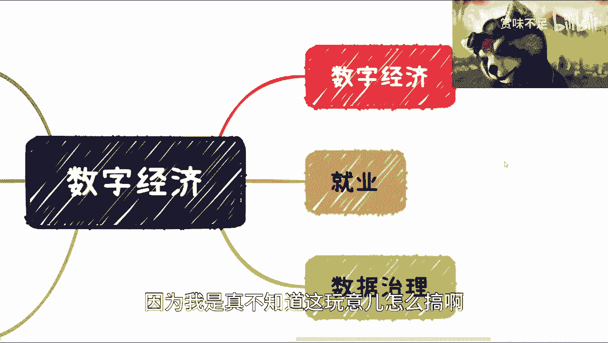

这种转变并非因为现有教育体系不好，而是社会发展速度超过了教育体系的调整节奏。因此，未来的教育将更注重与工业界（即社会各行业）的需求对接。

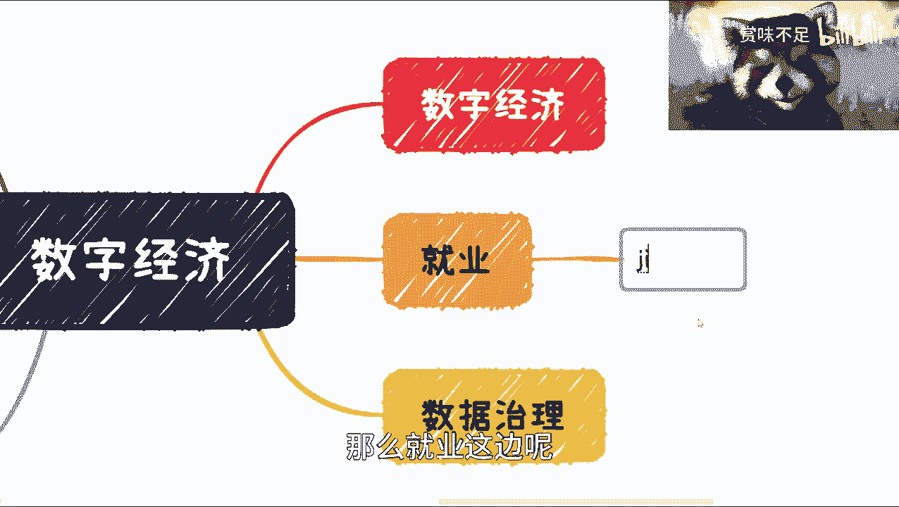

无论你未来是打工、创业还是从事其他职业，理解并顺应这一战略方向都至关重要。机会蕴藏在大势之中，而非凭空产生。

### 2. 数字经济是赋能核心

数字经济本身是一个宏观概念。它并非独立存在，其核心使命是**赋能于所有产业**，尤其是当前阶段需要重点发展的产业。

在这个合集中，我将更多地分享我个人对数字经济的理解，以及它如何具体赋能民生、教育、就业等各个领域。

### 3. 就业与实业的重点

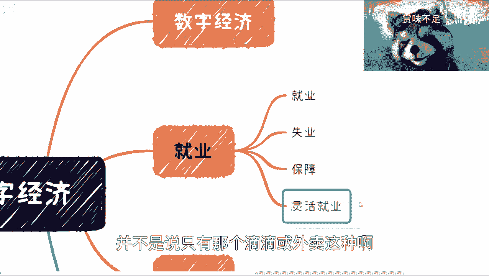

就业是一个涉及多城市、多阶层的系统性工程。下一阶段的就业工作将迎合社会和世界的发展趋势，并涉及法律、商品等多方面的配套跟进。

其中，**实业（实体经济）** 被特别强调。有人认为实业不能做，这是战略性的错误判断。

互联网行业自2017-2018年以来，经历了一个泡沫逐渐破裂的过程，部分原因在于其投入与产生的社会价值、经济价值不成正比。在当前经济需要恢复的背景下，发展能创造真实价值的实业变得至关重要。战术上可以容错，但战略方向必须正确。

### 4. 数据治理的深化

数据治理也进入了新阶段。过去是从“无数据”到“有数据”，现在则进入了从“有数据”到“用好数据”的阶段。

未经治理的数据只是一堆无效数字。未来的重点是**数据治理、清洗和利用**，以实现更高效率，并助力民营企业和各产业发展。

**核心概念可以表述为：**
`数据价值 = 原始数据 × 有效治理`
未经治理（治理系数为0）的数据，其价值为0。

---

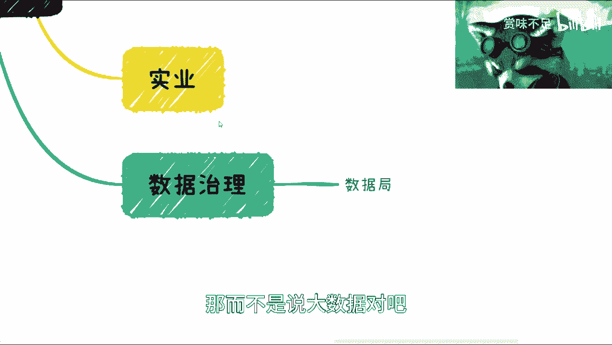

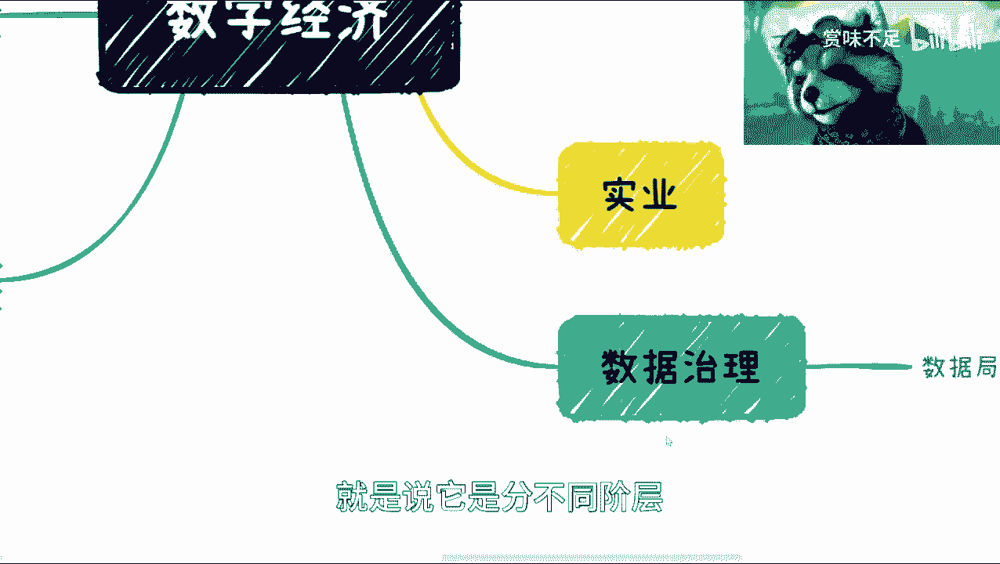

本节课中，我们一起学习了数字经济合集的开篇内容。首先，我们建立了三个核心思维原则：避免二元对立、拒绝表面判断、停止抱怨并学会顺势而为。接着，我们初步探讨了教育、数字经济、就业与实业、数据治理四大领域在未来可能迎来的“下一阶段”发展，并理解了数字经济作为赋能核心的角色。

希望本节能为你提供一个清晰的思考起点。我是谁？我在哪？我们下期再见。