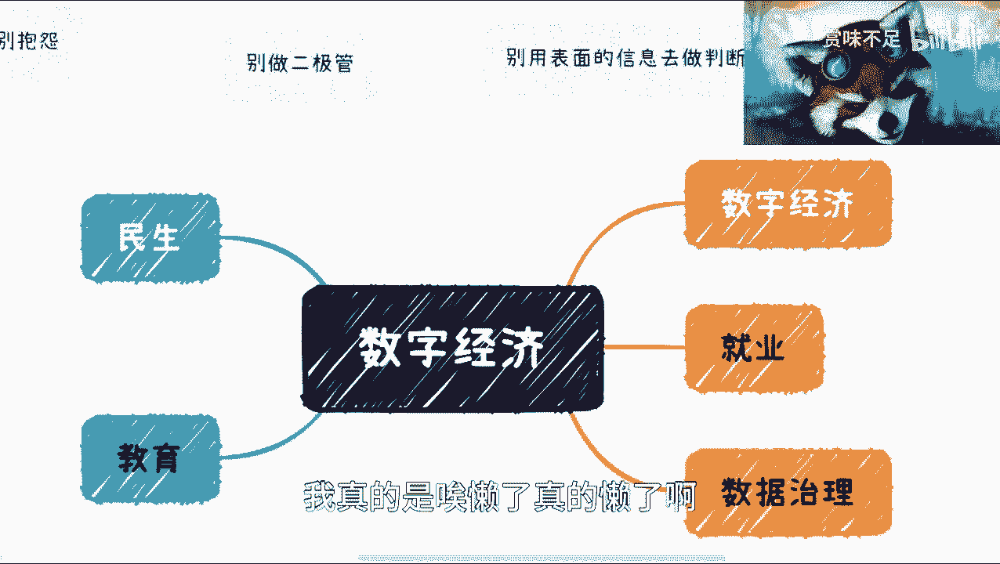
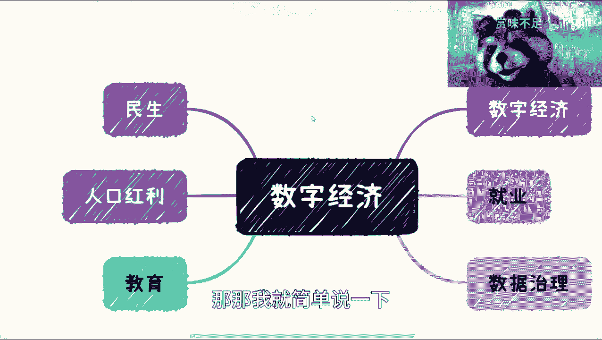
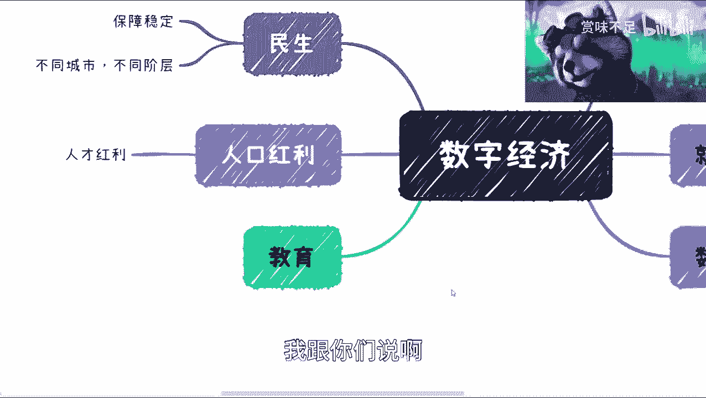
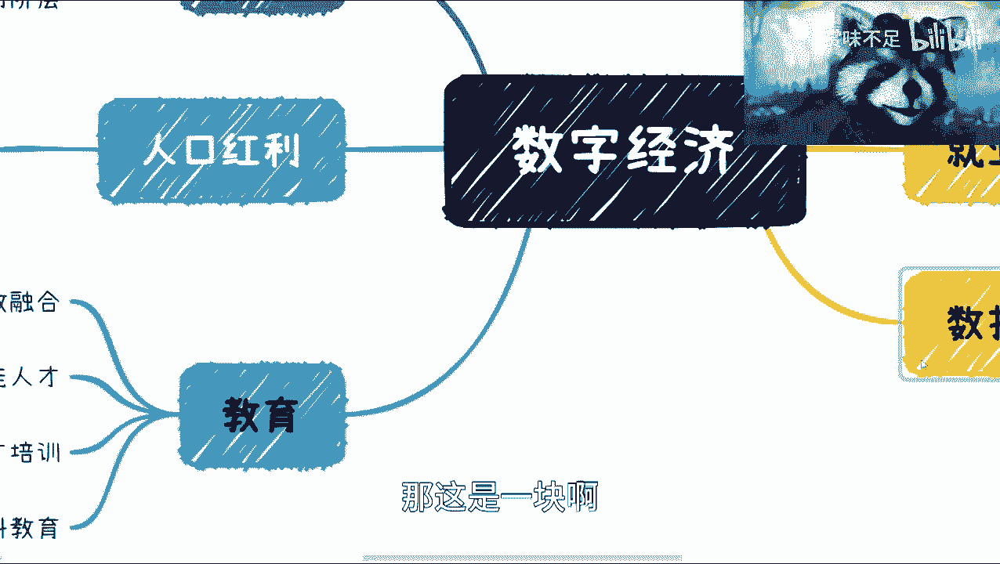
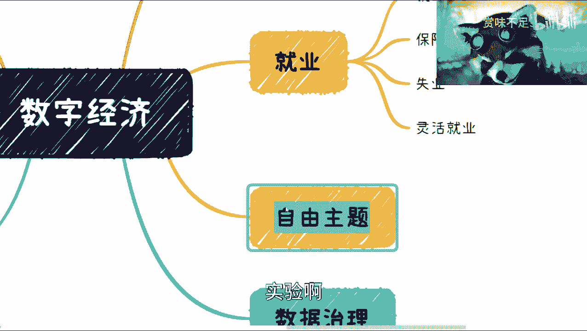
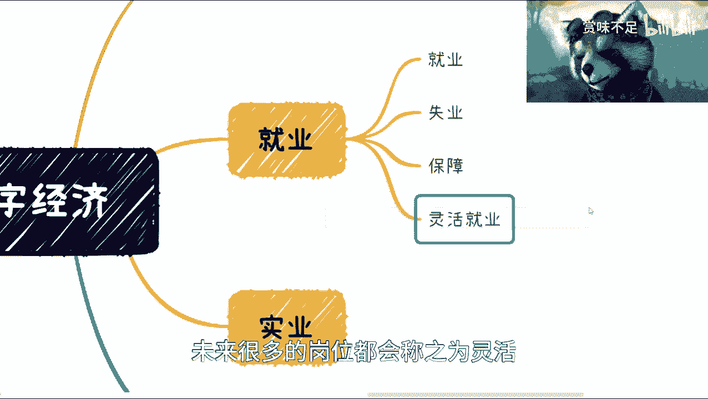
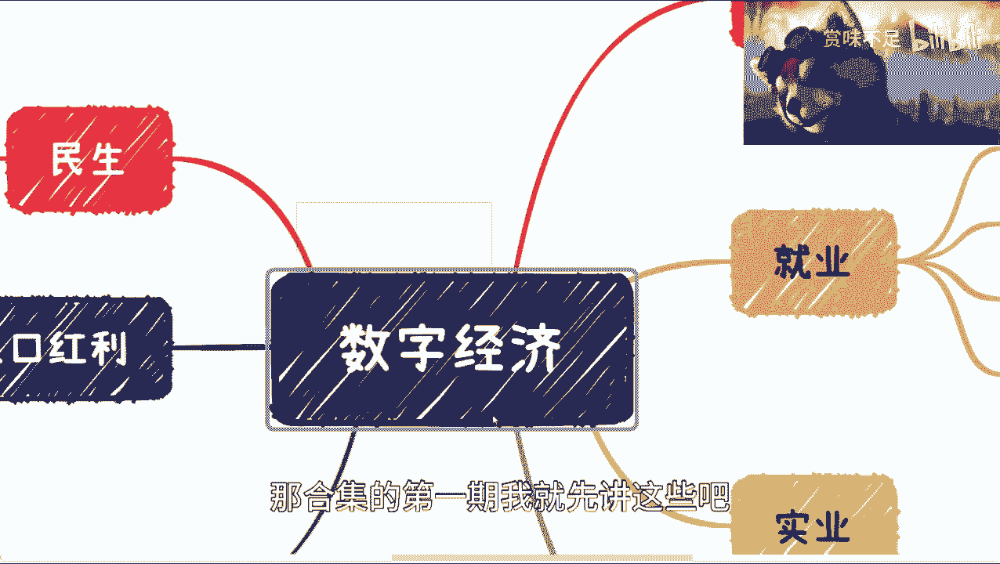
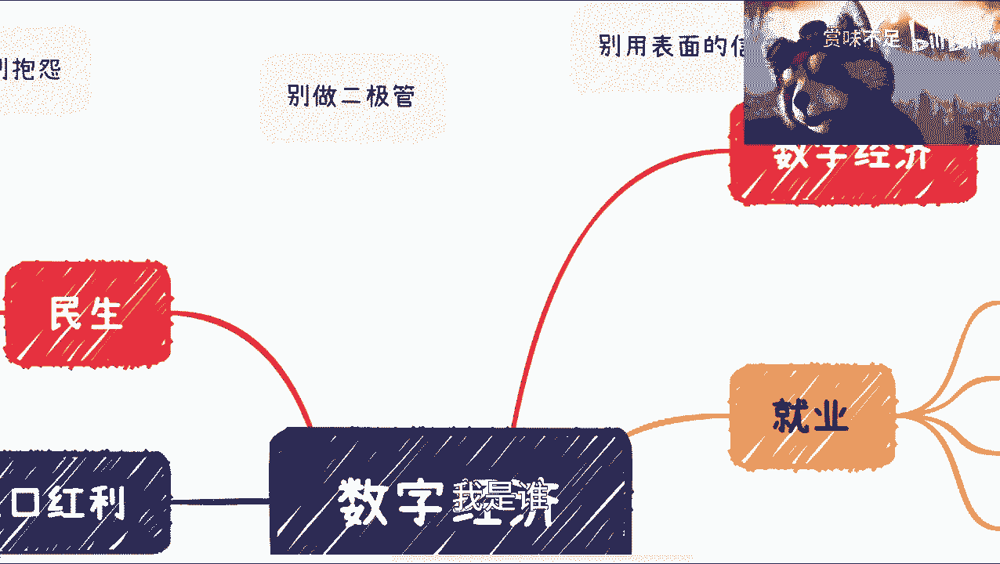

# 开了数字经济合集，大家可以关注下 - P1 - 赏味不足 - BV13M4y1k7QM

好大家好啊，我我很气愤，我早上做了个视频发不出来，做了30分钟，我靠，我现在就满脑子我是谁，我在哪，我要干嘛，所以你能看到吗，就是我就对吧，我打算一边讲一边来做这个脑图啊，我真的是唉懒了真的懒了啊。

然后是这样子的，我要开一个这个数字经济的合集啊，然后呢，我后面会把一些就是说我对数字经济的理解啊，包括可能一些所看到的东西，我会放到哪个合集里面呃，并不代表讲的都是对的啊，并不代表都是对的。

所以说大家反正自己判断，然后呢我在这个地方说三个东西啊，先说三个东西，第一个就是说别做二极管啊，这个世界不是只有黑和白的，也不是只有零和一的啊，你做选择的时候，但凡做的事啊，我就是要么选A。

要么选B这种选择你都会后悔的，我跟你们说啊啊你你要去判断很多东西啊，再去做选择好吧，然后这是一个，然后第二个的话不要用表面信息去做判断，就有很多人，我看到评论跟哪个私信我的时候都说嘛。

他说哎我觉得这个东西不行啊，哪个东西不行啊对吧，然后我就问他这个为什么不行对吧，然后他就跟我说啊，这个这个我看到的肯定少了对吧，我新能看到少了对吧，怎么样怎么样，那我就跟你们讲啊，就是说所有的东西呢。

不要拿表面的信息去判断啊，那么也有人说嘛，他说啊那我接触不到很深层的信息啊，那你接触不到信息，你就更不能拿表面信息去做判断了嘛，对不对，那你做出判断肯定是错的呀是吧，然后呢就是说哪个对吧。

然后我觉得这个是一个吧，然后还有一个呢就别抱怨啊，就是你就是不要去说啊，这个东西不好，哪个东西不好啊，这个东西没有用，那个东西没有用对吧，我跟你们说，你们但凡这个这个哪个移民之前对吧，你们回头去移民。

那我就不说了是吧，那你们移民之前啊，哎呀说到移民。

哎我我我加一个东西啊，我刚刚都忘了，哎呀。

待会我忘记，我怕我忘记了，就是就是就是你在你移民之前对吧，你是不是还是得要去跟着大，所谓顺顺势而为嘛对吧，很多人都会问啊，红利期在哪里，机会在哪里对吧，是势能在哪里，我跟你们说，你们不顺势而为。

不去看政策，不去看东西，哪来的人啊，哪来的市啊，是你们能造出能来，还是我能造出能来，这个就对不对。

就这认清楚自己身份是不是啊，好然后就是说我嗯哪个开第一期啊。

开第一期我想说先说一下。

就是既然刚刚那个视频讲这个发不出来对吧，那那我就简单说一下，做个总结啊。

是这样子的，就是呃这个我看了一下大方向呢，就是有那么几块啊，几块啊，剩下的呢其实我就我没，当然我没有列的，不是说没有啊，大家可以自己去看，我没有列的呢，是指说啊，从上一次以前的发展到现在是一个延续性的。

但是呢，就是说从这一次的这个讲话和内容上来看呢，就是说整个未来数字经济也好。

包括就我这边列的，包括民生啊，教育啊，要数学治理啊，就业他会进入一个下一阶段啊。

下一阶段我简单跟大家说一下啊，首先民生这边呢，我是觉得其实很简单，就是说你要保障这个，怎么说呢，保障稳定对吧啊，保障这个叫做呃这个不同城市啊，不同阶层这个阶段对不同阶层的啊，这种这个民生诶。

完了完了对吧，就是民生啊，然后这一块呢，我在就是说后面的这个内容里面呢，我就不讲了，因为民生这块我的确不了解哦。

我的确不了解，所以说我就我就就就就不去提他了好吧，写的很清楚，在这次讲话里面写的很清楚，这个这个已经进入一个瓶颈期了对吧，那么怎么理解这个东西呢。

我跟你们说啊，这个待会我们来讲就业和教育的时候来讲啊。

那么教育现在这块东西呢，我跟你们说啊，就就真的进入下一阶段，完了好好啊啊我们来讲几个，比如说比如说这个职业教育啊，哎呀真的太卡了，好产交融合是吧，嗯这个这个这个这个这个呃技能人才，对技能人才好好啊。

然后我们叫做这个有用的比较有用的吧，就是有针对性的啊，人才培养，那么当然还有就是正常的，比如说高等高等教育啊，学科教育啊这些啊，好那这个东西啊，我给大家翻译一下啊，什么意思呢，就是说以前的所有教育呢。

大家都都要做的是什么呢，就是人人都要有教育对吧，就是说都平均要去提高平均的教育水平啊，不管是你说哎整个高等教育也好，还是说是比如说实业发展教育也好等等方向啊，就所有人都要接受教育，那这个是一个大环境。

那么基本上到现在为止呢，就是我们说啊，你每一年应届生，不是这个今年是1200万对吧，每年应届生很多啊，是因为整个一个发展上面啊，我们说整个全球其实都是一样的，就是全球层面上面要的都是一些叫做啊。

技能人才啊，金融人才，我们从就你们想看，如果你们是用人单位，或者你们是一个行业里面的一些一些人对吧，你们要的是什么，1200万应应届生再加社会当中当中人员，你们要的是每一个人都告诉你们啊，我有本科学历。

我有98521学历，我有我有硕士学历啊，还是说每个人告诉你们啊，我我我能做什么对吧，我我擅长做什么对吧，所以说我们说现在教育会进入下一个阶段，什么阶段呢，就是说要从整个普适性的提高平均的教育水平。

到达针对性的叫做啊这个行业就业就是培培训，我们说工业工业界的这个技能啊，因为我们一般以前讲的话，都叫做学术界和工业界嘛对吧，那么工业界现在其实是很需要人才的啊，我们说的工业界更就是指的。

就是说就是说这个这个社会上的各个行业，各个行业，那么都是需要人才的，而现在当下你们会发现，整个的教育体系和这个人才需求，他可能有点脱节啊，他可能有点脱节，但这个东西不是因为我们的交易体系不好。

而是说因为整个社会发展太快，你知道吗，所以说呢就是说整个教育会进入下一个环节啊，会进入下一个环节，这也是为什么我就是最近在讲读研的也好，在讲哪个叫什么呃，未来就业也好，就我会跟你们讲的那些观点。

是因为所有东西都要迎合这方向啊去做好，然后呢这个这个也有人说，他说那这个东西跟我没关系啊，跟我有什么关系呢，对吧哦，你说你说产教融合对吧，职业教育对吧，这个技能教育啊，我作为一个985211的高材生。

跟我有什么关系呢，我跟你们讲跟你们有什么关系啊，不管你们未来做什么，是打工也好还是创业也好，还是说去这个做公务员也好，不重要啊，重要的是什么，重要的是你们要迎合大战略方向对吧。

哦你说你大战略方向都不迎合你，你还来每天都在那边说啊，狐狸在哪里，势能在哪里对吧，这个叫什么啊，机会在哪里，机会在哪里啊，机会天上掉下来，还是我能造出来，你能造出来哎对吧。

it的声音啊，是吧啊，那这是一块啊。

然后哪个数字经济这边呢，我觉得就比较比较多了，这个回头我再讲。

因为有数字经济直播呢，它不是一个独立的东西，你看啊我一级菜单就数字经济。

二级菜单，数字经济为什么呢，是因为其实整个的各个方向。

你比如说原材民生教育啊，就业数据治理哪个东西不是数字经济对吧，数字经济本质上最要做的是什么，是要赋能于所有产业，或者赋能于我们说更对吧，重心更更在这一阶段更重型的产业对吧，那么数字经济本身。

它是一个比较宏观的一个概念，那么我们我在哪个合集，我在这个合集里面才可能更多的讲的是什么呢，就是我理解的数字经济，以及这些数字经济怎么赋能与这些东西对吧。

但是同样的民生我就不说了，因为我是真不知道这玩意儿怎么搞啊。

那么就业这边呢，我觉得呃我们来讲就业啊。

叫什么就是保障啊，还有就是实业唉，实业了，这个地方我再提一点实业啊。

好你看啊，就业你们去看文件啊，就业里面写的很清楚啊，就业啊要一个是要提高就业率，第二个呢就是说对于整个就业的一个保障对吧，第三呢就是说对于实业的啊这么一个管理，包括实业之后再就业对吧。

好那么呢我跟你们说啊，就业这个东西是一个很大的一个东西对吧，而且是一个从上至下，上上下下，不同城市，不同阶层不要去满足的一件事情，所以说我就是从宏观来讲，我并不是说我们只满足本科或者这个硕士。

或者说这个这个这个博士，或者说这个哪个高层级的一些人的就业，那你你整个社会不是这么一个形态嘛对吧，所以说呢其实下一阶段就就业在当下这个情况，就像我说的，就是他得迎合整个社会的发展。

它在迎合整个世界的一个发展，然后包括这个各个法律啊，包括执行啊对吧，各个商品他都得跟上对吧，那么这一块其实就是一个很大的一个，一个大的方向啊，因为因为很简单嘛，因为就是说如果不管嗯，这么说吧。

就是说就是说无论谁去，就是当你去做一件事情的时候对吧，天平左右边两边对吧，你已经知道了，就是说刚印这个硬道理，上面这两边就没法平衡的时候，那么你肯定得要去选择一些这个这个另辟蹊，另辟蹊径对吧。

或者说曲线救国啊，你总会有各种各样的方式，你总不能说好，因为哪个公平好，我放弃了，那肯定不行对吧，所以说呢就是说这个东西呢是这样啊，当然啊我提一点。

并不是说只有哪个滴滴或外卖这种啊。

这个你们自己去想啊，你们自己去想实业呢，我为什么刚刚记突然想起来了，是因为你们去看啊，文件里面特别提了一下，你们去搜实业，这个叫什么关键字啊，前两天评论区还有人说啊，他说他说啊这个实业不能做啊。

这个实业现在谁去做实业，大哥啊，大姐啊，老爷们啊，呃我还是那句话，顺势而为，战术可以错误，战略不能错误啊，你们什么说什么实业不能发展的，这地方就叫战略错误，为什么，因为我已经跟你们讲。

互联网到了一个就是在2018年到现在，甚至2017年到现在，就是一个泡沫破裂，慢慢破掉的一个阶段对吧，你互联网为什么会破掉，是因为它产，它的投入跟产出价值完全不成正比对吧，我们随便举个例子。

比如说你今天这个做一个软件或者做一个产品，这个产品更多的老百姓是用来娱乐对吧，或者说老百姓啊，方便老百姓，或者说这个啊这个割老百姓韭菜对吧，我说的直白一点啊，但是真正他做到了这个产对社会来也好。

对于整个经济体系产生价值中没有对吧，那你想想看到现在这个情况，破哪个哪个泡沫慢慢慢破掉，同时经济要恢复怎么办，你必须要去做实业啊对吧，这个竟然还有人到现在说实业不错对吧。

哪个哎呀，我也是真的是可以啊。

可以我我不反驳哈哈，然后这个数据治理，数据治理这边呢就是之前这个数据集对吧，大家也都看到了对吧，数字啊，数字局这边呢我们这么说，数字这里是个很重要的东西，因为他也是从以前到现在进入下一个阶段。

什么意思呢，就是说以前是所有东西都有数字，有没有从没有数字到有数字对吧，现在呢是都有了数据，但是有了数据之后，你不去治理它，你不去做数据清洗，你不去做数据的利用，那这就是一堆废数字。

所以说呢接下来的目标就是数字值，因为你数字治理，你才能够有更高效的东西呃，更更让整个比如说民生啊，数字经济有更高效对吧，也能够将这个数据更好的利用，从而比如说帮助到比如说这个民营企业啊对吧。

或者各个产业啊对吧，你数字没有治理，那其实没有意义，他说啊这个这个这个这个大数据好不好啊，哎我告诉你们大数据好啊，大数据是真的好，但是呢这个大数据跟你们以前理解，大数据肯定就不一样了，虽然都叫大数据啊。

但是接下来的大数据是更着重于治理，更注重于用，那而不是说大数据对吧。

所以说你们要明白啊，就是说它是分不同阶层。

好吧嗯行吧，那合集的第一期我就先讲这些吧。

希望这个视频能发出来好吧，谢谢大家，我是谁，我在哪。

