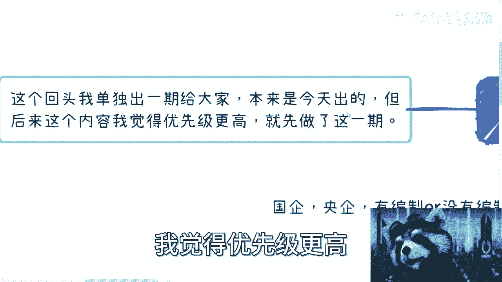

# 当下千万别轻易辞职！ - P1 - 赏味不足 - BV11z4y187Wh

好啊大家好啊，这个也比较巧是吧，我不知道大家有没有看到那个某某银行的事情，我不想明说啊，就怕说了，我这视频都没有了，哎呀就就怎么说呢，我唉我今天本来也没想说这个主题的，但我后来想了一想，来。

我还想和大家说一下，你知道吗，就希望就是大家真的要明白，就是真的不是危言耸听，现在真的很困难，非常的困难，困难到你们无法想象啊，就是反正这么个情况。

然后我把整个大情况跟你们在列一下啊，大家反正自己看一下啊，首先先说核心啊，就是没事做啊，不要辞职，千万不要辞职，千万不要辞职，千万不要辞职啊，就这个情况比你们想的要要要严峻的多，我估计因为你们不了解嘛。

所以你们哎。

首先我说一下我知道的国企，央企已经有编制，没编制的啊，就是反正集体匠心匠心，还有些就是直接不发的啊，不然都有，就是这个也只能说到这了是吧，然后，这个赶紧走嘛，也看情况对吧，也可以让你自己走是吧。

哎呀互联网企业嘛岗位缩减，薪资降低啊，然后这第二点第三点，中小型企业to b的状态呢，我其实之前也说过，就是白名单供应商，大家有一直服务的，该怎么做还怎么做，但剩下没有服务的呢。

反正从今年开始就很难接到单子，你们但凡有关系的，你们自己去问问看就知道了对吧，第四个就是虚假的增量市场，增量市场比如说区块链和ai，其实都是虚假的增量市场，就是啊卖课可以卖啊，快捷可以赚。

但是商业情况不好嗯，区块链我先不说了，反正就本来就没好过对吧，ai呢就属于一直是黑洞，就你们可以去看一下近3年的投资，钱很多很多，但就跟跟打到水里面完全没有水花是一样的，好吧。

这个也是我就是你们但凡咨询我，我都会私下跟你们讲的，就是ai我就从来不建议的，你们别跟风啊，就从来不建议的啊，然后是滚滚雪球的应届生数量，其实你们可以看一下前年到去年到今年对吧，其实应届生数量。

然后就很多，而且数量不是重点，重点是就业率就不高啊，就业率不高，然后嗯唉这个这话也只能说到这了啊，然后资本的现状呢，反正就是资本也没钱啊，也没钱，然后呃这个用钱比较谨慎啊，所以融资会费费会非常困难。

就这个就拿我身边以及啊硅谷啊，加拿大这边的一些创业的人的情况，反正嗯就这么个情况吧，啊当然啦就是很多别的东西，咱就这边不说了对吧，为了保证视频的安全跟我的安全是吧啊，有一说一啊。

这个我被这个上门也好多次了对吧，这个虽然也不是什么什么大不了的事啊，唉呀都在跟我哭穷，等我录好再来回他们吧，啊然后呢还有就是还有多久呢，我跟你们讲，不知道啊，但是呢我可以告诉你们。

今现代新今年不是最难的，明年后年会更难呃，同时呢整个这么多的情况啊，当然还有海外暴雷对吧，海外黑天鹅我都没说啊，都没说，反正就是嗯很多情况我们没在这边讲，但是呢有一点就要缓过来，没这么快啊。

肯定会这么快，就快的话78年啊，我不知道，反正反正没这么快啊，不要想的这么好，这是第一点，第二点呢关于互联网跟全局，我在这里也说一下，就是嗯目前不是互联网的问题，是全面都在下行啊，不是单纯互联网。

这一定要记住啊，不要老是来问我互联网怎么样对吧，别的都一样啊，没区别啊，全球一盘棋，第二呢就是大家觉得互联网下行快，主要是因为什么呢，主要是因为基数大，你知道吧，因为互联网渗透到各行各业了，主要基数大。

大家觉得互联网下一块，而且另外一方面，互联网以前的这个这个薪资太高，就整个的package这整个的这个高点吧，拉的太高，所以现在下行就感觉就快了，但其实并不是说互联网下行快。

只不过是互联网正在回归一个正常，但但和现在的很多黑天鹅，很多的金融危机这个这个重合在一起，所以大家会觉得啊，好像由于经济下行，互联网下行，但其实不是的，经济就算不下行，互联网也会下行，你知道吗。

就就大局就是这样子的，所以你们要去转马，要做别的东西嘛，你们自己考虑啊，你们自己考虑，就这个事情，就我还是那句话吧，就可能你们没有意识到问题的严重性啊，就就我该说的都说了。

就回头你们23年后可总归能明白我说的，但到时候就来不及，然后还有就是什么呢，政策告诉我们啊，开启新的时代，就是这个时代我可能也不知道怎么讲啊，就是说这个这句话什么意思呢，叫做叫做互联网啊。

就是全民创业啊对吧，或者什么什么什么以前就是什么互联网呃，互联网神坛那对吧，诶神坛啊，巴拉巴拉巴拉对吧，就以前直接就翻篇了啊，你们别再去用以前的历史来去想任何东西了，没有任何意义的啊。

然后第三点呢就是我刚刚已经重复了对吧，就重要的话说三遍，千万别轻易辞职，这几年我认为最重要的就是积累跟布局，就一定要记住，下行的时候，不管怎么下行，最好的就是积累跟那个，进啊积累跟那个布局啊。

然后选择方向的几年啊，因为你们也看到了，其实这不就是你们要记住啊，这不是单纯的一次所谓的什么金融危机，或者这也不是单纯的一次所谓的说啊，大家贩卖焦虑或者怎么样，我跟你们说，这今年就是最重要的一个转折点。

你们的确不明白，但不明白没有关系，但你们要有这个意识哦，就是你们要明白营销号是很多啊，他们每1年不管好不好，都在说经济下行，今年只不过说大家碰巧的啊，就感觉大家都在说，但其实的确事实上的确不一样啊。

你们但凡啊，我就说你们但凡就是就回头有时间的，你们把我说的这些，你们自己用全球的数据去看一下，你们就知道情况了，你知道吧，你别道听途说，这是不是，然后第二呢就是骑驴找马就行，另外适当的去卷我。

我不是鼓励卷啊，但是没有办法对吧，为了生存啊，保住自己的主业，第三呢就是我上一期其实说过的可行性方案，对不对，千万别全职创业哦，千万别全职创业，千万别全职创业，就你们说想就你们听到的。

或者你们深受手上资源再牛逼，也被全职创业，我跟你讲，这个不是一个好的环境啊，不是个好的环境，然后还有呢就是很多人我跟你们讲，很多人你们觉得看重学历对吧，你们自己想想看这种大环境下面学历有卵用。

真的你们想看学历有卵用，为什么，因为你本质上是什么，本质上是逗留人员太多，工作岗位太少，你学历有什么用呢，你拿出张博士学历，他妈的放眼望去都是博士，怎么了呢，对不对啊，所以我跟你讲你工作这件事情啊。

你的工作的选择，还有你工作的稳定性其实是很重要的，学历重不重要重要，但是在当下的扩招的这种众生平等的情况下面，我是觉得你要找到一份好一点的，就方向好一点的工作，适合你的工作。

以及你的工作稳定性是很重要的，你知道吧，别做两三个月就走了，做两三个就走，这肯定是不靠谱的啊。

第四个是什么呢，就是关于我说很多岗位没有前途的本质啊，就是说呃很简单，就是岗位要赚钱是能赚的，但是你们掌握这些技术，本质上能不能赚来价值，这个才是关键对吧，就是这个价值能不能变现啊。

这个价值不是说啊我觉得我能带来价值，我能带来什么什么普渡众生是吧，你就不要来谈这种价值，我就说的是变现唉改掉，免得到时候又有人误解是吧，这是第一点，第二点就是说你要去看有没有社会价值。

有没有被别人利用的价值对吧，因为你商业本质就是就你说的好听点，叫做大家合作，说不好听点叫做大家互相互相互利用是吧，我觉得这没问题啊，也没有问题，入股一点怎么了呢，能赚到钱就可以，是不是啊，然后我跟你说。

大家你们自己想想看啊，就是你们自己想想看，你们会的哦，你们会的东西我不管是技能，等一下啊，好多人在问我对，不管是技能对吧，还是说什么东西，你们自己想想看你们掌握的什么啊，然后这些东西能不能带来钱。

能不能直接变现，比如说你会写java，你会写python，你能不能一定赚到钱，能吗，划等号码不能，你知道吗，就很多东西都不能包括你们说法务法律对吧，这个会计对吧，什么东西你们自己算算，你们手上有什么牌。

这些牌能不能直接变形，如果不能，那你们就开始要要积累，要要要要要把这个呃就是a点到b点对吧，你现在a点是你的技能，b点是变现，你怎么把这两个点连起来，这是你现在要先想的哦。

不是说这还到现在还在那边想说哦，我是不是找份工作对吧，我再混混再混2年，真我跟你讲，混混不动了，真混不动了，你知道吗啊，你们你们要不再去看看那个银行的情况啊，或者你们有海外的朋友。

要么问问问问你们海外朋友情况是吧，然后呢关于大学生，因为最近也有小蛮多小伙伴就跟我说，是不是单独出一期跟大学生或者应届生的内容，我觉得是的，我说呃我是要单独出一期，就是大学生这边的。

就是我想想怎么把它拆分开来，给给大家一些建议嘛，看看怎么做，本来是今天出的，但是这个内容呢我觉得优先级更高哦。

优先级更高，所以我就先出了这个东西，所以总体来讲呢，就是我希望核心点呢还是什么呢，就是说第一呢呃这现在不是普通的情况啊，大家一定要心知肚明啊，第二呢就是说要开始做准备啊，要开始做准备。

我不管什么全职兼职都不重要啊，重要的是做准备，赚钱好做准备，你现在赚不到，没关系，23年想办法，23年后能赚到，你知道吧啊然后第三点就是说别签，万别轻易辞职，别觉得就是说现在是一个。

就跟以前大差不差的对吧，因为每每每隔多少年都有觉得哎呀下行了对吧，要要要金融危机啦，怎么样啦，真不一样啊，真不一样嗯好吧，反正就是这么个意思吧好吧，然后有反正细节的呃，这个企业相关的个人相关的啊。

这个这个这个这兼职啊，全职相关的啊，然后跟个人这种就隐私方面关系比较大的好吧，你们可以自私信在咨询我，包括你们有什么id啊，要觉得让我审核审核的，也可以走这个付费流程好吧，反正都一样的，唉行吧。

