# 当下最应该做的是稳定现金流和布局长线机会 - P1 - 赏味不足 - BV1AS421d7NV

好啊大家好啊，呃今天这个长沙活动圆满结束，圆满结束，呃今天还是有好几个熟悉面孔的啊，我觉得呃感觉以后其实大家如果经常来的话。

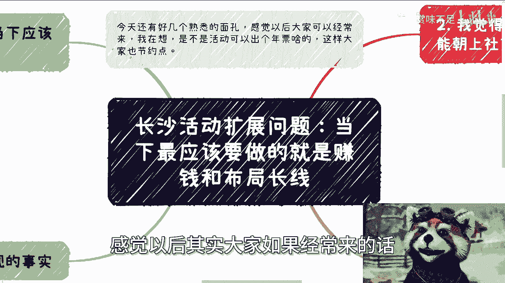

我可以出个年票对吧，那这样的话大家便宜一点啊。

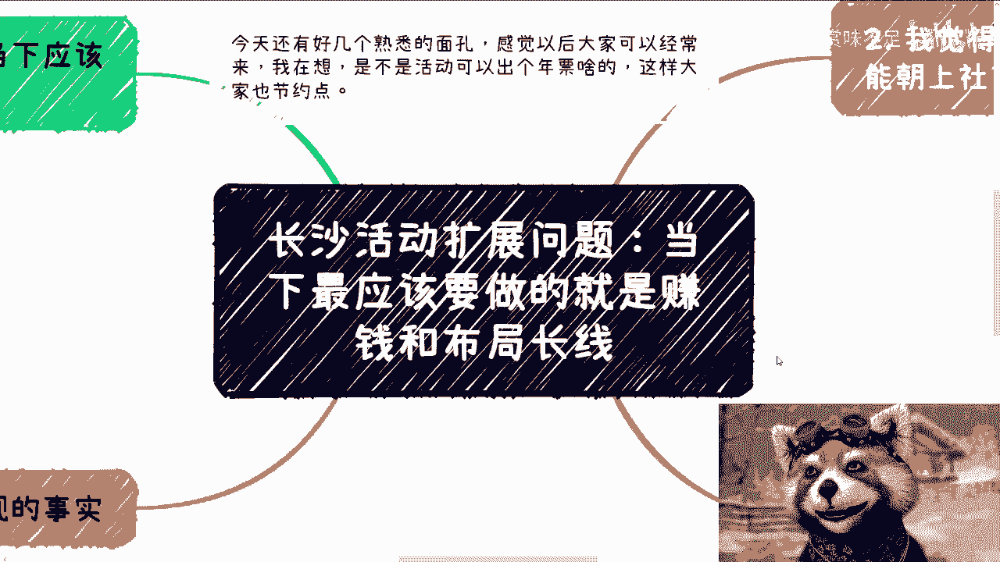

首先呢今天我们讲的这个问题啊，是这样子的，就今天长沙活动上面有个小伙伴问了一个问题，他说当下最应该做的应该是什么啊，那么我们就作为这个扩展问题呢，放在充电视频里面，就当下最应该做的。

我直接给结论两件事情。

一是赚钱，二是布局长线啊，那么第一呢今天我们小伙伴问我们说。

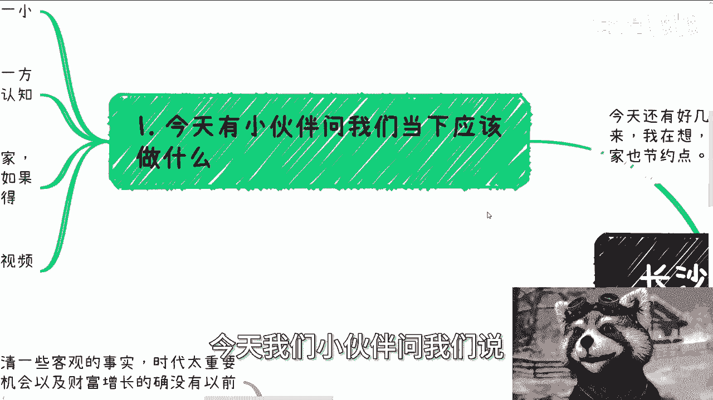

这个当下最应该做的是什么啊，我来放大一下，其实昨天呢我刚到长沙时候，我还在跟一个那个朋友聊这个事，就前几天呃晚上吃饭嘛，就晚上也聊到了那个美国降息啊，然后接下来会有一些这个小轮的这种经济上涨。

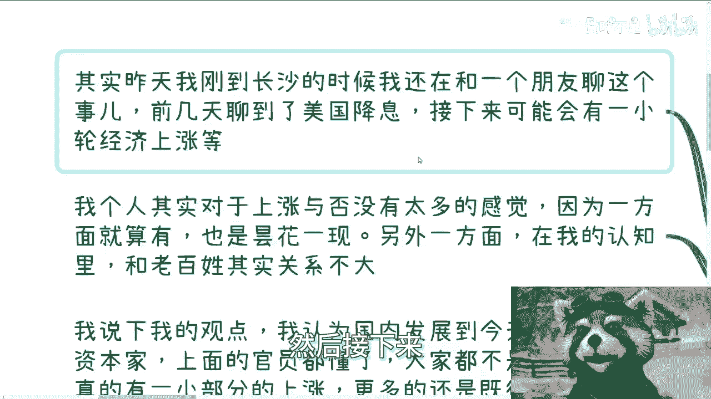

但是我个人呢，其实对于上涨没有太大的这个感觉，因为一方面就算有啊，他也是昙花一现，我觉得呃我们其实是有共识的，就是虽然它可能会有上涨，但是这种上涨呢也就是不会持续太长时间。

那另外一方面呢就是在我的认知里面呢，我是觉得啊，但但这个东西可能有歧义啊，就是我是觉得啊。

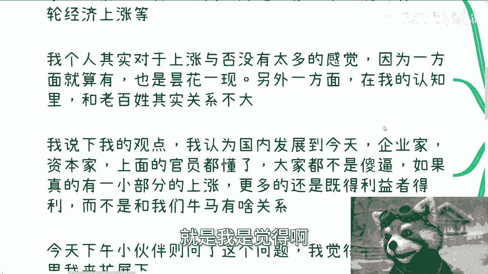

他就算上涨了，跟老百姓关系也不大，那我说一下我观点啊，我认为国内发展到今天啊，企业家，资本家，包括上面的官员其实都懂了，就什么叫做资本运作都明白了啊，就是说哪些事情是应该左口袋掏右口袋的。

哪些事情是应该放在媒体上面做宣传呢，我觉得大家都门儿清哦，就是就是因为很多产业啊，你会发现，其实最终都是一个，这个看谁来接盘的这么一个逻辑，但是到今天我觉得就是我这边列的就企业家，资本家官员都不傻。

这都不是，那那那那你说这个再画一个饼说啊，大家来接盘，其实很少人会来信啊对吧，那么真的有一部分人上涨呢，其实更多的还是既得利益者去得利啊，而不是说跟我们这些老百姓或者牛马。

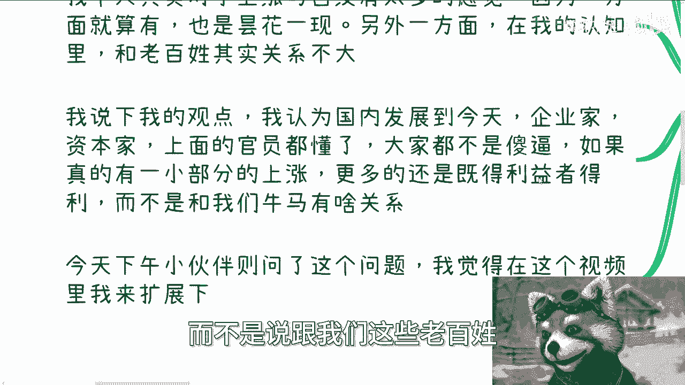

有什么关系，所以说今天下午小小伙伴问这个问题啊，我觉得我可以在这里面就给大家拓展一下啧，首先啊我觉得核心一就是什么呢。

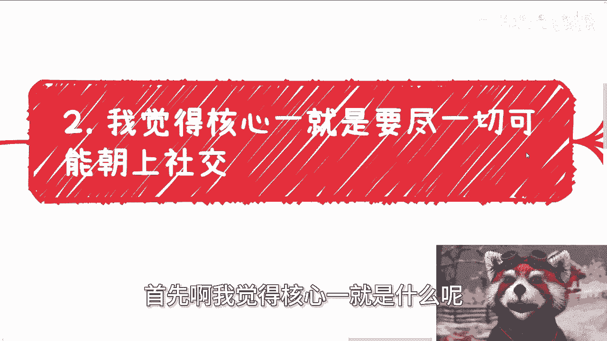

要尽一切可能朝上社交啊，我为什么啊，我说句大家可能听了不开心哈，他可能可能不太好听啊，这个忠言逆耳啊，就但是很可观的话是什么，就是普罗大众老百姓，我觉得大家不要去社交，或者不用多去社交。

或者说就是不用多去这个社交。

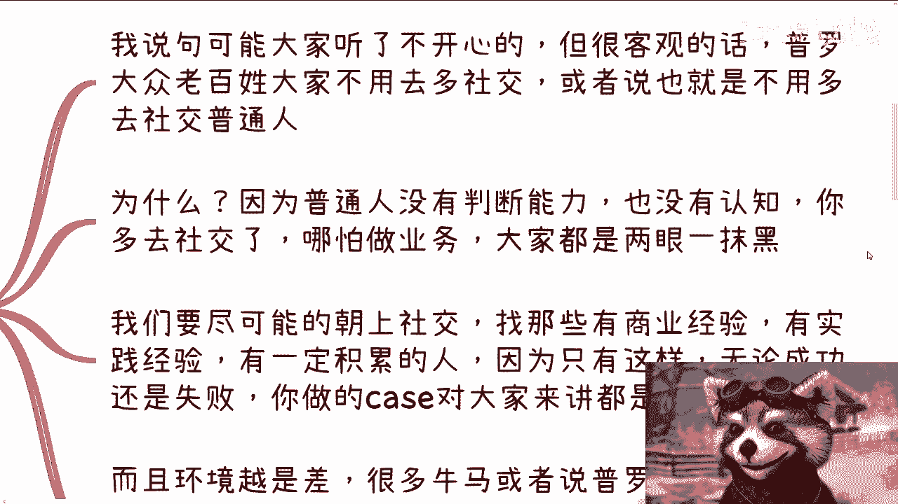

普通啊，普通人为什么，因为很多的普罗大众他是没有判断能力的，也没有认知的，你多去社交了，哪怕你跟他们一起做业务，你会发现他也是两眼一抹黑，你也是两眼一抹黑，那我就问，那那那这个事情对你有什么帮助呢。

对不对，那我们要尽可能的朝上社交，那么这样的话才能有更高的效率，你比如说找那些有商业经验的，有实践经验的，有一定积累的，当然你说他有多大经验，咱先不说啊，你要去找那些有一定积累的，因为只有这样子。

无论你跟他合作是成功是失败，你做的case对你来讲都是有进步的对吧，你就是相对于你需要你，你如果来说你是个游戏的人物，你你有一根经验值，你得涨啊对吧，你你要是老是跟你同level的一些人去社交。

本身意义不大的啊，而且环境越差呢，很多牛马或者说很多普罗大众，他很容易自乱阵脚，就是他自己迷茫的时候呢，他就开始乱投医，那么我说实话，我觉得为你们自己，为了自己的安全，为了别人的安全啊。

那么平直的社交或者向下社交呢。

你要要要谨慎啊，不是说不要社交啊，就是你要看有一个叫什么轻重缓急。

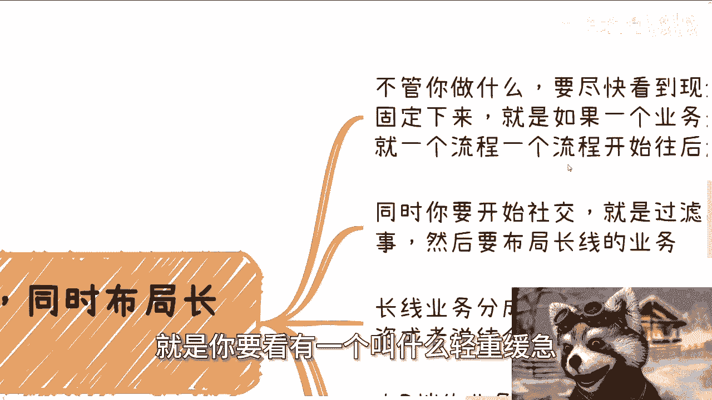

包括要有个投入产，要有个比例，你不能说啊两一刀切啊，像是说不向下社交，不平级社交，我就永远朝上社交，也不是的，你要有一定的比例分布嘛对吧，那么第二尽快的看到现金流。

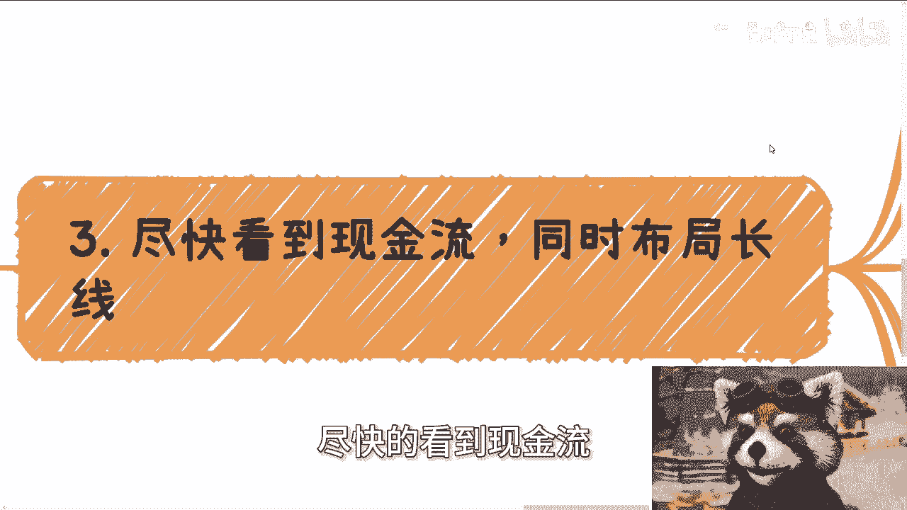

以及同时布局长线啊，那么什么意思，也就是说不管你做什么，要尽快看到要有现金啊，要有这个变现能力，然后就是将将这个业务固定下来，就比如说你现在一个业务啊是一个月为周期的，那么你做完这个月的业务之后。

那么你就开始一个月一个月一个月往后走，就开始滚起来。

而且要把它滚的嗯，叫做什么相对稳定啊，那么同时你要开始社交啊。

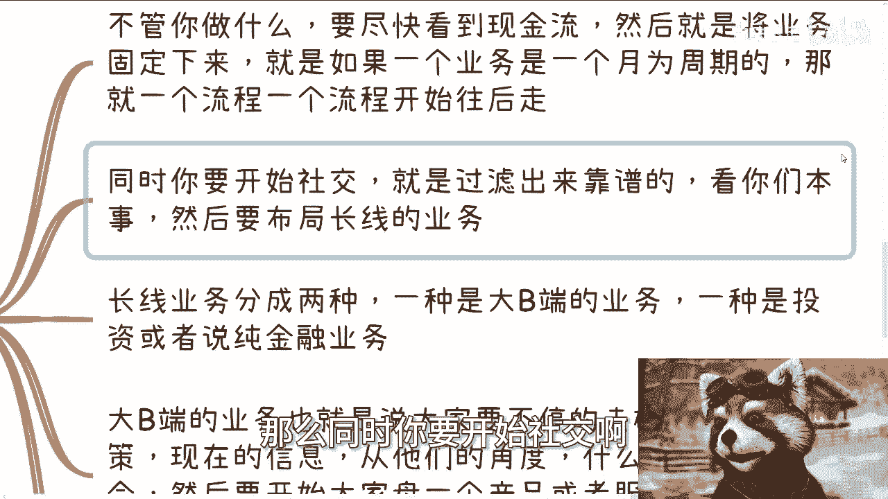

就是过滤出来那些靠谱的，看你们啊，当然看你们本事啊。

就是结结交这些靠谱的人，是为了布局长线的业务，长线业务分成两种啊，一种是大弊端的，我们可以认为就是企业端，政府端，高校端，资本端都算大弊端的啊，一种就是投资或者说纯金融的业务啊，呃那么我们继续来看啊。

大弊端的业务呢，也就是说大家要不停的去碰现在的政策啊，就说你们前提啊，就是说你们已经碰到了一些那个，比较靠谱的人啊，那么你们可以去碰一些呃，需要时不时的去碰一些当下的这个政策，或者机会。

然后你要让他们从他们的角度去看，哎可能什么时候有机会啊，什么时候啊，有这种就是说啊上升期啊或者怎么样，然后大家再开始要讨论哎我们这怎么办，怎么样去那个那个凑出一个产品或者服务。

那么等待时机成熟之后就去试对吧，那当然你说是不是不是得出来没人知道，但是你得提前做准备啊对吧，那么还有就是金融，啊那么金融这块呢我要强调一下，就大家一定要有稳定的现金流之后再去尝试。

而且尽可能的你要自己去组局，明白吧，就说不管是纯粹的投资，还是还是说去你去投资这个金融产品，就是你要么就直接是跟这种项目方对接的，要么你就是项目方啊，呃金融这块东西。

他的确能够指数倍的去做那个财富的增长，但是你得基于靠谱的合作人，以及你有稳定的现金流，但是咱又这么说啊，你说怎么样才能有靠谱的合作人跟稳定现金流，那你就得不停的去踩坑，你就得不停的去，是不停的去过滤。

那这就是当下去做的事情，就说白了就是不停的去做，不停的去做，不停的去做，然后呃无限接近于我们要的那个结果，你否则没有几没有意义的，就是你说你你比如说你问我，今天今天线下也有问我吗。

说唉两三年后会不会有个上升期对吧，或者怎么样子，那你现在不积累，两三年后有上升期也没有用啊。

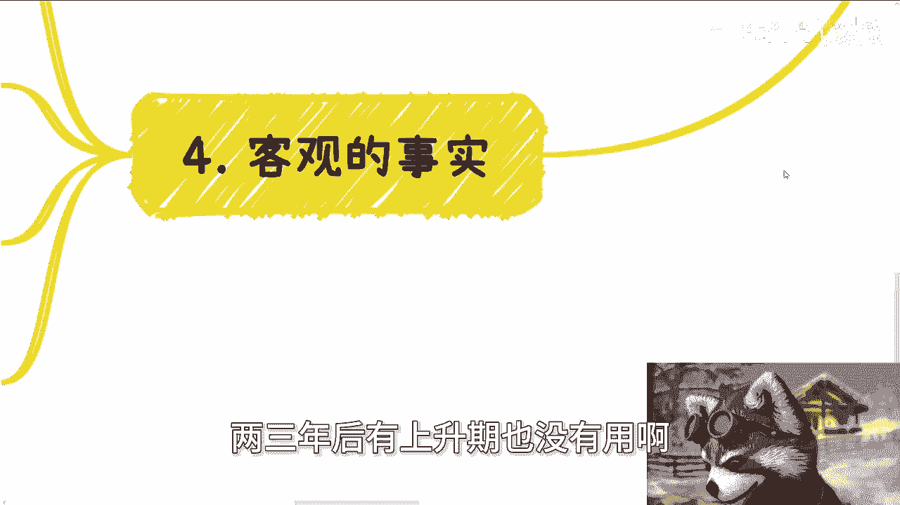

那上升期跟你吊关系呢，对吧啊，第四我们要认清一个客观的事实啊。

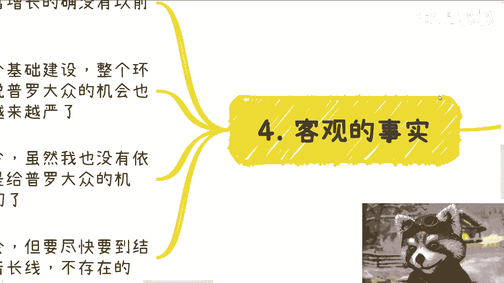

呃不得不说啊，我觉得我最近认清了一些客观事实呢，嗯大家也是要一样的，就是第一个点就是说时代太重要了，就现在这个时代给予我们的机会，跟财富增长的机会的确没有以前那么多啊。

啊包括财富增长的这个比例也没以前那么高，这没有办法哦，那么另外一方面，由于社会也好，整个基础建设社也好，整个环境也好，他留给所谓的普通人或者普罗大众，机会也越来越少，而且这个原因最近呃。

有另外一个点也侧面印证了这个点，就是信息的管控越来越严格哦，可能你们没什么感觉，但是就从我啊从怎么说呢，就是有一些部分的中V大V角度来讲，就感觉很明显很明显就管控越来越严啊。

所以从目前来讲就是机会越来越少，虽然我也没什么依据啊，但是我我我是反向去推的，就是我没看到有更多的机会，包括我跟别人聊。

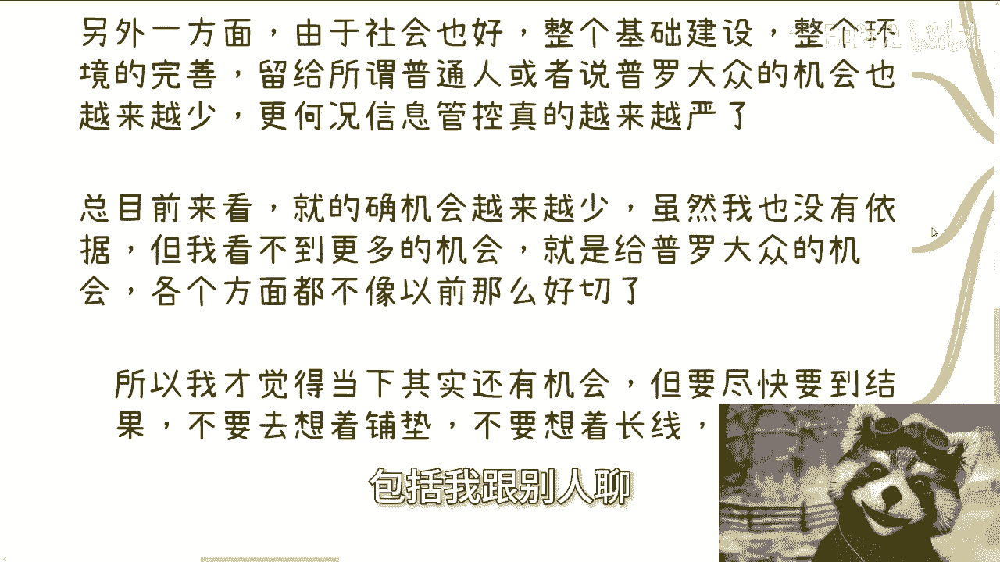

也没有看到更多的机会，所以说我觉得留给普罗大众机会，各个方面都不像以前那么好切了啊，所以我才觉得当下你你比如说你问我啊，应该做什么，那我觉得当下就是OK，第一你得找到一个稳定的现金流，那当然你怎么找你。

你可能也得通过社交，通过合作，这个就看你们八仙过海，各显神通对吧，那另外一个就是说你们得要长线布局没了，就这我觉得就这两个东西，就是当下的这个现金流，更多的是就尽快要结果，不要想着铺垫，不要想着长线。

不要想着啊，我我现在做准备怎么样子，我就得看到钱啊，然后布局长线呢，也不是说就就就好像真的哎呀点错了，就好像真的你说啊，我们要去做一个什么一两年的业务。

不是的，就而是说我们要去尽可能的，现在就去积累出来一些靠谱的关系链和人。

然后在未来的就不可预见也好，或者可预见的也好，这些机会里面，那你想嘛未来就算真的有机会，或者真的是这个社会有呃，我们说经济层面有个很好的上升点，你自己能做什么，你做不了，你还是得要靠那些关系链。

才能给你带来更多的机会，或者说能够把你这个产品啊服务切进去对吧，那这些关系是怎么来呢，那你不得靠现在的积累吗，对吧没了，我觉得当下就这两件事情简单明了好吧行啊，然后下期活动的话，我还没想好啊。

还没想好嗯，让我唉明天先先赶回上海吧，再说吧，然后那个就是没了，然后剩下就是职业规划啊，商业规划你们自己做些什么事情，或者你们想要额，就是在工作上面有些什么呃疑惑啊，或者指那个商商业上面有什么疑惑啊。

你们呃合同里呀分红分润啊，股权期权啊，对吧等等等啊，你们希望就是呃我结我跟我聊完之后，能够让我结合你们个人的背景跟个人的问题啊，然后给出一些更贴近当下经济发展的一些建议，或者说能够让你们少走点弯路的话。

那么你们整理好对应的问题跟个人背景，我们再来再我们再来走咨询好吧行啊。