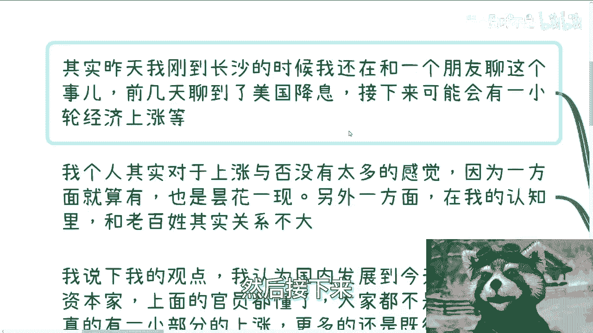
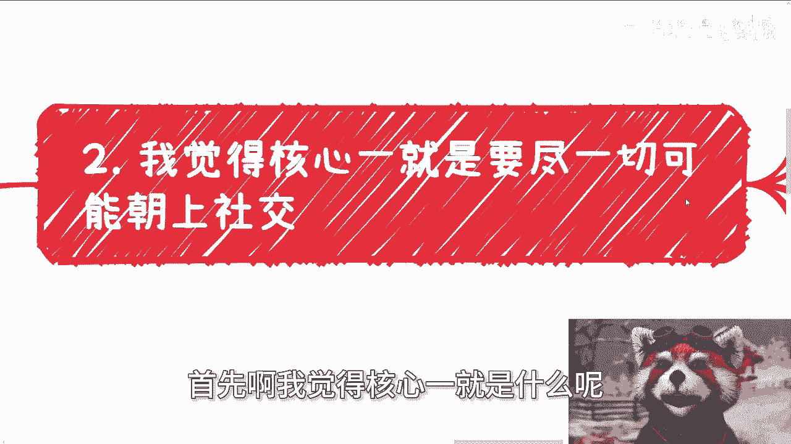
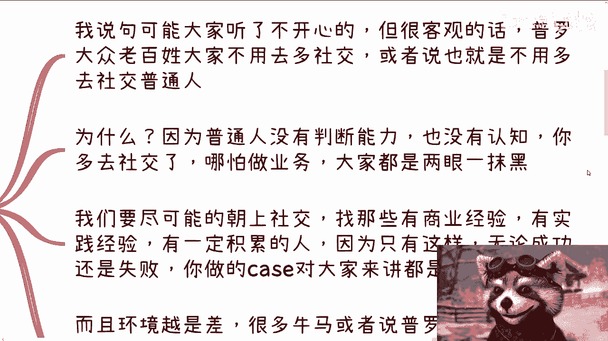
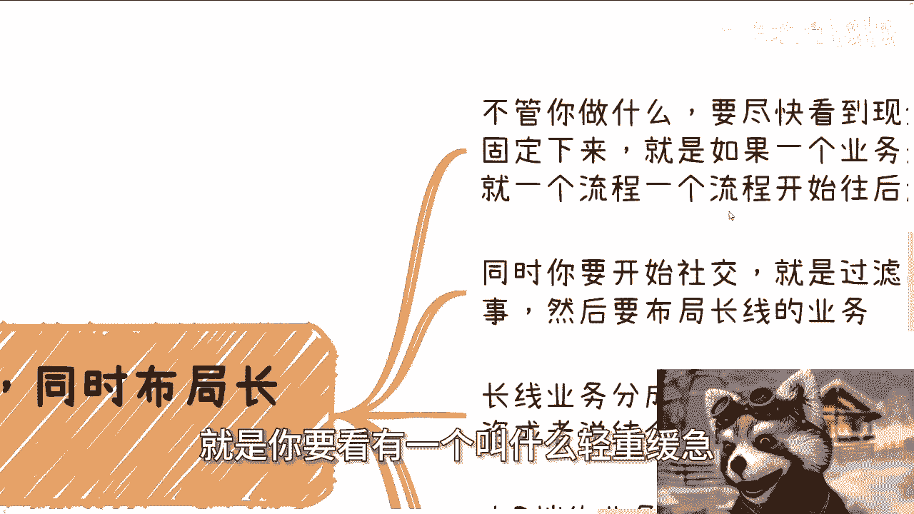
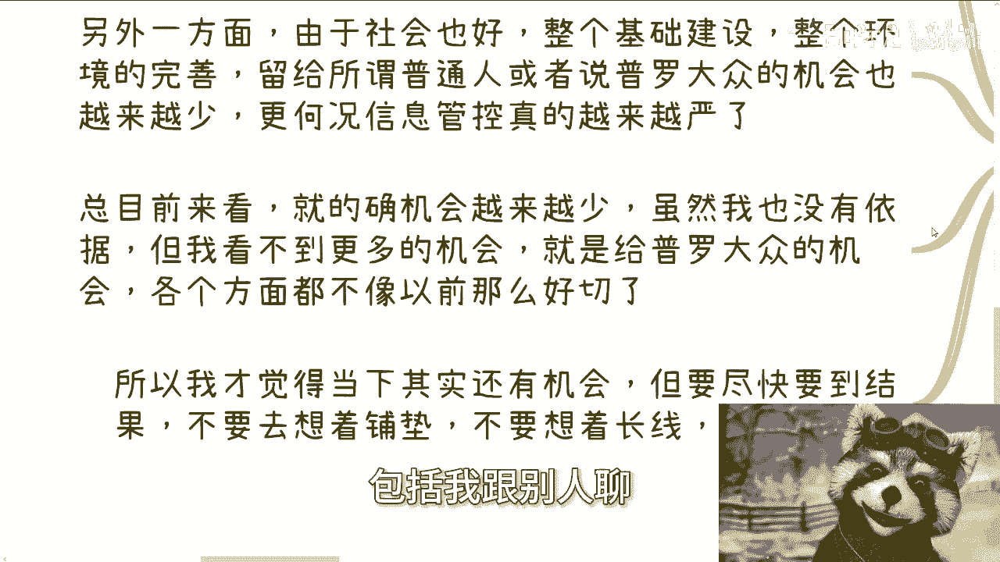

# 课程P1：稳定现金流与布局长线机会 💰📈


在本节课中，我们将探讨在当前经济环境下，个人最应该采取的两项核心行动：**稳定现金流**与**布局长线机会**。课程内容基于一次线下活动的问答，旨在为初学者提供清晰、可执行的指导。




---


## 概述

课程的核心结论是：当下应专注于两件事。第一是**赚钱**，即建立稳定的现金流。第二是**布局长线**，即为未来的机会做准备。这两者相辅相成，是应对不确定性的务实策略。


上一节我们概述了课程核心，本节中我们来看看具体的行动指南。





## 核心行动一：向上社交 👥

首先，要尽一切可能进行**向上社交**。普通大众往往缺乏判断力和认知，与他们进行过多平级或向下社交，效率低下，对个人成长帮助有限。与有商业经验、实践经验和一定积累的人交往，无论合作成功与否，都能获得宝贵的经验值。

**公式**：`有效社交 = 接触高价值个体 > 接触同水平个体`




以下是向上社交的注意事项：
*   社交应有轻重缓急和投入产出比例，不能一刀切。
*   环境越差，越要谨慎进行平级或向下社交，避免因他人迷茫而影响自身。


## 核心行动二：现金流与长线布局 ⚖️


第二，要尽快看到**现金流**，并同时**布局长线**。这意味着无论从事什么业务，都要尽快实现现金回流，并将业务模式固定下来，形成稳定滚动的周期。


**代码描述**：
```python
while True: # 持续行动
    现金流 = 执行月度业务() # 固定业务周期，获取现金
    社交网络 = 过滤靠谱人脉(社交()) # 同时筛选优质人脉
    if 时机成熟(社交网络, 市场政策):
        尝试长线业务() # 为未来机会布局
```

上一节我们讨论了行动框架，本节中我们来看看长线业务的具体方向。

长线业务主要分为两种：
1.  **大B端业务**：面向企业、政府、高校、资本等大型客户。需要持续关注政策动向，与靠谱的伙伴共同研判机会，提前筹备产品或服务，等待时机。
2.  **金融业务**：包括投资或金融产品。**必须**在有稳定现金流的基础上尝试，并尽可能自己组局或直接对接项目方。金融能带来指数级财富增长，但依赖于靠谱的合作伙伴和稳固的现金基础。

**关键点**：获取靠谱伙伴和稳定现金流的方法，就是不断实践、不断试错、不断过滤。没有当下的积累，即使未来出现上升期，也与你无关。


## 认清客观事实 🧐

我们还需要认清一些客观事实。当前时代赋予个人的财富增长机会和比例，已不如从前。社会留给普通人的机会正在减少，信息管控趋严也从侧面印证了这一点。



因此，当下的策略更加明确：必须通过社交与合作，找到能尽快产生现金流的路径，同时为长线发展积累可靠的关系与人脉。未来的机会，无论能否预见，都需要依靠当下的积累才能把握。

---


## 总结

本节课我们一起学习了在当前环境下的核心策略：
1.  **优先向上社交**，提升认知与效率。
2.  **双线并行**：全力获取**稳定现金流**，同时为**长线机会**积累人脉与资源。
3.  **认清现实**：机会总量在收缩，必须更主动、更务实地进行积累。

简单来说，当下就是**一边赚钱活下来，一边为未来铺路**。所有行动都应围绕这两个目标展开。