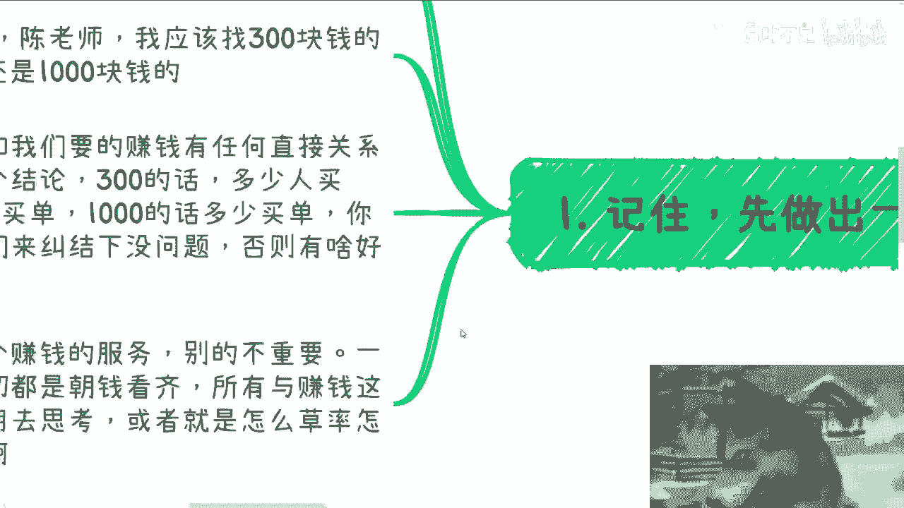
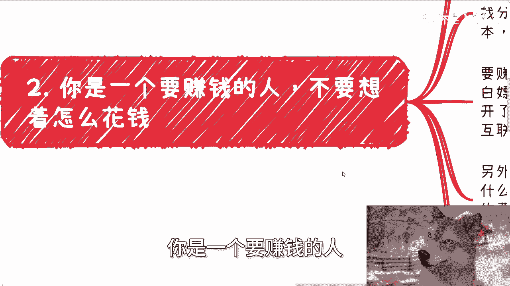
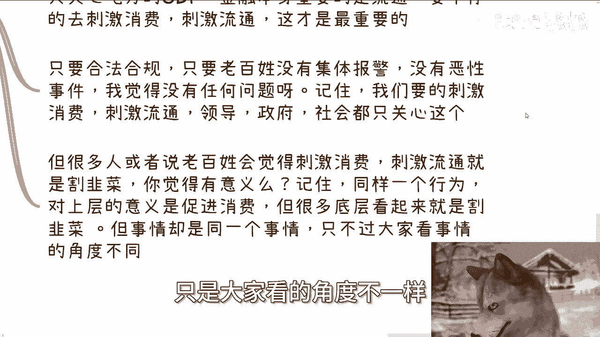
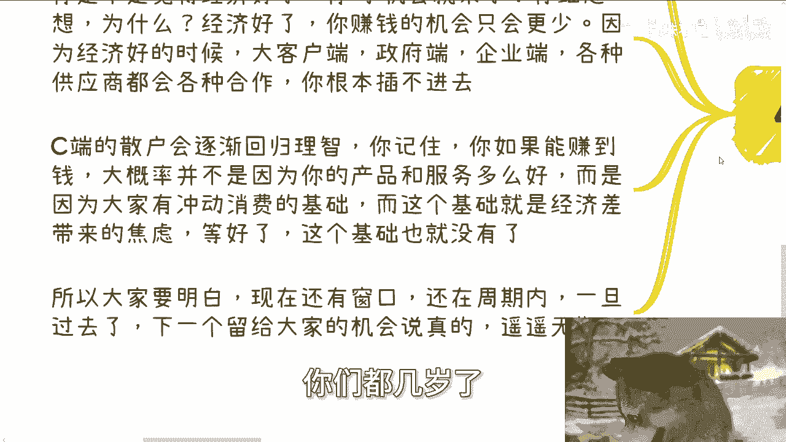
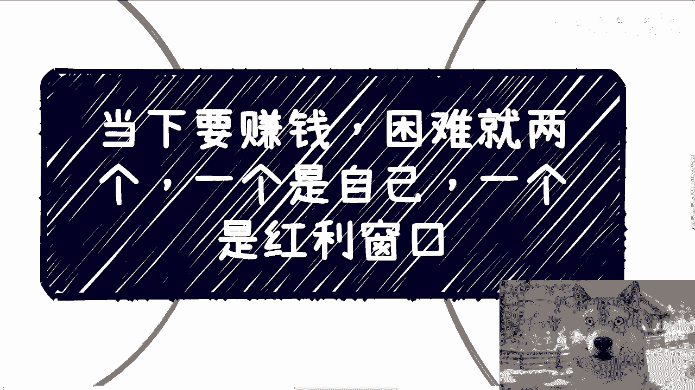

# 赚钱核心思维课 01：突破两大障碍，抓住时代窗口 💰

在本节课中，我们将要学习当下赚钱困难的核心症结所在。课程内容将围绕两个核心障碍展开：个人心态的束缚与对时间窗口的误判。我们将深入剖析这些障碍的具体表现，并提供清晰的行动思路。

## 概述：赚钱的两大核心障碍

当下赚钱的困难可以归结为两个核心问题：**个人放不开**与**错失时间窗口**。无论你是谁，都需要直面并克服这两点。

---

## 第一节：聚焦核心——先做出一个“赚钱的垃圾”

上一节我们概述了赚钱的两大障碍，本节中我们来看看第一个障碍的具体表现：无法聚焦于赚钱本身。

许多人无法赚钱，是因为思考偏离了核心目标。最令人无奈的情况是，与对方深入沟通近一小时后，对方仍在纠结无关紧要的细节。

例如，有人咨询时，花了大量时间讨论是选择自己感兴趣的方向（如健身），还是纠结于租用300元、500元还是1000元的场地。关键在于，你需要问自己：**这些思考与“赚钱”这个结果有直接联系吗？**

思考的逻辑应该是：
```
如果 行动A 能带来 X 收益，且 行动B 能带来 Y 收益
那么 比较 X 与 Y
否则 停止纠结
```





一个真正想赚钱的人，一切思考都应朝钱看齐。所有与赚钱结果无关的问题，都不值得花费0.1秒去纠结，或者应以最草率的方式快速决定。你的首要目标是做出一个能赚钱的服务或产品，其他都不重要。

---

## 第二节：转变思维——从“如何花钱”到“如何白嫖”

在明确了聚焦赚钱的目标后，我们来看看阻碍行动的另一个常见思维误区：优先考虑如何花钱。

许多人受环境影响，启动任何项目时，第一反应是计算成本：如何分润、场地费多少、分销给多少佣金。美其名曰“计算成本”，但这种思维大错特错。

**一个要赚钱的人，第一优先级永远是“如何白嫖”**。逻辑很简单：
```
最高利润 = 收入 - 成本
当 成本 → 0 时，利润 → 最大化
```
因此，首要任务是尝试将成本降至零。能否实现是后话，但思维起点必须是“白嫖”。

以下是几种实践思路：

*   **关于合作**：不要先谈分钱。尝试“画饼”，贩卖未来愿景，例如承诺长期合作或未来收益。
*   **关于场地**：没有法律规定必须预付租金。可以尝试谈判“活动成功举办再付费”，或寻找互联网公司、公共创客空间等提供免费场地的机会。
*   **关于分润**：不要轻易给出百分比分成。普通合作支付固定费用即可。百分比分成仅适用于深度战略合作伙伴。

许多人对于如何赚钱、有多少人买单毫无概念，但对要花多少钱却一清二楚。这完全是本末倒置。

---

## 第三节：打破心魔——重新理解“割韭菜”

上一节我们探讨了成本思维，本节我们来攻克最顽固的内心障碍：害怕被称为“割韭菜”。

很多人在营销、销售时放不开手脚，根源在于心理负担，担心自己的行为是在“割韭菜”。我们暂且不讨论赚钱是否等于割韭菜，而是从另一个角度思考。

国家或地区关心的是**GDP增长**和**金融流通**。金融的核心价值在于刺激消费与流通。只要你的行为**合法合规**，未引发群体性投诉或恶性事件，那么从宏观角度看，你就是在促进消费与经济流通。

**核心在于视角**：
*   **上层视角**：促进消费，刺激经济。
*   **底层视角**：可能被视为“割韭菜”。

**同一行为，因视角不同而被赋予了截然不同的意义**。你需要自己判断，在合法合规的前提下，赚钱与“割韭菜”是否应该划等号。打破这个心魔，是放开手脚的第一步。

---

## 第四节：认清现实——拥抱“经济差”带来的窗口期



突破了个人心态障碍后，我们来看第二个外部障碍：对“时间窗口”的误解。


千万不要期待经济全面向好。一个反常识的认知是：**经济上行，普通人的赚钱窗口反而可能关闭**。

逻辑关系如下：
```
经济好转 → 大客户、政府、企业、资本选择变多 → 竞争加剧（卷） → 普通人切入机会减少
经济下行 → 各方自身难保，标准降低 → 冲动消费与焦虑滋生 → 普通人存在切入缝隙
```
你现在能赚到钱，**99.99%** 不是因为你的产品和服务多么出色，而是因为经济下行期普遍的**焦虑情绪**催生了**冲动消费**的基础。这个基础就是你的时间窗口。

一旦经济好转，焦虑缓解，这个基础就会消失。从事实看，这个窗口期从2021、2022年就已出现。如果错过，下一个类似的机会可能遥遥无期（可能是10年或20年后）。届时，年龄、精力、社会结构都将成为新的壁垒。

因此，不要抱怨环境不好。当下（包括疫情几年）正是规则模糊、野蛮生长、黑暗丛林法则生效的时期，**这才是普通人有机会突破阶层固化的关键时期**。

---

## 第五节：行动指南——专注0到1，忽略1到100

在理解了心态和窗口期的重要性后，我们来明确行动的核心原则。

你可能会觉得具体操作中问题很多（例如做跨境电商会遇到各种细节问题）。但请记住：**所有复杂问题都是1到10、10到100阶段需要面对的**。



你的首要且唯一的目标是完成 **从0到1** 的突破。在实现从0到1之前，不要纠结后续可能遇到的任何问题。那些问题对你当下的成功毫无帮助。

行动公式很简单：
```
当前唯一目标 = 实现 0 → 1 的突破
忽略一切 1 → 100 阶段的问题
```

---

## 总结



本节课中，我们一起学习了阻碍赚钱的两大核心障碍及突破方法：

1.  **克服个人障碍**：聚焦“赚钱”这一单一目标，摒弃一切无关思考；将思维从“如何花钱”转变为“如何白嫖”；打破“割韭菜”的心魔，在合法合规前提下勇敢行动。
2.  **抓住时间窗口**：认清经济下行期带来的焦虑性消费窗口是普通人难得的机会。不要期待经济好转，而应利用当下规则模糊期，奋力一搏。
3.  **核心行动准则**：全力以赴实现从0到1的突破，忽略所有后续阶段才需要担心的问题。

只要能克服这两点，你就有极大可能赚到钱，这或许是改变单纯依靠打工赚取辛苦费命运的唯一可能性。