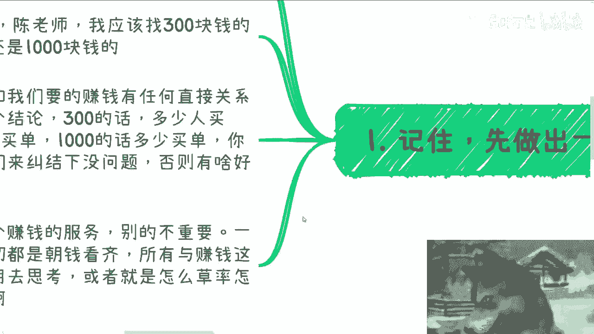
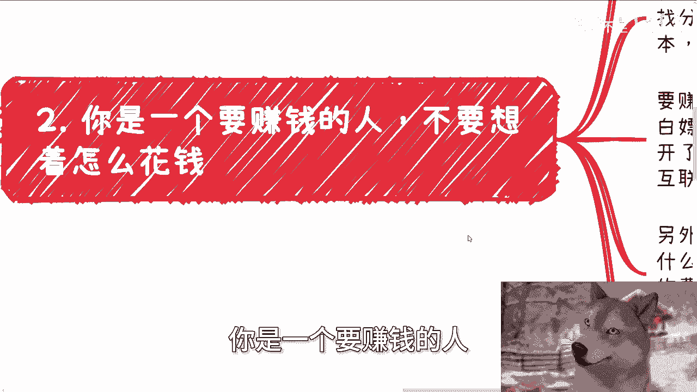
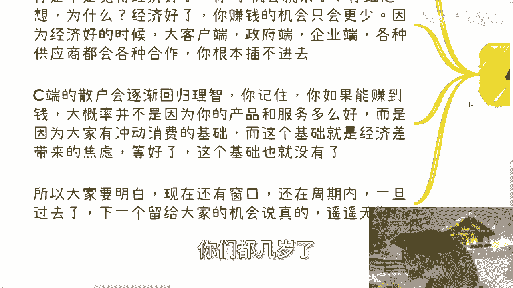

# 当下赚钱的困难就两个，一个是自己放不开，一个是时间窗口 - P1 - 赏味不足 - BV13QxyeTECb

啊大家好啊咳咳，首先这个呃提前预祝大家国庆节快乐啊，是不是可能很多人已经请假了，出去玩了啊，呃我们今天呢这个充电视频啊，主要来讲的是总结一下啊，就是当下如果要赚钱困难的就两个啊。

我觉得我可以一刀切个你们讲，无论你们是谁，就两个问题啊，一是你们自己，二是红利窗口啊，我来解释一下，首先第一前两天我看到这么一句话，我觉得特别认可叫做什么，叫做先做出一个赚钱的垃圾啊，说真的啊。

我跟你们这么说啊，最让我没有成就感的是什么，就是当我跟对方聊了，他妈的快一个小时的情况下，面对方还在纠结细节，你比如说啊就在前两天对吧，你你你我我，我跟别人咨询，一个人跟我说，他说陈老师我应该找四。

就是聊了快50分钟了，他最后才还还跟我说，他说就是两类啊，就是第一类就跟我说，他说哎陈老师我还是想做一些，就是这个咳咳叫什么我感兴趣的方向，比如说什么健身啊这种啊，那还有一个呢就是就就也聊了40多分钟。

就跟我说，他说他说他说我还有个小问题，他说我应该找一个300块钱的场地呢，还是500块钱的场地呢，还是1000块钱场地呢对吧，我就跟他讲啊，我说是这样子的，你思考的问题跟赚钱有没有直接联系有吗。

就比如说你今天做健身跟不做健身，能影响你最终的叫什么买单的人数吗，你知道数量吗，如果你今天不能量化所有东西都是你凭感觉来，那就不要聊了，你做事情本身就是一就这种逻辑就是，能明白吗啊我就问你。

比如说300块钱场地，500块钱场地，1000块钱场地，对不对好，那么这几百块场地跟我们要的赚钱，是否有直接的关系，如果你今天给我个结论，300块钱多少人买单，500块钱多少人买单。

1000块钱多少人买单，你但凡列的出来好没问题，那他妈的我们就来纠结一下这个问题，我们就来讨论一下，深入探讨一下这个问题，否则有什么好纠结的呢，唉妈奇了怪了，对不对哦，我们记住啊，无论你们是谁。

你们首先要做出一个赚钱的服务，别的不重要，赚钱的也可以，你不用管它哦，一个真的要赚钱的人，一切都是朝钱去看齐的，他不会去思考一个跟钱没有关系的问题，所以说你们很多人跟我聊的时候。

你们的问题会让我觉得你们不想赚钱，你们明白吗啊所有与赚钱这个结果无关的，都不要去思考，0。1秒钟都不要去思考，或者来说你觉得要思考的问题，只要跟赚钱没有关系，怎么草率，怎么来，他妈不重要啊。

对不对啊，好第二你是一个要赚钱的人。

不要他妈的一开始就想着怎么花钱，哎我跟你们讲啊，你们还真别说很多人都是这个样子的，我我我不知道到底为什么，可能是因为大家被短视频或者应试教育，或者被身边的人PUA太多了啊。

我我我也不是很清楚到底原原因是什么，就几乎所有的人一开始思考问题都是怎么花钱，我他妈就表示我我我我表示不能理解啊，比如说他说找人合作应该怎么分润，应该给多少钱，找场地应该给多少钱，找分销应该怎么分润。

美名其曰说陈老师，我要算成本，那我就跟你们这么讲，你们他妈的这种想法就大错特错，首先要赚钱的人，第一优先级就是怎么白嫖，就这么简单诶，很奇怪，你跟我说，哎不你你能否认这个问题吗。

你不能否认这个答案为什么很简单啊，只有我所有都白嫖了，我的利润就是最高的，就这么简单，你能不能白嫖，那是后话，但是的第一优先级是白嫖啊，你第一优先级不是考虑怎么花钱啊，对不对，哎奇了怪了。

然后你比如说找人合作白嫖怎么白嫖，画饼贩卖未来呗对吧，你跟他说啊，我们现在跟谁谁谁合作，现在未来跟谁谁合作对吧，以后只要合作都找你，你给他画饼啊对吧，你要赚钱，你就必须站在资本家跟。

既得利益者跟政治家的角度去想问题，你还站在一个老百姓的角度，站在一个韭菜的角度，怎么赚钱，我我已经把话说到这个程度了对吧，还要我怎么讲啊，找场地就更容易了，如果活动开了就给钱，不开就不给，怎么了呢。

对吧，有我跟你们讲，最搞笑的是什么，很多人会跟我说，哎场地不是要预付款的吗，大哥哪条法律规定要预付款，哪个哪个他妈的，这个地球上空，是不是有个程序说找场地必须要预付款，有吗，没有吧，对不对。

那怎么就他妈预付款了呢，聊啊诶奇了怪了，对不对，好，那么场地白嫖的话呢，那就尽量多去找一些，就是互联网公司或者这种公共创空间啊，里面很多场地可以合作，另外呢别动不动就分润，我以前就说的很清楚。

给钱是根据贡献值，跟根据具体做什么事情来定的，不是他妈的上来就分润的，你明白吗啊，正常的合作给固定的费用就好了，一百两百三百四百五百都行，动不动分润，懂吗，分润就是战略合作，不要按照百分比分。

你按固定的分就可以了啊，或者说你按百分比分的话，就是那种很紧密的合作方才按百分比分的，不要他妈上来就10%，20%，这种分法不就是这种分法，让别人会觉得你们就是，明白吗，哦说白了很多人做事情。

你问他怎么赚钱，大概多少人买单，他不知道的，但是花多少钱他倒是清楚，那那我我我每次我就很想说，大哥大姐，你们是不是颠倒了啊，该关心的说句不关心不关心，关心不该关心的东西乱关心，第三关于割韭菜。

很多人赚不到钱，其实是自己阻碍了自己，也就是今天我主题里面说的第一个困难点，就是你们自己，比如说做营销，做产品，做服务，他就很放不开，你问他为啥放不开，他说我放开了，我就觉得我在割韭菜好。

我就这么跟你们讲啊，我先不论你是不是想赚钱，我也不论你是不是在割韭菜，我并不是很想告诉你们，赚钱跟割韭菜是不是划等号，因为我今天跟你们讲划等号不划等号，我觉得都都是都有我灌输给你们的嫌疑啊。

我不想这么样去做，你们自己去想，但是我只想告诉你们一件事情，他只关心地也就是当地区或者市的或者省的GDP，对不对，好金融本身的价值是什么，是流通，要要不停，就是要需要不停的去刺激消费，刺激流通。

你你们最近看到新闻，你们你们也看到了，就是国家在不停的刺激消费，这是最重要的，那么我们就这么说，只要合法合规，只要老百姓没有集体报警，只要没有恶性事件，我觉得没有任何问题，而且不是我觉得没有任何问题。

国家呃，呃呃法律，或者来说整个的这个机构，都不会觉得有任何问题，记住啊，我们的目标是刺激消费，刺激流通，他只关心这个东西，能能听得懂吗，啊但是很多人或者老百姓会觉得刺激消费，刺激流通就是割韭菜。

那我就问你们，你们觉得有意义吗，对不对，就说同样一个行为对于上层的意义是促进消费，促进金融发展，但很多底层看起来就割韭菜，但是你们会发现，无论上面看还是下面看，我们所描述的事情是同一件事情。

只是大家看的角度不一样好。

那么说到这，你们自己再去自己，你们自己去想一想，赚钱跟割韭菜是不是划等号，你们这你们自己判断对吧啊。

好第四啊，最后我再强调一点。

就关于红利窗口啊，千万千万不要那么期待经济往上去走，能懂吗，因为网上走了，大家赚钱的时间窗口也都到头了啊，你是不是觉得经济好了，你的机会就来了，正常老百姓都这么想，对不对，好。

但是仔细想想看有因果关系吗，经济好了跟老百姓能不能赚到钱，机会来了，他妈的有半毛钱金因果关系啊对吧，但是经济好了，你赚钱机会更少了，这是有因果关系的，为什么，因为经济好了之后，大客户端，政府端，企业端。

资本端，各端都有更多的人去卷更多的供应商去合作，你作为一个普罗大众，你作为一个老百姓，你根本就插不进去，现在你还有插进去的可能性，因为现在大家都是一就是泥菩萨过江，自身难保对吧。

C段的散户会逐渐在经济好了之后回归理智，你记住啊，你如果能赚到钱，大概率，并不是因为你的产品跟服务做得多么好啊，你不要膨胀，你也不要自就是自自我骄傲，我告诉你们，99。99%。

不是因为你们的产品跟服务多好，而是因为大家在经济不好的时候，有冲动消费这么一个理念，而经济不好就是这么个基础，但是这个基础就就是就是啊对，在这地方补充一点，就是这个基础就是经济差所带来的焦虑好。

那么问题是等经济好了或者有经济好转了，这个焦虑和这个基础也就没有了，你能明白你们能听明白吗啊所以大家要明白，现在是有窗口期的，而且这个窗口期很有，从事实角度来讲，2021年，2022年就有了。

一直到现在，如果你们没有抓住，那么我就告诉你们，你们就是纯粹在浪费时间，但是你们现在还有最后的周期，一旦过去了，下一个留给你们，留给我的机会，我跟你们讲遥遥无期，可能可能是10年后，可能是二几年以后。

你们想看，10年后，20年后你们都几岁了。

能明白吗啊不要老是在那边说环境不好，也不要老是在那边说没有机会，环境跟机会现在已经是非常天然的了，就是就是这么说吧，我们再把话再打开天窗一点，就是经济非常差的这么几年，包括疫情的这么几年。

就是野蛮生长的，这些年就是黑暗丛林法则生效的这些时间，而正是这些时间，老百姓才有机会，否则呢一个个金字塔都固定的，一个个就是一个萝卜，一个坑，我们怎么切，我们怎么做，对吧，就这两点没了啊。

你们所要考虑任何的微操哦，比如说你们觉得哎这个东西后面怎么做，打个比方，你们要做跨境电商，你们要做别的东西，你们觉得这里面问题很多，对不对对，但是所有的问题不妨碍你们0~1，你们的目标先是0~1。

所有后面关注的问题是一到十十到50，50~100的问题，不要在没有做到0~1的时候，就在那边纠结，后面那些问题对你们没有任何帮助。

好吧啊，所以说在我的观念里面啊，我今天说的这两点，你们只要能克服，一定赚得到钱，而且是咳咳怎么说呢，改变你老百姓，改变我们能够通过打工去赚辛苦钱的，唯一的可能性，至少在我看来没别的可能性啊。

好那就这么着吧啊，那个职业规划啊，工作上面那么商业规划啊，在副业啊或者做别的东西上面，你们觉得要是有任何问题的啊，需要跟我详细沟通一下呃，根据你们个人的情况给你们一些建议。

或者还说额叫什么让你们少走点弯路的话，那么你们可以整理好对应的问题，跟个人背景好吧。