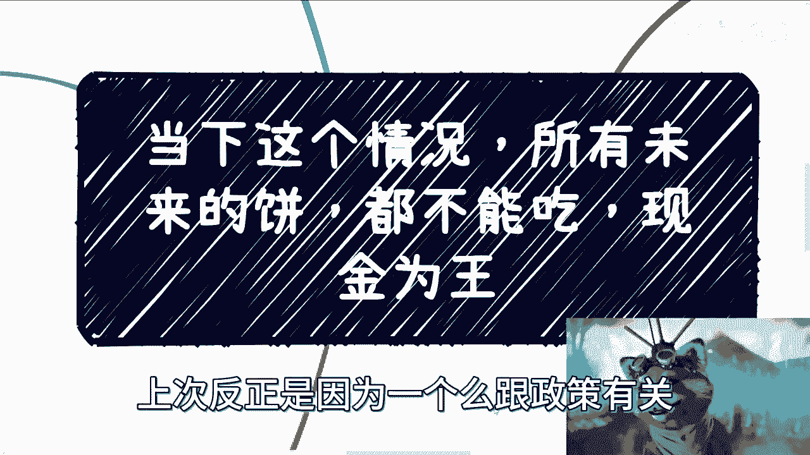

# 当下这个情况-所有未来的饼都不能吃-现金为王---P1---赏味不足---BV1aN4y197Ap_

## 概述 📋

在本节课中，我们将要学习在当前经济环境下，为什么“现金为王”是核心生存法则。我们将分析未来承诺（“饼”）的不可靠性，探讨个人应如何调整策略以应对严峻的现实，并强调建立多元现金流渠道的紧迫性。

---

## 当前形势的核心判断 ⚠️

上一节我们介绍了课程的主题，本节中我们来看看对当前形势的核心判断。

当下情况需要被强调。所有关于未来的承诺都不能相信，无论来自何方。现金是最重要的。没有现金，就要想办法获取金钱和建立关系。未来的机会将越来越少。

事实已经非常极端，只是大众尚未普遍知晓。世界是割裂的，许多人并未察觉真实情况的严峻性。他们可能认为形势一片大好，未来充满希望。但如果你亲自去高校、政府或企业了解，就会知道现状究竟如何。

因此，这里需要强调的是：时间不多了。这并非贩卖焦虑或危言耸听。事实只会比我所讲的更差。

---

## 为何“未来的饼”不可信？ 🎂

理解了形势的严峻性后，我们具体分析为什么不能相信任何关于未来的承诺。

首先，近期咨询中发现，未来承诺的种类繁多。例如：承诺未来年薪达到某个数额、承诺几年后的晋升路径（从初级到高级经理甚至VP、CEO）、承诺未来给予股权或期权、承诺找到好工作或拥有稳定收入。

然而，当前的现实情况是：稳定无从谈起，承诺无法兑现。企业自身都难以生存，老板可能都不知道下个月的工资从哪里来。谈论稳定如同天方夜谭。许多本科和硕士毕业生得出“稳定”的结论，这令人费解。公司并非你所有，为你画饼的人，他们自己未来是否还在这家公司、这个行业都未可知。公司三五年后是否还存在也是未知数。许多事物可能一夜之间回到原点，例如房地产政策。即便如此，仍有人选择自欺欺人。

---

## 当前面临的具体挑战 🔥

认识到承诺的虚幻后，我们来看看个人在现实中面临的具体挑战。

其次，当下所有人都在无脑地将风险后置。读研的、攻读水硕的、应届毕业生、被裁员的人，全部涌入就业市场一起内卷。每年都有数千万应届生加入竞争，而岗位数量有限。许多人又不愿意从事剩下的许多工作。这就是接下来两三年要面对的局面。

第一，不可能在短时间内找到增量市场。不要提什么双碳、光伏、新能源，这算不上真正的增量市场。去看看现在做这些的都是什么公司就知道了。全球经济暴雷仍在继续，企业生存困难。

第二，股权期权本身或许可信，但IPO（首次公开募股）的可能性极低。能赚到钱已属不易，谈论IPO更是空中楼阁。如果到了2023年还有人相信这种话，实在令人难以置信。

企业需要看市场和经济的脸色，打工者需要看企业的脸色。部门说解散就解散，工作说没就没，第二天就可能让你离开。稳定性根本不存在。这两天还有人问，为什么不能在大公司稳定工作七八年？这种观念不知从何而来。难道都像视频中我头上的三个物品那样稳定吗？

如果你在政府、高校或企业有关系和朋友，去了解一下真实情况，就会知道形势有多么严峻。严峻到我无法在视频中详细讲述，不是欲言又止，而是不能讲，讲了就可能被举报。当然，很多人可能也获取不到真实信息，这是当下可悲的地方之一。

---

## “现金为王”的具体策略 💰

面对重重挑战，我们该如何应对？本节将阐述“现金为王”的具体实践策略。

那么，什么是“现金为王”呢？我将其分解为以下几点：

以下是实现“现金为王”的三个核心策略：

1.  **优先选择回款快、现金流高的项目。** 公式可以表示为：**优先选择项目 ≈ f(回款速度， 现金流强度)**。这意味着在可能的情况下，应倾向于能快速产生现金流入的业务或工作。
2.  **尽量减少在不熟悉领域的投入。** 这包括额外的投资或其他形式的支出。代码逻辑可以类比为：`if not understand(domain): minimize(investment)`。避免因不了解而造成的损失。
3.  **建立多个现金流渠道。** 如果你只有打工这一个收入来源，那么在未来你将毫无抗风险能力，或者说风险极高。不要问风险高了怎么办，未来现实会告诉你，不是所有问题都有解决方案，有些就是无解的。

---

## 未来的趋势与行动呼吁 🚀

掌握了核心策略，我们还需看清未来趋势，并立即行动。

第三点，今年许多事情处于停摆状态。我之前直播提过原因，结果被封了。目前能看到的是，明年一定会加快步伐去做一些事情。这意味着所有人都会动起来，无论是普通百姓还是既得利益者。动起来就意味着各个领域都会更加内卷，不管是水面上看得见的20%，还是水面下看不见的80%，都一样。商业会更卷，工作就更不用说了，而且会有大批人找不到（理想中的）工作。

当然，这里需要说明，不是完全找不到工作，而是找不到自己想要的。很多人会觉得岗位、薪资与多年所学不匹配，眼高手低。这无所谓，因为时间不多了。亲身体会就会明白。我在充电视频里说得很清楚：所有读书学到的东西、你没接触到的所有关系，与赚钱毫无因果关系。

换言之，这两年如果你找不到自己的定位，积累不了自己的关系网，或者找不到多种赚钱的渠道，那么未来一定会越来越难。所以，当下不要再浪费时间了。不要再搞那些有的没的，也不要再说“我要积累、磨练技术”之类的话，没有用。

今天早上咨询时，对方还说思维要慢慢改变。我认为所有事情都可以慢慢来，但我必须告诉你们，当下的大局和整体形势已经没有那么多时间给我们了。没有时间让我们去慢慢积累、准备。你必须放开手脚，快速去认识人，快速切入市场，快速跑起来。一天24小时全部利用起来，这才是当下应该做的。

要么你就去考编、考公，然后躺平。除此之外，所有中庸之道都不要采取，也不要和别人比年薪、比这比那，没什么好比的。几年后大家都一样，可能都是“尸横遍野”。就这么个情况。

---

## 总结与建议 📝

本节课中我们一起学习了在当前经济环境下“现金为王”的重要性。

最后，如果大家想了解更真实的东西，最好自己去积累，接触更多的人。正如我在视频里讲过的，我所有获取信息的渠道来自：公务员、政府领导、资本方、创业者以及我的合作伙伴。他们之所以愿意告诉我，是因为我值得信任，令人放心，并且我清楚我们的共同“敌人”是谁。

如果你不想躺平，不想任人摆布，不想在打工路上无止境内卷，如果你想知道别的可能性，那么请整理好你手上的牌（你的技能、资源），私信来咨询。我所有的咨询都不允许录音，因为涉及很多敏感信息。如果发现录音，我将采取法律程序。

**核心总结：**
1.  拒绝一切关于未来的空头承诺。
2.  **现金为王**是核心生存法则。
3.  建立**多元、快速的现金流渠道**是当务之急。
4.  认清形势严峻性，停止无效积累，立即行动拓展人脉和机会。
5.  获取真实信息需要建立可靠的人际关系网。