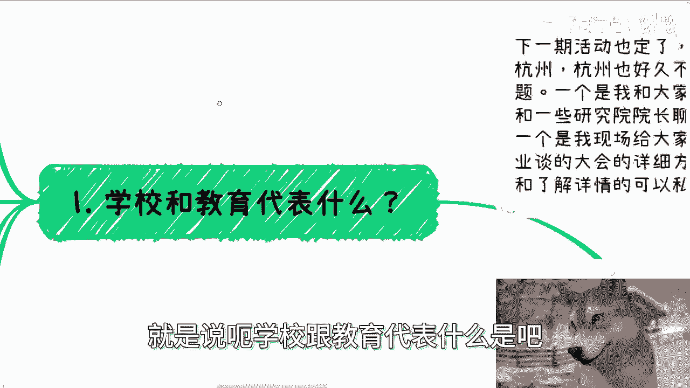
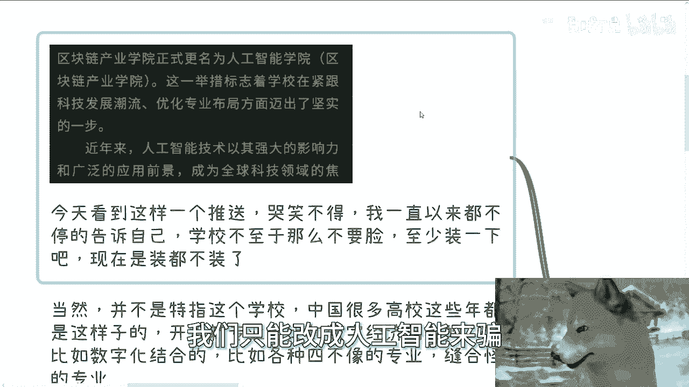
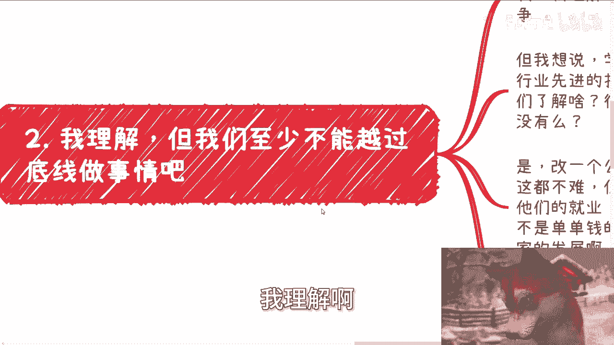
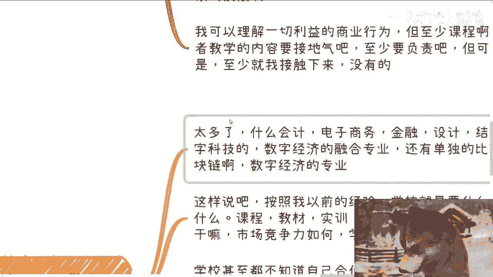
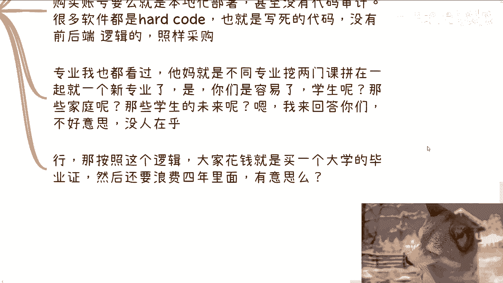
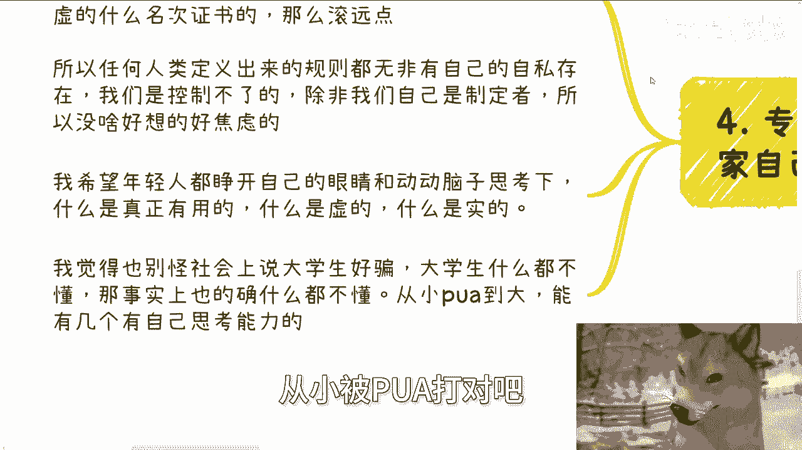
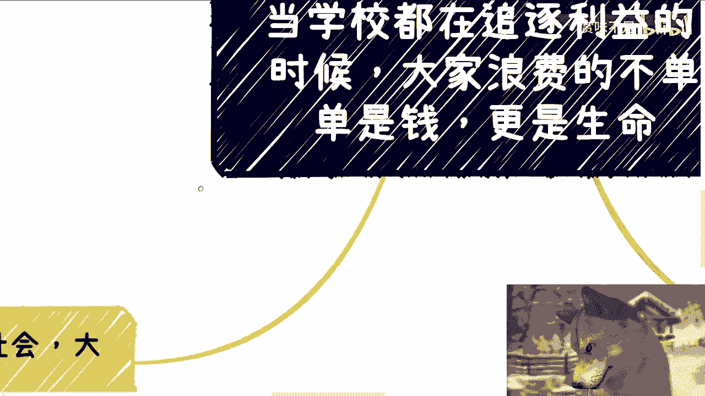
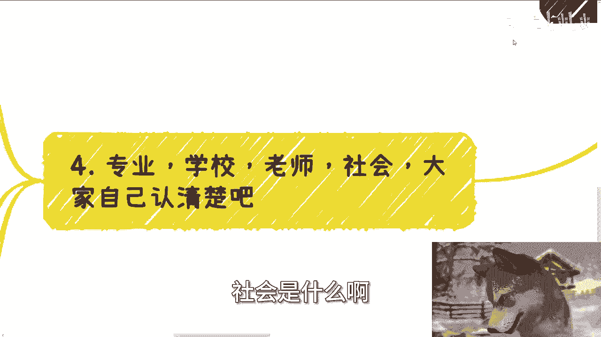

# 当学校都在追逐利益的时候，大家浪费的不单单是钱，更是生命和未来 - P1 - 赏味不足 - BV1JctKeyELt

好大家好呃，今天呢其实视频都已经弄完了，但是呢我还是临时想说一下这个事情啊，因为我他妈实在是不能忍了啊，我也是思考了半天啊，想想还是说一下吧，反正呢我感觉啊可能再过个5年。

10年也没有人再记得这个事情啊，嗯今天这个主题啊讲的是，当学校啊都在追逐利益的时候，那大家啊作为学生，作为家长，作为家庭浪费的不单单是钱啊，更他妈是生命啊，首先啊我先说一下下一期活动我已经定了啊。

9月21号下周六好吧，一点到六点在杭州啊，在杭州杭州也好久不去了，我看了一下，上次去好像是4月份的时候啊，那么本期呢我也定了几个新的主题啊，因为每次一样也没什么意思是吧，一个是我会跟大家私下分享一下。

就是上海大会时候，我和一些就是嘉宾啊，还有院长聊下来一些呃，政府最新关心的一些点，一个呢就是说我额觉得就是把以前啊，就跟高校这边的一些实训平台啊，包括产业啊，产业园这边跟协会这边谈的一些。

大会的这个详细方案啊，我会就直接把那个PPT跟那个方案，我到时候就是打开来给大家看一下，然后我一边看一边给大家解释解析一下啊，那么报名跟想了解详情的可以继续私信我啊，呃那今天我们讲这个东西呢。

我也不想讲的很沉重啊，但是我的确不是很开心啊，那么第一呢就是说呃学校跟教育代表什么是吧。

首先啊我今天因为大概吃饭的时候，我看到这么个推送啊，妈哭笑不得哈，我一直以来呢因为毕竟啊我19年一八年啊，19年吧，19年开始，我跟高校啊就有很多一些深入的合作，我一直以来呢不停的告诉自己啊。

大家是商业合作，大家是利益驱动啊，但是呢学校毕竟啊还是一个教书育人的地方啊，还是一个要为年轻人未来着想的地方，我一直在告诉自己啊，学校不至于这么不要脸啊，他妈至少装一下吧，啊现在他妈装都不装了啊。

我看到个什么呢，你们也看到了对吧，你没看到我可以给你们读出来啊，某学校啊发了一个公众号啊，叫做区块链产业学院，正式更名为人工智能学院，括号区块链产业学院啊，这一举措标志着学校紧跟科技发展潮流。

优化专业布局方向迈出坚实的一步对吧，近年来，人工智能技术及其强大的影响力，和广泛的应用前景，成为全球科技领域的焦点，巴拉巴拉巴拉巴拉，我给你们翻译一下啊，这句话这他这篇文章的意思就两点。

第一我们装都不想装，我们不要脸，我们甚至他妈的都不愿意开一个新的公众号啊，我直接就改名，你能把我怎么地，这是第一点，第二点就是我们区块链骗不到钱了，我们只能改成人工智能来骗。

就这么简单啊，什么学校我不点名，为什么，因为我不想特指某一个学校，因为我想告诉你们，中国这种高校多了去了，它也不是一个学校，有什么用呢，对不对，近几年疫情以来，近几年开设新专业，比如数数字经济结合的。

比如数字化结合的，比如各种四不像专业的，我知道很多对吧，也有找我合作的啊，各种缝合怪，也有，也有学生找到我这边来抱怨的很多很多啊，我这个截图，这个学校也有，他们区块链专业的学生找到我这边来。

我当时怎么跟他们讲呢，我说你们都已经找到我这边来说明什么，说明你们已经走投无路了，对不对，你问我理解吗，我理解啊，我毕竟跟学校合作过这么多年，我也给出过很多学校提供过区块链元宇宙对吧，包括数字资产。

包括数字化啊，一些实训平台，我他妈也是写过人社部区块链国标的人，我能不清楚吗，啊但好在我没有任何地方入职，我属于三界之外，我今天就还能来发点声音，否则呢我以前就说过，但凡我在任何一个方任职，我能说什么。

我敢说什么吗。

啊我不相信学校老师都是，但是他们不敢说，对不对，好，那今天由我来讲啊，第二我理解啊。

但是呢我们至少不能越过底线做事情对吧，就像我这边写的，我理解学校，他不是一个靠西北风就能够撑起来的地方，我理解学校也是要盈利的，我理解学校也是要网上申报项目，去申请各种各样的一些一些一些有的没的。

什么重点学校的资质的对吧，去相互竞争的，但我想说学校有没有想过，你们每一次说什么什么什么是行业先进技术，什么什么什么未来有发展，你们真的了解吗，啊你们了解啥，不要他妈的在我这边装，没什么好装的对吧。

各学校校长副校长，院长副院长，什么水平，我不是不知道对吧，啊就像我一开始举的例子，对改一个公众号，改一个学院，申报一个新的学院，这都不难，但你们考虑过读了这么多年的学生吗，考虑过他们的就业吗。

考虑过学生的未来吗，啊就如我一开始说的，这他妈是单单钱的事情吗，他不是，这简直就是浪费大家生命跟耽误大家发展，对吧，所以我今天才在微信朋友圈里面发我，我说的那句话叫什么叫做学生哪，他妈是酒啊。

学生哪他妈是人啊，啊你说不教东西，不教思想，不教不不教一些产学研的东西，不教接地气的东西，我就算了，简直就把学生当韭菜割对吧，而且现在明面就告诉他，但你们他妈就是韭菜啊。

我可以理解一切利商利益的商业行为，但至少我们给学生的课程或者教学的内容，要接地气吧，至少要负责吧对吧，但可惜的是他妈的，至少我接下来我没有看到过啊，甚至连他妈装都不装了。

对不对，那为什么我们要强调学生，为什么这个事情我很不开心，是因为哼哎哪怕是国际战争，你们去了解一下对吧，哪怕是国际战争，你有很多事情也是不成文的规定啊对吧，就是哼你你你举个例子来讲，人家你你跳伞对吧。

你有看到过人家拿着炮拿着枪，他妈的对着跳伞一个个打的嘛对吧，你不你你大家可以战死沙场，大家可以你死我活，但是你不能去攻击一个没有任何反击能力的人，对不对，那学生也是一样的呀，啊卧槽。

现在学生学生什么概念啊，你几乎什么都不懂，什么也就不知道，他需要的正是学校跟老师带来的东西，你们带来了什么啊。

第三新专业真的我跟你们讲啊，你们自己警惕啊，因为太多了，什么会计啊，电子商务啊，金融啊，甚至包括什么平面设计啊，啊结合数字科技的结构流，结合人工智能的数字经济的融合专业的，还有单独的。

比如说以前开设区块链，就比如说哼某某某学校对吧啊，这样说啊，按照我以前的经验，按照这些学生给我的信息学校就属于要什么，没什么课程，教材实训实验室有吗有吗，哪个学校敢说有啊，有个屁啊，全他妈外面采购的。

你有什么东西啊啊你有什么自己的东西吗，你懂什么东西啊，啊学习之后学生能干嘛，市场竞争力如何，市场目前发展如何，学校一概不知，他知道个屁对吧，学校甚至都不知道自己合作产品是什么啊。

学校买的东西要么就是SARS，要么就是本地化部署，甚至没有他妈代码审计的，因为学校里面没有人懂代码审计，他不知道怎么审计，对不对，很多软件都他妈hot code的，都他妈写死的啊，学校看似买了个前后端。

但他妈的根本就没有后端都写死的，学生懂个屁啊，啊专业我也看过了啊，他妈的就是不同的啊，就专业课程就他妈不是就是不同的专业，挖两门课拼在一起，就是个缝合怪对吧，你游戏做一个缝合游戏，我就忍了。

你课程弄一个缝合课程算什么事情呢，啊你就像我跟我跟很多学生说的，你们对吧，要认清事实，很多时候现在连就是叫什么，就是科班出身的，比如说计算机也好，营呃市场运营也好对吧，设计也好，我说你们科班啊。

包括金融也好，科班出身的人都不容易找工作，你们这种四不像的专业怎么可能找到工作呢，对不对，你开这种课程，学生是啊，就就学校是容易了，老师也容易了，学生呢家庭呢对吧，那我就问那些学生未来呢啊。

然后我我跟你们讲啊，我来回答你们，不好意思，没有人在乎你们的未来对吧，那你按照我现在看到这个逻辑，那我就说啊，我说行，那按照这个逻辑，那大家花钱就就是我，你你你为什么不节省我4年时间。

我花钱就买个直接给我逼毕业，这么好的呀，有什么好上的呢。

有意思吗，对不对啊。

第四专业学校老师社会啊，大家自己认清楚啊，就是我早上发过这么一条微博啊，我是这么写的，我说我对人这种生物呢很深很失望，为什么无论什么岗位，无论什么层级，无论什么职级，你就比如说老师这种角色对吧。

我觉依依我的三观来讲，我不会因为你在什么学校，比如说什么交大，清华北大啊，比如说你你是什么教职，比如说什么教授啊，得过什么金奖的，我不关心的，为什么，因为这些都是都是虚的。

我不认为你有任何的头衔能够让你直，就是能够直接让你来教我，你要能来教我，或者我要认可你，只有一种可能性，就是请你用直接的实例，用真正的思维，真正的逻辑，真正了解市场的这种理念，来让我幸福。

而不是他妈的跟我说，你是什么学校，你是你是什么教职，你是什么职称，你是什么什么什么政治等级，关我他妈吊事啊，对不对，你要装逼，去别的地方装，这我在我这边是装不了的啊，所以任何人呃。

就任何人类定义出来的规则，其无非都有自己自私的存在，我们是控制不了的，除非我们自己是规则制定者对吧，但是我们现在不是，所以说我觉得你们也没什么好想，或者好焦虑的啊。

我希望年轻人能够睁开自己的眼睛跟动动脑子，稍微动一下自己的脑子，尊重一下自己是人类这么一个身份啊，什么是真正有用的，什么是虚的，什么是实的啊，我我另外一方面呢我也觉得啊。

也别怪社会上面大家都说大学生好评对吧，那你们也可以想想看，大学生的确什么都不懂，那事实上也的确不懂，从小被PUA打对吧。

能有几个有自己思考能力的，对不对啊啊所以我觉得今天这个内容啊。

我倒不是想阐述某些观点啊，或者某些你说你说你说怎么样的结论啊，我觉得两方面，一方面呢，我其实其实一50%的内容，可能说给的对象是老师跟学校，那当然可能大概率他们听不到啊，但是剩下的我也希望你们作为学生。

你们作为个体，你们作为老百姓，你们能够更多的了解一下，看明白啊，就是学校就我我这边写的，看明白专业到底是什么。

学校是什么，老师是什么，社会是什么啊。

不要就是说什么都不了解，就听着这个东西哎牛逼对吧，哎呀好像牛好像哎未来又很有发展哦，他妈的就就冲了对吧，怎么样子有什么意义呢。

唉行吧，那就这么着吧，好吧，我就不想多说了，好嗯，还是那句话，就是点到为止啊，我都担心我今天这个内容活不了多少时间啊，嗯好吧，然后下周六活动，你们要报名的或者要了解的，反正去私信我好吧。

剩下的唉这个视频就不说了吧。