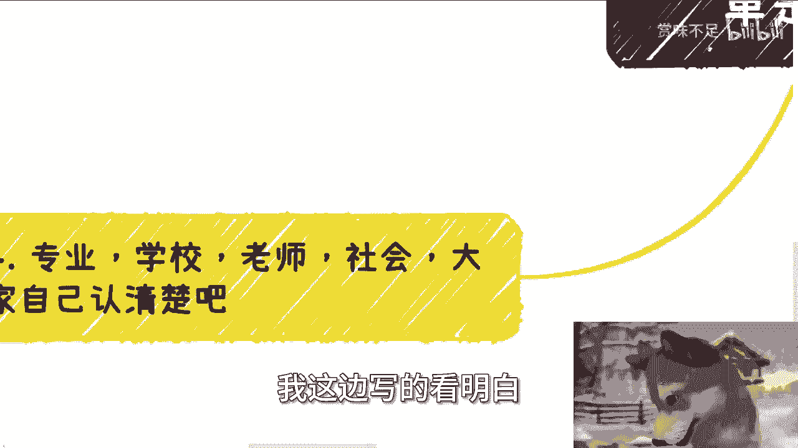
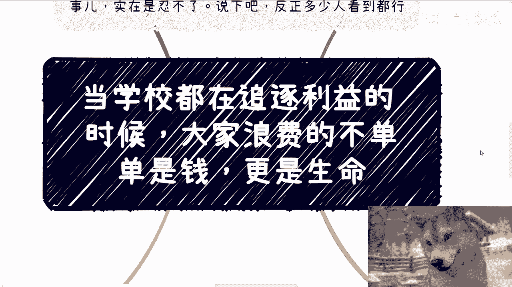

# 课程名称：警惕教育功利化：当学校追逐利益时，我们失去了什么？ 🎓

## 概述

在本节课中，我们将探讨一个严肃的社会现象：当教育机构过度追逐商业利益时，对学生、家庭乃至社会造成的深远影响。我们将分析问题的具体表现，并思考作为个体应如何应对。

---

## 一、 一个令人深思的案例：学院的“华丽转身”

上一节我们概述了课程主题，本节中我们来看看一个具体案例。

今天，我看到一则令人哭笑不得的推送。某学校在其公众号上宣布，“区块链产业学院”正式更名为“人工智能学院（区块链产业学院）”。文章称此举是为了“紧跟科技发展潮流，优化专业布局”。

然而，这件事的本质可以归结为两点：
1.  学校连表面功夫都懒得做，直接沿用旧公众号改名。
2.  区块链概念可能不再“吸金”，于是转向当下更热门的人工智能领域来获取资源。

这个案例并非个例。近年来，许多高校开设了与数字经济、数字化等结合的“四不像”新专业。这些专业往往是不同领域课程的简单拼凑，即所谓的“缝合怪”。有该区块链专业的学生曾向我求助，他们感到迷茫且走投无路。

**核心问题**：学校在追逐风口、申报项目时，是否真正考虑过学生的就业与未来？

---

## 二、 学校的角色与失守的底线

理解了具体案例后，我们需要思考：学校究竟代表什么？

我理解学校需要运营，需要盈利，也需要在各类评估和竞争中争取资源。商业合作与利益驱动本身并非原罪。

但是，学校不能越过底线。这条底线就是：**对学生的未来负责**。每一次宣称开设“前沿”专业，学校是否真正了解该行业？课程设置是否接地气？教材、实训、实验室等教学资源是否完备？学生学成后市场竞争力如何？

遗憾的是，许多学校并未做到。它们采购的实训平台可能代码写死、缺乏审计，课程则是从不同专业东拼西凑而来。这种敷衍了事的做法，浪费的不仅仅是学费，更是学生最宝贵的青春和未来的发展可能性。

**核心警示**：`教育 ≠ 生意`。学生不是等待收割的韭菜，而是需要被引导和赋能的未来。

---

## 三、 给学生的建议：如何识别与警惕“问题专业”

面对可能存在的“问题专业”，学生和家庭需要保持警惕。以下是需要警惕的专业类型：

*   **各类“融合”或“结合”专业**：例如“会计+数字科技”、“金融+人工智能”等，需仔细审查其课程是否扎实，而非简单拼凑。
*   **追逐单一技术风口的独立专业**：如过去的“区块链专业”，需考察其课程体系、师资力量和实训条件是否成熟。
*   **任何缺乏核心课程与资源的“新”专业**：如果专业描述空泛，课程设置模糊，就业方向不明确，就需要格外小心。

选择专业时，务必认清一个现实：即便是计算机、金融等传统“科班”出身，就业竞争也已十分激烈。一个课程设置混乱、师资薄弱的“四不像”专业，很难让学生在市场上具备竞争力。

**核心行动**：主动调研，问清课程细节、师资背景、往届就业情况，不要被华丽的专业名称所迷惑。

---

## 四、 重新定义认知：专业、学校与老师

最后，我们需要重新审视一些固有观念。

我对“人”常常感到失望，尤其是在教育领域。一个人的头衔——无论是来自名校，还是“教授”、“专家”等职称——并不能自动赢得我的尊重。

我认可老师的唯一标准是：**能否用扎实的实例、清晰的逻辑和对市场的真切了解来说服我**。人类制定的规则往往掺杂私利，我们无法控制，但我们可以控制自己的判断。

因此，年轻人需要：
1.  **睁开眼，动动脑**：尊重自己作为独立思考个体的身份。
2.  **分清虚实**：什么是真正有用的知识与技能，什么是虚名和包装。
3.  **理解环境**：明白为什么社会上会有“大学生好评”的说法，部分原因在于我们的教育有时未能培养出具备独立思考和实战能力的学生。

**核心心态**：`独立思考 > 盲目崇拜`。教育的真正价值在于培养思维和能力，而非灌输服从和获取虚名。

---

## 总结

本节课我们一起探讨了教育功利化的问题。我们从一所学院更名的案例切入，分析了学校在利益驱动下可能失守的教育底线，为学生提供了识别“问题专业”的具体建议，并最终呼吁大家建立对教育、专业和师资的独立认知。

希望这堂课能带来一些思考。作为学生，请务必为自己的未来负责，保持清醒，谨慎选择。作为教育者，则请永远不要忘记“教书育人”的初心。

> 教育不是灌满一桶水，而是点燃一把火。