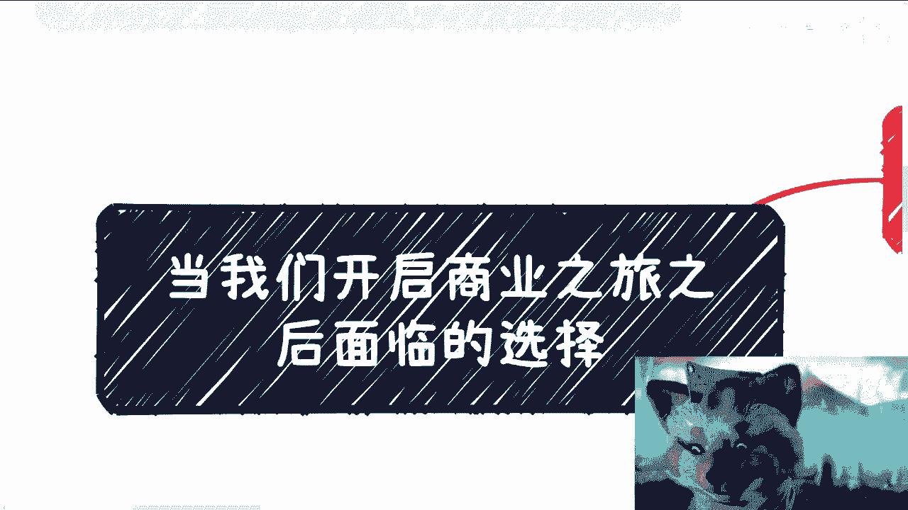
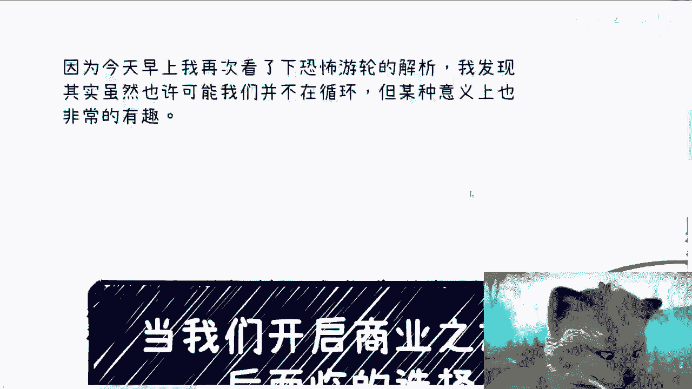
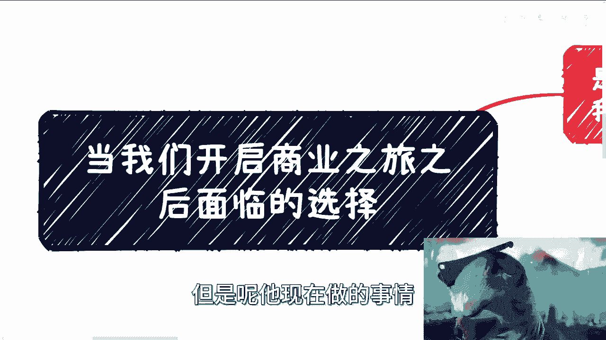
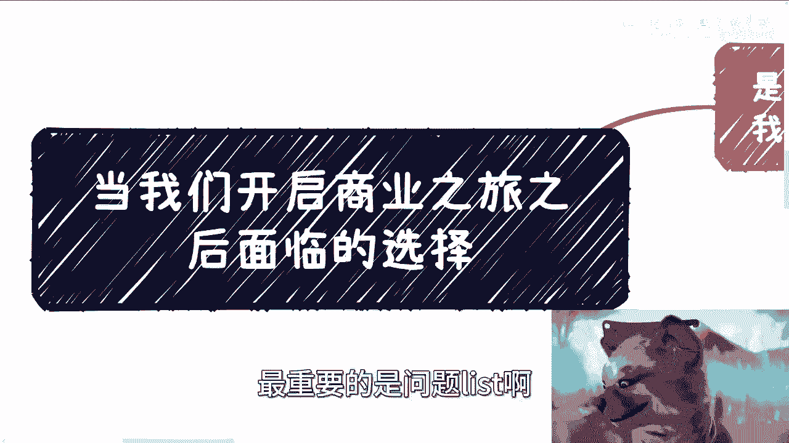

# 当我们开启商业之旅之后面临的选择 - P1 - 赏味不足 - BV1bN4y1Q7tx

啊，大家好啊，这个。😊。

我都不知道今天这一期我应该放在什么合集里啊。呃，到时候还是放在应届生那个吧。这个虚心的小伙伴你看到了对吧？今天跟以前不一样的地方是今天只有一根线啊，就是这么屌怎么办呢？对吧？😊。

因为今天早上呢我这个闲着无聊啊，我再次看了一下恐怖游轮的解析。哎，我发现其实虽然也许mabe可能啊这个我们也在。😊，我虽然我们并不在循环里面，对吧？但是某种意义上来讲呢，我觉得也是蛮有趣的啊。

这个我们可以来聊一下。

呃，细心的小伙伴会发现，对吧？今天只有一根线啊。😊，好，我们往上来看啊。😊，首先啊这个呃当然我其实今天还考虑过这个东西我到底放不放充电视频里面，后来想想算啊，还是就是公开出来比较好啊。😊，呃。

首先第一个啊，当你20多年30多年之后，陡然之间发现啊要去学习商业，或者说你想去赚钱。😊，那么自然而然，你肯定会选择不同的分支，对吧？就你只要想要去赚钱，你就一定会选择不同的分支，你知道吗？

这没有办法的，一定是这样子的。啊，那么有哪些呢？我们来看啊，首先其中一个时间线。😊，我们还是被禁锢在啊这个楚门的世界里面。选择了。不停的去卷学历啊，选择了不停的打工，选择了不停的被PUA对吧？

这个事情没有办法。😊，对吧这事情没有办法，那么不停的自我怀疑啊，不停的去怀疑别人，对吧？这个事情呢，我觉得是呃当下大部分人啊所面临的这么一个选择。那么在这个分支里面呢，又有两个分支，对吧？

在第一个分支里面，对吧？一种是。😊，自我伤害啊，为什么比如说为什么我找不到好的工作啊，对吧？然后自卑啊，自我怀疑啊，然后放到比如说归根归结于比如说家庭原因啊，或者以前成长的原因啊等等等啊。

anyway就是基本上就是说所有的问题呢，可能出在我自己或者出在我所在的家庭通俗点来讲，就是说投太多的不好啊，希望通过讨好别人啊，不停的加班，不停努力去获取别人的认可。在这个分支里面啊。

我们往往觉得努力一定可以得到回报啊，同时努力也能够一层层往上走。啊，但是很可惜的是，呃事实却不是这样子啊，啊如果来说事实是这样的话呢，现在都已经是均富卡了啊，也不可能是现在这么一个鸟样子啊。

那这是第一个分支。那么在刚刚我们说的这个禁锢在处门的世界里面的这个分支里面的。还有第二条第二条分支呢就是说那等一下，我们先把第一条分支说完啊，在第一条分支里面啊，我们其实基本上已经失去了自我判断能力。

😊，啊，也已经失去了对自己以外的啊人和事物的。这个判断能力就好像呢你在一个循环里面不停的跳槽，不停的工作，不停的跪舔，不停的跳槽，不停的工作，不停的努力，然后跳槽、跪舔工作等等等等等。😊，啊。

这个其实就是个循环。但最终呢我们会发现啊我们所做的所有的事情其实是为了得到别人的认可。不管你同不同意，本质上就是别人的认可。为什么？因为你去打工，你要的是别人给你offer。

那就是别人认可你你不要觉得你自己多么屌，没有用的啊，你屌不屌，取决于别人认不认可你，因为这是你自己选择的这个初心所出发点的地方是这样子，那怎么办呢？😊。

对吧而别人是不是真的认可跟我们的努力可能本质上没有半毛钱关系。啊这个呢其实也是最最悲哀的地方。😊，啊，那么在第一条这个分支里面呢，还有第二条路。第二条分支是什么呢？就是在这个分支里面啊。

还可能出现另外一种自己。那就是说他不但自我怀疑啊，他还不停的把这个怀疑跟这个呃叫什么就是仇恨。😊，转到在别人身上啊，那么不停的举伤害别人，举报也好啊，攻击也好啊，他都是一种不自信的表现啊。

也就是说自己不好啊，别人反正也不能好啊，要要就是反正我不好，你也不能好啊，我看不到别人好啊，那么在这个分支里面呢，其实基本上呢我们就这类人啊，我觉得已经失去了一切。就是说也许啊他们谈了恋爱，结了婚。

买了房啊，买了车，有了所谓的世俗的一切，甚至生了孩子啊，但其实早就已经不是自己了。就是你会发现这种人是个标品而且这种群体非常的大啊，他就是个标品，无论男女，无论无论这个这个性格，无论兴趣爱好。

无论任何东西。他就是个标品。😊，你知道吧？就是说他就是觉得我自己不行，我就过得不好。然后呢，我又见不得别人过得好，反正我就不停的攻击别人。😡，那么从这一刻开始呢，我们就已经完全的失去了原本的自我。哎。

你看我终于开始玄学了，对吧？我操啊，那么随着年龄增长呢，就是在这根支线上面呢，就是啊我不知道是不是部分的人是否能够未来最终啊，他比如说觉醒或者能明白他自己所面临的问题。但是不管他明不明白啊。

他终究其实已经为时已晚啊，在这根分支上面。😊，那么我们说除了这根分支以外啊，那么接下来还有很多别的分支。😊，其中另外一个时间线的我们。可能就为一些原因，比如说可能因为家庭，可能因为朋友。

可能因为别的一些事情。让我们窥探到了，比如说商业的冰山一角，或者窥探到了这个社会。🤧就是整个的这个。这个水下的一世界的冰山一角。从而选择做了商业。啊，或者从而选择做了所谓的商意啊。

那么从此呢又会多出来很多分支啊，我们一个来看。😊，首先其中第一条分支叫做赚同等级人的钱啊，我们称之为循环A啊。那么在这个分支里面呢，我们可能会变成那个曾经自己讨厌的人啊，那么在这个分支里。

商业逻辑并不是完善的商业逻辑。但是它可以赚到钱啊，这就像知识星球或者非常直接的那种面向C端的收割啊，而且往往通过一些小手段跟包装的方式，通过信息差的方式，他会去赚同一个阶级或者同一个阶层。

甚至比他low label的那些人的钱。😊，这就是很多人曾经可能在你们年轻的时候，在你们大学，在你们高中的时候，曾经讨厌的那种方式。但不好意思，有很多人就是走上了这条路。啊，那么在这个分支里面呢。

我们可以赚到钱，但同样我们还是会迷茫，迷茫什么呢？就是我们到底积累了什么，成为了什么？我们的价值是什么？😊，对吧那么可能会不停的问自己这些问题。但同样的，在这个分支里面，有一些人他天生就适合做这个分支。

他如鱼得水，他乐死不疲啊。在这个分支里面，他们并没有降维打击，因为他们的商业模式很单一。啊，很单一，就是对同一阶层的人使用信息差进行牟利啊，这件事情他们很清楚，为什么？就是最大的优势在于人口基数。😊。

对吧那么不得不说呢，无论是我们刚刚说的哪一种。😡，啊，那么在这个循环A里面的这些人，无论是哪一种，他们的确啊也已经跳出了打工的那个循环啊，或者说他们两条腿一起走路啊，但是他也进入了其实另外一个循环。

就是这种就是说我可以赚到钱，但是你到底说我到底积累了什么，我到底是产生什么价值，不知道。而且你问他们，你是不是在哥C一端，他也不认。😡，对吧就这么简单。那么。另外一条路呢就循环B啊，尝试自我创业。

去创造一些产品或者服务啊to C的服务，或者来说to B to C的服务。哦。那么在这个地方呢，我们说啊，首先这些人他是勇士啊，呃有的呢在天时地利人和的时候成功了。

但是啊剩下的绝大部分可以说99%的人可能失败，从而销声匿迹，这就是就好像他们从来没有出现过一样，就像就好像他们从来没有创过业一样，就好像他们从来没有在这个世界上存在过一样，就这么残酷，对吧？怎么办呢？

对吧？没有办法。😊，嗯。稍等啊。然后呢。对吧，那么创业里面呢，在这个分支里面啊，创业的这条路风险很高，往往是极度狂妄的人，或者说学习特别好的那些人会去选择啊。当然在这里说的创业是真正的去走创业的融资。

或者说去create，就创造一个产品或者或者服务。😊，它有完整的商业逻辑，也有完整的业务逻辑，也有完整的。流量吸引的这个逻辑。那相较于上面的这种A的方式。它更像一种完整的商业模型啊。

那么在这个分支里面呢，有句老话啊，创业者呢往往喜欢连续创业。😊，这就跟赌博一样，因为创业本身的确有爽感啊，风险高，收益也高，这也可以看成是一种循环，一种自我价值追求的一个道路。

但其精神跟肉体要承受的压力的确不是一般人能承受的。什么意思呢？就是说。😊，你真的去创过业，你真的给跟别人去创过业，就踏踏实实去创过业。你会明白，你一天24个小时根本就不够的。

你很有可能24个小24小时都在开会，你也可能24小时都在钻研产品，都在跟别人聊，都在进行产品的打磨。为什么？因为你很你来不及你身边的竞争的对手，你背后有无数个人，无数个机构要打趴你。😡。

这就好像你在走钢司，后面有无数张眼睛想要看着，就是说你掉下来，这个叫创意。而不是说啊我们今天就就就写这个这个采用这模式啊，去割一下C端了啊，割一把是一把，对吧？这个不叫创意。好，那么循环C是什么呢？

叫做去尝试toB或QG的业务。那么toB跟QG的业务呢，在这个分支里面，一部分的人会失败。而且或者说大部分的人会失败，从而退倒循环B或者循环A啊，在这个分支里面，大部分的人是赚企业跟政府的钱。

一部分人其实是通过企业跟政府赚C端的钱。但无论如何都比循环A来的靠谱，也就是比那些。😊，没有完整商业逻辑，但能赚到钱的人来的靠谱啊，在这个分支里面。

一部分人大概率会明白为什么这么多的人最终不愿意去赚C端的钱。😊，所以说呢他会觉得就是说他会知道啊，就是说我在企业跟政府以及C端这个之间必须是二选一，我不可能两就是并行。为什么呢？

因为你去做企业跟政府的单子，你要积累的关系，你要切入的方向，你要关心的内容，以及你要这个这个这个所涉及到的人啊，以及你要准备的服务，它完全跟C端，它就是南辕北辙的啊，两边是不通的。😊，啊。

你同样一个东西，如果今天C端愿意买单，我跟你讲，G端跟B端没有这么容易买单。你所要准备的，你所要就有的背书要硬很多很多。你说白了你的关系会硬很多很多，否则B端跟G端是不可能买单的。啊。

那么当然在这个分支里面，也有一大部分人呢会不认可。😊，在这个循环里面的做事方式，从而回到。我们刚刚说的B或者A或者甚至打工的循环啊，这也很正常。因为为什么？因为人者人总要吃饭。

人总要寻寻找到一些让他能够活下去的方式。🤧嗯，找到。好，当然还有循环地啊，那当然与其实还有更多更上层的循环，我们可能就接触不到了。所以说暂时我就没必要再去列了，对吧？那么循环地我觉得是所有的普通人啊。

能够接触到的天花板，而且大部分人可能接触不到，叫什么呢？叫做纯资本运作。😊，啊，其实商业的终点无非就是两个，要么呢就是以投入产值比最高的方式去赚钱。啊，什么叫投资产出比最高方式？

就是比如说你本来一年打工撑死赚200万，你现在做一个单子，花费一个月赚1000万啊，这就叫投资产产出比更高的方式啊，要么就是流程化之后，哪怕没有你啊，你已经不做了，同样的这个流程也能够继续往下做啊。

也能够继续躺赚它无非就是两个这两个终点没了。😡，啊，那么而众多的方式当中，最牛逼的是什么？是资本运作。所谓资本运作本质在于钱滚钱利滚利啊，我们一直说的左手套右手，在资本运作当中，左右手都是钱或者钱。😊。

啊，只不过左右手的钱和权它有高低之分。啊，也就是说我用更高的。😡，钱和权去套一些相对比较低的钱和权的利益。然后不停的往下滚。啊，那么在资本运作当中，产品跟服务它只不过是一个必然出现的一种产物啊。

产品跟服务本身并不重要，重要的是这个雪球能滚多大，以及它如何退出，本质它就是个金融游戏。更多的这个东西呢，我觉得大家就可以参考2010年到20就2010年之后吧啊那些。😊。

互联网的产品或者来说202000年之后的那些互联网产品，从本质上来讲啊，它其实都是资本运作。😊，你说他的产品跟服务重不重要重要。😡，但是这个东西。是在资本运作过程当中。

是在互联网发展过程当中必然会出现的一个产物。啊，就只不过是早出现晚出现，但是真正的既得利益者，或者说对于既得利益者来讲，产品跟服务一点都不重要。重要是的是它的背后的关系链，是它背后的推手。到底是谁？好。

🤧呃。看看啊。好，那么说到这边啊，我们差不多。

我来总结一下。什么意思呢？就是说当我们开启商业之旅之后啊，我们面临的选择是什么？选择就是你要做什么业务。😊，你到底接触什么样的人啊，你到底收的是谁的钱，这个钱到底怎么来，你一定要做出选择。😡，啊。

因为很多时候是这样子的。😊，有些人啊他说我是想往高处走的，我是想去积累更好的资源，更好的人脉，更好的服务。但是呢他现在做的事情。

确实我们刚刚说的循环A。啊，就是我们刚刚说的这个循环A哎A呢？啊，就这个。对吧那么他手上有很多循环A的事情，但是这些A注定了，他是不可能碰到比他更高类部的人，或者说让更高类部的人去和他合作。

那是不现实的。😊，对吧那么这个时候很多人他的想法，他的目标跟他现在所做的东西，他已经是完全不match。而他幻想着说，我做这些循环A能够未来慢慢慢慢能够做到循环B和C，那是不可能的。

啊，所以说在当下这种环境当中啊。

如果我们想要去做商业，在一开始就得定位好啊，你也别想着说啊，我现在有什么东西，我没有什么东西，不要想动作，上去忙上去干，上去闯就结束了。因为当下这个。😡。

这个经济环境和我们当年的经济环境和就跟2000年之后的经济环境肯定不一样了。😊，对吧你再用当时的那套逻辑，那套方式再去做已经不可能了。😡，啊，就各个层面都不一样。好吧。

所以说呢我觉得就是说大家在做商业的时候，其实一开始就得想好，就是我到底是做什么。我到底是高举高达，走高大上的路线，还是说我走企业政府的路线，还是我就是哥C端，对吧？你别到最后就是什么？

我那我一直说那句话叫什么，叫做你别到最后就是打高举高打也高不够别人。😡，正规也正规不过别人，拼学历也拼不过别人。然后你做C端野路子，你也野不过别人，那这件事情就最最最尴尬啊，找不到自己定位呢。😡。

时间长了总会迷茫。啊。好吧，所以呢就是我觉得最终啊就是大家还得看啊，我们到底是选择哪条路。😊，嗯，好吧，那这期呢我就当做。😮，不放在充电里面啊，后续其他的相关内容，我觉得跟商业有关的啊。

我肯定还是会放到充电里面。OK就这样吧。😊，好吧，然后大家要是。有什么职业上面啊，或者未来的这个发展方向啊。或者赚钱啊，对吧？或者说这个这个手上有些比较复杂的东西，不知道怎么判断啊，对吧？

或者现在创业创造一半，觉得啊不知道后面这么路怎么走啊，对吧？你们要是觉得OK啊，那么你们可以整理背景，整理啊自我介绍啊，整理一些就是我需要的这个内容。😊，当然最重要的是最重要的是问题list啊。

问题列表好吧，然后私信我。😊。

OK就这样吧。😊。