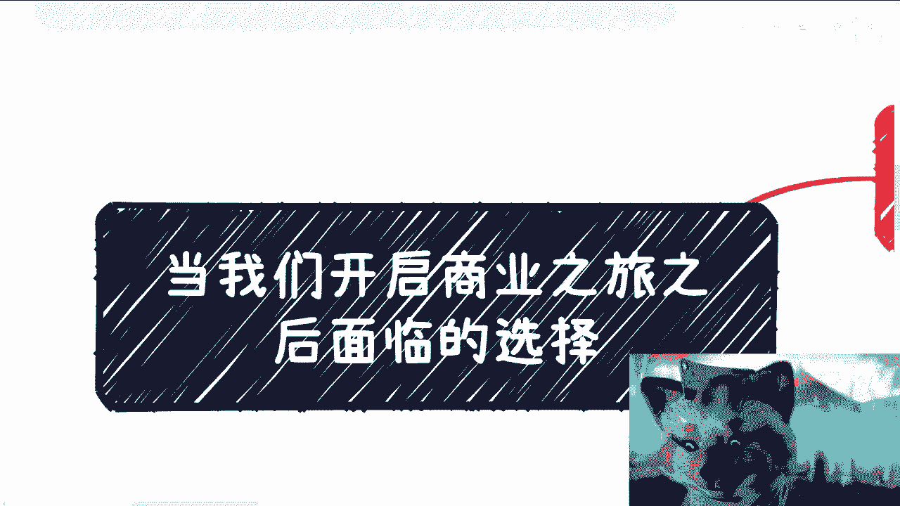
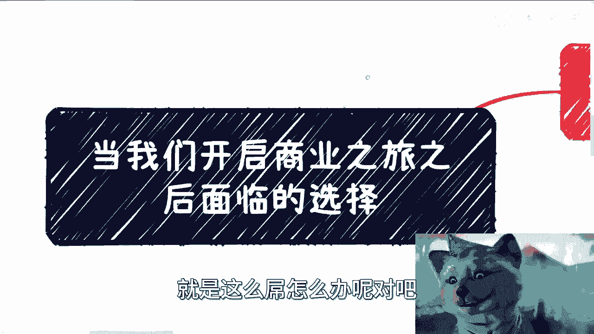
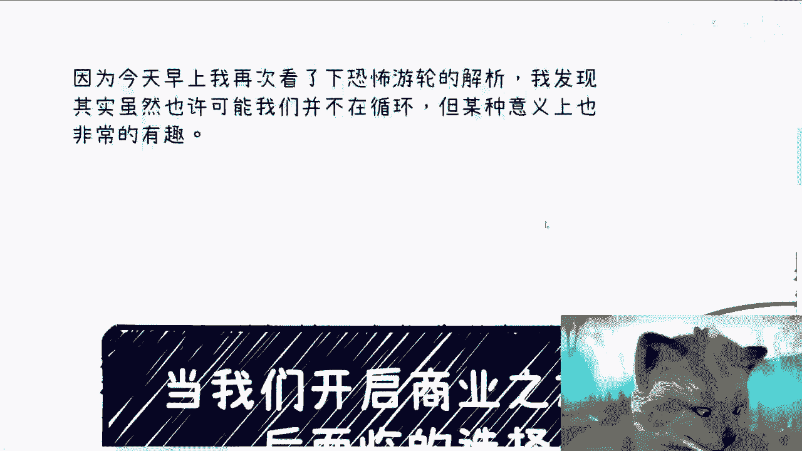
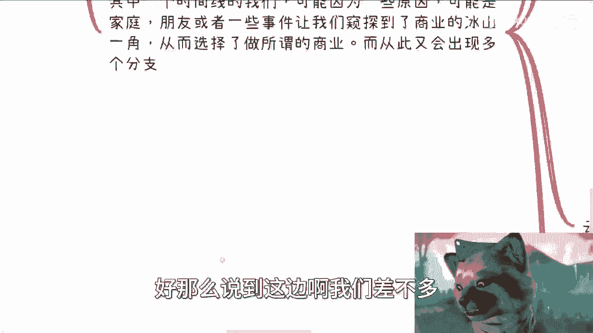
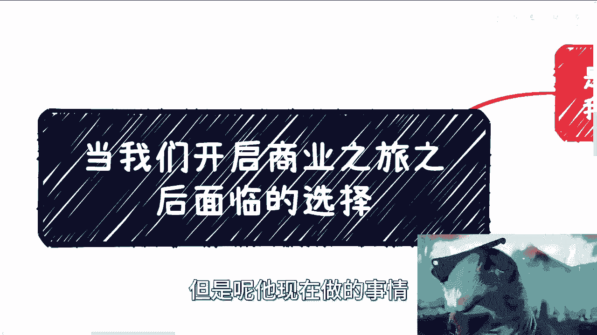
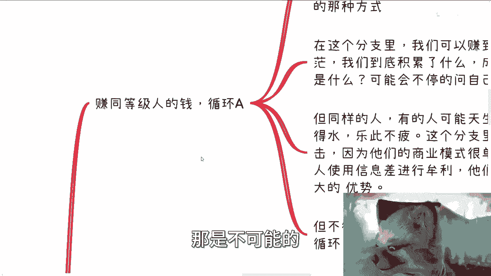
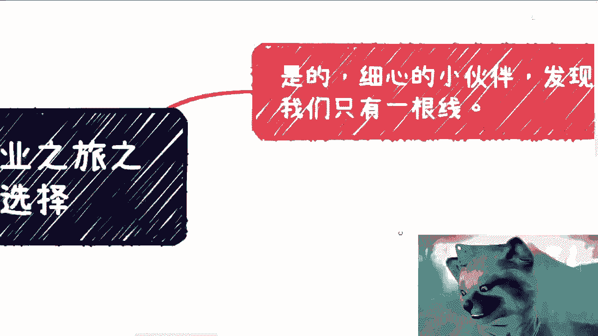
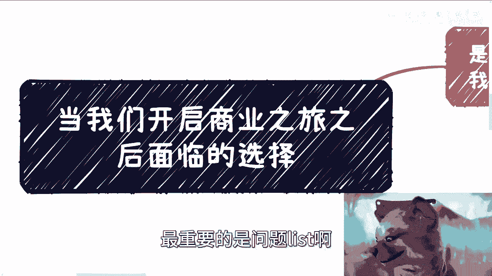

# 当我们开启商业之旅之后面临的选择---P1---赏味不足---BV1bN4y1Q7tx

在本节课中，我们将探讨一个关键问题：当你决定踏入商业世界、开始追求财富时，你将面临哪些不同的路径选择？我们将系统地分析几种主要的商业路径，帮助你理解每条路的特点、挑战和本质，从而为你的商业决策提供清晰的思路。

## 从“楚门的世界”出发：打工循环 🔄

上一节我们提到了开启商业之旅的起点，本节中我们来看看最常见的第一种路径。许多人毕业或工作多年后，发现自己被困在一个固定的模式里：不断追求更高的学历、持续打工、并时常陷入自我怀疑或被他人否定的循环中。这就像生活在一个被设定好的“楚门的世界”里。

在这个大的路径分支下，通常又演化出两种不同的心态和行为模式。

以下是两种常见的打工者心态：

1.  **内向归因与讨好型努力**：这类人将问题归咎于自身或原生家庭，认为“努力一定会有回报”。他们通过不断加班、讨好他人来寻求认可，但往往忽略了外部世界的真实规则。
2.  **外向归因与攻击性行为**：这类人不仅自我怀疑，还将不满转化为对他人的仇恨，例如通过举报、攻击他人来获得心理平衡。他们可能获得了世俗意义上的成功（车、房、家庭），但内心早已失去自我，变成了一个标准的“工业品”。

无论哪种模式，其核心逻辑都是为了获取 **`他人的认可`** 。你能否获得工作（Offer），本质上取决于招聘方是否认可你。然而，残酷的现实是，努力与获得认可之间，往往没有必然联系。

## 窥见冰山一角：踏入商业世界 🏔️

当我们因为某些契机（家庭、朋友、经历）窥见了商业或社会运行的冰山一角，并决定投身其中时，我们就跳出了打工循环，进入了真正的商业领域。从这里开始，路径开始分叉。

以下是几种主要的商业路径选择：

*   **循环A：赚取同阶层者的钱**
    *   **核心模式**：利用信息差，向同一阶层或更低阶层的人（C端用户）提供产品或服务来获利。例如某些知识付费社群或直接的收割型项目。
    *   **特点**：商业模式简单，依赖人口基数，可以赚钱，但从业者容易陷入对自我价值（“我创造了什么？”）的迷茫。这本质上是 **`利用信息差进行牟利`**。

*   **循环B：自主创业，创造产品/服务**
    *   **核心模式**：真正地创造新产品或新服务，拥有完整的商业、业务和流量逻辑。面向C端或B端。
    *   **特点**：风险极高，失败者占绝大多数。但成功者收益也高，且过程能带来巨大的成就感和自我价值实现。它要求创业者有极强的抗压能力和执行力，如同在钢丝上行走，身后有无数竞争者。

*   **循环C：尝试To B或To G业务**
    *   **核心模式**：为企业或政府提供产品或服务。一部分人是直接赚取B端/G端的钱，另一部分则是通过B端/G端渠道间接赚取C端的钱。
    *   **特点**：比循环A更稳健。从事此路径的人会深刻理解到，服务B端/G端与C端是两套截然不同的逻辑。B端/G端更看重**关系、背书和硬实力**，门槛更高，但路径也更稳固。

*   **循环D：纯资本运作**
    *   **核心模式**：这是普通人能接触到的商业天花板。本质是 **`钱生钱、利滚利`** 的金融游戏，通过资本和资源的不对等配置来滚动雪球。
    *   **特点**：在这里，具体的产品和服务只是资本运作过程中必然出现的“产物”，并非核心。核心在于**关系链、推手以及如何退出**。许多互联网巨头的发展史都带有资本运作的色彩。

## 关键总结：定位决定路径 🎯

本节课中我们一起学习了开启商业之旅后的几种主要路径。从寻求认可的打工循环，到利用信息差的循环A，再到创造价值的创业循环B，以及更稳健的To B/To G循环C，直至顶层的资本运作循环D。

核心在于，**你必须在一开始就做出明确的选择**。你的目标（想接触什么人、赚谁的钱）必须与你当下所做的事情匹配。幻想通过做“循环A”的事情逐步接触到“循环C”的圈层，通常是行不通的。

在当下的经济环境中，过去的成功逻辑可能已然失效。因此，你需要想清楚：是走高大上路线，是深耕企业/政府市场，还是专注于C端？避免陷入“高不成、低不就”的尴尬境地——拼实力拼不过，走野路子又不够野。清晰的自我定位，是避免长期迷茫、找到商业方向的第一步。