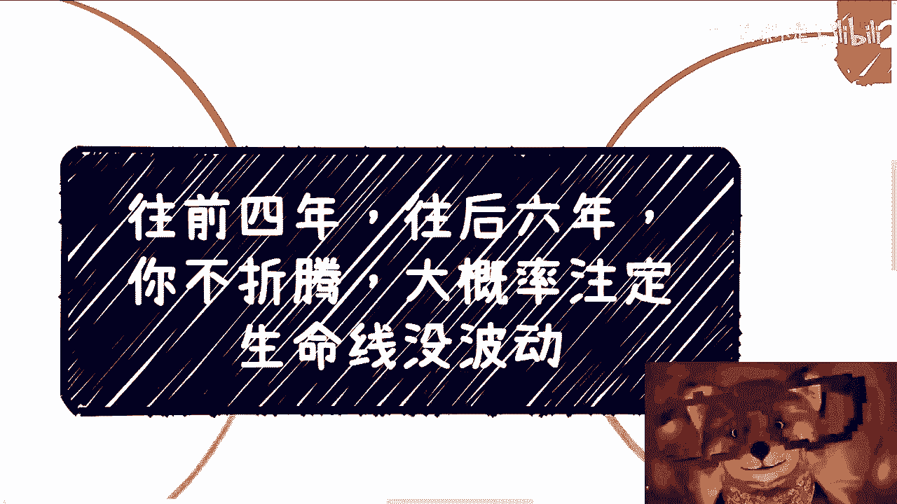
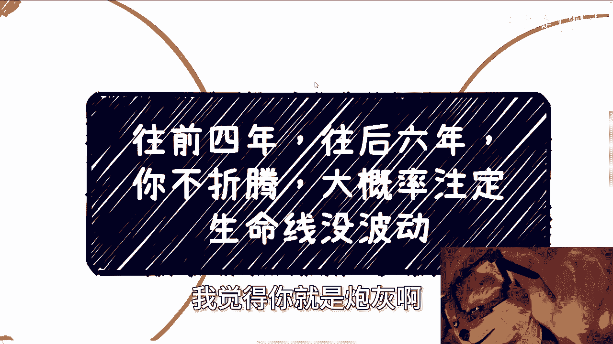
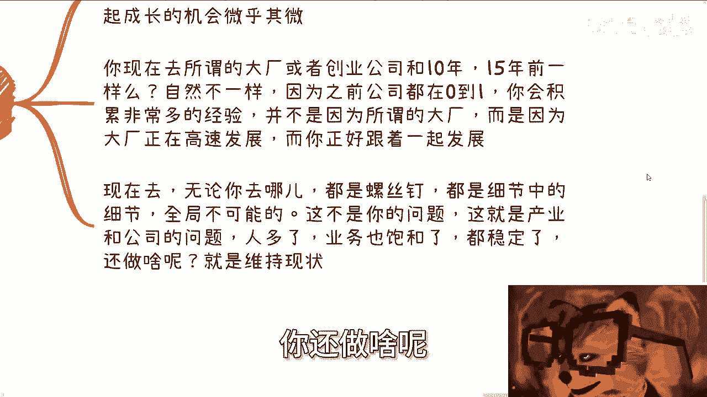
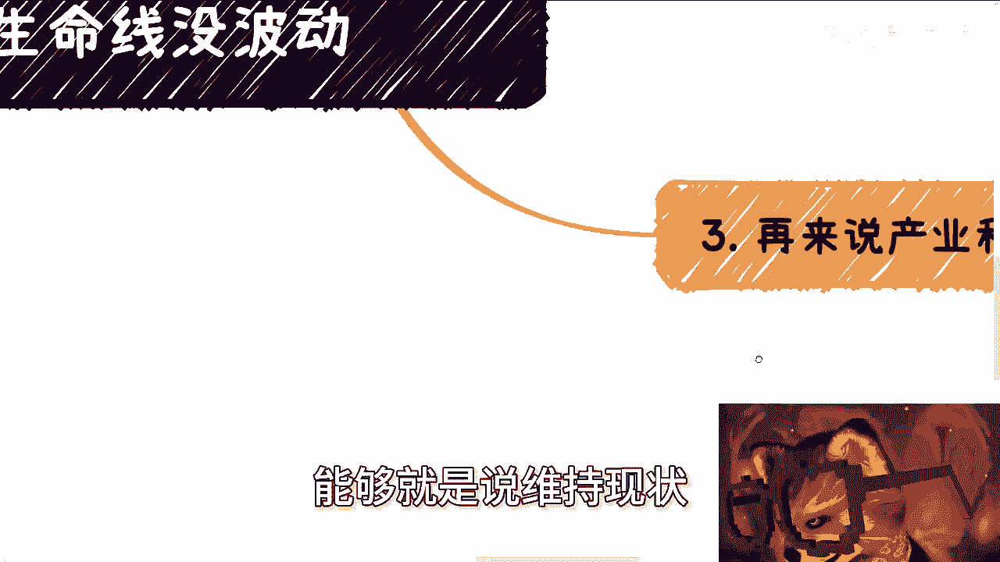
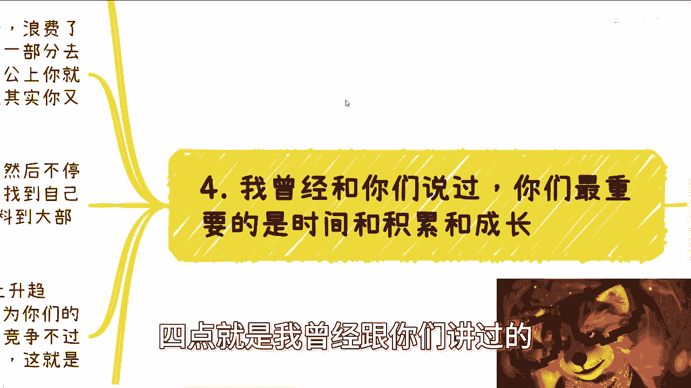
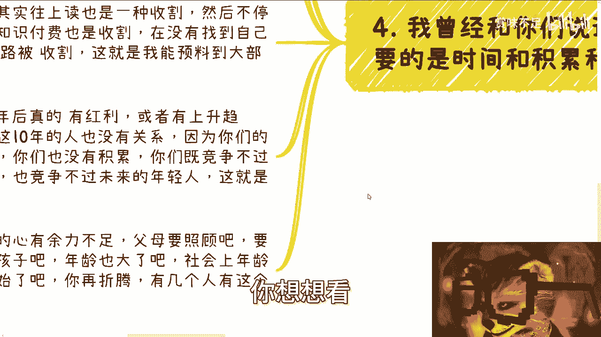
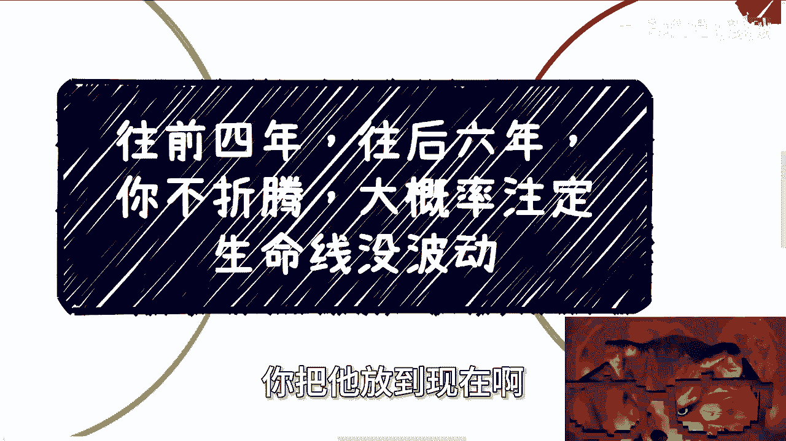
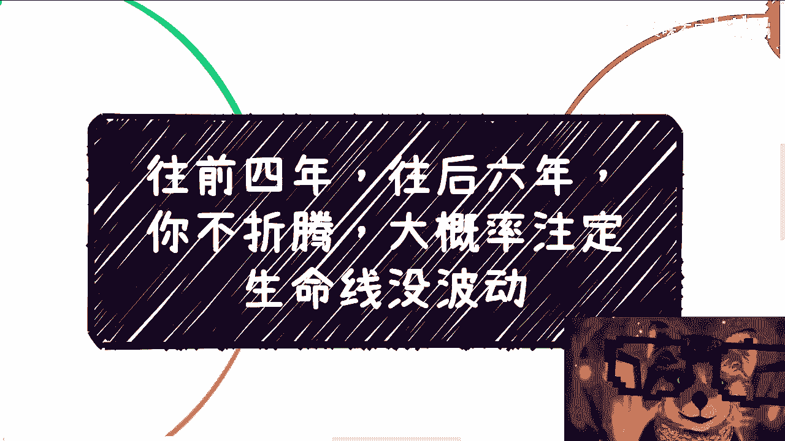

# 课程名称：未来十年职业发展策略 🧭  
## 课程编号：001  

在本节课中，我们将要学习如何理解当前及未来十年的职业环境，并探讨个人应如何应对以规避成为“炮灰”的命运。课程将分析上升通道、产业发展、个人成长等关键因素，并提供清晰的行动思路。

---

上一节我们概述了课程的主要内容，本节中我们来看看为什么说“往前四年，往后六年”是关键的十年。

按照目前最乐观的估计，整个经济及相关问题将持续至少十年。这个判断基于与资本、领导、政府及高校圈的广泛交流。因此，从大学开始，许多人可能注定面临困境。这是大环境决定的，个人能改变的部分有限。

---

上一节我们介绍了宏观时间框架，本节中我们来看看具体原因。以下是几个核心原因：

**第一，上升通道狭窄。**  
无论在哪个行业或公司，业务饱和程度都很高。所谓的“创新业务”往往等同于陷阱。即使有发展，其饱和周期也越来越短，可能只有数月。  
同时，市场每年涌入大量年轻人，竞争激烈。学历贬值导致核心竞争力不足，而上级主管可能也很年轻，进一步压缩晋升空间。  
最重要的是，老板、股东和投资人疲于奔命，目标是生存和盈利。他们无暇顾及基层员工的发展。以往的企业文化和晋升机制源于有余力，未来将不复存在。取而代之的是各种方式的PUA，强调加班和内部创业，核心是为资本创造更多价值。

**第二，产业与企业成长机会渺茫。**  
由于经济状况，所有锦上添花的事都不会做。产业和公司共同成长的机会微乎其微，因为大家都忙于维持现状。  
与10年或15年前不同，现在去大厂或创业公司，很难获得高速发展期的经验。员工往往成为螺丝钉，无法了解全局，这是产业饱和和业务稳定导致的必然结果。

**第三，个人时间与积累被浪费。**  
年轻人往往看重晋升和荣誉，但这些到30岁或35岁时会显得虚幻。它们不能带来实质的金钱或社会立足能力。  
一部分人卷考研，但学历在当下价值有限；一部分人考公，若无背景则易成为工具人；一部分人工作，却得不到成长。这种状态下，个人不断被收割：考研、二战、转行、培训班等都是收割环节。  
即使10年后出现红利，也与这十年间青春已逝、缺乏积累的人无关。届时将面临家庭压力、年龄歧视等问题，再折腾将缺乏勇气、时间和基础。

**第四，信息差与时代因素。**  
所有成功都源于时代造就，讲究天时、地利、人和。商业依赖综合能力与关系，而非单纯的天赋。在当下环境中，即使有能力也难以施展。  
因此，在战略方向不明确时，最佳策略是“装死”——保持不动，避免盲目行动导致损失。但许多人因生计压力无法坚持，容易陷入被动。

---

上一节我们分析了职业困境的多个原因，本节中我们来看看应对策略的核心思想。

核心在于**改变自己**。宏观环境对个人有深远影响，个人必须主动适应。  
许多人误以为宏观政策与己无关，但实际上，任何全局变化都会影响个人。因此，理解并应对环境变化至关重要。

---

本节课中我们一起学习了未来十年职业环境的关键特征与个人应对策略。我们分析了上升通道狭窄、产业成长有限、个人积累被浪费以及时代因素的作用。总结来说，在不确定的环境中，个人需保持清醒，避免盲目折腾，同时积极寻求自我改变以适应变化。只有这样才能在可能的未来波动中保持稳定。