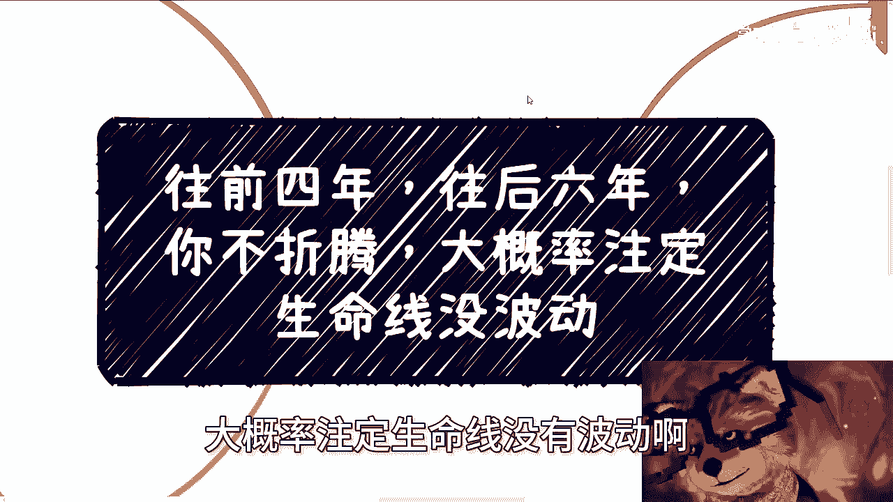
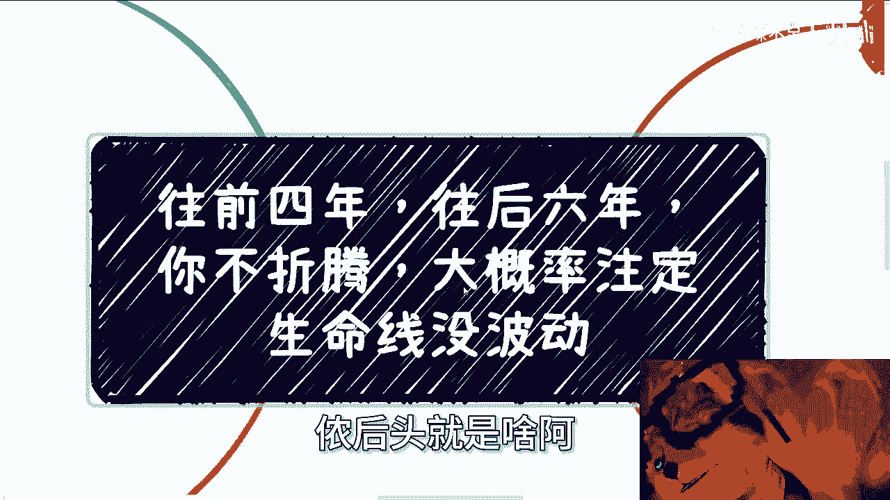
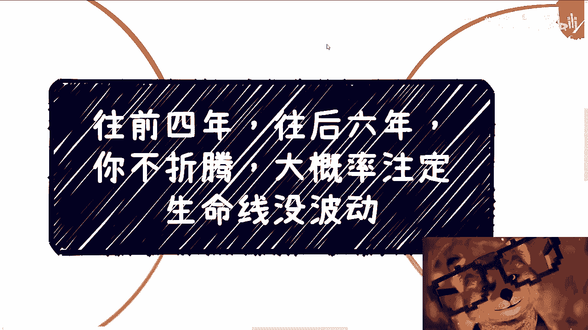
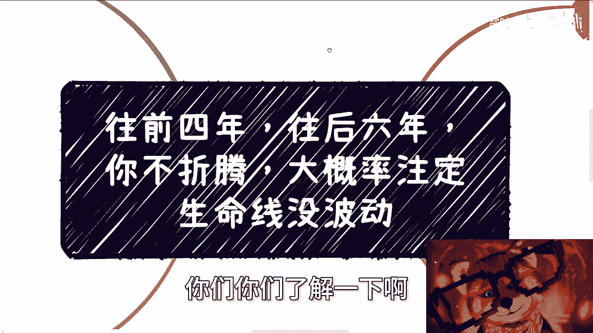

# 往前四年，往后六年，你不折腾，大概率注定没波动 - P1 - 赏味不足 - BV1Pc411b79y

好大家好啊，那以后是不是我我我我我我，这个视频给大家再放一个上海话是吧，工作量剧增啊，嗯嗯呃这期的这个主题呢叫做往前4年啊，往后6年呃，你不折腾，大概率注定生命线没有波动啊。

我来给你们翻译一下啊，这是马希德，是你啊，马克德罗尼啊，农药是挖高难，基本上难度我都觉得不对了。

笑死，但是我跟你们讲啊，这个主题啊我还是已经很温柔了，我说用白话文给你们解释一下，就是你但凡不折腾他，我觉得你就是炮灰。

而且在我看来，96%到98的应届生，他就是炮灰也就这么简单啊，这个东西呢还是放在充电里面说，我觉得比较安全，首先啊按照目前最乐观的说法，差不多整个经济以及大家面临的这个问题呢，按照我所在的圈子的交流呢。

差不多就10年，而且是至少啊呃也没什么依据啊，这个东西就大家感受啊，你说还是那句话，就像我以前跟你们讲的，如果一个人跟我这么讲，我是不信的啊对吧，但是如果来说我沟通下来的资本啊，领导啊对吧，这个政府啊。

高校啊，更多地方都这么觉得的话，那我觉得可以参考可以参考，那么在我看来呢，往前4年，往后6年呢，这个10年的跨度基本上呢大部分人从大一开始，他注定就是炮灰嗯，没办法啊，没有办法，因为我们那都是尘埃。

我们能决定什么呢，对不对，这个是大环境决定的，但是呢你要说我们自己要不要能不能改变的，还是看自己的啊啊我们来看看为什么，第一先说上升通道，因为无论你在什么行业，去什么公司，公司本身的业务。

其目前的饱和程度其实都很高，而且你会发现有很多公司呢，它是会有所谓的创新业务，但是你我这么跟你们讲啊，在我这里我只要看到创新业务的，就他妈就是个坑啊，就创新业务等于坑啊，你知道吗，就是说新的。

而且如果就算这个创新业务有发展，你也会发现它的饱和时间周期越来越短，就是原本比如说一个创新业务，他做呢还能做个56年七八年，现在不是啊，五六个月七八个月好了，后面就开始乱了啊，然后第二个呢。

就是说整个市场的年轻人其实太多，你每一年1000多，每一年1000多对吧，你上升通道基本上很窄，主要原因有几个，一个是学历的贬值，也就是说你的核心竞争力其实不强，第二个就是说你上面的主管也可能很年轻。

对啊，你不像以前，比如说你就拿我们来讲吧，我们出来可能上面比如说七零后，六零后对吧，那卧槽，你现在他妈跑出来，上面他妈的说不定是个九零后，九五后，你怎么搞对吧，当然啊我跟你讲这些也不是最重要的。

最重要的是整个市场就是你们的老板，你们的股东，你们的投资人每天都在疲于奔命啊，呃他们的目标就是要活着，要赚钱啊，在如此大的环境之下，我就问啊，就是有哪些老板，有哪些资本家，有哪些这个既得利益者。

他们还有空来管你们下面的死活，你们下面对他们来讲人都不算啊，我就这么告诉你们，以前所谓的企业文化，职场晋升，这是因为大家有余力啊，hr有余力才会去做，现在往后不好意思，不存在的啊。

我就告诉你们现在往后更多的是什么，用各种方式来PUA，你们让你们要加班，让你们要内部创业，让你们要为资本家打工，为的是什么，为的就是赚到更多的钱，你晋升这种东西，我跟你讲，你拉拉他妈倒吧啊，好第三个啊。

再来说产业跟企业的发展啊，由于整个经济的情况，所，我可以跟你们讲，所有当下锦上添花的事都是不做的啊，那么也就是说产业跟公司，大家跟着产业，跟公司一起成长的机会是微乎其微的，因为没有什么好成长的呀。

大家都他妈疲于奔命的，你成长什么东西啊，对吧啊，你现在去所谓的大厂或者创业公司，跟10年跟10年前15年前一样吗，他自然不一样啊，对吧好，我包括这两天我还看到那个什么，看到那个呃有人道歉啊。

就是每个人都很多人道歉对吧，然后说什么自己嘛好像有点虚，有点怎么样子，我觉得其实没什么毛病，为什么，因为那他这个事情我不管，我也不关心，我也没看到过，但是虚这个事情我真的觉得没毛病，为什么。

因为你们想想看啊，TMD你们现在去做一件事情，能像二两千年，2005年，比如说2010年，当时说好，我就他妈的投个50万100万下去做，不是说我不想让大家实啊，你们有资资本识不了，我有资本识吗。

谁有资本识啊，对吧，你去死，你就是被割啊，对不对，这他时代不一样啊，哪里有所谓的实根虚呢，你只要赚到钱就是商业，你只要不杀人放火，不黄赌毒，怎么了呢，我只要不犯法，怎么了呢，怎么了呢，对不对啊。

好那么你看啊，之前公司都在0~1，你会积累非常多的经验啊，并不是说因为所谓的大厂，我跟你讲，你积累到经验不是因为大厂，而是因为你所在的公司它都在高速发展，你可以在家创业公司，你也可以再加别的公司。

它都是高速发展或者大概率高速发展，那么你最好是跟着发展的，你知道吗，但是你现在去，无论你去哪儿，本质上都是螺丝钉，你都是细节中的细节，你现在的螺丝钉还不如10年前的螺丝钉对吧，你要了解全局。

那是更不可能了，但是这不是你的问题，这个是产业公司环境造成的，因为一方面是人太多了，第二方面是业务早就饱和了，也都稳定了，你还做啥呢。

大家现在要做的不就是维持现状嘛，对吧，能不萎缩啊，能够就是说维持现状。

这已经是最牛逼的了，就是这件事情，对资本家跟既得利益者跟公司来讲呢，这句话是没毛病的，但是你维持现状最最惨的是谁啊，不就是下面打工的嘛，因为你得不到任何成长嘛，你每天就会感觉卧槽。

他妈的老子是一个很牛逼的硕士或者博士毕业，我跑过来好就做了，做了两三个月，就感觉我他妈每天都是循规蹈矩的，那我图啥呢，我他妈就图你一个月的钱吗，第四点就是我曾经跟你们讲过的。

就是你们最重要的其实是时间和积累，还有成长，因为你看啊，其实那些所谓的晋升很多东西，你们现在是很看重的，你们其实是想要这种领，就是这种名誉啊，这种叫做荣誉感啊，或者是要什么东西的。

但是真的等你们到30岁，35岁，你回过头觉得看的时候，你就会发现这些都是过眼云烟，没有用，因为它很虚，他没有实质的东西，因为这些东西能给你带来钱吗，能未来给你带来单子吗。

能让你未来能稳定的在社会上立足吗，不能啊对吧，所以说为什么我一开始跟你们讲是注定的，你们想啊，一部分人卷考研浪费了时间，本质上盐这个东西在当下，客观的说已经提供不了多大价值了，一部分人去考公。

本质上咱们就说啊，就在当下的整个中国环境，你只要不是二代没有关系，在考公上面你就是别人的工具人啊，不是很清楚的事情吗，你是人吗，不好意思，就是工具啊，最后剩下一部分人去工作，那其实你又得不到成长。

参考我们刚刚说的三对吧，虽然你可能看上去说哎我在字节，我在阿里，我在哪里很光鲜亮丽，但是你得不到成长，然后你仔细想想看，其实你不停的往上读，或者说不停的去二战三战对吧，你也是一种收割。

然后不停的等你出来工作的时候，你就会发现哦，我要转行对吧，或者说我这个行业不行对吧，天生四大天坑对吧，或者怎么样子，那么你要去培训班或者说知识收费，他也是收割你在未来没有找到自己的路之前。

你其实一路都会被收割，你仔细想想看对吧，这个事情就是我们可以预料到大部分人的未来，我们假设啊16到10年后他真的有红利啊，真的有红利或者有上升趋势，那么你想想看，往往跟这10年间的人他也没有关系啊。

因为你们的青春已经浪费了，你们也没有积累，你们既竞争不过之前有积累的人，比如说像我像其他人，你们也竞争不过未来年轻的人，对不对，社会就是一旦有一个机会，所有人都往上面挤，根本不管你是谁的。

谁他妈管你年纪多大，谁管你学历是什么对吧，独木桥上勇者胜啊，胆子大的神，这就是种，这就是整个人类社会，对不对，所以说你到时候你会发现你也没有，你们也没有现在的这些心理啊，也没有这么强的傲气啊。

然后就会所谓的心有余力不足，因为你想到那个时候父母要照顾吧，你父母不像现在这么年轻了吧对吧，要成家吧，要考虑孩子吗，年龄也大了吗啊社会上对年龄或者性别的歧视，对你们来讲，现在可能还没有。

但是慢慢慢慢就开始有了吧对吧，那么你到时候再折腾，当然不是说不行，但是你有几个人能有这个勇气啊，啊咱也不说勇气了，你就算有这个勇气，能有几个人有这个时间，有这个空间，有这个有这个有这个基础对吧。

因为大概率你们还是要那个那个被迫叫什么，就是就是迫于比如说贷款啊，迫于你的生计啊，很多东西你有这个空吗，你想想看对吧。

所以其实问题在哪里啊，问题是我们就是这样一路过来的，所以我为什么跟你们讲所有东西都是信息差，因为在我眼里没有什么人是牛逼的，就是你包括马化腾，马云对吧，包括那个周弘毅对吧，或者其他人。

就是所有的人都是时代造成的，都是天弘呃，天时地利人和造成的，他不是说啊天赋异禀或者怎么样子，在我看来不存在的，但是你说有没有有天赋的，有的，但绝对不可能是这种企业家，而且也不可能是互联网上面的。

在我看来很多实业哦，很多那种就是说是天才的人，他可能不一定是在商业上面，他更多的是在某些技能上面对吧，商业讲究的是什么，它讲究的讲究的是综合能力，讲究的它是一代一代的关系，你跟我说一个人商业天赋异禀。

那不好意思，他没有关系，也没卵用对吧，没有天没有天时，地利，人和也没有卵用，你把它放到现在啊。

你把它放到现在，你你再有本事，你怎么折腾，对吧又没有办法，那你巧妇难为无米之炊，什么意思，不就这个意思嘛，对不对，就是就像我跟很多人说，当下最好的，有很多人问我，他说那那陈老师当下最好的情况是什么。

我告诉他装死，为什么，因为当下这种情况就是整个战略，整个方向都不明确，你瞎动你还不如不动对吧，但是不动是什么意思啊，不动就是熬不动，就是就是就是上海话叫什么叫病咯，但是问题是很多人他说我顶不住啊。

对你你你你你你要赚钱吧，你要你要下个月交房租吧对吧，你要吃喝吧，你顶不住啊，那顶不住怎么办好，那就容易就像投资一样的，你一旦瞎动，赚概率不大的亏是大概率的一个道理，你知道吧，所以说我是觉得呢。

就是就是就是就是在宏观的东西呢，我们就不去说了，你说什么什么美国大选啊，台湾啊，这个没什么好说的对吧，但是就是说从目前大的形势来看，他就是这样一个情况，所以你们真的可以考虑考虑，真的想想看，没有办法的。

就就我我们能做什么呢对吧，我们能做的只能是改变自己，那么很多人我跟你们讲啊，还搞笑呢，还搞笑了，还有咨询说很多人一上来就跟我说，这东西跟我有什么关系啊，跟我没有关系的，对不对，什么政策啊。

什么宏观东西啊，跟我都没关系的，我说大哥你做件事情，你你反了吧，是你做任何事情对全局没有影响，但全局有任何的发展对你都有影响啊，啊你反了吧，对不对啊，哎好吧。

反正就是这么个情况，你们你们了解一下啊。

就是在我我可能说的不好听点，就是大家未来真的就是，就是就是这生命线没波动对吧，或者怎么样了，这个死也得死的，明白对吧行吧，就这么着吧。

