# 很多专家不接地气-很多普通人其实更不接地气---P1---赏味不足---BV1Lu411L78G_n

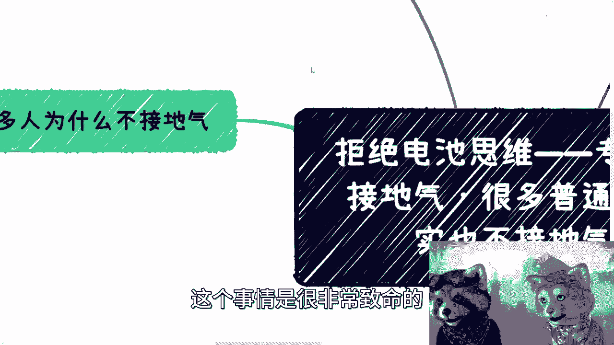

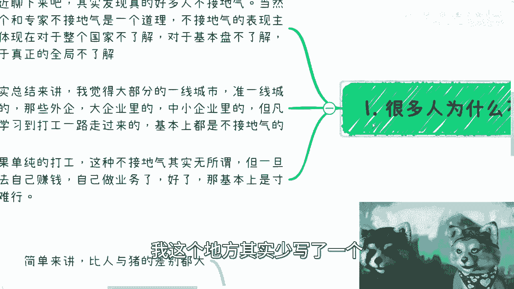

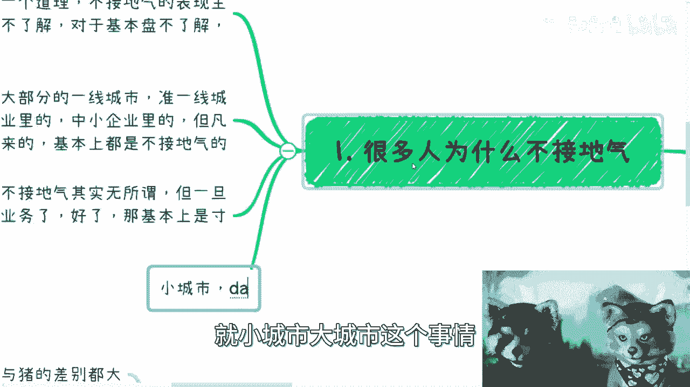

在本节课中，我们将要学习一个普遍存在但常被忽视的现象——“不接地气”。我们将探讨为何不仅专家，许多普通人同样存在这个问题，并分析其对个人认知和商业实践的深刻影响。课程将拆解几个核心概念，帮助你建立更贴近现实的基本盘认知。

## 概述：什么是“不接地气”？

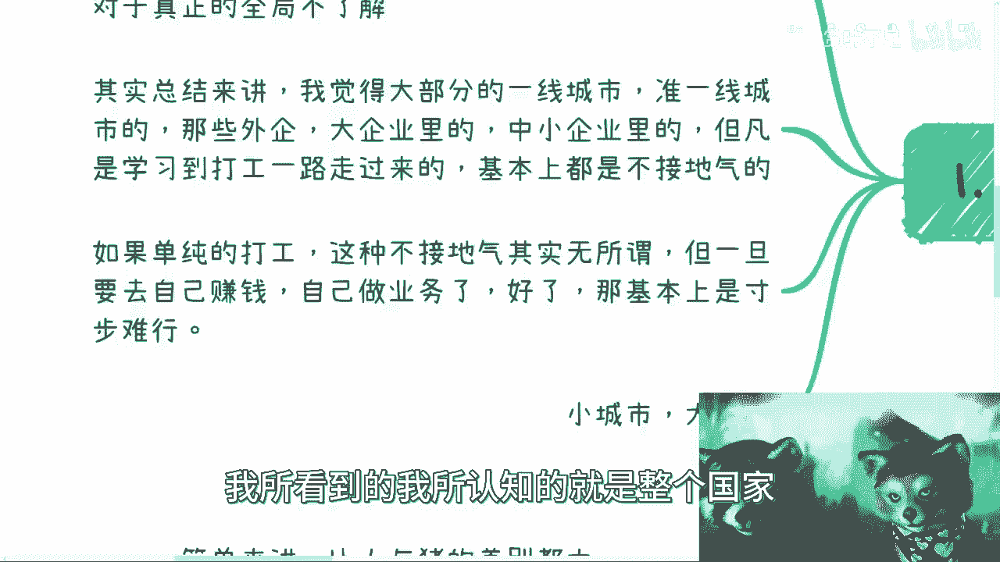

最近通过交流发现一个问题：大家普遍认为专家不接地气，但许多自认为是“普通人”的群体，其实同样不接地气。这个问题非常致命。

上一节我们概述了“不接地气”现象的普遍性，本节中我们来看看其具体表现和根源。

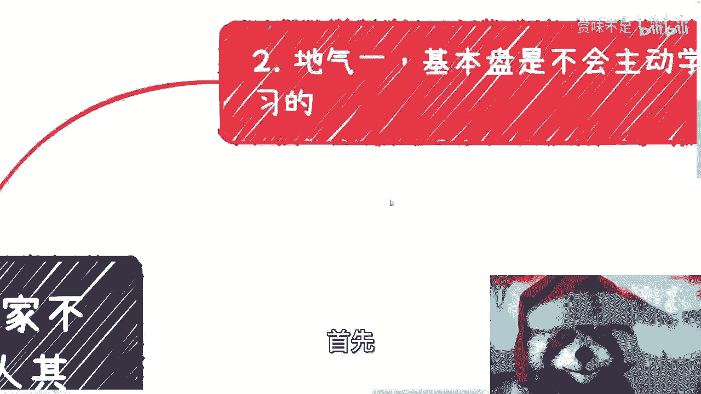

## D71：理解“基本盘” 🎯

“基本盘”是指社会中不会主动学习、缺乏持续学习能力和信息检索意识的大多数人。这是理解市场真实面貌的关键。

以下是“基本盘”的几个核心特征：

*   **缺乏主动学习与搜索意识**：大部分人不具备遇到问题时主动搜索的习惯，更不懂得使用有效的搜索技巧（如关键词组合）。公式可以表示为：`具备有效搜索能力的人口比例 < 10%`。
*   **缺乏持续学习能力**：他们很难集中精力进行系统性学习，容易受外界干扰而中断。
*   **付费逻辑与免费信息的悖论**：即使存在大量免费信息，基本盘也缺乏获取和消化的意愿与能力。因此，提供结构化、易消化的付费产品或服务，依然存在巨大的市场空间。这解释了为何教育机构、知识付费产品能够存在。

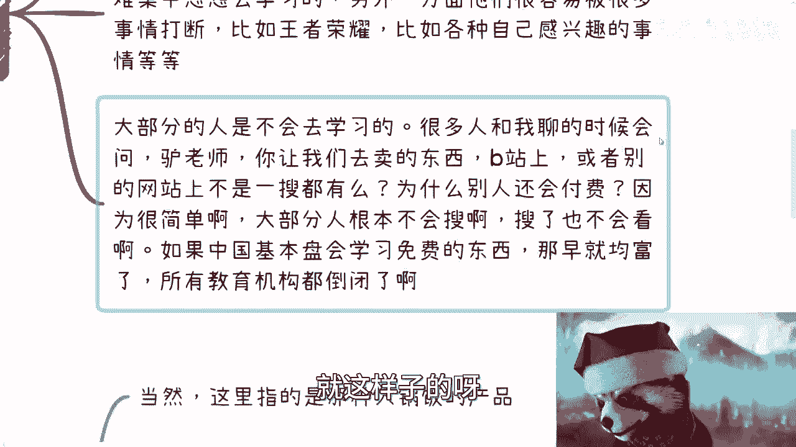

理解了基本盘的特征，我们就能明白，为何你认为“网上都能搜到”的东西，依然有人愿意付费购买。

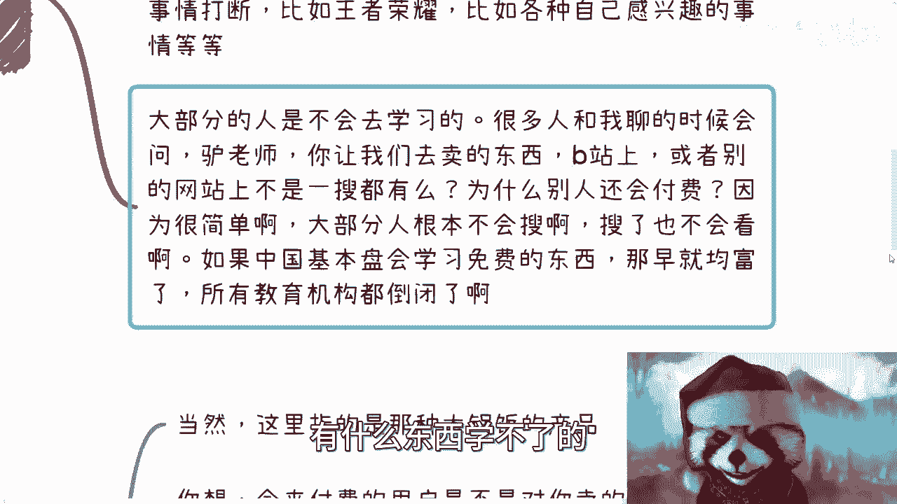

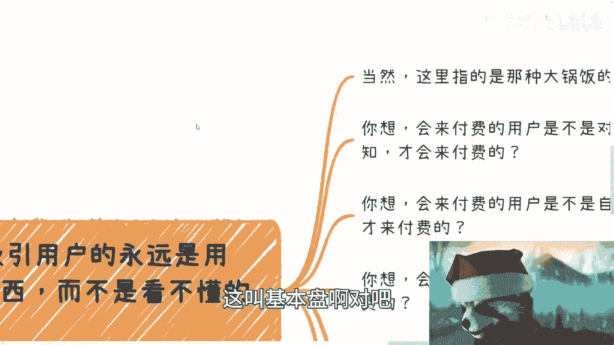

## D72：吸引用户的核心法则 🧲

对于面向大众的标准化产品（非定制化服务），吸引用户付费的核心法则在于：提供用户**看得懂**的东西，而非你认为“好”或“专业”的东西。

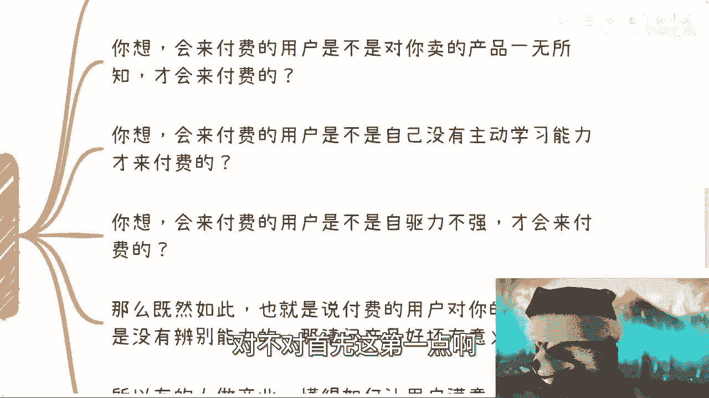

以下是支撑这一法则的三点逻辑：

1.  **付费动机**：用户正是因为对产品领域一无所知、缺乏强自学能力和自驱力，才会选择付费。因此，他们对产品本身的优劣缺乏辨别能力。
2.  **产品好坏的意义**：对于这类用户，产品“客观”质量的高低并非决定其满意度的首要因素。他们的满意度来源于“是否觉得看懂并有所收获”。
3.  **市场调研的误区**：许多人基于自身圈子（认知水平相近）做市场调研，这实为“自欺欺人”。真正的市场在“下沉市场”，在于接触拥有不同流量和认知的群体。

上一节我们分析了用户付费的心理基础，本节中我们来看看不同群体间的认知鸿沟。

## D73：认知的鸿沟比想象中更大 🌉

行业之间、老板之间、城市之间的认知差异，可能比“人与猪的差别”还要大。这是“不接地气”的另一个重要维度。

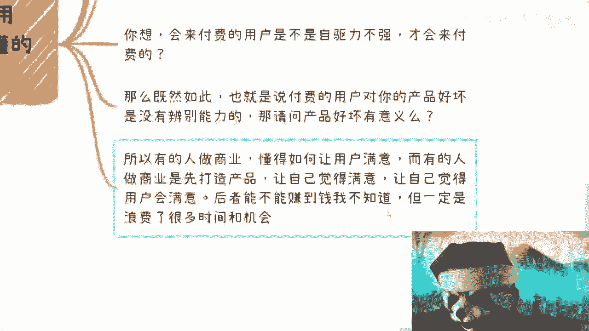

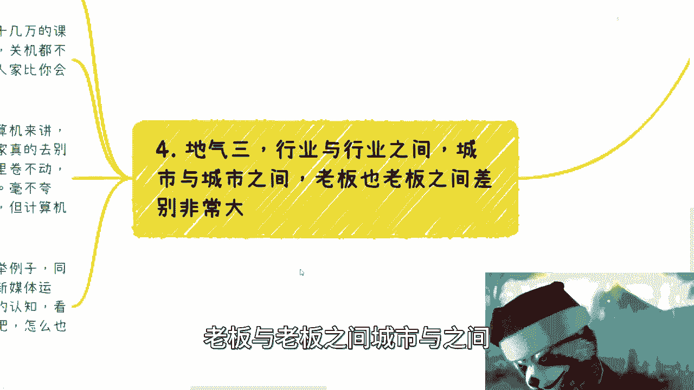

以下是几个方面的具体差异：

*   **企业家与打工者**：有些非常成功的企业家可能连基本的电脑操作都不会，但其商业洞察和资源整合能力远超许多高学历打工者。
*   **行业之间**：你在A行业（如互联网）可能是垫底水平，但你的技能和经验在B行业（如传统制造业）可能形成降维打击。例如，计算机技术在某些传统行业的应用水平可能落后十年以上。
*   **城市之间**：对于数字经济、新媒体等概念，不同线级城市的政府、产业园、企业主的认知水平可能存在“地球与月球”般的差距。

因此，无论是做产品、解决方案还是商务沟通，关键在于**让对方觉得你懂，并且让对方能看懂你在说什么**。撰写复杂、专业的方案给看不懂的决策者，反而会适得其反。

## 总结与思维转变 💡

本节课中我们一起学习了“不接地气”的深层含义：

1.  **基本盘认知**：社会大多数人（基本盘）不具备主动、持续学习的能力和习惯，这是商业的底层逻辑。
2.  **用户吸引法则**：对于大众产品，用户满意度取决于“可理解度”，而非“客观质量”。要服务用户，而非自我感动。
3.  **认知差异现实**：必须意识到不同群体、地域、行业间存在着巨大的认知鸿沟，不能用自身的经验以偏概全。

核心在于转变“电池思维”——不仅仅是打工，在思考任何问题时，都要警惕潜意识将自己带入脱离现实、自我封闭的认知路径。要赚钱、要做成事，必须主动打破信息茧房，去真实地接触和理解你所服务的广阔而多样的世界。