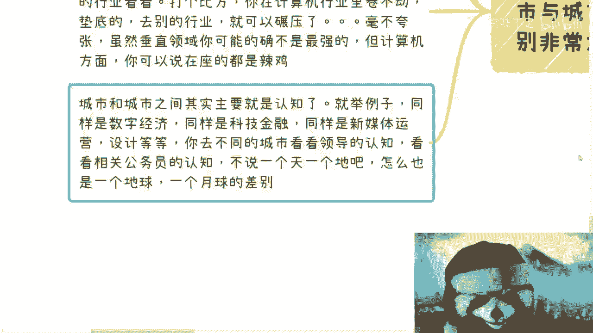

# 很多专家不接地气，很多普通人其实更不接地气 - P1 - 赏味不足 - BV1Lu411L78G

好啊，各位小伙伴大家好啊，这个今天有人私信我说我最近不勤奋，那我我承认最近是不太勤奋啊，这个事情太多了，没有办法好吧，然后那个下周线下活动，那个时间和场地都定了啊，然后我想想看，就是可能也收个费啊。

这个为了这个也避免到时候人太多，因为我找的地方也算是上海那个人社部，官方的那个场地好吧，然后回头我反正订好，我到时候再发信息啊，呃那么对吧，同样的啊，今天反正凌晨也没过对吧，凌晨没过，就算今天啊。

呃我最近聊下来发现这个问题啊，是什么呢，叫做呃大家觉得啊专家是不接地气的对吧，但是呢我跟你们讲啊，其实很多的我们认为自己是普通人的，这些普通人其实也不接地气啊，也不接地气，这个事情是很非常致命的。

我跟你们讲，就很多人为什么不接地气啊，我这个地方其实少写了一个呃。

我我补充一下啊，就小城市大城市这个事情是这样子的。

首先呢最近聊下来，我发现我发现其实很多人是不很不接地气，当然了，这个跟专家这边的说的不接地气呢是一个道理，什么意思呢，就是就是专家很多专家不接地气，大家都知道嘛，对吧叫这个何不食肉糜嘛，对不对。

那其实本质上本质上啊其实我觉得都是一样的，就是他不接地气的表现呢，主要是对于整个这个国家不了解，对于整个基本盘，对于全局他不了解，你知道吗，这个事情呢就是就是只不过啊只不过啊。

就是说你可能觉得比专家不接地气呢，可能是他不接老百姓的底气对吧，那我这边说的很多人不接地气呢，指的是他作为一个普通人呃，他可能不接也不接老百姓地气，但是就是这个两个不接地气的这个点呢。

可能有那么点不一样啊，那么总结来讲呢，就是我觉得大部分的一线城市，整一准一线城市啊，然后那些在外企的啊，在在在大企业里面，中小企业里面，但凡就是说呃学习还不错呢对吧，我比如说呃都都是大学啊出来的。

然后打工一路走过来啊，基本上呃这个这个就是打打工啊，那么我给你讲，基本上这些这些基本上都是不接地气的，因为他在学校里面，在公司里面，他对整个全区是一点都不了解的啊，而且更何况他可能还在一线和准一线城市。

那就更更不了解了，你知道吗，他会觉得就是说啊我所看到的。

我所认知的就是整个国家对吧，就这样子，那这个我那个肯定是不对的嘛对吧，那如果单纯的打工呢，我跟你们说这种不接地气其实是无所谓的对吧，就是嗯就是你像以前那个仙剑奇侠传一对吧。

你说李逍遥把那个赵灵儿但凡不带出来对吧，但你在桃花源，你在桃花源里面一辈子都无所谓，对不对，但你一旦带出来了，你说你一旦要自己去赚钱了，自己做业务了好了，我跟你讲啊，这基本上就是致命伤，你知道吗。

就真的是致命伤啊，然后还有一个不接地气呢，是反向的，就是小城市的很多人，他对大城市的了解，对整个中国的基本盘了解，他也不了解，你知道吗，因为我跟你说啊，就是从上从上去看啊，就从一线和准一线看。

他不了解整个基本面，但是你从小城市去看呢，他也不了解，他就会有种有种反向的感觉，就是哦我可能看到是这样子的啊，但是就是说一方面呢，他对一线和准一线城市其实也不了解，你知道吗，就是对于那边的工作啊。

对于就是这个这个政府区政府啊对吧，对于各地方的一些发展。

他也不了解，他会有自己YY当中的一种方向，那不管是从上到下还是从下到上。

基本上都是不接地气的哦，所以这件事情呢，就是说但凡大家一直是打工的对吧，一直是叫什么，就是做电池的，我觉得这无所谓，你但凡自己要去做点事情啊，我觉得很难啊，很难很难哎呀还是一个比较好啊。

这样识别识别出来方便啊，换一个换一个啊好吧，然后那我们继续来讲啊，一个个来讲，首先D71D71呢就是基本盘呢。

呃要知道啊，什么叫基本盘。

基本盘就是不会主动学习的啊，这叫基本盘啊，什么跟你们什么在在大公司什么卷卷来卷去的，这不叫基本盘哦，我跟你讲，大部分人是不会想到搜索的，而且他也不会搜索，就是我以前说过，就是说你用google也好。

用兵也好，对不对，其实真正懂得搜索人数很多的啊，是很少的，你知道吗，就是你真的跟很多基本盘去接触过，你就知道就是你问他们百度知不知道知道的，碰到问题他会想到昨晚不会的啊，不会的，而且他会怂吗。

就是关键词空格，关键词我以前在我的视频里面，就是跟大家说过对吧，应该怎么去搜索，可能吗，不可能啊，而且很多人可能是大学毕业，可能是大公司里面上班对吧，我跟你们讲，其实你们已经超过了90%的人了。

只不过只不过啊，就是你们可能在你们自己觉得哎呀我不行对吧，我好像哎就感觉转不过人家对吧，我感觉我前途很渺茫对吧，我就感觉怎么样，但是你要明白一点，你们拥有这些属性已经超过90%的人。

那么那么简单来讲是什么意思，意思就是说其实反向来讲，你们对战90%的人毫无认知，对吧好，那么大部分人呢他是没有持续学习能力的，什么意思呢，就是说他们一方面是很难集中思想去学习的，另外一方面是。

他们很容易会被非常多的这种，杂七杂八的事情啊，你说打游戏啊对吧，或者说或者说就是那个那个那个那个那个，思想不集中，思想不集中啊对吧，被自己一些就容易会被各种各样，比如说外面开过去一辆车啊对吧。

突然有个喇叭按喇叭了对吧，他都会被打断，你知道吗，就是他是没有持续学习能力，也就是说你今天你把这个东西给到他面前，他也不会去看，他也学不进去，你懂吗啊，那么这个叫基本盘，还有一个呢就是大部分的人呢。

他是不会去学习的，也就是说很多人跟我聊的时候，他会这么说，就是比如说他跟我咨询，我跟他咨询的时候，就我会跟他说，我说哎你可以去卖一个东西对吧，你可以去，比如说总结一个总结一个什么东西啊对吧。

你可以是课程啊，也可以是服务啊，也可以是个什么东西，那他会他就会问我，他说李老师，你让我们去卖东西对吧，但是这个东西B站上或者别的网站啊，什么YOUTUBE或者其他地方不一搜都有嘛对吧，都是免费的。

那为什么我们去卖这个东西，别人还会有人来买，对吧好，你们想想看啊，首先啊所有的人做商业做，我们说知识变现也好，或者卖产品也好，我就这么问吧，真正的有信息差的，真正的说你买不到的有吗，我给你举个例子啊。

比如说今天你在路上啊，你实体店啊看到有一个东西啊，你觉得蛮好的，50块钱对不对，好，我就问你啊，你觉得路过100个人里面，有几个人会用淘宝去扫他，看淘宝上多少钱，有几个人会用闲鱼去扫他。

看闲鱼上有多少钱对吧，那么按照你们的这个逻辑，那么如果你们去开这个实体店，那我如果跟你们合伙，那我就问了，你们别开实体店了，那所有人网上都能买得到，你们还开什么实体店，实体店全部倒闭了算了，对不对。

那你想想为什么会有人付费，就是因为基本盘他没有这个没有这个意识呀，对不对，就是他基本上不会去搜，你知道吗，搜了他也不会去看，你说B站他懂不懂对吧，就是B站他会不会上会上啊，会唱啊，她她看小姐姐啊。

看跳舞啊，看游戏啊，他会搜这些东西的，不会的呀，对不对，solo我就说比如说一个5分钟的视频，你觉得他们会去看吗，不会的，我跟你讲，比如说抖音，抖音为什么用户多，是因为基本盘养成习惯了，我就看20秒。

你别给我看，超过一分钟的，我看不懂的，怎么办呢，就这样子的呀。

对不对，我跟你们说，但凡如果中国的基本盘会学习免费的东西，那早就均富了对吧，而且所有的教育机构全部倒闭了，有什么东西学不了的。

啊非要花钱写的，对不对。

这只不过是没有呀，对不对，没有这习惯呀，这叫基本盘啊对吧。

那D72是什么呢，吸引用户的永远是用户看得懂的东西，而不是看不懂的东西，哎我跟你们讲这个东西啊，真的是在我沟通所有人的所有的观点里面，真的我真的觉得怎么说呢，就是就是哪怕你就我，我比如说我聊的很多人。

他说硕士对吧，或者说是大厂里面这个等级比较高的，我就觉得就是越是读书读的好的，越是这个大公司里面做得好的，我就觉得他们的这个思维越非常的僵硬啊，非常的僵硬呃，首先第一点这里指的是什么呢。

是指的大锅饭的产品，什么叫大锅饭产品，就是我今天给你们一个东西，我不管你们是谁，是男是女士，年龄男女老少对吧，还是怎么样子，还是什么背景，我就跟你们说，哎这个东西对你们都很有用啊，他是个灵丹妙药对吧。

你们买这个东西，你们以后就能赚钱对吧，我指的是这种产品哦，但凡是这种一对一的咨询对吧，或者说是根据你们具体情况给出建议的，我觉得还是有用的啊，还是有用的，但是这种大锅饭的产品好。

接下来的所有的东西都是以大锅饭产品为主的。

啊，好那么第一个你想啊，你想会来付费的用户，是不是对你卖的产品一无所知才会来付费的，比如说你带进去AIGC的产品，比如说你带进去元宇宙的产品，比如说你带进去一些商业付费的产品对吧。

就是你包括你在得到上面去给那个那个叫什么，罗振宇对吧，付钱你要这么想，你会去付钱啊，包括什么，包括比如说樊登对吧，你会去付钱，是不是因为你对他卖的产品一无所知，对不对，首先这是第一点。

第二点是你会去付钱，是不是因为你没有非常强的主动学习能力。

对吧好，第三点是你想啊，你会去付钱，是不是因为你自驱力不强才会去付钱的好好，那么既然如此。

其实这些人才是付钱的核心用户，对不对，好那么既然如此，也就是说付费的用户啊，对于你给出来的这个产品好坏，它是没有辨别能力的对吧，那么我就问请问产品的好坏有意义吗，我就告诉你们没有意义啊。

好那么每次说到这个东西啊，都会有人说他说啊，吕老师，你这样说是不对的啊，那么真的有人来了啊，说你这产品垃圾啊，这个到网上网爆，你对吧，到到网上什么什么黑，你对吧，然后怎么样怎么样，那怎么办怎么办呢。

哦我就这么问你啊，首先第一点，你今天拼死拼活做一个产品，你能满足中国14亿人吗，不可能吧，总有人说你吧，对不对啊，首先是第一点，第二点是你，你但凡如果有人觉得你这个产品做的不好，那我就告诉你。

他就不是你的受众，你就可以无视它，你知道吗好，那么你就有有人又有人要说了。

他说那不对呀，那如果我们产品不是打磨特别好对吧。

拿一个东西忽悠用户啊，那用户肯定是会骂的呀，但是你想想看，这里有个悖论啊，对于你们这个产品来讲，他对于这个产品好坏实际上是没有分辨能力的，你觉得不好，那是你觉得不好，用户并非觉得不好，你明白吧。

好那么好，那么所有的人做商业啊，懂得如何让用户满意，而所有的人啊就是是这么说吧，就是说有的人呢是做商业先打造产品，让自己觉得满意，让自己觉得用户会满意，有的人呢做商业呢是懂得如何让用户满意对吧。

那么你想想看啊，就是在这个地方啊，我们说的就是让自己觉得满意，让自己觉得用户会满意的，这类人，他能不能赚到钱，我是不知道啊，但是他一定会浪费很多的时间和机会，因为他把所有的时间对吧。

在没有做过任何市场调研，在没有做过任何，就是就那说白了就算做过市场调研，其实也是冰山一角，你不可能真正把这些叫什么基本盘的人，做过市场调研，因为你会发现一个问题，做市场调研的前提是能做市场调研。

能看到你这个东西，其实还是你这个圈子，你知道吗，所以说你如果真的要去做一个商业，真的要去做一个生意，你就得去结识拥有不同流量，我们称之为三教九流流量的那些人来和你合作，而不是通过你自己哟，我跟你讲。

很多人做事情很奇怪的，就是我发个朋友圈啊，然后什么做做市场调研，做出来跟我感觉差不多的诶，你看到没有有卵用啊，就是就好像你知道是什么，就好像今天你做了一个GPT的产品啊。

这GB这个AIGC的产品很垃圾啊，然后呢你说哎那个吕老师我发个朋友圈啊，我看看啊，比如说你看哦有那么2000多人啊，这个做完做完调查了啊，做完调查，然后说哎这种产品我们不会来买的对吧。

然后你就告诉我哎呀，这个这个东西商业逻辑走不通的，谁跟你这样走不通的啊，你觉得你做的是调研，是调研了，但是你做的调研还是在你的圈子里面，在你的说，说白了跟你是同相对，这个认知不会差太远的，这些人的理念。

那你有什么好卖的了对了，你要真的卖，你得往下沉市场卖呀，你要真的做调研，往下沉市场做调研啊，你自己发个朋友圈叫什么调研，这叫自欺欺人，你知道吗啊。

那么这个是三四呢，就D73啊，DG3是什么呢，就是一定要明白，就是行业与行业之间对吧，老板与老板之间，城市与之间城市之间差别是非常大。

这简单来讲就是比人与猪的差别都要大啊，这一点都不夸张啊，我给你们举个例子啊，比如说两个月前对吧，一个企业家的培训啊，你几你这个课对吧，两三天几万甚至十几万的课程来的人，可以说里面有那种连电脑开机都不会。

真的你们去接触过你们就知道了，很多人电脑开机都不会的，就40多岁那种老大妈，你知道吧，关机都不会的，但是我跟你们说，你们别看不起人，家，真的别看不起人家，人家比你们不知道会赚钱多少了哦。

人家可能躺着对吧，就是一年可能是几百万几千万，你们呢对吧，大部分人呢996007对吧，真的你们去接触一下你就知道了对吧，这第一点，第二点是行业与行业之间差距非常大，你就拿计算机来讲，我们举个例子。

现在计算机所涉及的行业是很多啊，但是你大家真的你去别的行业看看，你就会发现，其实跟你你在计算机本行业的认知差别很大，打个比方啊，就是你在计算机行业里面，你是卷不动的对吧，你是垫底的对吧。

你说我找工作都找不到啊，我每天被人家卷得我死去活来是吧，但是你换个行业，你的计算机的经验你可以碾压，毫不夸张啊，就是碾压就是虽然垂直领域你的确就是，比如说你你跳去医疗了对吧，或者去金融了哦。

哦那么我们说虽然在当前的这个领域，你可能的确不是最强的，或者你你你这个也是垫底的对吧，但是你你跨行业之后，交叉学科里面计算机方面，比如说你以前写过代码，比如说你以前做过计算机工程对吧，软软软件工程。

你的这些经验，你在那个领域，你可以说在座都是垃圾，就是都是垃圾啊，对不对，你就拿中国这些那个那个非除了生物医疗啊，那个传统医疗行业来讲，这个计算机领域，而计算机的渗透，你去看好了，系统软件交互。

10年前起码10年的差距啊，10年的差距啊，那好，然后你看啊，城市与城市之间更别说了啊，举个例子，你比如说同样是数字经济对吧，同样是科技金融，同样是新媒体运营设计等等，你去不同的城市看看啊。

就是123线，你你去对比对比，你去看看领导的认知，看看产业园的认知，看看公务员的认知，再看看公司的领导的认知，我不说一个天一个地吧，怎么地也是一个地球，一个月球的差别，你知道吗，就是。

啊就是我们总结来讲啊，就是这个地方我写了就总结来讲什么意思呢，就是叫做嗯大家这个以前读书都懂吗，叫做知己知彼对吧，方能这个百战百胜对吧，但是你想想看什么叫知己知彼，就是知己知彼的意思。

就是说你今天去做一个业务啊，你要明白，不管你人处在哪里，你面对的可能不仅仅是全国的用户，甚至是全球的用户对吧，那么你要问自己，我真的知道全球的用户是谁吗，或者全球的用户什么样子吗。

所谓用户画像是什么样子，你真的知道吗，他们的习惯是什么，你真的知道吗，你不知道对吧，这就好像什么你知道吗，这就好像有很多人对吧，我跟他讲完啊，说这个做政府相关的这个申报项目对吧。

或者说啊这个给领导做这个解决方案，对不对，好，那么我在这个地方还是说那句话，就是你做解决方案对吧，好没问题啊，你真的懂，你真的明白对面的领导是什么认知吗，啊或者你真的明白对面的领导看得懂什么东西。

看不懂什么东西吗，我跟你说，大部分的普通人他是不知道的啊，这个也是为什么，就是今天中午啊，有一个那个上海小伙伴找我咨询对吧，我跟他聊的时候再聊一个那个培训的事情啊，哎我就跟他讲。

我说我说我可能最近做了一个，四个专业的内容啊，怎么样怎么样，他就很惊讶，问我，他说哎那你都懂了，你你这个东西要花多少时间，我说我懂不懂不重要啊，而且我说我承认我不懂，但是我说我有个能力啊。

就是我只要让就是或者说所有的人，你只要让对方来听你这个内容的人，来看你这个内容的人，觉得你懂不就好了吗，其实本质上我跟你讲就2。1点，就是你要让对方觉得你是懂的，第二点是你要让对方看得懂你写的东西。

你知道吗，就很多人我跟你讲写解决方案，写一个solution，写一个PPT对吧，他他觉得什么叫专业是技术写的好啊，解决方案写的好啊，这里面这个很复杂对吧，我设计的很好啊，这个怎么样怎么样，但是你要明白。

真正的甲方真正能批钱的人，真正能控制这个单子成不成的人，往往是看不懂你写的东西的啊，你写的东西在他看来就是一坨，你知道吗，所以说你这样子写不但不会让他觉得你很专业。

反而是会觉得我根本就不知道在看些什么东西，你这个这个solution给我，我到底是说通过还是不通过呢，对吧，所以说我觉得很多人他是不接地气的，就是你会发现从上到下，从里到位，他都不接地气啊。

虽然你说他是个普通人，但是他也不接地气，所以这种事情就就很神奇。

你知道吗，好，所以说呢就是我今天中午跟那个小伙伴啊，这个咨询的时候，我也跟他讲，我说你要明白啊，是我所谓的电池思维，并不是仅仅说打工，你们在考虑任何一个问题的时候，你们的潜意识其实都很容易。

把你们带到一条歪路上面，你知道吗，所以我觉得这个核心的是这个思维要改变，好吧行，那就说这么多吧好吧，然后其他的反正你们有什么细节问题的话，整理好你们的问题好吧，整理好你们的这个背景啊。

然后你可以私信我们走的那个一对一的咨询。