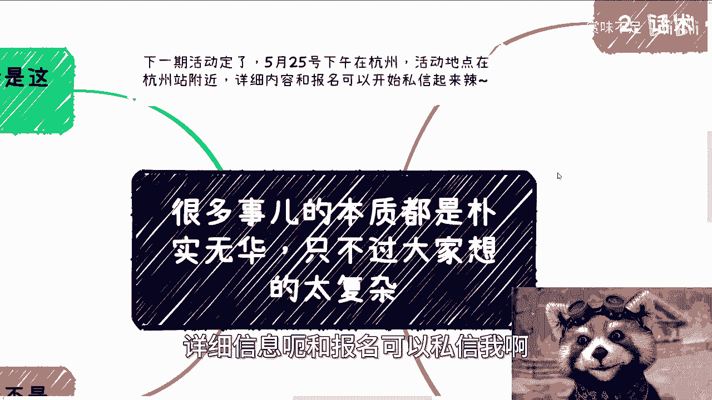
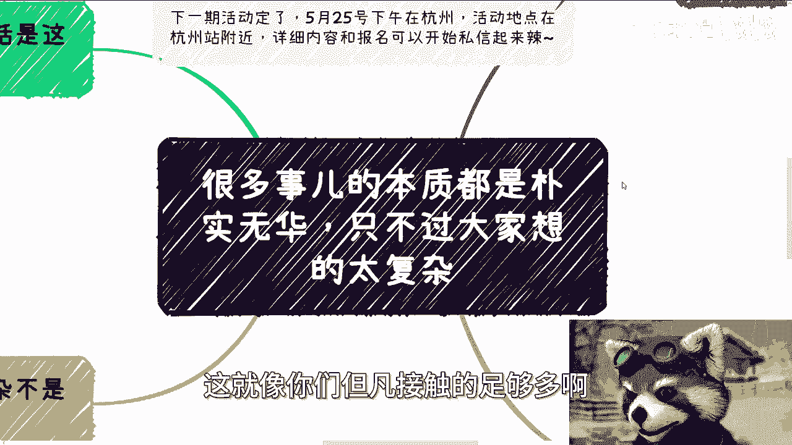
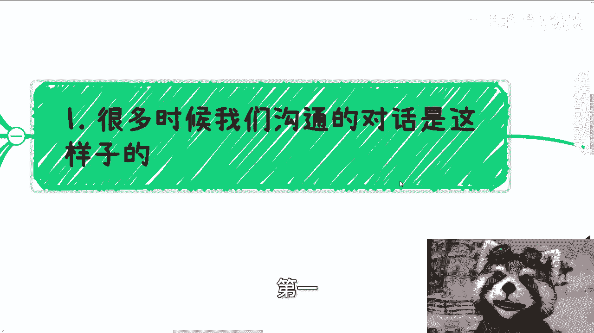
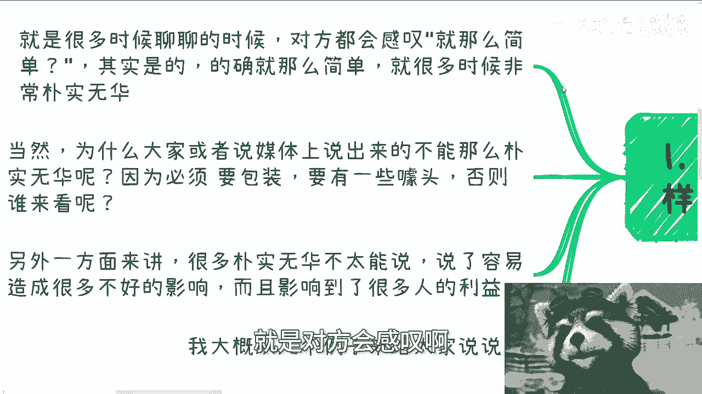
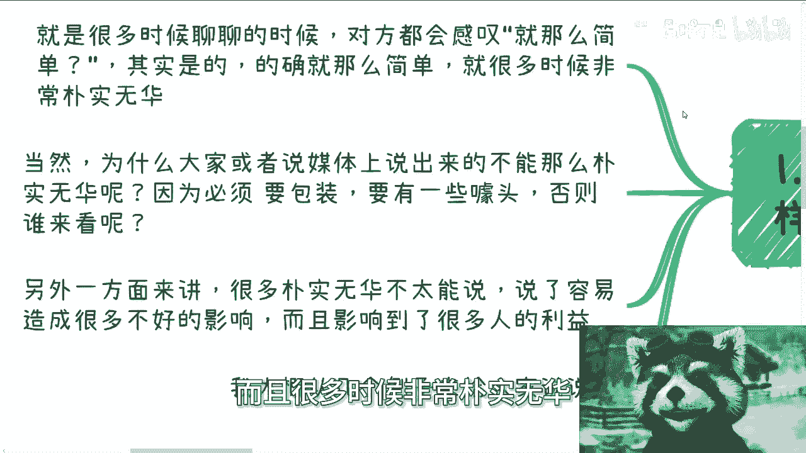
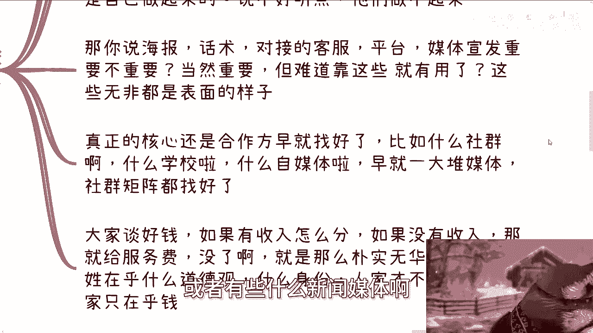
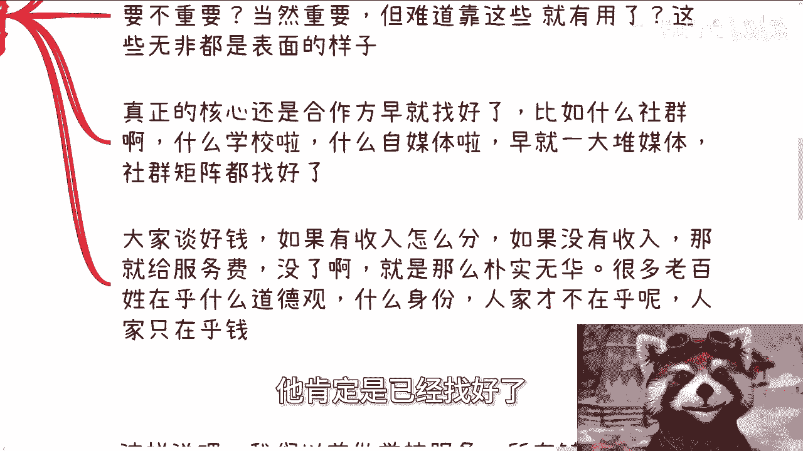
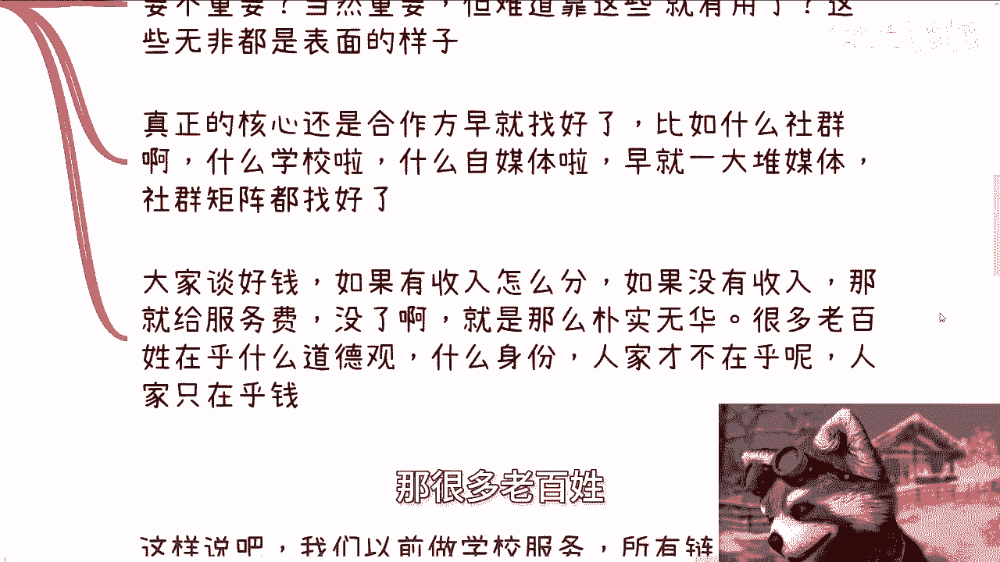
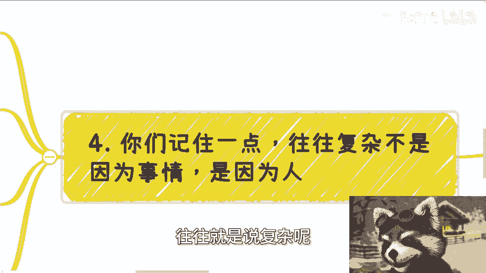
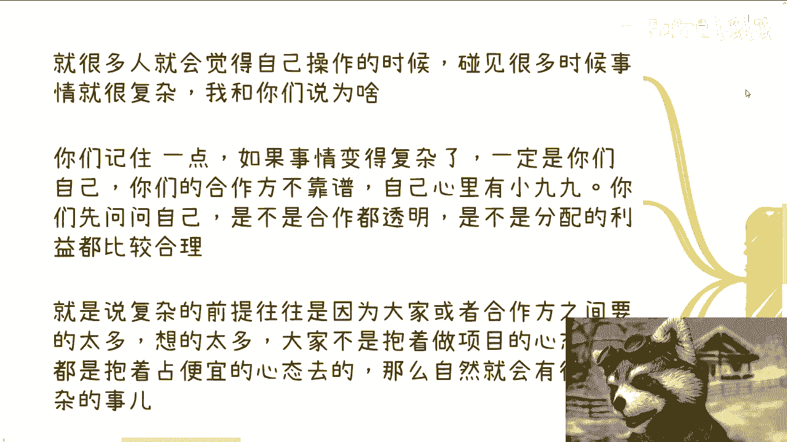

# 很多事情本质都朴实无华-只不过大家想的太复杂---P1---赏味不足---BV1rm421M7Jk_

在本节课中，我们将探讨一个核心观点：许多看似复杂的事情，其本质往往是简单而朴实的。我们将通过具体案例，分析商业、营销和合作中的常见现象，揭示其背后的根本逻辑。课程旨在帮助初学者拨开迷雾，直击核心。

---

## 活动通知 📅

本周六（25号）下午在杭州站附近有一场活动。详细信息和报名请私信获取。

---

## 核心观点：本质的朴实无华

上一节我们预告了活动，本节我们来探讨核心主题。通过与多人交流，发现一个共通问题：许多事物的本质是朴实无华的。社会常被比作“草台班子”，正是因为很多事情的本质并不复杂，只是人们将其想得过于复杂。

接触足够多的人和项目后，会发现一个本质规律：无论是与微商、三四线城市的企业家，还是与网络上形形色色的人打交道，最终核心都围绕两点：**钱**和**关系**（或可延伸为利益与人性）。谈判或做项目到最后，无非就是讨论钱如何分配、谁参与（男/女）以及最终结果。其他复杂的讨论往往是为了掩盖这三件事。

人类社会的许多互动模式即是如此。对方常会感叹“就这么简单吗？”，答案通常是肯定的。本质就是如此朴实无华。

---

## 为何本质被复杂化？🎭

上一节我们指出了本质的简单性，本节我们来看看它为何常以复杂面貌出现。媒体或商业表述无法如此直白，因为需要包装和噱头。没有噱头，难以吸引人为其付费。

例如消费场景：
*   一杯奶茶，原料朴实无华。
*   “金汤肥牛”中的肥牛本身朴实无华。
*   小龙虾成本明确，但通过精致的摆盘（如用可食用网状物盛放六只小龙虾售价286元）和概念包装，价格便能大幅提升。如果同样六只小龙虾随意放在破碗里，钳子还是断的，则无法卖出高价。

另一方面，直言朴实无华的本质可能触动某些利益，产生负面影响。例如，曾有消息称某电商因“恶意营销”、“扰乱市场价格”被举报，这背后涉及对价格透明化可能损害原有利益格局的担忧。

---

## 案例分析：营销与分销的本质

以下是关于项目运营与流量获取本质的几个例子。

### 1. 流量来源的多元性

很多人误以为传销、营销、大型企业项目是完全不同的。实际上，任何有经验的项目，其流量来源都是多元的，不可能完全靠自己完成。

表面要素如海报、话术、客服、平台、媒体宣发固然重要，但仅靠这些远远不够。真正的核心在于**预先搭建好的合作网络**。这包括社群、学校、自媒体矩阵等各类分销渠道。合作基础是事先谈妥的利益分配：有收入如何分成，无收入则支付服务费。一套营销方案的价格（如30万、50万）即基于此。逻辑非常简单朴实。

许多普通人还在纠结道德或身份问题，而参与者真正关心的只有**利益**。

### 2. 学校服务项目的合作模式

以前做学校服务项目时，所有合作关系的建立都极为朴实。

*   **产品端**：我们没有产品，就通过活动或网络（如Google、公众号）寻找关键词相关的供应商，例如做大数据、云计算的中小微企业。避免选择看似庞大但不实用的企业。
*   **销售端**：物理空间在一个城市，但需将服务卖向全国。因此，在各个城市寻找有学校合作经验的销售或企业。即使自己没有资源，找到的供应商在其领域内通常已有一定人脉。通过一度、二度、三度关系不断寻找。
*   **合作模式**：供应商和销售方共同组成乙方团队。谈判时，各方出一人，拼成一个联合乙方与学校（甲方）洽谈。
*   **分工与本质**：逻辑朴实无华——各司其职。我们不关心具体产品（供应商负责），也不擅长应酬（销售负责），只专注于把控整体流程和操作。核心目的是共同拿下项目。

---

## 复杂性的根源：人心 🤔

上一节我们通过案例看到了朴实的合作模式，本节我们来探讨事情变复杂的根源。你们在过程中或听他人讲述时，会觉得很多事情很复杂。但请记住：**事情的本质从不复杂，复杂的是人**。

如果事情变得复杂，通常是因为自己或合作方不靠谱，心里各有算计。需要自问：合作是否透明？利益分配是否合理？事情复杂的前提，往往是各方索求过多、算计过深，不是抱着做成项目的心态，而是抱着占便宜、打小算盘的心态去的。

像前述学校项目案例中，三方目标一致（拿下项目），关系就简单明了。能做就做，不能做就换下一个目标。当然，心怀算计是常态，因此我们需要在不断实践和筛选中找到可靠的伙伴。

---

## 务实思维建议 💡

顺便提及，我发现很多人思维过于单纯。例如，有人比较过去环境与当前大学环境，纠结于哪里“垃圾人”更少。这并非关键。关键在于：你所处的环境能否为你创造价值、带来收益？如果不产生价值、不赚钱，那么讨论其优劣并无太大意义。

---

## 活动与咨询提醒 📝

杭州活动已定。对于职业规划、商业规划、合同、分红、分润、项目计划书等问题，或者你手头资源（“牌”）有限，希望通过交流获得发展建议，可以整理好问题，届时进行咨询。

---

## 课程总结

本节课我们一起学习了“洞察事物本质”这一主题。我们明确了**许多复杂表象下的核心是朴实的利益（钱）与关系**。我们分析了本质被商业包装复杂化的原因，并通过营销分销、项目合作等案例，揭示了**成功运作往往依赖于简单的预先合作与清晰分工**。最后，我们指出**复杂性通常源于人心与不透明的算计**，并倡导以务实、创造价值的思维看待事物。希望本课能帮助你更清晰地理解商业与社会运作的底层逻辑。