# 很多事情本质都朴实无华，只不过大家想的太复杂 - P1 - 赏味不足 - BV1rm421M7Jk

好大家好，那么我们。

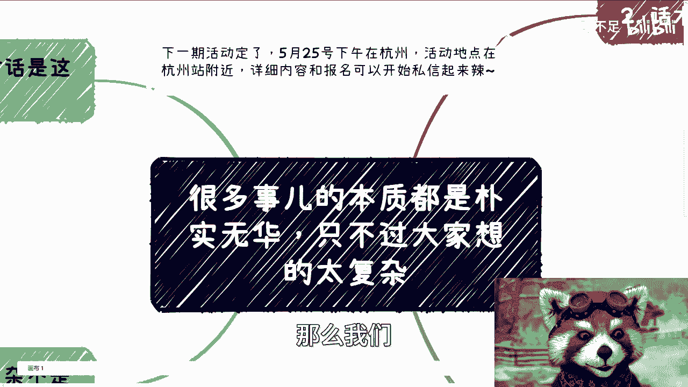

我们叫什么，先说这个活动啊，25号本周六下午好吧，在杭州，然后活动地点在杭州站附近啊，详细信息呃和报名可以私信我啊。

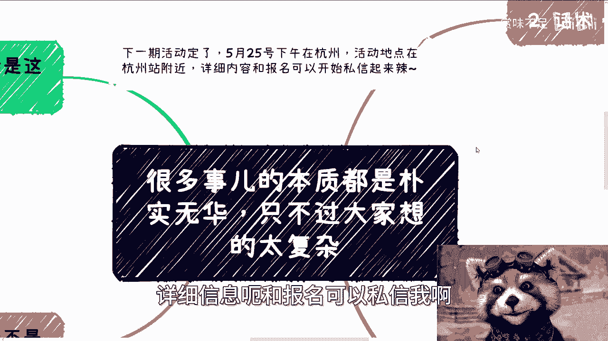

那么今天我们讲的这个主题呢，也是这两天啊跟很多人聊下来呢，发现这个呃也有个共通的问题，就是很多事的本质，我跟你们讲啊，为什么我一直说这个社会就是个草台班子，就是因为很多事的本质他就是朴实无华的啊。

只不过大家把它想的太复杂，这就像什么，你知道吗，我就这么讲啊，这就像你们但凡接触的足够多啊。

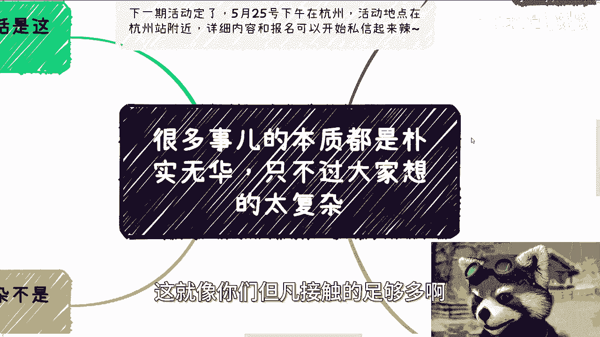

接触足够多，你们你们就会发现一件很本质的事情，就是我不管你们是跟所谓的什么微商啊，或者说像像个就很多，比如说3~5线城市的，这个各种各样的企业家啊对吧，还是说是跟我们说的网上的啊。

就是说很多什么什么什么书记啊对吧，什么什么什么各种人啊，我就不多说了啊，我跟你们讲啊，核心点到最后和谈生意，谈到最后或者做项目，做到最后这两件事情钱性明白吧，没了啊，所以一般我们以前怎么说。

我们以前就谈到最后，我说本质很简单啊，本质无非不就是钱吗，钱男的女的没了，就这三个你不要跟我谈，别的没什么好谈的，谈别的都是为了掩盖这三件事情，所以说本质永远是朴实无华，为什么。

因为人类就他妈这种吊样子啊，第一很多时候我们沟通对话是这样子的啊。

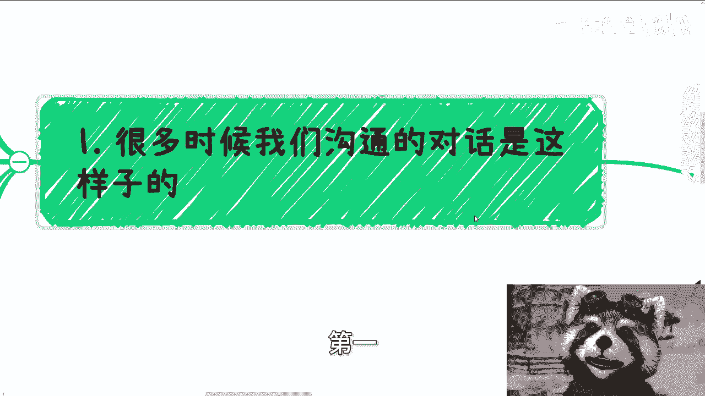

就是对方会感叹啊。

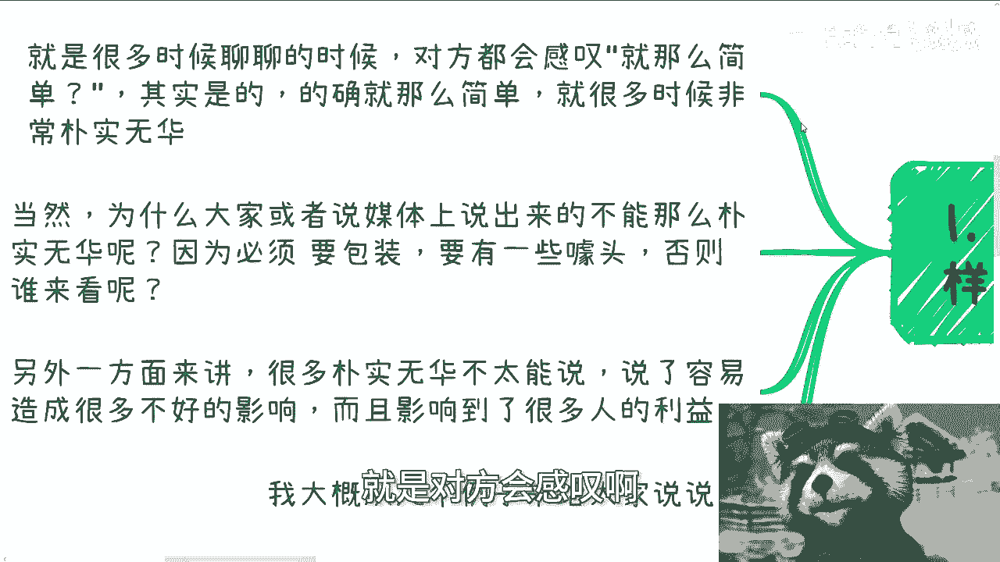

他说就这么简单吗啊其实我跟你讲对的，的确就这么简单，而且很多时候非常朴实无华。

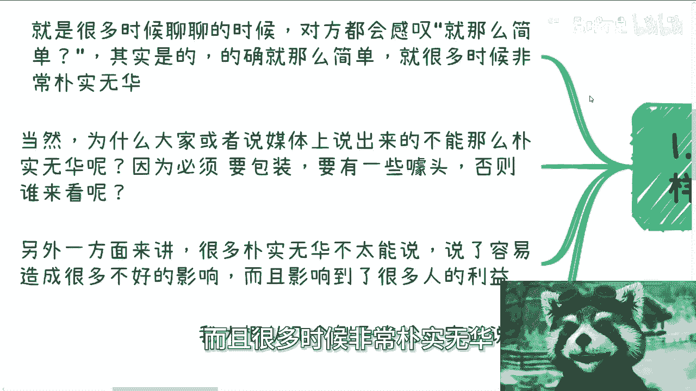

当然啊，为什么大家或者说媒体说出来的，不能这么的朴实而无华呢，因为必须要包装啊对吧，你必须要有噱头啊，你不朴树屋啊，你不没有噱头，谁来付钱啊对吧，那我们随便说，比如说你买奶茶，你你出去消费。

它里面东西朴实无华的，我告诉你朴实无华的呀，没问题的呀，你比如说肥牛对吧，那为什么要说金汤肥牛呢，对不对，那你小龙虾，那他妈小龙虾多少钱，朴实无华不了，那为什么小小龙虾有很多菜能够卖的这么贵呢，对吧。

我跟你们讲啊，我前我前段时间去那个呃，那个叫什么上海天山路那边，卧槽，你们是不知道他那个那个菜单啊，打开了它有一个什么呢，就是有一个应该是用那种油炸的，就做了个框框框。

做了一个可食用的一个一个网状的东西，然后上面爬了六只小龙虾，然后他妈要我286，朴实无华不啦，无华的呀，就就其实就就是这样子的呀，但是他要噱头不了，要噱头的，我就这么问，今天这六只对吧。

我他妈放在碗里面，然后然后他妈的给你摆的钳子断掉的，你付了一样的道理呀，对不了，那另外一方面来讲，很多朴实无华不能说说了呢，他很容易造成不好的影响，而且影响了很多人的利益对吧。

我今天微博上还看到一个一个一个消息，说什么说那个说什么举举报那个京东啊，还是说什么，就就说那个恶意营销对吧，说什么打打打乱社会价格，你们去看看，唉反正就这么一个意思啊。

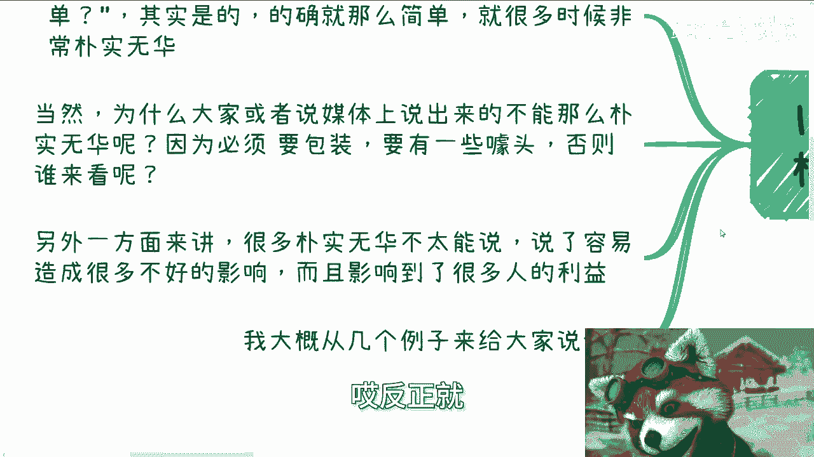

我大概大概举几个例子啊。

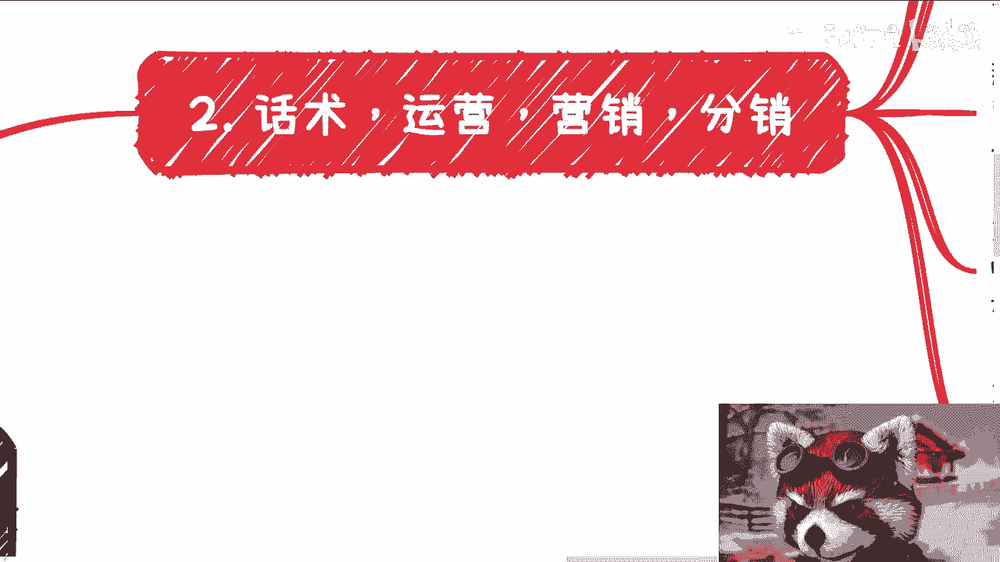

啊首先啊第额那个话术啊，运营营销分销，你看啊，任何一个项目流量都不是只靠一个地方来的啊，那么我跟你们讲，很多人可能会误解啊，很多人可能会觉得传销是传销啊，营销是营销，然后什么500强啊，国企央企啊。

做项目做项目啊，我跟你们这么说啊，比如说一个正常的项目，只要他是有做过有有经验的，只要是曾经做过项目的做东西啊，他不管是微商，还是我们说的一些一些一些一些正常的业务，还是国企，央企，还是党媒，央媒。

我就这么讲啊，流量是多方的，至少不可能是自己做起来的对吧，那说的不好听点，我们啊说的不好听点，他们做不起来，那你说海报也好对吧，话术也好，对接的客服也好，平台也好，媒体宣发也好，重不重要，当然重要。

但难道就是靠这些吗，就是说你单纯靠比如说话术啊，海报啊，客服啊，平台啊，有用啊，没有用对吧，那么这些无非就是表面的一些东西，那你单纯靠这些东西，大家看到有一些什么宣传啊，或者有些什么新闻媒体啊。

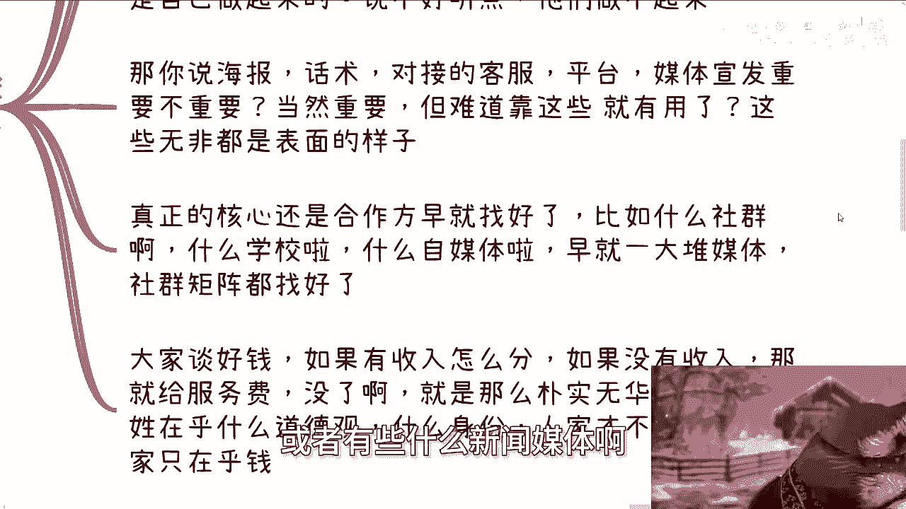

上面发布的其实并没有什么用对吧，那么真正的核心还是要靠合作方早就找好的，你比如说什么社群啊，什么学校啊对吧，什么自媒体啊对吧，早就就是一大堆媒体社群举证早就找好了，就是该有的企业，该有的媒体，该有的。

我们所说的这个分销，他肯定是已经找好了对吧。

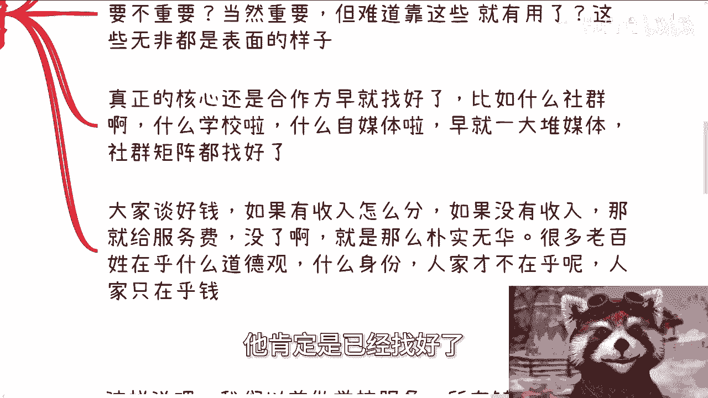

不是说大家说说啊，我我就是没有找好对吧，我就是单纯靠那些什么什么什么表面看到的，一些什么新闻宣发没有用的哦，就是说大家找好谈好钱，如果有收入怎么分，如果没有收入，那么就给服务费没了对吧。

就比如说111套营销，比如说30万50万，主要就这么简单，就这么朴实无华，那很多老百姓其实还会在那边。

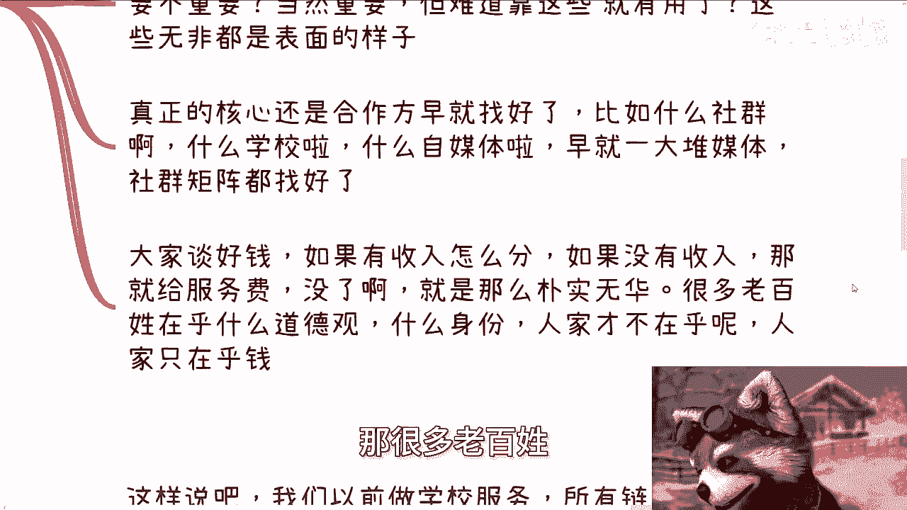

在乎什么道德观啊，什么身份啊，人家才不在乎人家他妈只在乎钱。

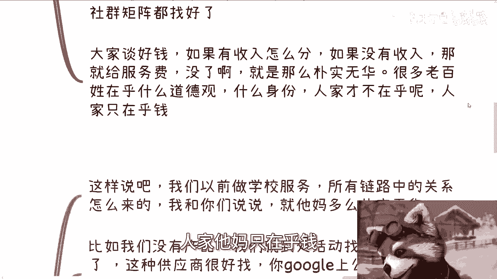

对不了，没了，我跟你讲，就钱男的女的没了，就这三个东西啊。

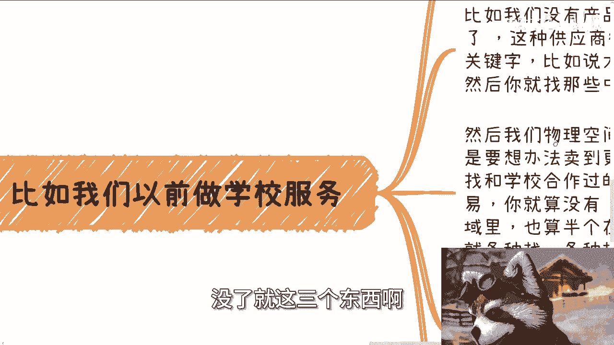

第三比如说我们以前做学校服务，哎我跟你讲，更他妈朴实无华，我们以前做学校服务啊，所有链路中的关系怎么来的，我跟你们这么说，就非常的朴实无华，比如说我们没有产品，我们就到处活动啊，找供应商。

说白了这种供应商很好找你google你只要有关键字，你知道吗，你只要有关键字，google上公众号上面找找很多的，比如说做大数据的，做云计算的对吧，你多去找两家，找一些中小微企业就好了。

你别去找那种他妈的看上去好像很牛逼对吧，大企业没什么卵用的啊，然后我们物理空间呢肯定是在一个城市，但是你卖东西，一定是要想办法卖到更多的城市吧对吧，那么紧接着，各个城市去寻找和学校合作过的销售。

或者说企业，那这事其实也容易，你就算没有我跟你们这么讲，你就算没有你寻找到的供应商，人家作为这个这个行业的供应商，人家在这个领域里面也算是半个在牌桌，牌桌上的这个机构吧对吧，那么这些所谓的这个合作销售。

他们多多少少都是有的，那你就各种找呗，就是一度关系没有二度关系，二度关系关系没有三度关系嘛，就找呗对吧，然后己方啊，你比如说我们供应商和学校的合作的销售，我们共同是乙方，你们明白吧。

就相当于说跟在学校跟谈的时候，我们在一个谈判谈判桌上，在一个会议室里面，我们每个团队出一个人，拼出一个乙方去谈，是这么个逻辑啊，其实我跟你们讲里面逻辑呃，你你说朴实无华吧，也朴实无华，就是各司其职对吧。

就我对于我来讲，我也不用关心产品，因为产品是由供应商去谈的，我也不用担心喝酒和应酬，因为这是销售去做的，我们只要去看整个一个操作对吧，整个一个流程到底怎么个做法就结束了。

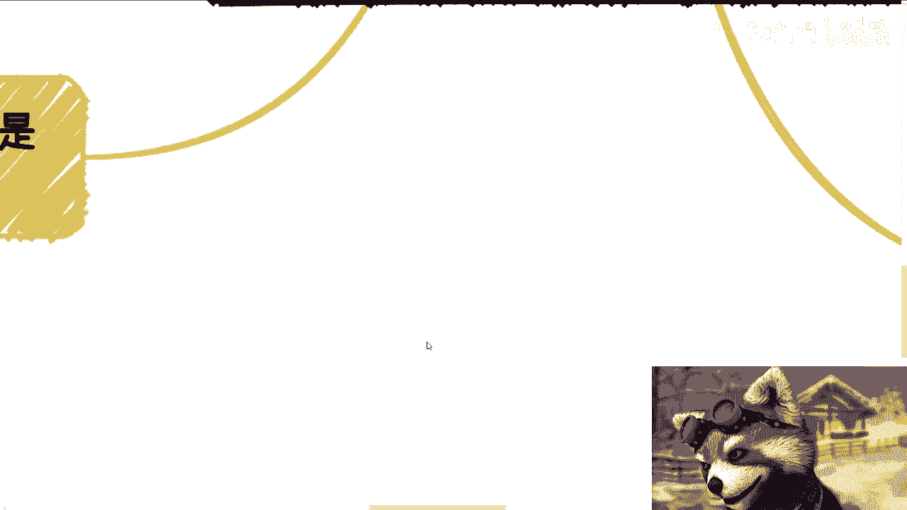

啊那么你们记住一点啊，往往就是说复杂呢。

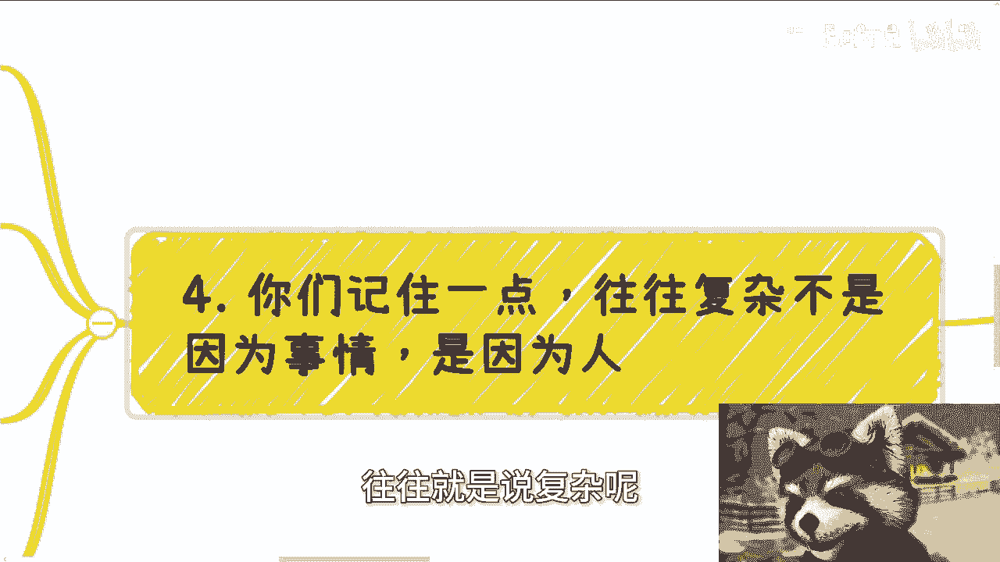

就是你们啊在过程当中，或者你们听别人讲的时候，你们会发现很多事情是很复杂的，但你们记住一点，就是事情的本质从来不复杂，复杂的是人，你知道吗。

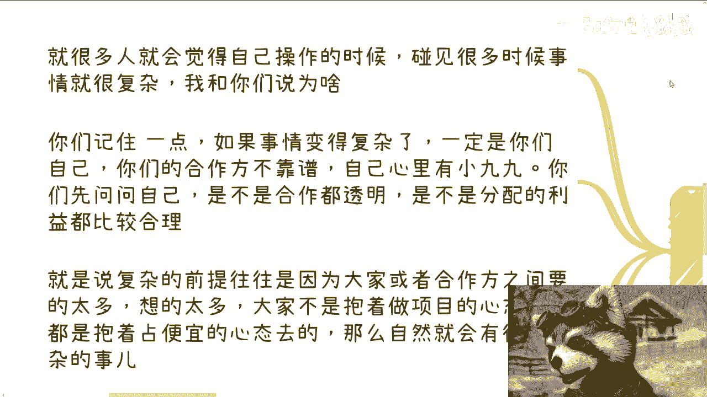

就是说为什么啊，就你们记住一点，如果事情变得复杂。

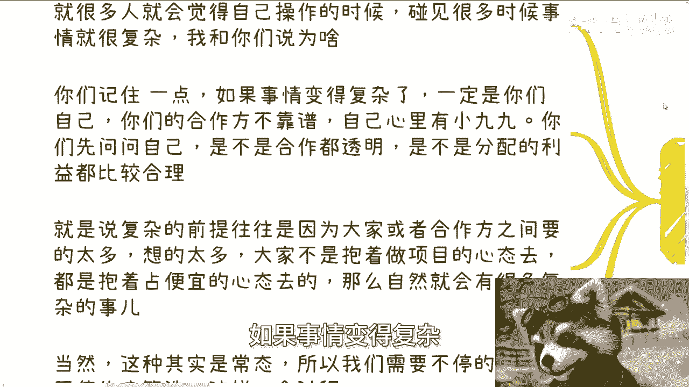

一定是因为你们自己或者你们的合作方不靠谱，你们自己或者你们的合作方心里有小九九，你们先问问自己，是不是自己合作都很透明，是不是分配利益都比较合理啊，也就是说事情复杂的前提。

往往是因为大家或者合作方之间要的太多，想的太多，大家这些人不是抱着做项目的心态去的，都是抱着占便宜对吧，抱着自己自己有些小九九的心态去的，那么你自然而然会有很多复杂问题啊对吧，你说你就像我们刚刚说的。

我们三方各出一个人，大家都是为了把学校这笔钱拿下来，那不会出现很复杂的问题，这就简单明了啊，能做就做，不能做，拉倒换下一个学校对吧，那当然啊这种心里面有小九九的是常态啊。

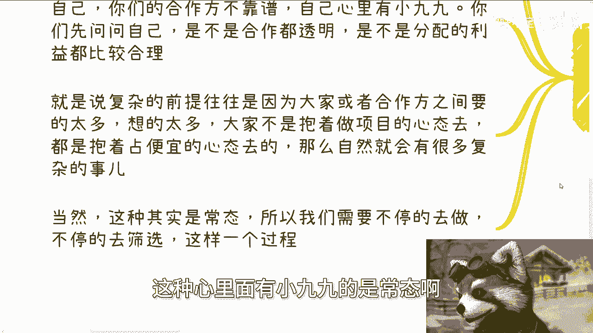

所以我们需要不停的去做，不停的去筛选，你知道吗，就是这么一个过程好，OK然后我顺便提一嘴啊，就是哎呀，我发现很多人思想这个单纯是蛮单纯的，就好像跟我说什么就说什么啊，这个以前嘛碰到的人都非常垃圾啊。

然后嘛因为自己考进了什么大学啊，大学里面就没这么大垃圾的人了，我也觉得很奇怪，有没有垃圾人是你关心的吗，或者说有没有垃圾的人，是这种参照物相对较不垃圾啊对吧，那他们垃圾的地方你还没看到呢，对不对。

而且你说你说你今天去了个什么学校对吧，呃什么什么垃圾不垃圾，有用不来能赚钱吗，对不对，你又不能赚钱，有什么好说的了，因为我发现很多人嘛奇了奇了也奇奇了怪的，就属于那种在那边做事情又不产生价值，又不赚钱。

那你妈的做什么东西呢，还还拿出来炫耀哎，好吧啊，那么杭州好吧，活动定了啊，然后那个职业规划啊，商业规划啊，那个合同啊，分红啊，分润啊啊什么什么项目计划书啊，啊包括你们手上有什么牌，你们没有牌的啊。

你们希望通过跟我的沟通啊，希望通过我这边的一些视野视角，能够给你们一些更好的一些未来发展的建议啊，那么你们可以整理好问题，我们再来做咨询。

