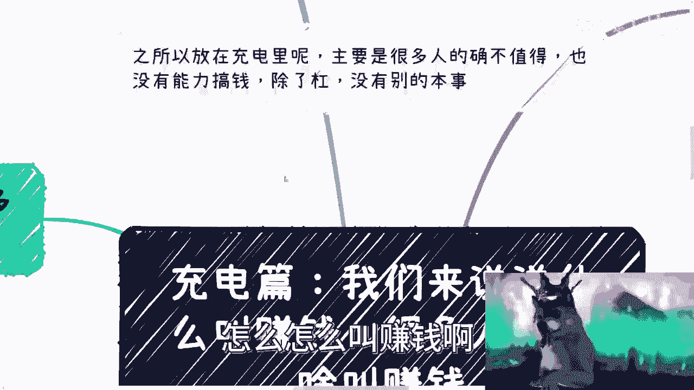
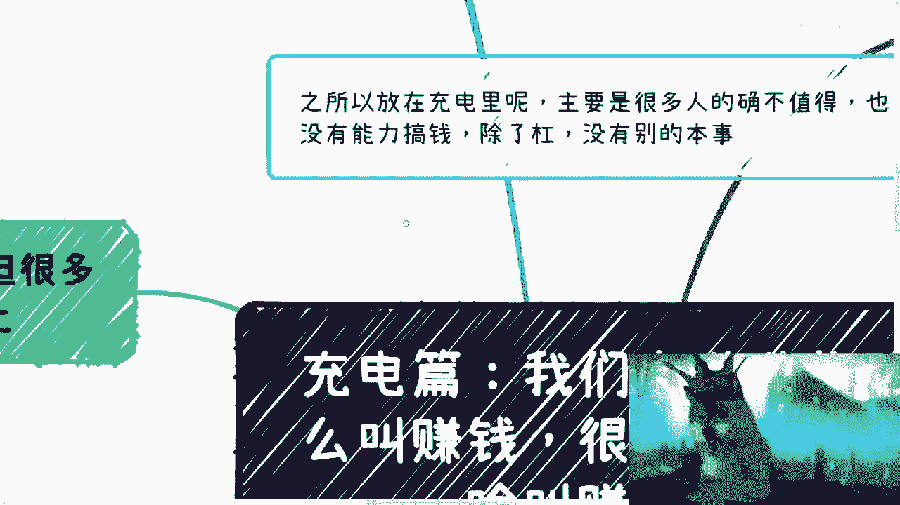
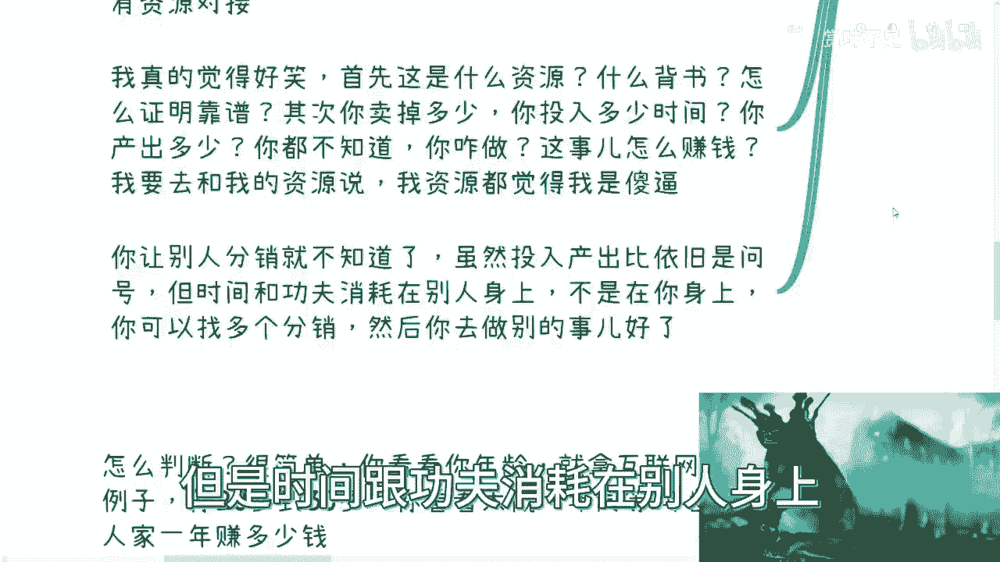
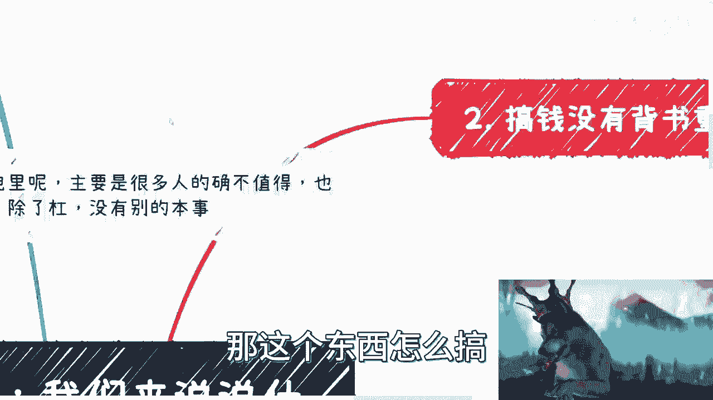
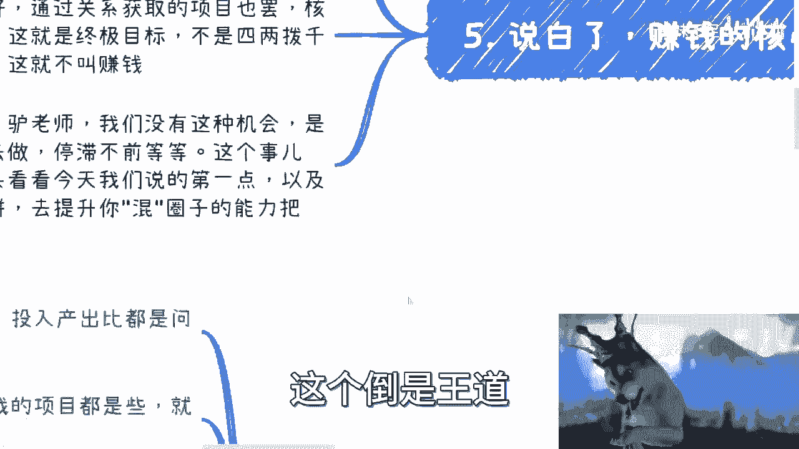

# 赚钱的本质与逻辑 🧠 - 课程 P1

在本节课中，我们将深入探讨“赚钱”这一概念的核心本质。很多人虽然嘴上说着要赚钱，但实际上并不清楚什么是真正有效的赚钱方式。我们将通过几个关键维度，帮助你建立正确的赚钱思维框架。

---

## 1. 评估投入产出比：赚钱的基石 💡

上一节我们提到了对“赚钱”概念的普遍误解，本节中我们来看看赚钱的第一个核心原则：**投入产出比**。并非所有能带来收入的事情都值得去做，关键在于评估你投入的时间、精力与最终回报之间的关系。

如果无法评估一个项目的投入产出比，那么这个项目大概率不靠谱。从商业角度看，信息缺失意味着风险，也意味着你很可能赚不到钱。

以下是评估时需要考虑的要点：
*   **明确投入**：你需要投入多少时间？
*   **量化产出**：你能得到多少金钱或资源回报？
*   **计算比率**：你的时间价值与回报是否匹配？

一个健康的商业逻辑要求你在行动前就能回答这些问题。如果答案是模糊的，就像向未知方向射出一支箭，你永远不知道它何时会带来结果。

---

## 2. 背书的重要性：信任的凭证 🛡️

理解了评估的重要性后，我们来看看另一个关键因素：**背书**。忙碌并不等于有价值，项目多也不代表能赚钱。核心在于对项目背书的判断力。

“不见兔子不撒鹰”，所有合作都要看背书。背书是你降低风险、建立信任的凭证。没有可靠背书的项目，本质上是浪费时间，甚至可能损害你的个人品牌。

在考察一个项目或合作方时，你需要审视以下几点：
*   **公司背景**：是否真实可靠？
*   **官方凭证**：合同、公章、备案信息是否齐全有效？
*   **合作历史**：是否有成功的案例或知名的合作伙伴？

宁缺毋滥。与其把时间浪费在无数不靠谱的“野鸡业务”上，不如用这些时间去接触更多项目，从中筛选出真正有价值的。

---

## 3. 积累重于搞钱：长期主义思维 🌱

除了评估和背书，赚钱的视野需要放得更远。很多时候，搞钱只是一个过程和手段，而**积累**才是更重要的目标。

你需要积累的是以你为圆心的关系网络，尤其是那些曾与你背靠背战斗、一起赚过钱的伙伴。单纯的金钱合作往往缺乏长期价值，而能带来新关系、新视野、新资源的合作，价值更高。

成熟的商业人士不会仅仅为了“搞钱”而合作，他们会重点考察以下两点：
*   **商业逻辑**：项目的商业模式是否正确、可持续？
*   **关系积累**：这次合作能带来什么新的、有价值的关系或认知？

如果两者都不具备，或只占其一，那么这种合作的价值就非常有限。有价值的项目通常与有价值的关系相辅相成。

---

## 4. 追求极限ROI：四两拨千斤的艺术 ⚖️

最后，也是最重要的一点，真正的赚钱要追求极高的**投入产出比（ROI）**。你需要让自己的赚钱方式无限接近最高ROI的模式。

如何判断你的ROI高低？一个简单的方法是进行对标。看看你所在领域、同年龄段最顶尖的5%-10%的人，他们的收入水平如何。然后评估你需要投入多少才能达到类似产出。

真正的“赚钱”逻辑，是追求“一份努力，多份回报”。以下是几种高ROI模式的例子：

*   **长尾效应模式**：劳动一次，持续获得收入。
    *   **公式**：`收入 = 单次劳动成果 * 长尾时间系数`
    *   **例子**：录制一次课程、写一本书，之后持续产生版税或销售收入。
*   **高价值项目模式**：目标明确，周期清晰，单笔回报极高。
    *   **例子**：针对政府、大企业的项目，虽然周期可能数月，但单笔回报可能是普通人年薪的数倍。
*   **一劳多获模式**：一次劳动，从多个渠道变现。
    *   **例子**：举办一次活动，同时从门票、政府补贴、赞助商、数据变现等多个渠道获得收入。

**赚钱的核心**在于用一份努力，赚取十份、百份甚至千份的回报。如果一份努力只换一份或两份报酬，那只是辛苦钱。你的目标是让**投入与产出的反比差值越来越大**。

---

## 5. 行动策略：从咬钩者到放钩者 🎣

有人可能会问，如果坚持宁缺毋滥，是否会导致停滞不前？关键在于转变角色：**从“咬钩者”变为“放钩者”**。

*   **咬钩者**：被动寻找项目，消耗自己的时间去验证每一个机会，成本高，效率低。
*   **放钩者**：主动包装好自己的产品、服务或资源（制作“鱼饵”），广泛传播出去（放下“鱼钩”），让机会主动找上门。这个过程成本低，可规模化。

与其同时做自媒体内容和推广（既是放钩者又是咬钩者，负担沉重），不如专注于提升“画饼”（包装价值）和“混圈子”（拓展高质量人脉）的能力，这会让你更有效率地接触到高ROI的机会。

---

## 总结 📝

本节课我们一起学习了“赚钱”的本质逻辑：
1.  **评估投入产出比**是行动的前提，无法评估的项目不要做。
2.  **重视背书**，它是过滤风险、建立信任的关键。
3.  **积累重于搞钱**，关注能带来长期价值的关系和资源。
4.  **追求极限ROI**，目标是实现“四两拨千斤”，用最少投入获取最大回报。
5.  **转变行动策略**，从被动寻找机会的“咬钩者”，转变为主动创造机会的“放钩者”。

真正的赚钱，是思维、判断力和资源运作的艺术，而不仅仅是体力或时间的简单交换。